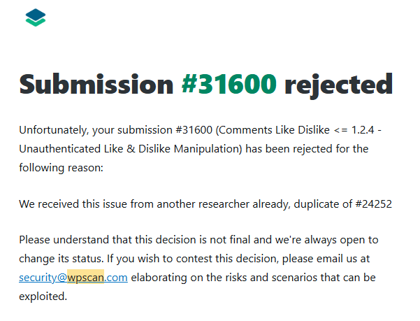
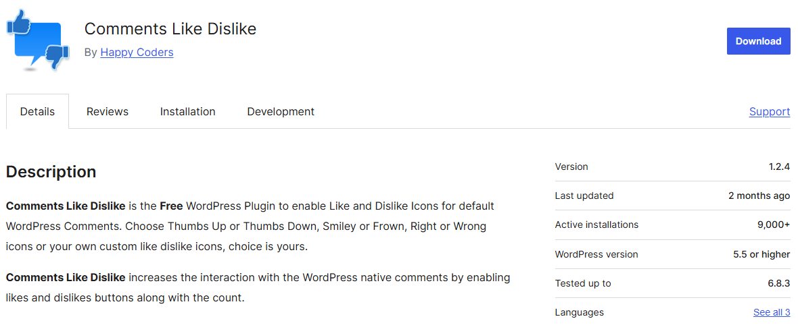
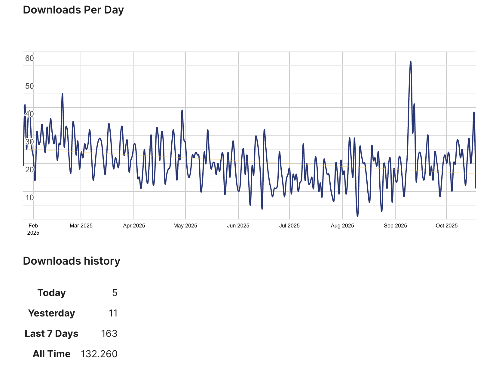
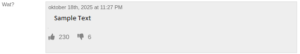
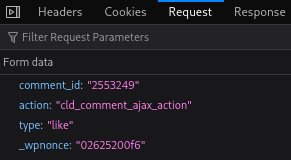
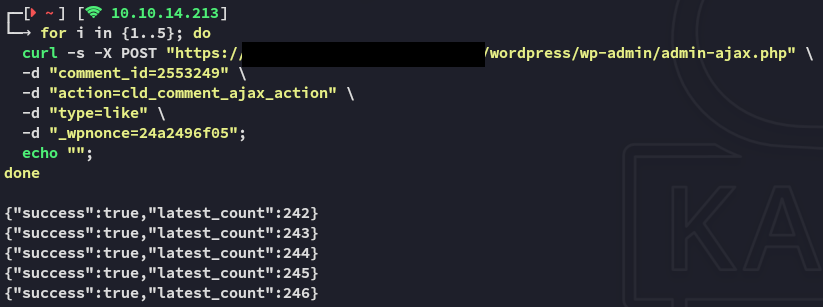
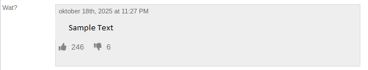

```
Authors:
Maxim Koltypin & Lars de Bruijn

Date:
19-10-2025
```

:::warning 
**17-11-2025 UPDATE**</br></br>
Despite there not being any public CVE's for this exact version of the plugin, our submission got rejected as a duplicate. Nevertheless this issue has still not been patched as this is the latest version of the plugin.


:::

# Vendor Information

**Affected Plugins**:

- https://wordpress.org/plugins/comments-like-dislike



# Summary

The `comments-like-dislike` WordPress plugin used on the site allows any unauthenticated user to repeatedly send `POST` requests to increment the like/dislike counters on comments. While this is not a direct code execution or data breach vulnerability, it has significant **social engineering implications**.

By artificially inflating likes or dislikes, an attacker can **manipulate reader perception**, making certain opinions appear overwhelmingly popular or unpopular. On a news platform, this can influence public discourse by creating a false consensus. Many readers may instinctively align with majority sentiment, or may refrain from expressing dissenting views when a comment appears heavily liked.

**Parameters**:

| Parameter  | Value                   | Description                                                         |
| ---------- | ----------------------- | ------------------------------------------------------------------- |
| action     | cld_comment_ajax_action | WordPress AJAX action triggered by the Comments Like Dislike plugin |
| comment_id | 2553249                 | Target comment ID                                                   |
| type       | like / dislike          | Type of vote                                                        |
| _wpnonce   | 24a2496f05              | Nonce value, reusable                                               |

**Sample Request**: 

```bash
POST /wordpress/wp-admin/admin-ajax.php HTTP/1.1
Accept: */*
Accept-Language: en-US,en;q=0.5
Accept-Encoding: gzip, deflate, br, zstd
Content-Type: application/x-www-form-urlencoded; charset=UTF-8
X-Requested-With: XMLHttpRequest
Content-Length: 84
Connection: keep-alive

comment_id=2553249&action=cld_comment_undo_ajax_action&type=like&_wpnonce=02625200f6
```

**Sample Response**:

```bash
HTTP/1.1 200 OK
Content-Type: text/html; charset=UTF-8
Set-Cookie: cld_2553249=like; Path=/; Max-Age=31536000; Expires=Mon, 19 Oct 2026 12:12:50 GMT

{
    "success": true,
    "latest_count": 221
}
```

**Key Evidence:**

- No authentication required, request succeeds as an unauthenticated user.
- Nonce value can be reused indefinitely.

# Impact

The ability to arbitrarily manipulate like/dislike counters on comments can undermine the **credibility and integrity of reader interactions** on the platform.

On news sites, visible popularity signals (e.g., high like counts) influence how other readers perceive comments which is a known psychological phenomenon often called **social proof** or the **bandwagon effect**.

An attacker could exploit this to:

- Artificially amplify supportive comments to make a controversial position appear widely accepted.
- Mass downvote dissenting opinions to discourage open discussion.
- Create a false sense of consensus on politically or socially sensitive news topics.

According to the below graph this plugin is still being downloaded more than 150+ times a week.



## Affected Components

- Like/Dislike counter

# Walkthrough

We found this comment section on a news website and quickly found out that we were able to like/dislike comments without logging in.



Naturally we got curious and started analysing the inner workings of the request. By checking out the **Network** tab we were able to find the request:



Using this found knowledge we started testing using `curl`:



Using `curl` we were able to manipulate the comment's likes without the need of any accounts. We were able to increment the likes indefinitely which was persistent on the backend, showing the new amount of likes on the website across multiple devices.



This could likely be due to the following source code:

```js
var already_liked = $(this).data('already-liked');
if (already_liked == 0) {
    $.ajax({
        type: 'post',
        url: cld_js_object.admin_ajax_url,
        data: {
            comment_id: comment_id,
            action: 'cld_comment_ajax_action',
            type: trigger_type,
            _wpnonce: cld_js_object.admin_ajax_nonce
        },
        ...
    });
}
```

Although the `already_liked` is stored **only in a `data` attribute on the HTML element**, an attacker can easily bypass this by:

- Using `curl` or a script that doesn’t rely on the front-end, or
- Resetting the `data-already-liked` attribute in the DOM

## Remediation

- Implement server-side validation to ensure each user can only like/dislike a comment once. 
- Do not rely on cookies or frontend state for validation checks.

## References

- https://wordpress.org/support/topic/unauthenticated-like-dislike-manipulation-in-version-1-2-4/#new-topic-0

---