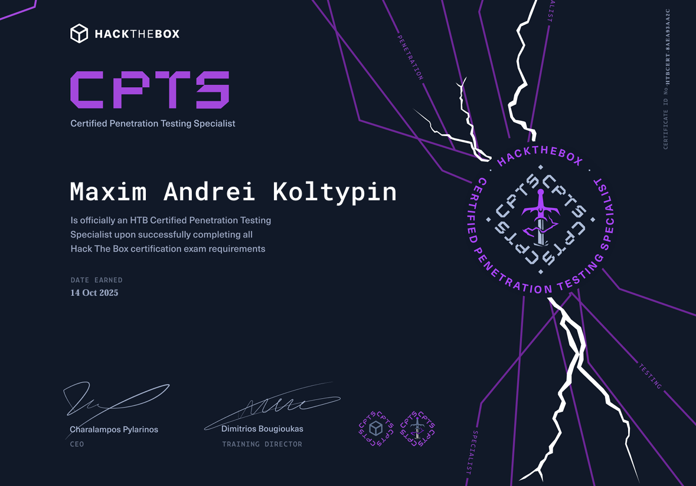
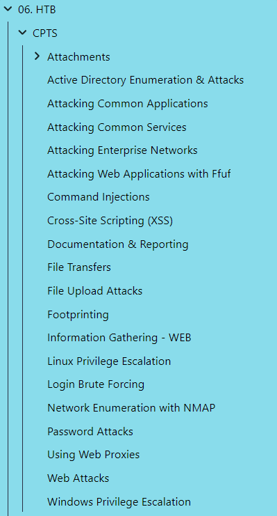
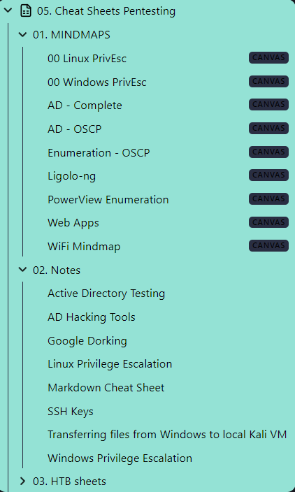
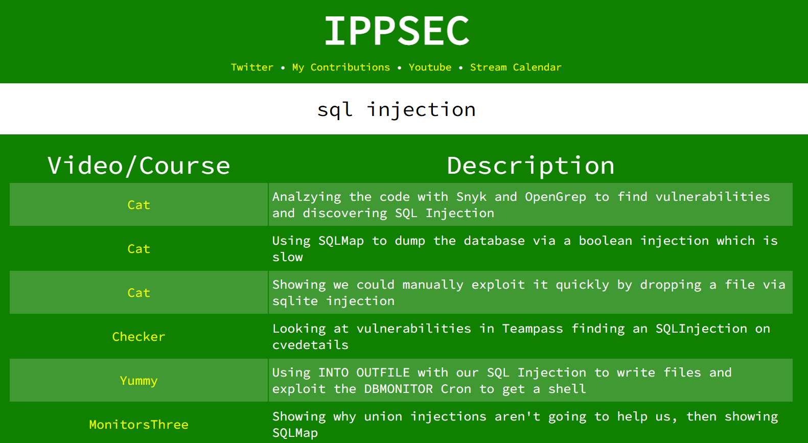
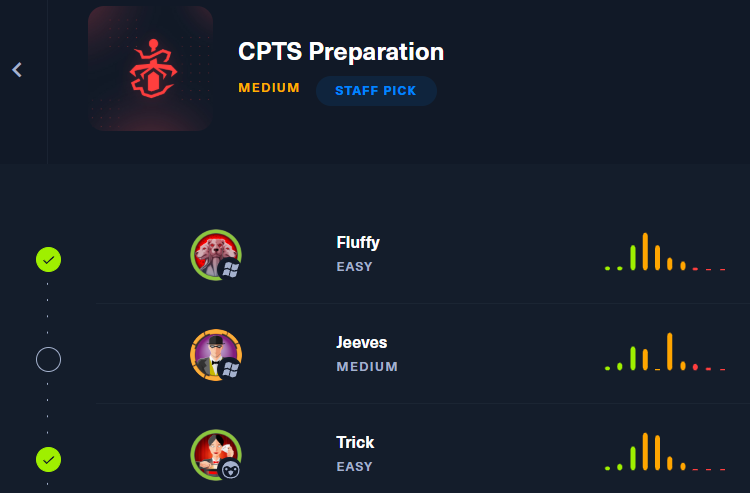

# Foreword

I passed Hack The Box’s Certified Penetration Tester Specialist (HTB CPTS) exam on my first try and so can you! While the exam is absolutely brutal and differs from anything else, it is a blast to work through and tests you on all the individual topics that were taught in the course material.

I strongly recommend this course to any aspiring penetration tester as this is the most bang for your buck course out there.

## Why CPTS?

I initially bought the [Silver Annual](https://help.hackthebox.com/en/articles/5720974-academy-subscriptions#h_227bb59d53) subscription from HTB in order to prepare for my OSCP which I passed earlier this year. In my "My Road to OSCP+" blog I talked highly of all the content that was provided in the [Penetration Tester Job role path](https://academy.hackthebox.com/path/preview/penetration-tester). 

:::note
Finishing this role path is required in order to take the exam, without 100% completion (that also means all the questions and **Skill Assessments**) you cannot attempt the exam. 
:::

While the initial plan was to buy this subscription in order to **add upon** the information that I'd acquired from the **OffSec PEN-200** syllabus, this quickly changed towards passing the CPTS certification as well. This was due to the fact that I had already completed roughly 70% of the path by the time I'd passed the OSCP, so naturally I decided to finish up the remaining modules and attempt the exam.

Upon completion of the role path I noticed distinct differences when comparing it to the PEN-200 syllabus.

- Waaay more up to date
- More in-depth and thorough modules on each topic that are excellently written
- At the end of each module you get recommended boxes where you can test your knowledge
- The modules as well as the exam go in depth on **manual** exploitation of misconfigurations, rather than looking up a proof of concept and calling it a day

The course teaches you an array of techniques and even hones in on developing your own methodology by showing you how to write good notes and how to document & report a finding in a professional and commercial-grade manner.

:::important
This is obviously a must-have for every aspiring pentester/red teamer that takes themselves seriously. Without this core knowledge we cannot expect our customer to understand what vulnerabilities we've found and exploited in their system.
:::

Some nitty-gritties that I found were lacking are as follows:

- Skill Assessments are sometimes worded poorly, leaving the student looking in the wrong place or not understanding what to exploit.
- Some modules are exhaustingly long and can be a drag to work through 
- Some topics seem repetitive as they are discussed on recurring occassions

All in all though the couse is solid and teaches you all the ins and outs of being a professional pentester, and the price/quality ratio is unbeaten.

## The Preparation
### Note Taking

For me this was actually pretty straightforward as I had simply done all the modules and wrote notes for every single module. My notes would consist of rough notes that consisted of 70-80% of the course material that I deemed important over, and more detailed notes that I structured in folders using `obsidian`.

The rough notes would sit in one folder that looked as follows:

While the detailed notes and mindmaps could be found in another one.

In the cheatsheets I had copy-paste commands with their specfic use case, this way I wouldn't have to look all over for commands and I could just quickly find and utilize the command I needed.

### Practice

Previous to the CPTS attempt I had already done over **140 boxes** from both OffSec & HTB, however this has honestly done more bad than good.
Although I had been able to hone my own methodology that I built upon the one given by HTB, I quickly found myself diving into self-made rabbit holes. I started enumerating for certain vulnerabilities that were completely out of scope or better yet, weren't even taught during the course.

It's no secret that this is why many people believe that doing the CPTS with 0 box experience is actually fine, as long as you have the knowledge and have gone over the modules multiple times.

This still leaves me pondering on how many boxes are the sweet spot, since I built most of my knowledge and skills up during the practice rather than theoretical modules. I myself believe that using [ippsec's site](https://ippsec.rocks/) by looking for certain topics relevant to the course will help you build practical knowledge. 

Furthermore there is a new (at the time of this writing) [CPTS prep track](https://app.hackthebox.com/tracks/CPTS-Preparation) available. While this did not exist prior to my exam, I can attest that I have rooted most of the boxes on the track and that they are indeed solid.

Lastly I did the [Attacking Enterprise Networks](https://academy.hackthebox.com/course/preview/attacking-enterprise-networks) blind as many have suggested, and while this is solid advice I highly advise to time this attempt and try to go into it as a practice exam.

:::warning
BEWARE that AEN is the closest thing to the exam, yet it is still vastly different! DO NOT expect the same things to work in the exam just because they worked in AEN, and vice versa.
:::

## Skills Learned 

Some of the most important skills I've either learned or improved upon by taking this course are as follows:

1. **Methodology**: This has for sure been my number one skill that I improved upon and the one that I found the PEN-200 syllabus to be severely lacking.
2. **Active Directory**: The one thing that the CPTS does miles better than it's competition is the AD part. This really sets it apart from the OSCP and definitely puts it above that course on learned knowledge and skills.
3. **Web**: This course has taught me how to properly enumerate and exploit weaknesses in websites/web applications that are either custom-made or common applications.
4. **Documentation & Reporting**: The course teaches you how to create a full fledged commercial-grade report. This is the course's strong suit as well as it's pitfall as many people have failed the exam because of an inadequate report that was not up to today's standard.

### Methodology

The course teaches every student from the get-go what their methodology looks like for every pentest.

At the time of this writing I am still working in a completely different field with no IT experience apart from the OSCP & OSWP certifications from OffSec.

You could very well call me a newbie at this point so when I was doing boxes and preparing for the OSCP I had no sort of honed methodology that I could rely on. Instead I kept sort of winging it to see where that would bring me. This method ultimately cost my first OSCP attempt and was one of the reasons why I bought the HTB subscription.

I was super pleased to find out that this course actually teaches an in-depth methodology to it's students that they can adopt. This methodology has helped me greatly during the rest of the course, when doing boxes as well as during the exam.

### Active Directory 

Active Directory is something I was already quite proficient in when I started this course and naturally wanted to find out how this differs from what I'd already picked up previously.
Needless to say that the course teaches it's students way more on this topic in comparison to for example the PEN-200. This is also the exact reason why I left the AD part alone until after passing the OSCP so I wouldn't go down some rabbit holes during that exam.

During the CPTS I encountered an AD domain that is far greater and far more extensive than I'd ever seen before. 

:::note
Since I had not done the **HTB Pro Labs** prior to the exam, I can not attest how it compares to the likes of **Dante** and **Zephyr**.
:::

The course also teaches you how to enumerate domains not just with the use of `bloodhound` but also with the use of `powerview`, `ldapsearch`, `netexec` amongst others.

The AD part was also my absolute favorite on the exam as it expected me to think way out of the box and brought me out of my comfort zone. 

### Web

In contrary to others web enumeration and exploitation has been my weak point from the start. I had always excelled in both low-priv Linux and Windows/AD hacking as well as privilege escalation but was usually struggling to get a foothold beforehand through the web apps/sites.

Luckily the course does an amazing job at teaching students what to look for, what tools to use and how to exploit any and all vulnerabilities relevant to the exam. Some of the web focused vulnerabilities the course had tought me are:

- Cross-Site Scripting (XSS)
- Local File Inclusion (LFI)
- SQL Injection (SQLi)
- File Upload Attacks
- Command Injection
- Authorization & Authentication Attacks
- HTTP Verb Tampering
- Login Brute Forcing
- Insecure Direct Object Referencing (IDOR)
- XML External Entity (XXE)

On top of that the course teaches the students how to compromise and exploit certain Content Management Systems (CMS), Web Servers, Development and Deployment Tools, Ticketing Systems and Monitoring applications.

The key difference I'd noticed here was that HTB actually teaches you what to look for instead of just showcasing the vulnerabilities and how they're exploited. Each vulnerability is explained in detail and the students are taught on how to prevent said vulnerability.
This is of course one of the most important parts since the student will be able to explain to the customer how to fix the vulnerability in their website/web app.

### Documentation & Reporting

At the end of the day what differentiates a black hat with a white hat hacker is the fact that the white hat is hacking the systems for a legitimate customer who wants to improve their infrastructure. The best way to convey our findings for the customer is by putting them all in a neat and readable report so that they can get actionable information out of it.

Without a good report the customer will be just as clueless as beforehand so it is our job to make it well structured and understandable.

Luckily the course also teaches this and tells us about specific tools that simplify the process such as [SysReptor](https://docs.sysreptor.com/).

## Recommendations for the exam
### Toolset

The following tools were an absolute must-have for me and I made sure that I was proficient with all of them before attempting the exam.

**Active Directory** specific tools:
- `ligolo-ng`
- `kerbrute`
- `bloodhound-ce` & `bloodhound-ce-python`
- `bloodyAD`
- `powerview`
- `inveigh` & `responder`
- `rpcclient`
- `rubeus`
- `ldapsearch`
- `windapsearch`

Other tools for both **Windows** and **Linux** included:
- `winpeas`
- `linpeas`
- `pspy`
- `mimikatz`
- `impacket`

The above are only a handful of tools of many others that I had used in either day to day boxes, during the modules, or even during the exam.
