#### What is "wardriving"?

Wardriving **involves attackers searching for wireless networks with vulnerabilities while moving around an area in a moving vehicle**. They use hardware and software to discover unsecured Wi-Fi networks then gain unauthorized access to the network by cracking passwords or decrypting the router. This is especially useful during initial *Reconnaissance*. 

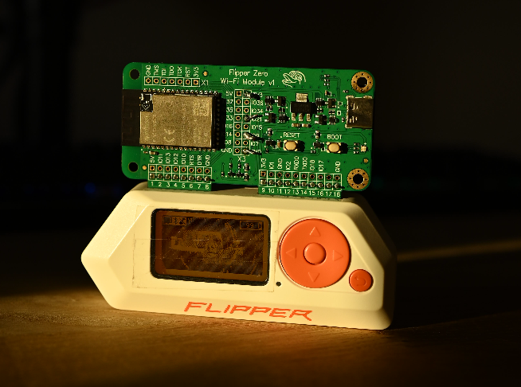

# Prerequisites
## Hardware 

This can be performed with all sorts of hardware, but in the case of this blog I will be using the following tools:

- [Flipper Zero](https://shop.flipperzero.one/) (€229,00) 

- [ESP32-S2-WROVER (WiFi dev board)](https://shop.flipperzero.one/products/wifi-devboard) (€42,00)

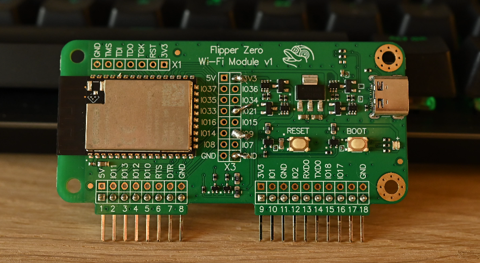

- [GY-NEO-6M V2 (GPS module) ](https://nl.aliexpress.com/item/1005007371769611.html?src=google&gatewayAdapt=glo2nld) (there's a bunch of retailers but these are all nearly identical)

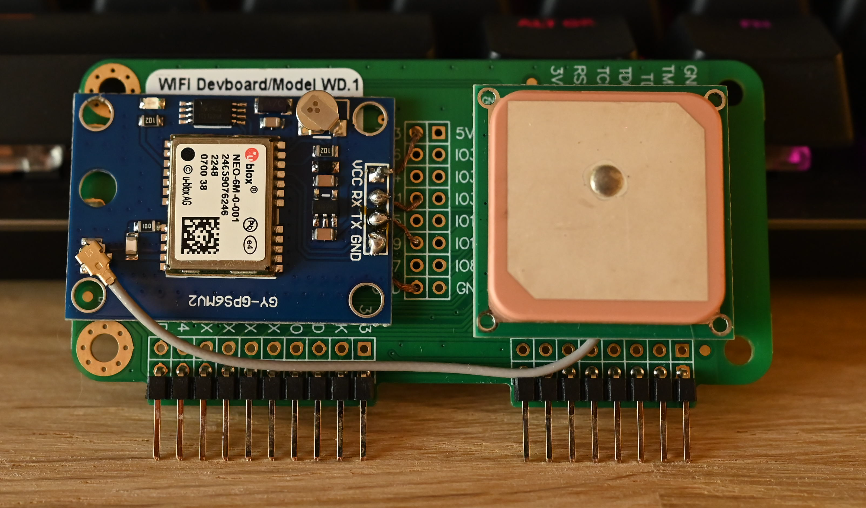

>The exact schematics for soldering the GPS onto the WiFi devboard will be displayed further down. 

## Software

Any Flipper firmware will do, as long as it contains the `[ESP32] WiFi Marauder` application. I will be using [Momentum Firmware](https://github.com/Next-Flip/Momentum-Firmware) along with my self made [DrivePy](https://github.com/MaxK9999/DrivePy) script which I'll be using to map the `.csv` output with. 

Simply head on over to **Releases** and click on **Web Updater**, plug the Flipper in and you can flash the firmware through the browser.

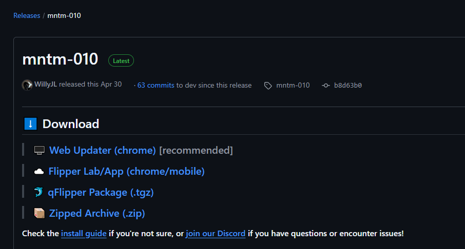

:::note
This blog was written on **mntm-010**, it might vary in the future
:::

You will also have to flash the **WiFi dev board** using a 3rd party Marauder firmware, the guide can be found [here](https://github.com/justcallmekoko/ESP32Marauder/wiki/flipper-zero#installation).

:::important
DO NOT SKIP THE ABOVE STEP, IT WON'T WORK WITHOUT IT!
:::

# Setting up the wardriving rig
## Soldering

Taking in account that you have completed the [[#Prerequisites]] we can get on with soldering the NEO-6M GPS module to the back (or wherever to your preference) of the WiFi dev board.

:::disclaimer
I myself have never soldered beforehand and was quite nervous, you don't have to be, it is really easy. If it looks like you're going to screw something up it is most likely easily reversible.
:::

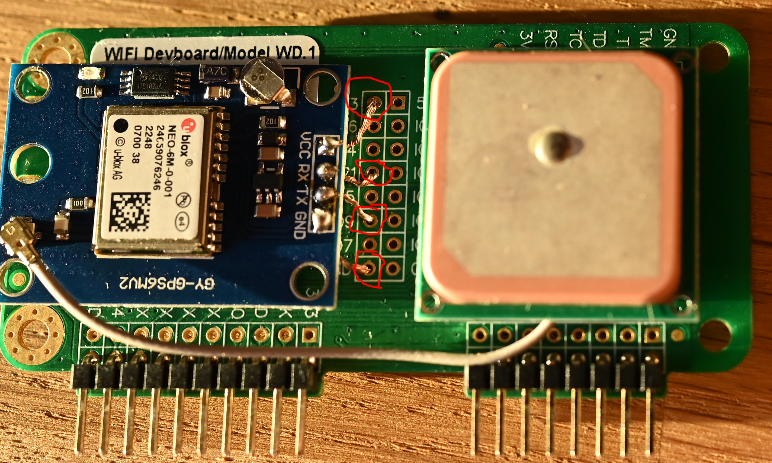

Above you will see the contact points that the copper wiring was stuck to, this is non-optional, these are the exact points they need to be soldered to.

Below you will see it from the front.

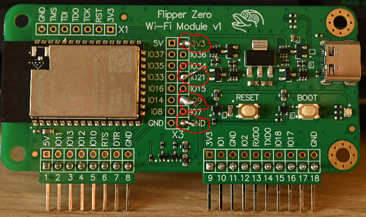

:::note 
As mentioned before, my soldering skills are far from the best.
:::

The points of contact will have to be connected as per the table below:

| WiFi dev board | NEO-6M GPS module |
| -------------- | ----------------- |
| 3V3            | VCC               |
| IO21           | RX                |
| IO9            | TX                |
| GND            | GND               |

Once it was soldered down I stuck the GPS and the antenna in place using double sided adhesive tape.

:::note
If you have a 3D printer or access to one, you can go ahead and print out a case for the board in order to protect it. Keep in mind that the dev board now has a GPS stuck to the back. You can find some on [this site](https://www.yeggi.com/q/flipper+zero+dev+board/).
:::

## Testing the GPS

Before we start off wardriving we'll want to run **ESP32 Marauder** -> **GPS Data** -> **Stream** to check whether it is getting a GPS feed (we'll want at least 4 sattelite fixes for accurate readings).

You'll notice when the GPS is getting hits when the blue light on the module starts flickering:

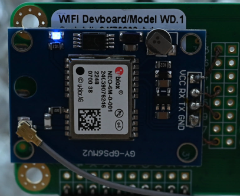

If it is *not* flickering, you might have to step further outside or away from tall buildings and trees. 

We will now continue on to the mentioned **GPS Data**:

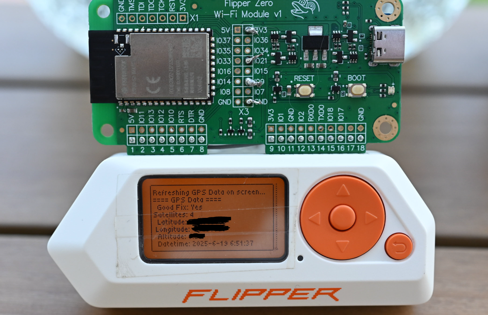

We notice that we have a good enough sattelite fix, let's get onto the fun part.

# Wardriving
## Collecting wardriving data

Inside the same menu within **ESP32 Marauder** we will head on over to **Wardrive** where we can choose from multiple options, first one being **ap** or Access Points:

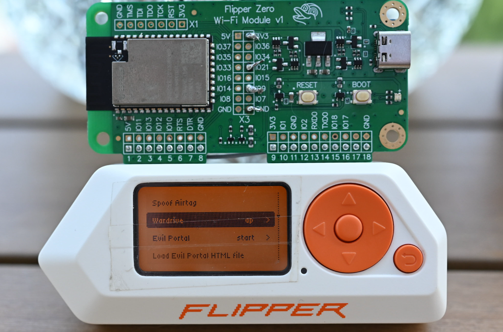

Once we click on it, it will start collecting data from all the nearest WiFi access points and will give them a GPS fix.

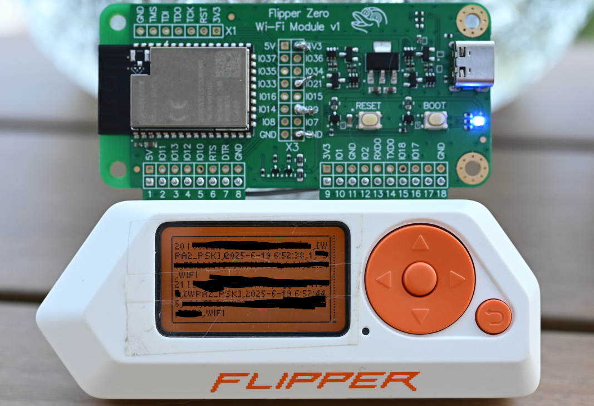

Once we have all our data collected we can exit the screen using the return button, and we can save all the data to the SD card.

## Parsing and mapping wardriving data

A more common approach would be to use [wigle.net](https://wigle.net/) to upload your data. Since this was a little hobby project for me however I decided to write a [Python script](https://github.com/MaxK9999/DrivePy) instead that would parse this data and showcase it on a map. To do this we start up the **qFlipper** software:

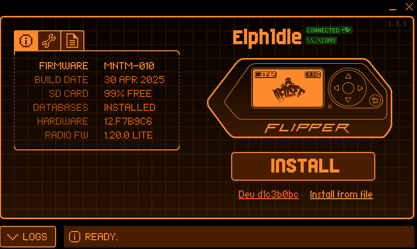

Here we will head on over to **SD Card** -> **apps_data** -> **marauder** -> **logs** where we will find our wardrive logs:

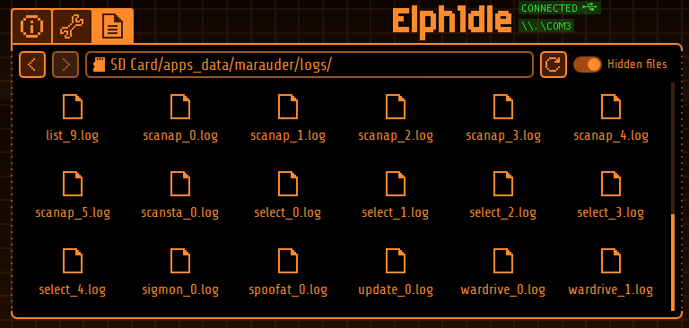

We can now save these files and they should looks something like this:

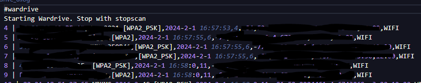

Now we will feed this file to the **DrivePy** script which will put these access points neatly on a map:

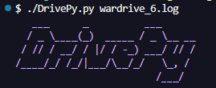

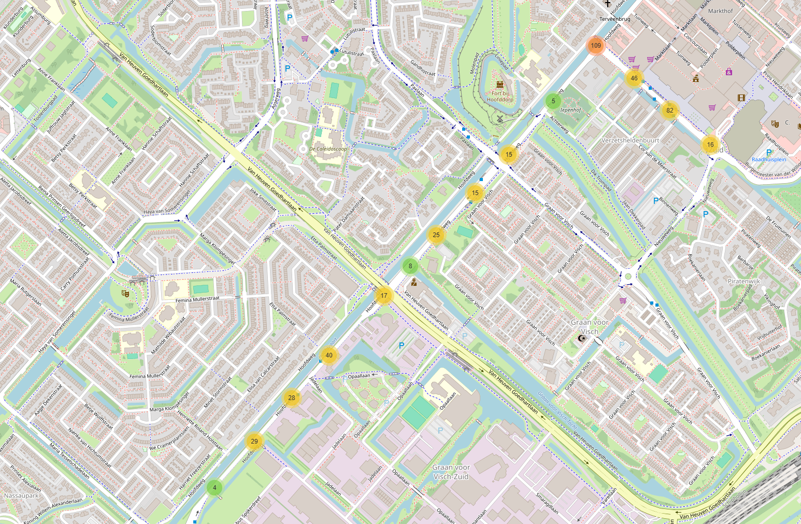

We can view the individually found ap's on the map, along with all their data.

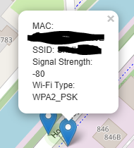

Furthermore we can use different sorts of parsing arguments in order to get a different output. 

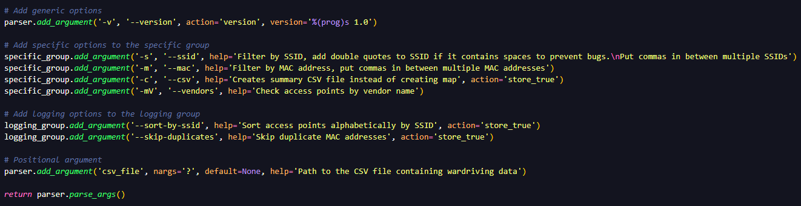

We can for example create a summary CSV instead of creating a map:

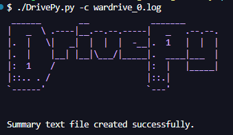

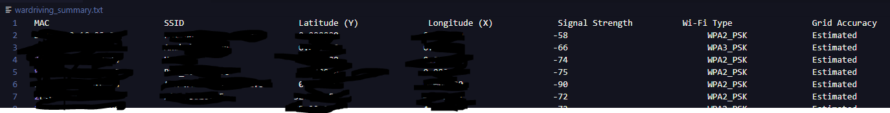

:::note 
This tool is also compatible with `kismet` as it has the same `.csv` text files, just upload the data and it should work just as fine.
:::

# References Used

In order to write this blog I used the following references:

- [This super handy youtube video](https://www.youtube.com/watch?v=pFtKAacSGbg&t=2s)
- [JustCallMeKoko GitHub page](https://github.com/justcallmekoko/ESP32Marauder/wiki/flipper-zero)

Possibly some other ones as well, but I built this project almost 2 years ago so I might've forgotten by now.