---
title: 'HTB-Administrator'
published: 2025-09-15
draft: false
toc: true
---


```
Scope:
10.10.11.42

Credentials:
Olivia
ichliebedich
```

# Recon
## Nmap

```bash
sudo nmap -sV -sC -sT -p- 10.10.11.42 -T5 --min-rate=5000 -vvvv -Pn

PORT      STATE SERVICE       REASON  VERSION
21/tcp    open  ftp           syn-ack Microsoft ftpd
| ftp-syst: 
|_  SYST: Windows_NT
53/tcp    open  domain        syn-ack Simple DNS Plus
88/tcp    open  kerberos-sec  syn-ack Microsoft Windows Kerberos (server time: 2025-09-15 16:40:38Z)
135/tcp   open  msrpc         syn-ack Microsoft Windows RPC
139/tcp   open  netbios-ssn   syn-ack Microsoft Windows netbios-ssn
389/tcp   open  ldap          syn-ack Microsoft Windows Active Directory LDAP (Domain: administrator.htb0., Site: Default-First-Site-Name)
445/tcp   open  microsoft-ds? syn-ack
464/tcp   open  kpasswd5?     syn-ack
593/tcp   open  ncacn_http    syn-ack Microsoft Windows RPC over HTTP 1.0
636/tcp   open  tcpwrapped    syn-ack
3268/tcp  open  ldap          syn-ack Microsoft Windows Active Directory LDAP (Domain: administrator.htb0., Site: Default-First-Site-Name)
3269/tcp  open  tcpwrapped    syn-ack
5985/tcp  open  http          syn-ack Microsoft HTTPAPI httpd 2.0 (SSDP/UPnP)
|_http-server-header: Microsoft-HTTPAPI/2.0
|_http-title: Not Found
9389/tcp  open  mc-nmf        syn-ack .NET Message Framing
47001/tcp open  http          syn-ack Microsoft HTTPAPI httpd 2.0 (SSDP/UPnP)
|_http-server-header: Microsoft-HTTPAPI/2.0
|_http-title: Not Found
49392/tcp open  ncacn_http    syn-ack Microsoft Windows RPC over HTTP 1.0
49397/tcp open  msrpc         syn-ack Microsoft Windows RPC
49404/tcp open  msrpc         syn-ack Microsoft Windows RPC
49422/tcp open  msrpc         syn-ack Microsoft Windows RPC
49664/tcp open  msrpc         syn-ack Microsoft Windows RPC
49665/tcp open  msrpc         syn-ack Microsoft Windows RPC
49666/tcp open  msrpc         syn-ack Microsoft Windows RPC
49668/tcp open  msrpc         syn-ack Microsoft Windows RPC
63997/tcp open  msrpc         syn-ack Microsoft Windows RPC
Service Info: Host: DC; OS: Windows; CPE: cpe:/o:microsoft:windows
```

## enum4linux

```bash
enum4linux-ng -U 10.10.11.42 
```

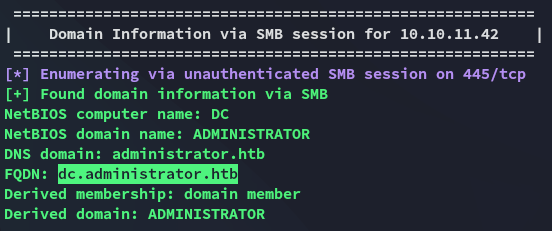

# Foothold
## evil-winrm - Olivia

I did some other enum as well before ultimately logging in via `evil-winrm` using the provided creds for *Olivia*:


Here I started doing some recon on the target:

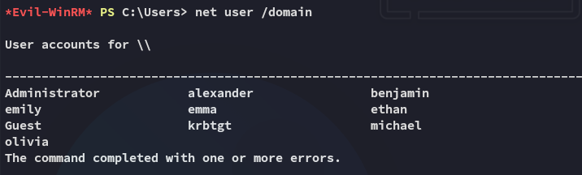

## BloodHound

In order to map the domain I used `bloodhound-ce-python`:

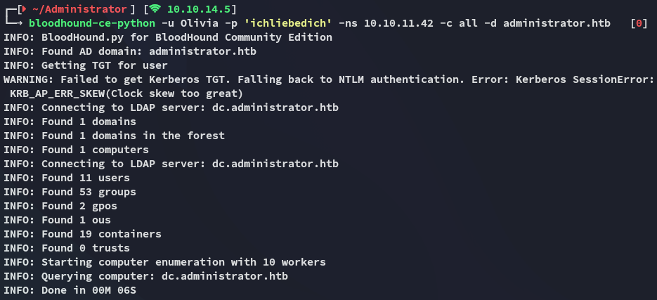

I uploaded the resulting files to `bloodhound-ce` and checked it out.

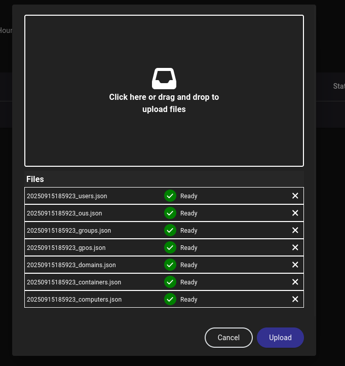

I had a clear path written out to follow:

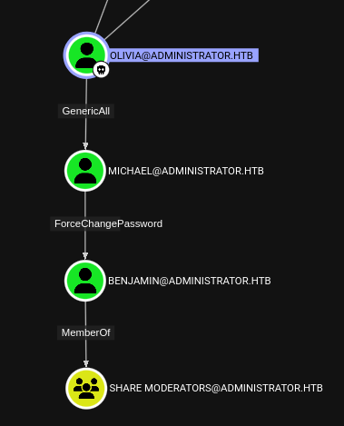

### GenericAll

First things first I had to take over *michael*'s user by abusing the **GenericAll** GPO.

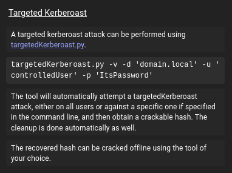

I used the following command for a targeted kerberoast:

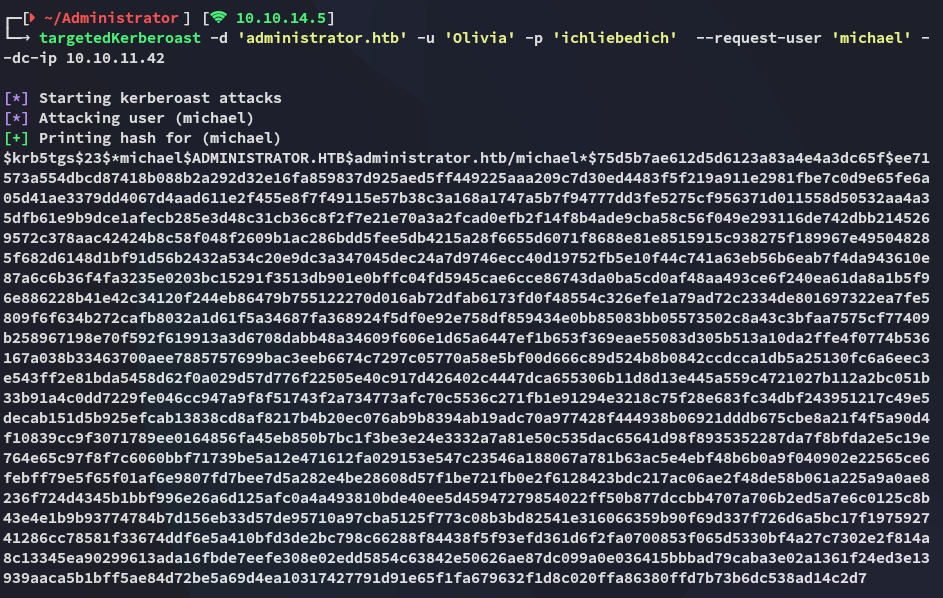

Unfortunately the hash could not be cracked by `john`:

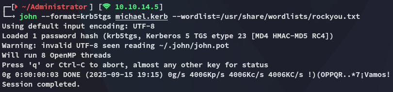

Instead I successfully changed *michael*'s password using `bloodyAD`:

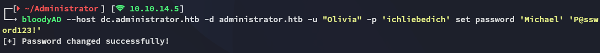

```
Michael
P@ssword123!
```

### ForceChangePassword

I could now do the exact same but for the *Benjamin* user:

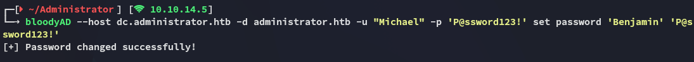

```
Benjamin
P@ssword123!
```

## 445/TCP - SMB

I used the `spider_plus` extension on `nxc` to quickly spider the shares:

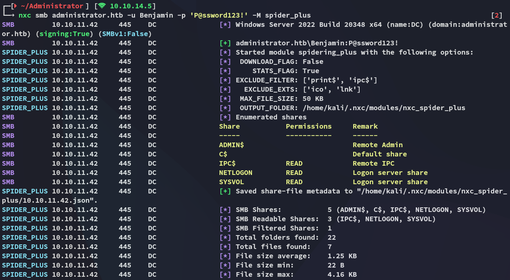

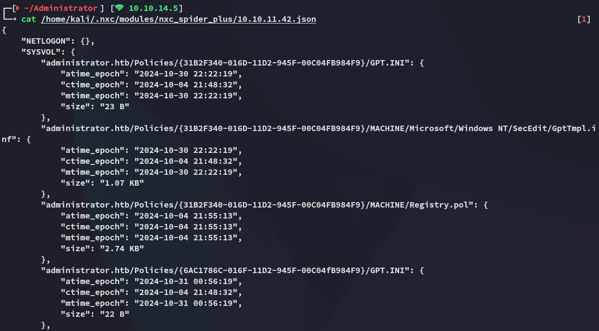

And this one looked interesting as well:

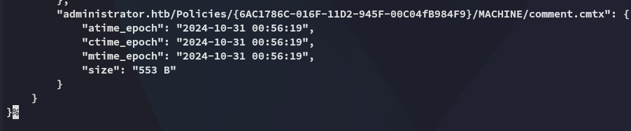

I logged into `\SYSVOL`:

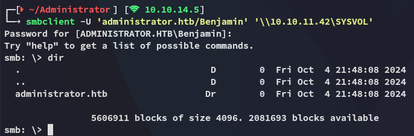

I downloaded the files that I deemed were of interest:

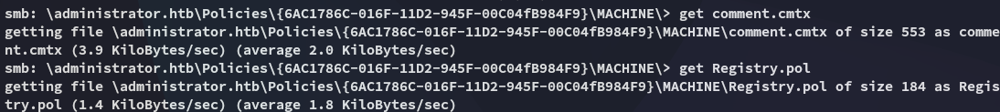

These however didn't look promising at all:

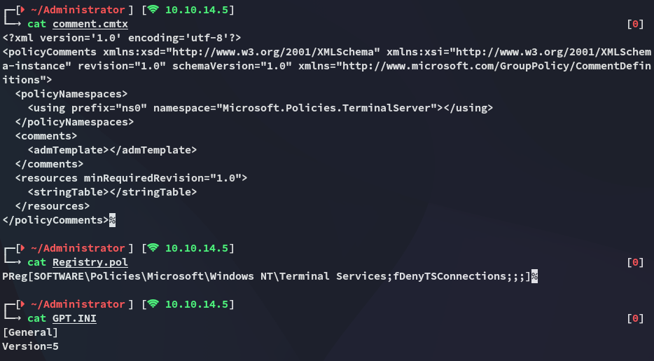

This seemed like a rabbit hole, time to explore different routes.

## 21/TCP - FTP

I logged in with the creds for *Benjamin* into `ftp`:

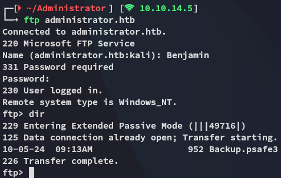

Here I found an interesting `Backup.psafe3` file which I downloaded to my Kali:

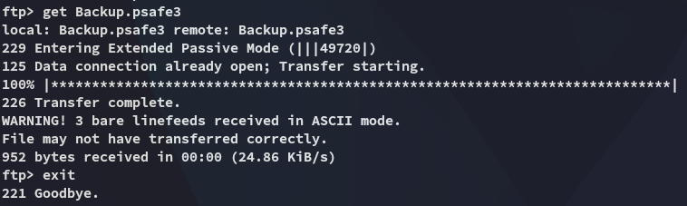

### john 

I easily cracked the password:

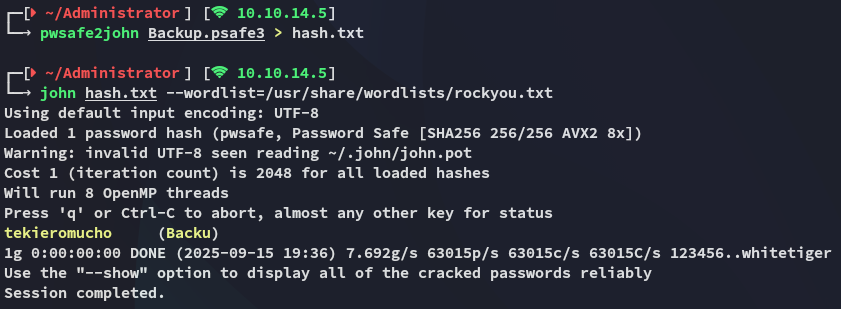

```
tekieromucho
```

## Psafe3 

I download the following binary in order to view the password manager:

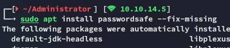

I then used the cracked password to log in:

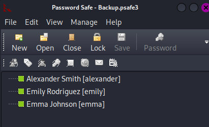

### creds

```
alexander
UrkIbagoxMyUGw0aPlj9B0AXSea4Sw
```

```
emily
UXLCI5iETUsIBoFVTj8yQFKoHjXmb
```

```
emma
WwANQWnmJnGV07WQN8bMS7FMAbjNur
```

I then went ahead and password sprayed these creds to see which one would stick:

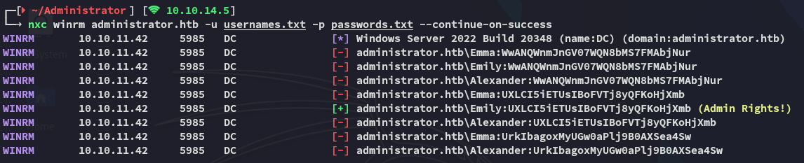

Looks like we can use *Emily* to log in.

### user.txt

I logged in with the credentials for *Emily* and got the flag.

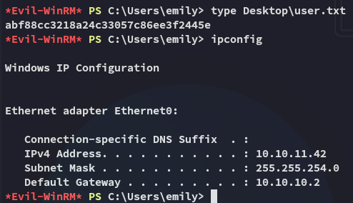

## GenericWrite

I didn't hold any interesting privs but I still checked my GPO's in `bloodhound` where I found that I had `GenericWrite` privs over *Ethan*:

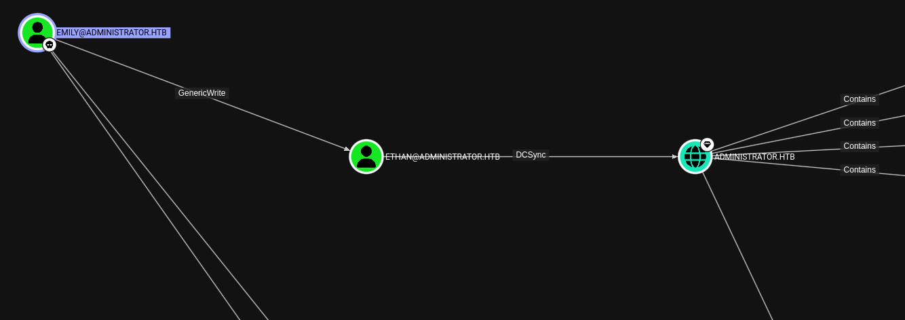

I can use a targeted kerberoast to get the `krb5tgs` hash for *Ethan*.

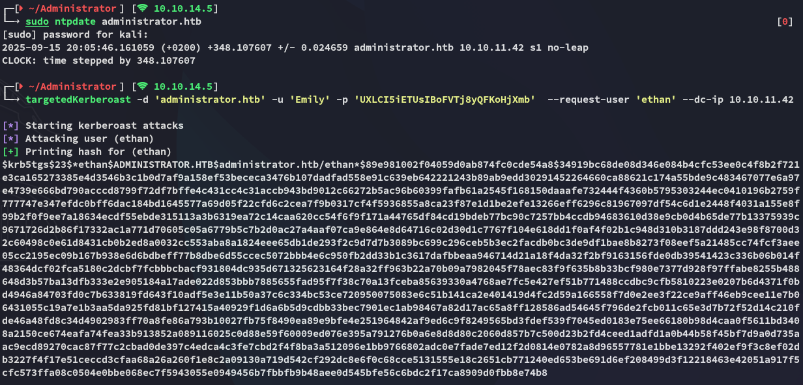

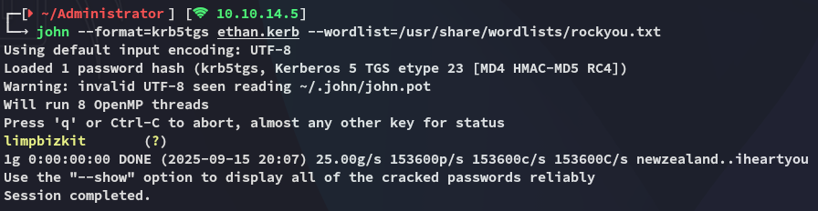

```
Ethan
limpbizkit
```

# Privilege Escalation
## DCSync

Now that I had *Ethan*'s creds I could easily abuse the `DCSync` privileges in combination with `impacket-secretsdump`:

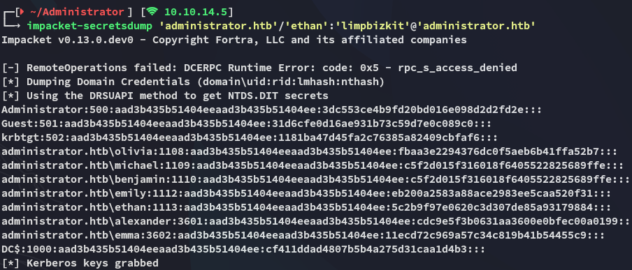

And then use `impacket-psexec` to log in using the Admin hash:

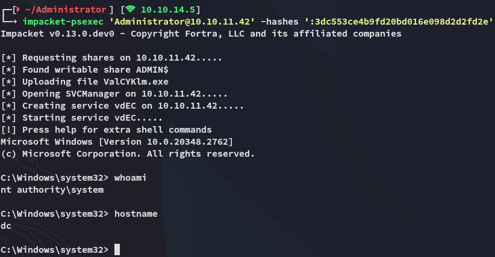

### root.txt

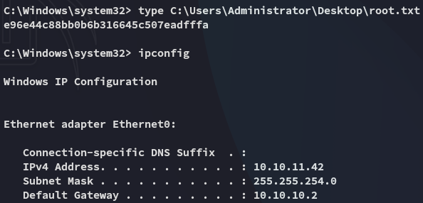


---