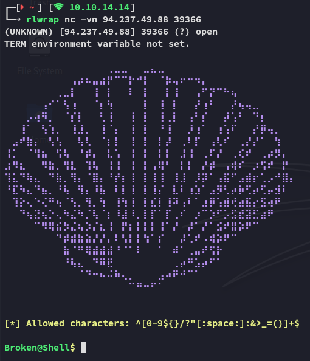
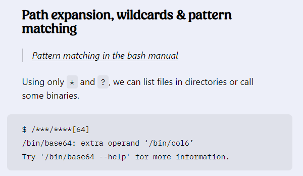
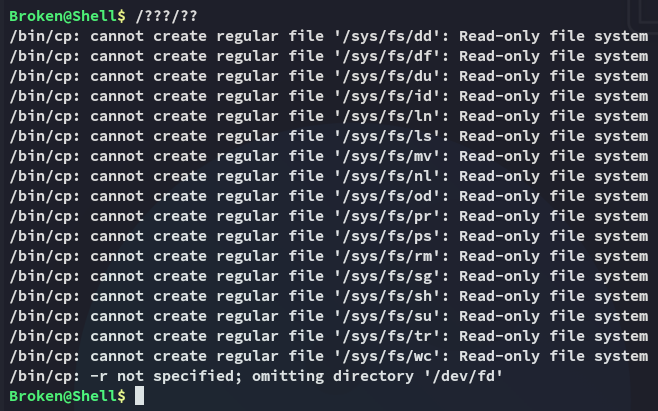
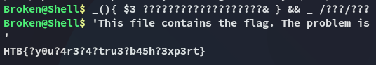

```
Scope:
94.237.49.88:39366
```

I was able to easily connect to the service using `nc -vn`:



Here I noticed that the following characters were whitelisted, and that they did not contain any *letters*.

```bash
[*] Allowed characters: ^[0-9${}/?"[:space:]:&>_=()]+$
```

This meant I'd need to think outside of the box with my enumeration, for example:

- Regular commands such as `ls -la` will not work.


Since I want to enumerate the current working directory I can use [this blog post](https://jrb.nz/posts/bash-tricks/) to find useful `bash` commands that don't involve letters.



I tried the above but found the following error:



If we try to execute the above command, the shell expands it to _every_ matching file (like `/bin/cp`, `/bin/ls`, `/bin/rm`) and tries to run the first one with the others as arguments. After some testing I found that the `/bin/ls` binary was in **7th** which meant I could use the following command to execute it: 

```bash
_(){ $7& } && _ /???/??
```


Accordingly I found that the `/bin/cat` command was **3rd**, meaning I could execute it along with the `?` wildcard operator for the duration of the flag file:

```bash
_(){ $3 ???????????????????& } && _ /???/???
```




---