---
title: 'HTB-Delivery'
published: 2025-09-16
draft: false
toc: true
tags: ['WeakCredentials', 'TicketTrick']
---

---
```
Scope:
10.10.10.222
```

# Recon
## Nmap

```bash
sudo nmap -sV -sC -sT -p- 10.10.10.222 -T5 --min-rate=5000 -vvvv -Pn

PORT     STATE SERVICE REASON  VERSION
22/tcp   open  ssh     syn-ack OpenSSH 7.9p1 Debian 10+deb10u2 (protocol 2.0)
80/tcp   open  http    syn-ack nginx 1.14.2
|_http-title: Welcome
|_http-server-header: nginx/1.14.2
| http-methods: 
|_  Supported Methods: GET HEAD
8065/tcp open  http    syn-ack Golang net/http server
| http-methods: 
|_  Supported Methods: GET
|_http-favicon: Unknown favicon MD5: 6B215BD4A98C6722601D4F8A985BF370
| http-robots.txt: 1 disallowed entry 
|_/
|_http-title: Mattermost
| fingerprint-strings: 
|   FourOhFourRequest: 
|     HTTP/1.0 200 OK
|     Accept-Ranges: bytes
|     Cache-Control: no-cache, max-age=31556926, public
|     Content-Length: 3108
|     Content-Security-Policy: frame-ancestors 'self'; script-src 'self' cdn.rudderlabs.com
|     Content-Type: text/html; charset=utf-8
|     Last-Modified: Tue, 16 Sep 2025 06:22:01 GMT
|     X-Frame-Options: SAMEORIGIN
|     X-Request-Id: zoepm6m5st8zpydro6dgggprch
|     X-Version-Id: 5.30.0.5.30.1.57fb31b889bf81d99d8af8176d4bbaaa.false
|     Date: Tue, 16 Sep 2025 07:10:40 GMT
|     <!doctype html><html lang="en"><head><meta charset="utf-8"><meta name="viewport" content="width=device-width,initial-scale=1,maximum-scale=1,user-scalable=0"><meta name="robots" content="noindex, nofollow"><meta name="referrer" content="no-referrer"><title>Mattermost</title><meta name="mobile-web-app-capable" content="yes"><meta name="application-name" content="Mattermost"><meta name="format-detection" content="telephone=no"><link re
|   GenericLines, Help, RTSPRequest, SSLSessionReq: 
|     HTTP/1.1 400 Bad Request
|     Content-Type: text/plain; charset=utf-8
|     Connection: close
|     Request
|   GetRequest: 
|     HTTP/1.0 200 OK
|     Accept-Ranges: bytes
|     Cache-Control: no-cache, max-age=31556926, public
|     Content-Length: 3108
|     Content-Security-Policy: frame-ancestors 'self'; script-src 'self' cdn.rudderlabs.com
|     Content-Type: text/html; charset=utf-8
|     Last-Modified: Tue, 16 Sep 2025 06:22:01 GMT
|     X-Frame-Options: SAMEORIGIN
|     X-Request-Id: 3qwkqzys5fnx9p7x5c44z3pbje
|     X-Version-Id: 5.30.0.5.30.1.57fb31b889bf81d99d8af8176d4bbaaa.false
|     Date: Tue, 16 Sep 2025 07:10:24 GMT
|     <!doctype html><html lang="en"><head><meta charset="utf-8"><meta name="viewport" content="width=device-width,initial-scale=1,maximum-scale=1,user-scalable=0"><meta name="robots" content="noindex, nofollow"><meta name="referrer" content="no-referrer"><title>Mattermost</title><meta name="mobile-web-app-capable" content="yes"><meta name="application-name" content="Mattermost"><meta name="format-detection" content="telephone=no"><link re
|   HTTPOptions: 
|     HTTP/1.0 405 Method Not Allowed
|     Date: Tue, 16 Sep 2025 07:10:25 GMT
|_    Content-Length: 0
Service Info: OS: Linux; CPE: cpe:/o:linux:linux_kernel
```

## 80/TCP - HTTP

I went on over to the website and found this:

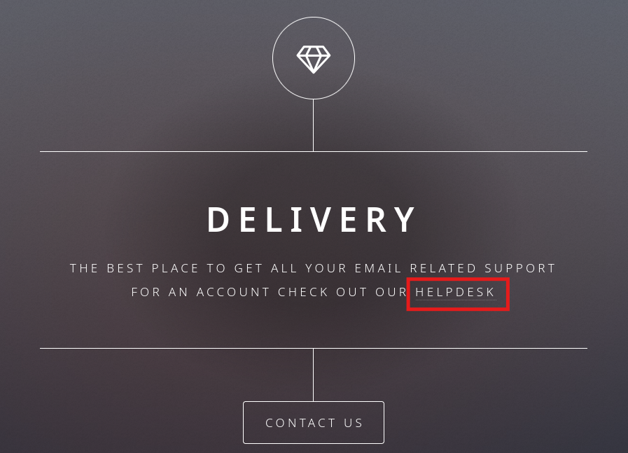

When clicking on it it takes us to `helpdesk.delivery.htb`, which means that I have to add a vhost to my `/etc/hosts` list.

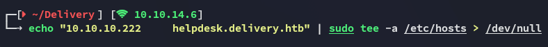

Now when I run `gobuster` I find some interesting endpoints:

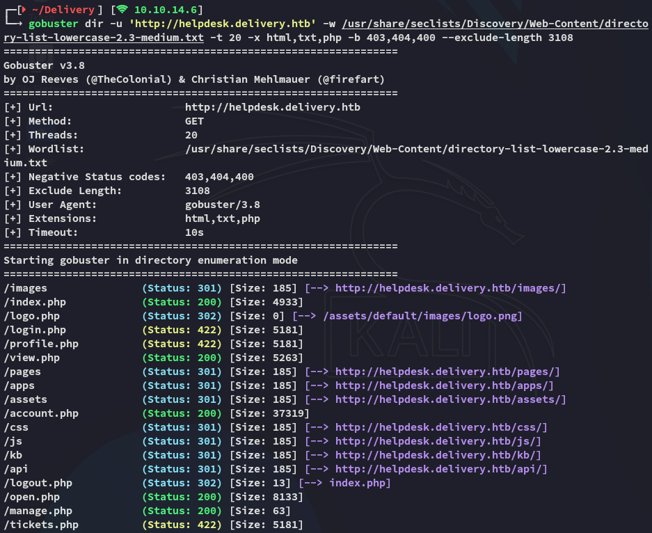

Heading on over to the vhost I find the following:

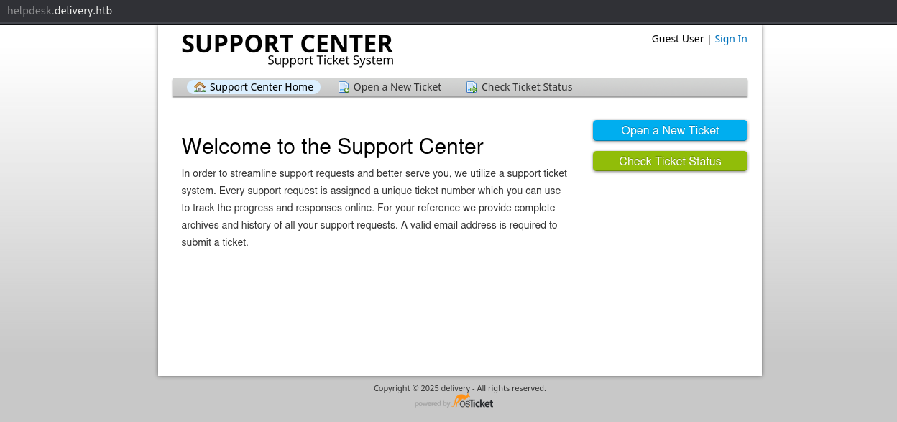

### burpsuite

In **Check Ticket Status** there's a mention of registering an account so I try it out.

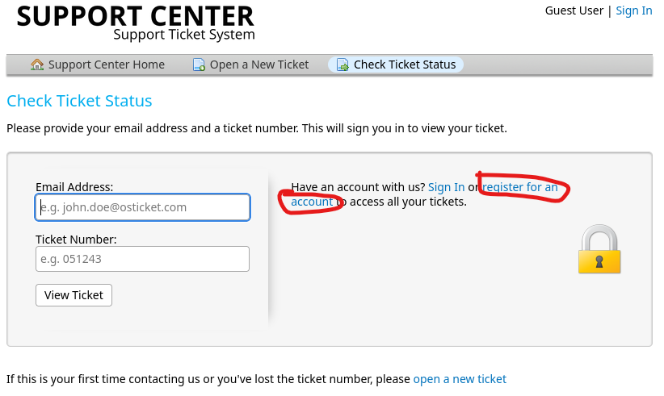

Clicking on it I see this URL:


>[!note]
>It might be vulnerable to IDOR, SQLi or LFI in the best case.

I registered for a sample account and checked `burp`:

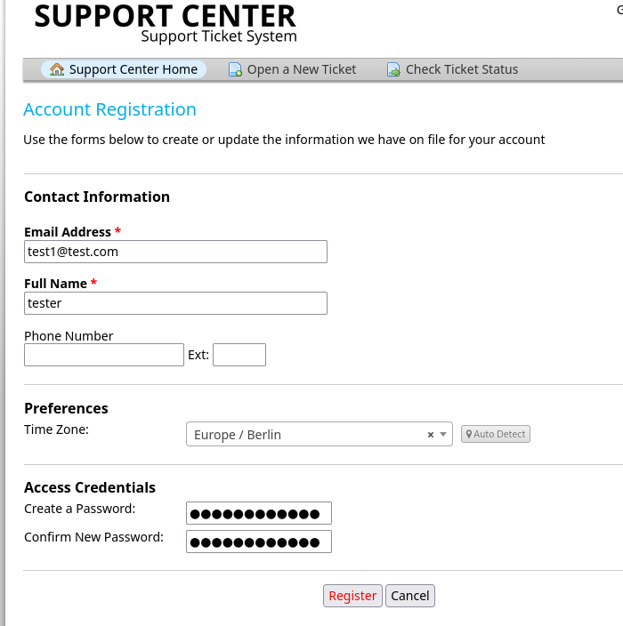

But this tells us that we need to verify the email, nonetheless we can continue on as the *Guest* user.

I could then create and submit a ticket:

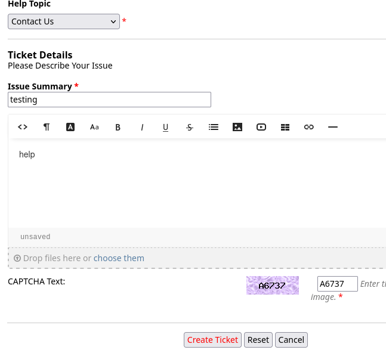

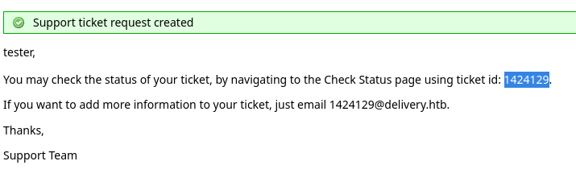

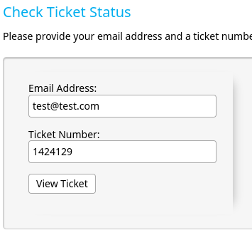

I could then view the ticket:

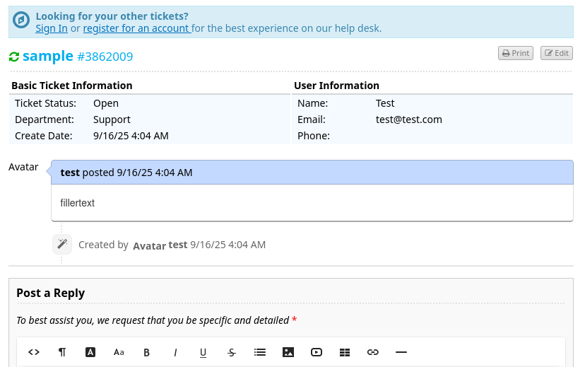

## 8065/TCP - HTTP

I then went on over to the **Mattermost** instance on port `8065` where I could register using the provided email address when I created the ticket:

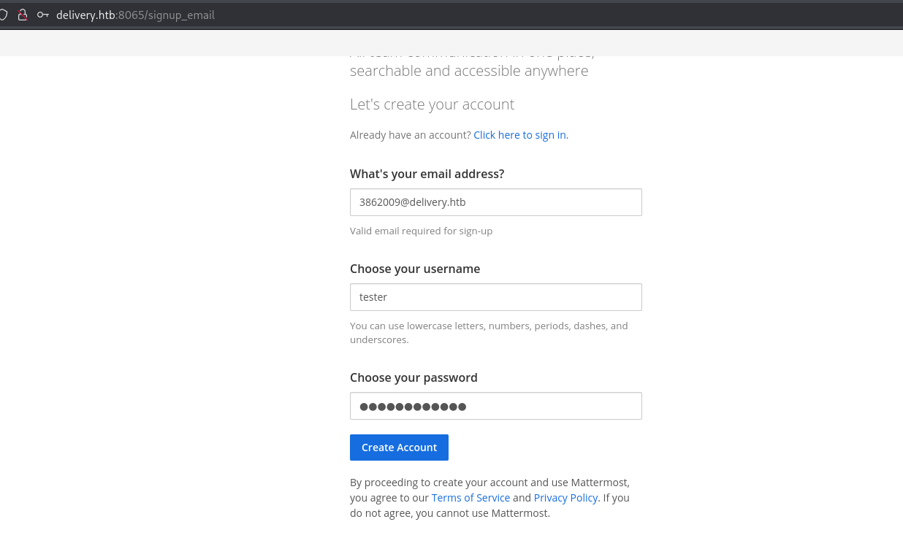

Back on port `80` I can now refresh the page and see the following content appear:

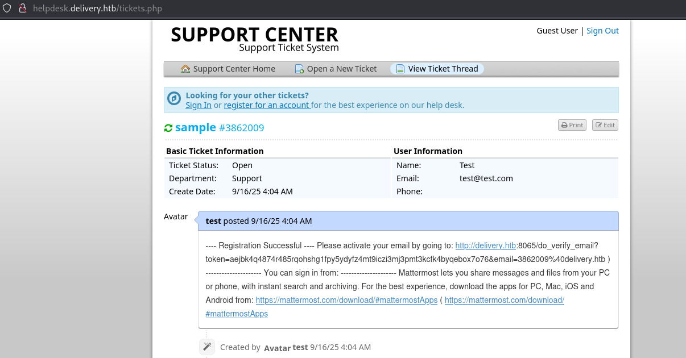

I copy and paste the link and see this:

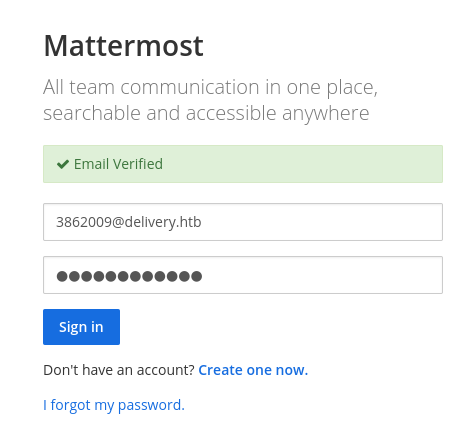

I was able to join the **Internal** team server where I found the following conversations:

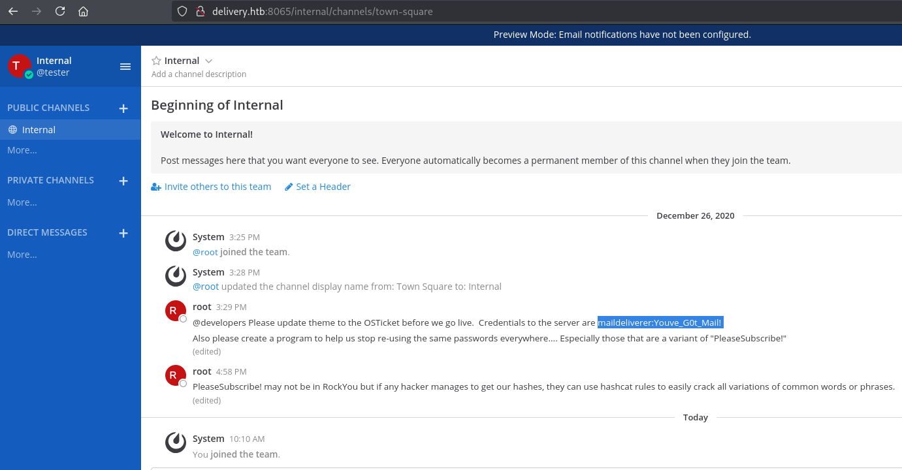

```
maildeliverer
Youve_G0t_Mail!
```

# Foothold
## SSH as maildeliverer

I log in with the found credentials.

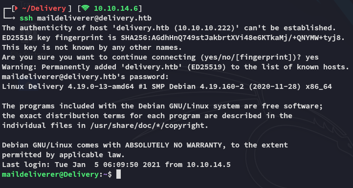

### user.txt

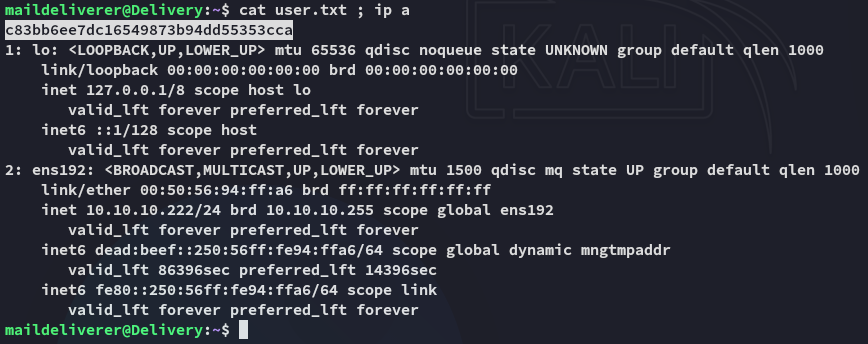

Inside the `/opt` directory I find the `mattermost` folder.

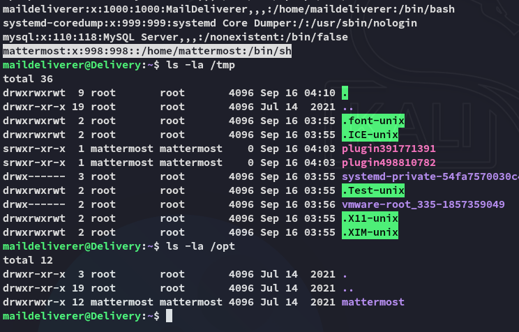

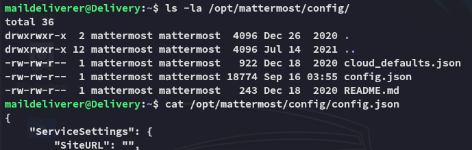

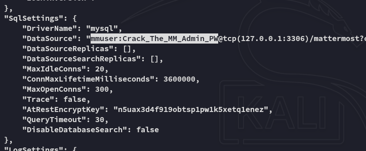

```
mmuser
Crack_The_MM_Admin_PW
```

## 3306/TCP - MySQL

Using the found creds I logged in:

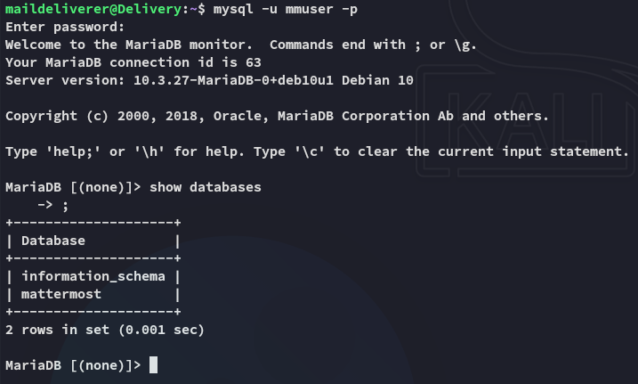

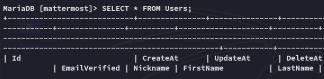

This gave an absolute boatload of output.

Amongst all the noise however I was also able to find *root*:

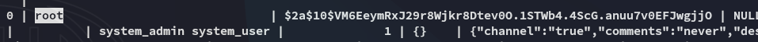

# Privilege Escalation
## hashcat - rule based

I used hashcat with the `best64.rule` to crack the hash:

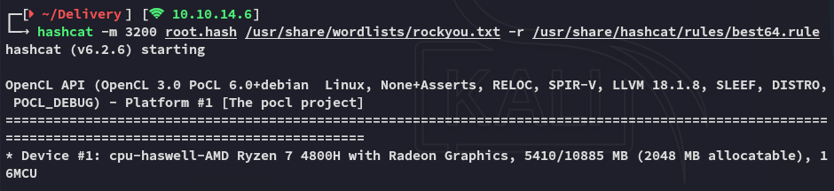

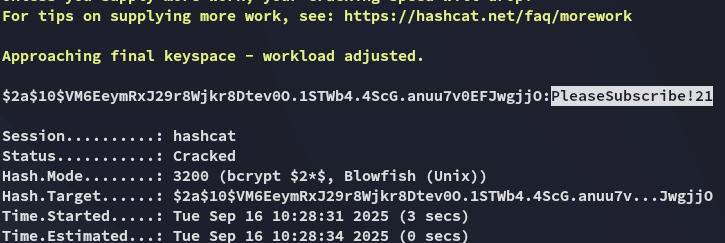

It was simply a variation on the cleartext password that we've already found previously in the **Internal** channel. Let's log in.

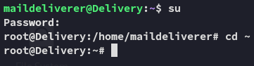

### root.txt

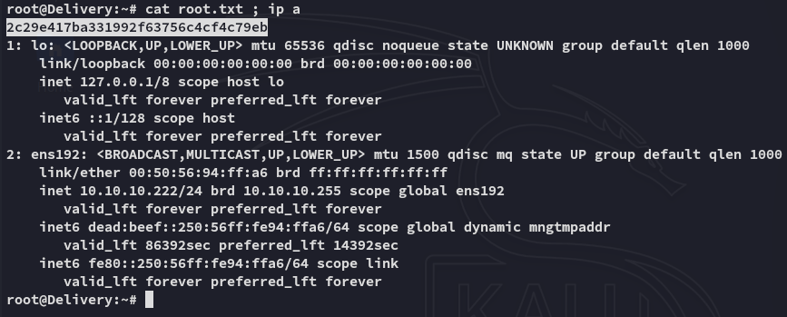

>[!note]
>
>
>Here is the [link to the post](https://medium.com/intigriti/how-i-hacked-hundreds-of-companies-through-their-helpdesk-b7680ddc2d4c)

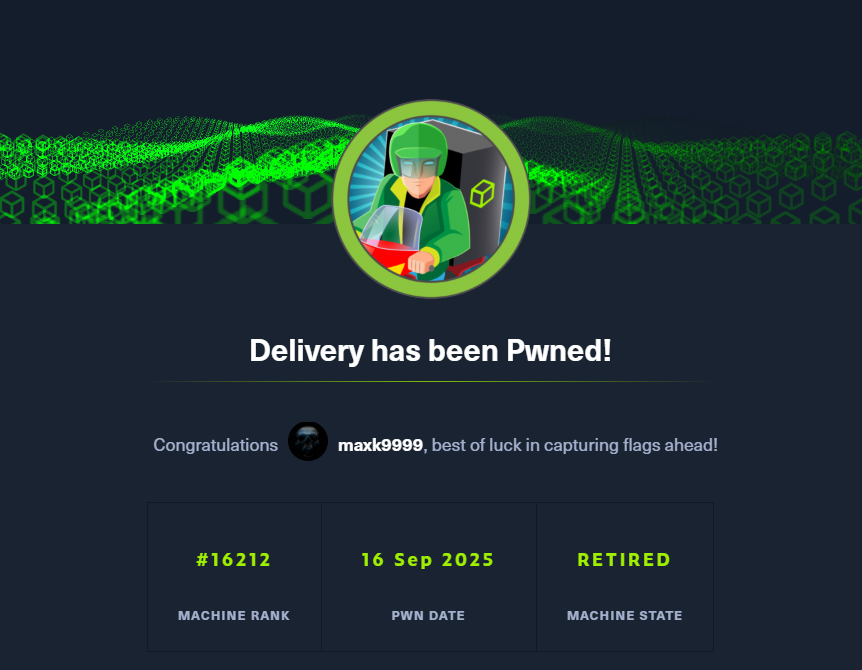

---