---
```
Scope:
10.10.11.106
```

# Recon
## Nmap

```bash
sudo nmap -sV -sC -sT -p- driver.htb -T5 --min-rate=5000 -vvvv -Pn

PORT     STATE SERVICE      REASON  VERSION
80/tcp   open  http         syn-ack Microsoft IIS httpd 10.0
| http-auth: 
| HTTP/1.1 401 Unauthorized\x0D
|_  Basic realm=MFP Firmware Update Center. Please enter password for admin
|_http-server-header: Microsoft-IIS/10.0
| http-methods: 
|   Supported Methods: OPTIONS TRACE GET HEAD POST
|_  Potentially risky methods: TRACE
|_http-title: Site doesnt have a title (text/html; charset=UTF-8).
135/tcp  open  msrpc        syn-ack Microsoft Windows RPC
445/tcp  open  microsoft-ds syn-ack Microsoft Windows 7 - 10 microsoft-ds (workgroup: WORKGROUP)
5985/tcp open  http         syn-ack Microsoft HTTPAPI httpd 2.0 (SSDP/UPnP)
|_http-server-header: Microsoft-HTTPAPI/2.0
|_http-title: Not Found
Service Info: Host: DRIVER; OS: Windows; CPE: cpe:/o:microsoft:windows

Host script results:
| smb2-security-mode: 
|   3:1:1: 
|_    Message signing enabled but not required
| smb-security-mode: 
|   account_used: guest
|   authentication_level: user
|   challenge_response: supported
|_  message_signing: disabled (dangerous, but default)
```

From the `nmap` scan it seems like there's an account on port `80` called *admin*.

## 80/TCP - HTTP

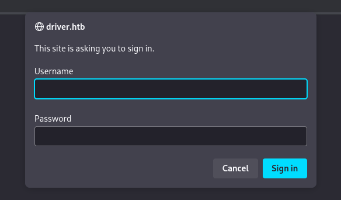

It seems like we're dealing with **HTTP Basic Authentication**. Since we already know the username we will only need to identify the password.

Using `hydra` I can quickly find out the credential combination:

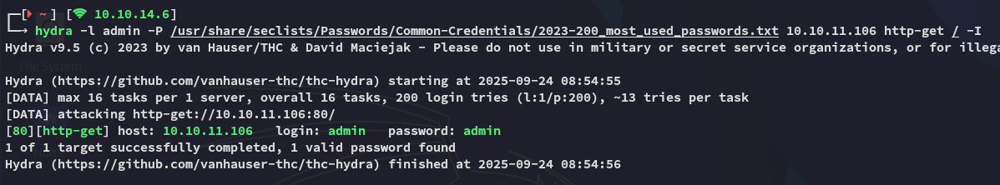

Logging in brings me to the following page:

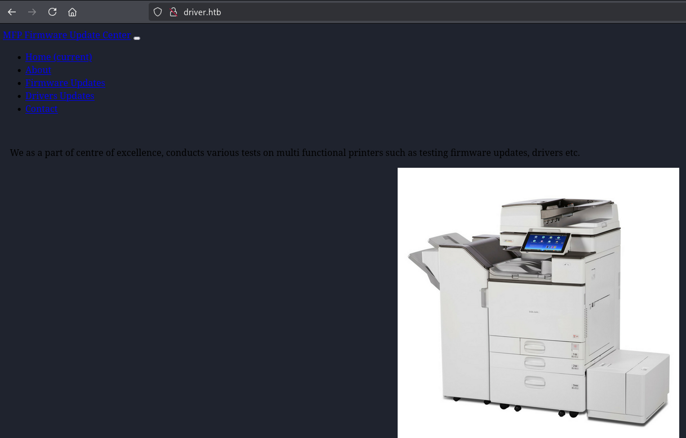

Clicking on **Firmware Updates** shows us this page:

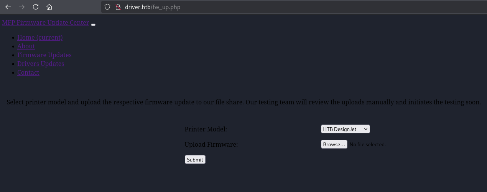

I tried uploading a `webshell.php`:

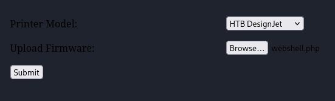

The URL told us that it worked:

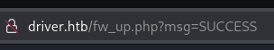

However I wasn't able to access the webshell since I didn't know where it got uploaded, `burp` didn't tell me either so there's probably a different route here.

## 445/TCP - SMB

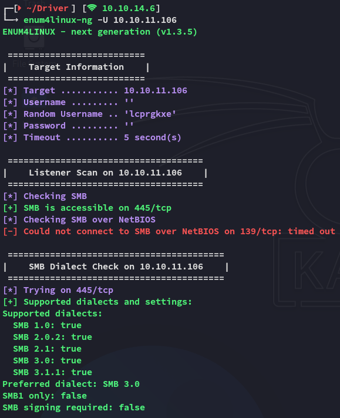

I wasn't able to create a NULL session here, but this port is still open.

I started digging around when I found the following:

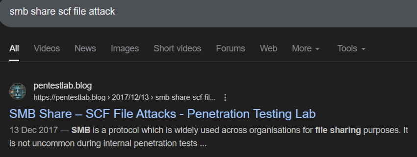

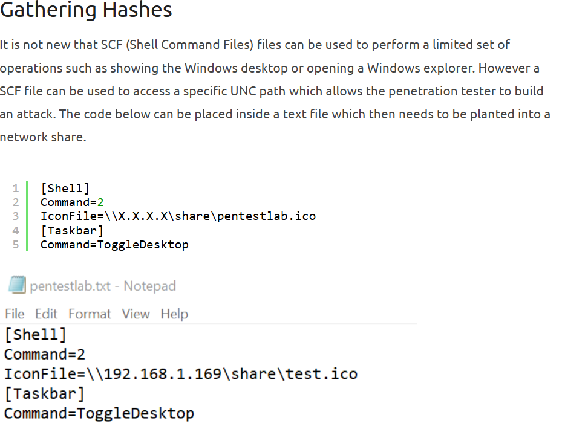

We can upload this file to the `smb` share through the webserver, and catch the hashes through responder.

## PoC

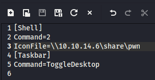

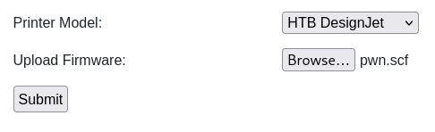

By running `sudo responder -I tun0` I then catch the hash for *tony*:

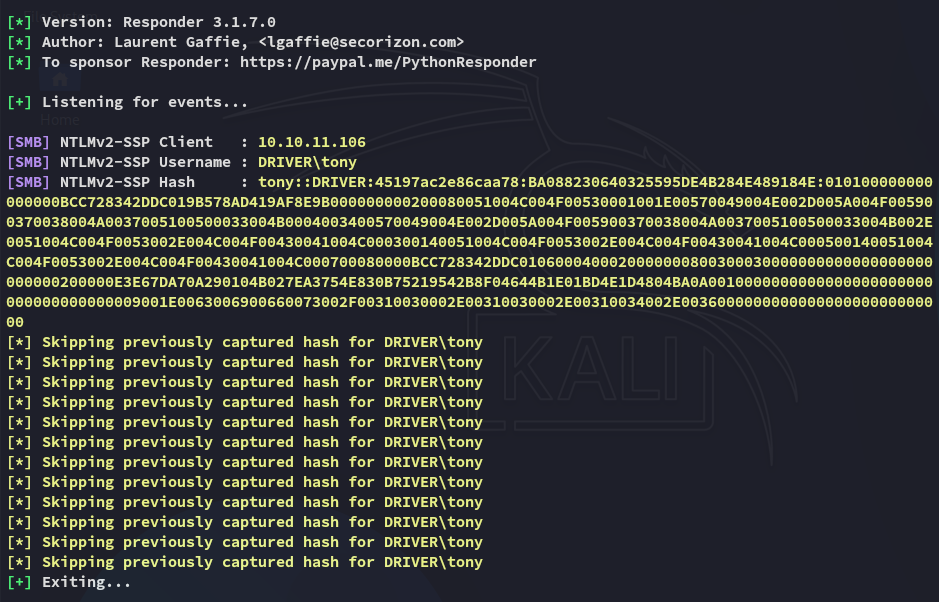

By using `john` we can easily crack the password.

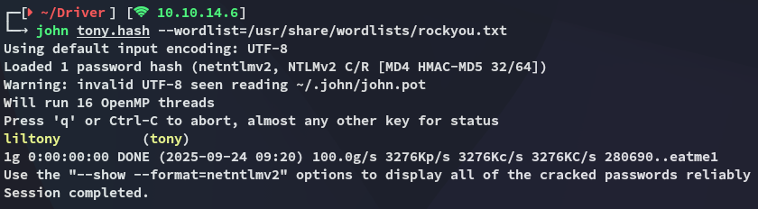

```
tony
liltony
```

# Foothold
## 5985/TCP - WinRM

Using the previously found creds we get easy access.

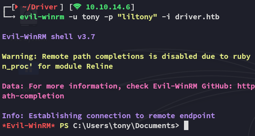

### user.txt

Here we can get the `user.txt` right away:

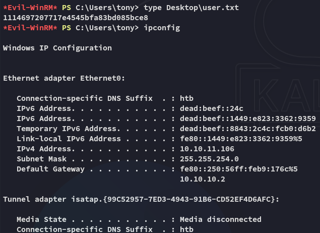

## Enumeration

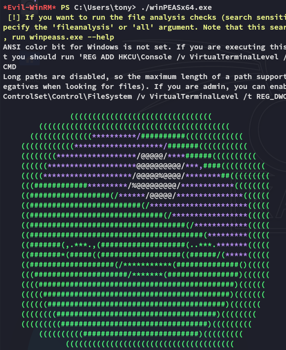

After scrolling through it I found a scheduled task:

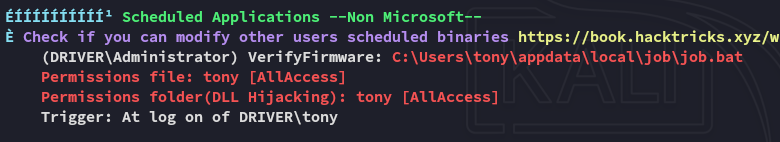

Before diving deeper into those files I enumerated further:

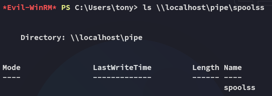

The above tells us that the Spooler service is running. We can use `PrintNightmare.ps1` to easily get *admin* rights.

# Privilege Escalation
## CVE-2021-1675 - PrintNightmare

I downloaded over the script and added the *tester* user as follows:

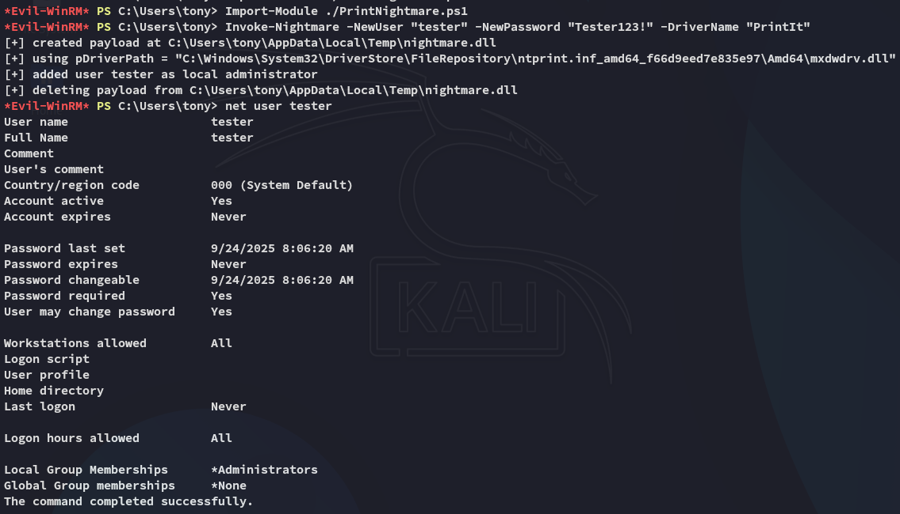

I can now easily log in as this user:

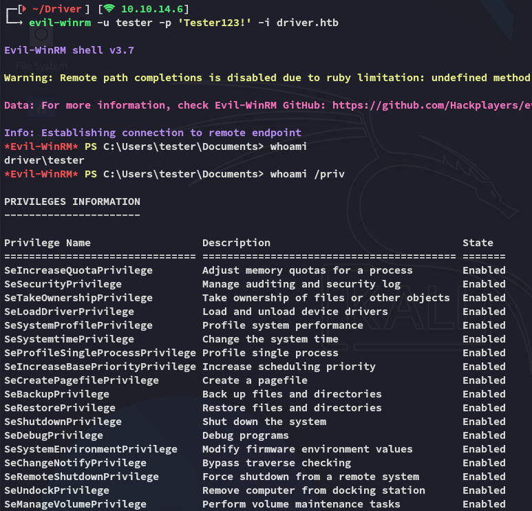

### root.txt

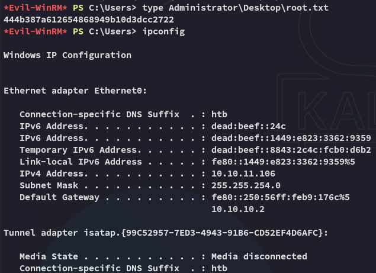

## Cleaning Up

As part of the clean up we can now delete all files from the system and delete the created user:

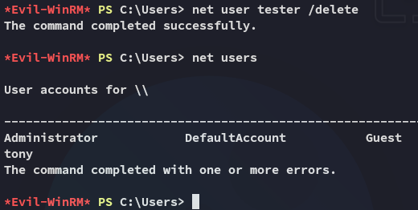

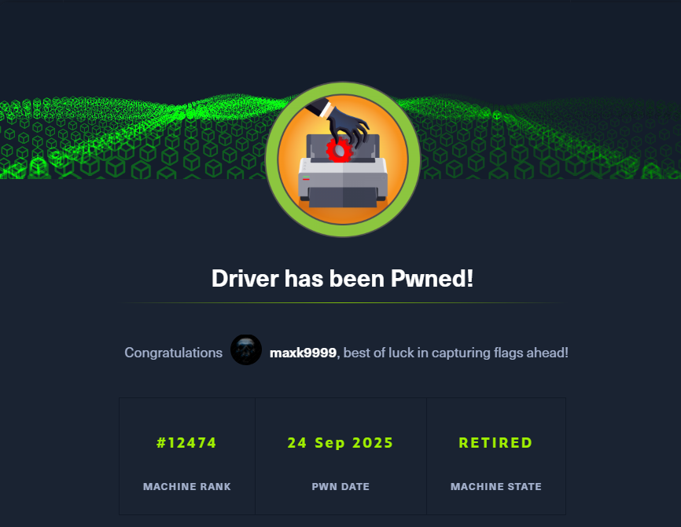

---