---
```
Scope:
10.10.11.80
```

# Recon
## Nmap

```bash
sudo nmap -sV -sC -sT -p- 10.10.11.80 -T5 --min-rate=5000 -vvvv -Pn

PORT     STATE SERVICE REASON  VERSION
22/tcp   open  ssh     syn-ack OpenSSH 8.9p1 Ubuntu 3ubuntu0.13 (Ubuntu Linux; protocol 2.0)
80/tcp   open  http    syn-ack nginx 1.18.0 (Ubuntu)
|_http-server-header: nginx/1.18.0 (Ubuntu)
| http-methods: 
|_  Supported Methods: GET HEAD POST OPTIONS
|_http-title: Did not follow redirect to http://editor.htb/
8080/tcp open  http    syn-ack Jetty 10.0.20
|_http-server-header: Jetty(10.0.20)
| http-methods: 
|   Supported Methods: OPTIONS GET HEAD PROPFIND LOCK UNLOCK
|_  Potentially risky methods: PROPFIND LOCK UNLOCK
| http-cookie-flags: 
|   /: 
|     JSESSIONID: 
|_      httponly flag not set
| http-webdav-scan: 
|   WebDAV type: Unknown
|   Server Type: Jetty(10.0.20)
|_  Allowed Methods: OPTIONS, GET, HEAD, PROPFIND, LOCK, UNLOCK
| http-title: XWiki - Main - Intro
|_Requested resource was http://10.10.11.80:8080/xwiki/bin/view/Main/
| http-robots.txt: 50 disallowed entries (40 shown)
| /xwiki/bin/viewattachrev/ /xwiki/bin/viewrev/ 
| /xwiki/bin/pdf/ /xwiki/bin/edit/ /xwiki/bin/create/ 
| /xwiki/bin/inline/ /xwiki/bin/preview/ /xwiki/bin/save/ 
| /xwiki/bin/saveandcontinue/ /xwiki/bin/rollback/ /xwiki/bin/deleteversions/ 
| /xwiki/bin/cancel/ /xwiki/bin/delete/ /xwiki/bin/deletespace/ 
| /xwiki/bin/undelete/ /xwiki/bin/reset/ /xwiki/bin/register/ 
| /xwiki/bin/propupdate/ /xwiki/bin/propadd/ /xwiki/bin/propdisable/ 
| /xwiki/bin/propenable/ /xwiki/bin/propdelete/ /xwiki/bin/objectadd/ 
| /xwiki/bin/commentadd/ /xwiki/bin/commentsave/ /xwiki/bin/objectsync/ 
| /xwiki/bin/objectremove/ /xwiki/bin/attach/ /xwiki/bin/upload/ 
| /xwiki/bin/temp/ /xwiki/bin/downloadrev/ /xwiki/bin/dot/ 
| /xwiki/bin/delattachment/ /xwiki/bin/skin/ /xwiki/bin/jsx/ /xwiki/bin/ssx/ 
| /xwiki/bin/login/ /xwiki/bin/loginsubmit/ /xwiki/bin/loginerror/ 
|_/xwiki/bin/logout/
|_http-open-proxy: Proxy might be redirecting requests
Service Info: OS: Linux; CPE: cpe:/o:linux:linux_kernel
```

## 80/TCP - HTTP

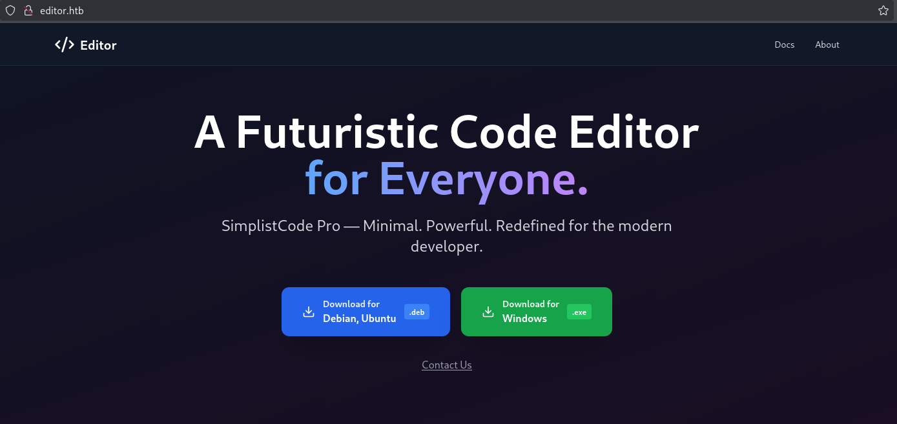

Down at the bottom I noticed a **Documentation** tab which when clicked showed the following:

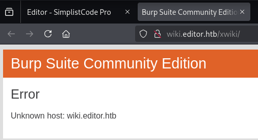

I had to edit this entry to my `/etc/hosts` list.

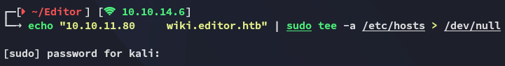

I then ran `ffuf` to see whether I could find more vhosts but it appears this was  the only one:

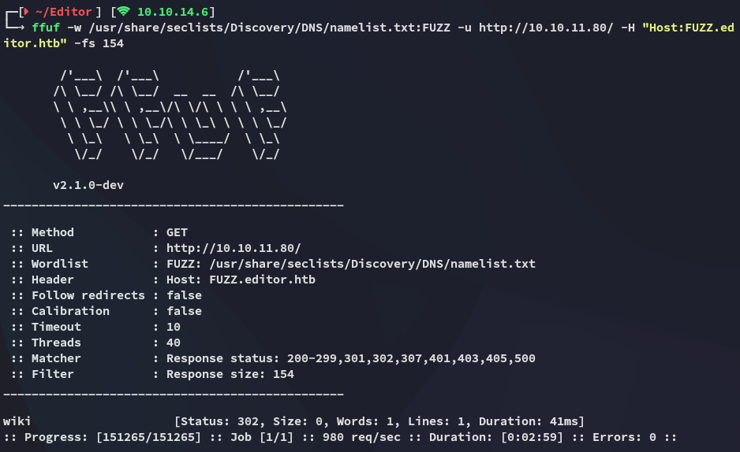

Moving onto `wiki.`

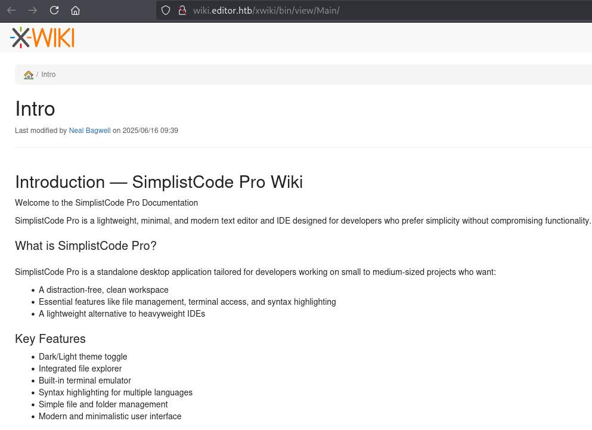

I noticed the user *Neal Bagwell*, might need this later on to log in.

Furthermore I noticed a version number:

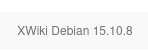

Apparently there are plenty of CVE's for this version:

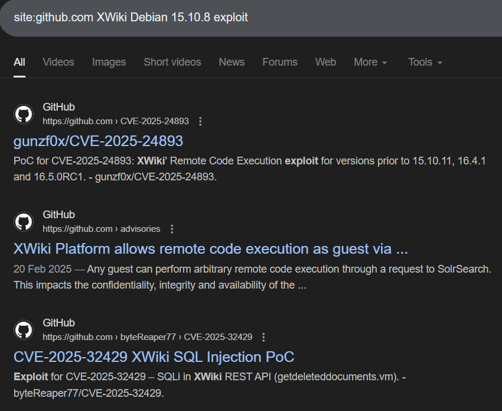

I settled for [this one](https://github.com/D3Ext/CVE-2025-24893):

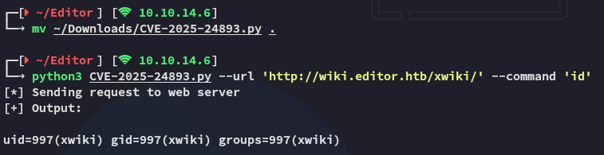

# Foothold
## Shell as xwiki

I used the `busybox` reverse shell command to get in:

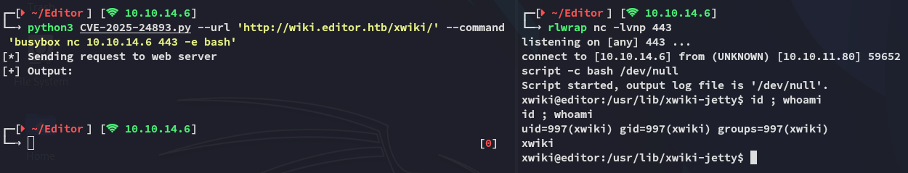

I noticed a plethora of open ports:


## Enumeration

I then downloaded and ran `linpeas.sh`:


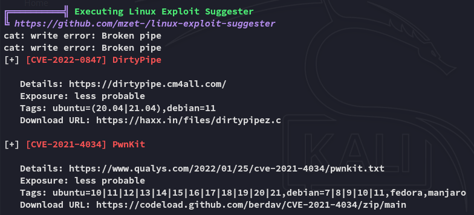

This one seemed interesting as well if we can get access to a user who's in the *netdata* group:

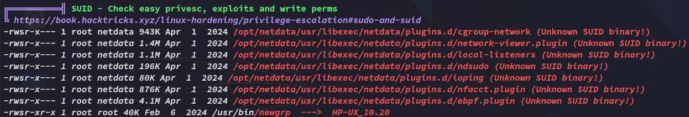

I didn't really find anything else interesting so decided to look up the docs.

I headed on over to the following directory where I landed in initially to enumerate it further.

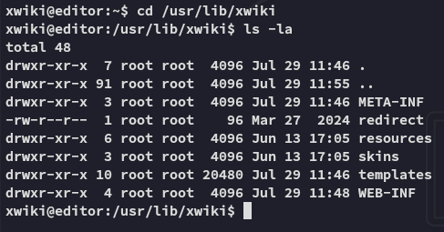

Here I found this file which I then proceded to check out:

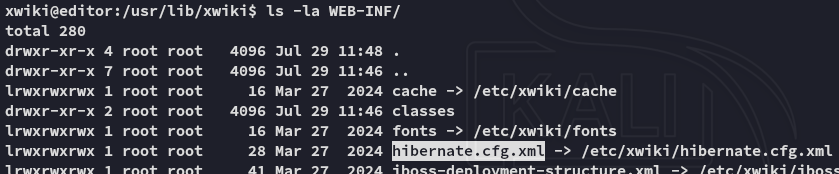

Inside the `hibernate.cfg.xml` file I found juicy cleartext creds:

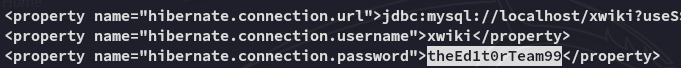

```
xwiki
theEd1t0rTeam99
```

## MySQL

Using the found creds I was able to access `mysql` and enumerate it:

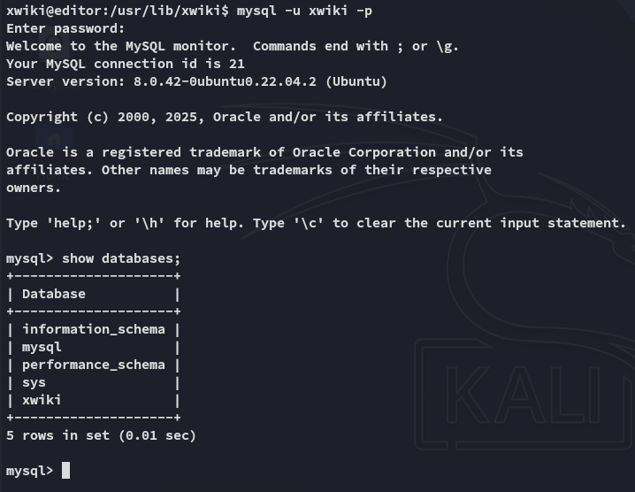

However I didn't find anything of use here so instead sprayed the password against the found *oliver* user.

## Lateral Movement - oliver

The credentials matched and I was able to move laterally:

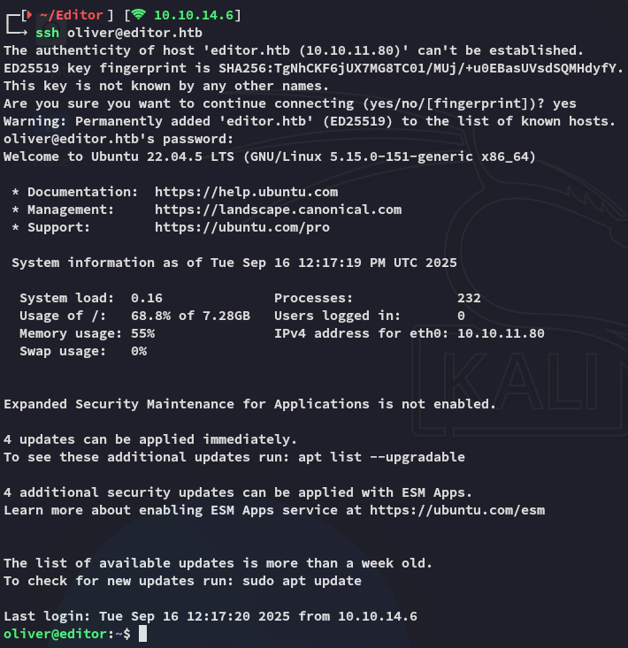

### user.txt

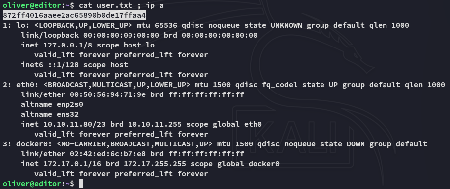

# Privilege Escalation
## netdata - ndsudo

This user was part of the *netdata* group:

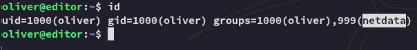

I can use the previously found binaries that are non-default.


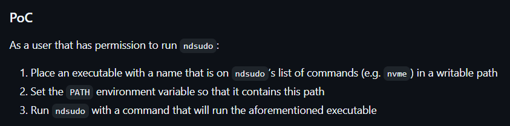

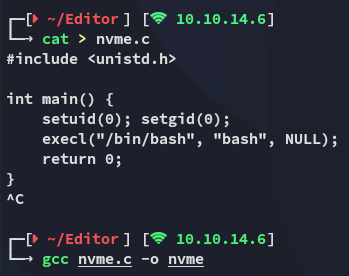

I then transfered it over and executed it after adding `/tmp` to my `$PATH`:

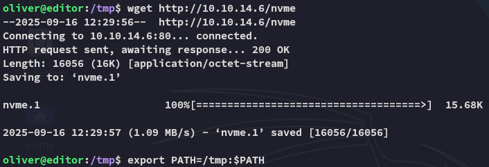

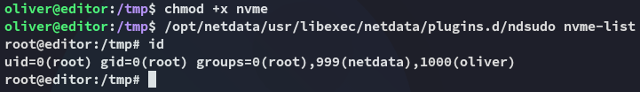

### root.txt

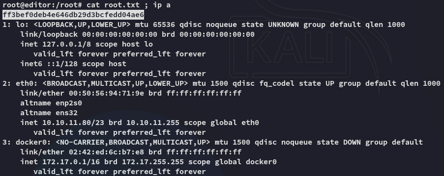

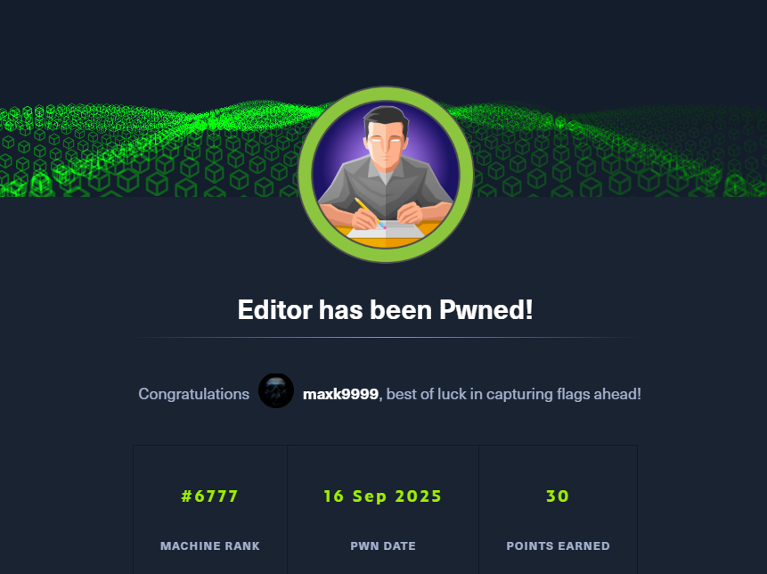

---