---

```
Scope:
10.10.11.87
```

# Recon
## Nmap

```bash
sudo nmap -sV -sC -sT -p- expressway.htb -T5 --min-rate=5000 -vvvv -Pn 

PORT   STATE SERVICE REASON  VERSION
22/tcp open  ssh     syn-ack OpenSSH 10.0p2 Debian 8 (protocol 2.0)
Service Info: OS: Linux; CPE: cpe:/o:linux:linux_kernel
```

Only one port showed up so I decided to run a `UDP` scan as well.

```bash
sudo nmap -sV -sC -sU -p- expressway.htb -T5 --min-rate=5000 -vvvv -Pn

Discovered open port 500/udp on 10.10.11.87
```

Since the `500` port showed up I reran the scan focussing on this port.

```bash
sudo nmap -sV -sC -sU -p500 expressway.htb -T5 --min-rate=5000 -vvvv -Pn

PORT    STATE SERVICE REASON              VERSION
500/udp open  isakmp? udp-response ttl 63
| ike-version: 
|   attributes: 
|     XAUTH
|_    Dead Peer Detection v1.0
```


## 500/UDP - ISAKMP

Using [this resource](https://book.hacktricks.wiki/en/network-services-pentesting/ipsec-ike-vpn-pentesting.html) I was able to learn more about this service.

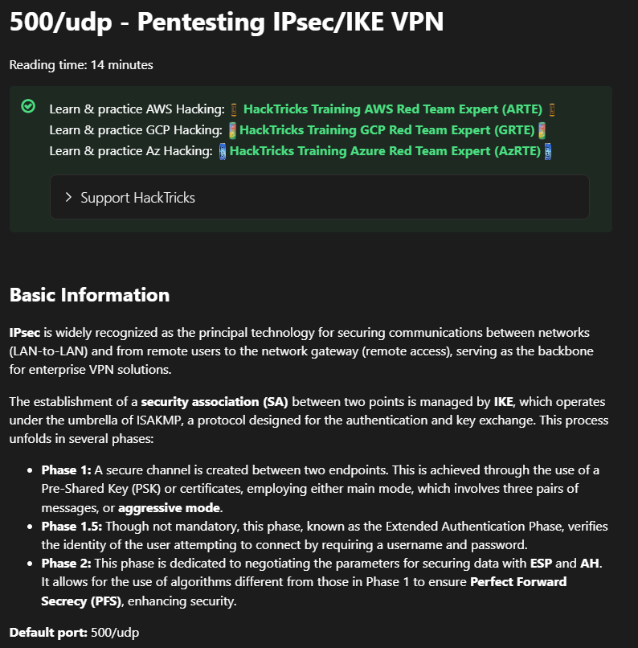

Reading further down:

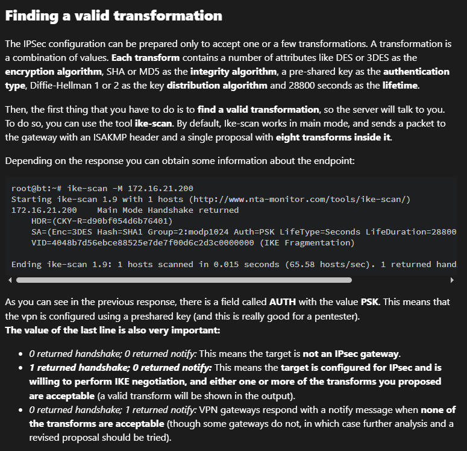

Let's get to it:

```bash
ike-scan -M --showbackoff expressway.htb
```

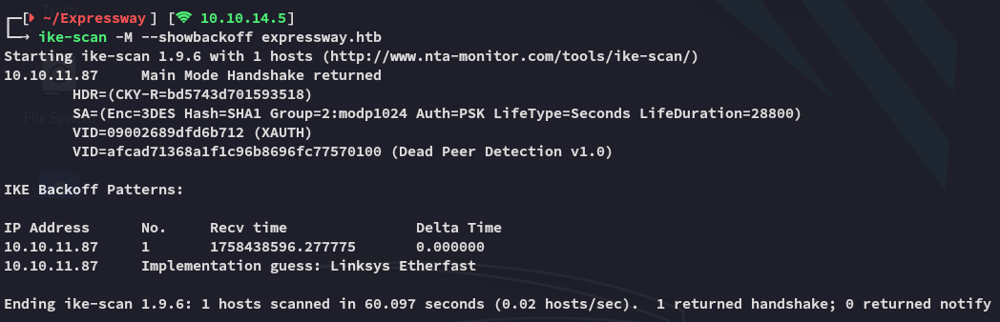

### IKE Xauth

Since we're dealing with `Xauth` here we'll have to follow along with this part:

Using the `-A` aggressive mode we can acquire hashes and identities in cleartext:

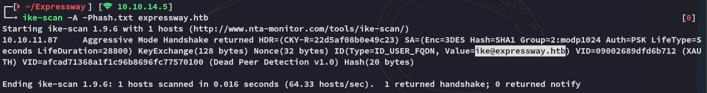

As well as the `psk` hashes:

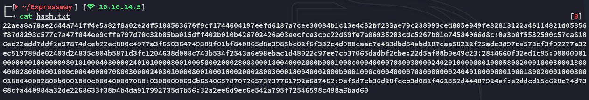

### Hash cracking

I can find the correct hash format as follows:

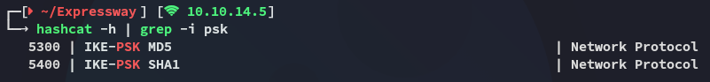

The `ike-scan` previously told us we're dealing with a `SHA1` hash:


Let's get to cracking.

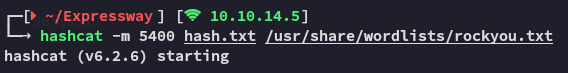

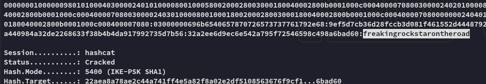

```
ike@expressway.htb
freakingrockstarontheroad
```

# Foothold
## SSH as ike

We can use these creds to login via `ssh`:

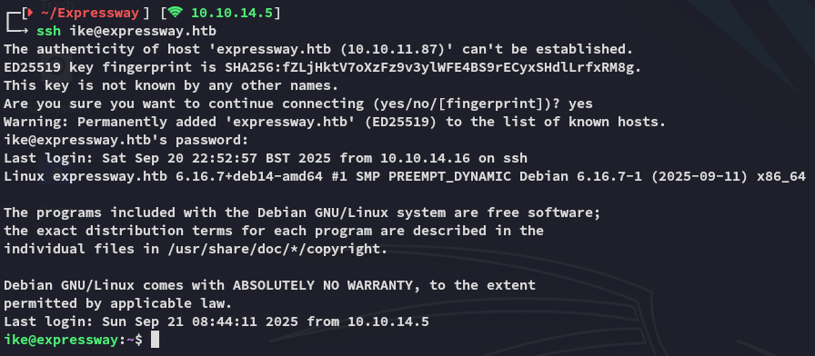

Here we can instantly pick up `user.txt`.

# Privilege Escalation
## Enumeration

I noticed this user was part of the *proxy* group:

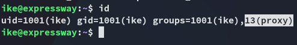

We weren't able to run `sudo` either:

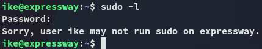

For automated enum I ran `linpeas`:


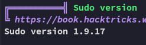

From my memory I had previously found an exploit that could easily give us *root* by exploiting this `sudo` version:

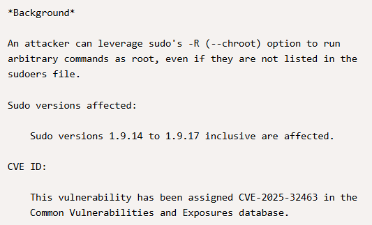

Let's try it out:

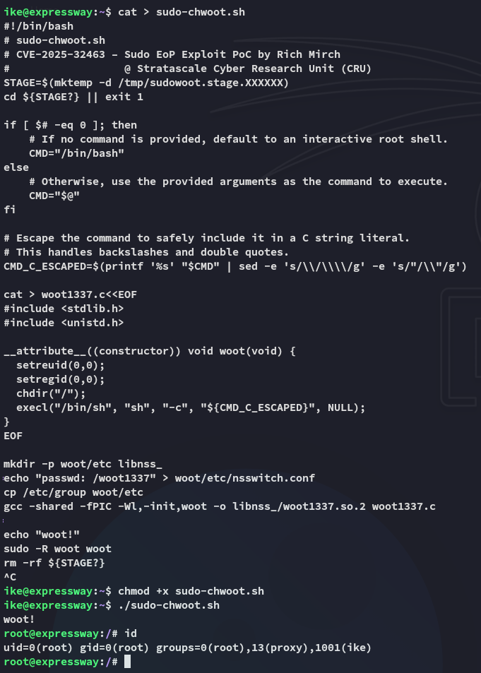

EZ PZ *root*.

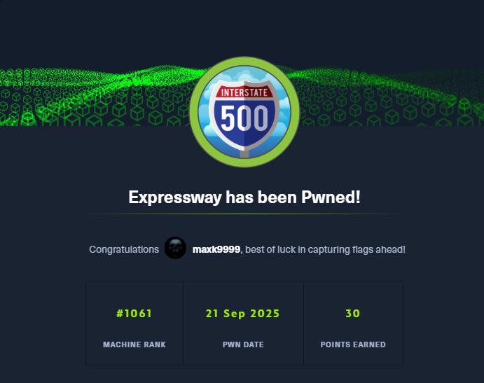

---