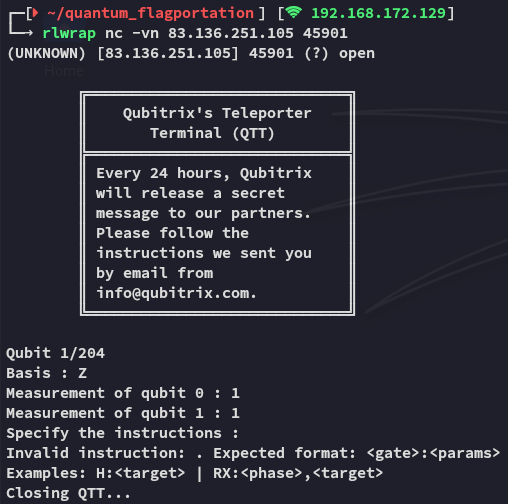
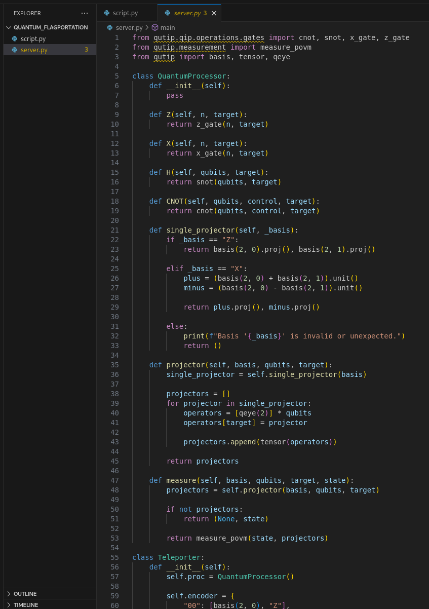
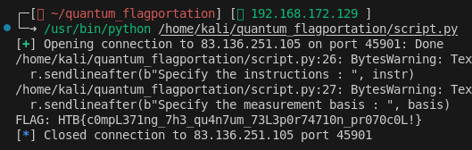
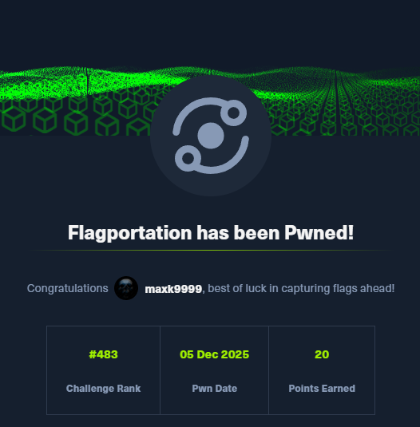

```
Scope:
83.136.251.105:45901
```

I connected initially via `nc` to see the standard output:



Reviewing the source code I saw the following:



I solved the challenge by directly reversing the teleportation logic implemented in the service. Each qubit encodes two bits using a fixed mapping, and the protocol leaks the correction information through the first two Z-basis measurements. 

Once I understood how the CNOT and Hadamard operations transform the state, it became clear that the values of `m0` and `m1` uniquely determine the Pauli correction the server expects the client to apply before the final measurement. By replaying the exact inverse corrections (Z or X on qubit 2), choosing the same basis the state was originally prepared in, and reading the resulting measurement, I can reconstruct each transmitted bit-pair deterministically. For this I used the following `script.py` script:

```python
from pwn import *

HOST, PORT = "83.136.251.105", 45901
r = remote(HOST, PORT)
bits = []

try:
    while True:
        r.recvuntil(b"Basis : ")
        basis = r.recvline().strip().decode()

        m0 = int(r.recvline().split()[-1])
        m1 = int(r.recvline().split()[-1])

        # (m0,m1) → instruction map
        instr = {
            (0,0): "Z:2;Z:2",
            (1,0): "Z:2",
            (0,1): "X:2",
            (1,1): "Z:2;X:2"
        }[(m0, m1)]

        r.sendlineafter(b"Specify the instructions : ", instr)
        r.sendlineafter(b"Specify the measurement basis : ", basis)

        final = int(r.recvline().split()[-1])
        bits.append(("0" if basis == "Z" else "1") + str(final))

except EOFError:
    b = ''.join(bits)
    flag = int(b, 2).to_bytes((len(b)+7)//8, "big")
    try: print("FLAG:", flag.decode())
    except: print("FLAG:", flag)
finally:
    r.close()
```

Iterating this for the whole dump and converting the recovered bitstream back to bytes yields the flag.





---