---
title: 'HTB-Forge'
published: 2025-09-18
draft: false
toc: true
---
**Start 17:36 27-10-2025**

---
```
Scope:
10.10.11.111
```
# Recon
## Nmap

```bash
sudo nmap -sC -sV -sT -p- -vvvv -T5 --min-rate=5000 -Pn forge.htb

PORT   STATE    SERVICE REASON      VERSION
22/tcp open     ssh     syn-ack     OpenSSH 8.2p1 Ubuntu 4ubuntu0.3 (Ubuntu Linux; protocol 2.0)
80/tcp open     http    syn-ack     Apache httpd 2.4.41
|_http-title: Gallery
|_http-server-header: Apache/2.4.41 (Ubuntu)
| http-methods: 
|_  Supported Methods: OPTIONS GET HEAD
Service Info: Host: 10.10.11.111; OS: Linux; CPE: cpe:/o:linux:linux_kernel
```

## 80/TCP - HTTP

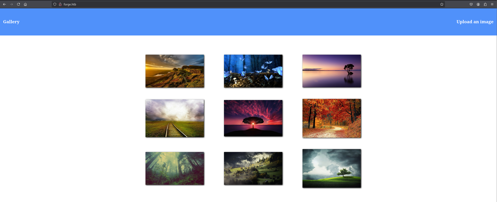

We can directly upload an image:


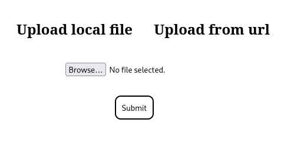

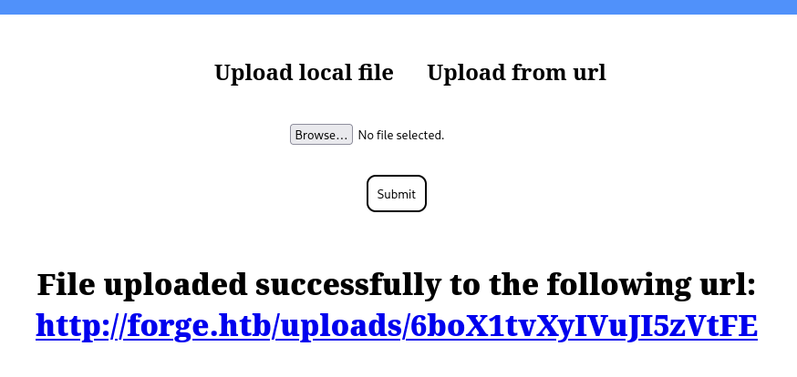


I tried to include the `/etc/passwd` file but got this response:


This appears to be a **SSRF** vulnerability rather than a **File Upload** one, let's test it out.

### SSRF

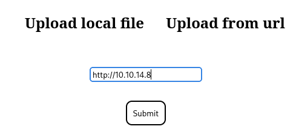

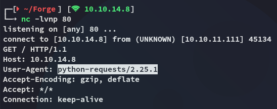

I notice that it shows `python` as the `User-Agent` meaning it's probably either **Flask** or **Django** running the application.

I analysed the request further:

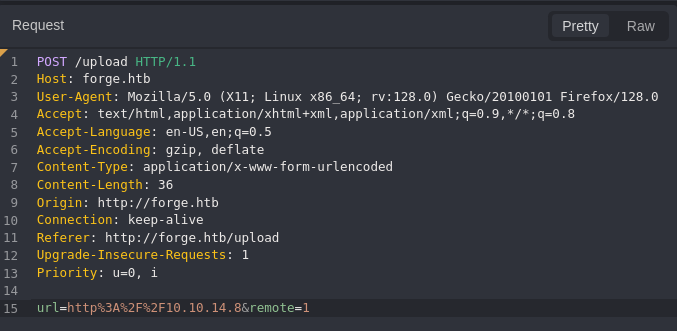

I tried reading files but it's not supported:

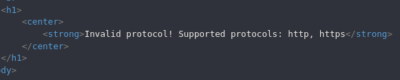

I then tested the following method:

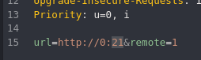


However when I tested this one I got a different response:

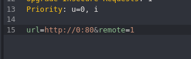

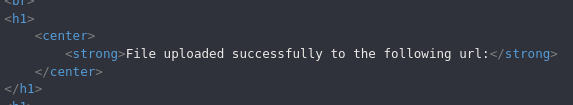

I tried to enumerate open ports this way to see whether there were any other open ones but got none other than `80`:

```bash
ffuf -w ./ports.txt -u http://forge.htb/upload -X POST -H "Content-Type: application/x-www-form-urlencoded" -d "url=http://0:FUZZ&remote=1" -fr 'An error occured!'
```

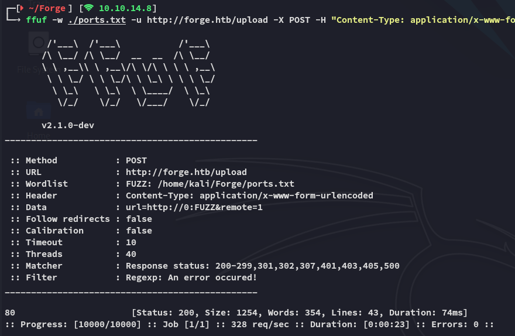

Anyhow, instead I used the following technique to bypass the `localhost` checker:

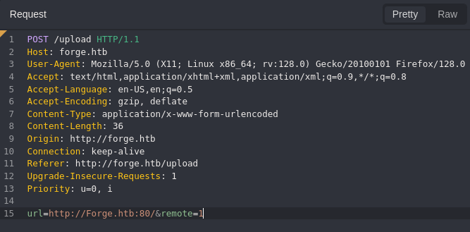

By simply adding one uppercase letter we were able to successfully bypass it:

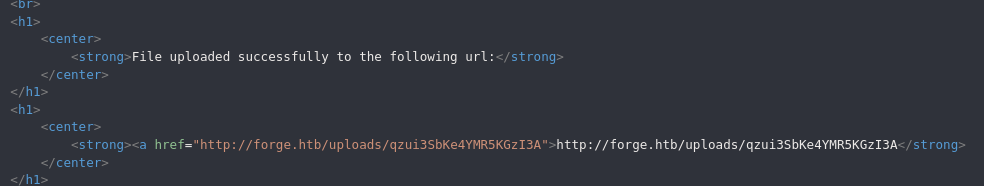

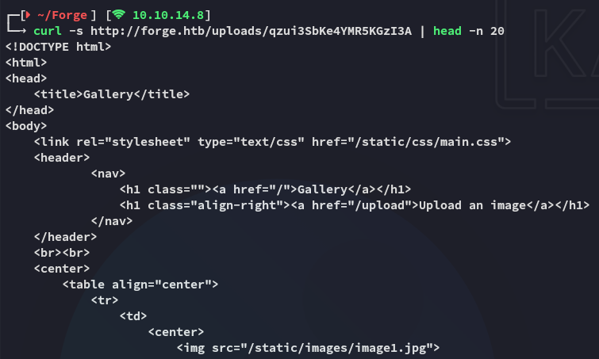

We are able to retrieve the `index` page that the webserver is hosting. Problem is though that I still am unable to fetch any other files, so it's time to continue our enumeration.

### admin.forge.htb

Using `ffuf` I found the `admin` vhost:

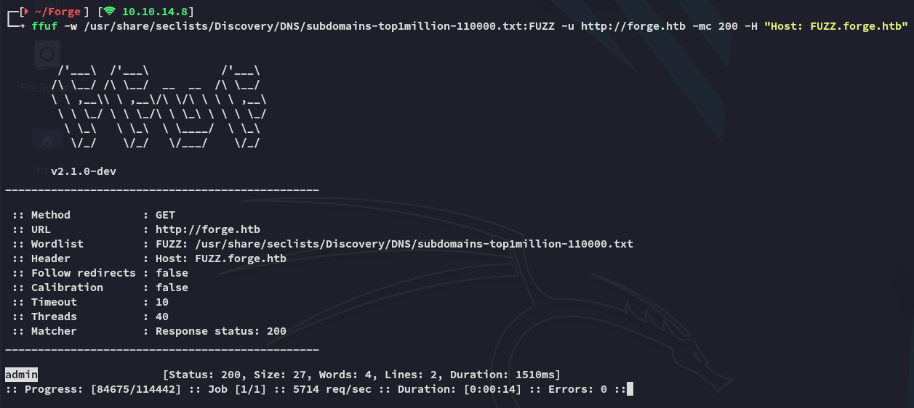

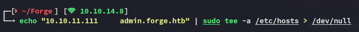

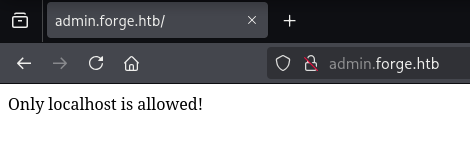

And now I understand where the **SSRF** part comes in.

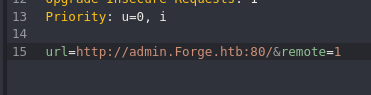


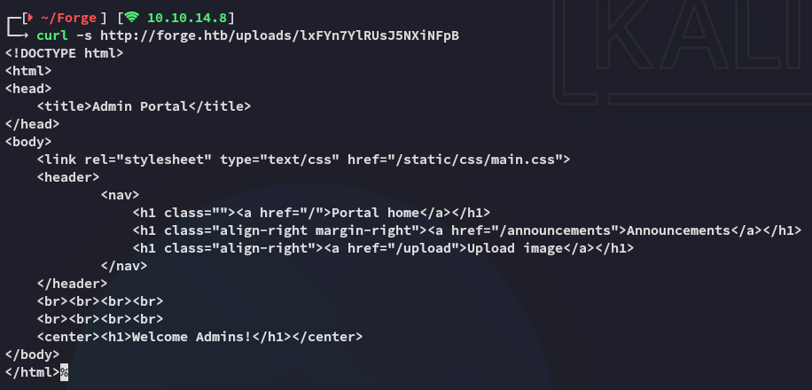

I then checked the `/announcements` endpoint using the same technique:

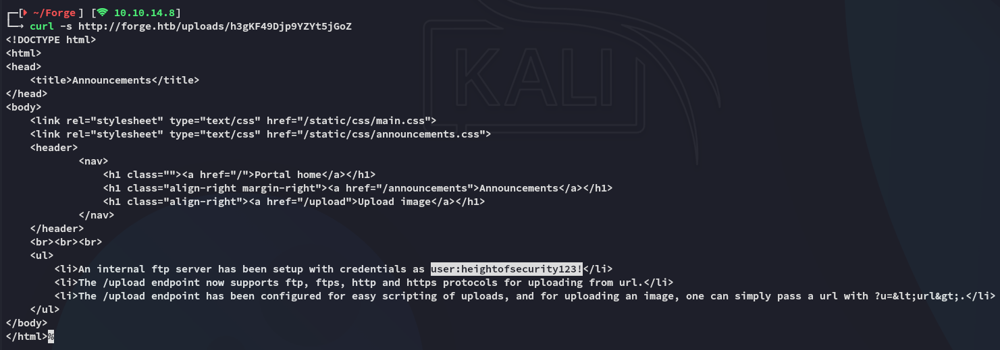

```
user
heightofsecurity123!
```

We get a set of creds, as well as more info about the `/upload` endpoint.

Combining the information we've gathered we can go ahead fetch everything that's inside the `ftp` server:

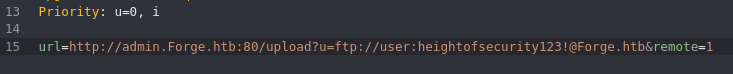

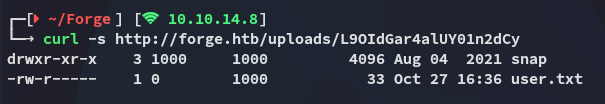

### user.txt

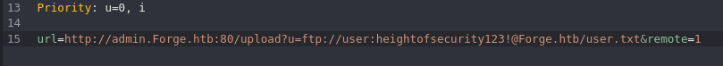

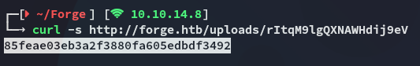

# Foothold
## Shell as user
### Fetching id_rsa

Since we were able to read the `user.txt` file it's *HIGHLY LIKELY* that the `ftp` directory is inside the user's `/home` directory. Let's try to fetch the `ssh` `id_rsa` key.

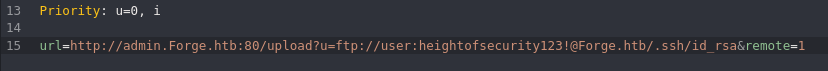

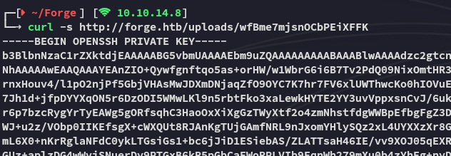

In order to understand whom the key belonged to I read the `/etc/passwd` file:

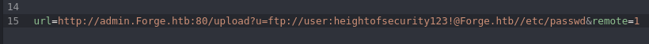

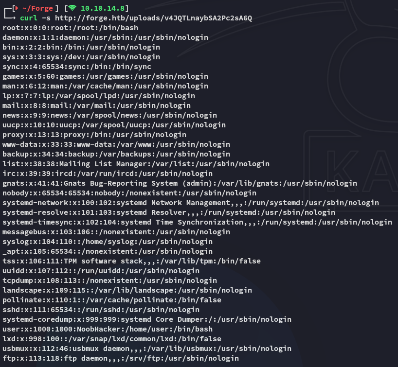

I thus captured the `id_rsa` and logged in with it:

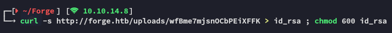

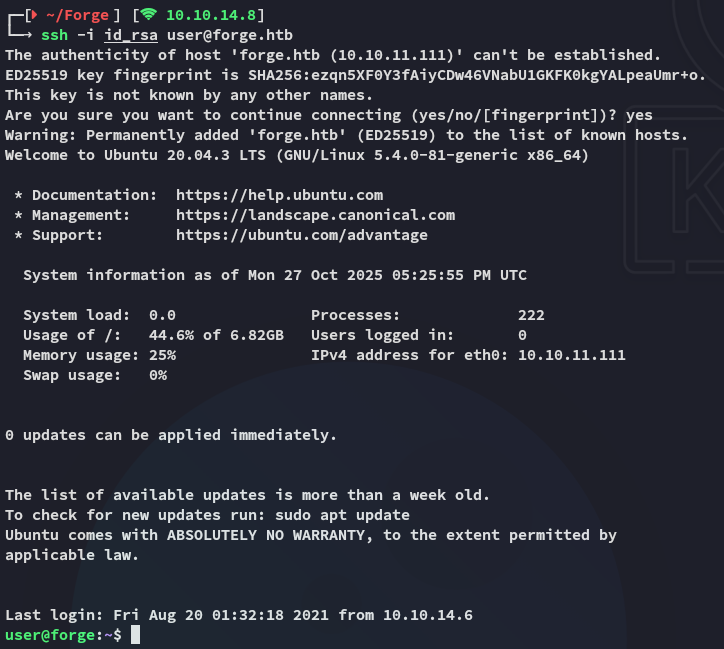

# Privilege Escalation
## remote-manage

Using `sudo -l` I found out that I could run the following binary as *root*:

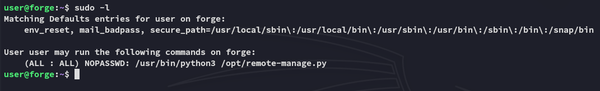

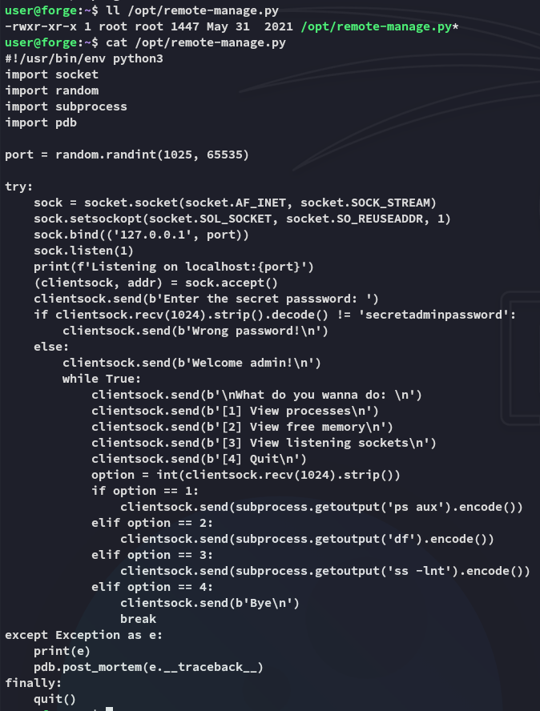

### Exploitation

I went ahead and tried it out:

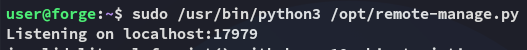

From another terminal I was able to execute some commands:

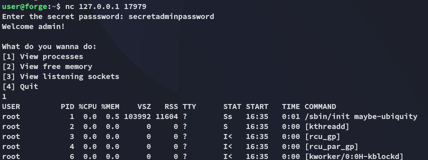

The way to exploit this is by sending *any* input that isn't an `int`:

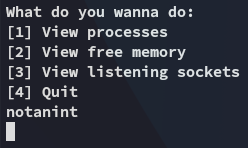

Back in the first terminal we notice:

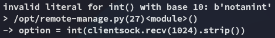

We can then use the following command to spawn a *root* shell:

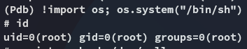

>[!TLDR]
>When the exception is caught, the code explicitly calls `pdb.post_mortem(e.__traceback__)`. `post_mortem()` receives the traceback object (`e.__traceback__`) and starts `pdb` positioned at the point of the exception. That gives you an interactive `(Pdb)` prompt in the terminal where the root process was started (the terminal running `sudo /usr/bin/python3 /opt/remote-manage.py`).

### root.txt

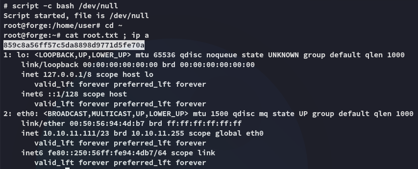

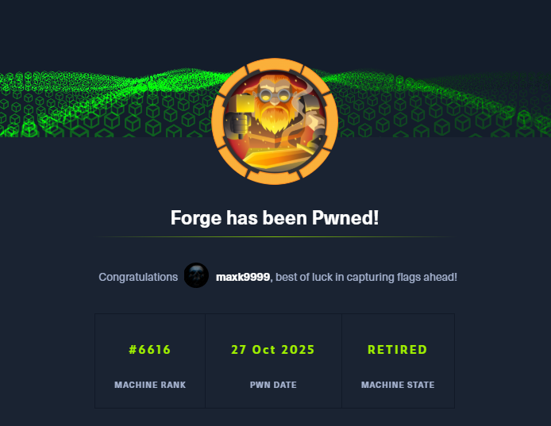

---

**Finished 18:45 27-10-2025**

[^Links]: [[Hack The Box]]

#SSRF 
