---
title: 'HTB-Horizontall'
published: 2025-09-18
draft: false
toc: true
---
**Start 12:17 25-10-2025**

---
```
Scope:
10.10.11.105
```
# Recon
## Nmap

```bash
sudo nmap -sC -sV -sT -p- -vvvv -T5 --min-rate=5000 -Pn horizontall.htb

PORT   STATE SERVICE REASON  VERSION
22/tcp open  ssh     syn-ack OpenSSH 7.6p1 Ubuntu 4ubuntu0.5 (Ubuntu Linux; protocol 2.0)
80/tcp open  http    syn-ack nginx 1.14.0 (Ubuntu)
|_http-title: horizontall
|_http-server-header: nginx/1.14.0 (Ubuntu)
|_http-favicon: Unknown favicon MD5: 1BA2AE710D927F13D483FD5D1E548C9B
| http-methods: 
|_  Supported Methods: GET HEAD
Service Info: OS: Linux; CPE: cpe:/o:linux:linux_kernel
```

## 80/TCP - HTTP

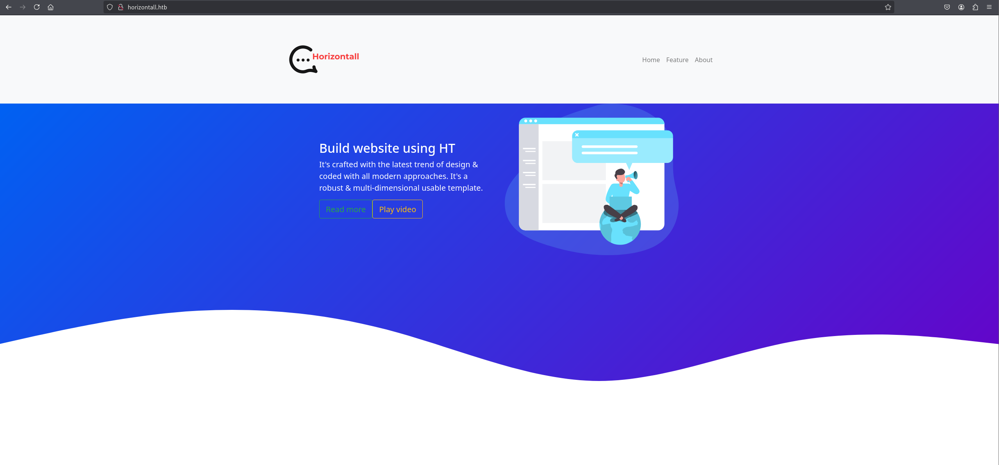

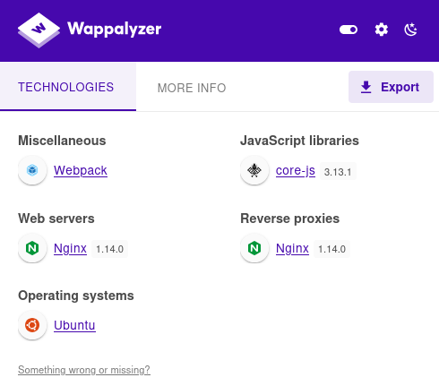

It looks like a static site.

I ran a `gobuster` scan but found nothing useful:

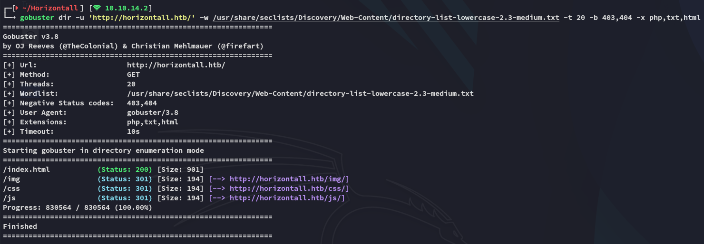

I did find some obfuscated `js` code in the source code that I ran in [prettier.io](https://prettier.io/playground):

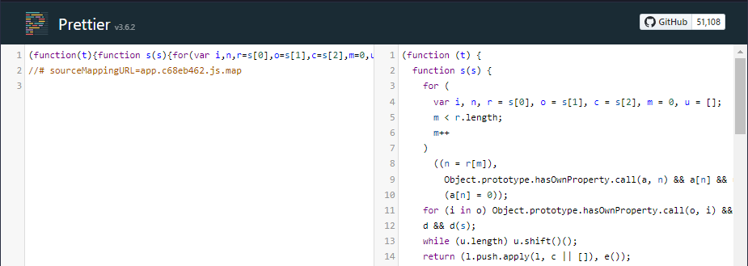

Going all the way down I noticed the following which looked like a vhost:

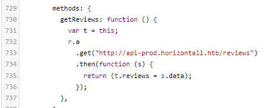

## api-prod

I added the `vhost` and started enumerating the host:

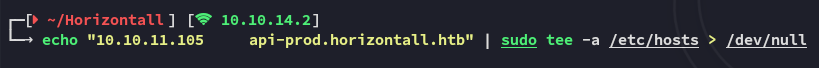

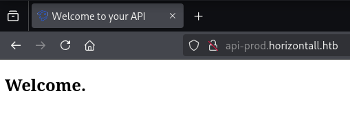

I checked the response in `caido` since the page was empty:

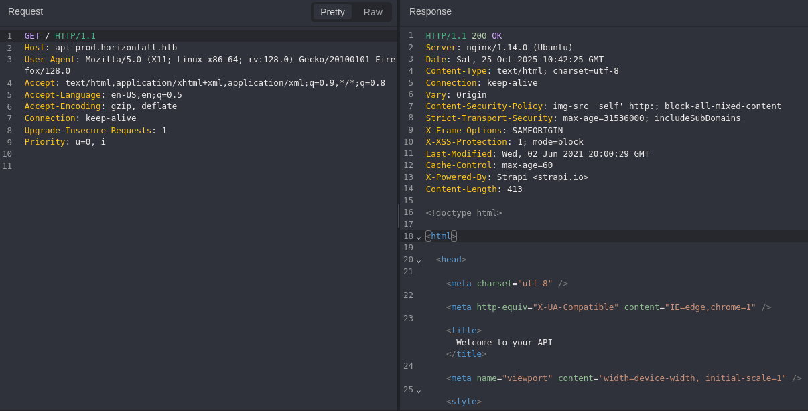

I headed over to the endpoint that I'd found earlier:

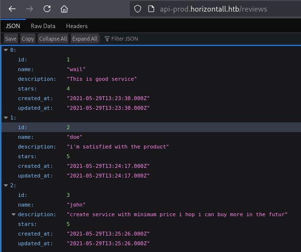

I then used `gobuster` to enumerate the endpoints:

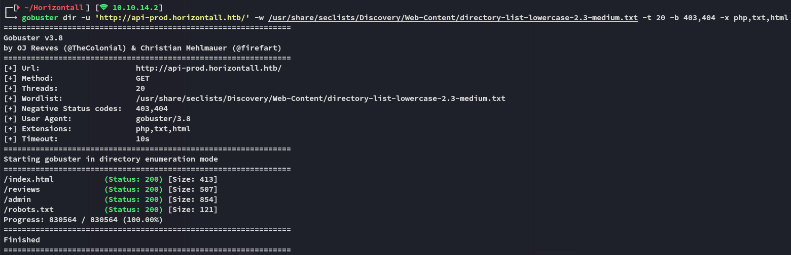

# Exploitation
## CVE-2019-19609

I searched for relevant exploits and found an **Unauthenticated RCE** which could be big.

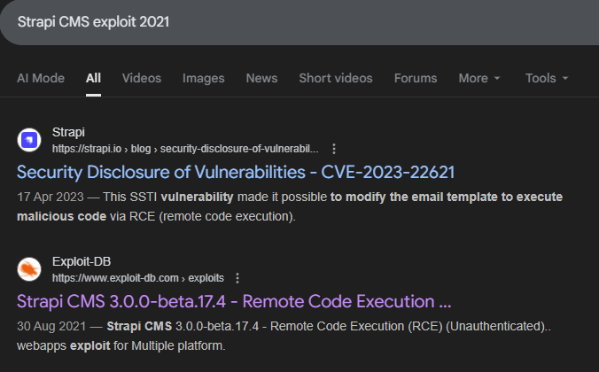

I downloaded the exploit from exploit-db and tried it out:

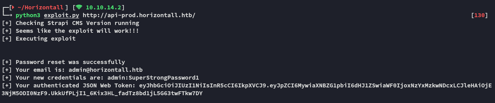

Once I had achieved RCE I ran the following payload to achieve a foothold:

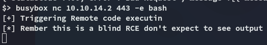

# Foothold
## Shell as strapi

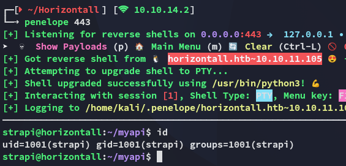

I noticed one other user present on the target:

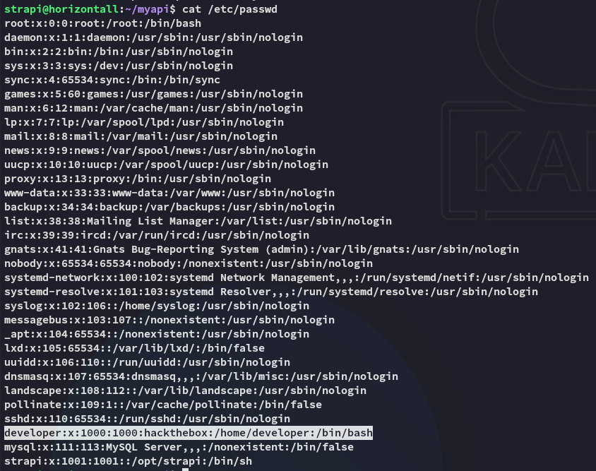

I went ahead and read the user flag right away.

### user.txt

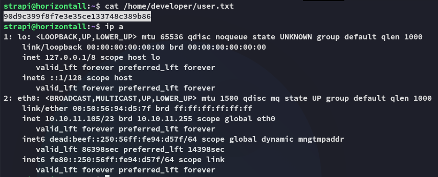

Other than that I had no permissions over any files or directories in *developer*'s `/home` directory. 

## Enumeration

I transferred over `linpeas.sh` and got to work:

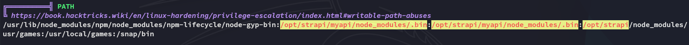

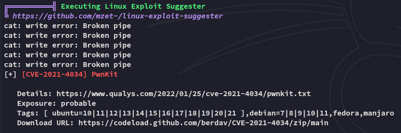

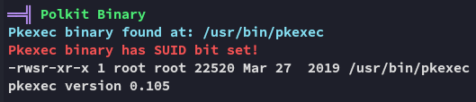

Other than that I also found the credentials for *developer*:

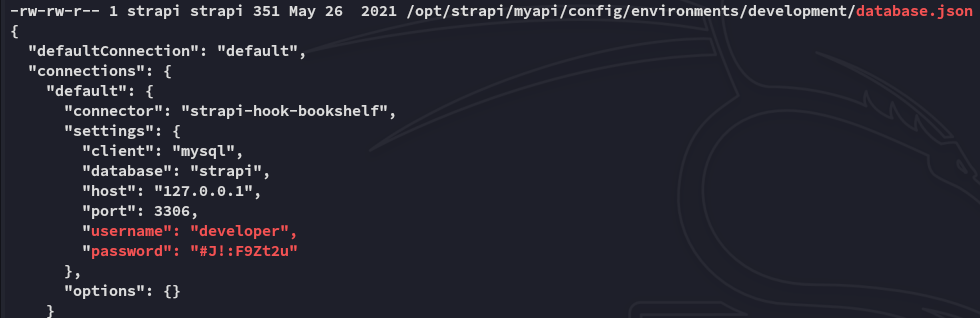

```
developer
#J!:F9Zt2u
```

While we couldn't use these creds to `su`, we couldn't access `mysql` with them either.

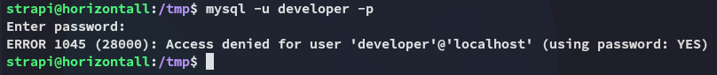

# Privilege Escalation
## pwnkit

The priv esc was actually rather simple, we indeed just had to run `pwnkit.py`:

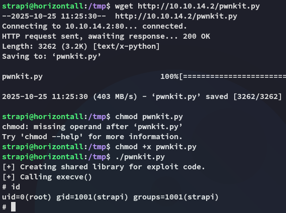

### root.txt

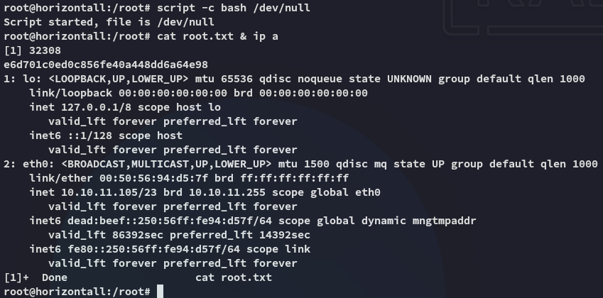

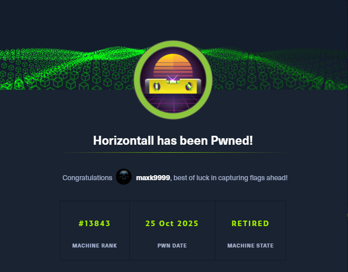

---

**Finished 13:25 25-10-2025**

[^Links]: [[Hack The Box]]

#pwnkit #CVE-2019-19609 #vhosts 
