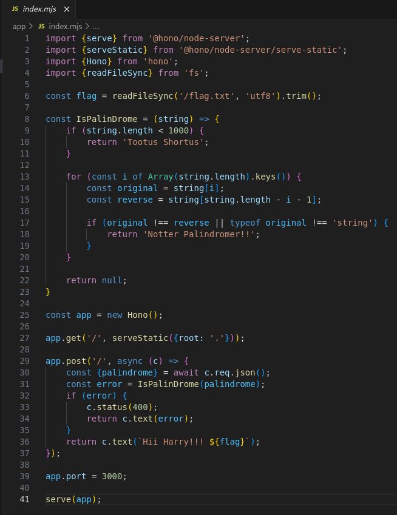
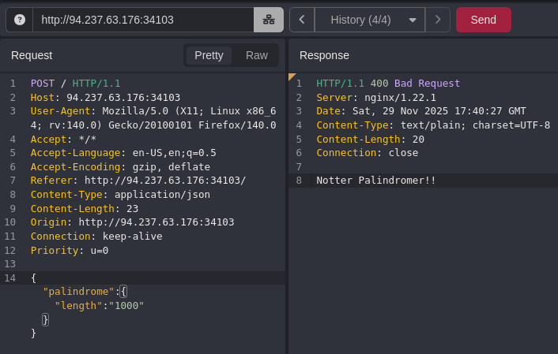
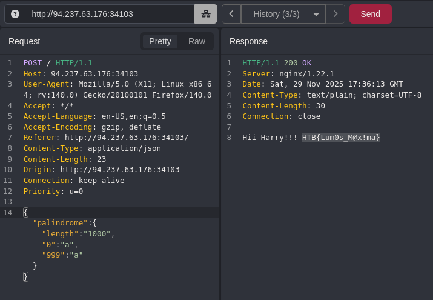

```
Scope:
94.237.63.176:33769
```

# Source Code Review

I started off by downloading and extracting the pack:


Inside I found the following contents:


In order to view the source code I booted up `vscode` (this is not necessary but syntax highlighting is always a nice to have):


The site itself just looked as follows:


Inside the `index.mjs` we see where the magic happens:



Checking the source code we can conclude the following:

- The server never verifies that `palindrome` is actually a string, so an attacker can provide an object with a forged `.length` property. 
- JavaScript’s numeric coercion makes `"1000"` behave like the number 1000, allowing the length check to pass. 
- The palindrome loop then only inspects keys `0` and `999`, so supplying matching values for those two keys makes the validator incorrectly accept the object as a valid palindrome.

# Exploitation

Since the string length has to be over `1000` I tried the following first:



This gave me the above response. 

I could bypass it using the following JSON string:

```js
{"palindrome":{"length":"1000","0":"a","999":"a"}}
```




---