---
title: 'HTB-Passage'
published: 2025-09-18
draft: false
toc: true
---
**Start 09:35 28-10-2025**

---
```
Scope:
10.10.10.206
```
# Recon
## Nmap

```bash
sudo nmap -sC -sV -sT -p- -vvvv -T5 --min-rate=5000 -Pn passage.htb

PORT   STATE SERVICE REASON  VERSION
22/tcp open  ssh     syn-ack OpenSSH 7.2p2 Ubuntu 4 (Ubuntu Linux; protocol 2.0)
80/tcp open  http    syn-ack Apache httpd 2.4.18 ((Ubuntu))
|_http-server-header: Apache/2.4.18 (Ubuntu)
|_http-title: Passage News
| http-methods: 
|_  Supported Methods: GET HEAD POST OPTIONS
Service Info: OS: Linux; CPE: cpe:/o:linux:linux_kernel
```

## 80/TCP - HTTP

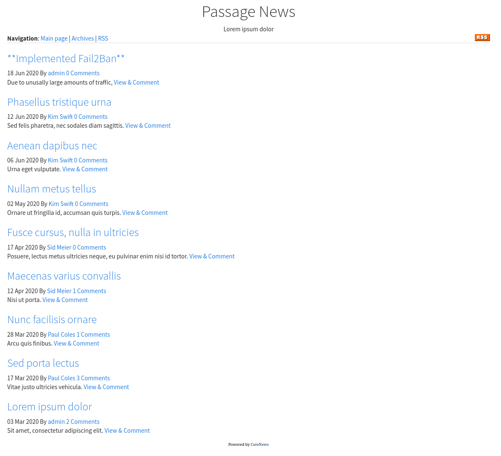

We can leave comments:

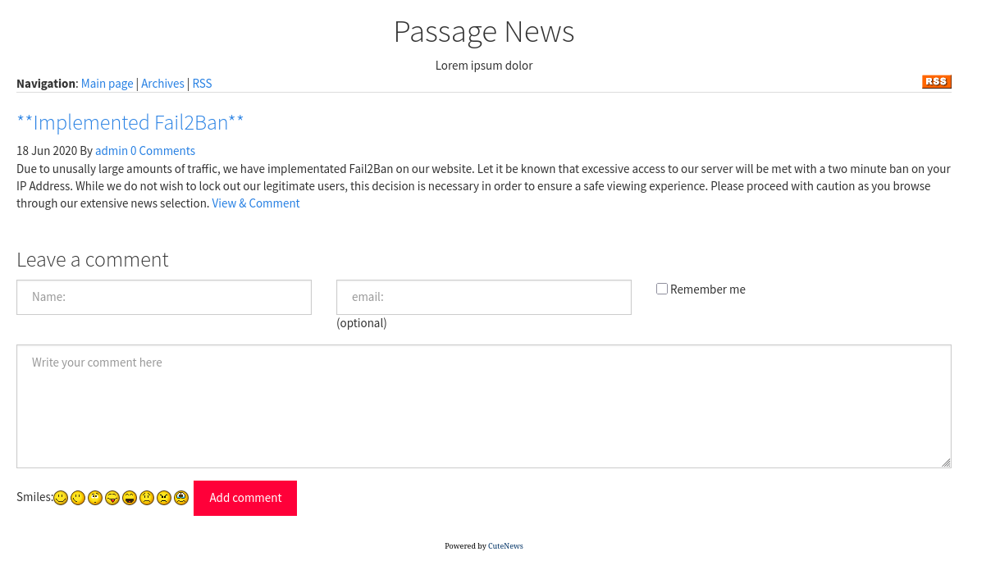

>[!note]
>The blog mentions that they've implemented a **Fail2Ban** system where it will block us for 2 minutes in case of heavy traffic so we will have to limit our automated testing.

I checked out the tech stack:

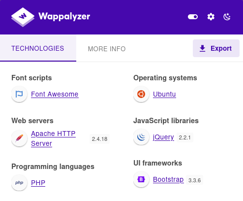

And noticed that the site is powered by **CuteNews** and the copyright mentions **Passage News 2020** so I started checking for exploits:

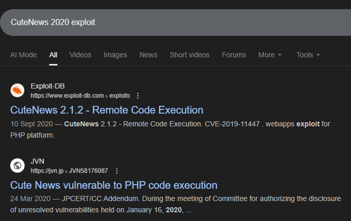

# Exploitation
## CVE-2019-11447

I checked out [the exploit](https://www.exploit-db.com/exploits/48800):

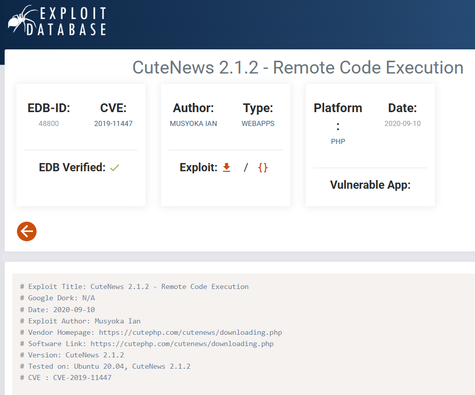

I went ahead and tested it out:

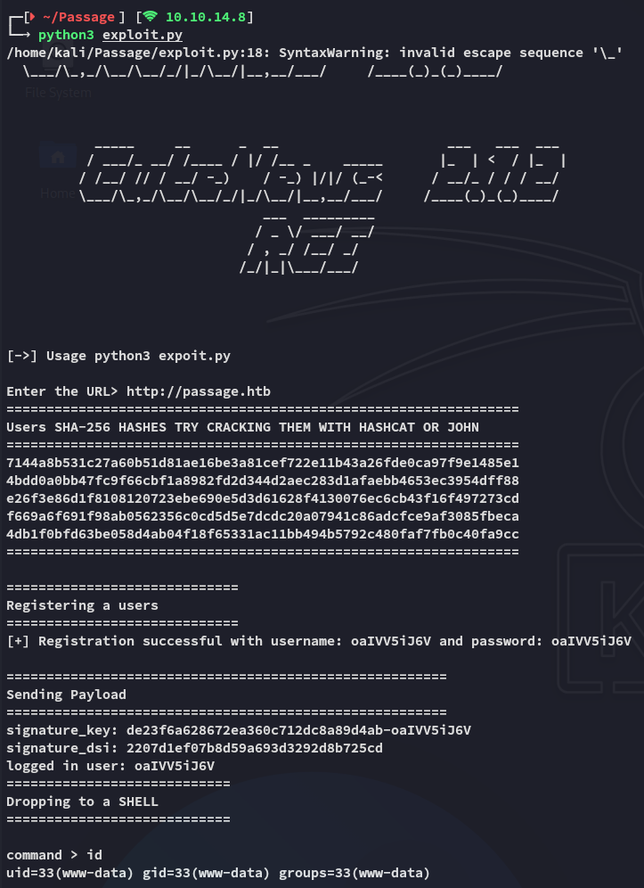

And we've successfully achieved **RCE**, time to execute some commands.

# Foothold
## Shell as www-data

I then established a reverse shell connection:


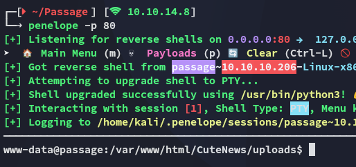

Hereafter I enumerated the users present on the target:

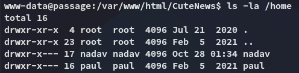

I didn't have permissions over either directories.

Looking around in the webroot I found something interesting:

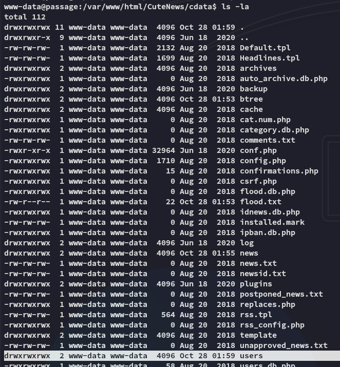

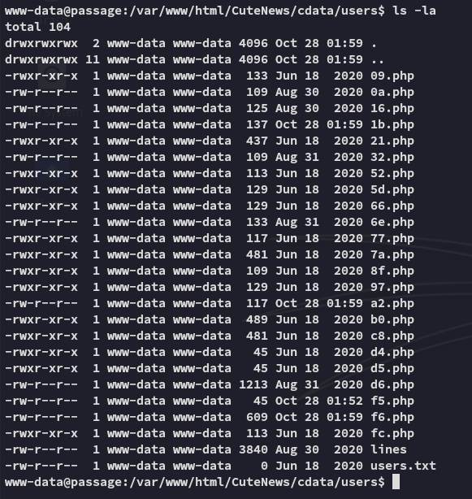

These files all contained lines that looked like this:

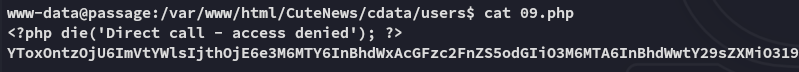

These are `base64` encoded and are easily decoded:

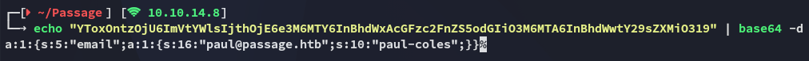

However some files, like `b0.php` in this case, were bigger and contained more info:

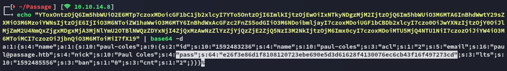

It looks like some of these contain hashes, which is great since there are 2 users on the system, where one of them is *paul*. We can enumerate this quicker instead of just going through them manually:

```bash
for f in *; do
>   body=$(sed -n '1,200p' "$f" \
>     | sed '1s/^<?php.*die;//I' \
>     | tr -d '\r\n' \
>     | sed 's/[^A-Za-z0-9+\/=]//g')
>   [ -z "$body" ] && continue
>   echo "$body" | base64 -d 2>/dev/null || continue
> done \
> | perl -0777 -ne '
>   # match the structure: s:<len>:"name";a:<n>:{ s:<len>:"<username>";a:<m>:{ ... s:4:"pass";s:<len>:"<hash>" ...
>   while (m/s:\d+:"name";a:\d+:\{\s*s:\d+:"([^"]+)";a:\d+:\{.*?s:4:"pass";s:\d+:"([0-9a-f]{64})"/gs) {
>     print "$1:$2\n";
>   }
> ' \
> | sort -u
```

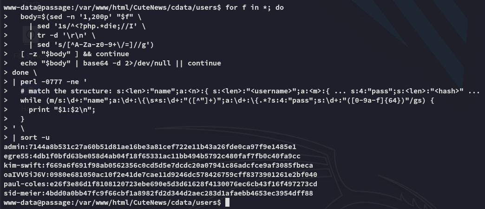

Only 2 of these were crackable:

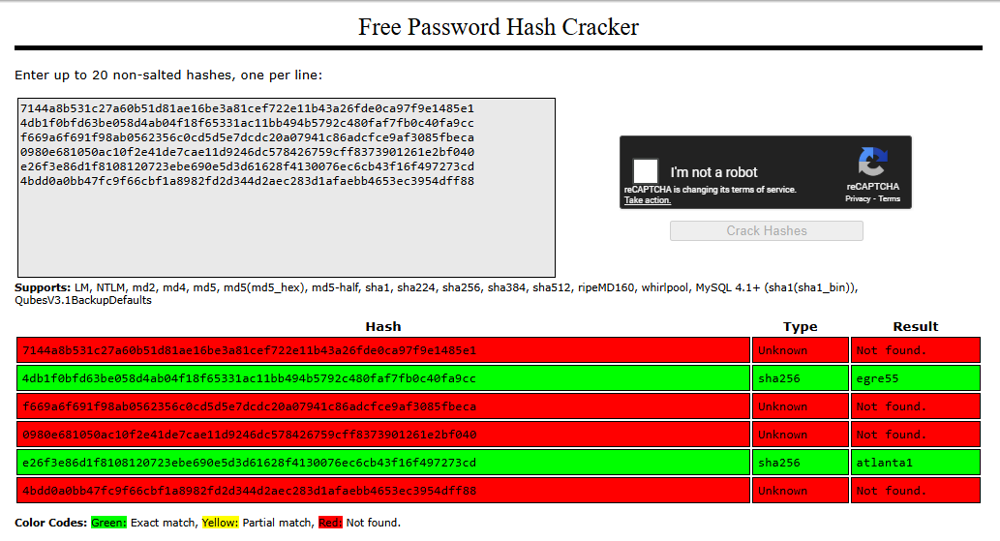

## Shell as paul

We can use the following creds to get a shell as *paul*:

```
paul
atlanta1
```

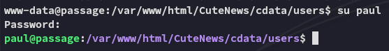

### user.txt

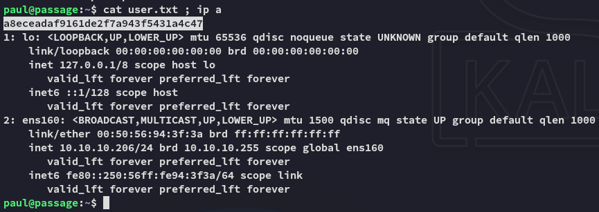

### Enumeration

Unfortunately I can't run `sudo -l`:

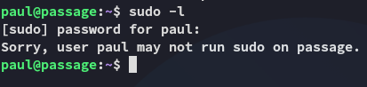

I then read the `id_rsa` and used it to log in:

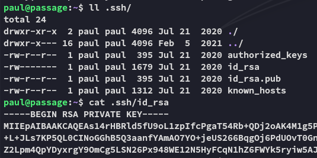

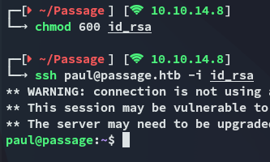

While checking further I didn't see anything noteworthy on the surface except for the fact that the `id_rsa.pub` had *nadav*'s name in it:

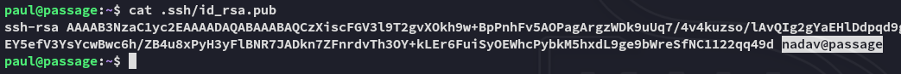

Could this be a shared key?

## Shell as nadav

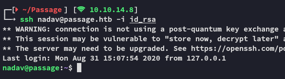

It turns out the same key can be used to log in as *nadav*.

### Enumeration

While I can't run `sudo -l`:

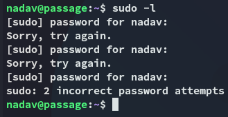

I did notice that this user is in some *interesting* groups to say the least:

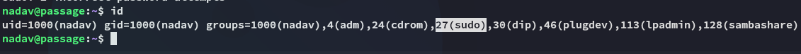

Unfortunately for us though we can't do anything with the `sudo` group as we don't have the password for *nadav*...

# Privilege Escalation
## USBCreator D-Bus

I found a [blog](https://unit42.paloaltonetworks.com/usbcreator-d-bus-privilege-escalation-in-ubuntu-desktop/) that showed a flaw in the **USBCreator D-Bus** interface:


Interestingly they mention the same *nadav* user in their blog:

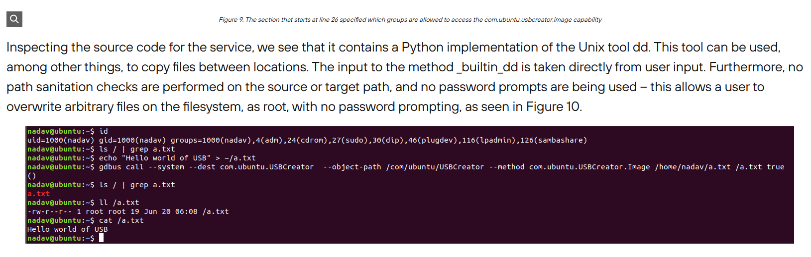

### Exploitation

1. Copy a file to a non-existent file location:

```bash
gdbus call --system --dest com.ubuntu.USBCreator --object-path /com/ubuntu/USBCreator --method com.ubuntu.USBCreator.Image /root/root.txt /tmp/owned true
```

2. Read the file:

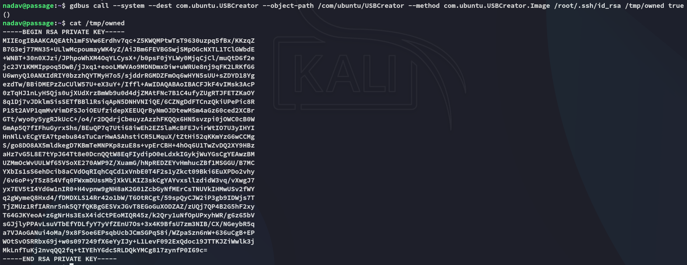

Now we can abuse the fetched `id_rsa` to log in as *root*.

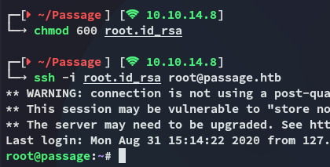

### root.txt

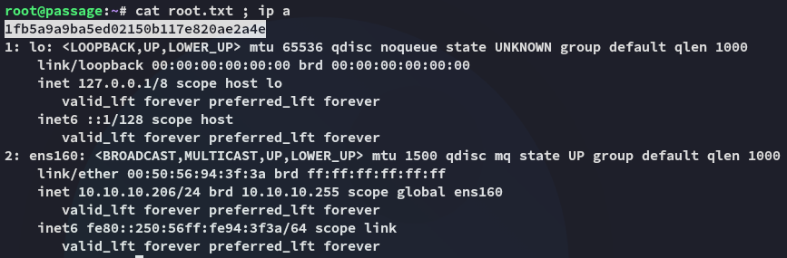

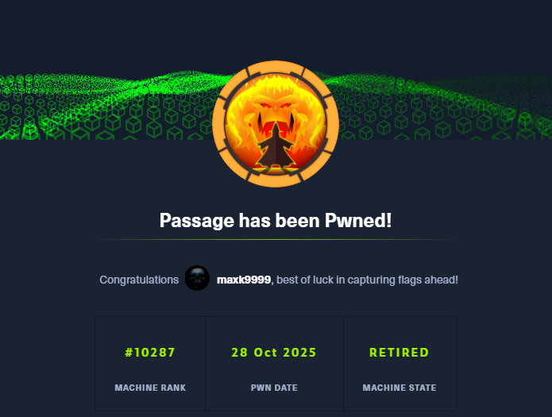

---

**Finished 11:00 28-10-2025**

[^Links]: [[Hack The Box]]

#CVE-2019-11447 #USBCreator #D-Bus 
