```
Scope:
10.10.11.68

Creds:
admin / 0D5oT70Fq13EvB5r
```

# Recon
## Nmap

```bash
sudo nmap -sC -sV -sT -vvvv -p- -T5 --min-rate=5000 -Pn planning.htb

PORT   STATE SERVICE REASON  VERSION
22/tcp open  ssh     syn-ack OpenSSH 9.6p1 Ubuntu 3ubuntu13.11 (Ubuntu Linux; protocol 2.0)
80/tcp open  http    syn-ack nginx 1.24.0 (Ubuntu)
| http-methods: 
|_  Supported Methods: GET HEAD POST
|_http-title: Edukate - Online Education Website
|_http-server-header: nginx/1.24.0 (Ubuntu)
Service Info: OS: Linux; CPE: cpe:/o:linux:linux_kernel
```

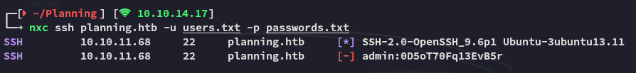

No easy win.

## 80/TCP - HTTP


I ran a `gobuster` scan:

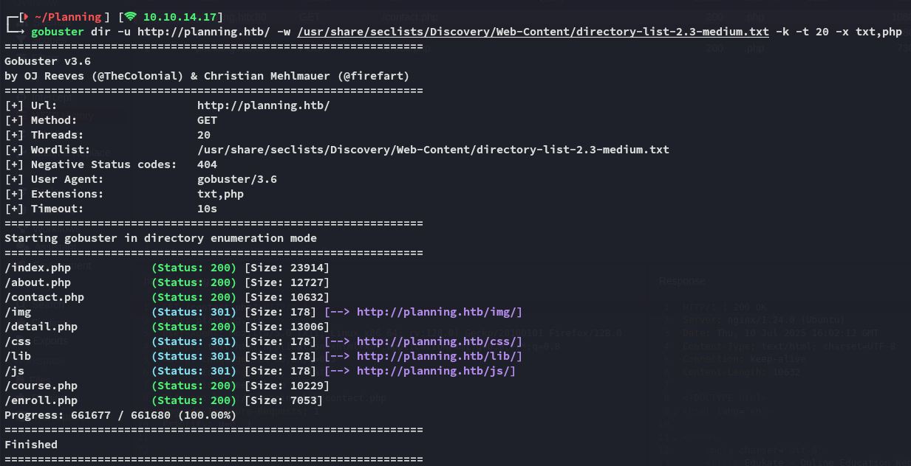

I then tried creating wordlists out of the found instructors, hoping that I could brute force it with the provided password.

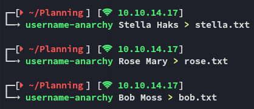

None of these matched however:

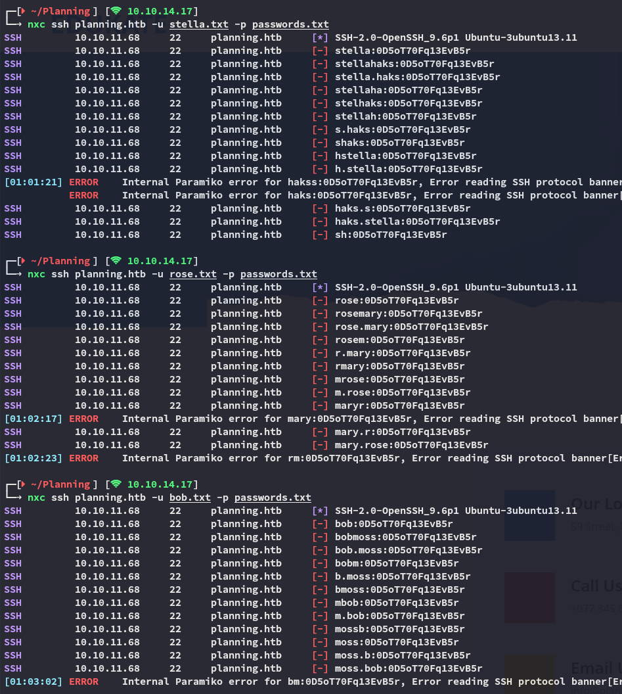

### Vhost 

I then started enumerating `vhosts` using `ffuf`:


I went ahead and added it to my `/etc/hosts`:

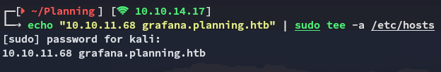

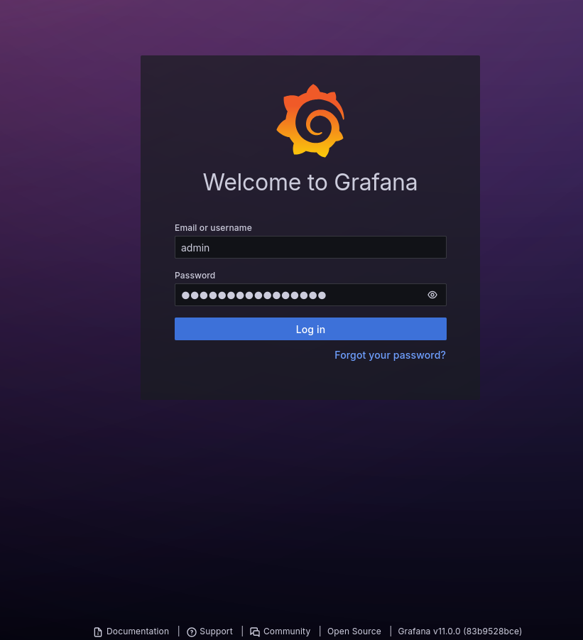

I went ahead and input the creds and got in:

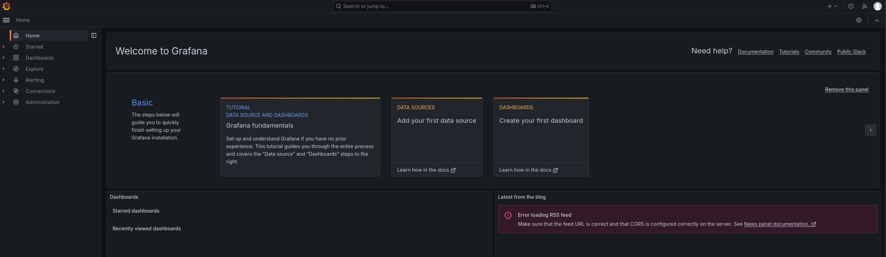

## PoC

I then searched up whether there was any RCE exploit for the **Grafana v11.0** version:

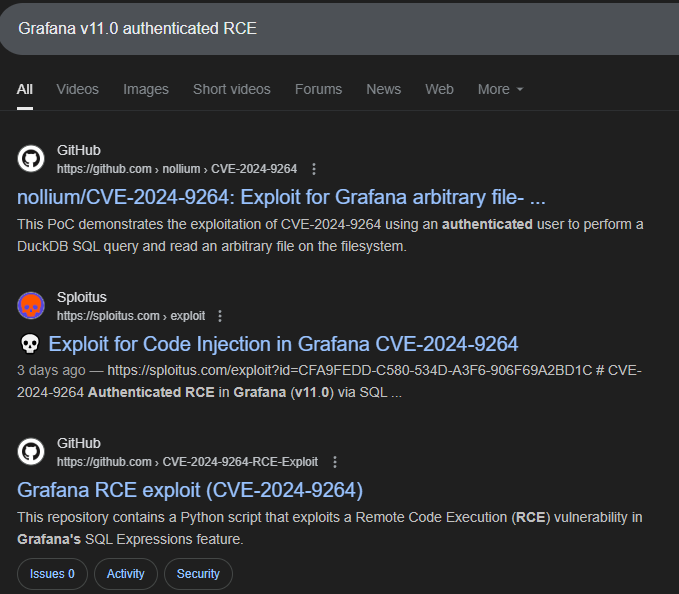

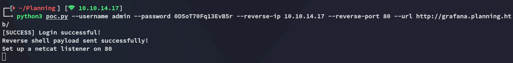

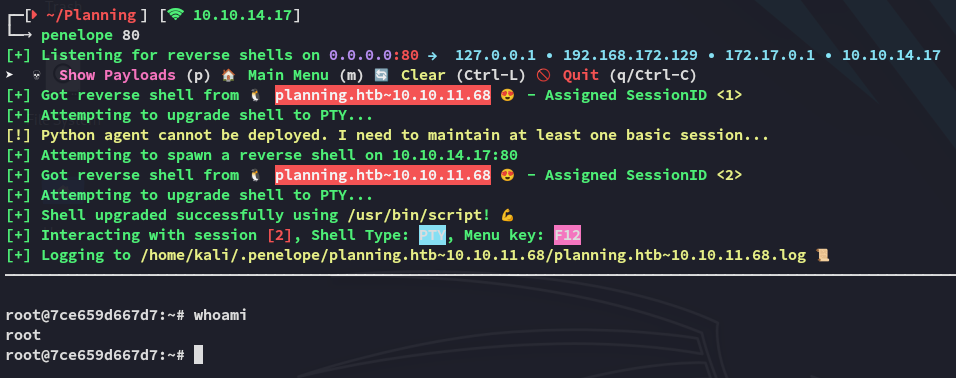

While this looked promising, I was not done yet.

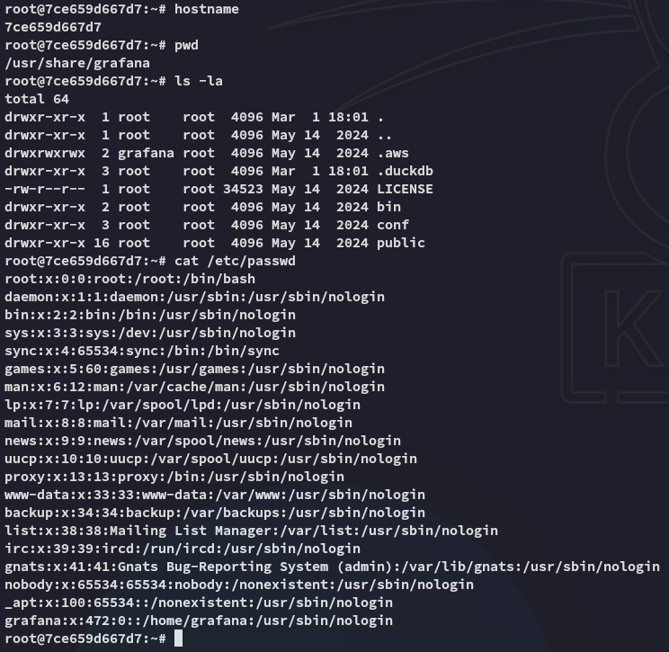

By using the `env` command however I was able to find some juicy creds:

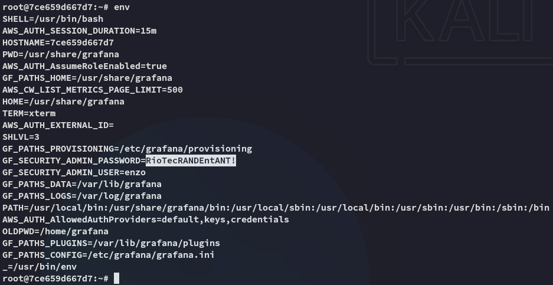

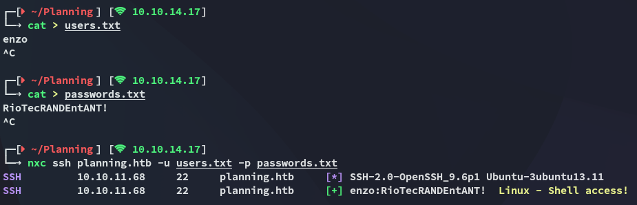

```
enzo
RioTecRANDEntANT!
```

Success!

# Foothold
## Shell as enzo

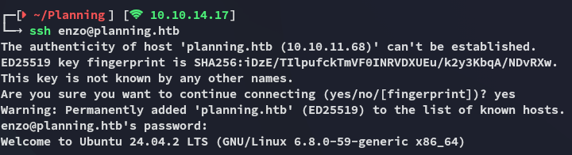

Time to get `user.txt`

### user.txt

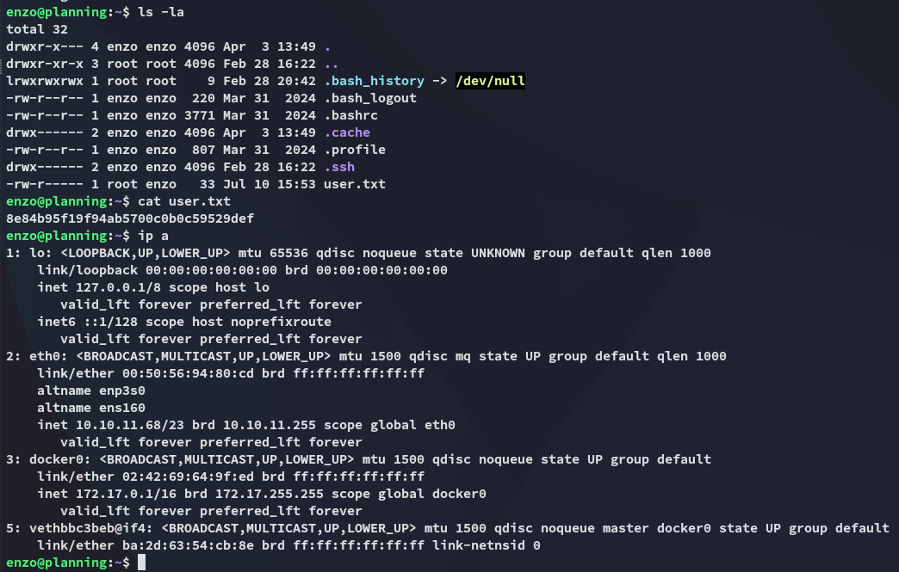

I then tried an easy win but unfortunately it didn't work:

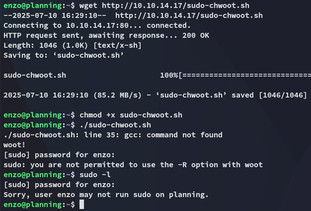

# Privilege Escalation
## Enumeration

I downloaded over `linpeas.sh` and started enumerating:

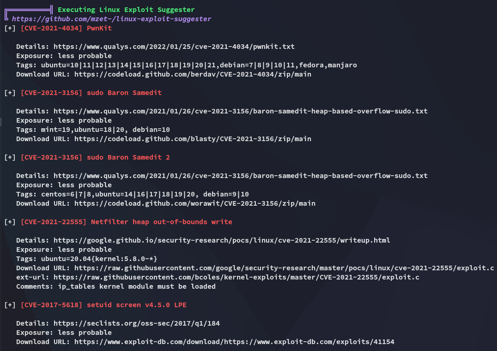

Well that sucks.


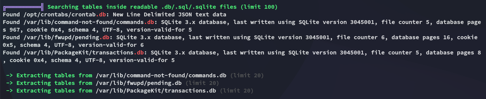

Let's check the last one out.

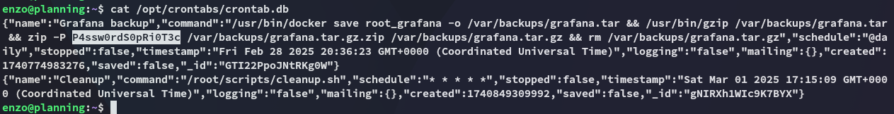

## Local Port Forward

I use the following command on `ssh` to port forward so I can access the `8000` port.

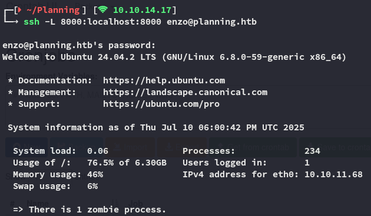

I use the found creds:


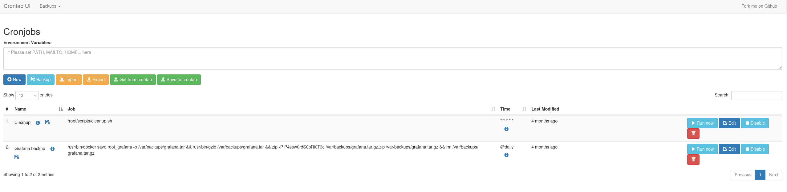

And I'm in.

I create a new cron job:

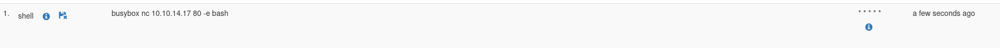

I start a listener and click on **Run now**:

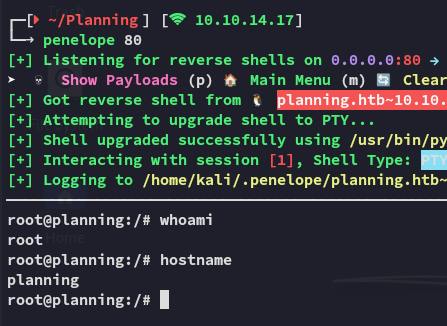

### root.txt

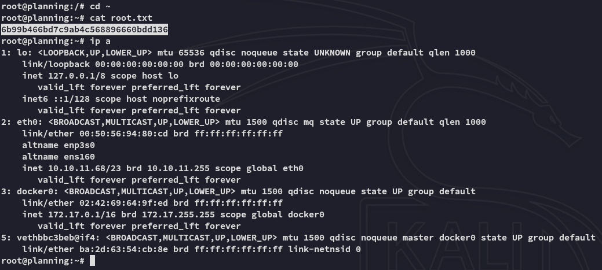

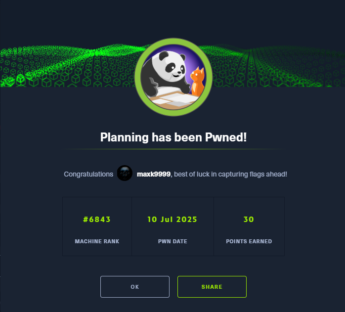

---