---
title: 'HTB-Shoppy'
published: 2025-09-18
draft: false
toc: true
---
**Start 10:33 25-09-2025**

---
```
Scope:
10.10.11.180
```
# Recon
## Nmap

```bash
sudo nmap -sV -sC -sT -p- shoppy.htb -T5 --min-rate=5000 -vvvv -Pn 

PORT     STATE SERVICE REASON  VERSION
22/tcp   open  ssh     syn-ack OpenSSH 8.4p1 Debian 5+deb11u1 (protocol 2.0)
80/tcp   open  http    syn-ack nginx 1.23.1
|_http-title:             Shoppy Wait Page        
|_http-server-header: nginx/1.23.1
|_http-favicon: Unknown favicon MD5: D5F0A0ADD0BFBB2BC51607F78ECE2F57
| http-methods: 
|_  Supported Methods: GET HEAD POST OPTIONS
9093/tcp open  http    syn-ack Golang net/http server
|_http-trane-info: Problem with XML parsing of /evox/about
| http-methods: 
|_  Supported Methods: GET HEAD POST OPTIONS
|_http-favicon: Unknown favicon MD5: DEAA4EF1DE78FC2D7744B12A667FA28C
|_http-title: Site doesnt have a title (text/plain; version=0.0.4; charset=utf-8).
| fingerprint-strings: 
|   GenericLines: 
|     HTTP/1.1 400 Bad Request
|     Content-Type: text/plain; charset=utf-8
|     Connection: close
|     Request
|   GetRequest: 
|     HTTP/1.0 200 OK
|     Content-Type: text/plain; version=0.0.4; charset=utf-8
|     Date: Thu, 25 Sep 2025 08:35:12 GMT
```

## 80/TCP - HTTP

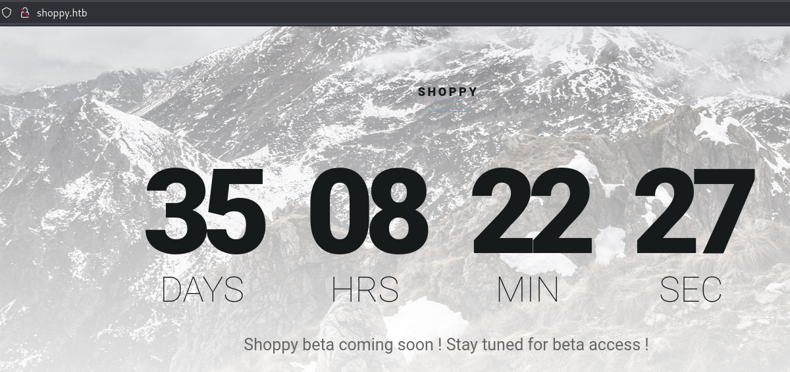

The site did not have anything on the surface so I went ahead and used `gobuster` to enumerate it:

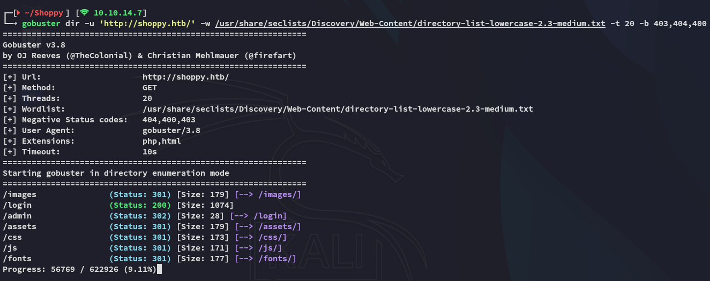

I then headed over to the `/login` page:

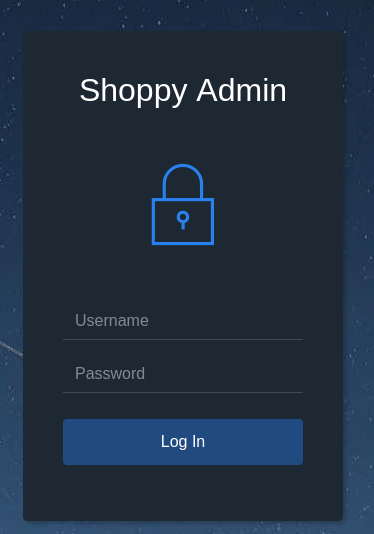

I then tried to submit default creds and viewed the output:

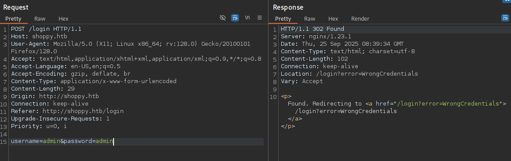

I tried manipulating it to achieve SQLi:

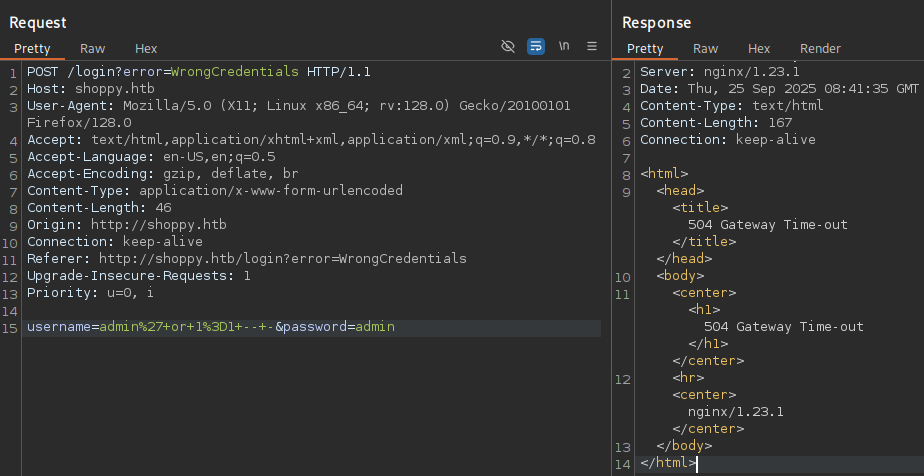

This isn't really helpful for now. Checking `wappalyzer` yields nothing interesting either:

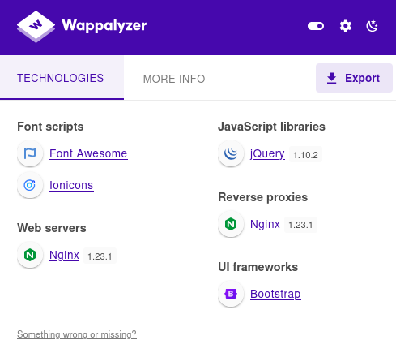

### NoSQL Injection

Since the `'` was messing up the query and giving a timeout response it's still worth looking into **NoSQL Injection** in case the server is running something like **MongoDB**.

I searched for some payloads and found the following list:

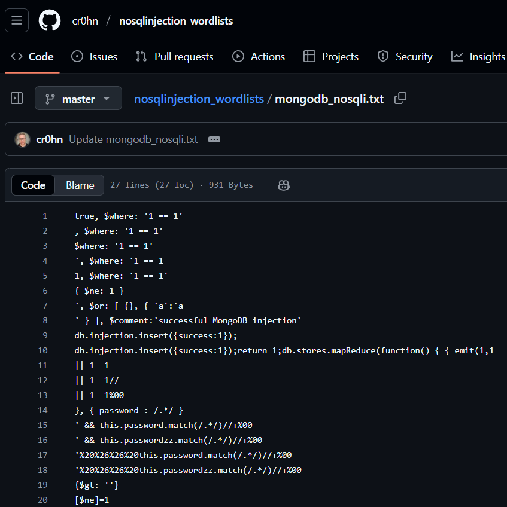

I tried my luck and found a payload that actually worked!

```
username=admin' || '1'=='1&password=admin
```

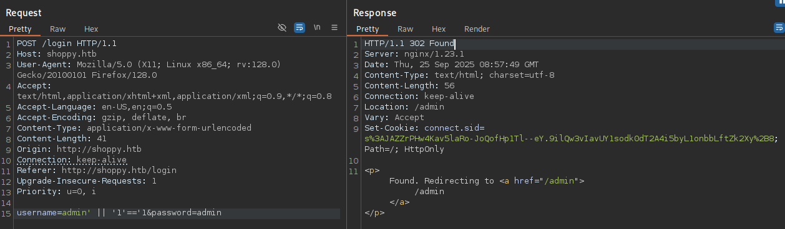

I went ahead and entered it on the website:

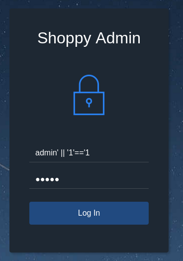

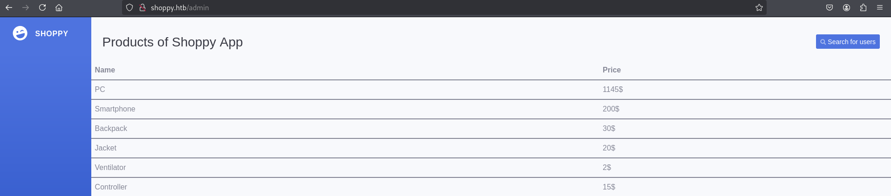

Clicking on **Search for users** lets me search for any users and give me their data:

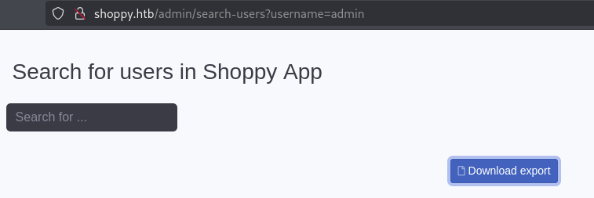

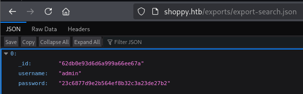

### Burpsuite Intruder

I then analyzed the request and found that if the user exists, then the response would be a `304`:

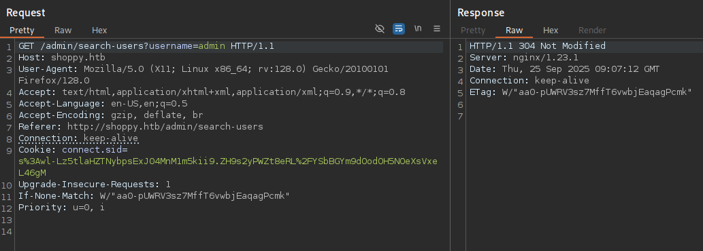

Otherwise it's a `200`:

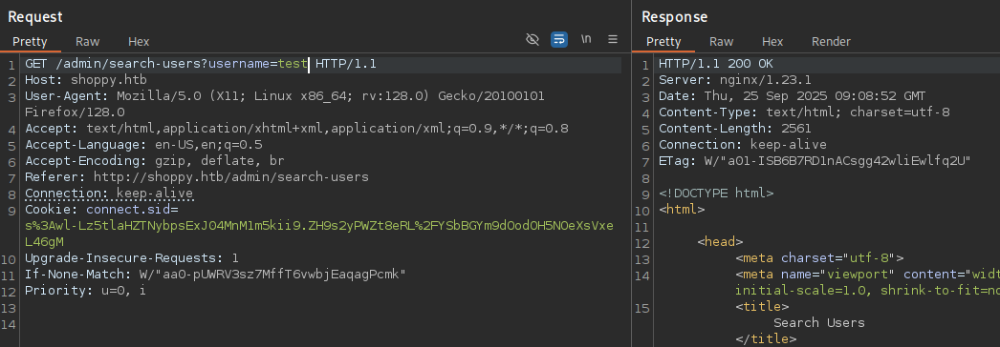

Using this knowledge we can initiate a `burp Intruder` attack where we use a list with usernames to fuzz for existing users.


Using an extensive list such as `john.txt` from the `statistically-likely-usernames` repo yields us the following result:

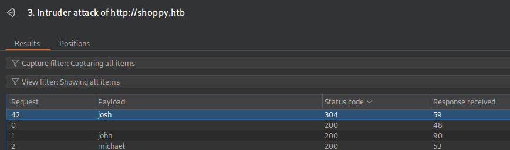

It appears that there's a user called *josh*!

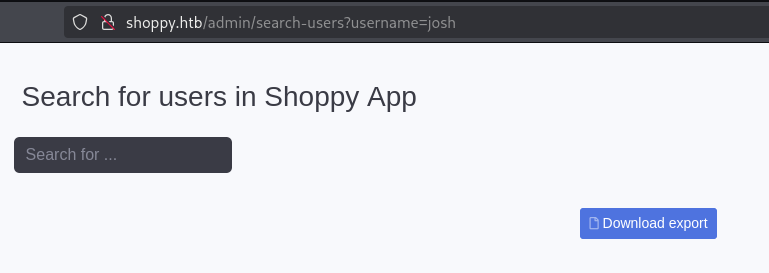

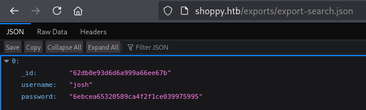

Let's try cracking the MD5 hash.

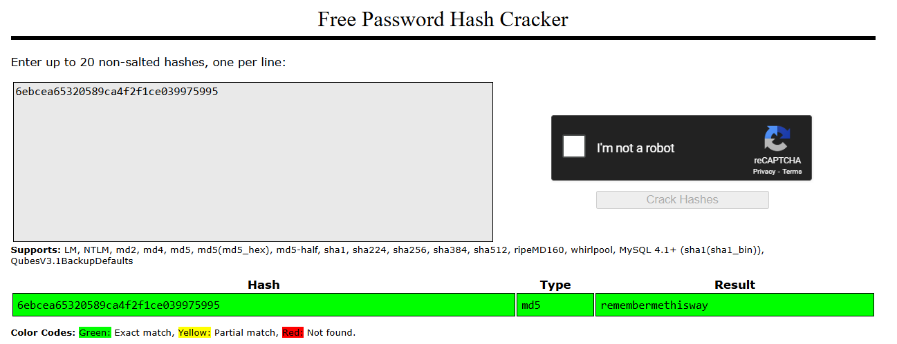

```
josh
remembermethisway
```

### NoSQLi Alternative

Since we already know that there's a NoSQLi vulnerability we can leverage it to find all present users:

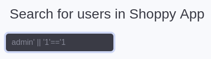

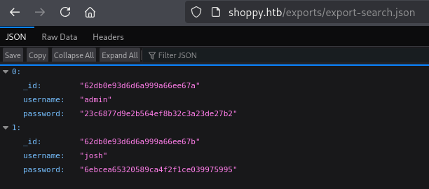

Now that we've found creds we should be able to login, but where? SSH did not work so let's look further.

### Subdomain fuzzing 

I tried out port `9093` but that did not seem helpful in any way so I ran `ffuf` to enumerate further:

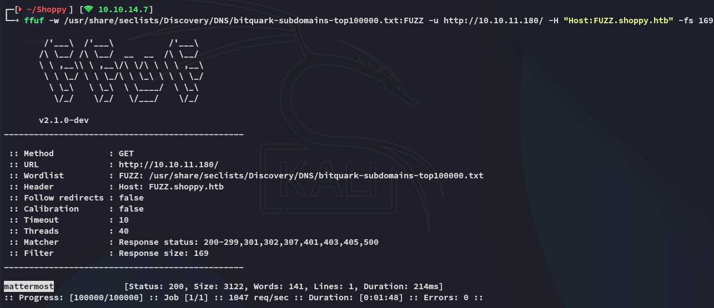

And I was able to find the `mattermost` subdomain!

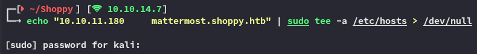

### mattermost

After adding the domain to my `/etc/hosts` I went ahead and visited the website:


I used the previously found creds to login:


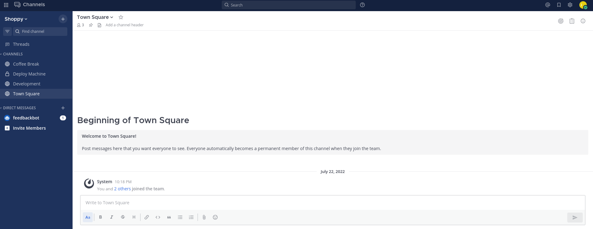

Scrolling through the channels we find cleartext credentials posted:

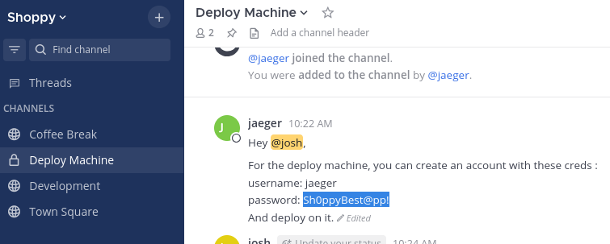

```
jaeger
Sh0ppyBest@pp!
```

# Foothold
## SSH as jaeger

Using the found creds we get access to the target:

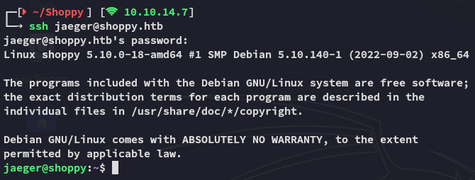

### user.txt

We can grab the first flag right away:

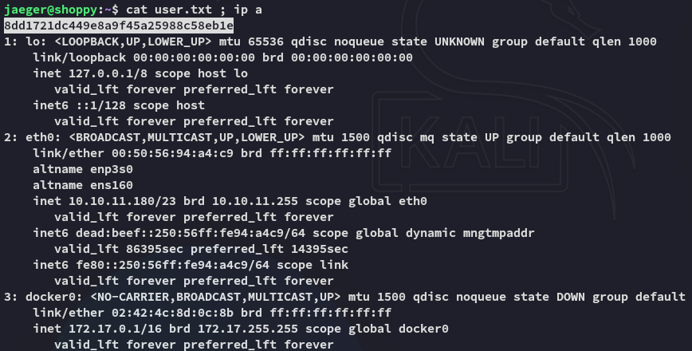

### Strings

I perform some surface level enum of the user:

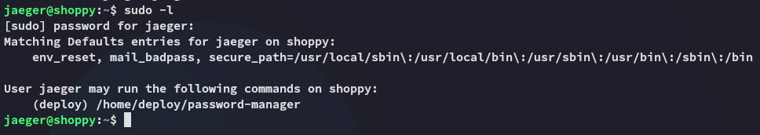

This is the program *josh* was talking about in the chat:

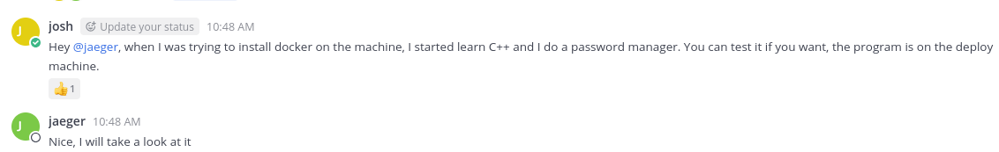

Apparently it's written in `C++`, not sure whether that's useful for us right now.

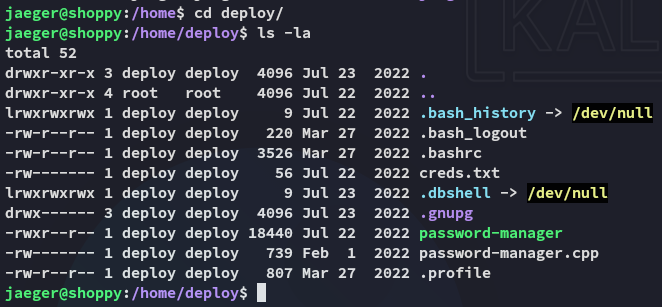

I tested it out:

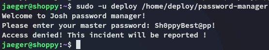

I tried the other password but that didn't work either:

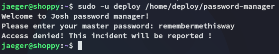

I read the binary using `strings` to understand how it works underneath:

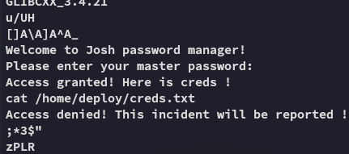

Furthermore we can use the `-e` option on `strings` in order to select character endianness:

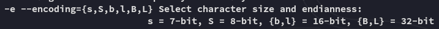

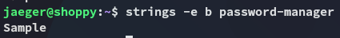

Using the hardcoded credentials we can get access to `creds.txt`:

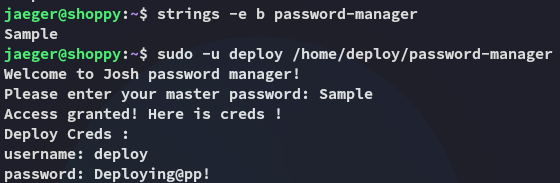

```
deploy
Deploying@pp!
```

This gives us the ability to move laterally.

## Lateral Movement

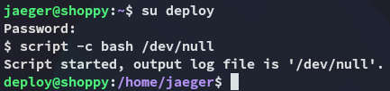

Eventhough we weren't able to run `sudo -l` we still find that we're part of the `docker` group.

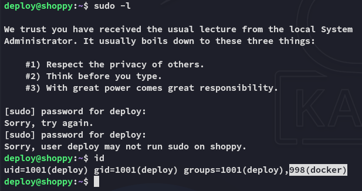

# Privilege Escalation
## Docker

This is an amazing position to be in since we can easily exploit the binary using [GTFObins](https://gtfobins.github.io/gtfobins/docker/):

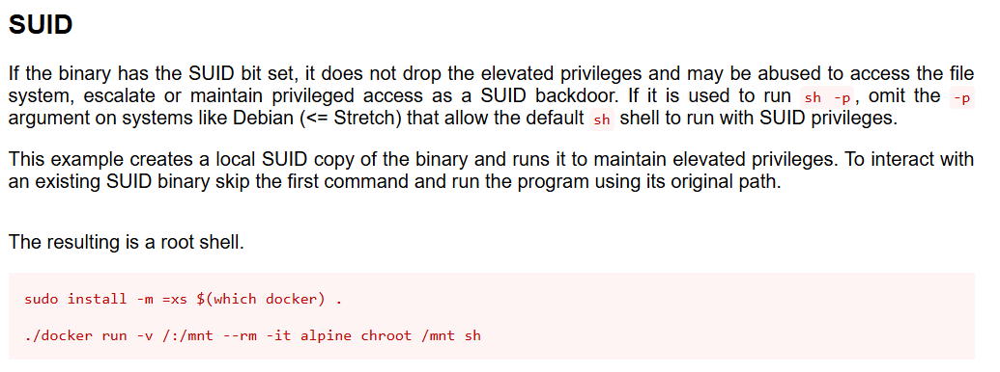

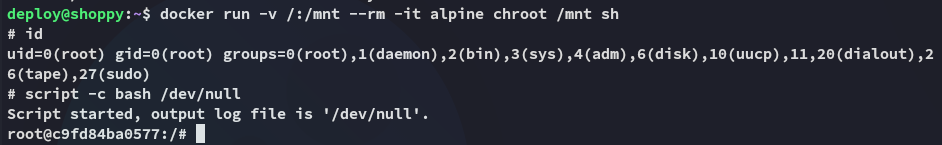

### root.txt

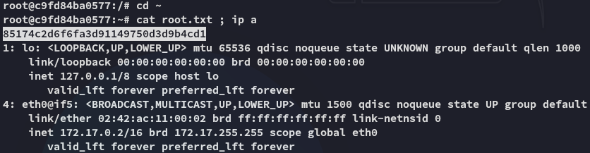

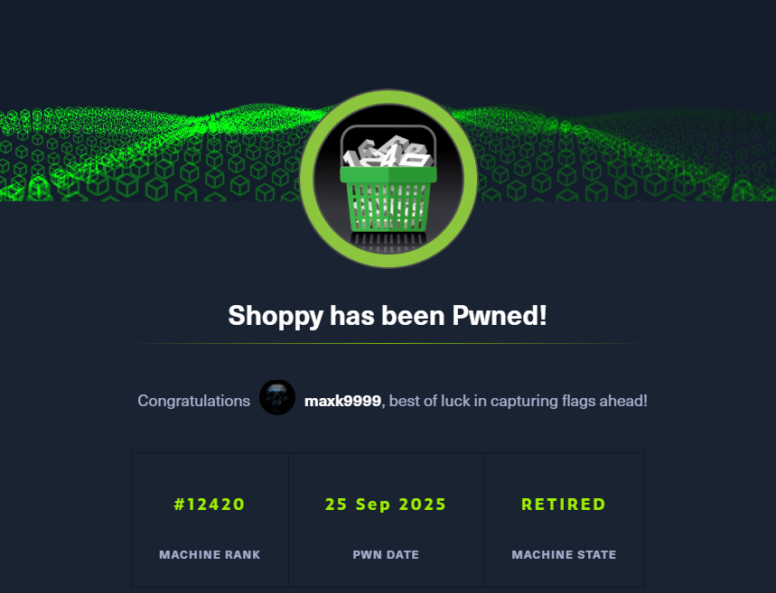

---

**Finished 12:05 25-09-2025**

[^Links]: [[Hack The Box]]

#NoSQL #Intruder #ffuf #strings #docker 
