**Start 09:30 25-09-2025**

---
```
Scope:
10.10.11.166
```
# Recon
## Nmap

```bash
sudo nmap -sV -sC -sT -p- trick.htb -T5 --min-rate=5000 -vvvv -Pn 

PORT   STATE SERVICE REASON  VERSION
22/tcp open  ssh     syn-ack OpenSSH 7.9p1 Debian 10+deb10u2 (protocol 2.0)
25/tcp open  smtp    syn-ack Postfix smtpd
|_smtp-commands: debian.localdomain, PIPELINING, SIZE 10240000, VRFY, ETRN, STARTTLS, ENHANCEDSTATUSCODES, 8BITMIME, DSN, SMTPUTF8, CHUNKING
53/tcp open  domain  syn-ack ISC BIND 9.11.5-P4-5.1+deb10u7 (Debian Linux)
| dns-nsid: 
|_  bind.version: 9.11.5-P4-5.1+deb10u7-Debian
80/tcp open  http    syn-ack nginx 1.14.2
|_http-server-header: nginx/1.14.2
| http-methods: 
|_  Supported Methods: GET HEAD
|_http-favicon: Unknown favicon MD5: 556F31ACD686989B1AFCF382C05846AA
|_http-title: Coming Soon - Start Bootstrap Theme
Service Info: Host:  debian.localdomain; OS: Linux; CPE: cpe:/o:linux:linux_kernel
```

I noticed the `53` port first which I used to zone transfer:

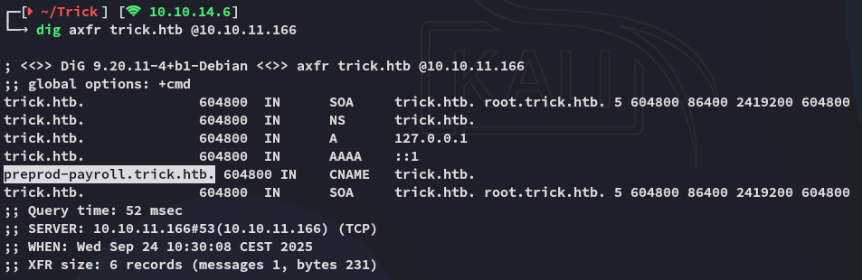

I found a subdomain called `preprod-payroll`.

## 80/TCP - HTTP
### preprod-payroll

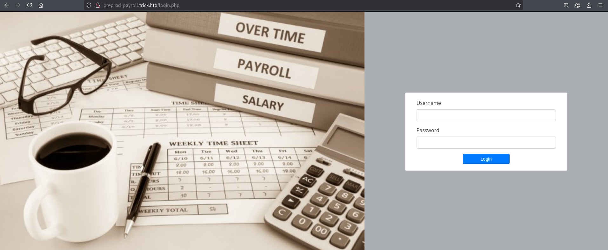

I used `gobuster` to enumerate the endpoints. Since this is a *pre-production* subdomain, it's LIKELY to still contain debug functionalities of some sorts.

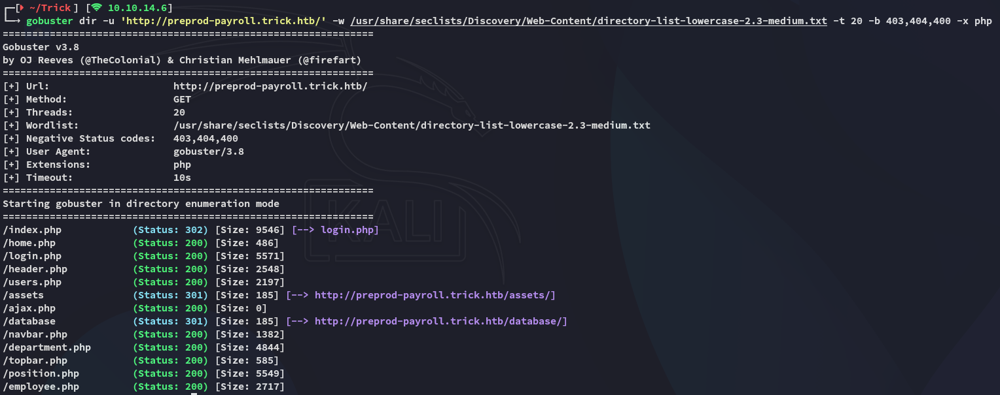

`/users.php` sounds interesting!

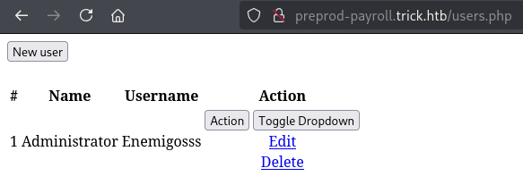

I then checked out the other endpoints:

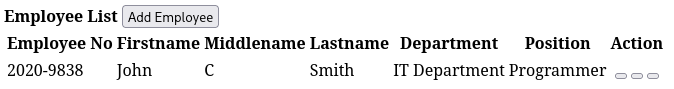

But I couldn't do anything in either of them. I know that there's a `/database` however, meaning some sort of SQL commands get used. Maybe there's a SQLi here?

### SQLi testing

I copied the initial request and used it with `sqlmap` to bruteforce the db:

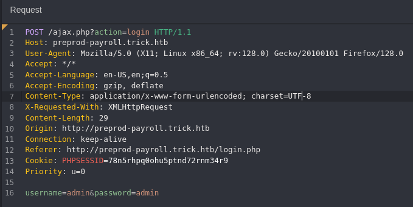

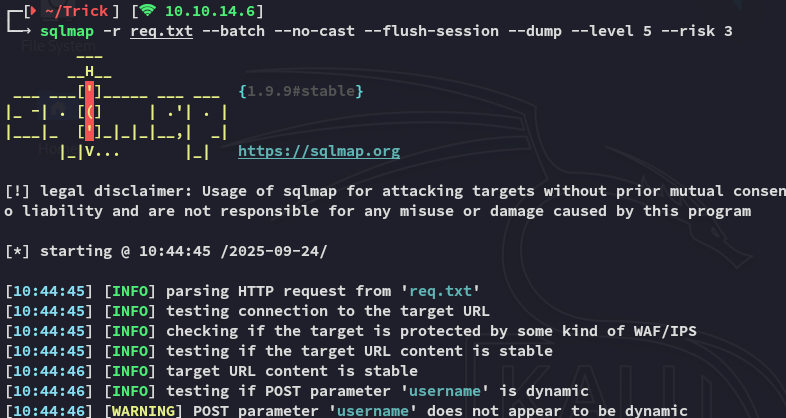

It worked!

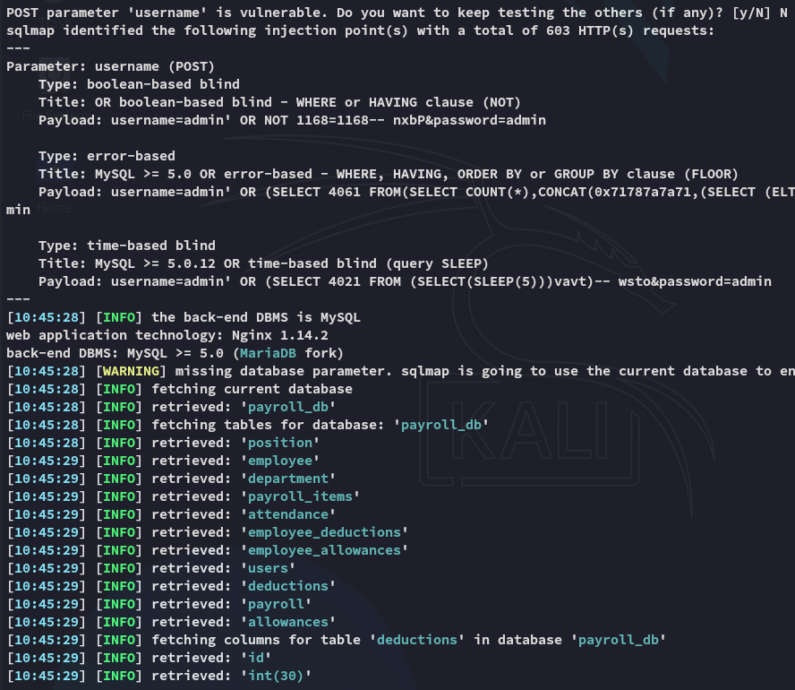

I found the creds down below:

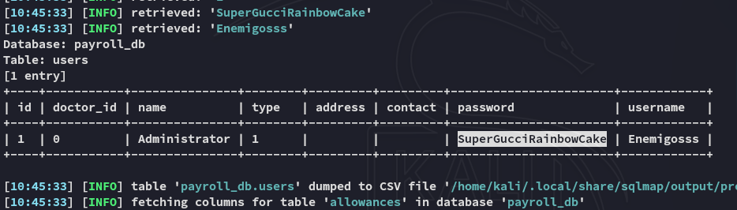

```
Administrator
SuperGucciRainbowCake
```

I could now use these creds to login:

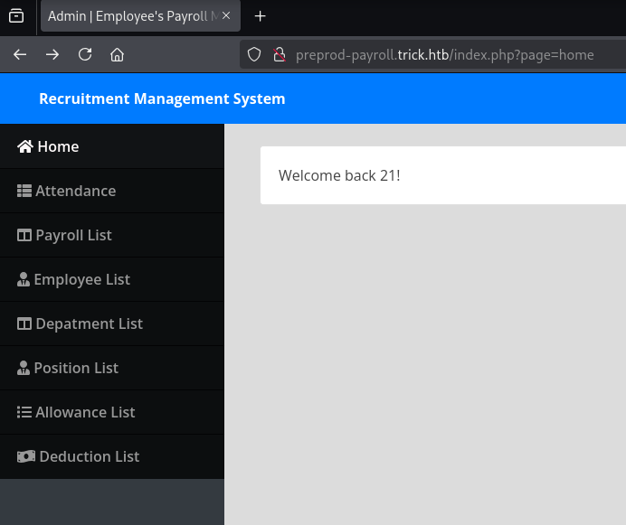

### LFI 

I tried out reading `/etc/passwd` using the URL but that didn't work:

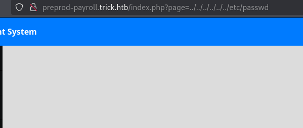

This didn't seem to work so I tried my next trick to get the PHP page source:

```url
php://filter/read=convert.base64-encode/resource=users
```

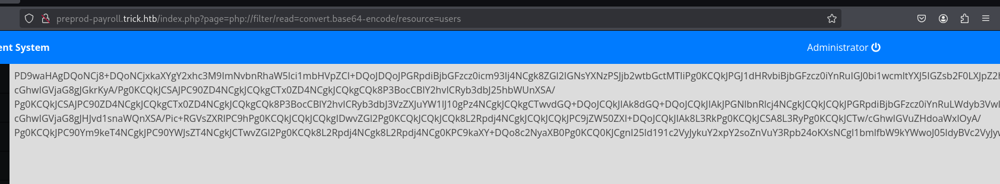

I then used the following to decode the `base64` encoding:

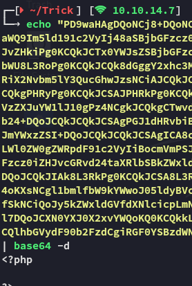

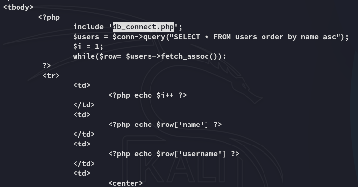

The above gave us the file that we should look into, so I went ahead and read and decoded it:

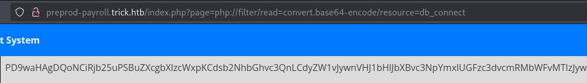

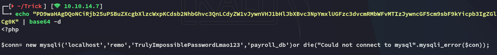

This gave us a set of creds.

```
remo
TrulyImpossiblePasswordLmao123
```

However this would not give us access to `ssh`:

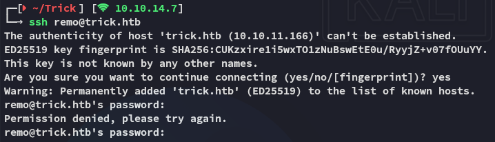

I tried out port `25` but got nowhere either. 

### ffuf - discovering preprod-marketing

Instead I used `ffuf` to discover yet another subdomain called `preprod-marketing` as follows:

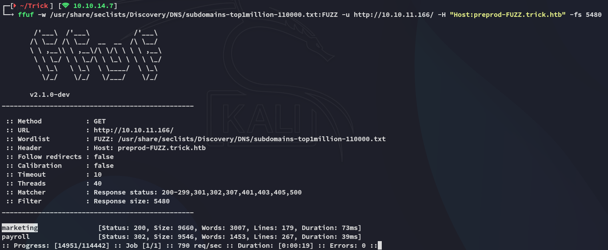

### preprod-marketing

I head on over to the webpage and am greeted with this landing page.


Here we find yet again a possible **LFI** vulnerability:


### Even More LFI

I was able to retrieve the `/etc/passwd` file contents as follows:

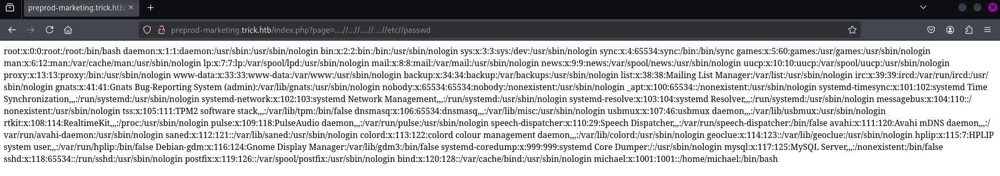

Here we find the user *michael*. It is possible that the passwords are reused.

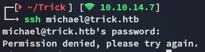

Unfortunately they aren't. However we can easily grab *michael*'s `id_rsa`:


# Foothold
## SSH as michael


### user.txt

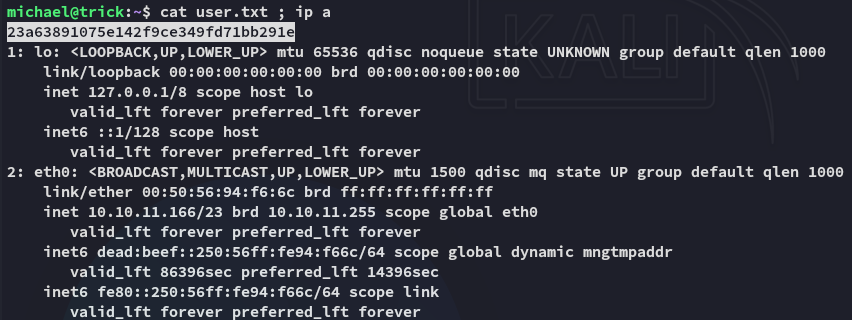

# Privilege Escalation
## fail2ban

Checking `sudo -l` we notice the following:

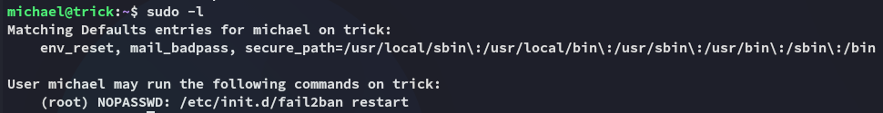

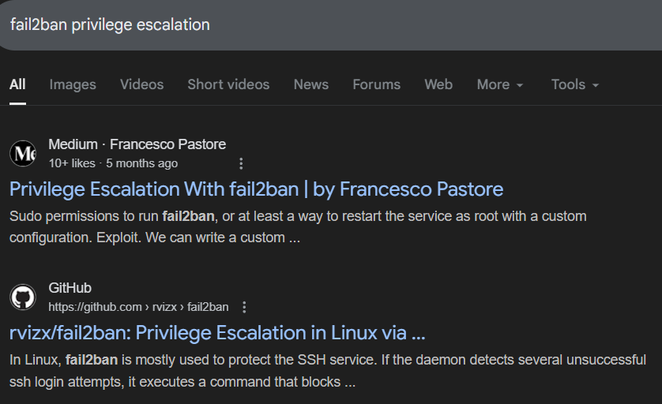

>[!quote]+
>In Linux, fail2ban is mostly used to protect the SSH service. If the daemon detects several unsuccessful ssh login attempts, it executes a command that blocks the IP address. So misconfigurations can lead to privilege escalation.

I used the `github` link and read the instructions:

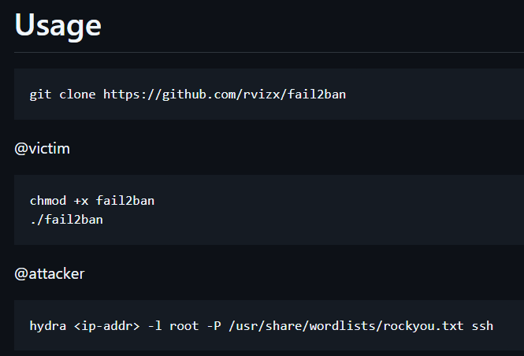

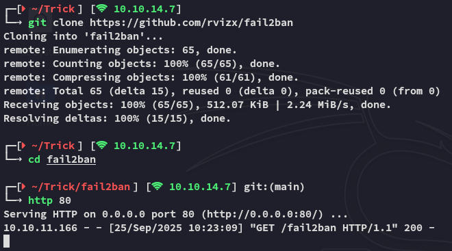

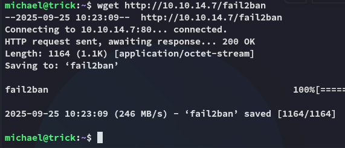

I then started up the exploit:

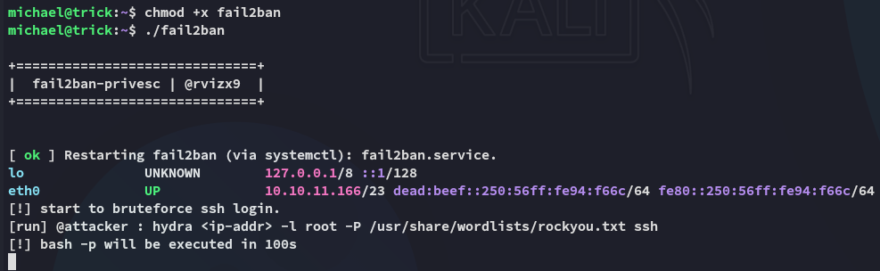

After waiting for roughly 100 seconds we become *root*:

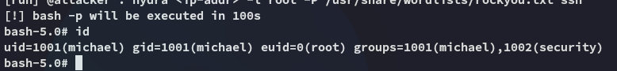

### root.txt

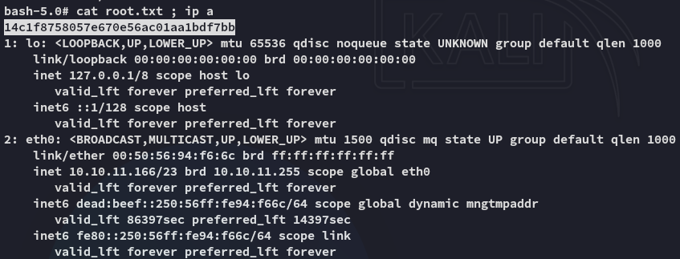

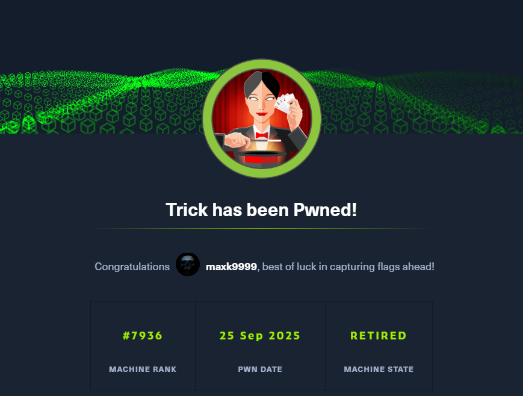

---

**Finished 10:27 25-09-2025**

[^Links]: [[Hack The Box]]

#fail2ban #LFI #SQLi #sqlmap #ffuf 
