import PasswordProtect from '~/components/PasswordProtect.client';

```
Scope:
10.129.15.56
```

# Recon
## Nmap

```bash
sudo nmap -sC -sV -sT -p- -Pn -T5 --min-rate=5000 -vvvv wingdata.htb

PORT   STATE SERVICE REASON  VERSION
22/tcp open  ssh     syn-ack OpenSSH 9.2p1 Debian 2+deb12u7 (protocol 2.0)
80/tcp open  http    syn-ack Apache httpd 2.4.66
| http-methods: 
|_  Supported Methods: POST OPTIONS HEAD GET
|_http-title: WingData Solutions
|_http-server-header: Apache/2.4.66 (Debian)
Service Info: Host: localhost; OS: Linux; CPE: cpe:/o:linux:linux_kernel
```

<PasswordProtect client:load>

## 80/TCP - HTTP

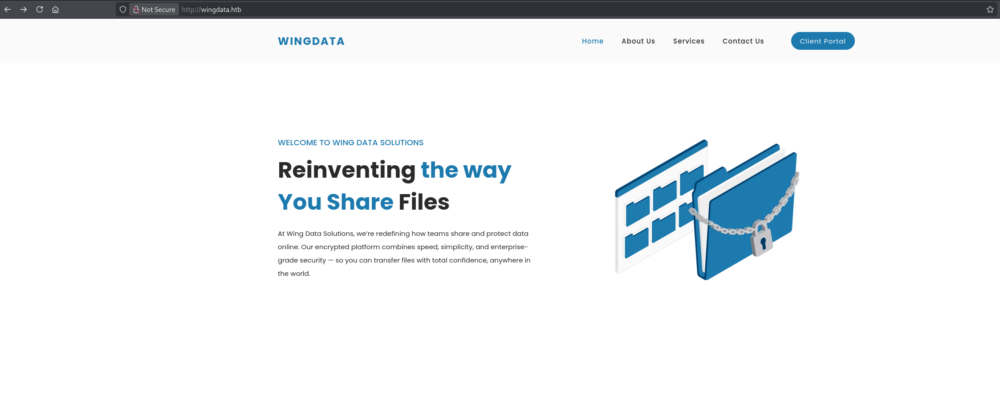

Heading over to the **Client Portal** tab we get redirected to another vhost which we need to add in order to access it.

Once added we can access it as follows:

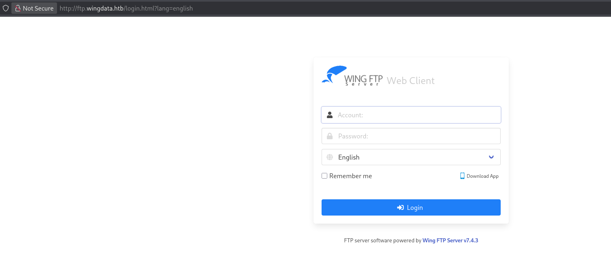

I notice the software version and look it up.

# Exploitation
## CVE-2025-47812

There appears to be a **Unauthenticated RCE** exploit available:

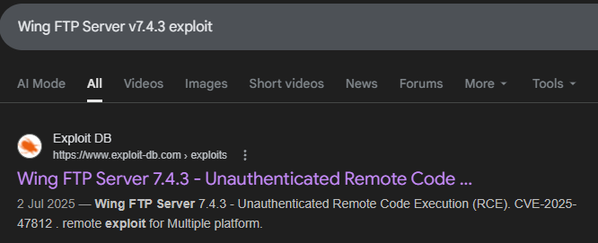

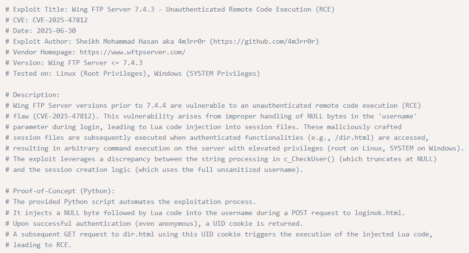

I download the PoC and attempt to run it:

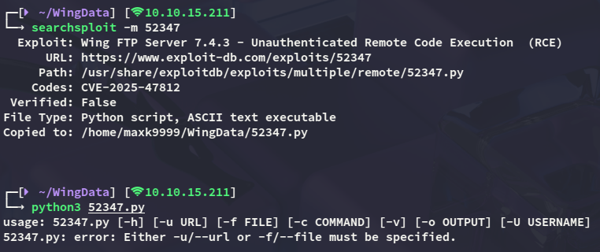

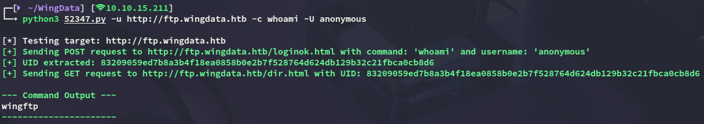

It appears to work flawlessly, let's get a reverse shell set up.

## Shell as wingftp

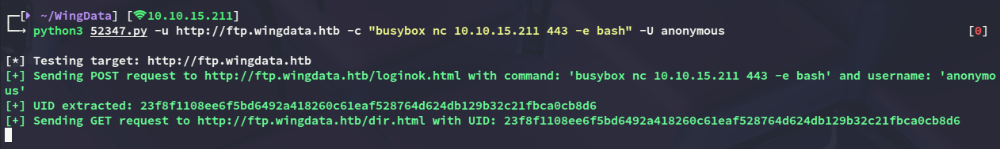

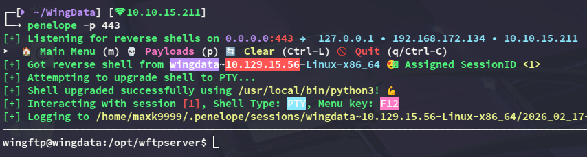

I notice one other user to whom we need to move laterally:

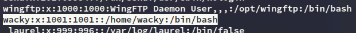

### Enumeration

While enumerating the directory we landed in we find the following:

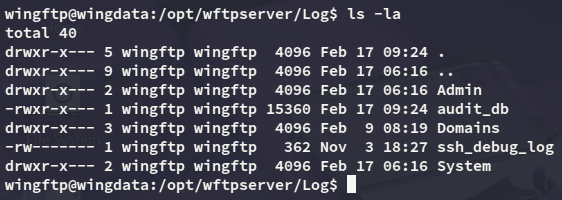

among these files the `audit_db` sounds interesting so I download it over:

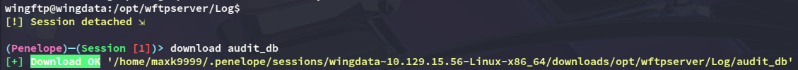

However nothing of use is found inside:

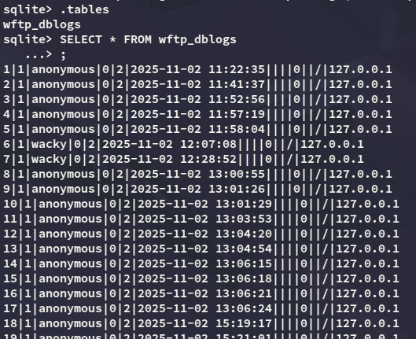

However looking further I did find a password for the server:

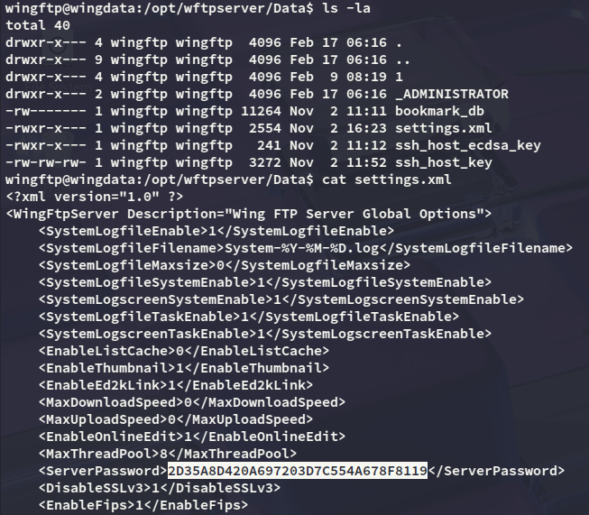

I was unable to crack the above hash however, so instead looked further:

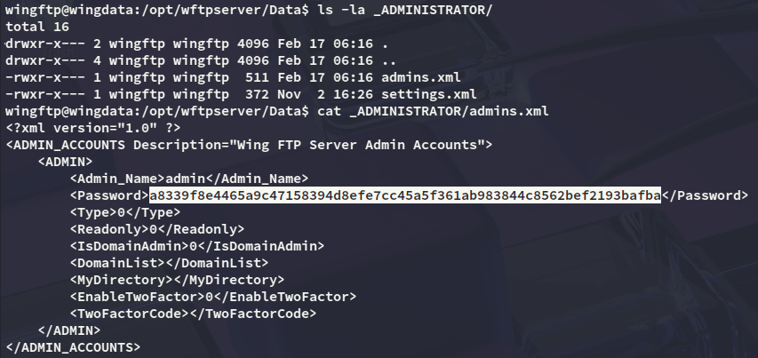

This one was yet again uncrackable, but then I finally stumbled upon something

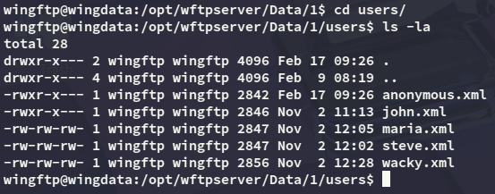

Inside this folder was the `wacky.xml` file, and this is a valid user on the `ssh` server.

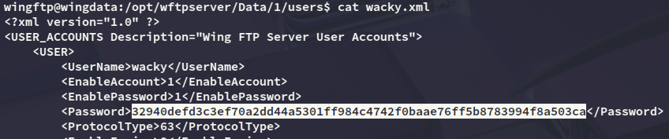

Now all that's left is to crack the hash.

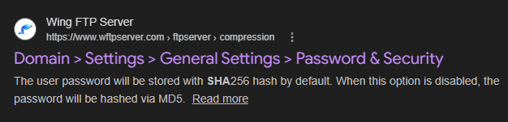

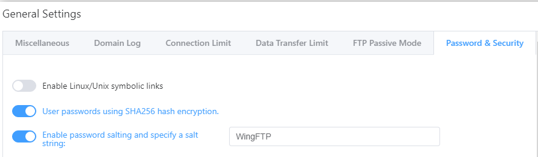

### hashcat

I noticed that I had to use `WingFTP` as the salt so I appended it to my hash, then used `hashcat` to crack it: 

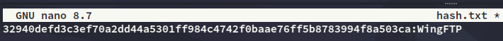

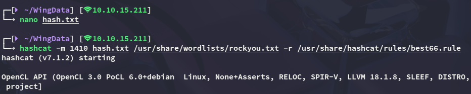

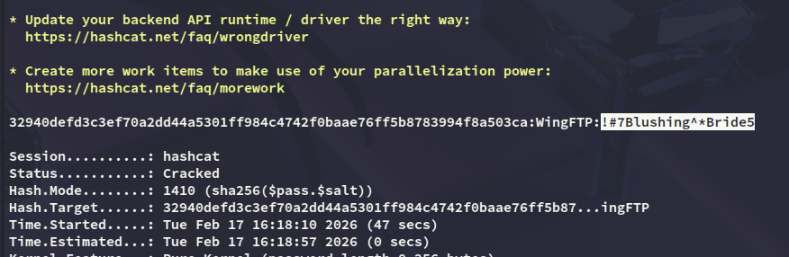

```
wacky
!#7Blushing^*Bride5
```

## Lateral Movement to Wacky

Using the cracked password we can log into the target:

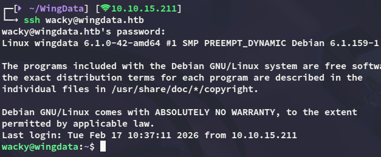

### user.txt

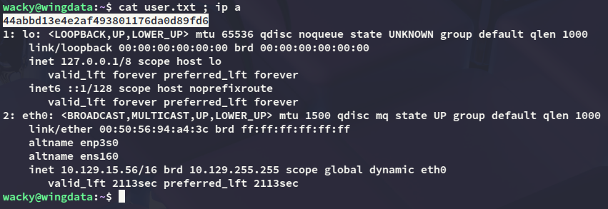

# Privilege Escalation
## CVE-2025-4138

Using `sudo -l` I noticed the following:

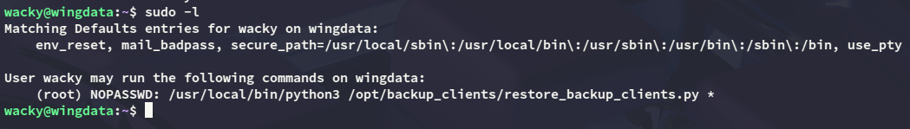

By analyzing the `python` file I found the following:

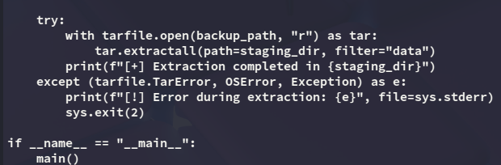

This can be exploited using **CVE-2025-4138** for which there are plenty of PoC's, but I'll be using this one:

https://github.com//thefizzyfish//CVE-2025-4138_tarfile_filter_bypass

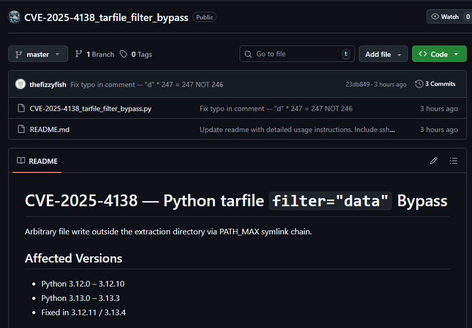

First I created a `ssh` key which I would transfer to the target in order to put it inside the `/root/.ssh` directory.

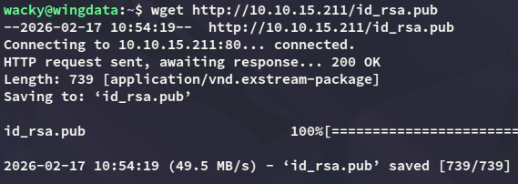

After creating and transferring the `ssh` key I went to work with the PoC:


I then transfer the backup to the correct folder:

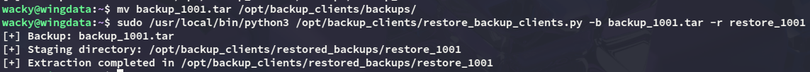

Once the above is done I can connect using my `id_rsa` key:

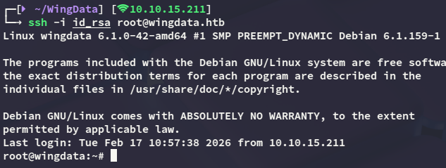

### root.txt

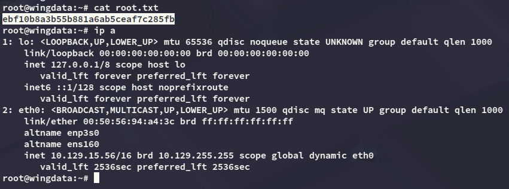


</PasswordProtect>

---
